#  课程大纲：

| 编号 | 名称           | 内容                                                         |
| ---- | -------------- | ------------------------------------------------------------ |
| 1    | ABAP概览       | ABAP是什么？ABAP工作台的使用、建程序、开发规范               |
| 2    | 数据字典       | 数据字典介绍、数据字典功能、新建数据字典中的所有对象         |
| 3    | 语法           | 数据类型、数据对象、数据处理、流程控制、内表定义和使用（增删改查） |
| 4    | SQL语句        | OPEN SQL语句：增删改查数据库数据                             |
| 5    | Function       | 使用Function、新建Function                                   |
| 6    | 选择屏幕和事件 | 选择屏幕以及屏幕事件                                         |
| 7    | Dialog         | 屏幕绘制、屏幕逻辑编写                                       |
| 8    | SMARTFORM      | 新建SMARTFORM、新建STYLE                                     |
| 9    | BDC            | 录制BDC、在程序中调用BDC                                     |
| 10   | 增强           | SAP四代增强的使用                                            |
| 11   | SAP接口        | IDOC、WebService 、RFC 、BAPI                                |
| 12   | ABAP实战       | 实战ABAP项目                                                 |

# 一、ABAP概览

ABAP程序语言 ：

- A：Advanced 高级的  
- B：Business  商业
- A：Application 应用
- C：Programming 程序应用

ABAP : 目录

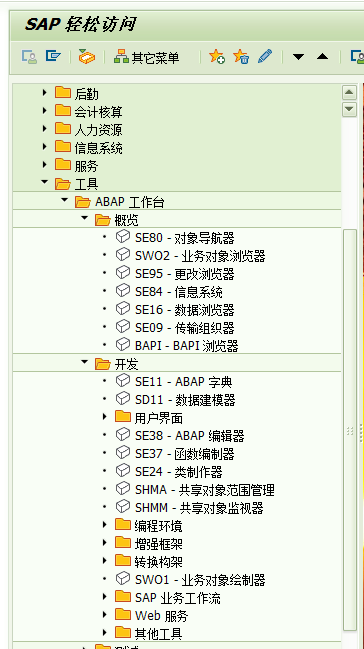


## 1.0ABAP开发简介

### 一、SAP模块角色

1. SAP模块：FI（Financial Accounting）、CO（Controlling）、HR（Human Resource）、SD（Sales and Distribution）、MM（Materials Management）、PM（Plant Maintenance）、PP（Production Planning）、QM（Quality Management）

1. 项目角色：关键用户（End users）、业务顾问（Functional consultants）、开发顾问（Technical consultants）

1. 技术分类：Basis、ABAP、BI/BW、PI、HANA

### 二、环境准备

> 1. 下载安装docker，官方网站：https://www.docker.com/
>
> 2. 修改docker镜像仓库

 ```json
    {
 
  "registry-mirrors": [
 
   "https://docker.mirrors.ustc .edu.cn",
 
   "http://hub-mirror.c.163.com",
 
   "https://registry.docker-cn.com"
 
  ]
 
 }
 ```

> 3. 修改docker镜像默认安装位置，参照网址：https://blog.csdn.net/austindev/article/details/110387609
> 4. 下载docker镜像，参照官网介绍：https://hub.docker.com/_/sap-abap-trial/plans/ac8a4f9b-ae29-4afa-9b39-25aeea24b821?tab=instructions

```dockerfile
# 1. 拉取docker镜像
docker pull store/saplabs/abaptrial:1909
# 2. 创建容器，运行镜像
docker run --stop-timeout 3600 -i --name a4h -h vhcala4hci -p 3200:3200 -p 3300:3300 -p 8443:8443 -p 30213:30213 -p 50000:50000 -p 50001:50001 store/saplabs/abaptrial:1909 -skip-limits-check -agree-to-sap-license
# 3. 停止运行 
docker stop --time 7200 a4h
# 4. 再次运行
docker start -ai a4h
```

> 5. 下载并上传license
>
> 下载地址：https://developers.sap.com/trials-downloads.html?search=ABAP+Platform

```dockerfile
 docker cp A4H.txt a4h:/opt/sap/ASABAP_license
```

> 6. 配置SAP GUI
>
>    Application Server：localhost
>
>    Instance：00
>
>    SID：A4H
>
>    user name：DEVELOPER
>
>    password：Ldtf5432
>
> 7. 参考blog：https://blogs.sap.com/2021/02/16/sap-abap-platform-1909-developer-edition-installation-on-windows-os/
>
> 8. license申请地址：https://go.support.sap.com/minisap/#/minisap

### 三、系统简介

> 1. 三层架构：Presentation Layer、Application Layer、Database Layer（RSBMS：relational database management system）
>
> 2. 业务系统配置：DEV-QAS-PRD或者CUST-QTST-PROD
>
> 3. ABAP系统架构：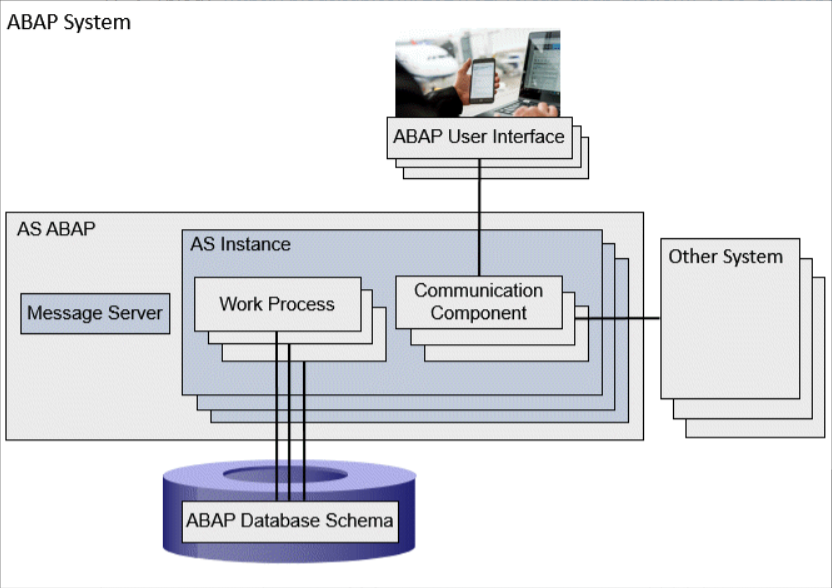会话与内存区域：
>
>    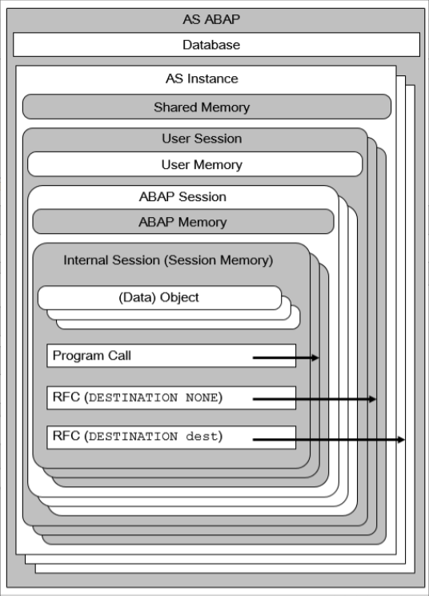

Presentation Layer：SAP GUI

Application Layer：Application Servers and Message Servers


ICM、ABAP Dispatcher、SAP Web Dispatcher、SAP Gateway、SAP start service、Work process、Message Server、Enqueue Server、User Context

1. Database Layer：Database Server/RDBMS

1. Internal Session


### 四、ABAP开发环境简介

> SAP GUI：
>
> 1. Client：T000
>
> 2. 包：
> 	命名前缀：A-S/U-X、Y/Z、/、T、$								
> 创建：se21/spackage
>
> 3. 请求：se01、se09/se10、STMS、se03
>
> 4. SAP Screen：Menu bar、Standard tool bar、Title bar、Application toolbar、Command field、Tree Structure、Status bar
>
> 5. Transaction Codes：01-Create、02-Change、03-Display、N
>   /nxxxx、/*xxxx、/oxxxx
>   /n、/i、/o
>
>   /ns000、/nend、/nex
>   /h
>
> 6. ABAP Workbench
>
> ABAP Editor：se38
>
> Function Builder：se37
>
> Class Builder：se24
>
> Screen Painter
>
> Menu Painter
>
> ABAP Data Dictionary：se11
>
> Object Navigator：se80

> +  /N + TCODE”：退出当前界面，并进入新的界面。例如，当前用户想要从会计科目显示界面跳转到凭证录入界面时，不必返回到初始界面，再输入F-02，直接在命令框中录入“/NF-02”即可（/N和F-02之间可以有空格）。 
> +  /O”：打开新的窗口。SAP中最多可以同时打开6个窗口，用户可以在一个窗口查看报表，另一个窗口中录入凭证，相互不影响。用户可以通过命令“/O” 
> + /i ：结束会话。

Eclipse：

1. 下载地址：https://www.eclipse.org
2. SAP工具仓库地址：https://tools.hana.ondemand.com/#

### 五、参考资料

1. ABAP Keywords documentation：https://help.sap.com/doc/abapdocu_750_index_htm/7.50/en-US/index.htm
2. SAP PRESS：https://www.sap-press.com
3. SDN：https://community.sap.com

## 1.1 ABAP 开发对象

​	表、程序、函数、类、Dialog、Smartform、BDC（批导）、增强、接口（IDOC，WebService，RFC等）

## 1.2 程序管理

### 	1.2.1 开发类/包

- 开发类/包（Development Class ---- Package )
- 存储所有SAP系统开发过程中的相关对象（程序、表结构定义、系统数据类型等），方便进行管理和查询。
- 通过开发包方便的实现其包含的对象在不同服务器的批量传输。传输是通过请求号，请求号是文件，用于记录所有对象的修改记录。
- 不属于任何开发包的对象，可分配给本地开发包$TMP，该类中的对象不能进行系统间传输，主要用于测试。

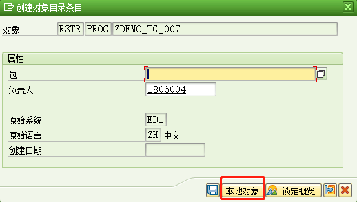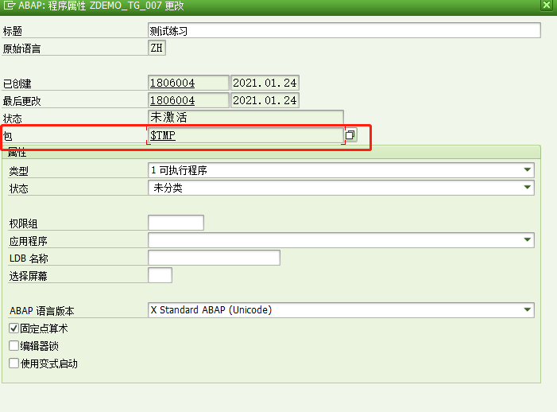

#### 1.创建开发类/包

+ T-Code ：SE21 

  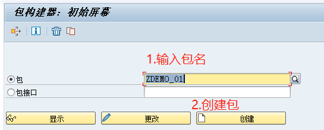

+ 输入描述（可选应用程序组件、程序组件、类型等，一般默认即可）

+ 


创建对应的请求


#### 2.查看、创建请求

T-code: SE09

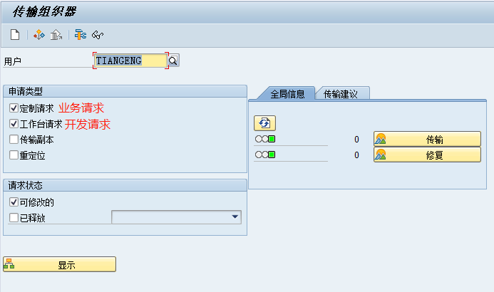


#### 3.查看包/类 

+ T-code : SE80 ,对象浏览器
+ 同一开发类下可组织多个对象，方便进行管理和查询

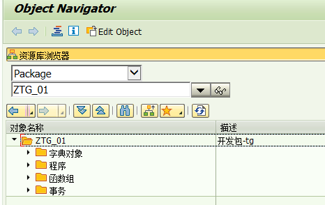

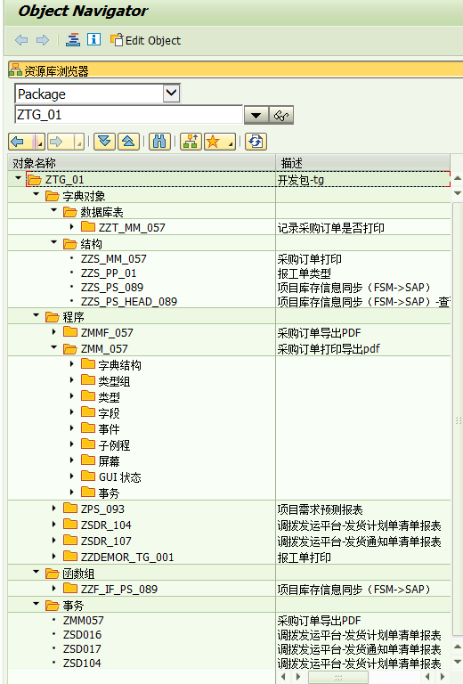


### 1.2.2 程序建立过程

程序分类： ① 报表程序：ALV   ②  对话程序 。

程序建立过程：T-code : SE38


```mermaid
graph LR
A[新建程序] -->B(设置程序属性)
B--> C(选择开发类) 
C -->D( 新建/选择请求)
D --> E(编辑代码) 
E--> 执行程序 
```

1. 新建程序

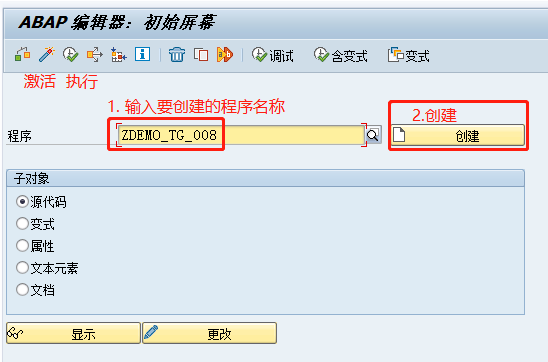

2. 设置程序属性

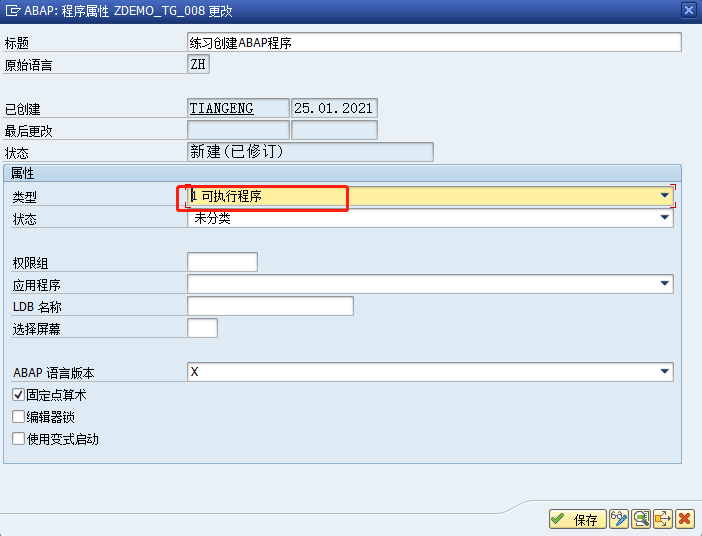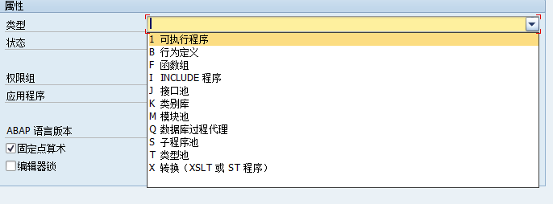

> 程序属性：
>
> 1. 可执行程序：① 可以通过ABAP EDITOR直接运行。② 一个processing blocks set 按照预先定义好的顺序执行③可以使用标准的selection screen ④ 主要用来显示list
>
> 2. 模块池 ：
> 3. 函数组
> 4. Include程序
>
> 程序状态：一般不维护
>
> 1. P ： SAP标准生产程序 。 K：客户生产程序 。 S ： 系统程序 。 T ： 测试程序。

3. 选择开发类

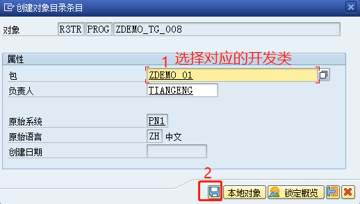

4. 新建、选择请求


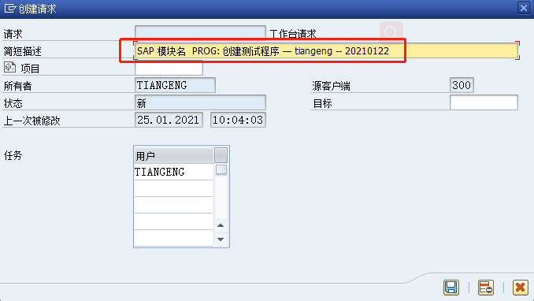

5. 编辑代码

   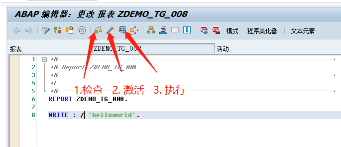

执行结果：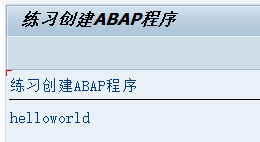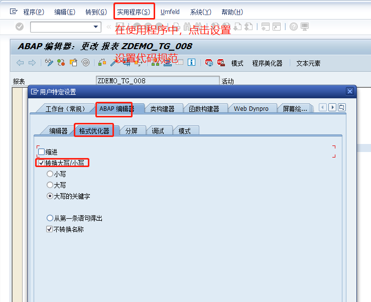

## 1.3 代码规范

略


## 1.4   GUI的基本操作

### 1.事务代码显示属性设置

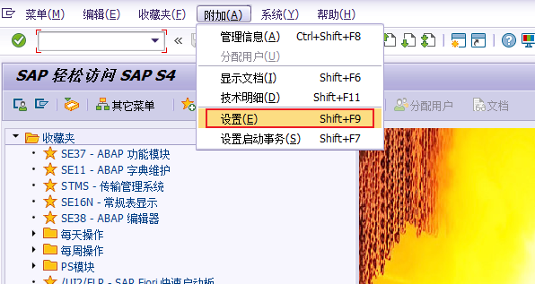

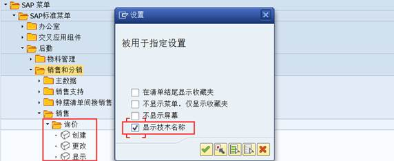

> 设置后就可以显示出事务代码前缀了


### 2.下拉列表显示属性设置

>  如果不设置是不显示属性的

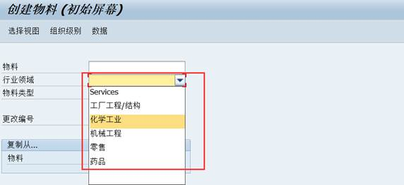

> 选择选项(其实也可从GUI的选项进入)

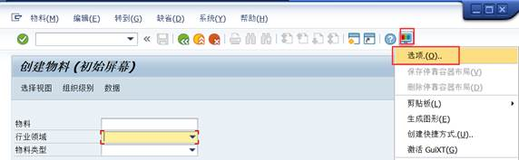

如下设置

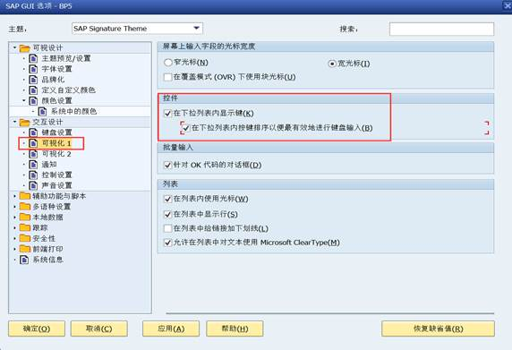

设置完成后即可显示

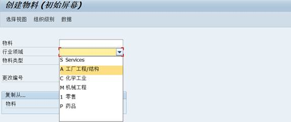

### 3.快捷键

1. 设置非关键字提示功能：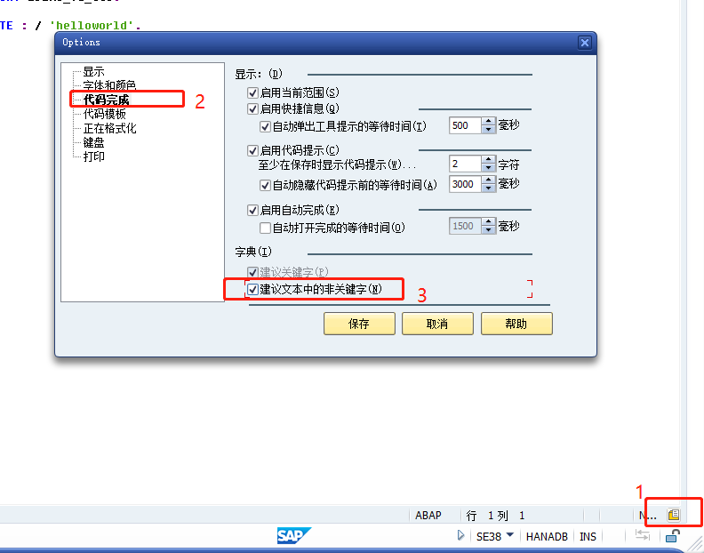
2. 快速调整字体大小 ： Ctrl + 鼠标滚轮
3. 剪切一行 ：Ctrl + shift + X

> 快速调整字体大小 Ctrl ＋ 鼠标滚轮 
>
> 剪切一行  Ctrl + Shift + X 
>
> 删除一行  Ctrl + Shift + L 
>
> 复制一行  Ctrl + Shift + T 
>
> 转成小写  Ctrl + L 
>
> 转成大写  Ctrl + U 
>
> 大小写相互转换  Ctrl + K 
>
> 取消  Ctrl + Z 
>
> 重做  Ctrl + Y
>
> 原地复制一行 Ctrl + D

# 二 、 数据字典

## 1.ABAP数据字典介绍

+ ABAP 数据字典是定义和**管理数据元素**及**数据库元素**的中心工具，系统的所有全局数据类型以及数据库表结构都需要在数据字典中创建和维护。数据字典保证了数据的完整性、一致性、安全性。
+ T-code : SE11.

## 2.数据字典功能

> + 定义系统全局数据类型（基本类型、结构、表结构等）
> + 定义数据库对象结构（数据库表、视图）
> + 屏幕字段的格式化
> + 定义搜索帮助
> + 定义锁对象

## 3.数据字典中的对象

ABAP字典中的基本对象： 表、视图、数据类型、域、搜索帮助和锁对象。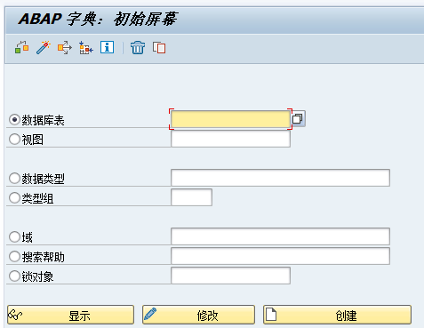

>  表 ：是数据库中实际存放数据的地方，在数据字典定义的是表的结构，由行、列组成 。表中的列通过数据元素来定义。
>
>  视图： 是由一个或多个数据库表的逻辑表现形式，它本身不存储数据。视图有4中类型：
>
>  > 1. Database View: 对一张或多张表按照连接条件和选择条件筛选后的数据显示视图。连接方式：inner join。
>  > 2. Projection view : 数据来自一张表，用于屏蔽一些字段。
>  > 3.  Maintenance view : 允许你进行对几个表的数据进行修改，参与连接的表必须存在外键，他们的连接条件是不能自定义的，要维护和显示数据必须要生成表格维护对话框（在表格生成器中维护），所有主键要在视图的字段里。
>  > 4. Help view： 
>
>  数据类型：数据结构中的定义是一个值得集合以及定义在这个值集上的一组操作。三种类型：
>
>  > 1. Data element : 基本的数据单位，没有结构。
>  > 2. Structure  : 由数据元素或其他的数据类型组成的一个特定结构。
>  > 3. Table type: table 类型的数据元素，可存放多行数据。
>
>  类型组：是一个定义了多个数据类型的程序，类型组里的数据类型通过在ABAP程序开始声明TYPE-POOL后使用。
>
>  域：指定了列的属性及允许值。它通过数据元素和表的列相关联。
>
>  搜索帮助：用于提高用户友好性和程序的多样性，可用于自建表或数据元素。
>
>  锁对象： 对数据访问进行并发控制。

## 4.自建表 - 基本数据类型

新建表： 需求模拟场景：新建一张销售清单表字段。

| 字段     | 名称     | 数据类型    | 长度    |
| -------- | -------- | ----------- | ------- |
| MANDT    | 客户端   | CLNT        | 3       |
| ZSALESID | 销售凭证 | char        | 10      |
| ZGSDM    | 公司代码 | CHAR        | 4       |
| ZXSRQ    | 销售日期 | DATS        | 8       |
| ZXSRY    | 销售人员 | CHAR        | 10      |
| ZXSWL    | 销售物料 | CHAR        | 10      |
| ZXSSL    | 销售数量 | numc / quan | 8       |
| ZXSDJ    | 销售单价 | CURR        | 15   2  |
| ZXSJE    | 销售金额 | CURR        | 15   2  |
| ZWAERK   | 凭证货币 | CUKY        | 5     0 |

创建表：T-code : SE11

### 1.SE11 创建表

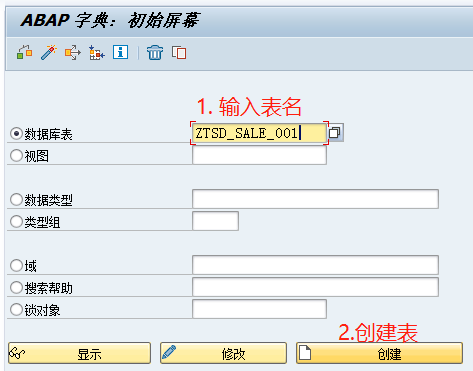

### 2.维护基本属性

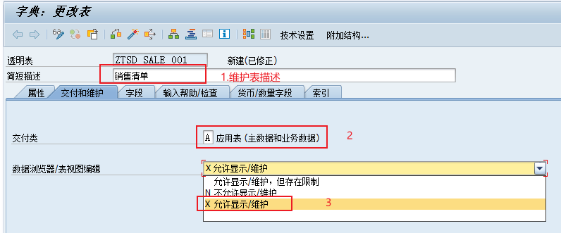

### 3.设置字段

本次通过数据类型设置字段。（也可以通过数据元素设置字段） <font color='red'> 表字段中的主键必须连续，且排在前面 </font>

>  **初始值：如果字段是后续添加的需要勾选初始值，不然字段之前的数据会显示 null**

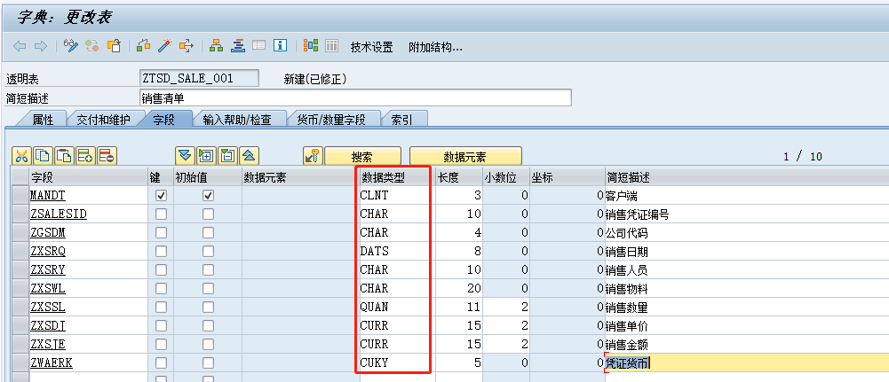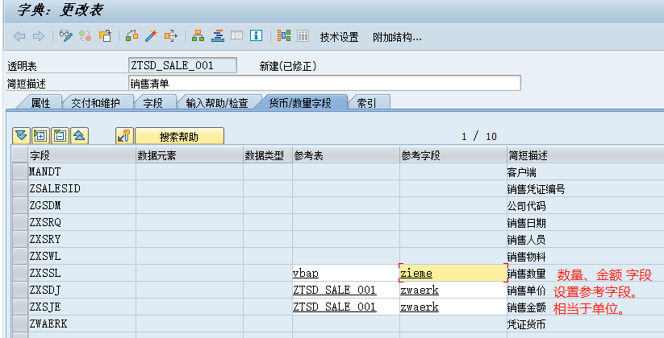

###  4.技术设置 

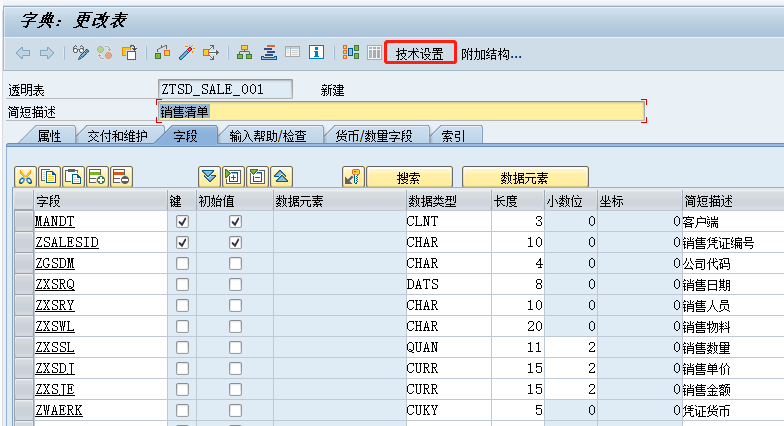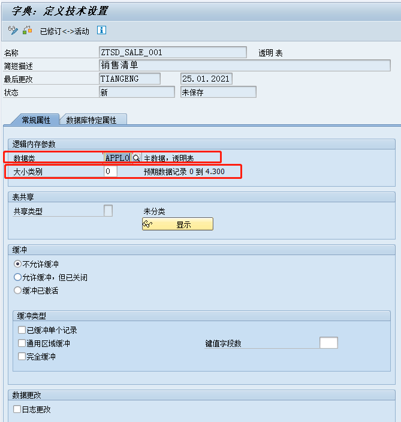

### 5.保存表

+ 设置表存放的包，请求。

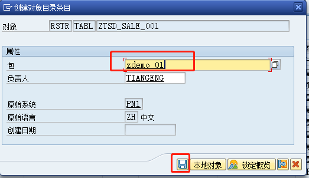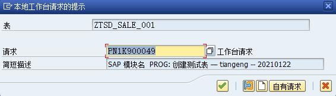

### 6.检查 、激活表

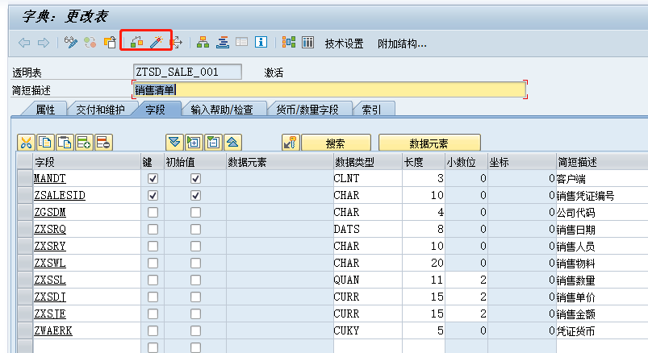

## 5.自建表-数据元素

### 1.维护表相关属性

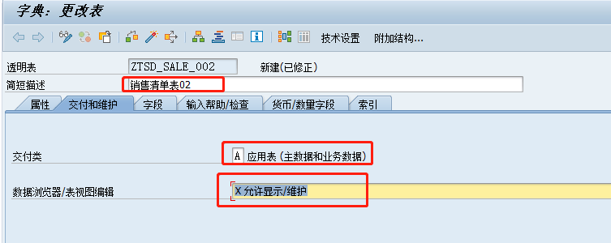

### 2.设置字段 

2.1 设置数据类型 - 数据元素  T-code : SE11

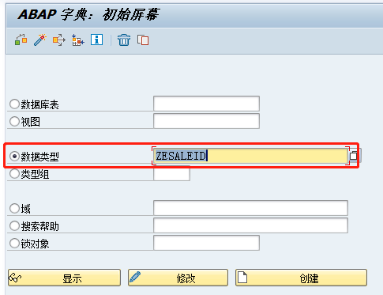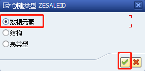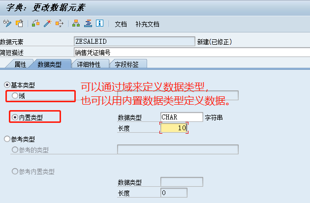


### 3.检查、激活表。

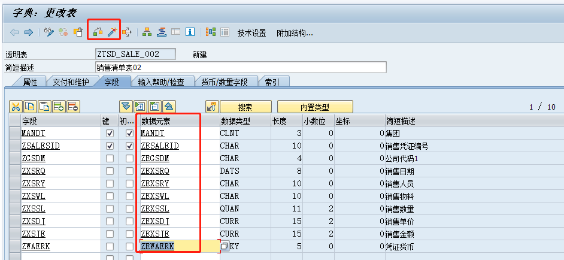		

## 6.维护表格生成器

维护表数据，可以通过SE16、SE16N 。也可以通过表格生成器进行数据维护。

### 1.在SE11 ，查到表点击修。（SE54也可以维护）

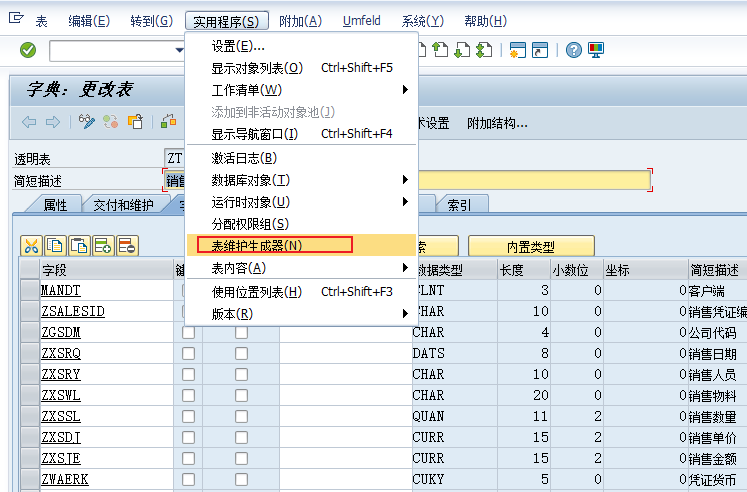

### 2.维护相关属性

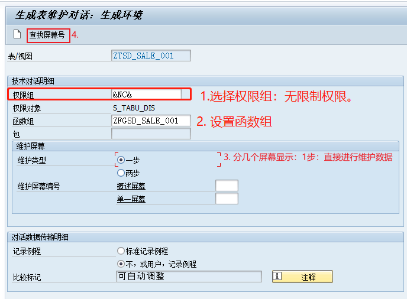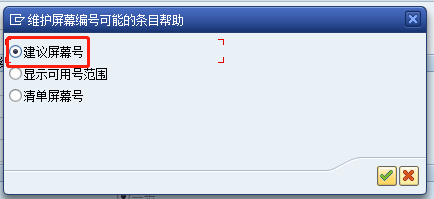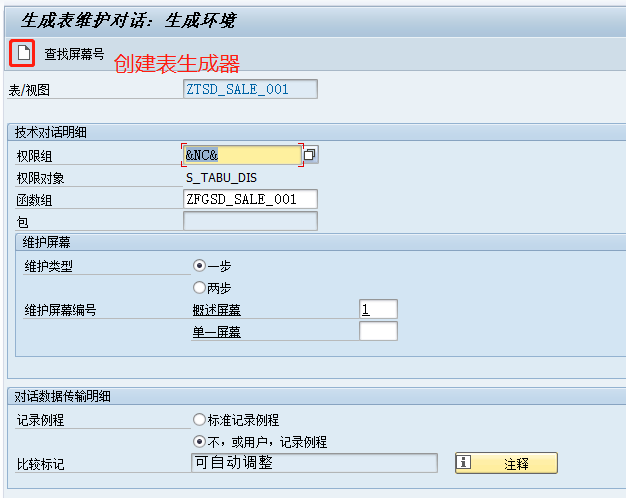

##### 2.1设置函数组方法：

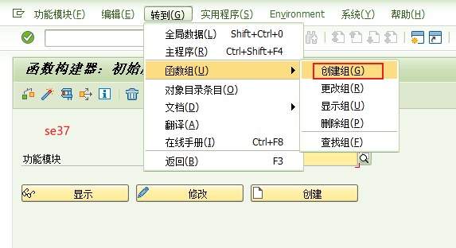

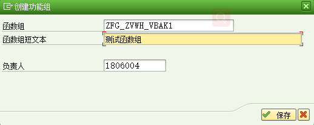

保存函数组

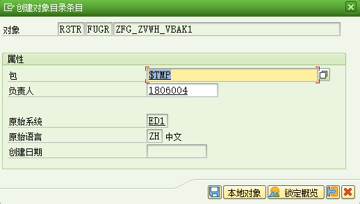

激活函数组：SE80

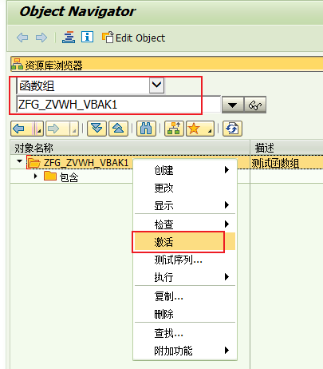

### 3.通过SM30 维护表数据

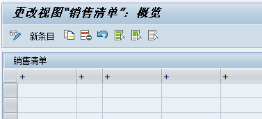

### 4.如果修改了表内容：重新生成表格生成器。

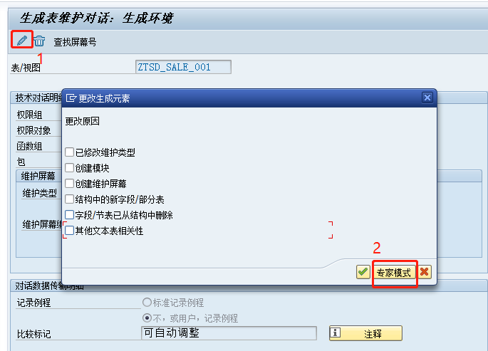

## 7.外键

> 如果两个表中有一个公有字段，它在一个表中是主键，那么这个公有字段可以在另外一个表中作为外键。这两张表一张称为主表，另外一张表称为外键表。主要目的是控制存储外键表中的数据，使两张表形成关联，外键只能引用主表中的列的值或使用空值。
>
> 外键类型：描述了外键字段在外键表中的类型
>
> + 非关键字/非基数：外键字段不是主键
> + 关键字：是主键字段或者能够唯一确定记录
> + 文本表关键字：

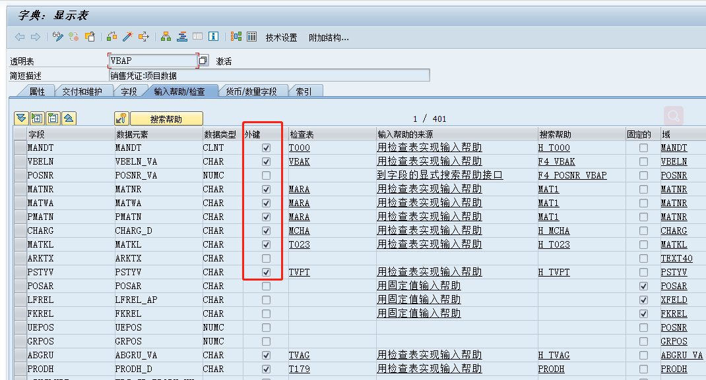

### 1.设置外键


关联表：抬头表


## 8.视图

### 8.1 创建数据库视图

#### 1.创建视图 SE11


#### 2.设置关联表，表关联关系：根据外键生成关联关系。


#### 3.设置视图显示字段


#### 4.设置选择条件


维护状态无需处理，默认即可。


#### 5.保存视图，激活视图


### 8.2 创建维护视图

#### 1.创建维护视图SE11


#### 2.设置关联表


#### 3.维护要显示的字段


#### 4.设置条件


#### 5.维护状态：


#### 6.保存激活

#### 7.维护表生成器

> 不维护表生成器，不能查看视图。


查找屏幕号


创建表生成器：


## 9.表结构

### 1.创建表结构 

T-code : SE11


输入字段


保存表结构，激活结构。

### 2.创建表类型


保存，激活。

## 10.搜索帮助

> 分类： 基本搜索帮助&综合搜索帮助
>
> 基本搜索帮助：单个页面。
>
> 综合搜索帮助：多个页签。

### 1.创建搜索帮助

T-code ：SE11 ,创建一个查询单位信息的搜索帮助。


先创建基本搜索帮助


列表：数据显示顺序，要显示数据，必须维护。选择：筛选条件显示顺序，必须维护。


### 2.使用代码创建搜索帮助

```abap
*&---------------------------------------------------------------------*
*& Report ZDEMO_TG_LX_12
*&---------------------------------------------------------------------*
*&
*&---------------------------------------------------------------------*
REPORT zdemo_tg_lx_12.

*&------------------------------------------------------*
*& Selection Screen / 选择屏幕 定义选项
*&------------------------------------------------------*

PARAMETERS : s_kunnr2 TYPE kna1-kunnr.

AT SELECTION-SCREEN ON VALUE-REQUEST FOR s_kunnr2.
  PERFORM show_f4.

FORM show_f4.

  TYPES: BEGIN OF t_kunnrhelp,
           kunnr TYPE kna1-kunnr,
           name1 TYPE kna1-name1,
           stras TYPE kna1-stras,
         END OF t_kunnrhelp.

  DATA:wa_kunnrhelp TYPE t_kunnrhelp,
       it_kunnrhelp LIKE TABLE OF wa_kunnrhelp.

  SELECT kna1~kunnr
    kna1~name1
    kna1~stras INTO CORRESPONDING FIELDS OF TABLE it_kunnrhelp
    FROM kna1
    WHERE  kna1~kunnr = '0000081010'.

*AT SELECTION-SCREEN ON VALUE-REQUEST FOR p_saknr.
  CALL FUNCTION 'F4IF_INT_TABLE_VALUE_REQUEST'
    EXPORTING
      retfield    = 'KUNNR'  "搜索帮助内表要输出的帮助字段名
      dynpprog    = sy-repid
      dynpnr      = sy-dynnr
      dynprofield = 'S_KUNNR2'
      value_org   = 'S'
    TABLES
      value_tab   = it_kunnrhelp. "存储搜索帮助内容的内表
  IF sy-subrc <> 0.
    MESSAGE '没有相关搜索帮助' TYPE 'I'.
  ENDIF.


  CLEAR it_kunnrhelp.
  FREE: it_kunnrhelp.
ENDFORM.
```

运行效果：


---

---

### 3.搜索帮助创建案例

>  SAP主要用于处理企业数据和业务逻辑，有独特的设计风格和完整的技术架构。用户在初用SAP GUI时，会发现界面上的搜索帮助无处不在。这些搜索帮助给查询带来很大便利，同时也带给用户一个印象，这是一个成熟严谨的企业级产品，而不是一个匆忙上线的半成品。

搜索帮助的主要作用是便于用户从一张表或视图中，快速搜索得到想要的结果。SAP GUI常见的搜索帮助如下图：


搜索帮助的操作过程如下：

1、点击右侧搜索按钮，也可以用快捷键F4触发搜索功能。

2、弹出搜索条件界面，输入搜索条件。

3、得到搜索结果。双击其中一条记录，初始界面得到返回值。

搜索帮助是属于数据字典的一部分，下面我们来仔细看看如何实现一个系统标准的搜索帮助。为了便于展示，我们先创建2张表，关于如何创建表，请参考[数据字典概述](https://zhuanlan.zhihu.com/p/57852468)。

1、员工表ZEMPLOYEE，用于保存员工基本信息。


2、部门员工表ZDEPEMP，用于保存部门与员工的关系。


准备工作做好后，我们开始创建一个标准搜索帮助。用户可以通过这个搜索帮助在界面上快速搜索到员工编号。


步骤1：事务码SE11，选择搜索帮助，输入名称ZEMPNO_ESH1，建议以_ESH结束，创建。

步骤2：输入简短描述。

步骤3：输入选择方法，这里可以是一张透明表，也可以是一个视图。这里我们输入员工表ZEMPLOYEE。

步骤4：输入对话行为，可以选择直接显示结果，也可以选择先弹出输入条件界面，再显示结果。

步骤5：输入搜索帮助参数，参数都来源于员工表ZEMPLOYEE中的字段。

IMP： 输入参数，这里可以定义作为搜索条件的字段。

EXP：输出参数，这里可以定义结果表中显示的字段。

列表LPos：定义结果字段的显示顺序。

选择SPos：定义选择字段的显示顺序。

步骤6：保存激活。

至此，我们创建了一个标准的搜索帮助ZEMPNO_ESH1，但要在屏幕字段中使用搜索帮助，还必须把搜索帮助赋给相应的对象，SAP提供了四种使用标准搜索帮助的方法。


**数据元素：**

将搜索帮助赋给数据元素，那么所有使用这个数据元素的屏幕字段都可以使用该搜索帮助。很好的实现了复用，但要求必须指定一个搜索帮助的返回值给数据元素。


赋值给数据元素后，所有与数据元素ZE_EMPNO相关联的屏幕字段，都自动实现了搜索功能。


**检查表：**

搜索帮助赋值给检查表，那么所有使用该检查表的外键关联表都自动实现搜索帮助功能。


在检查表ZEMPLOYEE指定搜索帮助后，与它有外键关联的表ZDEPEMP-EMPNO则实现了搜索帮助功能。

**表字段：**

也可以将搜索功能直接赋值给一个表字段，那么这个表字段则实现了搜索帮助功能。


**屏幕字段：**

可以直接将搜索帮助赋值给屏幕字段，如果是在报表中使用，可使用下列语句，

> PARAMETERS: p_empno type zdepemp-empno MATCHCODE OBJECT zempno_esh1.


----

---

### 4.搜索帮助增强

先回顾下上一篇数据字典搜索帮助的内容。首先，创建一个系统标准搜索帮助ZEMPNO_ESH1。


创建完成后，赋值给相关对象，比如数据元素ZE_EMPNO。激活生效后，我们看到屏幕上实际的使用效果是这样的。


现在有个小需求，需要将姓氏和名字合成一个字段<姓名>，该如何实现？可以使用搜索字段的增强来完成。我们新建一个搜索帮助ZEMPNO_ESH2，在之前ZEMPNO_ESH1的基础上，稍作改造。


步骤1：调整输出参数，去掉FNAME, LNAME, 新增一个字段NAME1。

步骤2：指定搜索帮助增强，(增强又称作出口）。系统有一个样例Function <F4IF_SHLP_EXIT_EXAMPLE> 可供参考，可将样例拷贝至ZF4IF_SHLP_EXIT_EMPNO， 通过事务码SE37查看，会看到有个变量CALLCONTROL-STEP，这代表了搜索帮助处理过程中的各个事件，包括SELONE，PRESEL，SELECT，DISP等，每一个事件在程序中都有详细的备注说明。我们可以在DISP事件中添加一段代码：

```abap
  IF callcontrol-step = 'DISP'.
*   PERFORM AUTHORITY_CHECK TABLES RECORD_TAB SHLP_TAB
*                           CHANGING SHLP CALLCONTROL.
    DATA ls_record LIKE LINE OF record_tab.
    DATA lv_name TYPE string.
    LOOP AT record_tab INTO ls_record.
      lv_name = ls_record-string+9(10).
      CONDENSE lv_name.
      lv_name = | { ls_record-string+9(10) }{ ls_record-string+19(10) } |.
      CONDENSE lv_name.
      ls_record-string+74(10) = lv_name.
      MODIFY record_tab FROM ls_record.
    ENDLOOP.
    EXIT.
  ENDIF.
```

这段代码主要是用于合并姓氏和名字，合并后更新回结果列表 recode_tab, 如果初学的朋友们对这些代码感到陌生，没关系，可以先大概了解，后面熟悉语法后再回头来看。

创建完搜索帮助ZEMPNO_ESH2，将其赋给数据元素ZE_EMPNO。我们看看屏幕上实际使用的效果。


可以看到，姓氏和名字已经合并成姓名字段了。增强完成.

## 11.锁对象

> 对数据访问进行并发控制。

### 1.创建锁对象

T-code:SE11


设置完锁表条件，保存，激活锁对象。

表结构：


数据：


### 2.查看函数

> T-code : SE37


### 3.调用示例代码

```ABAP
*&---------------------------------------------------------------------*
*& Report ZDEMO_TG_010
*&---------------------------------------------------------------------*
*&
*&---------------------------------------------------------------------*
REPORT ZDEMO_TG_010.

* ---针对ZTVBAK 中0000000002数据加锁-----*
CALL FUNCTION 'ENQUEUE_EZTVBAK'
 EXPORTING
*   MODE_ZTVBAK          = 'E'
   MANDT                = SY-MANDT
   VBELN                = '0000000002'
*   X_VBELN              = ' '
*   _SCOPE               = '2'
*   _WAIT                = ' '
*   _COLLECT             = ' '
 EXCEPTIONS
   FOREIGN_LOCK         = 1
   SYSTEM_FAILURE       = 2
   OTHERS               = 3 .

IF sy-subrc = 0.
  BREAK-POINT .
ENDIF.

* ---针对ZTVBAK 中0000000002数据解锁-----*
CALL FUNCTION 'DEQUEUE_EZTVBAK'
 EXPORTING
*   MODE_ZTVBAK       = 'E'
   MANDT             = SY-MANDT
   VBELN             = '0000000002'
*   X_VBELN           = ' '
*   _SCOPE            = '3'
*   _SYNCHRON         = ' '
*   _COLLECT          = ' '
          .
```

> T-code : SM21 查看锁


> 通用加锁与解锁函数不需要创建表的锁对象就可以直接使用

```ABAP

" 加锁
 LOOP AT gt_alv1 INTO DATA(ls_alv1) WHERE flag = 'X'.

      DATA:lv_table TYPE tabname.
      CLEAR:lv_table.
      lv_table = 'ZZTSD003_1'.
      CLEAR:lv_varkey.
      lv_varkey = |{ ls_alv1-vbeln }{ ls_alv1-posnr }|.

      CALL FUNCTION 'ENQUEUE_E_TABLE'
        EXPORTING
          mode_rstable   = 'E'
          tabname        = lv_table
          varkey         = lv_varkey
*         X_TABNAME      = ' '
*         x_varkey       = '#'
          _scope         = '3'
*         _WAIT          = ' '
*         _COLLECT       = ' '
        EXCEPTIONS
          foreign_lock   = 1
          system_failure = 2
          OTHERS         = 3.
      IF sy-subrc <> 0.
        gt_msg = VALUE #( BASE gt_msg
                                ( msgid = sy-msgid      msgty = sy-msgty
                                  msgno = sy-msgno      msgv1 = sy-msgv1
                                  msgv2 = sy-msgv2      msgv3 = sy-msgv3 ) ).

      ENDIF.
    ENDLOOP.
 
"  解锁
 LOOP AT gt_line INTO DATA(ls_line).

    DATA:lv_table TYPE tabname.
    CLEAR:lv_table.
    lv_table = 'ZZTSD003_1'.
    CLEAR:lv_varkey.
    lv_varkey = |{ ls_line-vgbel }{ ls_line-vgpos }|.

    CALL FUNCTION 'DEQUEUE_E_TABLE'
      EXPORTING
        mode_rstable = 'E'
        tabname      = lv_table
        varkey       = lv_varkey
        _scope       = '3'.

  ENDLOOP.

```


> _scope：1 表示程序内有效； 2 表示 update module 内有效； 3 全部
>
> _wait 表示如果对象已经被锁定,是否等待后再尝试加锁,最大的等待时间有系统参数 ENQUE/DELAY_MAX控制
>
> _COLLECT 参数表示是否收集后进行统一提交,COLLECT 是一种缓存与批处理方法,即如果指定了Collect,加锁信息会放到Lock Container 中,Lock Container实际上是一个funciton Group控制的内存区域,如果程序中加了很多锁,锁信息会先放到内存中,这样可以减少对SAP锁管理系统访问,若使Lock Container中的锁生效,需执行FLUSH_ENQUEUE 这个Funciton,将锁信息更新到锁管理系统中,此时加锁操作生效,使用函数RESET_ENQUEUE可以清除Lock Container中的锁信息

## 12.表增强

### 1.include 增强

> 结构增强


### 2.append 方式


# 三、语法

> 分类：
>
> 1.数据类型和数据对象
>
> 1.1 数据类型
>
> + 数据对象的技术特性的定义
> + 本身不占用内存空间
> + 可以是系统预定义或用户自定义
>
> 1.2数据对象
>
> + 内存变量
> + 指定为某一特定数据类型
>
> 2.数据输出
>
> 3.数据处理
>
> 4.流程控制

## 1.数据类型

### 1.1常用预定义数据类型

| 序号 | 类型缩写 | 类型   | 默认长度 | 最大长度       | 初始值     | 描述                           |
| :--: | :------- | ------ | -------- | -------------- | ---------- | ------------------------------ |
|  1   | I        | 整型   | 4        | 10             | 0          | 带正负符号的整数               |
|  2   | int8     | 整型   | 8 byte   |                |            |                                |
|  3   | P        | 压缩型 | 8        | 16             | 0          | 将两个十进制数字压缩到一个字节 |
|  4   | F        | 浮点型 | 8        | 8              | 0          | 浮点数                         |
|      |          |        |          |                |            |                                |
|  5   | C        | 文本型 | 1        | 1~262143个字符 | space      | 字符串数据，如‘program’        |
|  6   | N        | 数值型 | 1        | 31             | ‘00.....0' | 数值是所组成的字符串           |
|      |          |        |          |                |            |                                |
|  7   | D        | 日期型 | 8        | 8              | ‘00000000’ | 日期数据，格式YYYYMMDD         |
|  8   | T        | 时间型 | 6        | 6              | ’000000‘   | 时间HHMMSS                     |

> 1. 默认的定义数据类型是CHAR。
> 2. 取值的时候C型默认从左取，N型从右取，超过定义长度则截断。
> 3. C类型，可以赋值数值，也可以赋值字符，还可以混合，不过取值时如果是数值类型靠右取值。
> 4. 日期和时间类型的变量可进行加减乘除运算。
> 5. P类型.小数点要使用DECIMAL声明

```abap

*&============预定义数据类型：变量============*7
DATA lv_I TYPE i.
DATA lv_p TYPE p.

DATA lv_c TYPE c.
DATA lv_N TYPE n.

DATA lv_F TYPE f.

DATA lv_D TYPE d.
DATA lv_t TYPE t.


write : / 'lv_i:',lv_i. "
write : / 'lv_p:',lv_p. "

*lv_c = '123456'." C 类型没有给定长度 默认长度为1.
write : / 'lv_c:',lv_c. " 1
write : / 'lv_n:',lv_n. "

write : / 'lv_f:',lv_f. "

write : / 'lv_d:',lv_d. "
write : / 'lv_t:',lv_t. "

lv_p = '100.345'.
WRITE :/ 'lv_p',lv_p. " 100   P类型有小数要设置小数位，不然只输出整数

DATA lv_p1 type p LENGTH 10 DECIMALS 3 .
lv_p1 = '1234567890.2345'.
WRITE : / 'lv_p1' , lv_p1.

data lv_c1(10) type c value 'abcdefg123889'. "
WRITE : / 'lv_c1:' , lv_c1.


DATA lv_n1 type n value '234'.
WRITE : / 'lv_n1' , lv_n1. " 输出4

data lv_n2(4) type n .
lv_n2 = 123.
WRITE : / 'lv_n2' , lv_n2. " 输出0123

data str type string.
str = '12345'.
WRITE : / 'str= ' , str.

DATA lv_d1 type d value '20210101'.
lv_d1 = lv_d1 + 1. " 时间可以直接计算
WRITE :/'lv_d1', lv_d1. " 20210102 结果
```


### 1.2自定义数据类型

定义数据类型——TYPES

> 在程序中使用types 声明局部数据类型
>
> 语法格式与变量类似
>
> 用types定义的类型在程序中用于声明常量或变量
>
> types定义的是类型，不是变量，所以不能直接赋值
>
> ABAP数据类型可以是预定义数据类型，可以是数据字典里的全局数据类型，或者用户在程序中自定义的数据类型。

```ABAP
TYPES: begin of employee ,
        code(10) type c,
        name(10) type c,
        end of employee.
types: address(50) type c.

data: emp   type employee.
data: myadd type address.

emp-code = '1001'.
myadd    = 'this is address'.
WRITE :/ emp.
write :/ myadd.
```

## 2.数据对象

> + 数据对象（如文本、变量、常量）
> + 主要指变量
> + 变量再程序运行过程中值会变化


### ①变量

> 变量定义包含name,length,type等，语法如下：
>
> DATA   <name>  [<length>]  type  <type> [value  <value>] [decimal  <decimals>]
>
> 其中<> 表示名称   [ ] 表示内容可选。
>
> <name> : 变量名称，最长30个字符，不可含有+ . , : ( ) 等字符
>
> <length> : 长度，要用圆括号括起来  如 LINE(20)  TYPE  C.
>
> <type> : 数据类型
>
> <value> : 初始值
>
> <decimals>: 小数位 

```ABAP
	  DATA ：   C1 type C,
              INT1 type I value 1,
              Tem  type P DECIMAL 2.	
```

> 通过关键字LIKE 定义变量
>
> DATA   <name>  [<length>]  LIKE  <type> [value  <value>] [decimal  <decimals>]
>
> TYPE / LIKE 区别：
>
> 在声明语句 中定义对象 的数据类型 ，有下列方 式之一
>
> + 直接地， 使用    <declaration>...TYPE <datatype> ....
>
> + 间接地， 使用   <declaration>  LIKE <dataobject> ....
>
> 对下面列出 的大多数数 据声明语句 ，TYPE 和 LIKE 是可选的附 加项。
>
> + 利用 TYPE 选项，可以 直接将数据 类型 <datatype> 分配给已声 明的数据对 象。
>
> + 利用 LIKE 选项，可以 将另一个数 据对象 <dataobject> 的数据类型 分配给已声 明的数据对 象。这意味 着间接引用 数据类型。

```abap
Data: mydata like sy-datum.
```

### ②常量

> 常量定义使用CONSTANS
>
> CONSTANTS <常量名>  [<长度>] TYPE <数据类型> VALUE <默认值>
>
> +  常量值一旦被定义，即长期保村在内存，其值无法改变。
> + CONSTANTS  PI  type  P  decimals   5  value '3.14159'.

### ③系统定义对象

> **系统变量定义在结构 SYST里**
>
> SY-SUBRC : 系统执行某指令后，表示执行成功与否的变量，0 表示成功
>
> SY-UNAME: 当前使用者登入SAP的USERNAME
>
> SY-DATUM：当前系统日期
>
> SY-UZEIT :当前系统时间
>
> SY-LANGU： 当前语言
>
> SY-TCODE : 当前执行程序的Transaction code 
>
> SY-INDEX : 当前Loop 循环过的次数
>
> SY-VLINE: 画竖线
>
> SY-ULINE:画横线
>
> 。。。


### ④结构

> 结构体定义：
>
> + 有结构的变量
> + 程序中用DATA定义的局部变量
>
> 结构体变量定义
>
> DATA ： BEGIN  OF <name>, 
>
> ​				<field1> ...
>
> ​				<field2>...
>
> ​		END OF <name>.

```ABAP
*&----------结构-------*
TYPES :BEGIN OF ty_stu,
         num  TYPE n LENGTH 4,
         name TYPE c LENGTH 18,
         age  TYPE i,
       END OF ty_stu.

DATA stu TYPE ty_stu.
stu-num = 1.
stu-name = 'jack'.
stu-age = 18.

*&--第二种定义方式
DATA:BEGIN OF stu1 ,
       num  TYPE n LENGTH 4,
       name TYPE c LENGTH 8,
       age  TYPE i,
     END OF stu1.
stu1-num = '2'.
stu1-name = 'AB'.
stu1-age = 20.
```

> 结构体赋值
>
> + 对结构体直接赋值  userinf-sid  = '101'.
> + 相同结构体 用 “ = ” 号来实现数据复制。 user2 = userinf. 
> + 相同结构体之间使用 MOVE ... TO ...进行赋值。有差异结构体，使用 MOVE-CORRESPONDING   TO 

```ABAP

DATA:BEGIN OF userinf,
       sid(10)  TYPE c,
       name(20) TYPE c,
       tel(20)  TYPE c,
     END OF  userinf.
DATA user2 LIKE userinf.

userinf-sid  = '101'.
Userinf-name = '张三'.
WRITE / '------------------'.
WRITE : / Userinf.

user2 = userinf.  " 结构体赋值
WRITE : /'---------'.
WRITE : / user2.

DATA: BEGIN OF userall ,
        sid(10)  TYPE c,
        name(20) TYPE c,
        birdate  TYPE d,
        add(50)  TYPE c,
      END OF userall.

MOVE-CORRESPONDING userinf TO userall.

WRITE : /'-----------'.
WRITE :/ userall.
```


> 结构体继承：
>
> + 参考已存在的结构体 创建一个属性相同的新结构体
> + 可在心结构体中增加字段
> + 定义语句： INCLUDE STRUCTURE

```ABAP
"人员结构休类型
TYPES : BEGIN OF personinfo ,
  sid TYPE string,
  name TYPE string,
END OF personinfo.


"员工信息类型
TYPES : BEGIN OF staffinfo ,
  email TYPE string.
INCLUDE TYPE personinfo AS pinfo .
TYPES END OF staffinfo. 
```

练习

```ABAP

data lv_c(10) type c value'1234567890'.
data lv_d type d  value '20210226'.
data lv_f type f  value '654789.66'.
data lv_i type i  VALUE 123456.
data lv_n(6) type n  VALUE 789456.
data lv_p type p  VALUE '123456.88' decimals 2 .
data lv_t type t  VALUE '200103'.
WRITE / '----------------------------------'.
WRITE : / 'lv_c :' , lv_c.
WRITE : / 'lv_d :' , lv_d.
WRITE : / 'lv_f :' , lv_f.
WRITE : / 'lv_i :' , lv_i.
WRITE : / 'lv_n :' , lv_n.
WRITE : / 'lv_p :' , lv_p.
WRITE : / 'lv_t :' , lv_t.
```


## 3.数据输出 (write)

### ①WRITE 语句输出与定位输出

> 在屏幕上输 出数据的基 本 ABAP语句是WRITE。
>
> WRITE <f>.
>
> 字段<f> 可以是：
>
> + 任何数据对象
> + 字段符号或公式参数
> + 文本符号
>
> WRITE 'Hello , here I am !' .
>
> 过制定字段名称前面的格式规范，可以在屏幕上定位WRITE语句的输出：
>
> WRITE AT [ / ]  [<pos>] [(<len>)]     AT 可以省略。
>
> + / ： 表示新的一行
>
> + <pos>  是最长为三位数字的数字或变量，表示在屏幕上的位置
> + <len>   是最长为三位数字的数字或变量，表示输出长度。


### ②格式化选项

所有数据类 型的格式化 选项

| 选项                | 用途                                                         |
| :------------------ | ------------------------------------------------------------ |
| LEFT-JUSTIFIED      | 输 出左对齐。                                                |
| CENTERED            | 输 出居中。                                                  |
| RIGHT-JUSTIFIED     | 输 出右对齐。                                                |
| UNDER <g>           | 输出 直接开始于 字段 <g> 下。                                |
| NO-GAP              | 忽 略字段 <f> 后的空格。                                     |
| USING EDIT MASK <m> | 指定 格式模板 <m>。                                          |
| USING NO EDIT MASK  | 撤 消对 ABAP 词典中指定 的格式模板 的激活。                  |
| NO-ZERO             | 如 果字段仅包 含零，则用  空格代替它 们。对类型 C 和 N 字段，将自 动代替前导  零。 |

数字字段的 格式化选项

| 选项         | 用途                                                         |
| ------------ | ------------------------------------------------------------ |
| NO-SIGN      | 不 输出前导符 号。                                           |
| DECIMALS <d> | <d> 定义小数点 后的数字位  数。                              |
| EXPONENT <e> | 在类 型 F 字段中，在 <e> 中定义幂数 。                       |
| ROUND <r>    | 用10**(-r) 乘类型P 字段，然后 取整。                         |
| CURRENCY <c> | 按表 格 TCURX 中的货币 <c> 格式化。                          |
| UNIT <u>     | 按表 格 T006 中为类型 P 字段所指定 的单位 <u> 固定小数位 数。 |

日期字段的 格式化选项

| 选项       | 用途                         |
| ---------- | ---------------------------- |
| DD/MM/YY   | 用 户主记录中 定义的分隔  符 |
| MM/DD/YY   | 用 户主记录中 定义的分隔  符 |
| DD/MM/YYYY | 用 户主记录中 定义的分隔  符 |
| MM/DD/YYYY | 用 户主记录中 定义的分隔  符 |
| DDMMYY     | 无 分隔符。                  |
| MMDDYY     | 无 分隔符。                  |
| YYMMDD     | 无 分隔符。                  |

```ABAP
WRITE : /'---------------------格式化输出练习-----------'.
DATA : g value 'hello',
       f value 'dolly'.
WRITE : / g,f.

DATA : g1(5) VALUE 'hello',
       f1(5) VALUE 'dolly'.

WRITE : / g1,f1.
WRITE :/10 g1,
      /  f1 UNDER g1.  "  输出 直接开始于 字段 <g> 下。
WRITE :/ g1 NO-GAP,f1.

DATA TIME type t VALUE '154633'.
WRITE :/ time,
      /(8) time USING EDIT MASK '__:__:__'.

WRITE :/ sy-datum,
      / sy-datum YYMMDD.
```


### ③屏幕输出符号和图标

> 语法格式：
>
> WRITE <symbol-name> AS SYMBOL. “ 符号
>
> WRITE <icon-name>  AS ICON. ” 图标
>
> 使用之前先引入（INCLUDE）

```ABAP
skip.
WRITE sy-uline.
INCLUDE <SYMBOL>.
INCLUDE <ICON>.
WRITE: /  'Phone Symbol:', SYM_PHONE AS SYMBOL.
SKIP.
WRITE: /  'Alarm Icon:  ', ICON_ALARM AS ICON.
```


### ④产生空白行

> SKIP [<n>] .  产生n个空白行

### ⑤跳转至指定列坐标

> SKIP  TO LINE [<n>] .

### ⑥将字段内容作为复选框输出

> 使用下列语法，可以将字段的第一个字符，作为复选框输出到输出屏幕上：
>
> WRITE <f> AS CHECKBOX.

```ABAP
SKIP.
WRITE sy-uline.
DATA : flag1 VALUE ' ',
       flag2 VALUE 'X'.
WRITE : / 'flag1',flag1 AS CHECKBOX,
        / 'flag2',flag2 AS CHECKBOX.
```


## 4.赋值

### ①基本赋值操作

> 在 ABAP中，可以在 声明语句和 操作语句中 给数据对象 赋值。
>
> 在声明语句中，将初始值赋给声明的数据对象， 使用value 参数。
>
> 在操作语句中给数据对象赋值使用：
>
> + MOVE 语句 ，对应 = 。
>
>   MOVE <F1> TO <F2>.
>
> + WRITE  TO  语句。
>
>   WRITE <**F1**> TO <F2> [<option>].

```ABAP
DATA : t(10) ,
       number TYPE p DECIMALS 1,
       count  TYPE p DECIMALS 1.
t = 1111.
MOVE '5.3'  TO number.
count = number.
WRITE :/  count,number.
```


### ②指定偏移量赋值

> MOVE 语句语法如下：
>
> MOVE <f1> [+<o1>] [(<l1>)]  TO **<**F2> [ + <o2> ] [(l2)].
>
> 赋值运算符 语法如下：
>
> **<**F2**> [+<o2>] [(l2)] = <**F1>[+<o1>] [(l1)]。
>
> 将字段 <F1> 从 <o1>+1 位置开始且 长度为 <l1> 的段内容赋 给字段 <F2> ，覆盖从 <o2>+1 位置开始且 长度为 <l2> 的段。**从1开始数位置。**

```ABAP
DATA : lv_date1 LIKE sy-datum.
DATA : lv_date2 LIKE sy-datum.
lv_date1 = sy-datum.

lv_date2 = lv_date1.
* 相当于一个月最后一天。
lv_date2+6(2) = '30'.
WRITE :/ lv_date1,
       / lv_date2.
```


```ABAP
DATA: s1(8) VALUE 'abcdefgh',
      s2(8).

MOVE s1      TO s2 .
WRITE / s2.
MOVE s1+2(4) TO s2.
WRITE / s2.
MOVE s1      TO s2+2(4).
WRITE / s2.

CLEAR s2.
MOVE s1 TO s2+2(4).
WRITE / s2.
MOVE s1+2(4) TO s2.
WRITE / s2.
```


### ③在字段串组件之间复制值

>描述的 MOVE 语句赋值方 法适用于基 本数据对象 和结构化数 据对象。另 外，还有一 种 MOVE 语句变体， 允许将源字 段串组件内 容复制到目 标字段串组 件中。语法 如下：
>
>**MOVE-CORRESPONDING <string1> TO <string2>.**
>
>该语句将字 段串 <string1> 组件的内容 赋给有相同 名称的字段 串 <string2> 组件。

```ABAP
DATA: BEGIN OF ADDRESS,
         FIRSTNAME(20) VALUE 'Fred',
         SURNAME(20) VALUE 'Flintstone',
         INITIALS(4) VALUE 'FF',
         STREET(20) VALUE 'Cave Avenue,
         NUMBER TYPE I VALUE '11'.
         POSTCODE TYPE N VALUE '98765'.
         CITY(20) VALUE  'Bedrock',
      END OF ADDRESS.
DATA: BEGIN OF NAME,
         SURNAME(20),
         FIRSTNAME(20),
         INITIALS(4),
         TITLE(10) VALUE 'Mister',
      END OF NAME.
MOVE CORRESPONDING ADDRESS TO NAME.
```

### ④ 通过指针实现数据赋值

> 语法： FIELD-SYMBOLS<fs> .
>
> ​			ASSING <value> TO <field>.

```ABAP
*----指针赋值------*
FIELD-SYMBOLS <fs1> .
DATA : lv_data1 TYPE char10 VALUE 'ABCD'.
DATA : lv_data2 TYPE int2 VALUE 10.

ASSIGN lv_data2 TO <fs1>.

WRITE : / , '<fs1>:',<fs1>,
      / , 'lv_data2:',lv_data2.

IF <fs1> IS ASSIGNED .
  <fs1> = '8'.
  WRITE : / ,'<fs1>:',<fs1> .
ENDIF.
WRITE : / , 'lv_data2:' , lv_data2.
```


### ⑤使用WRITE  TO 赋值

> 要将值（文 字）或源字 段内容写入 目标字段， 可以使用 WRITE TO 语句：
>
> **WRITE <**F1**> TO <**F2> [<option>].
>
> + WRITE TO 语句将源字 段 <F1> 内容写入目 标字段 <F2>。 <F1> 可以是任何 数据对象。 <F2>必 须是变量， 不能是文字 或常量。写 入后，<F1> 内容保持不 变。
> + WRITE TO 语句并不遵 循 类型转换 中所述的转 换规则。目 标字段解释 为类型 C 字段。系统 总是将源字 段内容转换 为类型 C，它不将 结果字符串 转换为目标 字段的数据 类型，而直 接写入目标 字段。因此 ，不应使用 数值数据类 型的目标字 段。


### ⑥运行时指定字段源

> 可以使用 WRITE TO 语句在运行 时指定源字 段。为此， 请用括号将 包含源字段 名的数据对 象名括起来 ，并将其放 在源字段位 置：
>
> **WRITE (<f>) TO <g>.**
>
> 系统将赋给 <f> 的数据对象 值放到 <g> 中。
>
> 然而，如果 要在运行时 指定目标字 段，则必须使用字段符 号。 

```abap
DATA: name(10)   VALUE 'SOURCE',
      source(10) VALUE 'Antony',
      target(10).

...
WRITE (name) TO target.
WRITE: target.
```


### ⑦将值重置为默认

> 可以用 CLEAR 语句重置任 何数据对象 值，如下所 示：
>
> CLEAR <f>.


## 5.数据处理

### 5.1 类型转换

> + 在不同类型的数据对象之间赋值，会自动进行类型转换。
> + 转换过程遵照固定的规则，如C类型数据赋值给N类型，只有数字字符被传递，其他忽略。
> + C不能直接赋值给I，需要C->N->I.


### 5.2数值运算

> 要处理数值 数据对象并 将结果值赋 给数据对象 ，可以用 COMPUTE 语句或赋值 运算符（＝ ）。
>
> COMPUTE 语句语法如 下所示：
>
> **COMPUTE <n> = <expression>.**
>
> 关键字 COMPUTE 可选。换句 话说，该语 句也可以写 成：
>
> **<n> = <expression>.**

```abap
DATA : counter TYPE i .
COMPUTE counter = counter + 1.
WRITE : /'counter = ' , counter.
counter = counter + 1.
WRITE : /'counter = ' , counter.
ADD 1 TO counter.
WRITE : /'counter = ' , counter.
```


#### 1.算数运算符

| 运算      | 用数学 表达式的语 句 | 用关键字的 语句         |
| --------- | -------------------- | ----------------------- |
| 加法      | <p> = <n> +  <m>.    | ADD <n> TO <m>.         |
| 减 法     | <p> = <m> -  <n>.    | SUBTRACT <n> FROM  <m>. |
| 乘 法     | <p> = <m> *  <n>.    | MULTIPLY <m> BY  <n>.   |
| 除 法     | <p> = <m> /  <n>.    | DIVIDE <m> BY <n>.      |
| 整 除     | <p> = <m> DIV  <n>.  | ---                     |
| 除 法余数 | <p> = <m> MOD  <n>.  | ---                     |
| 求 幂     | <p> = <m> **  <n>.   | ---                     |

> + 运算数 <m>、 <n>、 <p> 可以是任何 数值字段。 如果字段类 型不同，则 系统自动进 行必要类型 转换。
>
> + 使用数学表 达式时，请 注意，运算 符 +、 -、 *、 **、 / 以及前括号 、后括号是 ABAP/4 关键字，前 面和后面都 必须有空格 。
>
> + 在除法运算 中，如果被 除数不为零 ，则除数不 能为零。对 于整除，用 运算符 DIV 或 MOD 代替 / 。用 DIV 获得整数商 并用 MOD 获得余数。

```abap
DATA : pack TYPE p DECIMALS 4,
       n    TYPE f VALUE '+5.2',
       m    TYPE f VALUE '+1.1'.
pack = n / m .
WRITE :/'pack=',pack. " 4.7273

pack = n div m .
WRITE :/'pack=',pack." 4.0000

pack = n mod m .
WRITE :/'pack=',pack. " 0.8000
```


> 类似于用 MOVE-CORRESPONDING 语句在字段 串之间复制 值，可以用以 下关键字， 执行字段串 的算术运算 ：
>
> + ADD-CORRESPONDING
>
> + SUBTRACT-CORRESPONDING
>
> + MULTIPLY-CORRESPONDING
>
> + DIVIDE-CORRESPONDING

```abap
DATA : BEGIN OF rate,
         usa TYPE f VALUE '0.6667',
         frg TYPE f VALUE '1.0',
         aut TYPE f VALUE '7.0',
       END OF rate.

DATA : BEGIN OF money,
         usa TYPE i VALUE 100,
         frg TYPE i VALUE 200,
         aut TYPE i VALUE 300,
       END OF money.

MULTIPLY-CORRESPONDING money BY rate.
WRITE / money-usa.
WRITE / money-frg.
WRITE / money-aut.
```


> ADD 语句
>
> +  ADD <n1> THEN <n2> UNTIL <nz> GIVING <m>.
>   添加字段 顺序并将结 果赋给另一 个字段 
>   如果 <n1>、 <n2>、 ... 、 <nz> 是在内存中 **相同类型和 长度的等距 字段序列**， 则进行求和 计算并将结 果赋给 <m> 
> + ADD <n1> THEN <n2> UNTIL <nz> TO <m>.
>   添加字段 顺序并将结 果添加到另 一个字段的 内容中

```abap
*&---------------------------------------------------------------------*
*& Report ZDEMO_TG_01
*&---------------------------------------------------------------------*
*&
*&---------------------------------------------------------------------*
REPORT zdemo_tg_01.
 
DATA : BEGIN OF series,
         n1 TYPE i VALUE 10,
         n2 TYPE i VALUE 20,
         n3 TYPE i VALUE 30,
         n4 TYPE i VALUE 40,
         n5 TYPE i VALUE 50,
         n6 TYPE i VALUE 60,
       END OF series.

DATA : sum1 TYPE i ,
       sum2 type i.

ADD series-n1 THEN series-n2 UNTIL series-n5 GIVING sum1.
WRITE / sum1. " 150 将 N1 到 N5 组件内容求 和并将其值 赋给字段 SUM 

ADD series-n2 THEN series-n3 UNTIL series-n6 TO sum2.
WRITE / sum2. " 200  将 N2 到 N6组件求 和并将其添 加到 SUM 的值中
```


#### 2.数学函数

| 函数  | 结果                                                         |
| ----- | ------------------------------------------------------------ |
| ABS   | 参 数的绝对值 。                                             |
| SIGN  | 参 数符号：                          <br />      1  X > 0                         <br />  SIGN( X) = 0   if    X = 0     <br />     -1  X < 0 |
| CEIL  | 不 小于参数的 最小整数值 。                                  |
| FLOOR | 不 大于参数的 最大整数值 。                                  |
| TRUNC | 参 数的整数部 分。                                           |
| FRAC  | 参 数的小数部 分。                                           |

```abap
DATA n TYPE p DECIMALS 2.
DATA m TYPE p DECIMALS 2 VALUE '-5.55'.
n = abs( m ) .
WRITE : / 'ABS' , n.
n = sign( m ) .
WRITE :/ 'SIGN' , n.
n = ceil( m ).
WRITE: / 'CEIL: ', n.
n = floor( m ).
WRITE: / 'FLOOR:', n.
n = trunc( m ).
WRITE: / 'TRUNC:', n.
n = frac( m ).
WRITE: / 'FRAC: ', n.
```


#### 3.处理日期和时间字段

> 日期和时间 字段数据类 型不是数值 型。但是， 由于进行自 动类型转换 ，可以采用 类似于数值 型字段的处 理方法，处 理日期和时 间字段
>
> 在处理日期 和时间字段 时，使用偏 移量指定常 常十分有用 

```abap
DATA : ultimo TYPE d .
ultimo = sy-datum.
WRITE :/ 'ultimo = ' , ultimo.

ultimo+6(2) = '01'. " " = first day of this month
WRITE :/ 'ultimo = ' , ultimo.
ultimo = ultimo - 1." = last day of last month
WRITE :/ 'ultimo = ' , ultimo.
```


### 5.3处理字符串

#### 1.移动字段内容

##### 1、按给定 位置数  移动字段 串

> SHIFT 允许按字节 移动字段内 容（或在文 本字段按字 符移动）。
>要按给定   位置数  移动字 段内容，请 使用 SHIFT 语句，用法 如下：
> SHIFT <c> [BY <n> PLACES] [<mode>].
> 
> > 该语句将字 段 <c> 移动 <n> 个位置。如 果省略 BY <n> PLACES， 则将 <n> 解释为一个 位置。如果 <n> 是 0 或负值，则 <c> 保持不变。 如果 <n> 超过 <c> 长度，则 <c>  用空格填充 。<n> 可为变量。 
>>
> > 对不同（<mode>） 选项，可以 按以下方式 移动字段 <c>：
> >
> > +  LEFT: 向左移动 <n> 位置，右边 用 <n> 个空格填充 （默认设置 ）。
> >
> > + RIGHT: 向右移动 <n> 位置，左边 用 <n> 个空格填充 。
> >
> > + CIRCULAR:向左移动 <n> 位置，以便 左边 <n> 个字符出现 在右边。

```abap
DATA : t(10)  VALUE 'abcdefj',
       string LIKE t.
string = t.
WRITE : / 'string =',string.

SHIFT string .
WRITE : / 'string =',string. " bcdefj

string = t.
SHIFT string BY 3 PLACES LEFT.
WRITE : / 'string =',string. " defj

string = t.
SHIFT string BY 3 PLACES RIGHT.
WRITE : / 'string =',string.

string  = t .
SHIFT string BY 3 PLACES CIRCULAR .
WRITE : / 'string =',string.
```


##### 2、移动字段串 到 给定串

> 要移动字段 内容以到给 定串，则使 用 SHIFT 语句，用法 如下：
>
> SHIFT <c> UP TO <str> <mode>.
>
> > 查找 <c> 字段内容直 到找到字符 串 <str> 并将字段 <c> 移动到字段 边缘。 <mode> 选项与按给定位置 数移动字段 串 中所 述相同。<str> 可为变量。
> >
> > 如果 <c> 中找不到 <str>， 则将 SY-SUBRC 设置为 4 并且不移动 <c>。否 则，将 SY-SUBRC 设置为0。

```abap
REPORT ZDEMO_TG_LX_01.

DATA : t(10) value 'abcdefghij',
      string like t,
      str(2) value 'ef'.

string = t.
WRITE : / 'string = ',string,
      / 't = ',t.

SHIFT string UP TO str.
WRITE : / 'string = ',string.

string = t.
SHIFT string UP TO str LEFT.
WRITE :/'string = ',string.

string = t.
SHIFT string UP TO str RIGHT.
WRITE :/'string = ',string.

string = t.
SHIFT string UP TO str CIRCULAR.
WRITE :/'string = ',string.
```

输出：


##### 3.根据第一个 或 最后一个字符 移动字段串

> 假设第一个 或最后一个 字符符合一 定条件，则 可用 SHIFT 语句将字段 向左或向右 移动。为此 ，请使用以 下语法：
>
> SHIFT <c> LEFT DELETING LEADING <str>.
>
> SHIFT <c> RIGHT DELETING TRAILING <str>.
>
> > 假设左边的 第一个字符 或右边的最 后一个字符 出现在 <str> 中，该语句 将字段 <c> 向左或向右 移动。字段 右边或左边 用空格填充 。<str> 可为变量。

```abap
DATA : t(14) VALUE '    abcdefghij',
       string LIKE t,
       str(6) value 'ghijkl'.

string  = t .
WRITE : / 'string = ' , string ,
        / 't = ', t.

SHIFT string LEFT DELETING LEADING space.

WRITE : / 'string = ' , string .

string  = t.
SHIFT string RIGHT DELETING TRAILING str.
WRITE : / 'string = ' , string .
```

输出：

#### 2.替换字段内容

> 要用其它字 符串替换字 段串的某些 部分，请使 用 REPLACE 语句。
>
> REPLACE <str1> WITH <str2> INTO <c> [LENGTH <l>].
>
> > 搜索字段 <c> 中模式 <str1> 前 <l> 个位置第一 次出现的地 方。如果未 指定长度， 按全长度搜 索模式 <str1>。
> >
> > 然后，语句 将模式 <str1> 在字段 <c> 中第一次出 现的位置用 字符串 <str2> 替换。如果 指定长度<l>， 则只替换模 式的相关部 分。
> >
> > 如果将系统 字段 SY-SUBRC 的返回代码 设置为0， 则说明在 <c> 中找到 <str1> 且已用<str2> 替换。非 0 的返回代码 值意味着未 替换。

```abap
DATA : t(10) value 'abcdefghij',
       string like t,
       str1(4) value 'cdef',
       str2(4) value 'klmn',
       str3(2) VALUE 'kl',
       str4(6) VALUE 'klmnop',
       len type i VALUE 2.

string = t.
WRITE :/ 'string =',string.

REPLACE str1 WITH str2 INTO string.
WRITE :/ 'string =',string. " abklmnghij "

string = t.
" 只针对 cd 两个字段替换了 klmn
REPLACE str1 WITH str2 INTO string LENGTH len.
WRITE :/ 'string =',string. "  abklmnefgh "

STRING = T.
REPLACE STR1 WITH STR3 INTO STRING.
WRITE :/ 'string =',string. " abklghij "


STRING = T.
REPLACE STR1 WITH STR4 INTO STRING.
WRITE :/ 'string =',string. " abklmnopgh "
```

输出：


#### 3.转换大小写

> 要转换大/小 写，请使用 TRANSLATE 语句，用法 如下：
>
> +  TRANSLATE <c> TO UPPER CASE.
>
> + TRANSLATE <c> TO LOWER CASE.
>
> >  这些语句将 字段 <c> 中的所有小 写字母转换 成大写或反 之。
>
> 使用替换规 则时，请使 用以下语法 ：
>
> + TRANSLATE <c> USING <r>.
>
> 该语句根据 字段 <r> 中存储的替 换规则替换 字段 <c> 的所有字符 。<r> 包含成对字 母，其中每 对的第一个 字母用第二 个字母替换 。<r> 可为变量。 

```abap
DATA :t(20) value 'AbcDefGhIj',
      string like t,
      rule(20) value'AxbXcYDYezfZ'.

string  = t.
WRITE :/'string =',string.

TRANSLATE string to UPPER CASE .
WRITE :/'string =',string.

string = t.
TRANSLATE string TO LOWER CASE.
WRITE :/'string =',string.

string = t.
TRANSLATE string USING rule.
WRITE :/'rule =',rule.

WRITE :/'string =',string.
```

输出：

#### 4.转换为可排序格式

> 参见 CONVERT TEXT 和 SET LOCALE LANGUAGE 的关键字文 档。

#### 5.覆盖字符字段

> 要用另一字 符字段覆盖 字符字段， 请使用 OVERLAY 语句，用法 如下：
>
> + **OVERLAY <c1> WITH <c2> [ONLY <str>].**
>
> 该语句用 <c2> 的内容覆盖 字段 <c1> 中包含 <str> 中字母的所 有位置。<c2> 保持不变。 如果省略 ONLY <str>， 则覆盖字段 <c1> 中所有包含 空格的位置 。

```abap
DATA : t(10) VALUE 'a c e g i ',
      string LIKE t,
      over(10) VALUE 'ABCDEFGHIJ',
      str(2) VALUE 'ai'.

string = t.
WRITE :/'string =',string ,
       /'over =',over.

OVERLAY string WITH over.
WRITE :/'string =',string .


string = t.
OVERLAY string WITH over ONLY str.
WRITE :/'string =',string .
```

输出：

#### 6.搜索字符串

> 要搜索特定 模式的字符 串，请使用 SEARCH 语句，用法 如下：
>
> + **SEARCH <c> FOR <str> <options>.**
>
> 该语句在字 段  <c> 中搜索<str> 中的字符串 。如果成功 ，则将 SY-SUBRC 的返回代码 值设置为0并 将 SY-FDPOS 设置为字段 <c> 中该字符串 的偏移量。 否则将 SY-SUBRC 设置为4。
>
> 搜索串 <str> 可为下列格 式之一：
>
> | <str>       | 目 的                                               |
> | ----------- | --------------------------------------------------- |
> | <pattern>   | 搜 索  <pattern>（ 任何字符顺 序）。忽略 尾部空格。 |
> | .<pattern>. | 搜 索  <pattern> ，但是不忽 略尾部空格 。           |
> | *<pattern>  | 搜 索以  <pattern> 结尾的词。                       |
> | <pattern>*  | 搜 索以  <pattern> 开始的词。                       |
>
>  单词之间用 空格、逗号 、句号、分 号、冒号、 问号、叹号 、括号、斜 杠、加号和 等号等分隔 。

```abap
DATA string(30) VALUE 'This is a little sentence.'.
WRITE :/'searched','SY-SUBRC','SY-FDPOS'.
ULINE AT /1(26).

SEARCH string FOR  'X'.
WRITE :/'X',sy-subrc UNDER 'SY-SUBRC',
            sy-fdpos UNDER 'SY-FDPOS'.

SEARCH string FOR 'itt   '.
WRITE: / 'itt   ', sy-subrc UNDER 'SY-SUBRC',
                   sy-fdpos UNDER 'SY-FDPOS' .

SEARCH string FOR '.e .'.
WRITE: / '.e .', sy-subrc UNDER 'SY-SUBRC',
                  sy-fdpos UNDER 'SY-FDPOS'.
SEARCH string FOR '*e'.
WRITE: / '*e ', sy-subrc UNDER 'SY-SUBRC',
                sy-fdpos UNDER 'SY-FDPOS'.
SEARCH string FOR 's*'.
WRITE: / 's* ', sy-subrc UNDER 'SY-SUBRC',
                sy-fdpos UNDER 'SY-FDPOS'.
```

结果：

#### 7.获得字符串长度

> 要决定字符 串到最后一 个字符而不 是 SPACE 的长度，请 使用内部函 数 STRLEN， 用法如下：
>
>  **[COMPUTE] <n> = STRLEN( <c> ).**
>
> STRLEN 将操作数 <c> 作为字符数 据类型处理 ，而不考虑 其实际类型 。不进行转 换。

```abap
DATA : int type i,
      word1(20) value '12345',
      word2(20),
      word3(20) value '   4    '.

int = strlen( word1 ) .
WRITE : / 'int=',int.

int = strlen( word2 ) .
WRITE : / 'int=',int.

int = strlen( word3 ) .
WRITE : / 'int=',int.
```

结果：

#### 8.压缩字段内容

> 要删除字符 字段中多余 空格，请使 用 CONDENSE 语句，用法 如下：
>
> **CONDENSE <c> [NO-GAPS].**
>
> 该语句去除 字段 <c> 中的前导空 格并用一个 空格替换其 它空格序列 。结果是左 对齐单词， 每个单词用 空格隔开。 如果指定附 加的 NO-GAPS，则去除所有 空格。

```abap
DATA : string(25) VALUE ' one two three four',
      len type i.
len = strlen( string ) .
WRITE :/ 'string=',string.
WRITE :/'len=',len.

condense string.
len = strlen( string ) .
WRITE :/ 'string=',string.
WRITE :/'len=',len.

CONDENSE string NO-GAPS.
len = strlen( string ) .
WRITE :/ 'string=',string.
WRITE :/'len=',len.
```

结果：

#### 9.连接字符

> 要将单个字 符串连接成 一体，请使 用 CONCATENATE 语句，用法 如下：
>
> + **CONCATENATE <c1> ... <cn> INTO <c> [SEPARATED BY <s>].**
>
> 该语句连接 字符串 <c1> 与 <cn> 并将结果赋 给 <c>。该操作忽略 尾部空格。
>
> 附加 SEPARATED BY <s> 允许指定字 符字段 <s>，它 放置在单个 字段间已定 义的长度中 。

```abap
DATA: c1(10) VALUE 'Sum',
      c2(3) VALUE 'mer',
      c3(5) VALUE 'holi',
      c4(10) VALUE 'day',
      c5(30) ,
      sep(3) VALUE ' - '.

CONCATENATE c1 c2 c3 c4 INTO c5 .
WRITE :/ 'c5=',c5.
CONCATENATE c1 c2 c3 c4 INTO c5 SEPARATED BY sep.
WRITE :/ 'c5=',c5.
```

结果：


#### 10 .拆分字符串

> 要将字符串 拆分成两个 或更多小串 ，请使用 SPLIT 语句，用法 如下：
>
> + **SPLIT <c> AT <del> INTO <c1> ... <cn>.**
>
> 该语句在字 符字段 <c> 搜索分界字 符串 <del>， 并将分界符 之前和之后 的部分放到 目标字段 <c1> ... <cn> 中。

```abap
DATA: string(60),
      p1(20) VALUE '++++++++++++++++++++',
      p2(20)  ,
      p3(20)  ,
      p4(20)  ,
      del(3) VALUE '***'.
string = ' Part 1 *** Part 2 *** Part 3 *** Part 4 *** Part 5'.
WRITE string.
SPLIT string AT del INTO p1 p2 p3 p4.

WRITE : /'p1=',p1.
WRITE : /'p2=',p2.
WRITE : /'p3=',p3.
WRITE : /'p4=',p4.
```

结果：


> 也可以将组 成原始串的 部分放到内 表中。
>
> + **SPLIT <c> AT <del> INTO <itab>.**
>
> 对于字符串 的每一部分 ，系统添加 新表行

### 5.4指定数据对象的偏移量

> 在 ABAP中，可以在 所有处理数 据对象的语 句中指定基 本数据对象 的偏移量值 。
>
> 为此，请在 语句中指定 数据对象名 称，如下所 示：
>
>  <f>[+<o>] [(L)]
>
> 对字段 <f> 中从 <o>+1 开始且长度 <l> 的部分执行 该语句的操 作。
>
> 如果未指定 长度 <l>，则 对该字段 <o> 和结尾之间 的所有位置 进行处理。

```abap
DATA time type t value '172545'.

WRITE :/'time', time.
WRITE : /'time+2(2)', time+2(2).

clear time+2(4).
WRITE :/'time', time.
```

结果：


### 5.5 CLEAR、REFRESH、FREE

> 内表：如果使用有表头行的内表，**CLEAR** **仅清除表格工作区域**。要重置整个内表而不清除表格工作区域，使用**REFRESH**语句或 CLEAR 语句**CLEAR** **<itab>[]**.；REFRESH加不加中括号都是只清内表，另外REFRESH是专为清内表的，不能清基本类型变量，但CLEAR可以
>
> 以上都不会释放掉内表所占用的空间，如果想初始化内表的同时还要**释放所占用的空间**，请使用：**FREE** <itab>.

### 5.6局部变量与全局变量

> 报表程序中**选择屏幕**事件块（AT SELECTION-SCREEN）与**逻辑数据库**事件块、以及**methods**（类中的方法）、**subroutines**（FORM子过程）、function modules（**Function**函数）中声明的变量**为局部**的，即在这些块里声明的变量不能在其他块里使用，但这些局部变量可以覆盖同名的全局变量；
>
> 除这些处理块外，其他块里声明的变量都属于全局的（如**报表事件块**、**列表事件**块、**对话**Module），效果与在程序最开头定义的变量效果是一样的，所以可以在其他处理块直接使用（但要注意的是，需遵守先定义后使用的原则，这种先后关系是从语句书写顺序来说的，与事件块的本身运行顺序没有关系）；另外，**局部变量声明时，不管在处理块的任何地方，其效果都是相当于处理块里的全局变量，而不像其他语言如**Java那样：局部变量的作用域可以存在于任何花括号{}之间（这就意味着局部变量在处理过程范围内是全局的），如下面的i，在ABAP语言中还是会累加输出，而不会永远是1（在Java语言中会是1）：

```abap
FORM aa.
    DO 10 TIMES.
        DATA: i TYPE i VALUE 0.
        i = i + 1.
        WRITE: / i.
    ENDDO.
ENDFORM.
```


### 5.7字段符号FIELD-SYMBOLS 

> 字段符号可以看作仅是已经被解引用的指针（类似于C语言中带有解引用操作符 * 的指针），但更像是C++中的引用类型（int i ;&ii= i;），即某个变量的别名，它与真正的指针还是有很大的区别的，在ABAP中引用变量（通过**TYPE REF TO**定义的变量） 好比C语言中的指针
>
> **ASSIGN** ... TO <fs>：将某个内存区域分配给字段符号，这样字段符号就代表了该内存区域，即该内存区域别名

#### 1.ASSIGN 隐式强转


## 6.程序流控制

#### 6.1 逻辑表达式

##### 1.比较所有的字段类型

> 使用条件控 制程序中的 内部流。要 用公式指定 条件，请使 用比较数据 字段的逻辑 表达式，如 下所示：
>
> .... <F1> <operator> <F2> ...
>
> 该表达式比 较两个字段 。可能为真 ，也可能为 假。在带关 键字 IF、 CHECK 和 WHILE 的条件语句 中使用逻辑 表达式。

> ==操作数可以是数据库字段、内部字段、文字或常数。==
>
> 除基本字段外，还可以将结构数据 类型和上表中的运算符 结合起来作为操作数。字段串逐个组件进行比 较，嵌套的结构分为基 本的字段。

| 运算符 | **含** **义** |
| ------ | ------------- |
| EQ     | 等于          |
| =      | 等于          |
| NE     | 不 等于       |
| <>     | 不 等于       |
| ><     | 不 等于       |
| LT     | 小 于         |
| <      | 小于          |
| LE     | 小 于等于     |
| <=     | 小 于等于     |
| GT     | 大 于         |
| >      | 大于          |
| GE     | 大 于等于     |
| >=     | 大 于等于     |

```abap
DATA : f TYPE f VALUE '100.00',
       p TYPE p VALUE '50.00' DECIMALS 2,
       i TYPE i VALUE '30.00'.

IF f >= p .
   WRITE: / f,'>=',p.
ELSE.
   WRITE: / f,'<',p.
ENDIF.
IF i EQ p .
   WRITE: / i,'EQ',p.
ELSE.
   WRITE: / i,'NE',p.
ENDIF.
```

结果：

##### 2.比较字符串和数字串

要比较字符串（类型C) 和数字文本（类型 N）,可以在逻辑表达式中使用下列运算符：

| 运算符 | **含** **义** |
| ------ | ------------- |
| CO     | 仅包 含       |
| CN     | 不仅 包含     |
| CA     | 包 含任何     |
| NA     | 不 包含任何   |
| CS     | 包 含字符串   |
| NS     | 不 包含字符串 |
| CP     | 包含模 式     |
| NP     | 不包 含模式   |

> 因为除类型 N 和 C 外，系统不 能执行任何 其它类型转 换，所以， 在进行包含 这些运算之 一的比较时 ，操作数应 该是类型 N 或 C。

##### 3.检查字段是否属于某一范围

> 要检查值是 否属于特定 范围，请使 用下列带有 BETWEEN 参数的逻辑 表达式：
>
> .... <F1> BETWEEN <F2> AND <F3> .....
>
> 如果 <F1> 在 <F2> 和 <F3> 之间的范围 内发生，则 表达式为真 。它是下列 逻辑表达式 的短格式：
>
> IF <F1> GE <F2> AND <F1> LE <F3>.

```ABAP
DATA : number TYPE i,
       flag.
number = 8 .

IF number BETWEEN 3 AND 9.
  flag = 'X'.
ELSE.
  flag = ''.
ENDIF.

WRITE : /'flag=',flag.
```

结果：

##### 4.检查初始值

> 要检查字段 是否设置为 初始值，请 如下使用带 有 IS INITIAL 参数的逻辑 表达式。
>
> **.... <f> IS INITIAL .....**
>
> 如果 <f> 包含本身类 型的初始值 ，则表达式 为真。通常 情况下，任 何字段，基 本的或结构 化的（字符 串和内表） ，在 CLEAR <f> 语句执行后 ，都包含其 初始值

```abap
DATA flag VALUE 'X'.

IF flag IS INITIAL.
  WRITE : /'flag is initial'.
ELSE.
  WRITE : /'flag is not initial'.
ENDIF.

CLEAR flag.

IF flag IS INITIAL.
  WRITE :/ 'flag is initial'.
ELSE.
  WRITE / 'flag is not initial'.
ENDIF.
```

结果：


##### 5.组合逻辑表达式

> 通过使用逻 辑连接运算 符 AND、OR 和 NOT，可 以将几个逻 辑表达式组 合为单个表 达式：
>
> + 要将几个 逻辑表达式 组合为单个 表达式，且 该表达式仅 当所有组件 表达式为真 时才为真， 则表达式之 间要用 AND 连接。
>
> + 要将几个 逻辑表达式 组合为单个 表达式，且 只要其中一 个组件表达 式为真时， 该表达式即 为真，则表 达式之间要 用 OR 连接。
>
> + 要转化逻 辑表达式的 结果，请在 其前面指定 NOT。

#### 6.2分支和循环

##### 1.if条件分支

```abap
IF <condition1>.
   <statement block>
ELSEIF <condition2>.
   <statement block>
ELSEIF <condition3>.
   <statement block>
.....
ELSE.
   <statement block>
ENDIF.
```

> IF 语句允许依 据条件将程 序流转到特 定的语句块 中。该语句 块包括 IF 语句及其后 面的 ELSEIF、 ELSE 或 ENDIF 之间的所有命令。

```abap
DATA : text1(30)     VALUE 'this is the first text',
       text2(30)     VALUE 'this is the second text',
       text3(30)     VALUE 'this is the third text',
       string(5) VALUE 'eco'.

IF text1 CS string .
  WRITE / 'Condition 1 is fulfilled'.

ELSEIF text2 CS string.
  WRITE / 'Conditio 2 is fulfilled'.
ELSEIF text3 CS string .
  WRITE / 'Condition 3 is fulfilled'.
ENDIF.
```

结果：

##### 2.CASE 条件语句

> 要根据特殊 数据字段的 内容执行不 同的语句块 ，可以如下 使用 CASE 语句：

```abap
CASE <f>.
   WHEN <F1>.
        <statement block>
   WHEN <F2>.
        <statement block>
   WHEN <F3>.
        <statement block>
   WHEN ...
   ......
   WHEN OTHERS.
        <statement block>
ENDCASE.
```


```abap
DATA : text1  VALUE 'x',
       text2  VALUE 'y',
       text3  VALUE 'z',
       string VALUE 'a'.

CASE string .
  WHEN text1.
    WRITE: / 'String is', text1.
  WHEN text2.
    WRITE: / 'String is', text1.
  WHEN text3.
    WRITE: / 'String is', text1.
  WHEN OTHERS.
    WRITE : / 'String is not ',text1,text2,text3.
ENDCASE.
```

结果：


##### 3.Do 无条件循环

> 如果想要多 次执行语句 块，则可以 如下使用 DO 语句编程循 环：
>
> **DO [<n> TIMES] [VARYING <f> FROM <**F1**> NEXT <**F2**>].**
>
>   **<statement block>**
>
> **ENDDO.**
>
> 在发现 EXIT、 STOP 或 REJECT 语句之前， 系统继续执 行由 DO 引导、ENDDO 结束的语句 块。
>
> 可以使用 TIMES 选项限制循 环次数。<n> 可以是文字 或变量。如 果 <n> 是 0 或负数，系 统不执行该 循环。
>
> + 系统字段 SY-INDEX 中包含已处理过的循环 次数。
>
> + 使用 DO 语句时要避 免死循环。 如果不使用 TIMES 选项，则在 语句块中至 少应包含一 个 EXIT、 STOP 或 REJECT 语句，以便 系统能够退 出循环。

DO 循环基本格式：

```abap
DO .
  WRITE / sy-index.
  IF sy-index = 3.
    EXIT.
  ENDIF.

ENDDO.
```

结果：


```abap
DO 2 TIMES.
  WRITE:/'sy-index=',sy-index.
  SKIP.
  DO 3 TIMES.
    WRITE sy-index.
  ENDDO.
ENDDO.
```

结果：

> 外部循环执 行 2 次。每次执 行外部循环 时，内部循环都执行 3 次。注意系统字段 SY-INDEX 记录每个循环各自的循环次数。

VARYING 条件：

> 可以使用 VARYING 选项在每次 循环中给变 量 <f> 重新赋值。 <F1>、 <F2>、 <F3>、 ... 必需是内存 中类型相同 和长度相等 的一系列等距字段。第 一次循环中 ，将 <F1> 分配给 <f>，第 二次循环中 ，将 <F2> 分配给 <f>，以 此类推。可 以在一个 DO 语句中使用 多个 VARYING 选项。

> 如果在 DO 循环中改变 控制变量 <f>，则 系统将自动改变相应的 字段 <f>。
> 应保证循环 次数不超过 涉及到的变 量 <F1>、 <F2>、 <F3> 的数量。

```abap
DATA : BEGIN OF text,
         word1(4) VALUE 'this',
         word2(4) VALUE 'is',
         word3(4) VALUE 'a',
         word4(4) VALUE 'loop',
*         word5(4) VALUE 'test',
       END OF text.

DATA :string1(4) ,string2(4) .

DO 4 TIMES VARYING string1 FROM TEXT-word1 NEXT TEXT-word2.
  WRITE string1.
  IF string1  = 'is'.
    string1 = 'was'.
  ENDIF.
ENDDO.

SKIP.

DO 2 TIMES VARYING string1 FROM TEXT-word1 NEXT TEXT-word3
           VARYING string2 FROM TEXT-word2 NEXT TEXT-word4.
  WRITE: string1, string2.
ENDDO.
```

结果：

> 字段串 TEXT 代表内存中 四个等距字 段序列。每 次执行第一 个 DO 循环时，都 依次将其组 件分配到 STRING1 中。如果 STRING1 包含“is” ，则将其改 变为“was” ，而且自动 将 TEXT-WORD2 改变为“was” 。每次执行 第二个 DO 循环时，将 TEXT 的组件传递 给STRING1和 STRING2。

##### 4.WHILE 条件循环

> 如果只要条 件为真，就 不止一次执 行语句，可 以如下使用 WHILE 语句编程
>
> **WHILE <condition> [VARY <f> FROM <**F1**> NEXT <**F2**>].**
>   **<statement block>**
>  **ENDWHILE.**

> 只要 <condition> 是真，或系 统发现 EXIT、 STOP 或 REJECT 语句，系统 将继续执行 由 WHILE 语句引导、 ENDWHILE 结束的语句 块。
>
> 对于 <condition>， 可以使用 编程逻辑表 达式中描述的任 何逻辑表达 式。
>
> 系统字段 SY-INDEX 中包含已执 行的循环次 数。
>
> 可以任意嵌 套 WHILE 循环，也可 与其他循环 结合使用。
>
> + WHILE 语句的 VARY 选项与 DO 循环的 VARYING 选项工作方 式一样。允许 每次执行循 环时为变量 <f> 重新赋值。 <F1>、 <F2>、 <F3>、 ... 必需是内存 中类型相同 和长度相等 的一系列==等距字段==。第 一次循环时 ，将 <F1> 分配给 <f>，第 二次循环时 ，将 <F2> 分配给 <f>，以 此类推。可 以在一个 WHILE 语句中使用 多个 VARY 选项。
>
> + 使用 WHILE 语句要避免 死循环。请 记住，在一 段时间之后 ，WHILE 语句条件应 变为假，或 者系统能够 找到 EXIT、 STOP 或 REJECT 语句退出循 环。


##### 5.终止循环

| 关键字   | **用途**           |
| -------- | ------------------ |
| CONTINUE | 无条件终止循环过程 |
| CHECK    | 有条件终止循环过程 |
| EXIT     | 完全终止循环       |

5.1 CONTINUE : 

>  在CONTINUE 语句之后， 系统跳过当 前语句块中 所有剩余语 句块，继续 该语句后面 的循环。

```abap
DO 4 TIMES.
  IF sy-index = 2 .
    CONTINUE.
  ENDIF.
  WRITE sy-index.
ENDDO.
```

结果：

5.2 CHECK <condition>

> 如果条件是假，系统跳过当前语句块中所有剩余语句块，继续后面的循环过程。 对于<condition>， 可使用 编程逻辑表 达式中描述的任 何逻辑表达 式。

```abap
DO 4 TIMES.
  CHECK sy-index BETWEEN 2 AND 3 .
  WRITE sy-index.
ENDDO.
```

结果：

5.3 EXIT：

> EXIT 语句之后， 系统立即退 出循环，继 续结束语句 (ENDDO、 ENDWHILE、 ENDSELECT)后 面的处理。 在嵌套循环 中，系统仅 退出当前循 环。

```abap
DO 4 TIMES.
   IF SY-INDEX = 3.
      EXIT.
   ENDIF.
WRITE SY-INDEX.
ENDDO.
```

结果：


## 7.内表处理

>  ABAP内表类似于一个结构体，可以用来保存从数据库表中查出来的数据。内表只是在内存中作为操作表数据载体，在java等语言中使用对象保存一条数据库记录，对象列表保存多条记录。ABAP中使用内表保存数据库表中的一条或多条记录。

> 分类：
>
> 标准表：TYPE TABLE OF、TYPE STANDARD TABLE OF
>
> 排序表：TYPE SORTED TABLE OF
>
> 哈希表：TYPE HASHED TABLE OF
>
> 
>
> 主键：WITH UNIQUE | NON-UNIQUE KEY XXXX
>
> 次关键字：WITH NON-UNIQUE | UNIQUE SORTED KEY XXX COMPONENTS XXXX、WITH UNIQUE HASHED KEY XXX COMPONENTS XXXX
>
> 
>
> 标准表：包含index，可通过index和key查找，只能包含non unique key，key可为空
>
> 排序表：包含index，可通过index和key查找，可包含unique和non unique key，key必需
>
> 哈希表：不包含index，只能通过key查找，只能包含unique key，key必需
>
> 
>
> 带表头的内表：WITH HEADER LINE、OCCURS n

```abap
*&---------内表定义---------*
DATA stus1 TYPE TABLE OF ty_stu.
DATA stus2 LIKE TABLE OF stu1.

TYPES t_stu TYPE TABLE OF ty_stu.
DATA stus3 TYPE ty_stu.

*&---结构--------*
DATA stu2 TYPE LINE OF t_stu.
DATA stu3 like LINE OF stus1.
```

### 1.老式内

#### 1.1老式内表类型定义

> 老式内表只有标准表一种，使用OCCURS选项来定义内表，这是ABAP3.0之前的定义内表的做法了，在新版的ABAP不建议使用，因为在新的版本中有三种内表类型（标准、排序、哈希）。
>
> > TYPES <t>  <type> OCCURS <n>
> >
> > 内表中行的数据类型在 <type>中指定。要指定行的数据类型，可以使用 TYPE 或 LIKE 参数。

##### 1.1.1 基于基本类型内表

```abap
"如果去掉了OCCURS 则表示是普通类型而不是内表类型
" 定义内表类型 
"occurs <n>的话，<n> 是指定行的初 始号。将第 一行写入创建的内表后，就为指定行保留了内存。如果添加到内表中的行比 <n> 指定的要多 ，则自动扩展保留的内存。
TYPES vector TYPE i OCCURS 10.
*&---------------------------------------------------*
*上面的TYPES与下面语句等效：
*&----------------------------------------------------*
*TYPES vector TYPE STANDARD TABLE OF i
*        WITH NON-UNIQUE DEFAULT KEY
*        INITIAL SIZE 10.
*&---------------------------------------------------------*

" 如果要带隐藏表头则一定要加上 WITH HEADER LINE ,否则 默认没有，而且只能在声明内表变量时加，而不能在上面定义内表类型时加。
" 定义内表
DATA vector type vector WITH HEADER LINE.
vector = 1.
APPEND vector.
*------------------------------------------------------------
*-------下面这样也可以：--------------------------------------
*------------------------------------------------------------
TYPES vector TYPE i.
DATA vector TYPE vector OCCURS 0 WITH HEADER LINE.
vector = 1.
APPEND vector.
```

> 注：WITH HEADER LINE只能与DATA关键字一起使用，而不能与TYPES一起使用，这也就是说，只有在分配了存储空间时才有隐藏工作区这一说，在定义内表类型时是没有的。


##### 1.1.2基于结构体类型内表

```abap
"由于没有加 occurs 选项，所以定义的是一结构类型
TYPES: BEGIN OF line,
         column1 TYPE i,
         column2 TYPE i,
         column3 TYPE i,
       END OF line.
"定义一内表类型而不是普通类型
TYPES itab TYPE line OCCURS 10.
"本示例创建内表数据类型itab，其行与字段串line结构相同。
```

> 特别注意，上面代码不能简单的写成如下形式，否则编译出错：
> TYPES: BEGIN OF itab **OCCURS** 10,
>      column1 TYPE i,
>      column2 TYPE i,
>      column3 TYPE i,
>     END OF itab.
>
> > 即使用TYPES关键字定义内表类型时，不允许直接在**结构类型**（在简单的类型后面又可以，如最上面的示例所示）后面加上 OCCURS 选项来将原来为结构类型转换成内表类型，**需要像前面一样间接定义**，但DATA关键字是可以的，这种语法规则非常特别。

#### 1.2老式内表对象创建

```abap
*&--------------------------------------------------------------*
*&------第一种：参照现有内表类型或内表对象来创建
*&  DATA <f><type> [WITH HEADER LINE].
*&  注：<type>必须是已存在的内表数据类型或内表数据对象（内表类型时使用TYPE 、内表对象使用 LIKE）
*&--------------------------------------------------------------*
TYPES vector_type TYPE i OCCURS 10.
DATA vector TYPE vector_type WITH HEADER LINE .

*&----------------------------------------------------------------*
*&-------第二种：参照现有结构类型或结构对象来创建
* DATA <f><type> OCCURS <n> [WITH HEADER LINE].
*注：<type>可以是已存在的结构类型或结构对象（结构类型时使用TYPE 、结构对象使用 LIKE），
* 当然也可以不是结构类型，而是内表类型或基本类型都可以：
*&---------------------------------------------------------------*
TYPES type  TYPE i.
DATA vector TYPE type OCCURS 0 WITH HEADER LINE .
```

> 本示例介绍如何采用两种不同的步骤创建同一内表。
>
> > TYPES vector_type TYPE i OCCURS 10.
> > DATA vector TYPE vector_type WITH HEADER LINE.
>
> 通过直接在 DATA 语句中使用 OCCURS 选项创建与上面完全一样的数据类型 VECTOR：
>
> > DATA vector TYPE i OCCURS 10 WITH HEADER LINE.
> > "DATA vector TYPE i OCCURS 10 表示vector是一个内表而不是类型I的变量。 
>
> OCCURS的作用就是将普通类型转换为内表类型

```abap
*&---------------------------------------------------*
*&----会自动创建默认表格工作区域 ITAB------------*
*&----------------------------------------------------*
DATA:BEGIN OF itab OCCURS 10,
       column1 TYPE i,
       column2 TYPE i,
       column3 TYPE i,
     END OF itab.

itab-column1 = 1.
APPEND itab.
CLEAR itab." 清空 head line ,没有清空内表.
itab-column1 = 2.
APPEND itab.
*FREE itab." 清空内表和 head line.
refresh itab." 清空内表,不包括 head line .
WRITE /'hello'.

*&------------------------------------------------------*
*&-下面这种方式不会自动创建隐式工作区，
*&-除非在OCCURS 10后面加上选项“WITH HEADER LINE”
*&------------------------------------------------------*

DATA: BEGIN OF line,
        col1 TYPE i,
        col2 TYPE i,
      END OF line.
DATA itab1 LIKE line OCCURS 10 .

WRITE /'hello'.
```


### 2.新式内表

基本语法：

```abap
TYPES dtype { {TYPE tabkind OF [REF TO] type}
              | {LIKE tabkind OF dobj} }
          [tabkeys]
            [INITIAL SIZE n].
tabkind:
... { {[STANDARD] TABLE}
	| {SORTED TABLE}
    | {HASHED TABLE}
    | {ANY TABLE}
    | {INDEX TABLE} } ..
tabkeys:
...[WITH[UNIQUE|NON-UNIQUE]{{KEY[primary_key[ALIAS key_name]COMPONENTS] comp1 comp2 ...}|{DEFAULT KEY}}] 　"主键索引
[WITH{UNIQUE HASHED}|{UNIQUE SORTED}|{NON-UNIQUE SORTED} KEY key_name COMPONENTS comp1 comp2 ... ] ... "第二索引，最多支持15个第二索引

[{WITH|WITHOUT} FURTHER SECONDARY KEYS ] ... 

*&----------------------------------------------------------------------------------*&
*&定义内表数据对象还可以直接采用ABAP字典中的内表类型，或采用字典中的结构体或透明表类型作为内表的行类型
*&----------------------------------------------------------------------------------*&
DATA itab { {TYPE [STANDARD]|SORTED|HASHED TABLE OF [REF TO] type}
          | {LIKE [STANDARD]|SORTED|HASHED TABLE OF dobj} }
          [

[ WITH [UNIQUE | NON-UNIQUE]
{{KEY [primary_key [ALIAS key_name] COMPONENTS] comp1 comp2 ...}
| {DEFAULT KEY} } ]"主键索引

[ WITH {UNIQUE HASHED}|{UNIQUE SORTED}|{NON-UNIQUE SORTED}"secondary_key1，第二索引
KEY key_name COMPONENTS comp1 comp2 ...  ]

[ WITHsecondary_key2 ]…"第二索引，最多支持15个第二索引
] 
[INITIAL SIZE n]
[WITH HEADER LINE]
[VALUE IS INITIAL]
```

> type：可以是基本类型，如DATA: itab TYPE TABLE OF i.
>
> REF TO：表示内表类型为引用类型（该类型内表是用来存储引用的，可指向某个内表）
>
> INITIAL SIZE n：为内表指定初始行数。如果n为0，则会自动分配合适的行数。修改初始内存要求仅用于嵌套表，对于最外层内表没有必要，指定后反可能影响性能，所以一般不用指定。另外，该值对 APPEND…SORTED BY…有特殊的作用

tabkind**取值如下**：

> +  **标准表（**STANDARD TABLE），系统为该表的每一行数据生成一个逻辑索引，自己内部维护着行号（Index）的编码。表的键值不唯一，且没有按照表键自动进行排序，支持通过索引访问和键访问两种方式。填充标准表时可以插入到指定位置或现在有行之后，程序对内表的寻址操作可以通过关键字或索引进行。在对表进行**插入删除等操作时，各数据行在内存中的物理位置不变**，系统仅重新排列各数据行的索引值。当经常用索引访问表的时候就选择标准表。
>
> + 排序表（SORTED TABLE）**，也有一个逻辑索引，不同之处是排序表总是按其表关键字**升序排序后现进行存储，排序内表自己内部也维护着行号的编号，表的键值可以唯一或者不唯一，支持通过索引访问和键访问两种方式。如果经常使用键来访问数据，或者希望数据能够自动排序时，就用排序表。
>
> + 哈希表（HASHED TABLE），哈希表通过哈希函数生成的表键来标识和快速访问表行，哈希表中的表键没有顺序，其值在表中必须唯一，只允许通过表键来访问哈希表。寻址一个数据行的所需时间与表行数无关。如果内表非常大而且希望用主键访问，就用哈希表。 


> 对于索引类型的内表，当一个行操作语句执行结束后，**SY-TABIX**将返回该行的索引，成功SY-SUBRC返回0。
>
> 虽然索引比使用关键字定位行要快，但在大多数情况下，我们通过关键字定位一行数据，因数据来自数据库，我们不知道数据在哪行。
>
> 使用关键字定位一行数据不同内表的效率比较如下：
>
> 2 标准表，取决于表的行数，随行数线性增加。（但也可以先进行排序，再明确使用二分搜索查找）
>
> 2 排序表，取决于表的行数，随行数对数级增长（系统默认就会使用二分搜索方式来查找）。
>
> 2 哈希表，与行数无关，在大数据量的情况下根据关键字查询是最快的

==tabkeys表主键：==

> 如果不指定关键字（注：只有标准表可以不用指定索引类型与关键字，因为系统会给一个默认的关键字，即DEFAULTL KEY），则系统会使用默认（标准）关键字，如果指定，则有下列形式：
>
> 1. 如果内表行结构是结构体，则可以指定结构体中的某几个字段作为内表关键字：
>
> ...WITH[UNIQUE|NON-UNIQUE]KEYcomp1 comp2 ...
>
> 请注意：多个关键字的排序顺序很重要，会影响到表的排序方式
>
> 2. 如果内表的整个行都是由基本类型字段组成，或是由基本类型组成的结构类型字段：
>
> ...WITH[UNIQUE|NON-UNIQUE]KEY**TABLE LINE**|**TABLE_LINE**
>
> TABLE LINE、TABLE_LINE：将表的整行作为Key，则可以使用TABLE_LINE
>
> 3. 如果不指定任何关键字，则可以使用默认的标准关键字，该项为默认选项：
>
> ...WITH[UNIQUE|NON-UNIQUE]DEFAULTKEY...
>
> 排序表在指定Key的类型时，可以是UNIQUE也可以是NON-UNIQUE，所以排序内表是否可以存储重复的，则就是看定义时指定的Key类型是UNIQUE还是NON-UNIQUE
>
> 标准表只能使用NON-UNIQUE（但可以省略）；
> 排序表可以用NON-UNIQUE或UNIQUE（不能省略）；
> 哈希表只能使用UNIQUE（不能省略）

> 在定义内表时，可以不指关键字，此时使用默认（标准）关键字，即相当于 WITH KEY DEFAULT KEY。如果定义的是STANDARD TABLE，则连WITH KEY DEFAULT KEY选项都可以省略；但如果是SORTED TABLE与HASHED TABLE，如是需要指定为DEFAULT KEY时，不能省略WITH KEY DEFAULT KEY，并且需要确保该内表里有可有作为默认Key的字段——如字符类型字段，否则不能通过编译。
>
> ==DEFAULT KEY==：默认标准Key为行结构中所有byte-type（x ,xstring, xsequence）类型与character-type（c, d, n, t, string, clike）类型的所有字段，其他一切类型都会被忽略；如果行结构中还有子结构，则该子结构中的所有前面提到的类型字段也会被抽取出来作为Key的一部分；内表类型的字段不会成为默认Key的一部分；如果没有byte-type、character-type类型字段，则默认是不会有Key，：

```abap
*&-----------------------------------------------------------------------*
*& 虽然数字类型字段默认（DEFUALT KEY）不作为关键字段，但可以使用KEY明确指定；
*& 在使用KEY明确指定关键字段时，如果内表行包含结构组件，
*&  还可以指定到该结构组件的某个元素作为
*&------------------------------------------------------------------------*

TYPES: BEGIN OF line0,
         i    TYPE i,
         c(1),
       END OF line0.
TYPES: BEGIN OF line1,
         i    TYPE i,
         c(1),
         itab TYPE line0,
       END OF line1.
DATA itab1 TYPE TABLE OF line1 WITH KEY i itab.
DATA itab2 TYPE TABLE OF line1 WITH KEY i itab-i.
```

```abap
TYPES:BEGIN OF ty_alv,
        column1 TYPE i,
        column2 TYPE i,
      END OF ty_alv.

DATA: lt_alv TYPE TABLE OF ty_alv, " 定义内表
      ls_alv TYPE ty_alv. " 定义工作区

ls_alv-column1 = 1.
ls_alv-column2 = 2.

APPEND ls_alv TO lt_alv.
WRITE / 'ty_alv'.
```


### 3.内表使用

> + 要将内表仅用于存储 数据，出于性能方面的考虑，建议使用 APPEND。 用 APPEND 也可以创建序列清单。
> + 要计算数字字段之和或要确保内表中没有出现重复条目 ，请使用COLLECT语句,它根据标准关键字处理行。
> + 要 在内表现有行之前插入新行，使用insert 语句。
> + 要将内表内 容复制到另 一个内表中 ，请使用 APPEND、 INSERT 或 MOVE 语句的变式 。
> + 要将内表 行附加到另 一个内表中 ，请使用 APPEND 语句的变式 。
> + 要将内表 行插入另一 个内表中， 请使用 INSERT 语句的变式 。
> + 要将内表 条目内容复 制到另一个 内表中，并 且覆盖该目 标表格，请 使用 MOVE 语句。

单行操作：


多行操作：


#### 1.附加行(APPEND)

> 要将行附加 到内表中， 请使用 APPEND 语句，用法 如下：
>
> APPEND [<wa> TO |INITIAL LINE TO] <itab>.
>
> 该语句将新 行附加到内 表 <itab> 中。
>
> + 可以使用 INITIAL LINE TO 选项替代 <wa> TO，将用 其类型的正 确值初始化 的行添加到 表格中。

```abap
TYPES : BEGIN OF ty_itab,
          col1 TYPE c,
          col2 TYPE i,
        END  OF ty_itab.

DATA : gt_itab TYPE TABLE OF ty_itab,
       gs_itab TYPE ty_itab.


DO  3  TIMES.
  gs_itab-col1 = sy-index.
  gs_itab-col2 = sy-index ** 2.
  APPEND gs_itab TO gt_itab.
ENDDO.

LOOP AT  gt_itab INTO gs_itab.

  WRITE : / gs_itab-col1,gs_itab-col2.

ENDLOOP.
```

结果：


#### 2.根据标准关键字附加行(COLLECT)

> 要用有唯一 标准关键字 的行填充内 表，请使用 COLLECT 语句，用法 如下：
>
> COLLECT [<wa> INTO] <itab>.
>
> 系统检查表 格条目的标 准关键字是 否相同。如果没 有，COLLECT 语句的作用 与 APPEND 语句相似， 并将新行添 至表格中。如果存在关 键字相同的 条目，COLLECT 语句不附加 新行，但将 工作区域中 数字字段的 内容添加到 现有条目中 数字字段的 内容中。系 统字段 SY-TABIX 包含处理过 的行的索引 。

> 如果仅使用 COLLECT 语句填充内 表，则不会 出现重复条 目。因此要 填充没有重 复条目的内 表，应该使 用 COLLECT 而不是 APPEND 或 INSERT。

```abap
TYPES : BEGIN OF itab  ,
          column1(3) TYPE c,
          column2(2) TYPE n,
          column3    TYPE i,
        END OF itab.

DATA: gt_itab TYPE TABLE OF itab,
      gs_itab TYPE itab.

gs_itab-column1 = 'abc'.
gs_itab-column2 = '12'.
gs_itab-column3 = 3.
COLLECT gs_itab INTO gt_itab.

WRITE / sy-tabix.
CLEAR gs_itab.
gs_itab-column1 = 'def'.
gs_itab-column2 = '34'.
gs_itab-column3 = 5.
COLLECT gs_itab INTO gt_itab.
WRITE / sy-tabix.

CLEAR gs_itab.

gs_itab-column1 = 'abc'.
gs_itab-column2 = '12'.
gs_itab-column3 = 4.
COLLECT gs_itab INTO gt_itab.

WRITE / sy-tabix.
CLEAR gs_itab.

LOOP AT gt_itab INTO gs_itab.
  WRITE : / gs_itab-column1,gs_itab-column2,gs_itab-column3.
ENDLOOP.
```

结果：

#### 3.插入行(INSERT)

> 要在内表行 之前插入新 行，请使用 INSERT 语句，用法 如下：
>
> INSERT [<wa> INTO|INITIAL LINE INTO] <itab> [INDEX <idx>].
>
> + 使用 INITIAL LINE TO 选项替代 <wa> TO，将用 其类型的正确值初始化的行添至表 格中。
>
> + 如果使用 INDEX 选项，则将 新行插入到 有索引 <idx> 的行==之前==。 插入之后， 新条目索引 为 <idx>， 下行索引加 1。
> + 如果使用不 带 INDEX 选项的 INSERT 语句，系统 只能在 LOOP - ENDLOOP 循环内通过 在当前行（ 例如带 SY-TABIX 返回索引的 行）前插入 新条目来处 理它。

```abap
DATA: BEGIN OF line ,
        col1 TYPE i,
        col2 TYPE i,
      END OF line.

DATA itab LIKE line OCCURS 10.
DO 2  TIMES.
  line-col1 = sy-index.
  line-col2 = sy-index ** 2.
  APPEND LINe TO itab.
ENDDO.

line-col1 = 11.
line-col2 = 22.

INSERT line INTO itab INDEX 2.

INSERT INITIAL LINE INTO itab INDEX 1.

LOOP AT itab INTO line .
  WRITE:/ sy-tabix,line-col1, line-col2.
ENDLOOP.
```

结果：

#### 4.附加内表行(APPEND LINES OF )

> 要将部分或 全部内表附 加到另一个 内表中，请 使用 APPEND 语句，用法 如下：
>
> APPEND LINES OF <itab1> [FROM <n1>] [TO <n2>] TO <itab2>.
>
> 如果没有 FROM 和 TO 选项，该语 句将整个表 格 ITAB1 附加到 ITAB2 中。
>
> 如果使 用这些选项 ，则可通过 索引 <n1> 或 <n2> 指定 ITAB1 中要附加的 第一或最后 一行。

```abap
TYPES : BEGIN OF ty_tab,
          col1 TYPE c,
          col2 TYPE i,
        END OF ty_tab.

DATA : gt_tab  TYPE TABLE OF ty_tab,
       gs_tab  TYPE ty_tab,
       gt_jtab TYPE TABLE OF ty_tab.


DO 3 TIMES.
  gs_tab-col1 = sy-index.
  gs_tab-col2 = sy-index ** 2.
  APPEND gs_tab TO gt_tab.
  CLEAR gs_tab.
  gs_tab-col1 = sy-index.
  gs_tab-col2 = sy-index ** 3.
  APPEND gs_tab TO gt_jtab.
ENDDO.

WRITE / '-----------------gt_tab-----------------------------'.

LOOP AT gt_tab INTO gs_tab.
  WRITE : / gs_tab-col1 , gs_tab-col2.
ENDLOOP.

WRITE / '----------gt_jtab----------------------------'.

LOOP AT gt_jtab INTO gs_tab.
  WRITE : / gs_tab-col1 , gs_tab-col2.
ENDLOOP.
SKIP.

APPEND LINES OF gt_jtab FROM 2 TO 3 TO gt_tab.

WRITE / '-----------------gt_tab-----------------------------'.
LOOP AT  gt_tab INTO gs_tab.
  WRITE : / gs_tab-col1 , gs_tab-col2.
ENDLOOP.
```

结果：

#### 5.插入内表（insert lines of )

> 要将部分或 全部内表插 入到另一个 内表中，请 使用 INSERT 语句，用法 如下：
>
> INSERT LINES OF <itab1> [FROM <n1>] [TO <n2>]
>              INTO <itab2> [INDEX <idx>].
>
> 如果没有 FROM 和 TO 选项，该语 句将整个表 格 ITAB1 附加到 ITAB2 中。
>
> 如果使 用这些选项 ，则可通过 索引 <n1> 或 <n2> 指定 ITAB1 中要附加的 第一或最后 一行。
>
> 如果使用 INDEX 选项，将 <itab1> 的行插入到 <itab2> 中索引为 <idx> 的行之前。
>
>  如果不使用 INDEX 选项，系统 只能在 LOOP - ENDLOOP 块中通过在 当前行（例 如，其索引 在 SY-TABIX 中返回的行 ）之前插入 新条目来处 理它。

```abap
TYPES : BEGIN OF ty_tab,
          col1 TYPE c,
          col2 TYPE i,
        END OF ty_tab.

DATA : gt_tab  TYPE TABLE OF ty_tab,
       gs_tab  TYPE ty_tab,
       gt_jtab TYPE TABLE OF ty_tab.

DO 3 TIMES.
  gs_tab-col1 = sy-index.
  gs_tab-col2 = sy-index ** 2.
  APPEND gs_tab TO gt_tab.
  CLEAR gs_tab.
  gs_tab-col1 = sy-index.
  gs_tab-col2 = sy-index ** 3.
  APPEND gs_tab TO gt_jtab.
ENDDO.

WRITE / '-----------------gt_tab-----------------------------'.

LOOP AT gt_tab INTO gs_tab.
  WRITE : / gs_tab-col1 , gs_tab-col2.
*  gs_tab-col1 = '111'.
*  gs_tab-col2 = '222'.
*使用Insert 不带lines of  要在loop 中。
*  INSERT gs_tab INTO gt_tab.
ENDLOOP.

WRITE / '----------gt_jtab----------------------------'.

LOOP AT gt_jtab INTO gs_tab.
  WRITE : / gs_tab-col1 , gs_tab-col2.
ENDLOOP.
SKIP.

INSERT  LINES OF gt_jtab INTO gt_tab INDEX 2.

WRITE / '-----------------gt_tab-----------------------------'.
LOOP AT  gt_tab INTO gs_tab.
  WRITE : / gs_tab-col1 , gs_tab-col2.
ENDLOOP.
```

结果:

#### 6.复制内表(MOVE)

> 如果想一次 将内表的全 部内容复制 到另一内表 中，请使用 MOVE 语句或赋值 操作符 (=)，用 法如下：
>
> MOVE <itab1> TO <itab2>.
>
> 该语句等价 于：
>
> <itab2> = <itab1>.
>
> 也可进行多 重赋值，例 如，
>
> <itab4> = <itab3> = <itab2> = <itab1>.
>
> 也是可能的 。ABAP/4 从右到左进 行处理：
>
> <itab2> = <itab1>.
>  <itab3> = <itab2>.
>  <itab4> = <itab3>.
>
> 这些语句执 行完整操作 。复制整个表格内容，包括作为表格组件的任何其它内表的数据。覆盖目标表格 原来的内容 。

```abap
DATA: BEGIN OF line,
        col1,
        col2,
      END OF line.
DATA etab LIKE line OCCURS 10 WITH HEADER LINE.
DATA ftab LIKE line OCCURS 10.

line-col1 = 'A'.
line-col2 = 'B'.
APPEND line TO etab.

MOVE etab[] TO ftab.

LOOP AT ftab INTO line.
  WRITE: / line-col1, line-col2.
ENDLOOP.
```

结果：

> 对于有表头 行的表格， 表格工作区域和表格本 身同名。要 在上述语句中进行区分 ，必须在名 称之后输入 两个方括号 ([]) 来定位内表 而不是表格 工作区域。

#### 7.逐行读取内表(LOOP)

> 要将内表逐 行读入工作 区域，可以 使用 LOOP 语句编一个 循环。语法 如下所示：
>
> LOOP AT <itab> [INTO <wa>] [FROM <n1>] [TO <n2>] 
>               [WHERE <condition>].
>   .....
>
> ENDLOOP.
>
> 用 INTO 选项指定目 标区域 <wa>。 如果表格有 表头行，则 可以忽略 INTO 选项。这样 ，表格工作 区域就成了 目标区域。
>
> 可以使用 FROM、 TO 或 WHERE 选项限制要 在循环中进 行处理的行 数。
>
> + 使用 FROM 选项，可以 用 <n**1**> 指定要读取 的第一行
>
> + 使用 TO 选项，可以 用 <n**2**> 指定要读取 的最后一行 。
> + 用 WHERE 选项，可以 指定 <condition> 的任何逻辑 表达式。第一个 操作数必须 是内表行结 构的组件。 如果在循环 中使用控制 关键字 AT ，则不能使 用 WHERE 选项。

```abap
DATA: BEGIN OF gs_line ,
        col1 TYPE i,
        col2 TYPE i,
      END OF gs_line.

DATA gt_table LIKE TABLE OF gs_line.
DO 10 TIMES.
  gs_line-col1 = sy-index.
  gs_line-col2 = sy-index * sy-index.
  APPEND gs_line TO  gt_table.
ENDDO.

LOOP AT gt_table INTO gs_line.
WRITE: / gs_line-col1,gs_line-col2.
ENDLOOP.

WRITE / '----------------------------------------'.

LOOP AT gt_table INTO gs_line FROM 5 TO 8  .
  WRITE: / sy-tabix, gs_line-col2.
ENDLOOP.

WRITE / '----------------------------------------'.

LOOP AT gt_table INTO gs_line FROM 5 TO 8 WHERE col2 > 40 .
  WRITE: / sy-tabix, gs_line-col2.
ENDLOOP.
```

结果：


#### 8.用索引读取单行(READ)

> 要用索引从 内表中读取 单行，请使 用 READ 语句，用法 如下：
>
> READ TABLE <itab> [INTO <wa>] INDEX <idx>.
>
> 用 INTO 选项指定目 标区域 <wa>。 如果表格有 表头行，可 以忽略 INTO 选项。这样 ，表格工作 区域就成了 目标区域。
>
> 系统用索引 <idx> 从表格 <itab> 中读取行。 这比用关键 字访问表格 要快（如果找到有 指定索引的 条目，则将 系统字段 SY-SUBRC 设置为0， 而且 SY-TABIX 包含该行的 索引。否则 ，SY-SUBRC 包含非0值 。

```abap
DATA: BEGIN OF gs_line ,
        col1 TYPE i,
        col2 TYPE i,
      END OF gs_line.

DATA gt_table LIKE TABLE OF gs_line.
DO 10 TIMES.
  gs_line-col1 = sy-index.
  gs_line-col2 = sy-index * sy-index.
  APPEND gs_line TO  gt_table.
ENDDO.

LOOP AT gt_table INTO gs_line.
  WRITE: / gs_line-col1,gs_line-col2.
ENDLOOP.

WRITE:/'---------------------------------------------------'.

READ TABLE gt_table INTO gs_line INDEX 7.

WRITE : / sy-subrc, sy-tabix.
WRITE :/ gs_line-col1,gs_line-col2.
```

结果：

#### 9.自定义关键字读取单行

> 要从有自定 义关键字的 内表中读取 单行，请使 用 READ 语句的 WITH KEY 选项，用法 如下：
>
> READ TABLE <itab> [INTO <wa>] WITH KEY <key> [BINARY SEARCH].
>
> 用 INTO 选项可以指 定目标区域 。如果表格 有表头行， 则可以忽略 INTO 选项。这样 ，表格工作 区域就成了 目标区域。
>
> 系统读取 <itab> 中匹配 <key> 中所定义的 关键字的第 一个条目。
>
> 如果找到有 适当关键字 的条目，则 将系统字段 SY-SUBRC 设置为0， 并且 SY-TABIX 包含该行的 索引。否则 ，将 SY-SUBRC 设置为非0值 。

```abap
DATA: BEGIN OF gs_line ,
        col1 TYPE i,
        col2 TYPE i,
      END OF gs_line.

DATA gt_table LIKE TABLE OF gs_line.
DO 10 TIMES.
  gs_line-col1 = sy-index.
  gs_line-col2 = sy-index * sy-index.
  APPEND gs_line TO  gt_table.
ENDDO.

LOOP AT gt_table INTO gs_line.
  WRITE: / gs_line-col1,gs_line-col2.
ENDLOOP.

WRITE:/'---------------------------------------------------'.

READ TABLE gt_table INTO gs_line WITH KEY col1 = 3 col2 = 9.

WRITE : / sy-subrc, sy-tabix.
WRITE :/ gs_line-col1,gs_line-col2.
```

结果：


#### 10.二分法搜索

> 用关键字读 取单行时， 可以执行二 分法搜索以 代替标准顺 序搜索。为 此，请使用 READ 语句的 二分法搜索 选项。
>
> READ TABLE <itab> ..... BINARY SEARCH.
>
> 如果使用 二分法搜索 选项，则必 须按关键字 中指定的次 序对内表进 行排序。
>
> 如果系统找 到匹配指定 关键字的多 行，则读取 索引最低的 行。
>
> 二分法搜索 比线性搜索 要快。因此 ，应尽可能 将内表排序 并且使用 二分法搜索 选项。

```abap
DATA: BEGIN OF gs_line ,
        col1 TYPE i,
        col2 TYPE i,
      END OF gs_line.

DATA gt_table LIKE TABLE OF gs_line.
DO 10 TIMES.
  gs_line-col1 = sy-index.
  gs_line-col2 = sy-index * sy-index.
  APPEND gs_line TO  gt_table.
ENDDO.

LOOP AT gt_table INTO gs_line.
  WRITE: / gs_line-col1,gs_line-col2.
ENDLOOP.

WRITE:/'---------------------------------------------------'.
*&--------先排序-----------------------*
SORT gt_table BY col2.
READ TABLE gt_table INTO gs_line WITH KEY  col2 = 9 BINARY SEARCH.

WRITE : / sy-subrc, sy-tabix.
WRITE :/ gs_line-col1,gs_line-col2.
```


#### 11.modify更改行

> 要用 MODIFY 语句更改行 ，请使用：
>
> MODIFY <itab> [FROM <wa>] [INDEX <idx>].
>
> FROM 选项中指定 的工作区域 <wa> 代替 <itab> 中的行。如 果表格有表 头行，可以 忽略 FROM 选项。这样 ，表格工作 区域就代替 行。
>
> 如果使用 INDEX 选项，则新 行代替索引 为 <idx> 的现有行。 如果替换成 功，则将 SY-SUBRC 设置为0。如果内表包 含的行少于 <idx>， 则不更改任 何行并且 SY-SUBRC 包含4。
>
> 如果使用没 有 INDEX 选项的 MODIFY 语句，则系 统只能在 LOOP - ENDLOOP 块中通过更 改当前行（ 例如由 SY-TABIX 返回其索引 的行）来处 理它。

```abap

DATA: BEGIN OF gs_line ,
        col1 TYPE i,
        col2 TYPE i,
      END OF gs_line.

DATA gt_table LIKE TABLE OF gs_line.
DO 3 TIMES.
  gs_line-col1 = sy-index.
  gs_line-col2 = sy-index * sy-index.
  APPEND gs_line TO  gt_table.
ENDDO.

LOOP AT gt_table INTO gs_line.
  WRITE: / gs_line-col1,gs_line-col2.
ENDLOOP.

WRITE:/'---------------------------------------------------'.
gs_line-col1 = 11.
gs_line-col2 = 111.

MODIFY gt_table from gs_line INDEX 1.

LOOP AT gt_table INTO gs_line.
  IF sy-tabix = 2.
    gs_line-col1 = 12.
    gs_line-col2 = 22.
    MODIFY gt_table FROM gs_line.
  ENDIF.
  WRITE: / gs_line-col1,gs_line-col2.
ENDLOOP.
```

结果：

##### 11.1 MODIFY  TRANSPORTING 

> modify  table  itab  from wa Transporting f1 f2 ...
>
> 用于指出内表itab 中符合工作区wa关键字的一条纪录的 f1 ,f2 ,...等字段会被wa中的值修改掉。

```abap
数据定义和提取: 
DATA: BEGIN OF it_marc OCCURS 0,
matnr LIKE marc-matnr,
werks LIKE marc-werks,
dispo LIKE marc-dispo,
plifz LIKE marc-plifz,
END OF it_marc.

select matnr werks
into table it_marc
from marc.

程序一: 
LOOP AT it_marc.
it_marc-dispo = 'G00'.
it_marc-plifz = 5.
MODIFY it_marc.
ENDLOOP.

程序二: 
LOOP AT it_marc.
it_marc-dispo = 'G00'.
it_marc-plifz = 5.
MODIFY it_marc TRANSPORTING dispo plifz.
ENDLOOP.
```


#### 12.循环中删除行

> 要在循环中 从内表中删 除行，请使 用 DELETE 语句，用法 如下：
>
> DELETE <itab>.
>
> 系统只能在 LOOP - ENDLOOP 块中处理该 语句。这删除 当前行（例 如有 SY-TABIX 返回的索引 的行）。

```abap
DATA: BEGIN OF gs_line ,
        col1 TYPE i,
        col2 TYPE i,
      END OF gs_line.

DATA gt_table LIKE TABLE OF gs_line.
DO 5 TIMES.
  gs_line-col1 = sy-index.
  gs_line-col2 = sy-index * sy-index.
  APPEND gs_line TO  gt_table.
ENDDO.

LOOP AT gt_table INTO gs_line.
  WRITE: / gs_line-col1,gs_line-col2.
ENDLOOP.

WRITE:/'---------------------------------------------------'.

LOOP AT gt_table INTO gs_line.
  IF gs_line-col1 = 2.
    DELETE gt_table.
  ENDIF.
*  WRITE: / gs_line-col1,gs_line-col2.
ENDLOOP.

LOOP AT gt_table INTO gs_line.
  WRITE: / gs_line-col1,gs_line-col2.
ENDLOOP.
```

结果：

#### 13.索引删除行

> 要使用索引 删除行，请 使用有 INDEX 选项的 DELETE 语句，用法 如下：
>
> DELETE <itab> INDEX <idx>.
>
> 如果使用 INDEX 选项，则从 ITAB 中删除索引 为 <idx> 的行。删除 行之后，下 面行的索引 减1。
>
> 如果操作成 功，则将 SY-SUBRC 设置为0。 否则，如果 不存在索引 为 <idx> 的行，则 SY-SUBRC 包含 4。

```abap
DATA: BEGIN OF gs_line ,
        col1 TYPE i,
        col2 TYPE i,
      END OF gs_line.

DATA gt_table LIKE TABLE OF gs_line.
DO 5 TIMES.
  gs_line-col1 = sy-index.
  gs_line-col2 = sy-index * sy-index.
  APPEND gs_line TO  gt_table.
ENDDO.

LOOP AT gt_table INTO gs_line.
  WRITE: / gs_line-col1,gs_line-col2.
ENDLOOP.

WRITE:/'---------------------------------------------------'.

DELETE gt_table INDEX: 2,3.

LOOP AT gt_table INTO gs_line.
  WRITE: / gs_line-col1,gs_line-col2.
ENDLOOP.
```

结果：


#### 14.删除邻近的重复条目

> 要删除邻近 重复条目， 请使用 DELETE 语句，用法 如下：
>
> DELETE ADJACENT DUPLICATE ENTRIES FROM <itab> [COMPARING <comp>].
>
> 系统从内表 <itab> 中删除所有 邻近重复条 目。
>
> > + 如果没有 COMPARING 选项，则标准==关键字段==的内容必须 相同，
> > + 如果有 COMPARING 选项
> >
> > .... COMPARING <F1> <F2> ... ,
> >
> > 指定字段 <F1> <F2> ... 的内容必须 相同。也可 以通过写入 (<name>) 代替 <F1> 在运行时在 括号中指定 字段名。字 段 <name> 包含排序关 键字段的名 称。如果 <name> 在运行时为 空，则系统 将其忽略。 如果包含无 效的组件名 ，则会发生 实时错误。
> >
> > + 如果有 COMPARING 选项
> >
> > .... COMPARING ALL FIELDS ,
> >
> > 所有字段的 内容必须相 同。
> >
> > 如果系统找 到并删除至 少一个重复 条目，则将 SY-SUBRC 设置为0。 否则，将其 设置为4。

```abap
DATA: BEGIN OF gs_line ,
        col1 TYPE i,
        col2 TYPE c,
      END OF gs_line.

DATA gt_table LIKE TABLE OF gs_line.

gs_line-col1 = 1.
gs_line-col2 = 'A'.
APPEND gs_line TO gt_table.

CLEAR gs_line.
gs_line-col1 = 1.
gs_line-col2 = 'A'.
APPEND gs_line TO gt_table.

CLEAR gs_line.
gs_line-col1 = 1.
gs_line-col2 = 'B'.
APPEND gs_line TO gt_table.

CLEAR gs_line.
gs_line-col1 = 2.
gs_line-col2 = 'B'.
APPEND gs_line TO gt_table.

CLEAR gs_line.
gs_line-col1 = 3.
gs_line-col2 = 'B'.
APPEND gs_line TO gt_table.

CLEAR gs_line.
gs_line-col1 = 4.
gs_line-col2 = 'B'.
APPEND gs_line TO gt_table.

LOOP AT gt_table INTO gs_line.
  WRITE: / gs_line-col1,gs_line-col2.
ENDLOOP.

SKIP.

WRITE:/'---------------------------------------------------'.
*
DELETE ADJACENT DUPLICATES FROM gt_table COMPARING ALL FIELDS.
*
WRITE : /'-----------------------------------------------------'.

LOOP AT gt_table INTO gs_line.
  WRITE: / gs_line-col1,gs_line-col2.
ENDLOOP.

WRITE : /'---------------------------------------------------'.

DELETE ADJACENT DUPLICATES FROM gt_table COMPARING col1.

LOOP AT gt_table INTO gs_line.
  WRITE: / gs_line-col1,gs_line-col2.
ENDLOOP.

WRITE :/ '----------------------------------------------------'.
*-----标准表关键字不能是I型，所以关键字为col2.
DELETE ADJACENT DUPLICATES FROM gt_table.

LOOP AT gt_table INTO gs_line.
  WRITE: / gs_line-col1,gs_line-col2.
ENDLOOP.
```

结果：


#### 15.删除选定行

> 要删除一组 选定行，使 用 DELETE 语句，用法 如下：
>
> DELETE <itab> [FROM <n1>] [TO <n2>] [WHERE <condition>].
>
> 用户必须至 少指定三个 选项之一。 
>
> + 如果使用没 有 WHERE 选项的该语 句，则系统 从 <itab> 中删除所有 索引在 <n**1**> 和 <n**2**> 之间的行。 
> + 如果不使用 FROM 选项，则系 统从第一行 开始删除。 如果不使用 TO 选项，则系 统删除所有 行直到最后 一行。
> + 如果使用 WHERE 选项，则系 统仅从 <itab> 中删除满足 条件 <condition> 的行。对于 <condition>， 可指定任何 逻辑表达式。第一个 操作数必须 是内表行结 构的组件。
>
> 如果系统至少删除一行 ，则将 SY-SUBRC 设置为0。 否则，将其 设置为4。

```abap
TYPES: BEGIN OF ty_line,
      col1 TYPE i,
      col2 TYPE i,
  END OF ty_line.

DATA: gt_line TYPE STANDARD TABLE OF ty_line,
      gs_line TYPE ty_line.

DO 40 TIMES.
   gs_line-col1 = sy-index.
   gs_line-col2 = sy-index ** 2.
   APPEND gs_line TO gt_line.
ENDDO.

DELETE gt_line FROM 3 to 38 WHERE col2 > 20.
LOOP AT gt_line INTO gs_line.
   WRITE: / gs_line-COL1, gs_line-COL2.
ENDLOOP.
```

输出：


16 . 

## 8.数据库表处理

### 1.读取数据(SELECT)

> 要从数据库 表读取数据 ，请使用 SELECT 语句。
>
> SELECT <result> FROM <source> [INTO <target>] [WHERE <condition>]
>         [GROUP BY <fields>] [ORDER BY <sort_order>].
>
> 该语句有几 个基本子句 。下表中列 出了每一个 子句。

| 子句                  | 说明                                                         |
| --------------------- | ------------------------------------------------------------ |
| SELECT <result>       | SELECT 子句定义选 择的结果是 单行还是一  个表、选择 的是哪些列 、以及是否 将排除相同  的行。 |
| FROM <source>         | FROM 子句指定即将从中选取 数据的数据库表或视图 <source>。    |
| INTO <target>         | INTO 子句确定即将读入选定数据的目标区 <target>。该子句也可以放在FROM 子句之前。如果没有指定INTO 子句，系统 将使用表工作区。表工作区是由TANLES 语句自动创建的表头行 。 |
| WHERE <condition>     | WHERE 子句指定将 按照指定的 条件读取哪  些行来作为 选择。    |
| GROUP BY <fields>     | GROUP-BY 子句从几行 组成的组中 产生了作为  结果的单行 。一个组是 在 <fields> 中列出的列 中有相同值 的行的集合  。 |
| ORDER BY <sort_order> | ORDER-BY 子句为选定 的行定义顺 序 <sort_order>。             |

### 2.SELECT 、INSERT、UPDATE、DELETE、MODIFY

>  如果从数据库读出来的数据存在重复时，不能存储到Unique内表中去——如Unique的排序表与哈希表

SELECT   SINGLE ...  INTO    [CORRESPONDING FIELDS OF] wa WHERE...
SELECT SINGLE <cols> ... INTO (dobj1, dobj2, ...) WHERE...

SELECT ... FROM <tables> UP TO <n> ROWS ...

 SELECT  ...  INTO|**APPENDING** CORRESPONDING   FIELDS    OF     TABLE     <itab>...

 

#### 2.1 单条插入 ：

> 在插入时是按照数据库表结构来解析<wa>结构，与<wa>中的字段名无关，所以<wa>的长度只少要等于或大于所对应表结构总长度

INSERT INTO <tabname> VALUES <wa>

INSERT   <tabname>   FROM   *<wa>*

#### 2.2 多条插入 ：

> itab内表的行结构也必须和数据库表的行结构一致；ACCEPTING DUPLICATE KEYS：如果现出关键字相同条目，系统将SY-SUBRC返回4，并跳过该条目，但其他数据会插入进去

**INSERT** *<tabname>* **FROM** ***TABLE*** *<itab>* [ACCEPTING DUPLICATE KEYS]

 

#### 2.3 单条更新： 

> 会根据数据库表关键字来更新其他非关键字段。如果WA工作区是自己定义的且未参照数据库表，则WA的结构需要与数据库表相一致，且不能短于数据库表结构，但字段名可任意取

UPDATE dbtab FROM wa

#### 2.4 多条更新： 

>  主键不会被更新，即使在SET后面指定后也不会被更改

**UPDATE**   dbtab  SET    f1 = g1 … fi = gi   WHERE   <conditions>

UPDATE  dbtab FROM  TABLE itab   与从WA工作区单条更新原理一样，根据数据表库关键字段来更新，且行结构要与数据库表结构一致，并且不能短于数据库表结构，一样内表行结构组件名可任意

 

#### 2.5 单条删除： 

> 下面的WA与Itab原理与Update是一样的

DELETE dbtab FROM wa

#### 2.6 多条删除： 

DELETE  dbtab  FROM   TABLE   itab

DELETE  FROM   dbtab  WHERE  *<conditions>*

 

**插入或更新：**下面的WA与Itab原理与Update是一样的

MODIFY dbtab FROM wa 单行

 MODIFY  *dbtab*   FROM    ==TABLE==    itab  多行，有就修改，没有就插入


# 四、ABAP程序

## 1.创建ABAP程序 T-code : SE38


## 2.编辑程序


设置编辑器锁，可以不让别人修改你的程序。


## 3.调试程序

> BREAK-POINT、/h


## 4.消息

### 1.消息类型

|     消息类型      |      显示      |            处理            |
| :---------------: | :------------: | :------------------------: |
|    X(系统错误)    |   不显示信息   | 触发运行时错误并伴随着dump |
| A（错误,弹出框）  | 对话框形式显示 |          程序终止          |
| E(错误，程序终止) |  状态栏中显示  |          程序终止          |
|      W(警告)      |  状态栏中显示  |          程序终止          |
|    I（消息框）    | 对话框形式显示 |   程序会**继续向下执行**   |
|     S（成功）     |   状态栏显示   |   程序会**继续向下执行**   |

```abap
MESSAGE '信息' type 'X'.
```

运行结果：


```abap
  MESSAGE '信息' type 'A'.
```

结果：


### 2.消息以文本元素方式显示

> 在程序界面，点击文本元素，维护信息。


> 维护信息


> 引用方法：

```abap
  MESSAGE text-001 type 'I'.
  MESSAGE text-002 type 'I'.
```

### 3.消息类方式显示

> 消息类方式显示消息：可以使用系统原有的消息类如 ：00，也可以自己创建消息类.
>
> 消息类T-code:SE91


> 维护消息


> 调用方法：

```abap
MESSAGE e000(zdemo_01)." 消息类型+编号+消息类
MESSAGE e001(zdemo_01) WITH '11' '22' '33' '44'. "传参数"
```


## 5.面向对象

> + 1.声明
>
>  CLASS DEFINITION | IMPLEMENTATION | DEFERRED
>
> PUBLIC SECTION | PROTECTED | PRIVATE
>
> DATA | CLASS-DATA | METHODS | CLASS-METHODS
>
> TYPE REF TO | CREATE OBJECT
>
> 构造器：constructor | class_constructor
>
> + 2.继承
>
> INHERITING FROM | REDEFINITION
>
> FRIENDS | ABSTRACT | FINAL
>
> me | super
>
> + 3.多态
>
> = | ?=
>
> + 4.接口
>
> INTERFACE | ALIAS
>
> + 5.事件
>
> EVENTS XXX EXPORTING XXX | CLASS-EVENTS
>
> RAISE EVENTS XXX
>
> METHOD XXX FOR EVENT XXX OF XXX IMPORTING XXX
>
> SET HANDLER XXX FOR XXX | ALL INSTANCE

```ABAP
*&---------------------------------------------------------------------*
*& Report ZDEMO_TG_012
*&---------------------------------------------------------------------*
*&
*&---------------------------------------------------------------------*
REPORT zdemo_tg_012.

*&--------定义类-------*
CLASS cl_demo DEFINITION.

  PUBLIC SECTION.
    DATA :v1 TYPE c. " 实例变量
    METHODS m1. " 方法
    CLASS-DATA c1 TYPE c. " 类变量
    CLASS-METHODS cm1 IMPORTING i1 TYPE c EXPORTING e1 TYPE c CHANGING c1 TYPE c OPTIONAL RETURNING VALUE(r1) TYPE char1. " 类方法
    METHODS constructor. " 构造器
    CLASS-METHODS class_constructor. " 类构造器
  PROTECTED SECTION.
    DATA v2 TYPE c.
    METHODS m2.
  PRIVATE SECTION.
    DATA v3 TYPE c.
    METHODS m3.

ENDCLASS.

*--------继承-------*
CLASS cl_demo_01 DEFINITION INHERITING FROM cl_demo.

  PUBLIC SECTION.
    METHODS  im1.
    METHODS m1 REDEFINITION. " 重写
    METHODS constructor. " 构造器

  PROTECTED SECTION.

  PRIVATE SECTION.

ENDCLASS.


*&-------实现类------*
CLASS cl_demo IMPLEMENTATION.
  METHOD constructor.
    WRITE / '构造器 constructor  cl_demo'.
  ENDMETHOD.

  METHOD class_constructor.
    WRITE / ' class_constructor  cl_demo'  .
  ENDMETHOD.

  METHOD m1.
    v1 = 'H'.
    WRITE / v1.
  ENDMETHOD.
  METHOD m2.
    v2 = '2'.
    WRITE / v2.
  ENDMETHOD.

  METHOD m3.

  ENDMETHOD.

  METHOD cm1.
*    WRITE / 'cm1'.
    e1 = i1.
    c1 = i1.
    r1 = i1.
  ENDMETHOD.


ENDCLASS.

CLASS cl_demo_01 IMPLEMENTATION.
  METHOD constructor.
    super->constructor( ).
    WRITE /  ' subclass cl_demo_01'.

  ENDMETHOD.

  METHOD im1.
    WRITE / 'IM1'.
  ENDMETHOD.

  METHOD m1.
    WRITE / 'm1 redefinition'.
  ENDMETHOD.

ENDCLASS.

START-OF-SELECTION.
  DATA cl_instance TYPE REF TO cl_demo  .
  CREATE OBJECT cl_instance.
  cl_instance->v1 = 'ABC'. " 为变量赋值
*  cl_instance->v2 = 'bcd'. "   不允许访问受保护属性 "V2"。not allowed.

  WRITE / cl_instance->v1.

  cl_instance->m1( )." 调用方法"

  WRITE / cl_instance->v1.

  cl_demo=>c1 = 'c'. "调用类变量"
  WRITE / cl_demo=>c1.
  SKIP.
  DATA e1 TYPE c.
  DATA c1 TYPE c.
  DATA r1 TYPE c.
  r1 = cl_demo=>cm1( EXPORTING i1 = 'C' IMPORTING e1 = e1 CHANGING c1 = c1  ).
  WRITE : / 'e1 = ' , e1,
          / 'c1 = ' , c1,
          / 'r1 = ' , r1.

*&------ 继承类-------*
  SKIP.
  WRITE / ' ----------------继承类-------------------'.
  SKIP.
  DATA cl_ins_01 TYPE REF TO cl_demo_01. " type ref to 指向对象类型。

  CREATE OBJECT cl_ins_01.
  cl_ins_01->im1( ) .
  cl_ins_01->m1( ).
```

## 6.类

> T-code : SE24 
>
> 参考示例：ZCL_CM_GUI_ALV


## 7.设置查询变式


> 在查询界面直接点保存，可以存储变式，系统自带功能


## 8.创建事务码

> T-code:SE93或SE38

SE38创建事务码：


维护完程序代码，点击保存即可


> SE93 查看、创建、修改


9.工作台请求和定制请求

> 工作台请求和定制请求的区别：
>
> + 工作台请求: workbench相关的对象更改，比如新建一个ABAP程序，一般是跨 client的修改
>   工作台请求可以理解成ABAP开发相关的，比如定价例程、替代、COPA这些修改跨client表的请求.
> + 定制请求：就是对配置的修改，比如 修改公司代码，一般是client相关的修改.
>   工作台和定制这两种传输类型，必须按照系统事先定义的传输路径进行传输，开发系统 产生的工作台或定制的传输请求的目标系统，只能是生产系统； 


# 五、ALV

> 什么是ALV： 
>
> ​	全名：SAP List Viewer ，ALV是SAP系统中心的列表标准，可以在ABAP程序中进行报表输出。
>
> ALV从最开始的ListViewer 发展到 Grid control 技术，屏幕更加精美。
>
> LIST 型ALV技术比较早，现在一般使用Grid型ALV


- List 型 ALV 与Grid 型ALV转换设置（去SE16，界面，点击设置--》用户参数）


+ ALV实现方式有两种： 一种是Call Function ，另外一种为对象编程。

 >输出ALV的 [Function](http://www.sapjx.com/tag/function)有两个：REUSE_ALV_GRID_DISPLAY 和 REUSE_ALV_GRID_DISPLAY_LVC
 >
 >两个[函数](http://www.sapjx.com/tag/function)都可以将数据用ALV的形式显示出来，只是一些小部分有所不同。
 >
 >ALV 组成三大部分
 >
 >+ 工具栏
 >+ 标题栏
 >+ 用于显示数据的网格控制器

```abap
FORM frm_display_alv.
*&-------ALV 显示函数
  CALL FUNCTION 'REUSE_ALV_GRID_DISPLAY_LVC'
    EXPORTING
      i_callback_program       = sy-repid            "
      is_layout_lvc            = gs_layout
      it_fieldcat_lvc          = gt_fieldcat1
      i_callback_pf_status_set = 'FRM_PF_STATUS'
      i_callback_user_command  = 'FRM_USER_COMMAND'
      i_default                = 'X'
      i_save                   = 'A'
    TABLES
      t_outtab                 = gt_alv1
    EXCEPTIONS
      program_error            = 1
      OTHERS                   = 2.
  IF sy-subrc <> 0.
    MESSAGE ID sy-msgid TYPE sy-msgty NUMBER sy-msgno
    WITH sy-msgv1 sy-msgv2 sy-msgv3 sy-msgv4.
  ENDIF.
ENDFORM.

```


### ①function ALV 报表开发流程

> 编写一个ALV程序包括以下基本流程。 
>
> 第一步：定义类型、变量、常量等
>
> 第二步：定义选择屏幕
>
> 第三步：开始逻辑流处理：START-OF-SELECTION部分，主要包括如下几个组成部分
>
> ​           1. 获取所需数据，得到展示用的内表
>
> ​           2. 定义用来显示的字段以及字段属性（fieldcat）
>
> ​           3. 设置输出格式（layout）；
>
> ​           4. 调用函数（function）显示ALV数据。

```ABAP
*&---------------------------------------------------------------------*
*&程序名称/Program Name         : ZDEMO_BZH_ALV_001
*&程序描述/Program Des.         : wbs结构传输练习
*&程序版本/Program Ver.         : V10
*&申请单位/Applicant            : 濮耐项目 S/4 项目组
*&申请人/Applicant              : 张 纯洁
*&申请日期/Date of App          : 2020-11-03
*&开发单位/Development Company  : 濮耐/PN
*&作者/Author                   : 田庚/tiangeng
*&完成日期/Completion Date      : 2020-10-20
*&---------------------------------------------------------------------*
*&摘要：
*&   一. 业务背景
*&      1). CJ20N 创建项目；
*&      2). CJ20N 网络新增组件；
*&   二. 使用场景
*&      1). PS 项目网络批量维护组件；
*&   三. 程序使用：
*&      1).下载主数据导入模板；
*&         SMWO 模板上载首先设置文件类型：
*&         1>.smwo --> WebRFC应用程序的二进制数据；
*&         2>.设置 --> 定义MIME类型;type：excel；
*&              description：*.xls,*.xlsx
*&         3>.上传excle(.xls)文件ZPRS_001
*&      2).上载主数据EXCEL文件，ALV显示；
*&         注意：此处可以检查导入文件和SAP系统数据是否一致；
*&               数据量较大时可分批次保存到自建表；
*&               数据量较少时可以直接执行导入按钮前台导入，导入过程进度
*&               条显示（进度扇面显示，当前条目/总条目，预计剩余时间）；
*&      3).后台作业功能；
*&         数据量比较大时，步骤2保存到自建表，选择屏幕直接执行后台作业；
*&      4).主数据日志查看；
*&      5).使用前提；
*&         SNRO 维护编号范围对象，并且在对应的集团中维护；
*&注意：
*&   一. 代码规范
*&       遵循 《HAND_SAP_ABAP开发规范 V2.0》；
*&   二. 代码更改（标准化代码使用标准化发布的模板代码）
*&       个人代码更改点为如下代码片段（非此片段不能更改）：
*&---------------------------------------------------------------------*
*&变更记录：                                                           *
*&Date         Developer           ReqNo       Descriptions            *
*& ==========  ==================  ==========  ========================*
*& 2020-11 -03   tiangeng             ED1K900366  初始开发
*&---------------------------------------------------------------------*
REPORT zdemo_tg_lx_alv_01.

*&-------第一步：定义类型、变量、常量等-------------*
TABLES :ztvbak,ztvbap.

*&---ALV要显示的数据---*
TYPES: BEGIN OF ty_alv,
         box   TYPE  c,

         vbeln TYPE   ztvbak-vbeln, " 销售凭证
         erdat TYPE   ztvbak-erdat, " 日期
         ernam TYPE   ztvbak-ernam,
         vkorg TYPE   ztvbak-vkorg, " 分销渠道
         vtweg TYPE   ztvbak-vtweg,

         posnr TYPE   ztvbap-posnr,
         matnr TYPE   ztvbap-matnr,
         zmeng TYPE   ztvbaP-zmeng,

       END OF ty_alv.

DATA ls_setting TYPE lvc_s_glay.
**---------------------------------------------
* 全局变量定义
*----------------------------------------------
DATA : gt_alv TYPE TABLE OF ty_alv,
       gs_alv TYPE ty_alv.

*&---------------------------------------------------------------------*
*&  ALV TYPE/ALV 类型定义
*&---------------------------------------------------------------------*
*&---ALV数据组，类型池
TYPE-POOLS:slis,
           vrm.

*&--------------------------------------------------
* ALV TYPE / ALV 类型定义
*---------------------------------------------------
DATA:gt_fieldcat TYPE TABLE OF lvc_s_fcat, " AVL 控制 ： 字段目录
     gs_fieldcat TYPE lvc_s_fcat,
     gs_layout   TYPE lvc_s_layo .          " ALV 控制 ： 布局结构


*&------------------------------------------------------*
*& Selection Screen / 选择屏幕 定义选项
*  第二步：定义选择屏幕
*&------------------------------------------------------*
SELECTION-SCREEN : BEGIN OF BLOCK bl1 WITH FRAME TITLE TEXT-001.
  SELECT-OPTIONS: s_vbeln FOR ztvbak-vbeln,
                  s_erdat FOR ztvbak-erdat,
                  s_matnr FOR ztvbap-matnr.
SELECTION-SCREEN END OF BLOCK bl1.

*&-------------------------------------------------*
*& INITIALIZATION  选择屏幕初始化 3. 开始逻辑处理
*&-------------------------------------------------*
INITIALIZATION.

*&--------------------------------------------------*
*& at  selection-screen  选择屏幕开始
*&---------------------------------------------------*
AT SELECTION-SCREEN.

*&-------------------------------------------------*
*& at selection-screen output  选择屏幕输出
*&------------------------------------------------*
AT SELECTION-SCREEN OUTPUT.

*&----------------------------------------------------*
*& start-of-selection 开始选择屏幕
*&----------------------------------------------------*
START-OF-SELECTION.

*&---------获取数据----
  PERFORM frm_getdata.

*&--------设置ALV 格式 --------
  PERFORM init_layout.

*&------设置ALV 输出字段--------
  PERFORM init_fieldcat.

*&------ALV 显示
  PERFORM frm_display_alv.

*&----------------------------------------------------*
*& end-of-selection  结束选择屏幕
*&----------------------------------------------------*
END-of-selection.


*&---------------------------------------------------------------------*
*& Form frm_getdata 获取数据
*&---------------------------------------------------------------------*
*& text
*&---------------------------------------------------------------------*
*& -->  p1        text
*& <--  p2        text
*&---------------------------------------------------------------------*
FORM frm_getdata .

  SELECT
     a~vbeln
     erdat
     ernam
     vkorg
     vtweg

     posnr
     matnr
     zmeng
    INTO CORRESPONDING FIELDS OF TABLE gt_alv
    FROM ztvbak AS a
    JOIN ztvbap AS b ON a~vbeln = b~vbeln
    WHERE a~vbeln IN s_vbeln
    AND   a~erdat IN s_erdat
    AND   b~matnr IN s_matnr.

  SORT gt_alv BY vbeln posnr.

ENDFORM.
*&---------------------------------------------------------------------*
*& Form init_layout 设置ALV格式
*&---------------------------------------------------------------------*
*& text
*&---------------------------------------------------------------------*
*& -->  p1        text
*& <--  p2        text
*&---------------------------------------------------------------------*
FORM init_layout .
  CLEAR gs_layout.
  gs_layout-box_fname = 'BOX'.
  gs_layout-zebra     = 'X'.       " 斑马线
  gs_layout-cwidth_opt = 'X'.      " 自动调整ALV列宽
ENDFORM.

*&---------------------------------------------------------------------*
*& Form init_fieldcat 设置ALV输出字段
*&---------------------------------------------------------------------*
*& text
*&---------------------------------------------------------------------*
*& -->  p1        text
*& <--  p2        text
*&---------------------------------------------------------------------*
FORM init_fieldcat .

*&---常用目录字段说明
*  gs_fieldcat-key        = 'X'.        " key 值
*  gs_fieldcat-fieldname  = 'MATNR'.    " 字段技术名称
*  gs_fieldcat-coltext    = '物料号'.   " 显示名称
*  gs_fieldcat-ref_table  = 'MARA'.     " 参照表，标准功能实现例如搜索帮助
*  gs_fieldcat-ref_field  = 'MATNR'.    " 参照表字段，标准功能实现例如搜索帮助
*  gs_fieldcat-qfieldname = ''.         " ALV 控制: 参考计量单位的字段名称
*  gs_fieldcat-EDIT       = ''.         " 是否可以编辑
*  gs_fieldcat-ICON       = ''.         " 是否图片
*  gs_fieldcat-outputlen  = ''.         " 输出长度
*  gs_fieldcat-hotspot     = 'X'.        " 设置栏位是否有热点（热点栏位显示有下划线） 
*  gs_fieldcat-emphasize = 'C100'. 	   " 设置栏位的颜色
*  gs_fieldcat-just       = 'C'.定义栏位对齐方式
*  gs_fieldcat-CHECKBOX   = ''.         " 选择框
*&---常用目录字段说明


  CLEAR gs_fieldcat.
  gs_fieldcat-key         = 'X'.
  gs_fieldcat-fieldname   = 'VBELN'.
  gs_fieldcat-coltext     = '销售凭证'.
  gs_fieldcat-hotspot     = 'X'.
  APPEND gs_fieldcat TO gt_fieldcat.


  CLEAR gs_fieldcat.
  gs_fieldcat-key        = 'X'.
  gs_fieldcat-fieldname  = 'ERDAT'.
  gs_fieldcat-coltext    = '凭证日期'.
  gs_fieldcat-just       = 'C'.
  APPEND gs_fieldcat TO gt_fieldcat.

  CLEAR gs_fieldcat.
  gs_fieldcat-key        = 'X'.
  gs_fieldcat-fieldname  = 'ERNAM'.
  gs_fieldcat-coltext    = '创建人'.
  APPEND gs_fieldcat TO gt_fieldcat.

  CLEAR gs_fieldcat.
  gs_fieldcat-fieldname  = 'VKORG'.
  gs_fieldcat-coltext    = '销售组织'.
  APPEND gs_fieldcat TO gt_fieldcat.

  CLEAR gs_fieldcat.
  gs_fieldcat-fieldname  = 'VTWEG'.
  gs_fieldcat-coltext    = '分销渠道'.
  APPEND gs_fieldcat TO gt_fieldcat.


  CLEAR gs_fieldcat.
  gs_fieldcat-fieldname  = 'POSNR'.
  gs_fieldcat-coltext    = '项目号'.
  APPEND gs_fieldcat TO gt_fieldcat.

  CLEAR gs_fieldcat.
  gs_fieldcat-fieldname  = 'MATNR'.
  gs_fieldcat-coltext    = '物料编号'.
  APPEND gs_fieldcat TO gt_fieldcat.

  CLEAR gs_fieldcat.
  gs_fieldcat-fieldname  = 'ZMENG'.
  gs_fieldcat-coltext    = '数量'.
  gs_fieldcat-edit       = 'X'. " 可编辑
  gs_fieldcat-decimals_o = 3. " 设置小数点
  gs_fieldcat-ref_table  = 'VBAP'.     " 参照表，标准功能实现例如搜索帮助
  gs_fieldcat-ref_field  = 'ZMENG'.    " 参照表字段，标准功能实现例如搜索帮助
  APPEND gs_fieldcat TO gt_fieldcat.


ENDFORM.
*&---------------------------------------------------------------------*
*& Form frm_display_alv
*&---------------------------------------------------------------------*
*& text
*&---------------------------------------------------------------------*
*& -->  p1        text
*& <--  p2        text
*&---------------------------------------------------------------------*
FORM frm_display_alv .

  ls_setting-edt_cll_cb = 'X'. " 实现编辑单元格之后，返回给程序编辑后的值。


  CALL FUNCTION 'REUSE_ALV_GRID_DISPLAY_LVC'
    EXPORTING
*     i_interface_check        = '' "接口一致性检查
*     i_bypassing_buffer       = '' "是否使用缓存
*     i_buffer_active          = '' "是否激活缓存，如果每次显示ALV都是相同的字段目录，则该字段目录会被放到一特殊的缓存里，加快显示速度。
      i_callback_program       = sy-repid            "程序名称
      i_callback_pf_status_set = 'FRM_PF_STATUS' "定义触发工具栏定义的子程序
      i_callback_user_command  = 'FRM_USER_COMMAND' "单击alv工具栏按钮或双击行项目时触发所定义的子程序
      i_callback_top_of_page   = 'FORM_TOP_OF_PAGE' "ALV抬头内容信息
*     i_callback_html_top_of_page = '' "ALV HTML格式抬头内容信息
*     i_callback_html_end_of_list = '' "ALV HTML格式页脚内容信息
*     i_structure_name         = '' "为输出表数据结构的命名，指定了这个参数，域目录将会自动生成
*     i_background_id          = '' "ALV背景图片Object ID
*     i_grid_title             = '' "ALV 标题
      i_grid_settings          = ls_setting "GRID信息
      is_layout_lvc            = gs_layout      "layout数据
      it_fieldcat_lvc          = gt_fieldcat "定义fieldcat数据
*     it_excluding             = '' "隐藏设置的ALV工具栏
*     it_special_groups_lvc    = '' "若内表中一些字段通过SP_GROUP被分组在一起，必须为这些组传递组文本内表
*     it_sort_lvc              = '' "排序设置
*     it_filter_lvc            = '' "ALV过滤设置
*     it_hyperlink             = '' "使用超链接
*     is_sel_hide              = '' "替换或修改屏幕中select-option的值
      i_default                = 'X' "用户是否可以定义默认的布局，’X'-可以定义默认布局，Space-不可以定义默认布局 （默认：X）'X'
      i_save                   = 'A' "保存表格布局,’X'-只能保存全局变式；’U'-只能保存特定变式；’A'-都可以保存；Space-不能保存变式 （默认： space）' '
*     is_variant               = '' "表格布局变式
*     it_events                = '' "出口程序触发事件
*     it_event_exit            = '' "设置回调的方法的执行行为，表明用户所写的代码是在执行标准执行之前还是之后
*     is_print_lvc             = '' "后台打印的相关参数
*     is_reprep_id_lvc         = ''
*     i_screen_start_column    = '0' "以对话框形式显示的开始列0
*     i_screen_start_line      = '0' "以对话框形式显示的开始行0
*     i_screen_end_column      = '0' "以对话框形式显示的结束列0
*     i_screen_end_line        = '0' "以对话框形式显示的结束行0
*     i_html_height_top        = '0' "HTML抬头的高度
*     i_html_height_end        = '0' "HTML页脚的高度
*     it_alv_graphics          = '' "是否可以在图表中显示ALV
    TABLES
      t_outtab                 = gt_alv
    EXCEPTIONS
      program_error            = 1
      OTHERS                   = 2.
  IF sy-subrc <> 0.
* Implement suitable error handling here
  ENDIF.


ENDFORM.

*&---------------------------------------------------------------------*
*&      Form  FRM_DISPLAY                                              *
*&---------------------------------------------------------------------*
*&       ALV工具栏状态                                                 *
*&---------------------------------------------------------------------*
*&  -->  p1    text                                                    *
*&  <--  p2    text                                                    *
*&---------------------------------------------------------------------*
FORM frm_pf_status USING rt_extab TYPE slis_t_extab.
  SET PF-STATUS 'STANDARD'.
ENDFORM. "FRM_PF_STATUS

*&-------标题显示-----*
FORM form_top_of_page.
  DATA : lt_commentary TYPE slis_t_listheader,
         ls_commentary TYPE slis_listheader.
  ls_commentary-typ = 'H'.
  ls_commentary-info = '销售凭证清单'.
  APPEND ls_commentary TO lt_commentary.

  ls_commentary-typ = 'S'.
  ls_commentary-info = '销售凭证清单'.
  APPEND ls_commentary TO lt_commentary.

  ls_commentary-typ = 'A'.
  ls_commentary-info = '销售凭证清单'.
  APPEND ls_commentary TO lt_commentary.

  CALL FUNCTION 'REUSE_ALV_COMMENTARY_WRITE'
    EXPORTING
      it_list_commentary = lt_commentary
      i_logo             = 'ZTEST01'
*     I_END_OF_LIST_GRID =
*     I_ALV_FORM         =
    .

ENDFORM.

*&---------------------------------------------------------------------*
*&      Form  FRM_DISPLAY                                              *
*&---------------------------------------------------------------------*
*&       ALV工具栏命令                                                 *
*&---------------------------------------------------------------------*
*&  -->  p1    text                                                    *
*&  <--  p2    text                                                    *
*&---------------------------------------------------------------------*
FORM frm_user_command USING r_ucomm LIKE sy-ucomm
    rs_selfield TYPE slis_selfield.

  DATA : lt_vbap TYPE TABLE OF ztvbap,
         ls_vbap TYPE ztvbap.

*&---刷新屏幕数据到内表
  DATA: lr_grid1 TYPE REF TO cl_gui_alv_grid.
  CALL FUNCTION 'GET_GLOBALS_FROM_SLVC_FULLSCR'
    IMPORTING
      e_grid = lr_grid1.
  CALL METHOD lr_grid1->check_changed_data.

*&---按钮功能实现
  CASE r_ucomm.
    WHEN '&IC1'.
*      READ TABLE gt_alv INTO gs_alv INDEX rs_selfield-tabindex.
*      IF sy-subrc = 0.
*        SET PARAMETER ID 'PSP' FIELD gs_alv-psphi.
*        CALL TRANSACTION 'CJ20N' AND SKIP FIRST SCREEN.
*      ENDIF.

    WHEN 'ZSAVE'.
      SELECT * FROM ztvbap
        INTO TABLE lt_vbap
        FOR ALL ENTRIES IN gt_alv
        WHERE vbeln = gt_alv-vbeln
        AND  posnr = gt_alv-posnr.
      SORT lt_vbap BY vbeln posnr.

      LOOP AT lt_vbap INTO ls_vbap. " 内表数据。
        READ TABLE gt_alv INTO gs_alv WITH KEY vbeln = ls_vbap-vbeln  posnr = ls_vbap-posnr BINARY SEARCH. " 获取Alv 修改后的数据。
        IF sy-subrc = 0.
          ls_vbap-zmeng = gs_alv-zmeng.
          MODIFY lt_vbap FROM ls_vbap.
        ENDIF.

        CLEAR : gs_alv ,ls_vbap.

      ENDLOOP.

      UPDATE ztvbap FROM TABLE lt_vbap. " 数据库表更新。
      IF sy-subrc = 0.
        COMMIT WORK. " 数据库提交
        MESSAGE ' 数据更新完成' TYPE 'I'.
      ELSE.
        ROLLBACK WORK.
        MESSAGE ' 数据更新失败' TYPE 'I'.
      ENDIF.

    WHEN 'ZADD'.
      MESSAGE ' 添加一行新数据' TYPE 'I'.

  ENDCASE.

*&---调用后数据保存处理
  CALL FUNCTION 'GET_GLOBALS_FROM_SLVC_FULLSCR'
    IMPORTING
      e_grid = lr_grid1.
  CALL METHOD lr_grid1->check_changed_data.
*&---刷新ALV 显示值
  rs_selfield-refresh = 'X' .
ENDFORM.
*&---------------------------------------------------------------------*
```


#### 1.1  ALV 添加GUI状态

> 复制标准的GUI状态。
>
> 事务码：SE80
>
> 或者在**SE38**编程界面，点击 


#### 1.2ALV上传图片

T-code : OAER


#### 1.3 ALV 应用工具栏添加新功能

找到应用程序工具栏


保存，激活程序。

### ② OO-ALV 报表开发。

> 面向对象编程（Object Oriented Programming , OOP , 面向对象程序设计） 是一种计算机编程架构。
>
> 基本概念：
>
> ```tex
> 	1. 对象（Object ） 是一种现实实体的抽象。一个对象可被认为是一个把数据（属性） 和程序（方法） 封装起来的实体，这个程序产生该对象的动作或对它接受到外界信号的反应。
> 	2. 类（Class)  用来描述具有相同的属性和方法的对象的集合。 它定义了该集合中每个对象所共有的属性和方法。对象是类的实例。
> ```

> OOALV主要通过CL_GUI_ALV_GRID这个类来控制alv的显示。
>
> ALV显示需要屏幕容器，容器对应类:
>
> 1、cl_gui_custom_container，默认容器alv自动占满整个容器；
>
> 2、cl_gui_docking_container，docking容器alv宽度可以直接调整；
>
> 3、cl_gui_splitter_contianer,splitter容器，可以将屏幕划分区域显示多个alv；

#### 2.1创建OOALV

1. **创建用户屏幕,在屏幕上创建个容器CONTAINER.**

>  T-code : SE38 先创建程序


##### 1.维护屏幕描述


##### 2.点击布局维护屏幕


##### 3.设置屏幕信息


#### 2.2 定义相关变量

```ABAP
*&------------------定义变量--------------------*
DATA : " ALV 变量
  wcl_container TYPE REF TO cl_gui_custom_container, " 存放ALV的容器。 定义的类的实例。
  wcl_alv       TYPE REF TO cl_gui_alv_grid, " alv 的网格  cl_gui_alv_grid是类，wcl_alv 是实例。
  gt_fieldcat   TYPE lvc_t_fcat, " 存放字段目录的内表
  gs_fieldcat   TYPE lvc_s_fcat,
  gs_layout     TYPE lvc_s_layo. " 布局结构

*--------------------------------------------------------------------*
*声明内表和工作区
*--------------------------------------------------------------------*
TYPES :BEGIN OF ty_alv ,
         vbeln TYPE   ztvbak-vbeln, " 销售凭证
         erdat TYPE   ztvbak-erdat, " 日期
         ernam TYPE   ztvbak-ernam,
         vkorg TYPE   ztvbak-vkorg, " 分销渠道
         vtweg TYPE   ztvbak-vtweg,

         posnr TYPE   ztvbap-posnr, " 凭证项
         matnr TYPE   ztvbap-matnr,
         zmeng TYPE   ztvbaP-zmeng,
       END OF ty_alv.

DATA : gt_alv TYPE TABLE OF ty_alv,
       gs_alv TYPE ty_alv.

```


#### 2.3 选择屏幕

```ABAP
*&------------------------------------------------------*
*& Selection Screen / 选择屏幕 定义选项
*   定义选择屏幕参数
*&------------------------------------------------------*
TABLES : ztvbak,ztvbap.

SELECTION-SCREEN : BEGIN OF BLOCK bl1 WITH FRAME TITLE TEXT-001.
  SELECT-OPTIONS: s_vbeln FOR ztvbak-vbeln,
                  s_erdat FOR ztvbak-erdat,
                  s_matnr FOR ztvbap-matnr.
SELECTION-SCREEN END OF BLOCK bl1.
```


#### 2.4 调用屏幕

```ABAP
CALL SCREEN 9000.
```

#### 2.5 屏幕逻辑流


> 【注】屏幕上分为：PBO和PAI。
>
> 1、PBO（Process Before Output）：在屏幕输出之前做的一些操作，例如：控制按钮的显示和键值、屏幕初始化的操作等
>  2、PAI（Process After Input）：在屏幕已经展示出来，在屏幕上做的操作,会触发PAI，例如：点击按钮触发的事件可以在PAI中去定义。

+ 双击这两个MOMULE，


+ 这里把PBO模块：status_9000.放到主程序中。（当然也可以创建到一个新的包含程序中。）


> 创建ALV这个对象，它的父组件是那个容器。 

+ 在PBO 中写入如下代码： 

```ABAP
PROCESS BEFORE OUTPUT.
  MODULE status_9000.
  MODULE display_alv.
```

```abap
*&---------------------------------------------------------------------*
*& Module STATUS_9000 OUTPUT
*&---------------------------------------------------------------------*
*& 状态-GUI 工具栏状态
*&---------------------------------------------------------------------*
MODULE status_9000 OUTPUT.
  SET PF-STATUS 'STANDARD'.
* SET TITLEBAR 'xxx'.
ENDMODULE.

```

创建 display_alv 的module 后 ，写下如下代码：

```ABAP
MODULE display_alv OUTPUT.
* SET PF-STATUS 'xxxxxxxx'.
* SET TITLEBAR 'xxx'.
  perform display_alv.
ENDMODULE.
```

​		在 FORM DISPLAY_ALV 中，判断ALV实例是否存在，如果不存在，则创建

```ABAP
FORM display_alv .
  IF wcl_alv IS INITIAL.
    " 创建容器对象
    CREATE OBJECT wcl_container
      EXPORTING
        container_name = 'CONTAINER'. " 屏幕上的定制控制的名字。要大写。
    IF sy-subrc <> 0.
    ENDIF.
    IF wcl_container IS NOT INITIAL.
      " 创建ALV对象
      CREATE OBJECT wcl_alv
        EXPORTING
          i_parent = wcl_container. "
    ENDIF.

    " 设置字段目录
    PERFORM frm_set_filedcat CHANGING gt_fieldcat.

    " 设置样式
    PERFORM frm_set_layout .

    " 获取需要显示的数据
    PERFORM frm_get_data  .

    " 显示ALV
    PERFORM frm_display_alv.

  ELSE .
    "刷新ALV
    CALL METHOD wcl_alv->refresh_table_display
      EXCEPTIONS
        finished = 1
        OTHERS   = 2.
    IF sy-subrc <> 0.
*--异常处理
    ENDIF.

  ENDIF.

ENDFORM.
```

+ PAI事件：这里实现了下图按钮的功能。要添加GUI状态。

```ABAP
MODULE user_command_9000 INPUT.
  CASE sy-ucomm.
    WHEN '&F03' OR '&F15' OR '&F12'.
      LEAVE TO SCREEN 0.

    WHEN '&PRINT'.
      MESSAGE '自行练习自定义打印功能！' TYPE 'I'.
    WHEN 'ZSAVE'.
      MESSAGE '这是保存按钮' TYPE 'I'.
    WHEN OTHERS.
  ENDCASE.

ENDMODULE.
```


#### 2.6 添加GUI 状态

> 同ALV，从函数组SALV中，复制到程序，名字还是STANDARD

#### 2.7 显示ALV

```ABAP
FORM frm_display_alv .
*报表展示
  CALL METHOD wcl_alv->set_table_for_first_display "显示ALV
    EXPORTING
      is_layout                     = gs_layout
    CHANGING
      it_outtab                     = gt_alv
      it_fieldcatalog               = gt_fieldcat
    EXCEPTIONS
      invalid_parameter_combination = 1
      program_error                 = 2
      too_many_lines                = 3
      OTHERS                        = 4.

ENDFORM. 
```

#### 2.8代码示例

```ABAP
*&---------------------------------------------------------------------*
*& Report ZDEMO_TG_LX_ALV_02
*&---------------------------------------------------------------------*
*&
*&---------------------------------------------------------------------*
REPORT zdemo_tg_lx_alv_02.

*&------------------定义变量--------------------*
DATA : " ALV 变量
  wcl_container TYPE REF TO cl_gui_custom_container, " 存放ALV的容器。 定义的类的实例。
  wcl_alv       TYPE REF TO cl_gui_alv_grid, " alv 的网格  cl_gui_alv_grid是类，wcl_alv 是实例。
  gt_fieldcat   TYPE lvc_t_fcat, " 存放字段目录的内表
  gs_fieldcat   TYPE lvc_s_fcat,
  gs_layout     TYPE lvc_s_layo. " 布局结构

*--------------------------------------------------------------------*
*声明内表和工作区
*--------------------------------------------------------------------*
TYPES :BEGIN OF ty_alv ,
         vbeln TYPE   ztvbak-vbeln, " 销售凭证
         erdat TYPE   ztvbak-erdat, " 日期
         ernam TYPE   ztvbak-ernam,
         vkorg TYPE   ztvbak-vkorg, " 分销渠道
         vtweg TYPE   ztvbak-vtweg,

         posnr TYPE   ztvbap-posnr, " 凭证项
         matnr TYPE   ztvbap-matnr,
         zmeng TYPE   ztvbaP-zmeng,
       END OF ty_alv.

DATA : gt_alv TYPE TABLE OF ty_alv,
       gs_alv TYPE ty_alv.


*&------------------------------------------------------*
*& Selection Screen / 选择屏幕 定义选项
*   定义选择屏幕
*&------------------------------------------------------*
TABLES : ztvbak,ztvbap.

SELECTION-SCREEN : BEGIN OF BLOCK bl1 WITH FRAME TITLE TEXT-001.
  SELECT-OPTIONS: s_vbeln FOR ztvbak-vbeln,
                  s_erdat FOR ztvbak-erdat,
                  s_matnr FOR ztvbap-matnr.
SELECTION-SCREEN END OF BLOCK bl1.


*&------调用选择屏幕--------------*
CALL SCREEN 9000.

*&---------------------------------------------------------------------*
*&      Module  USER_COMMAND_9000  INPUT
*&---------------------------------------------------------------------*
*       text
*----------------------------------------------------------------------*
MODULE user_command_9000 INPUT.
  CASE sy-ucomm.
    WHEN '&F03' OR '&F15' OR '&F12'.
      LEAVE TO SCREEN 0.

    WHEN '&PRINT'.
      MESSAGE '自行练习自定义打印功能！' TYPE 'I'.
    WHEN 'ZSAVE'.
      MESSAGE '这是保存按钮' TYPE 'I'.
    WHEN OTHERS.
  ENDCASE.

ENDMODULE.

*&---------------------------------------------------------------------*
*& Module DISPLAY_ALV OUTPUT
*&---------------------------------------------------------------------*
*& ALV 显示
*&---------------------------------------------------------------------*
MODULE display_alv OUTPUT.
  SET PF-STATUS 'STANDARD'.
* SET TITLEBAR 'xxx'.
  PERFORM display_alv.
ENDMODULE.


*&---------------------------------------------------------------------*
*& Form display_alv
*&---------------------------------------------------------------------*
*& text
*&---------------------------------------------------------------------*
*& -->  p1        text
*& <--  p2        text
*&---------------------------------------------------------------------*
FORM display_alv .
  IF wcl_alv IS INITIAL.
    " 创建容器对象
    CREATE OBJECT wcl_container
      EXPORTING
        container_name = 'CONTAINER'. " 屏幕上的定制控制的名字。要大写。
    IF sy-subrc <> 0.
    ENDIF.
    IF wcl_container IS NOT INITIAL.
      " 创建ALV对象
      CREATE OBJECT wcl_alv
        EXPORTING
          i_parent = wcl_container. "
    ENDIF.

    " 设置字段目录
    PERFORM frm_set_filedcat CHANGING gt_fieldcat.

    " 设置样式
    PERFORM frm_set_layout .

    " 获取需要显示的数据
    PERFORM frm_get_data  .

    " 显示ALV
    PERFORM frm_display_alv.

  ELSE .
    "刷新ALV
    CALL METHOD wcl_alv->refresh_table_display
      EXCEPTIONS
        finished = 1
        OTHERS   = 2.
    IF sy-subrc <> 0.
*--异常处理
    ENDIF.

  ENDIF.

ENDFORM.
*&---------------------------------------------------------------------*
*& Module STATUS_9000 OUTPUT
*&---------------------------------------------------------------------*
*& 状态-GUI 工具栏状态
*&---------------------------------------------------------------------*
MODULE status_9000 OUTPUT.
  SET PF-STATUS 'STANDARD'.
* SET TITLEBAR 'xxx'.
ENDMODULE.


*&---------------------------------------------------------------------*
*& Form frm_set_filedcat
*&---------------------------------------------------------------------*
*& text 设置字段目录
*&---------------------------------------------------------------------*
*&      <-- GT_FIELDCAT
*&---------------------------------------------------------------------*
FORM frm_set_filedcat  CHANGING p_gt_fieldcat.
  " 根据结构自动创建 ，也可以按照之前的方式设置。
*  CALL FUNCTION 'LVC_FIELDCATALOG_MERGE'
*    EXPORTING
**     I_BUFFER_ACTIVE        =
*      i_structure_name       = 'TY_ALV'
*    CHANGING
*      ct_fieldcat            = p_gt_fieldcat
*    EXCEPTIONS
*      inconsistent_interface = 1
*      program_error          = 2
*      OTHERS                 = 3.

  CLEAR gs_fieldcat.
  gs_fieldcat-key         = 'X'.
  gs_fieldcat-fieldname   = 'VBELN'.
  gs_fieldcat-coltext     = '销售凭证'.
  gs_fieldcat-hotspot     = 'X'.
  APPEND gs_fieldcat TO gt_fieldcat.


  CLEAR gs_fieldcat.
  gs_fieldcat-key        = 'X'.
  gs_fieldcat-fieldname  = 'ERDAT'.
  gs_fieldcat-coltext    = '凭证日期'.
  gs_fieldcat-just       = 'C'.
  APPEND gs_fieldcat TO gt_fieldcat.

  CLEAR gs_fieldcat.
  gs_fieldcat-key        = 'X'.
  gs_fieldcat-fieldname  = 'ERNAM'.
  gs_fieldcat-coltext    = '创建人'.
  APPEND gs_fieldcat TO gt_fieldcat.

  CLEAR gs_fieldcat.
  gs_fieldcat-fieldname  = 'VKORG'.
  gs_fieldcat-coltext    = '销售组织'.
  APPEND gs_fieldcat TO gt_fieldcat.

  CLEAR gs_fieldcat.
  gs_fieldcat-fieldname  = 'VTWEG'.
  gs_fieldcat-coltext    = '分销渠道'.
  APPEND gs_fieldcat TO gt_fieldcat.


  CLEAR gs_fieldcat.
  gs_fieldcat-fieldname  = 'POSNR'.
  gs_fieldcat-coltext    = '项目号'.
  APPEND gs_fieldcat TO gt_fieldcat.

  CLEAR gs_fieldcat.
  gs_fieldcat-fieldname  = 'MATNR'.
  gs_fieldcat-coltext    = '物料编号'.
  APPEND gs_fieldcat TO gt_fieldcat.

  CLEAR gs_fieldcat.
  gs_fieldcat-fieldname  = 'ZMENG'.
  gs_fieldcat-coltext    = '数量'.
  gs_fieldcat-edit       = 'X'. " 可编辑
  gs_fieldcat-decimals_o = 3. " 设置小数点
  gs_fieldcat-ref_table  = 'VBAP'.     " 参照表，标准功能实现例如搜索帮助
  gs_fieldcat-ref_field  = 'ZMENG'.    " 参照表字段，标准功能实现例如搜索帮助
  APPEND gs_fieldcat TO gt_fieldcat.

ENDFORM.


*&---------------------------------------------------------------------*
*& Form frm_set_layout
*&---------------------------------------------------------------------*
*& text 设置样式
*&---------------------------------------------------------------------*
*&      <-- GS_LAYOUT
*&---------------------------------------------------------------------*
FORM frm_set_layout  .
  "ALV 界面描述
  CLEAR gs_layout.
  gs_layout-box_fname  = 'CHECK'. "选择行控制
  gs_layout-sel_mode = 'A'.   "设置行模式"
  gs_layout-cwidth_opt = 'X'.  "优化列宽设置"
  gs_layout-zebra = 'X'.       "设置斑马线"

ENDFORM.
*&---------------------------------------------------------------------*
*& Form frm_get_data
*&---------------------------------------------------------------------*
*& text
*&---------------------------------------------------------------------*
*&      --> GT_LIST
*&---------------------------------------------------------------------*
FORM frm_get_data .
*  SELECT * FROM sflight INTO CORRESPONDING FIELDS OF TABLE p_gt_list UP  TO 30 ROWS.

  SELECT
     a~vbeln
     erdat
     ernam
     vkorg
     vtweg
     posnr
     matnr
     zmeng
    INTO CORRESPONDING FIELDS OF TABLE gt_alv
    FROM ztvbak AS a
    JOIN ztvbap AS b ON a~vbeln = b~vbeln.

ENDFORM.

*&---------------------------------------------------------------------*
*& Form frm_display_alv
*&---------------------------------------------------------------------*
*& text
*&---------------------------------------------------------------------*
*& -->  p1        text
*& <--  p2        text
*&---------------------------------------------------------------------*
FORM frm_display_alv .
*报表展示
  CALL METHOD wcl_alv->set_table_for_first_display "显示ALV
    EXPORTING
      is_layout                     = gs_layout
    CHANGING
      it_outtab                     = gt_alv
      it_fieldcatalog               = gt_fieldcat
    EXCEPTIONS
      invalid_parameter_combination = 1
      program_error                 = 2
      too_many_lines                = 3
      OTHERS                        = 4.

ENDFORM. " frm_display_alv
```


### ③OO—ALV 扩展

> 功能描述：点击上边报表，下面报表显示行项目，下方报表双击进入FB03


#### 3.1GUI 状态

> 复制函数组SALV的标准GUI状态到本程序，并右键激活

#### 3.2 创建屏幕

> 创建9000屏幕，拖拽两个控件，这里命名为ZTAB01 、 ZTAB02 ，激活屏幕


#### 3.3 类的事件

> 上方报表：双击凭证号，在下方屏幕出现其行项目。
>
> 下方报表：双击凭证号，进入FB03界面，查看前台。
>
> 如图两个类的定义，具体的实现方法，以及方法的调用，见具体代码。

```ABAP
*----------------------------------------------------------------------*
*       CLASS cl_event_receiver1 DEFINITION
*----------------------------------------------------------------------*
*   声明一个类
*----------------------------------------------------------------------*
CLASS cl_event_receiver1 DEFINITION.
  PUBLIC SECTION.
    " 声明双击事件方法，出现下方行项目
    METHODS handle_double_click FOR EVENT double_click OF cl_gui_alv_grid
      IMPORTING e_row e_column. " 控制行 列
ENDCLASS.

*----------------------------------------------------------------------*
*       CLASS cl_event_receiver2 DEFINITION
*----------------------------------------------------------------------*
*   声明一个类
*----------------------------------------------------------------------*
CLASS cl_event_receiver2 DEFINITION.
  PUBLIC SECTION.
    " 声明双击事件方法，进入FB03
    METHODS handle_double_click
      FOR EVENT double_click OF cl_gui_alv_grid
      IMPORTING e_row e_column.
ENDCLASS.

```

3.4 屏幕 PBO/ PAI 

> 双击屏幕9000，将PBO和PAI的注释放开，并创建相应的MODULE
>
> PBO:设置GUI状态、自己新建的屏幕控件绑定到容器、实例化ALV GRID控制器、采用四部展示上面报表的数据。设置双击展现下面行项目数据的双击事件。

```ABAP
*&---------------------------------------------------------------------*
*& Module STATUS_9000 OUTPUT
*&---------------------------------------------------------------------*
*&
*&---------------------------------------------------------------------*
MODULE status_9000 OUTPUT.
  SET PF-STATUS 'STANDARD'.
* SET TITLEBAR 'xxx'.
  " 判断容器是否初始化
  IF wa_custom_container1 IS INITIAL.
    " 创建容器对象
    CREATE OBJECT wa_custom_container1
      EXPORTING
        container_name = wa_tab1. " 将屏幕控件放置到容器中
    " 创建ALV对象
    CREATE OBJECT alv_grid1
      EXPORTING
        i_parent = wa_custom_container1.

    " 设置字段属性
    PERFORM frm_set_fieldcat1.
    " 设置输出格式
    PERFORM frm_set_layout1.
    " 获取数据
    PERFORM frm_get_data1.
    " 显示ALV
    PERFORM frm_display_alv1.

    " 定义事件的对象
    DATA : event_receiver1 TYPE REF TO cl_event_receiver1.
    " 定义时间的对象
    CREATE OBJECT event_receiver1.
    " 将事件分配给 alv
    SET HANDLER event_receiver1->handle_double_click FOR alv_grid1.
  ELSE.
    " 刷新ALV1
    CALL METHOD alv_grid1->refresh_table_display
      EXCEPTIONS
        finished = 1
        OTHERS   = 2.
    IF sy-subrc <> 0.
      "异常处理
      MESSAGE '刷新错误' TYPE 'E'.
    ENDIF.


  ENDIF.

ENDMODULE.
```

PAI 

```ABAP
MODULE user_command_9000 INPUT.
  CASE sy-ucomm.
    WHEN '&F03' OR '&F15' OR '&F12'.
      LEAVE TO SCREEN 0.
    WHEN OTHERS.
  ENDCASE.
ENDMODULE.
```

代码：

```ABAP
*&---------------------------------------------------------------------*
*& Report ZDEMO_TG_LX_ALV_04
*&---------------------------------------------------------------------*
*&
*&---------------------------------------------------------------------*
REPORT zdemo_tg_lx_alv_04.

*--------------------------------------------------------------------*
*表声明
*--------------------------------------------------------------------*
TABLES:bkpf.

*--------------------------------------------------------------------*
*ALV参数申明
*--------------------------------------------------------------------*
DATA: wa_tab1              TYPE scrfname VALUE 'ZTAB1',
      wa_tab2              TYPE scrfname VALUE 'ZTAB2',
      alv_grid1            TYPE REF TO cl_gui_alv_grid,
      alv_grid2            TYPE REF TO cl_gui_alv_grid,
      wa_custom_container1 TYPE REF TO cl_gui_custom_container, " 存放ALV的容器。 定义的类的实例。
      wa_custom_container2 TYPE REF TO cl_gui_custom_container.

DATA: gt_fieldcat TYPE lvc_t_fcat, " 字段目录内表
      gs_fieldcat TYPE lvc_s_fcat, " 字段目录工作区
      gs_layout   TYPE lvc_s_layo. " 用于定义ALV表单相关格式，属性。

*--------------------------------------------------------------------*
*定义alv类型结构
*--------------------------------------------------------------------*
TYPES : BEGIN OF ty_alv1,
          belnr LIKE bkpf-belnr, "会计凭证号码
          bukrs LIKE bkpf-bukrs, " 公司代码
          gjahr LIKE bkpf-gjahr, " 会计年度
          bldat LIKE bkpf-bldat,
          waers LIKE bkpf-waers,
          shkzg LIKE bseg-shkzg, " 借/贷标识
          dmbtr LIKE bseg-dmbtr,

        END OF ty_alv1.

TYPES : BEGIN OF ty_alv2,
          belnr     LIKE bkpf-belnr,
          buzei     LIKE bseg-buzei,  " 会计凭证中的行项目数
          bschl     LIKE bseg-bschl, " 过账码
          hkont     LIKE bseg-hkont, " 总账科目
          shkzg     LIKE bseg-shkzg, " 借/贷标识

          bukrs     LIKE bkpf-bukrs,
          gjahr     LIKE bkpf-gjahr,
          txt50     LIKE skat-txt50,
          shkzg1(2) TYPE c,

        END OF ty_alv2.


*--------------------------------------------------------------------*
*声明内表和工作区
*--------------------------------------------------------------------*
DATA:gt_alv1 TYPE STANDARD TABLE OF ty_alv1,
     gs_alv1 TYPE ty_alv1.

DATA:gt_alv2 TYPE STANDARD TABLE OF ty_alv2,
     gs_alv2 TYPE ty_alv2.

DATA: row TYPE i.


*----------------------------------------------------------------------*
*       CLASS cl_event_receiver DEFINITION
*----------------------------------------------------------------------*
*   声明一个类
*----------------------------------------------------------------------*
CLASS cl_event_receiver1 DEFINITION.
  PUBLIC SECTION.
    " 声明双击事件方法，出现下方行项目
    METHODS handle_double_click FOR EVENT double_click OF cl_gui_alv_grid
      IMPORTING e_row e_column. " 控制行 列
ENDCLASS.

*----------------------------------------------------------------------*
*       CLASS cl_event_receiver1 DEFINITION
*----------------------------------------------------------------------*
*   声明一个类
*----------------------------------------------------------------------*
CLASS cl_event_receiver2 DEFINITION.
  PUBLIC SECTION.
    " 声明双击事件方法，进入FB03
    METHODS handle_double_click
      FOR EVENT double_click OF cl_gui_alv_grid
      IMPORTING e_row e_column.
ENDCLASS.

*----------------------------------------------------------------------*
*       CLASS cl_event_receiver1 IMPLEMENTATION
*----------------------------------------------------------------------*
*   实现类
*----------------------------------------------------------------------*
CLASS cl_event_receiver1 IMPLEMENTATION.
  " 双击事件方法的实现
  METHOD handle_double_click.
    CONDENSE e_row    NO-GAPS.
    CONDENSE e_column NO-GAPS.
    IF e_column = 'BELNR'.
      READ TABLE gt_alv1 INTO gs_alv1 INDEX e_row.
      IF sy-subrc = 0.
        SELECT
            bkpf~belnr
           bseg~buzei
           bseg~bschl
           bseg~hkont
           bseg~shkzg

           bkpf~bukrs
           bkpf~gjahr
          INTO TABLE gt_alv2
          FROM bkpf
          JOIN bseg ON bkpf~belnr = bseg~belnr AND bkpf~bukrs = bseg~bukrs
          AND bkpf~gjahr = bseg~gjahr
          WHERE bkpf~belnr = gs_alv1-belnr
          AND bkpf~bukrs = gs_alv1-bukrs
          AND bkpf~gjahr = gs_alv1-gjahr.
        IF gt_alv2 IS NOT INITIAL .

          SELECT
             saknr ,
             txt50
            INTO TABLE @DATA(gt_skat)
            FROM skat
            FOR ALL ENTRIES IN @gt_alv2
            WHERE saknr = @gt_alv2-hkont
            AND spras = '1'.

          SORT gt_skat BY saknr.

          LOOP AT gt_alv2 INTO gs_alv2.
            IF gs_alv2-shkzg = 'H'.
              gs_alv2-shkzg1 = '贷方'.
            ELSEIF gs_alv2-shkzg = 'S'.
              gs_alv2-shkzg1 = '借方'.
            ENDIF.

            READ TABLE gt_skat INTO DATA(gs_skat) WITH KEY saknr = gs_alv2-hkont BINARY SEARCH.
            IF sy-subrc = 0.
              gs_alv2-txt50 = gs_skat-txt50.
            ENDIF.

            MODIFY gt_alv2 FROM gs_alv2 TRANSPORTING shkzg1 txt50.
          ENDLOOP.
          " 判断容器2 是否初始化
          IF  wa_custom_container2 IS INITIAL.
            " 创建容器对象
            CREATE OBJECT wa_custom_container2
              EXPORTING
                container_name = wa_tab2.
            " 创建ALV对象
            CREATE OBJECT alv_grid2
              EXPORTING
                i_parent = wa_custom_container2.

            " 设置字段属性
            PERFORM frm_set_fieldcat2 .
            " 设置输出格式
            PERFORM frm_set_layout2.
            " 显示ALV
            PERFORM frm_display_alv2.

            " 双击进入fb03 事件调用
            DATA : event_receiver2 TYPE REF TO cl_event_receiver2.
            CREATE OBJECT event_receiver2.
            " 将相关事件分配给ALV
            SET HANDLER event_receiver2->handle_double_click FOR alv_grid2.
          ELSE.
            ""刷新ALV1
            CALL METHOD alv_grid2->refresh_table_display
              EXCEPTIONS
                finished = 1
                OTHERS   = 2.
            IF sy-subrc <> 0.
*--异常处理
              MESSAGE '刷新错误！' TYPE 'E'.
            ENDIF.


          ENDIF.


        ENDIF.


      ENDIF.

    ENDIF.


  ENDMETHOD.
ENDCLASS.
"

*----------------------------------------------------------------------*
*       CLASS cl_event_receiver2 IMPLEMENTATION
*----------------------------------------------------------------------*
*   实现类
*----------------------------------------------------------------------
CLASS cl_event_receiver2 IMPLEMENTATION.
  METHOD handle_double_click.
    CONDENSE e_row    NO-GAPS.
    CONDENSE e_column NO-GAPS.
    READ TABLE gt_alv2 INTO gs_alv2 INDEX e_row.
    IF sy-subrc = 0.
      SET PARAMETER ID: 'BLN' FIELD gs_alv2-belnr.
      SET PARAMETER ID: 'BUK' FIELD gs_alv2-bukrs.
      SET PARAMETER ID: 'GJR' FIELD gs_alv2-gjahr.
      CALL TRANSACTION 'FB03' AND SKIP FIRST SCREEN.
    ENDIF.
  ENDMETHOD.

ENDCLASS.


*--------------------------------------------------------------------*
*定义选择屏幕参数
*--------------------------------------------------------------------*
SELECTION-SCREEN BEGIN OF BLOCK bl1 WITH FRAME TITLE TEXT-001.   "title后的变量可以设置面板标题
  PARAMETERS:p_bukrs  LIKE bkpf-bukrs DEFAULT 1010.

*SELECT-OPTIONS:s_ebeln FOR ekpo-ebeln."纠正：：：后边跟的是要查询的字段

  SELECTION-SCREEN SKIP 2.
SELECTION-SCREEN END OF BLOCK bl1.


*----------------------------------------------------------------------*
* ALV逻辑流
*----------------------------------------------------------------------*
*
*----------------------------------------------------------------------*
START-OF-SELECTION. "自己画一个屏幕，显示alv2

  CALL SCREEN 9000.


*&---------------------------------------------------------------------*
*& Module STATUS_9000 OUTPUT
*&---------------------------------------------------------------------*
*&
*&---------------------------------------------------------------------*
MODULE status_9000 OUTPUT.
  SET PF-STATUS 'STANDARD'.
* SET TITLEBAR 'xxx'.
  " 判断容器是否初始化
  IF wa_custom_container1 IS INITIAL.
    " 创建容器对象
    CREATE OBJECT wa_custom_container1
      EXPORTING
        container_name = wa_tab1. " 将屏幕控件放置到容器中
    " 创建ALV对象
    CREATE OBJECT alv_grid1
      EXPORTING
        i_parent = wa_custom_container1.

    " 设置字段属性
    PERFORM frm_set_fieldcat1.
    " 设置输出格式
    PERFORM frm_set_layout1.
    " 获取数据
    PERFORM frm_get_data1.
    " 显示ALV
    PERFORM frm_display_alv1.

    " 定义事件的对象
    DATA : event_receiver1 TYPE REF TO cl_event_receiver1.
    " 定义时间的对象
    CREATE OBJECT event_receiver1.
    " 将事件分配给 alv
    SET HANDLER event_receiver1->handle_double_click FOR alv_grid1.
  ELSE.
    " 刷新ALV1
    CALL METHOD alv_grid1->refresh_table_display
      EXCEPTIONS
        finished = 1
        OTHERS   = 2.
    IF sy-subrc <> 0.
      "异常处理
      MESSAGE '刷新错误' TYPE 'E'.
    ENDIF.


  ENDIF.

ENDMODULE.
*&---------------------------------------------------------------------*
*&      Module  USER_COMMAND_9000  INPUT
*&---------------------------------------------------------------------*
*       text
*----------------------------------------------------------------------*
MODULE user_command_9000 INPUT.
  CASE sy-ucomm.
    WHEN '&F03' OR '&F15' OR '&F12'.
      LEAVE TO SCREEN 0.
    WHEN OTHERS.
  ENDCASE.

ENDMODULE.

*&---------------------------------------------------------------------*
*& Form frm_set_fieldcat1
*&---------------------------------------------------------------------*
*& text
*&---------------------------------------------------------------------*
*& -->  p1        text
*& <--  p2        text
*&---------------------------------------------------------------------*
FORM frm_set_fieldcat1 .
   REFRESH:gt_fieldcat.
  "字段属性定义
  CLEAR:gs_fieldcat.
  gs_fieldcat-fieldname = 'BELNR'.            "数据字段ID
  gs_fieldcat-scrtext_l = '凭证编号'.         "字段描述
  gs_fieldcat-ref_table = 'BKPF'.
  gs_fieldcat-ref_field = 'BELNR'.
  APPEND gs_fieldcat TO gt_fieldcat.

  CLEAR:gs_fieldcat.
  gs_fieldcat-fieldname = 'BUKRS'.            "数据字段ID
  gs_fieldcat-scrtext_l = '公司代码'.         "字段描述
  APPEND gs_fieldcat TO gt_fieldcat.

  "字段属性定义
  CLEAR:gs_fieldcat.
  gs_fieldcat-fieldname = 'GJAHR'.            "数据字段ID
  gs_fieldcat-scrtext_l = '会计年度'.         "字段描述
  APPEND gs_fieldcat TO gt_fieldcat.

  "字段属性定义
  CLEAR:gs_fieldcat.
  gs_fieldcat-fieldname = 'BLDAT'.            "数据字段ID
  gs_fieldcat-scrtext_l = '凭证日期'.         "字段描述
  APPEND gs_fieldcat TO gt_fieldcat.

  "字段属性定义
  CLEAR:gs_fieldcat.
  gs_fieldcat-fieldname = 'DMBTR'.            "数据字段ID
  gs_fieldcat-scrtext_l = '金额（S方）'.         "字段描述
  APPEND gs_fieldcat TO gt_fieldcat.

  "字段属性定义
  CLEAR:gs_fieldcat.
  gs_fieldcat-fieldname = 'WAERS'.            "数据字段ID
  gs_fieldcat-scrtext_l = '货币'.         "字段描述
  APPEND gs_fieldcat TO gt_fieldcat.


ENDFORM.
*&---------------------------------------------------------------------*
*& Form frm_set_layout1
*&---------------------------------------------------------------------*
*& text
*&---------------------------------------------------------------------*
*& -->  p1        text
*& <--  p2        text
*&---------------------------------------------------------------------*
FORM frm_set_layout1 .
 "ALV 界面描述
  CLEAR gs_layout.
  gs_layout-sel_mode = 'A'.   "设置行模式"
  gs_layout-cwidth_opt = 'X'.  "优化列宽设置"
  gs_layout-zebra = 'X'.       "设置斑马线"

ENDFORM.
*&---------------------------------------------------------------------*
*& Form frm_get_data1
*&---------------------------------------------------------------------*
*& text
*&---------------------------------------------------------------------*
*& -->  p1        text
*& <--  p2        text
*&---------------------------------------------------------------------*
FORM frm_get_data1 .
  SELECT
    bkpf~belnr
    bkpf~bukrs
    bkpf~gjahr
    bkpf~bldat
    bkpf~waers
    bseg~shkzg
     SUM( bseg~dmbtr ) AS dmbtr
    INTO TABLE gt_alv1
     FROM bkpf
    JOIN bseg ON bkpf~belnr = bseg~belnr AND bkpf~bukrs = bseg~bukrs AND bkpf~gjahr = bseg~gjahr
    WHERE bkpf~bukrs = p_bukrs AND bseg~shkzg = 'S'
    GROUP BY
    bkpf~bukrs
    bkpf~belnr
    bkpf~gjahr
    bkpf~bldat
    bkpf~waers
    bseg~shkzg .

ENDFORM.
*&---------------------------------------------------------------------*
*& Form frm_display_alv1
*&---------------------------------------------------------------------*
*& text
*&---------------------------------------------------------------------*
*& -->  p1        text
*& <--  p2        text
*&---------------------------------------------------------------------*
FORM frm_display_alv1 .

*报表展示
  CALL METHOD alv_grid1->set_table_for_first_display "显示ALV
    EXPORTING
      is_layout                     = gs_layout
    CHANGING
      it_outtab                     = gt_alv1
      it_fieldcatalog               = gt_fieldcat
    EXCEPTIONS
      invalid_parameter_combination = 1
      program_error                 = 2
      too_many_lines                = 3
      OTHERS                        = 4.


ENDFORM.
*&---------------------------------------------------------------------*
*& Form frm_set_fieldcat2
*&---------------------------------------------------------------------*
*& text
*&---------------------------------------------------------------------*
*& -->  p1        text
*& <--  p2        text
*&---------------------------------------------------------------------*
FORM frm_set_fieldcat2 .
REFRESH:gt_fieldcat.

  CLEAR:gs_fieldcat.
  gs_fieldcat-fieldname = 'BELNR'.            "数据字段ID
  gs_fieldcat-scrtext_l = '凭证编号'.         "字段描述
  gs_fieldcat-ref_table = 'BKPF'.
  gs_fieldcat-ref_field = 'BELNR'.
  APPEND gs_fieldcat TO gt_fieldcat.

  CLEAR:gs_fieldcat.
  gs_fieldcat-fieldname = 'BUZEI'.            "数据字段ID
  gs_fieldcat-scrtext_l = '行项目'.         "字段描述
  APPEND gs_fieldcat TO gt_fieldcat.

  CLEAR:gs_fieldcat.
  gs_fieldcat-fieldname = 'BSCHL'.            "数据字段ID
  gs_fieldcat-scrtext_l = '过账码'.         "字段描述
  APPEND gs_fieldcat TO gt_fieldcat.

  CLEAR:gs_fieldcat.
  gs_fieldcat-fieldname = 'HKONT'.            "数据字段ID
  gs_fieldcat-scrtext_l = '科目'.         "字段描述
  gs_fieldcat-ref_table = 'BSEG'.
  gs_fieldcat-ref_field = 'HKONT'.
  APPEND gs_fieldcat TO gt_fieldcat.

  CLEAR:gs_fieldcat.
  gs_fieldcat-fieldname = 'SHKZG1'.            "数据字段ID
  gs_fieldcat-scrtext_l = '借/贷'.         "字段描述
  APPEND gs_fieldcat TO gt_fieldcat.

  CLEAR:gs_fieldcat.
  gs_fieldcat-fieldname = 'TXT50'.            "数据字段ID
  gs_fieldcat-scrtext_l = '科目描述'.         "字段描述
  APPEND gs_fieldcat TO gt_fieldcat.

ENDFORM.
*&---------------------------------------------------------------------*
*& Form frm_set_layout2
*&---------------------------------------------------------------------*
*& text
*&---------------------------------------------------------------------*
*& -->  p1        text
*& <--  p2        text
*&---------------------------------------------------------------------*
FORM frm_set_layout2 .
 "ALV 界面描述
  CLEAR gs_layout.
  gs_layout-sel_mode = 'A'.   "设置行模式"
  gs_layout-cwidth_opt = 'X'.  "优化列宽设置"
  gs_layout-zebra = 'X'.       "设置斑马线"

ENDFORM.
*&---------------------------------------------------------------------*
*& Form frm_display_alv2
*&---------------------------------------------------------------------*
*& text
*&---------------------------------------------------------------------*
*& -->  p1        text
*& <--  p2        text
*&---------------------------------------------------------------------*
FORM frm_display_alv2 .

*报表展示
  CALL METHOD alv_grid2->set_table_for_first_display "显示ALV
    EXPORTING
      is_layout                     = gs_layout
    CHANGING
      it_outtab                     = gt_alv2
      it_fieldcatalog               = gt_fieldcat
    EXCEPTIONS
      invalid_parameter_combination = 1
      program_error                 = 2
      too_many_lines                = 3
      OTHERS                        = 4.
  IF sy-subrc <> 0.
    MESSAGE 'DISPLAY' TYPE 'E'.
  ENDIF.


ENDFORM.
```

### ④ALV扩展

#### 1.ALV绿灯


# 六、模块化编程

## ①模块化编程

> + 把程序中部分源码存储到一个模块里。
> + 封装成一个特定的功能，可以认为是程序的一部分。
> + 公用的，多个程序都可以调用。
>
> 优点：
>
> + 提高程序透明度/重用
> + 简化程序维护
> + 方便程序调用
>
> 模块化编程包括：
>
> + 函数
> + 子例程
> + 宏
> + 类

> 数据传输:
>
> 参数：
>
> + 用于在程序和模块之间的交换数据
> + 定义模块化单元的时候就确定了可以使用哪些参数
>
> 参数分类：
>
> + 输入参数-- 是用来传递数据给模块化单元
> + 输出参数-- 把模块化单元中的数据返回给调用程序
> + 变更参数-- 把数据传递给模块化单元并返回更改后的数据

> Function: 函数
>
> + Function 模块是具有全局可见性的特殊程序
> + Function 模块只能在function group 中定义并使用
>
> Function Group： 函数组
>
> + Function Group 中可以包含一个以上的函数，是对某一类对象的操作。
> + Function Group 专门作用Function 的主程序

### 1.1 Function Group 的维护

> T-code: SE37
>
> 执行创建修改维护
>
> + 菜单-->Goto-->FunctionGroup-->CRUD


#### 1.创建函数组


#### 2.查看函数组：SE37或者SE80 都可以查看函数组信息。

> SE37 : 查看函数组信息


#### 3.激活函数组


### 1.2 Function 函数

#### 1.创建函数

> 创建函数，输入销售凭证编号，返回销售订单信息


#### 2.维护函数Function 的属性

> + 简短描述、所属的函数组
> + 处理类型、开发类

常规函数：一般的函数模块，只能用于当前系统。

远程函数： RFC函数 ,可用于其他系统，SAP 系统，或非SAP系统，调用时要指定目的地，目的地在SM59配置。

更新模块： 主要更新数据库数据。


#### 3.维护输入输出参数


> 表参数：可以认为是输出参数


#### 4.Function 异常 处理

> + 函数模块引起异常，以便将错误情况通知调用程序
> + 必须在函数模块接口中声明异常。
>
> 触发异常
>
> ​	RAISE <exception>
>
> + 如果在function 的调用中指定异常，则控制直接返回调用程序。
> + 如果未列出异常，则程序因运行时错误而终止。


```ABAP
* 获取销售抬头数据
  SELECT SINGLE * FROM vbak INTO e_vbak WHERE vbeln = i_vbeln.
  IF sy-subrc <> 0.
    RAISE salesorder_not_exit.
  ENDIF.
* 获取项目数据
SELECT * from vbap INTO TABLE t_vbap where vbeln = i_vbeln.
```

#### 5.维护源代码

```ABAP
FUNCTION zzf_salesorder_get.
*"----------------------------------------------------------------------
*"*"本地接口：
*"  IMPORTING
*"     REFERENCE(I_VBELN) TYPE  VBELN_VA
*"  EXPORTING
*"     REFERENCE(E_VBAK) TYPE  VBAK
*"  TABLES
*"      T_VBAP STRUCTURE  VBAP
*"  EXCEPTIONS
*"      SALESORDER_NOT_EXIT
*"----------------------------------------------------------------------

* 获取销售抬头数据
  SELECT SINGLE * FROM vbak INTO e_vbak WHERE vbeln = i_vbeln.
  IF sy-subrc <> 0.
    RAISE salesorder_not_exit.
  ENDIF.
* 获取项目数据
SELECT * from vbap INTO TABLE t_vbap where vbeln = i_vbeln.

ENDFUNCTION.
```

#### 6.函数调用

> Function 调用
>
> + 使用 CALL FUNCTION 语句调用
> + function 的名称采用单引号内包含大写字母的形式
>
> 
>
> + 在EXPORTING 块中，系统将会将值传递给Function 的导入参数
> + 在IMPORTING 块中，可以使用导出参数方位调用结果


```abap
REPORT ZDEMO_TG_FUN_LX.

DATA   lv_vbeln TYPE vbak-vbeln.
DATA   ls_vbak  TYPE vbak.
DATA   lt_vbap  TYPE TABLE OF vbap.


lv_vbeln = '2010000001'.
*&---------添加前导零-----*
CALL FUNCTION 'CONVERSION_EXIT_ALPHA_INPUT'
  EXPORTING
    input         = lv_vbeln
 IMPORTING
   OUTPUT        =  lv_vbeln
          .
CALL FUNCTION 'ZZF_SALESORDER_GET'
  EXPORTING
    i_vbeln             = lv_vbeln
  IMPORTING
    e_vbak              = ls_vbak
  TABLES
    t_vbap              = lt_vbap
  EXCEPTIONS
    salesorder_not_exit = 1
    OTHERS              = 2.
IF sy-subrc = 0.
  WRITE : ls_vbak-vbeln.
ELSEIF sy-subrc = 1.
  WRITE : '销售凭证不存在'.
ENDIF.
```

> 常用FUNCTION 
>
> + GUI_DOWNLOAD 下载文件中的数据
> + GUI_UPLOAD     上载数据到文件里
> + WS_FILENAME_GET  获得文件名
> + CLOI_PUT_SIGN_IN_FRONT 将负号前置，SAP默认将负号放在数字后面
> + CONVERSION_EXIT_ALPHA_INPUT  数字前补 0
> + CONVERSION_EXIT_ALPHA_OUTPUT 

### 1.3子例程 

> 子例程是源代码里具有一定独立功能的模块单元。
>
> 类型：
>
> + 内部子例程： 内部子例程的源码与调用程序位于同一个abap 程序中。
> + 外部子例程：外部子例程的源码位于另外的abap程序中。
>
> 注意：
>
> + 子例程中应避免使用主程序的变量，应使用参数
> + 在子例程中定义的变量，只在子例程中有效

> 定义方法：
>
> 以FORM 开头，以ENDFORM结尾的ABAP 代码块。
>
> FORM  <subroutine>  [<pass>] <statement block>
>
>  ...
>
> ENDFORM.
>
> 其中 ：
>
> + <subroutine> 用于定义子例程名称
> + <pass> 参数，可以没有。
> + 子例程可以方位其所在主程序中声明的所有数据对象
> + 一般都将同一程序中定义的所有子例程都集中定义在程序尾部
>
> 参数：
>
> + 形参：子例程**定义**期间用 FORM 语句定义的参数 --- 指定值传、引用传递等
> + 实参：子例程**调用**期间用Perform 语句指定的参数
>
> 参数传递：
>
> 将主程序变量传递给子例程形式参数
>
> 传递类型：
>
> + 值传 ： 子例程中参数变量的值的改变，不影响外部程序实际变量的值。using
> + 引用传递： 子例程中的参数变量的值发生改变，外部程序的实际变量的值也发生改变。 using
> + 值传并返回结果： 传递参数的方式同值传递相同，但在子例程执行过程中，变量值不改变，而结束执行后，把变量的最终值返回。 changing

```abap
*&---------------------------------------------------------------------*
*& Report ZDEMO_TG_FUN_LX01
*&---------------------------------------------------------------------*
*&
*&---------------------------------------------------------------------*
REPORT zdemo_tg_fun_lx01.

*&--------子例程-----*

DATA :str1(10) TYPE c,
      str2(10) TYPE c.

str1 = 'Hello '.
str2 = 'SAP '.

PERFORM con_str.

DATA : a TYPE i,
       b TYPE i,
       c TYPE i.

DATA : a1 TYPE i,
       b1 TYPE i,
       c1 TYPE i.
a = 1.
b = 2.
a1 = 2.
b1 = 3.

WRITE :/ '引用传递 a=',a,'b=',b,'c=',c.
PERFORM con_str1 USING a b c. " 实参
WRITE :/ '引用传递 a',a,'b',b,'c=',c.

 SKIP 1.
*&----------------值传递-------*
PERFORM con_str2 USING a1 b1 c1 .
WRITE :/ '值传递 a1=',a1,'b1=',b1,'c1=',c1.

skip 1.
*&----------------值传递返回结果-------*
PERFORM con_str3 USING a1 b1 c1 .
WRITE :/ '值传递 返回结果 a1=',a1,'b1=',b1,'c1=',c1.

DATA : lt_vbap TYPE table of vbap,
       ls_vbak type vbak.
*&-------参数是结构，表 要指定参数类型-----*
PERFORM con_str4  USING ls_vbak lt_vbap.


*&--------------引用传递--------*
FORM  con_str1 USING p_a p_b p_c. " 形参
  p_c = p_a + p_b.
  WRITE :/ '引用传递p_a', p_a,'p_b' , p_b, 'p_c', p_c.
ENDFORM.


*&----------------值传递------*
FORM con_str2 USING VALUE(p_a) VALUE(p_b) VALUE(p_c).
  p_c = p_a + p_b.
  WRITE :/ '值传递 p_a', p_a,'p_b' , p_b, 'p_c', p_c.
ENDFORM.


*&----------------值传递--返回结果----*
FORM con_str3 USING VALUE(p_a) VALUE(p_b) CHANGING p_c.
  p_c = p_a + p_b.
  WRITE :/ '值传递 返回结果 p_a', p_a,'p_b' , p_b, 'p_c', p_c.
ENDFORM.


*&-------不含参数-------------*
FORM con_str .

  DATA : str_all(20) TYPE c.
  CONCATENATE   str1 str2 INTO str_all .
  WRITE :/ str_all.

ENDFORM.
*&-------参数是 结构 ，表 类型时 要定义参数类型---------*
FORM con_str4  USING    p_ls_vbak type vbak
                        p_lt_vbap  .
  p_ls_vbak-VBELN = '10001'.
  
ENDFORM.
```


#### 1.3.1 子例程调用

> 子例程调用：
>
> 内部调用：同一ABAP程序
>
> 外部调用：不同ABAP程序
>
> 语法： 
>
> PERFORM  <subroutine>  [USING <actual input list>] [CHANGING <actual output list>] 
>
>  调用指定程序中的子例程
>
> PERFORM  form  IN  PROGRAM prog.


#### 1.3.2 局部变量 和全局变量

> 全局变量：
>
> + 在主程序中定义的变量。
> + 这些变量在整个主程序和调用的每个子例程中均可进行处理。
>
> 局部变量：
>
> + 在子例程中定义的变量称作局部变量。
> + 这些变量只存在于相关的子例程中，只能在子例程中使用。

#### 1.3.3 程序调用

> + 通过Tcode 调用程序 ： 
>
> 通过CALL 来实现对某Tcode 中相应子例程的调用
>
> CALL TRANSACTION Tcode  
>
> eg:  CALL TRANSACTION 'ZSD005'.
>
>  
>
> + SUBMIT 方法调用程序
>
> SUBMIT <程序名> 
>
> ...USING  SELECTION-SCREEN<SCR> " 调用子屏幕
>
> ...VIA SELECTION-SCREEN. " 显示所调用程序的初始屏幕
>
> ... AND  RETURN. “ 调用指定程序执行后可返回上一屏幕

```ABAP
CASE  save_code.
    WHEN 'BACK'.
      LEAVE TO SCREEN 0.
    WHEN 'ZPP170_1'.
      " CALL TRANSACTION 'ZPS010_1'.
      SUBMIT zpp170_1 VIA SELECTION-SCREEN AND RETURN.
    WHEN 'ZPP170_2'.
      SUBMIT zpp170_2 VIA SELECTION-SCREEN AND RETURN.
    WHEN 'MD16'.
      CALL TRANSACTION 'MD16'.
    WHEN 'CO41'.
      CALL TRANSACTION 'CO41'.
    WHEN 'ZTPP002'.
      SUBMIT zpp170_3 AND RETURN.
    WHEN 'ZPP170_4'.
      SUBMIT zpp170_4 VIA SELECTION-SCREEN AND RETURN.
    WHEN OTHERS.
  ENDCASE.
```

### 1.4 宏

> 宏（Macros) 是一段独立的代码，能实现数据运算与输出，功能与子例程类似，主要应用于同一程序中某些重复运算，以简化代码

> 语法：
>
> DEFINE  INCREMENT . " INCREMENT 为宏的名称
>
>  ...
>
> END-OF-DEFINITON。
>
> + 与子例程不同的是 ，宏通过&N （N为索引） 接收传入的参数，不需要定义接收参数的类型及格式。
> + 宏参数最多可以包含九个（&1，&2，...，&9） 
> + 宏只能被本程序中定义于宏后面的语句调用，

```ABAP
*&--------------定义宏------*
DEFINE increment .
  &1 = &1 + 1.
  WRITE / &1.
  WRITE / &2.

end-OF-DEFINITION.

*&-----调用宏----*
DATA : a TYPE i,
       b TYPE i.
a = 2.
b = 4.

increment a b .
```

运行结果：


``` abap
*----------------------------------------------------------------------*
* FIELD STRUCTURE DEFINITION  定义宏
*----------------------------------------------------------------------*
DEFINE init_fieldcat.
  CLEAR gs_fieldcat.
  gs_fieldcat-fieldname = &1.
  gs_fieldcat-coltext = &2.
  gs_fieldcat-ref_table = &3.
  gs_fieldcat-ref_field = &4.
  gs_fieldcat-qfieldname = &5.
  gs_fieldcat-edit = &6.
  gs_fieldcat-icon = &7.
  gs_fieldcat-outputlen = &8.
  gs_fieldcat-checkbox = &9.
  APPEND gs_fieldcat TO gt_fieldcat1.
END-OF-DEFINITION.

 init_fieldcat 'ZASN'        '发货通知单号'        'ZZT_SD_004_H' 'ZASN' '' '' '' '' ''.
```

### 1.5 Include 程序

> Include Programe （包含程序）
>
> 在ABAP / 4 中可以使用Include 加载另一个程序，通常用于共享数据项的定义
>
> INCLUDE  <include program file> 
>
> + 包含的程序中不能包含PROGRAM 或 REPORT 语句
> + 包含的程序不能调用自身
> + 包含的程序必须包含完整语句


1.5.1 创建include 程序


# 七、选择屏幕

> 选择屏幕：
>
> + 选择屏幕用于输入数据选择的选择标准。
> + 选择屏幕也是屏幕，这些屏幕是根据源代码中的声明语句生成的。
>
> 选择屏幕标准功能：
>
> + 文本 （选择文本）能够以多种语言进行维护： 在运行时，文本会自动以用户的登陆语言显示。
> + 自动检查类型：检查用户输入的内容与输入字段的类型是否相符。
> + 除单一值（PARAMETERS）外，还有复杂选择（SELECT-OPTIONS） ： 可输入间隔、范围、比较条件等为限制条件。
> + 使用字典元素（如数据元素）定义输入字段
> + 将选择屏幕保存为变式：以备重用或后台操作

## 7.1 PARAMETERS 

> 屏幕基本元素：
>
> 单值输入：
>
> ​		PARAMETERS {<para> [(len)]} | {para [LENGTH len]} [TYPE <type> [DECIMALS decimals]] | [LIKE object] [DEFAULT value]
>
> PARAMETER  可以参照数据字典具体字段或者数据元素创建文本输入框以及单选/复选框等
>
> + 输入变量的定义方法与普通变量相同。
> + 输入变量名不得超过8个字符长度。
> + 使用DEFAULT 附加而非VALUE 附加指定缺省值。
> + PARAMETERS 定义后不会产生内表，可以作为变量在程序中运用。
>
> PARAMETERS 常用的扩展语法：
>
> + MEMORY ID mid  : 将PARAMETERS存储在SAP　内存　，参数名长度不能超过三位。
> + NO-DISPLAY : 将PARAMETERS 设置为隐藏。
> + LOWER CASE ：如果输入小写，则将在回车或者执行时继续保持小写。
> + OBLIGATORY  ： 必输控制。
> + AS CHECKBOX ： 创建复选框
> + RADIOBUTTON GROUP id : 创建单选 
> + VISIBLE LENGTH   ：定义显示长度
> +  USER-COMMAND ucom : 功能码 ，只能分配给CHECKBOX 或者 LISTBOX 或者 RADIOBUTTON ，当选择以上控件时，程序调用AT SELECTION-SCREEN 事件，通过功能码控制屏幕其他元素属性
> + AS LISTBOX VISIBLE LENGTH vlen ： 创建一个下拉框，并指定长度。
> + MATCHCODE OBJECT  ： 指定SE11  的搜索帮助。

```ABAP
PARAMETERS p_p1(5) TYPE c DEFAULT 'flora' MEMORY ID p1.

PARAMETERS p_p2(5) TYPE c MEMORY ID p2 OBLIGATORY LOWER CASE. " 必输

PARAMETERS p_p3 TYPE char1 AS CHECKBOX. " 复选框，必须定义为一个字符char1。

PARAMETERS p_p4 RADIOBUTTON GROUP g1 . " 单选框。必须大于一个。
PARAMETERS p_p5 RADIOBUTTON GROUP g1.

PARAMETERS p_p6 TYPE string VISIBLE LENGTH 10.

PARAMETERS p_p7 TYPE  char5 AS LISTBOX VISIBLE LENGTH 10. " 下拉框

PARAMETERS p_p8 TYPE char12 MATCHCODE OBJECT USER_COMP. " 指定搜索帮助
```


MODIFY ID :

```ABAP
REPORT zdemo_tg_lx_05.
* SAP 内存
DATA lv_data1 TYPE char5 VALUE 'flora'.
SET PARAMETER ID 'P1' FIELD lv_data1.
**ABAP 内存
DATA lv_data2 TYPE char5 VALUE 'simon'.
EXPORT lv_data2 TO MEMORY ID  'P2'.

​```ABAP
REPORT zdemo_tg_lx_06.
DATA lv_data2 TYPE char5.
DATA lv_data3 TYPE char5.

GET PARAMETER ID 'P1' FIELD lv_data2 .  " SAP 内存
WRITE :/ 'P1==', lv_data2.

IMPORT lv_data3 FROM MEMORY ID 'P2'.
WRITE :/ 'P2==', lv_data3.
```


## 7.2 SELECT-OPTIONS 

> 复杂选择：
>
> SELECT-OPTIONS  name FOR  data_object . 
>
> name : 为选择选项名。 data_object : 是一个预定义变量，或者数据库表的字段。
>
> + 常用于参照 数据库字段来建立，要在程序开始用 TABLES 声明表名。
> + 命名长度不超过8位。
> + 定义的屏幕元素在程序中当内表来用，内表结构比较特殊。
>
> 复杂选择：
>
> + 选择执行后，用户输入项会自动传输给生成的内部表。
>
> + 此表始终包含四列：sign 、option、low 、high.
>
>   
>
>   
>
>   

```ABAP
TABLES : vbak.

PARAMETERS p_p9 TYPE vbak-vbeln.

SELECT-OPTIONS s_s1 FOR vbak-vbeln.
SELECT-OPTIONS s_s2 FOR vbak-vbeln DEFAULT 44.
SELECT-OPTIONS s_s3 FOR vbak-vbeln DEFAULT 44 TO 55.

SELECT-OPTIONS s_s4 FOR vbak-vbeln DEFAULT 44 TO 55 OPTION NB SIGN I.

SELECT-OPTIONS s_s5 FOR vbak-vbeln NO-EXTENSION. " 只能输入一行数据。
SELECT-OPTIONS s_s6 FOR vbak-vbeln NO INTERVALS. " 只能输入单值，不能输入范围。
```


## 7.3 SELECTION-SCREEN 

> SELECTION-SCREEN  : 
>
> 用于创建屏幕的框架结构，主要包括屏幕元素的创建，子屏幕的创建等。
>
> 

```ABAP
SELECTION-SCREEN BEGIN OF BLOCK b1 WITH FRAME TITLE text-001.
  SELECT-OPTIONS s_s1 FOR vbak-vbeln.
  SELECT-OPTIONS s_s2 FOR vbak-vbeln DEFAULT 44.
  SELECT-OPTIONS s_s3 FOR vbak-vbeln DEFAULT 44 TO 55.

  SELECT-OPTIONS s_s4 FOR vbak-vbeln DEFAULT 44 TO 55 OPTION NB SIGN I.

  SELECT-OPTIONS s_s5 FOR vbak-vbeln NO-EXTENSION. " 只能输入一行数据。
  SELECT-OPTIONS s_s6 FOR vbak-vbeln NO INTERVALS. " 只能输入单值，不能输入范围。

SELECTION-SCREEN END OF BLOCK b1.
```


2. SELECTION-SCREEN BEGIN OF SCREEN src.

```ABAP
SELECTION-SCREEN BEGIN OF SCREEN 1001 .

  SELECT-OPTIONS s_s7 for vbak-vbeln DEFAULT '11'.
  
SELECTION-SCREEN end OF SCREEN 1001.
CALL SELECTION-SCREEN 1001.
```


### **1.实现屏幕元素质检的换行**

  通过在框架结构中嵌入代码：SELECTION-SCREEN SKIP [ n ]，能实现屏幕元素间的换行，n表示换行数目。

```ABAP
SELECTION-SCREEN BEGIN OF BLOCK b2 WITH FRAME TITLE text-002.
  SELECT-OPTIONS s_s11 FOR vbak-vbeln.
  SELECTION-SCREEN SKIP 2.
  SELECT-OPTIONS s_s21 FOR vbak-vbeln DEFAULT 44.

SELECTION-SCREEN END OF BLOCK b2.
```

### 2.在屏幕上输出直线

​      通过语句SELECTION-SCREEN ULINE  [ / ] [pos] ( len )可以实现在屏幕上画出一条直长度直线，其中[ / ]表示换行，[ pos ]表示直线起始的位置，（ len ）表示长度。

```ABAP
SELECTION-SCREEN BEGIN OF BLOCK b2 WITH FRAME TITLE text-002.
  SELECT-OPTIONS s_s11 FOR vbak-vbeln.
  SELECTION-SCREEN SKIP 2.
  SELECT-OPTIONS s_s21 FOR vbak-vbeln DEFAULT 44.
  SELECTION-SCREEN ULINE  . " 画一条线。 

SELECTION-SCREEN END OF BLOCK b2.
```


### 3.**在屏幕上创建页签**

SAP允许直接通过ABAP代码在屏幕上创建一个页签。
   语法：SELECTION-SCREEN BEGIN OF TABBED BLOCK <block> FOR n LINES
   每个页签都是由一个单独的子屏幕控制，n代表分页控件的高度，屏幕载入时必须先通过INITIALIZATION事件对其初始化。

```ABAP
TABLES : mara.

SELECTION-SCREEN BEGIN OF SCREEN 100 AS SUBSCREEN.  "定义子屏幕100
  SELECTION-SCREEN BEGIN OF BLOCK a1 WITH FRAME TITLE TEXT-001.
    SELECT-OPTIONS : mat1 FOR mara-matnr NO INTERVALS.
    SELECTION-SCREEN SKIP 1.
    PARAMETERS chk1 AS CHECKBOX DEFAULT 'X'.
  SELECTION-SCREEN END OF BLOCK a1.
SELECTION-SCREEN END OF SCREEN 100.
*定义子屏幕200
SELECTION-SCREEN BEGIN OF SCREEN 200 AS SUBSCREEN.
  PARAMETERS : mat2 LIKE mara-matnr.
SELECTION-SCREEN END OF SCREEN 200.
*定义一个TAB空间，取名为MYTAB，空间高度为5，共分为两个页签，BUTTON1,BUTTON2.
*两个也签的功能代码分别为PUSH1，PUSH2
SELECTION-SCREEN : BEGIN OF TABBED BLOCK mytab FOR 5 LINES,
TAB (20) button1 USER-COMMAND push1,
TAB (20) button2 USER-COMMAND push2,
END OF BLOCK mytab.
*为TAB控件分配初始化值，引用TEXT element定义为本
INITIALIZATION.
  button1 = TEXT-010.
  button2 = TEXT-020.
  mytab-prog = sy-repid.
  mytab-dynnr = 100.
*为TAB控件页签单击事件，选择不同的页签显示不同的子屏幕
AT SELECTION-SCREEN.
  CASE sy-ucomm.
    WHEN 'PUSH1'.
      mytab-dynnr = 100.
      mytab-activetab = 'BUTTON1'.
    WHEN 'PUSH2'.
      mytab-dynnr = 200.
      mytab-activetab = 'BUTTON2'.
```

### 4.FUNCTION KEY

> SELECTION-SCREEN: FUNCTION KEY 是包含在选择画面（1000）的标准GUI的功能按钮，最多只能有5个，功能码是FC1~FC5.也是系统预留好的。
>
> 然后，以上被定义的按钮的图标和文本描述都是可以设定的，在tables：sscrfields的functxt_01 ，functxt_02，functxt_03.............. 

#### 4.1 选择屏幕上的字段（SSCRFIELDS)


```abap
REPORT ZDEMO_TG_LX_013.

TYPE-POOLS icon.
TABLES sscrfields.
DATA functxt TYPE smp_dyntxt.

PARAMETERS: p_carrid TYPE s_carr_id,
            p_cityfr TYPE s_from_cit.
            
SELECTION-SCREEN: FUNCTION KEY 1,
                  FUNCTION KEY 2.

INITIALIZATION.
  functxt-icon_id   = ICON_CREATE.
*  functxt-quickinfo = 'Preselected Carrier'.

  functxt-icon_text = '新增'.
  sscrfields-functxt_01 = functxt.

  functxt-icon_id   = ICON_CHANGE.
  functxt-icon_text = '修改'.
  sscrfields-functxt_02 = functxt.

*ICON_EXECUTE_OBJECT
*ICON_DISPLAY
*ICON_PRINT

AT SELECTION-SCREEN.
  CASE sscrfields-ucomm.
    WHEN 'FC01'.
      p_carrid = 'LH'.
      p_cityfr = 'Frankfurt'.
    WHEN 'FC02'.
      p_carrid = 'UA'.
      p_cityfr = 'Chicago'.
    WHEN OTHERS.
      ...
  ENDCASE.
```


## 7.4 文本元素

> 文本元素：
>
> + SAP 提供Text Elenment  组件，方便实现栏目名的字定义。
> + Text Element 共包括三个部分（List Heading 、SELECTION TEXTS、Text Symbols )

设置文本元素：


设置文本语言：


## 7.5 屏幕事件控制

> ABAP 屏幕事件：
>
> + 运行ABAP程序时系统会相继触发不同事件，如果程序中存在针对触发事件的处理块，将顺序执行此块中的各条语句。
> + 如果程序中没有任何块，会将所有语句分配给标准事件块START-OF-SELECTION（隐式）。


### 1.INITIALIZATION 事件

> 该事件在屏幕未显示之前执行，对程序设置值及屏幕元素进行初始化赋值。

```ABAP
*&--------屏幕初始化------*
INITIALIZATION.
  s_s3-sign = 'I'.
  s_s3-option = 'EQ'.
  s_s3-low  = '555'.
  APPEND s_s3.
```


### 2.AT SELECTION-SCREEN

> AT SELECTION-SCREEN 事件：
>
> + 选择屏幕事件，有很多参数，代表不同的扩展信息。
>
> + 在这个事件响应中，可以对屏幕字段进行有效性检验，控制屏幕元素的属性等。
>
>   

#### 2.1.SCREEN 内表

> 选择屏幕、对话屏幕都有对应的SCREEN内表，下面是几个重要属性：
>
> **NAME**：Name of the screen field。如果参数是select-options类型参数，则参数名以LOW与HIGH后缀来区分。
>
> **GROUP1**：选择屏幕元素通过MODIF ID选项设置GROUP1（对话屏幕通过属性设置），将屏幕元素分为一组，方便屏幕的元素的批量修改, 内存。
>
> **REQUIRED**：控制文本框、下拉列表屏幕元素的**必输性**，使用此属性后会忽略OBLIGATORY选项。取值如下：
>
> 0：不必输，框中前面也没有钩
>
> 1：必输，框中前面有钩，系统会自动检验是否已输入，相当于OBLIGATORY选项
>
> 2：**不必输，但框中前面有钩，系统不会检查是否已输入，此时需要手动检验**
>
> **INPUT**：控制屏幕元素（包括复选框、单选框、文本框）的**可输性**
>
> **ACTIVE**：控制屏幕元素的**可见性**
>
> 
>
> 

```ABAP
TABLES : vbak.

PARAMETERS p_p1 TYPE char1 AS CHECKBOX USER-COMMAND flag.

SELECTION-SCREEN BEGIN OF BLOCK b1 WITH FRAME TITLE TEXT-001.
  SELECT-OPTIONS s_s1 FOR vbak-vbeln NO-EXTENSION.
  SELECT-OPTIONS s_s2 FOR vbak-vbeln DEFAULT 44 MODIF ID f1.
  SELECT-OPTIONS s_s3 FOR vbak-vbeln DEFAULT 44 TO 55 MODIF ID f1.

SELECTION-SCREEN END OF BLOCK b1.

SELECTION-SCREEN BEGIN OF BLOCK b2 WITH FRAME TITLE TEXT-002.
  SELECT-OPTIONS s_s11 FOR vbak-vbeln MODIF ID f1.
  SELECTION-SCREEN SKIP 2 .
  SELECT-OPTIONS s_s21 FOR vbak-vbeln DEFAULT 44 .
  SELECTION-SCREEN ULINE  . " 画一条线。

SELECTION-SCREEN END OF BLOCK b2.

*&--------屏幕初始化------*
INITIALIZATION.
  s_s3-sign = 'I'.
  s_s3-option = 'EQ'.
  s_s3-low  = '555'.
  APPEND s_s3.

AT SELECTION-SCREEN OUTPUT.
  LOOP AT SCREEN .
    IF  p_p1 = ''.
      IF  screen-group1 = 'F1'.
        screen-active = 0. " 隐藏
        MODIFY SCREEN.
      ENDIF.
    ENDIF.

  ENDLOOP .

*------搜索帮助设置------------*
AT SELECTION-SCREEN ON VALUE-REQUEST FOR s_s1-low.
  PERFORM frm_search_help_fors_s1 USING s_s1-low.

AT SELECTION-SCREEN ON VALUE-REQUEST FOR s_s1-high.
  PERFORM frm_search_help_fors_s1 USING s_s1-high.


*&---------------------------------------------------------------------*
*& Form frm_search_help_fors_s1
*&---------------------------------------------------------------------*
*& text 搜索帮助
*&---------------------------------------------------------------------*
*& -->  p1        text
*& <--  p2        text
*&---------------------------------------------------------------------*
FORM frm_search_help_fors_s1 USING p_fieldname.
  TYPES:BEGIN OF ty_vbak,
          vbeln TYPE  vbak-vbeln,
          erdat TYPE  vbak-erdat,
          erzet TYPE  vbak-erzet,
          ernam TYPE  vbak-ernam,
          angdt TYPE  vbak-angdt,
        END OF ty_vbak.
  DATA lt_value_table TYPE TABLE  OF ty_vbak.
  DATA lt_return  TYPE TABLE OF ddshretval.

  SELECT vbeln
         erdat
         erzet
         ernam
         angdt
     FROM vbak INTO TABLE lt_value_table UP TO 20 ROWS.

  " 搜索帮助函数
  CALL FUNCTION 'F4IF_INT_TABLE_VALUE_REQUEST'
    EXPORTING
*     DDIC_STRUCTURE  = ' '
      retfield        = 'VBELN' " 返回结果的字段。
*     PVALKEY         = ' '
      dynpprog        = sy-repid  "  当前程序
      dynpnr          = sy-dynnr  " 当前屏幕编号
*     DYNPROFIELD     = ' '
*     STEPL           = 0
*     WINDOW_TITLE    =
*     VALUE           = ' '
      value_org       = 'S' " S : 显示多条数据，C 显示单条数据。
*     MULTIPLE_CHOICE = ' '
*     DISPLAY         = ' '
*     CALLBACK_PROGRAM       = ' '
*     CALLBACK_FORM   = ' '
*     CALLBACK_METHOD =
*     MARK_TAB        =
*   IMPORTING
*     USER_RESET      =
    TABLES
      value_tab       = lt_value_table " 弹窗界面展示的数据
*     FIELD_TAB       =
      return_tab      = lt_return " 返回结果值
*     DYNPFLD_MAPPING =
    EXCEPTIONS
      parameter_error = 1
      no_values_found = 2
      OTHERS          = 3.
  IF sy-subrc <> 0.
* Implement suitable error handling here
  ENDIF.

  READ TABLE lt_return INTO DATA(ls_return) INDEX 1.
  IF  sy-subrc = 0.
    p_fieldname = ls_return-fieldval.
  ENDIF.


ENDFORM.
```

### 3.START-OF-SELECTION

> 点击执行按钮触发,可以不声明，系统会隐式声明。

```ABAP
*----------------------------------------------------
*数据库表声明 / Database table declaration
*---------------------------------------------------
TABLES : proj,
         prps.
*&------------------------------------------------------*
*& Selection Screen / 选择屏幕 定义选项
*&------------------------------------------------------*
SELECTION-SCREEN : BEGIN OF BLOCK bl1 WITH FRAME TITLE TEXT-001.
  SELECT-OPTIONS: s_psphi FOR prps-psphi,
                  s_posid FOR prps-posid,
                  s_verna FOR prps-verna.
SELECTION-SCREEN END OF BLOCK bl1.
*&-------------------------------------------------*
*& INITIALIZATION  选择屏幕初始化
*&-------------------------------------------------*
INITIALIZATION.
*&--------------------------------------------------*
*& at  selection-screen  选择屏幕开始
*&---------------------------------------------------*
AT SELECTION-SCREEN.
*&-------------------------------------------------*
*& at selection-screen output  选择屏幕输出
*&------------------------------------------------*
AT SELECTION-SCREEN OUTPUT.

*&----------------------------------------------------*
*& start-of-selection 开始选择屏幕 点击执行按钮触发
*&----------------------------------------------------*
START-OF-SELECTION.
*&---------获取数据----
  PERFORM frm_getdata.
*&--------设置ALV 格式 --------
  PERFORM init_layout.
*&------设置ALV 输出字段--------
  PERFORM init_fieldcat.
*&------ALV 显示
  PERFORM frm_display_alv.
*&----------------------------------------------------*
*& end-of-selection  结束选择屏幕
*&----------------------------------------------------*
END-OF-SELECTION.
```

## 7.6 定义按钮

> **SELECTION-SCREEN PUSHBUTTON [/] <pos(len)> <name> USER-COMMAND <ucom> [MODIF ID <key>]**  
>
> ​	<pos(len)>：PUSHBUTTON按钮在屏幕生成的位置与长度。
>    <name>：PUSHBUTTON 按钮的名称，给按钮赋值时要用到名字。
>    <ucom>：必须指定的字符代码，当用户在选择屏幕上触发按钮时，<ucom>被输入到词典对象字段：SSCRFIELDS-UCOMM中，需要注意的是，必须显式使用语句TABLES引用SSCRFIELDS

```abap
REPORT ZTEST_PUSHBUTTON.
TYPE-POOLS: icon.
TABLES sscrfields.
*--------------------------------------------------------------*
*Selection-Screen
*--------------------------------------------------------------*
SELECTION-SCREEN:
      PUSHBUTTON /2(40) button1 USER-COMMAND but1, "40是按钮长度
      PUSHBUTTON /2(40) button2 USER-COMMAND but2.
*--------------------------------------------------------------*
*At Selection-Screen
*--------------------------------------------------------------*
AT SELECTION-SCREEN.
* 相应按钮事件
  CASE sscrfields.
    WHEN 'BUT1'.
      MESSAGE 'Button 1 was clicked' TYPE 'I'.
    WHEN 'BUT2'.
      MESSAGE 'Button 2 was clicked' TYPE 'I'.
  ENDCASE.
*--------------------------------------------------------------*
*Initialization
*--------------------------------------------------------------*
INITIALIZATION.
  button1 = 'Button 1'.
  button2 = 'Button 2'.
* 按钮上添加图标
  CALL FUNCTION 'ICON_CREATE'
    EXPORTING
      name   = icon_okay
      text   = 'Continue'
      info   = 'Click to Continue'
    IMPORTING
      RESULT = button1
    EXCEPTIONS
      OTHERS = 0.

  CALL FUNCTION 'ICON_CREATE'
    EXPORTING
      name   = icon_cancel
      text   = 'Exit'
      info   = 'Click to Exit'
    IMPORTING
      RESULT = button2
    EXCEPTIONS
      OTHERS = 0.
```

运行结果：


# 八、对话屏幕（dialog)

> 屏幕（Screen）是ABAP设计最重要的工作之一，SAP的单据、主数据维护等业务功能都使用屏幕，一个程序可以包含多个屏幕。屏幕设计中的Dialog 是用户和程序之间任意形式的交互。

程序类型：


> SAP 屏幕：
>
> 是其他屏幕元素的容器
>
> + 可用于通过输入和输出字段、列表等显示或输入信息。
> + 是用户和ABAP 程序之间的一种对话形式。

**屏幕组成**：


**屏幕执行过程**：


**屏幕属性**：


<u>**screen 属性：**</u>


## 1.屏幕创建过程：

> 屏幕创建过程：
>
> 1. 创建屏幕：设置屏幕属性
> 2. 屏幕样式：设计屏幕样式，布局。
> 3. 屏幕元素：在字段列设置字段属性。
> 4. 逻辑流：屏幕处理逻辑，PAI，PBO

### 1.1  创建屏幕


> 输入屏幕编号，一般1000~1010 为系统占用的屏幕编号，不能使用。


### 1.2 设计屏幕

> 点击布局：设计屏幕画面


> 设计完成屏幕后，保存屏幕》激活屏幕


> 元素清单可以查看屏幕中的元素


### 1.3 调用屏幕


> 逻辑流：PBO、PAI
>
> 1、PBO（Process Before Output）：在屏幕输出之前做的一些操作，例如：控制按钮的显示和键值、屏幕初始化的操作等
>  2、PAI（Process After Input）：在屏幕已经展示出来，在屏幕上做的操作,会触发PAI，例如：点击按钮触发的事件可以在PAI中去定义。

事件：

```ABAP
*&---------------------------------------------------------------------*
*&      Module  USER_COMMAND_8000  INPUT
*&---------------------------------------------------------------------*
*       text PAI
*----------------------------------------------------------------------*
MODULE user_command_8000 INPUT.
  CASE ok_code .
    WHEN 'EXIT'.
      MESSAGE 'exit' TYPE 'I'.
      LEAVE PROGRAM. " 离开当前程序
*      LEAVE SCREEN . " 退出当前程序，进入下一个屏幕
    WHEN OTHERS.

  ENDCASE.

ENDMODULE.
```


---

07程序 运行效果：


屏幕逻辑流：


```abap
*&---------------------------------------------------------------------*
*& Report ZDEMO_TG_LX_07
*&---------------------------------------------------------------------*
*&
*&---------------------------------------------------------------------*
REPORT zdemo_tg_lx_07.
TABLES : vbak  ,vbap .
DATA  ok_code LIKE sy-ucomm.
*DATA  vbak    TYPE vbak.
DATA ls_vbap TYPE vbap.

CALL SCREEN 8000.

*&---------------------------------------------------------------------*
*&      Module  USER_COMMAND_8000  INPUT
*&---------------------------------------------------------------------*
*       text
*----------------------------------------------------------------------*
MODULE user_command_8000 INPUT.
  CASE ok_code.
    WHEN 'EXIT'.
      MESSAGE 'Exit screen' TYPE 'I'.
      LEAVE PROGRAM.
    WHEN 'MENU1' .
      MESSAGE 'MENU1' TYPE 'I'.
    WHEN 'MENU2' .
      MESSAGE 'MENU2' TYPE 'I'.
    WHEN 'MENU3' .
      MESSAGE 'MENU3' TYPE 'I'.
    WHEN OTHERS.
  ENDCASE.

ENDMODULE.
*&---------------------------------------------------------------------*
*& Module STATUS_8000 OUTPUT
*&---------------------------------------------------------------------*
*&
*&---------------------------------------------------------------------*
MODULE status_8000 OUTPUT.
  SET PF-STATUS 'STATUS'.
* SET TITLEBAR 'xxx'.
ENDMODULE.

*&---------------------------------------------------------------------*
*& Module MODIFY_SCREEN OUTPUT
*&---------------------------------------------------------------------*
*& 修改屏幕元素
*&---------------------------------------------------------------------*
MODULE modify_screen OUTPUT.
  LOOP AT SCREEN.
    IF screen-group1 = 'SEL'.
      screen-input = 0.
    ENDIF.
    IF screen-name = 'ZINPUT3'.
      screen-required = 1.
    ENDIF.
    MODIFY SCREEN.
  ENDLOOP.
ENDMODULE.

*&---------------------------------------------------------------------*
*&      Module  EXIT_SCREEN  INPUT
*&---------------------------------------------------------------------*
*       text 退出屏幕
*----------------------------------------------------------------------*
MODULE exit_screen INPUT.
  LEAVE PROGRAM.
ENDMODULE.


*&---------------------------------------------------------------------*
*& Module INITAIL OUTPUT
*&---------------------------------------------------------------------*
*& 初始化屏幕信息
*&---------------------------------------------------------------------*
MODULE initail OUTPUT.
  SELECT SINGLE * FROM vbak INTO vbak  .

  SELECT SINGLE * FROM vbap INTO ls_vbap
    WHERE vbeln = vbak-vbeln.
ENDMODULE.
```


## 2.屏幕扩展

逻辑流执行顺序：从上到下顺序执行。

### 2.1 设置状态栏

> 状态栏设置方法：
>
> 1. 直接创建状态栏。
> 2. 复制其他状态栏。 T-CODE ： SE41

1.直接创建GUI状态栏：


在PAI中引入状态栏

```ABAP
MODULE status_8000 OUTPUT.
  SET PF-STATUS 'STATUS'.
* SET TITLEBAR 'xxx'.
ENDMODULE.
```

### 2.2 单选按钮

设置单选按钮组，选中多个单选按钮，进行定义。


### 2.3 数据字典关联

> 数据字典关联字段可以根据数据字典中定义的透明表、结构等信息，在屏幕上建立与字典关联的文本、输入输出字段。


### 2.4 逻辑流执行

#### 2.4.1 字段检查

> 字段检查：1. 普通检查。 2 字段为空检查  。3.字段改变时检查。


> **on input的触发条件是：只要该字段不为空就会触发module**
>
> **on request的触发条件是：该字段发生变化后触发module**
>
> 字段检查一般设置在PAI 中。


**逻辑流执行顺序：**


#### 2.4.2 建立消息类 

> TCODE ： SE91 
>
> 消息类型：
>
> E ：错误 ：所有字段重新输入，重新启动PAI 处理
>
>  W ：警告
>
> I 信息（弹窗） 
>
> A ： 异常终止
>
> S：成功


### 2.5 下拉框


```abap
*&---------下拉框---BEGIN---------*
TYPE-POOLS vrm.
DATA : zfild1 TYPE c.
DATA : fname TYPE vrm_id,
       vva   TYPE vrm_values,
       lvva  LIKE LINE OF vva.
*&---------下拉框---END---------*


*&---------------------------------------------------------------------*
*& Module LIST_VALUE OUTPUT
*&---------------------------------------------------------------------*
*& 设置下拉框的值
*&---------------------------------------------------------------------*
MODULE list_value OUTPUT.
 fname = 'ZFILD1'.
 lvva-key  = 'A'.
 lvva-text = '北京'.
 APPEND lvva to vva.
 clear lvva.
 lvva-key  = 'B'.
 lvva-text = '上海'.
 APPEND lvva to vva.
 CLEAR lvva.

 CALL FUNCTION 'VRM_SET_VALUES'
   EXPORTING
     id                    = fname
     values                = vva
  EXCEPTIONS
    ID_ILLEGAL_NAME       = 1
    OTHERS                = 2
           .
 IF sy-subrc <> 0.
* Implement suitable error handling here
 ENDIF.
ENDMODULE.
```

### 2.6 子屏幕

1.在主屏幕设计子屏幕区域


2. 创建子屏幕


3. 程序调用

> 在主程序中 设置子屏幕编号

```ABAP
*&------定义屏幕编号---*
DATA screenid(4) TYPE n  VALUE '8001'.

*&---------------------------------------------------------------------*
*&      Module  USER_COMMAND_8000  INPUT
*&---------------------------------------------------------------------*
*       text PAI 处理
*----------------------------------------------------------------------*
MODULE user_command_8000 INPUT.
  CASE  ok_code.
    WHEN 'EXIT'.
      MESSAGE 'EXIT' TYPE 'I'.
      LEAVE PROGRAM.

    WHEN 'SUB1'.
      screenid = 8001.
*      CALL SUBSCREEN sub1 INCLUDING sy-repid screenid.
    WHEN 'SUB2'.
      screenid = 8002.
    WHEN OTHERS.
  ENDCASE.
ENDMODULE.
```

> 在主屏幕PBO 中调用子屏幕。

```ABAP
PROCESS BEFORE OUTPUT.
  MODULE status_8000.
  CALL SUBSCREEN ZSUB1 INCLUDING sy-repid screenid.
```

### 2.7 表标签控件

> 实现方式：
>
> + 手工方式
>
> + 向导生成 

1. 向导方式创建表标签控件


创建完成：


代码自动生成：


```ABAP
REPORT zdemo_tg_lx_09.

DATA ok_code TYPE sy-ucomm.

*&------定义屏幕编号---*
DATA screenid(4) TYPE n  VALUE '8001'.

CALL SCREEN 8000.

*&---------------------------------------------------------------------*
*&      Module  USER_COMMAND_8000  INPUT
*&---------------------------------------------------------------------*
*       text PAI 处理
*----------------------------------------------------------------------*
MODULE user_command_8000 INPUT.
  CASE  ok_code.
    WHEN 'EXIT'.
      MESSAGE 'EXIT' TYPE 'I'.
      LEAVE PROGRAM.

    WHEN 'SUB1'.
      screenid = 8001.
*      CALL SUBSCREEN sub1 INCLUDING sy-repid screenid.
    WHEN 'SUB2'.
      screenid = 8002.
    WHEN OTHERS.
  ENDCASE.

ENDMODULE.
*&---------------------------------------------------------------------*
*& Module STATUS_8000 OUTPUT
*&---------------------------------------------------------------------*
*&
*&---------------------------------------------------------------------*
MODULE status_8000 OUTPUT.
  SET PF-STATUS 'STATUS'.

* SET TITLEBAR 'xxx'.
ENDMODULE.
*&---------------------------------------------------------------------*
*&      Module  EXIT_SCREEN  INPUT
*&---------------------------------------------------------------------*
*       text
*----------------------------------------------------------------------*
MODULE exit_screen INPUT.
  LEAVE PROGRAM.
ENDMODULE.

*&SPWizard: Data incl. inserted by SP Wizard. DO NOT CHANGE THIS LINE!
INCLUDE ZDEMO_TG_LX_09_TOP .
*&SPWizard: Include inserted by SP Wizard. DO NOT CHANGE THIS LINE!
INCLUDE ZDEMO_TG_LX_09_PBO .
INCLUDE ZDEMO_TG_LX_09_PAI .
```

PBO 、BAI

```ABAP
PROCESS BEFORE OUTPUT.
*&SPWIZARD: PBO FLOW LOGIC FOR TABSTRIP 'TAB'
  MODULE TAB_ACTIVE_TAB_SET.
  CALL SUBSCREEN TAB_SCA
    INCLUDING G_TAB-PROG G_TAB-SUBSCREEN.
  MODULE status_8000.
  CALL SUBSCREEN ZSUB1 INCLUDING sy-repid screenid.
*  CALL SUBSCREEN:sub1 INCLUDING SY-REPID screenid.
PROCESS AFTER INPUT.
*&SPWIZARD: PAI FLOW LOGIC FOR TABSTRIP 'TAB'
  CALL SUBSCREEN TAB_SCA.
  MODULE TAB_ACTIVE_TAB_GET.
  MODULE user_command_8000.
  MODULE exit_screen AT EXIT-COMMAND.
```


### 2.8 控件

> 通过" 定制 " 对象 在屏幕上显示各种控件： 如 图片 、 Tree Control  、ALV 、编辑器


文本编辑器：


```ABAP
REPORT zdemo_tg_lx_10.

DATA: ok_code TYPE sy-ucomm,
      save_ok TYPE sy-ucomm.

*初始标志字段定义
*定制控制和编辑对象定义
DATA : init ,
       container TYPE REF TO cl_gui_custom_container,
       editor    TYPE REF TO cl_gui_textedit.

DATA : m1(256)   TYPE c OCCURS 0,
       line(256) TYPE c.

line = '输入初始值'.
APPEND line TO m1.

CALL SCREEN 8000.

REFRESH m1.

*&---------------------------------------------------------------------*
*& Module STATUS_8000 OUTPUT
*&---------------------------------------------------------------------*
*&
*&---------------------------------------------------------------------*
MODULE status_8000 OUTPUT.
  SET PF-STATUS 'STANDARD'.
* SET TITLEBAR 'xxx'.
  IF init IS INITIAL.
    init = 'X'.
    CREATE OBJECT container
      EXPORTING
*       parent         =
        container_name = 'CONTAINER'. " 定制化控件名称 要大写。
    IF container IS BOUND.
      CREATE OBJECT editor
        EXPORTING
*         max_number_chars           =
*         style                      = 0
          wordwrap_mode              = cl_gui_textedit=>wordwrap_at_fixed_position
          wordwrap_position          = 256
          wordwrap_to_linebreak_mode = cl_gui_textedit=>true
*         filedrop_mode              = DROPFILE_EVENT_OFF
          parent                     = container.
    ENDIF.

  ENDIF.
*&-----初始值------*
  CALL METHOD editor->set_text_as_r3table
    EXPORTING
      table = m1.
  IF sy-subrc <> 0.
  ENDIF.

ENDMODULE.

*&---------------------------------------------------------------------*
*&      Module  USER_COMMAND_8000  INPUT
*&---------------------------------------------------------------------*
*       text
*----------------------------------------------------------------------*
MODULE user_command_8000 INPUT.
  save_ok = ok_code.
  CASE save_ok.
    WHEN 'EXIT'.
      LEAVE TO SCREEN 0.
*  	WHEN .
*  	WHEN OTHERS.
  ENDCASE.


ENDMODULE.


*&---------------------------------------------------------------------*
*&      Module  EXTI_SCREEN  INPUT
*&---------------------------------------------------------------------*
*       text
*----------------------------------------------------------------------*
MODULE exti_screen INPUT.
  LEAVE PROGRAM.
ENDMODULE.
```


### 2.9表控件

> 表控件是SAP应用中最常用的对象之一。
>
> 业务单据的输入、基础数据的输入等都是使用Table Control 控件。
>
> **创建步骤如下**：
>
> + 首先建立程序，创建屏幕，定义内表
> + 通过向导方式产生表控件
> + 通过手工方式设计表控件

#### 1.创建程序定义内表


#### 2.创建屏幕并通过向导方式产生表控件


创建完成：


### 2.10 手动创建表控件

1.选择表控件


2.创建完表控件，对表控件命名


3. 编辑屏幕表字段


### 2.11日期搜索框


# 九、SmartForm打印

>  案例： 制作采购订单打印，A4纸样式。


## 9.1设置页格式

>在设置打印模板之前，先确定打印内容要输出到哪种纸张之上，是A4纸还是特殊定制的纸张？如果 是特殊定制的纸张，我们需要创建自己的页格式。
>
>T-code : spad


## 9.2 设置样式

> T-code : smartforms /smartstyles


设置字体对齐方式、边距，字体。


### 9.2.1设置条码(SE73)

> SE73设置二维码


## 9.3 设置打印模板

> **T-code : smartforms** 

### 1.绘制表单

> 表单就是我们要打印输出的样式。


#### 1.1 设置表单属性


#### 1.2 设置表格接口

> 这里表单其实是一个函数，有输入输出参数，有表参数。


此处：要在SE11 定义需要的结构类型。定义表单头结构：zzt_demo_head


定义行项目表结构 ： zzt_demo_item

定义接收数据的头结构，和行表


#### 1.3 全局定义


#### 1.4 设置表单布局

> 根据打印的表单，将打印布局分为三部分，头部（订单号、公司等信息），行项目部分、页脚部分（打印日期、打印人等）。
>
> 首先行项目数据通过表控件显示，表控件只能在主窗口显示。因此创建两个次窗口用来显示头部、和页脚部分。


> 创建完窗口后，需要将数据显示在窗口上。数据在窗口展示一般有两种控件
>
> 1. 通过模板显示数据，模板需要指定行、列 宽高。
> 2. 通过表显示数据，表只需要指定列宽即可，行高会自适应。

##### 1.创建模板


##### 2.设置模板样式


##### 3.设置文本显示数据


输出预览效果：


##### 4.设置抬头变量

变量要用 & 引起来


设置对应的输出位置：


#### 1.5 设置主窗口


生成如下内容：


设置表参数：


设置表行类型：添加边框线

创建表行：

设置表行类型：


创建文本设置文本内容：


## 9.4 调用模板代码

> 调用模板可以直接通过Smartfors  中的函数名调用，也可以通过Smartfors 的表单名称调用。

```ABAP
REPORT zdemo_tg_lx_13.

DATA : ls_head TYPE zzt_demo_head, " 抬头
       lt_item TYPE TABLE OF zzt_demo_item.  " 行项目

*&---打印参数变量----begin---*
DATA:gs_control TYPE ssfctrlop, " Smart Forms: 控制结构
     gs_options TYPE ssfcompop. " SAP Smart Forms: 智能写作器 (传输) 选项

DATA: lv_fmnam TYPE rs38l_fnam,  "FUNCTION NAME
      lv_sfnam TYPE tdsfname.    "SMARTFORMS NAME

PARAMETERS :  p_ebeln TYPE ekko-ebeln OBLIGATORY.

SELECT SINGLE * FROM ekko WHERE ebeln = @p_ebeln
INTO CORRESPONDING FIELDS OF @ls_head.

SELECT * FROM  ekpo
WHERE ebeln = @p_ebeln
INTO CORRESPONDING FIELDS OF TABLE @lt_item.

CALL FUNCTION 'SSF_FUNCTION_MODULE_NAME'
  EXPORTING
    formname           = 'ZDEMO_TG_01'
  IMPORTING
    fm_name            = lv_fmnam
  EXCEPTIONS
    no_form            = 1
    no_function_module = 2
    OTHERS             = 3.
IF sy-subrc <> 0.
  MESSAGE ID sy-msgid TYPE sy-msgty NUMBER sy-msgno
     WITH sy-msgv1 sy-msgv2 sy-msgv3 sy-msgv4.
ENDIF.

*---- CALL SMARTFORMS ----------------------------------------------*
CALL FUNCTION lv_fmnam
  EXPORTING
    i_head           = ls_head
  TABLES
    t_item           = lt_item
  EXCEPTIONS
    formatting_error = 1
    internal_error   = 2
    send_error       = 3
    user_canceled    = 4
    OTHERS           = 5.
IF sy-subrc <> 0.
  MESSAGE ID sy-msgid TYPE sy-msgty NUMBER sy-msgno
    WITH sy-msgv1 sy-msgv2 sy-msgv3 sy-msgv4.
ENDIF.
```

## 9.5 其他功能

### 1.循环功能

> + Smartfroms 可以用表实现数据循环显示，这样显示的数据高度自适应。
>
> + 也可以通过循环功能，实现数据循环显示。这样显示数据宽度，高度必须设置为固定值。


设置循环表、工作区。


创建模板


创建文本：


创建标题模板、页脚模板


## 9.6 添加图片

+ 首先要上传图片
  T-code : se78
  

+ Smartforms 中设置图片
  选

  择上传的图片


设置图片显示位置：


打印预览效果：


# 十、 批导

> BDC ： 批导 （Batch Data Conversion）
>
> 在SAP 系统里，由于某种原因，需要重复输入数据（数据不同，但是操作相同，典型的情况就是切换系统的时候，旧系统数据导入SAP）。

> 数据导入方式：
>
> + BDC 
> + LSMW
> + BAPI

## 10.1批导入过程

> + 创建一个批导入：
>   进入BDC工作台，输入要批导入的T-CODE , 输入值之后，将当前T-Code 执行完，最后保存，一条模板记录就完成了。这样，BDC记录了所有以上在该T-Code 中录入的数据以及操作过程。
> + 处理批导入：
>   在程序中，将要导入的数据整理，将数据循环填充在叫“BDCData” 内表里。最后用
>   CALL  TRANSCATION <t-code> using  bdcdata 命令来提交本次批导入的重复动作。

> 批导入3中处理方式：
>
> + 前台 A
> + 后台 N
> + 在处理过程中显示错误信息 E 


### 1.录屏

> T-code : SHDB  


### 2.选择相应的事务码


## 10.2导入EXCEL数据

| 函数名                      | 说明                                                         |
| --------------------------- | ------------------------------------------------------------ |
| TEXT_CONVERT_XLS_TO_SAP     | 直接将Excel数据解析为ABAP内表，但是需要内表结构与Excel结构一致 |
| ALSM_EXCEL_TO_INTERNAL_TABL | 将数据以单元格的维度读取出来，但最长只有50个字符             |

> 参考代码：ZSDB_003(客户物料批导入)

运行界面：


### 1.核心代码

#### 1.获取上传文件路径

```abap
*&---------------------------------------------------------------------*
*& at selection-screen/选择屏幕开始                                    *
*&---------------------------------------------------------------------*
AT SELECTION-SCREEN ON VALUE-REQUEST FOR P_PATH.
  "获取文件地址搜索帮助
  PERFORM FRM_GET_FIELPATH.
AT SELECTION-SCREEN.
*&---------------------------------------------------------------------*
*& text 获取上传文件路径
*&---------------------------------------------------------------------*
*& -->  p1        text
*& <--  p2        text
*&---------------------------------------------------------------------*
FORM FRM_GET_FIELPATH .

  CALL FUNCTION 'TB_LIMIT_WS_FILENAME_GET'
    IMPORTING
      FILENAME         = P_PATH
    EXCEPTIONS
      SELECTION_CANCEL = 1
      SELECTION_ERROR  = 2
      OTHERS           = 3.
ENDFORM.
```

通过类方法获取文件路径

```abap
AT SELECTION-SCREEN ON VALUE-REQUEST FOR P_FILE.
  PERFORM FRM_F4HELP_FORFILE.
  
*& <--  p2        text
*&---------------------------------------------------------------------*
FORM frm_f4help_forfile .
  DATA: l_file         TYPE string,
        l_file_import  TYPE string,
        l_path_initial TYPE string,
        lt_file_table  TYPE filetable,
        lw_file        TYPE file_table,
        l_rc           TYPE i.

  CLEAR: l_file,
         l_file_import,
         l_path_initial,
         lt_file_table,
         lw_file,
         l_rc.
  " 获取文件路径
  l_file = p_file.
  CALL METHOD cl_gui_frontend_services=>file_open_dialog
    EXPORTING
      file_filter             = 'Excel 文件 (*.xls;*xlsx)|*.xls;*.xlsx'
    CHANGING
      file_table              = lt_file_table
      rc                      = l_rc
    EXCEPTIONS
      file_open_dialog_failed = 1
      cntl_error              = 2
      error_no_gui            = 3
      not_supported_by_gui    = 4
      OTHERS                  = 5.
  IF sy-subrc <> 0.
    MESSAGE ID sy-msgid TYPE sy-msgty NUMBER sy-msgno
               WITH sy-msgv1 sy-msgv2 sy-msgv3 sy-msgv4.
  ENDIF.

  READ TABLE lt_file_table INTO lw_file INDEX 1.
  IF sy-subrc EQ 0.
    p_file = lw_file-filename.
  ENDIF.

ENDFORM.

```

#### 2.获取下载文件路径

```abap
*&----下载模板
    ELSEIF R_DOWN = GC_X.

      "调用本地窗口
      PERFORM FRM_GET_FULLPATH CHANGING GV_FULLPATH GV_PATH GV_NAME.

      "路径为空则退出
      IF GV_FULLPATH IS INITIAL.
        MESSAGE TEXT-001 TYPE 'S'."用户取消操作
        RETURN.
      ENDIF.

      "下载模板
      PERFORM FRM_DOWN USING GV_FULLPATH.

    ENDIF.
    
*&---------------------------------------------------------------------*
*       text 打开本地窗口
*----------------------------------------------------------------------*
*      <--P_L_FULLPATH  text
*      <--P_L_PATH  text
*----------------------------------------------------------------------*
FORM FRM_GET_FULLPATH   CHANGING PV_FULLPATH TYPE STRING
                                  PV_PATH     TYPE STRING
                                  PV_NAME     TYPE STRING.

  DATA: LV_INIT_PATH  TYPE STRING,
        LV_INIT_FNAME TYPE STRING,
        LV_PATH       TYPE STRING,
        LV_FILENAME   TYPE STRING,
        LV_FULLPATH   TYPE STRING.

* 初始名称(输出的文件名称)
*  concatenate 'Material_Doc_' SY-DATUM '.xslx' into L_INIT_FNAME.
  LV_INIT_FNAME = TEXT-003."客户物料维护模板.xlsx

* 获取桌面路径
  CALL METHOD CL_GUI_FRONTEND_SERVICES=>GET_DESKTOP_DIRECTORY
    CHANGING
      DESKTOP_DIRECTORY    = LV_INIT_PATH
    EXCEPTIONS
      CNTL_ERROR           = 1
      ERROR_NO_GUI         = 2
      NOT_SUPPORTED_BY_GUI = 3
      OTHERS               = 4.
  IF SY-SUBRC <> 0.
    EXIT.
  ENDIF.

* 用户选择名称、路径
  CALL METHOD CL_GUI_FRONTEND_SERVICES=>FILE_SAVE_DIALOG
    EXPORTING
*     window_title         = '指定保存文件名'
*     default_extension    = 'DOC'
      DEFAULT_FILE_NAME    = LV_INIT_FNAME
*     FILE_FILTER          = CL_GUI_FRONTEND_SERVICES=>FILETYPE_EXCEL
*     FILE_FILTER          = CL_GUI_FRONTEND_SERVICES=>FILETYPE_WORD
      INITIAL_DIRECTORY    = LV_INIT_PATH
      PROMPT_ON_OVERWRITE  = 'X'
    CHANGING
      FILENAME             = LV_FILENAME
      PATH                 = LV_PATH
      FULLPATH             = LV_FULLPATH
*     USER_ACTION          =
*     FILE_ENCODING        =
    EXCEPTIONS
      CNTL_ERROR           = 1
      ERROR_NO_GUI         = 2
      NOT_SUPPORTED_BY_GUI = 3
      OTHERS               = 4.
  IF SY-SUBRC = 0.
    PV_FULLPATH = LV_FULLPATH.
    PV_PATH     = LV_PATH.
  ENDIF.

ENDFORM. 

*&---------------------------------------------------------------------*
*&      Form  FRM_DOWN
*&---------------------------------------------------------------------*
*       下载xls模板
*----------------------------------------------------------------------*
*  -->  p1        text
*  <--  p2        text
*----------------------------------------------------------------------*
FORM FRM_DOWN USING PR_FILENAME.

  DATA: LV_OBJDATA     LIKE WWWDATATAB,
        LV_MIME        LIKE W3MIME,
        LV_DESTINATION LIKE RLGRAP-FILENAME,
        LV_OBJNAM      TYPE STRING,
        LV_RC          LIKE SY-SUBRC,
        LV_ERRTXT      TYPE STRING.

  DATA: LV_FILENAME TYPE STRING,
        LV_RESULT,
        LV_SUBRC    TYPE SY-SUBRC.

  DATA: LV_OBJID TYPE WWWDATATAB-OBJID .


  LV_OBJID = 'ZSDB_003'.  "上传的模版名称

  "查找文件是否存在。
  SELECT SINGLE RELID OBJID
    FROM WWWDATA
    INTO CORRESPONDING FIELDS OF LV_OBJDATA
   WHERE SRTF2    = 0
     AND RELID    = 'MI'
     AND OBJID    = LV_OBJID.

  "判断模版不存在则报错
  IF SY-SUBRC NE 0 OR LV_OBJDATA-OBJID EQ SPACE.
    CONCATENATE TEXT-004 "模板文件：
                LV_OBJID
                TEXT-005  "不存在，请用TCODE：SMW0进行加载
          INTO LV_ERRTXT.

    MESSAGE E000(SU) WITH LV_ERRTXT.
  ENDIF.

  LV_FILENAME = PR_FILENAME.

  "判断本地地址是否已经存在此文件。
  CALL METHOD CL_GUI_FRONTEND_SERVICES=>FILE_EXIST
    EXPORTING
      FILE                 = LV_FILENAME
    RECEIVING
      RESULT               = LV_RESULT
    EXCEPTIONS
      CNTL_ERROR           = 1
      ERROR_NO_GUI         = 2
      WRONG_PARAMETER      = 3
      NOT_SUPPORTED_BY_GUI = 4
      OTHERS               = 5.
  IF SY-SUBRC <> 0.

  ENDIF.

  IF LV_RESULT EQ 'X'.  "如果存在则删除原始文件，重新覆盖
    CALL METHOD CL_GUI_FRONTEND_SERVICES=>FILE_DELETE
      EXPORTING
        FILENAME             = LV_FILENAME
      CHANGING
        RC                   = LV_SUBRC
      EXCEPTIONS
        FILE_DELETE_FAILED   = 1
        CNTL_ERROR           = 2
        ERROR_NO_GUI         = 3
        FILE_NOT_FOUND       = 4
        ACCESS_DENIED        = 5
        UNKNOWN_ERROR        = 6
        NOT_SUPPORTED_BY_GUI = 7
        WRONG_PARAMETER      = 8
        OTHERS               = 9.

    IF LV_SUBRC <> 0. "如果删除失败，则报错。
      LV_ERRTXT = TEXT-006 . "同名EXCEL文件已打开,请关闭该EXCEL后重试。
      MESSAGE E000(SU) WITH LV_ERRTXT.
    ENDIF.
  ENDIF.

  LV_DESTINATION   = PR_FILENAME.

  "下载模版。
  CALL FUNCTION 'DOWNLOAD_WEB_OBJECT'
    EXPORTING
      KEY         = LV_OBJDATA
      DESTINATION = LV_DESTINATION
    IMPORTING
      RC          = LV_RC.
  IF LV_RC NE 0.
    CONCATENATE TEXT-004 "模板文件：
                LV_OBJID
                TEXT-007 "下载失败
           INTO LV_ERRTXT.
    MESSAGE E000(SU) WITH LV_ERRTXT.
  ENDIF.

ENDFORM.
```


#### 3.读取EXCEL 数据：

>   DATA: GT_INDATA TYPE ALSMEX_TABLINE OCCURS 0 WITH HEADER LINE, "上传文件内表
>     		  GS_INDATA TYPE ALSMEX_TABLINE. "上传文件结构  
>
> 

```abap
FORM FRM_UPLOAD_DATA .

  DATA: LV_FILENAME TYPE RLGRAP-FILENAME.

  LV_FILENAME = P_PATH.
  "获取上传excel文档中的数据
  CALL FUNCTION 'ALSM_EXCEL_TO_INTERNAL_TABLE'
    EXPORTING
      FILENAME                = LV_FILENAME
      I_BEGIN_COL             = 1
      I_BEGIN_ROW             = 3
      I_END_COL               = 9999
      I_END_ROW               = 9999
    TABLES
      INTERN                  = GT_INDATA
    EXCEPTIONS
      INCONSISTENT_PARAMETERS = 1
      UPLOAD_OLE              = 2
      OTHERS                  = 3.
  IF SY-SUBRC <> 0.
    MESSAGE ID SY-MSGID TYPE SY-MSGTY NUMBER SY-MSGNO
    WITH SY-MSGV1 SY-MSGV2 SY-MSGV3 SY-MSGV4.
  ENDIF.

  IF GT_INDATA IS INITIAL.
    MESSAGE TEXT-009 TYPE 'S' DISPLAY LIKE 'E'."上传文件不包含任何有效数据！
    LEAVE LIST-PROCESSING.
  ENDIF.

  "对上传的数据进行处理
  LOOP AT GT_INDATA.
    AT NEW ROW.
      CLEAR GS_UPLOAD.
    ENDAT.

*    "去除空格
*    CONDENSE GT_INDATA-VALUE NO-GAPS.

    "为列赋值
    ASSIGN COMPONENT GT_INDATA-COL OF STRUCTURE GS_UPLOAD TO <FS_GW>.

    IF GT_INDATA-COL = 5 . "物料编号

      CALL FUNCTION 'CONVERSION_EXIT_MATN1_INPUT' "物料数据补全
        EXPORTING
          INPUT  = GT_INDATA-VALUE
        IMPORTING
          OUTPUT = GT_INDATA-VALUE.

      <FS_GW> = GT_INDATA-VALUE.

    ELSE.

      <FS_GW> = GT_INDATA-VALUE.
    ENDIF.
    AT END OF ROW.
      "添加前导零
      GS_UPLOAD-KUNNR = |{ GS_UPLOAD-KUNNR ALPHA = IN }|. "添加前导零
      GS_UPLOAD-VKORG = |{ GS_UPLOAD-VKORG ALPHA = IN }|. "添加前导零
      GS_UPLOAD-VTWEG = |{ GS_UPLOAD-VTWEG ALPHA = IN }|. "添加前导零
      APPEND GS_UPLOAD TO GT_UPLOAD.
    ENDAT.
  ENDLOOP.
ENDFORM.
```

第二中方法：

> 参考程序 ： ZFI032

```abap
*----------------------------------------------------------------------*
FORM FRM_UPLOAD_DATA .

  DATA:IT_RAW TYPE TRUXS_T_TEXT_DATA.
  IF P_MODEA = 'X'.
    GV_MODE = 'A'.
  ELSE.
    GV_MODE = 'N'.
  ENDIF. 

 CALL FUNCTION 'TEXT_CONVERT_XLS_TO_SAP'
   EXPORTING
*    I_FIELD_SEPERATOR    =
     i_line_header        = 'X'
     i_tab_raw_data       = it_raw    " Work Table
     i_filename           = p_file
   TABLES
     i_tab_converted_data = gt_data
   EXCEPTIONS
     conversion_failed    = 1
     OTHERS               = 2.

 IF sy-subrc <> 0.
   MESSAGE ID sy-msgid TYPE sy-msgty NUMBER sy-msgno
           WITH sy-msgv1 sy-msgv2 sy-msgv3 sy-msgv4.
 ENDIF.

  IF GT_DATA[] IS INITIAL.
    MESSAGE S000(00) WITH '上传文件不包含任何有效数据' DISPLAY LIKE 'E'.
  ENDIF.
*
  LOOP AT GT_DATA INTO GW_DATA.
    MOVE-CORRESPONDING GW_DATA TO GW_HEAD.
    APPEND GW_HEAD TO GT_HEAD.
    CLEAR:GW_HEAD,GW_DATA.
  ENDLOOP.
  SORT GT_HEAD BY XUHAO.
  DELETE ADJACENT DUPLICATES FROM GT_HEAD COMPARING XUHAO.

ENDFORM.                    " FRM_UPLOAD_DATA

```


### 2.上传EXCEL模板

**一：事物码smw0**

**二：上传步骤**

 


注：“包”为项目的包的名称。


### 3.代码实例

```ABAP
*&---------------------------------------------------------------------*
*&程序名称/Program Name         : ZSDB_003
*&程序描述/Program Des.         : 客户物料维护
*&程序版本/Program Ver.         : HAND_SAP_2017_SD_V1_001
*&申请单位/Applicant            : HAND
*&申请人/Applicant              : HAND
*&申请日期/Date of App          : 2020-10-20
*&开发单位/Development Company  : 汉得/HAND
*&作者/Author                   : baohui.zhou
*&完成日期/Completion Date      : 2020-10-20
*&---------------------------------------------------------------------*
*&摘要：
*&   一. 业务背景
*&      1).开发客户物料维护程序，可以批量对客户物料进行维护
*&      2).通过客户物料清单，可以对物料信息进行查看和维护
*&   二. 使用场景
*&       1).发布导入模板;
*&       2).维护人员按照导入模板格式及各个字段意义正确填写对应的数据，
*&          并保证数据真实有效;
*&       3).维护人员使用导入程序导入模板数据;
*&       4).维护人员前台检查导入数据是否正确
*&       5).通过客户物料清单，可以对物料信息进行查看和维护
*&   三. 程序使用：
*&      1).下载计划需求导入模板；
*&         SMWO 模板上载首先设置文件类型：
*&         1>.smwo --> WebRFC应用程序的二进制数据；
*&         2>.设置 --> 定义MIME类型;type：excel；
*&              description：*.xls,*.xlsx
*&         3>.上传excle(.xls)文件
*&      2).上载主数据EXCEL文件，ALV显示；
*&         注意：此处可以检查导入文件和SAP系统数据是否一致；
*&               数据量较少时可以直接执行导入按钮前台导入，导入过程进度
*&               条显示（进度扇面显示，当前条目/总条目，预计剩余时间）；
*&注意：
*&   一. 代码规范
*&       遵循 《汉得SAP标准化程序开发规范 V1.0》；
*&   二. 代码更改（标准化代码使用标准化发布的模板代码）
*&       个人代码更改点为如下代码片段（非此片段不能更改）：
*&--------------------------------------------------------------------*
*&   三. 代码注释
*&       注释全面、简洁明了（单行，字数25以内）；
*&---------------------------------------------------------------------*
*&变更记录：                                                           *
*&Date         Developer           ReqNo       Descriptions            *
*& ==========  ==================  ==========  ========================*
*& 2020-10-20  baohui.zhou（Hand） ED1K900117  初始开发
*&---------------------------------------------------------------------*
REPORT ZSDB_003.

*----------------------------------------------------------------------*
* 数据库表声明/Database table declaration
*----------------------------------------------------------------------*
*&---声明数据库tables
TABLES:ZZT_SD_001,
       KNA1,
       TVKO,
       MARA.

*----------------------------------------------------------------------*
* 结构声明类型/Structure type declaration
*----------------------------------------------------------------------*
*&---声明结构types/data: ty_/gs_/gt_
*&---定义输出

*&---ALV显示字段
TYPES: BEGIN OF TY_ALV,
         BOX       TYPE  C                , "选择
         ICON(40)  TYPE  C                , "状态
         MSG(100)  TYPE  C                , "消息
         KUNNR     TYPE  ZZT_SD_001-KUNNR , "客户编号
         NAME1(60) TYPE  C                , "客户名称
         VKORG     TYPE  ZZT_SD_001-VKORG , "销售组织
         VTWEG     TYPE  ZZT_SD_001-VTWEG , "分销渠道
         MATNR     TYPE  ZZT_SD_001-MATNR , "物料编号
         MAKTX     TYPE  MAKT-MAKTX       , "物料编号描述
         POSTX     TYPE  ZZT_SD_001-POSTX , "客户物料名称
         KDMAT     TYPE  ZZT_SD_001-KDMAT , "客户物料
         KATR1     TYPE  ZZT_SD_001-KATR1 , "客户属性1
         KATR2     TYPE  ZZT_SD_001-KATR2 , "客户属性2
         ERNAM     TYPE  ZZT_SD_001-ERNAM , "创建者
         ERDAT     TYPE  ZZT_SD_001-ERDAT , "创建日期
         ERTIM     TYPE  ZZT_SD_001-ERTIM , "创建时间
         FLAG      TYPE  C, "修改标识
       END OF TY_ALV.

*&---上传模板字段
TYPES: BEGIN OF TY_UPLOAD,
         KUNNR     TYPE  ZZT_SD_001-KUNNR , "客户编号
         NAME1(60) TYPE  C            , "客户名称
         VKORG     TYPE  ZZT_SD_001-VKORG , "销售组织
         VTWEG     TYPE  ZZT_SD_001-VTWEG , "分销渠道
         MATNR     TYPE  ZZT_SD_001-MATNR , "物料编号
         MAKTX     TYPE  MAKT-MAKTX       , "物料编号描述
         POSTX     TYPE  ZZT_SD_001-POSTX , "客户物料名称
         KDMAT     TYPE  ZZT_SD_001-KDMAT , "客户物料
         KATR1     TYPE  ZZT_SD_001-KATR1 , "客户属性1
         KATR2     TYPE  ZZT_SD_001-KATR2 , "客户属性2
       END OF TY_UPLOAD.

*----------------------------------------------------------------------*
* 全局变量定义/Global variable definition
*----------------------------------------------------------------------*
*&---全局变量，data:gv_

DATA: GS_ALV    TYPE TY_ALV            , "ALV结构
      GT_ALV    TYPE TABLE OF TY_ALV   , "ALV内表
      GS_UPLOAD TYPE TY_UPLOAD         , "上传结构
      GT_UPLOAD TYPE TABLE OF TY_UPLOAD. "上传内表

DATA: GT_INDATA TYPE ALSMEX_TABLINE OCCURS 0 WITH HEADER LINE, "上传文件内表
      GS_INDATA TYPE ALSMEX_TABLINE. "上传文件结构

DATA: GV_FULLPATH TYPE STRING, "下载文件全路径
      GV_PATH     TYPE STRING, "下载文件路径
      GV_NAME     TYPE STRING. "下载文件名称

DATA:GV_LOCK TYPE C .

FIELD-SYMBOLS: <FS_GW> TYPE ANY.

CONSTANTS:GC_X    TYPE CHAR1  VALUE 'X'.

*&---------------------------------------------------------------------*
*&  ALV TYPE/ALV 类型定义
*&---------------------------------------------------------------------*
*&---ALV数据组，类型池

DATA: GT_FIELDCAT TYPE LVC_T_FCAT,
      GS_FIELDCAT LIKE LINE OF GT_FIELDCAT,
      GS_LAYOUT   TYPE LVC_S_LAYO,
      GT_EVENTS   TYPE SLIS_T_EVENT,        " ALV 控制：事件存储内表
      GS_EVENTS   TYPE SLIS_ALV_EVENT.      " ALV 控制：事件存储结构

*----------------------------------------------------------------------*
* ALV字段结构定义/ALV FIELD STRUCTURE DEFINITION
*----------------------------------------------------------------------*
*&---全局变量，data:gv_
DEFINE INIT_FIELDCAT.
  CLEAR GS_FIELDCAT.
  GS_FIELDCAT-FIELDNAME = &1.
  GS_FIELDCAT-COLTEXT = &2.
  GS_FIELDCAT-REF_TABLE = &3.
  GS_FIELDCAT-REF_FIELD = &4.
  GS_FIELDCAT-QFIELDNAME = &5.
  GS_FIELDCAT-EDIT = &6.
  GS_FIELDCAT-ICON = &7.
  GS_FIELDCAT-OUTPUTLEN = &8.
  GS_FIELDCAT-CHECKBOX = &9.
  APPEND GS_FIELDCAT TO GT_FIELDCAT.
END-OF-DEFINITION.

*&---------------------------------------------------------------------*
*& Selection Screen/选择屏幕
*&---------------------------------------------------------------------*
*&---定义选择屏幕，parameters/select-options：P_/S_
*&---------------------------------------------------------------------*
*& 选择屏幕
*&---------------------------------------------------------------------*
SELECTION-SCREEN: BEGIN OF BLOCK BLK1 WITH FRAME TITLE TEXT-001.

  PARAMETERS: P_PATH TYPE STRING MODIF ID GR1. "文件路径

  PARAMETERS: R_UP   RADIOBUTTON GROUP GRP1 MODIF ID GR2 DEFAULT 'X' USER-COMMAND COMM, "批量上传客户物料
              R_DOWN RADIOBUTTON GROUP GRP1 MODIF ID GR2  . "下载模板

  SELECT-OPTIONS:S_KUNNR FOR ZZT_SD_001-KUNNR MODIF ID GR3, "客户
                 S_VKORG FOR ZZT_SD_001-VKORG MODIF ID GR3, "销售组织
                 S_MATNR FOR ZZT_SD_001-MATNR MODIF ID GR3, "物料编号
                 S_ERDAT FOR ZZT_SD_001-ERDAT MODIF ID GR3, "修改日期
                 S_ERNAM FOR ZZT_SD_001-ERNAM MODIF ID GR3. "修改人

  PARAMETERS: P_CHANGE AS CHECKBOX MODIF ID GR3 DEFAULT ''."修改客户物料

SELECTION-SCREEN: END OF BLOCK BLK1.


SELECTION-SCREEN BEGIN OF BLOCK BLK2 WITH FRAME TITLE TEXT-002.

  PARAMETERS:R_BATCH RADIOBUTTON GROUP RGP2 DEFAULT 'X' USER-COMMAND UCOM, "批量维护客户物料
             R_LIST  RADIOBUTTON GROUP RGP2. "客户物料清单

SELECTION-SCREEN END OF BLOCK BLK2 .

LOAD-OF-PROGRAM.


*&---------------------------------------------------------------------*
*& INITIALIZATION/选择屏幕前初始化                                     *
*&---------------------------------------------------------------------*
INITIALIZATION.
*&---初始化选择屏幕值

*&---------------------------------------------------------------------*
*& at selection-screen/选择屏幕开始                                    *
*&---------------------------------------------------------------------*
AT SELECTION-SCREEN ON VALUE-REQUEST FOR P_PATH.

  "获取文件地址搜索帮助
  PERFORM FRM_GET_FIELPATH.


AT SELECTION-SCREEN.

*&---------------------------------------------------------------------*
*& at selection-screen output/选择屏幕输出                             *
*&---------------------------------------------------------------------*
AT SELECTION-SCREEN OUTPUT.

*&----控制选择屏幕
  PERFORM FRM_SCREEN_OUTPUT_PROCESS.

*&---------------------------------------------------------------------*
*& Start-of-selection/开始选择屏幕                                     *
*&---------------------------------------------------------------------*
START-OF-SELECTION.

  CLEAR:GV_LOCK.

*&---批量维护客户物料
  IF R_BATCH = GC_X.

*&----批量上传客户物料
    IF R_UP = GC_X.

      "上传路径不能为空
      IF P_PATH IS NOT INITIAL.
        "上传数据
        PERFORM FRM_UPLOAD_DATA.

        "数据处理
        PERFORM FRM_DEAL_DATA.

        "fieldcat显示
        PERFORM FRM_FIELDCAT.

        "alv样式
        PERFORM FRM_LAYOUT.

        "alv输出
        PERFORM FRM_ALV.

      ENDIF.

*&----下载模板
    ELSEIF R_DOWN = GC_X.

      "调用本地窗口
      PERFORM FRM_GET_FULLPATH CHANGING GV_FULLPATH GV_PATH GV_NAME.

      "路径为空则退出
      IF GV_FULLPATH IS INITIAL.
        MESSAGE TEXT-001 TYPE 'S'."用户取消操作
        RETURN.
      ENDIF.

      "下载模板
      PERFORM FRM_DOWN USING GV_FULLPATH.

    ENDIF.

*&---客户物料清单
  ELSEIF R_LIST = GC_X.

    "获取数据
    PERFORM FRM_GET_DATA.

    "加锁
    PERFORM FRM_ENQUEUE_TABLE CHANGING GV_LOCK.

    "检查GV_LOCK 是否为空
    CHECK GV_LOCK IS INITIAL.

    "fieldcat显示
    PERFORM FRM_FIELDCAT.

    "alv样式
    PERFORM FRM_LAYOUT.

    "alv输出
    PERFORM FRM_ALV.


  ENDIF.

*&---------------------------------------------------------------------*
*& end-of-selection/结束选择屏幕（程序结束处理，输出等）               *
*&---------------------------------------------------------------------*
END-OF-selection.
*&---------------------------------------------------------------------*
*& Form FRM_SCREEN_OUTPUT_PROCESS
*&---------------------------------------------------------------------*
*& text 控制选择屏幕
*&---------------------------------------------------------------------*
*& -->  p1        text
*& <--  p2        text
*&---------------------------------------------------------------------*
FORM FRM_SCREEN_OUTPUT_PROCESS .

  LOOP AT SCREEN.
    CASE SCREEN-GROUP1.
      WHEN 'GR1'.
        IF ( R_DOWN =  GC_X AND R_BATCH = GC_X ) OR R_LIST =  GC_X.
          SCREEN-ACTIVE = '0'. "隐藏
        ENDIF.
      WHEN 'GR2'.
        IF R_LIST =  GC_X.
          SCREEN-ACTIVE = '0'. "隐藏
        ENDIF.
      WHEN  'GR3'.
        IF R_BATCH =  GC_X.
          SCREEN-ACTIVE = '0'. "隐藏
        ENDIF.

      WHEN OTHERS.
        SCREEN-ACTIVE = '1'. "显示
    ENDCASE.

    MODIFY SCREEN.

  ENDLOOP.

ENDFORM.
*&---------------------------------------------------------------------*
*&      Form  FRM_GET_FULLPATH
*&---------------------------------------------------------------------*
*       text 打开本地窗口
*----------------------------------------------------------------------*
*      <--P_L_FULLPATH  text
*      <--P_L_PATH  text
*----------------------------------------------------------------------*
FORM FRM_GET_FULLPATH   CHANGING PV_FULLPATH TYPE STRING
                                  PV_PATH     TYPE STRING
                                  PV_NAME     TYPE STRING.

  DATA: LV_INIT_PATH  TYPE STRING,
        LV_INIT_FNAME TYPE STRING,
        LV_PATH       TYPE STRING,
        LV_FILENAME   TYPE STRING,
        LV_FULLPATH   TYPE STRING.

* 初始名称(输出的文件名称)
*  concatenate 'Material_Doc_' SY-DATUM '.xslx' into L_INIT_FNAME.
  LV_INIT_FNAME = TEXT-003."客户物料维护模板.xlsx

* 获取桌面路径
  CALL METHOD CL_GUI_FRONTEND_SERVICES=>GET_DESKTOP_DIRECTORY
    CHANGING
      DESKTOP_DIRECTORY    = LV_INIT_PATH
    EXCEPTIONS
      CNTL_ERROR           = 1
      ERROR_NO_GUI         = 2
      NOT_SUPPORTED_BY_GUI = 3
      OTHERS               = 4.
  IF SY-SUBRC <> 0.
    EXIT.
  ENDIF.

* 用户选择名称、路径
  CALL METHOD CL_GUI_FRONTEND_SERVICES=>FILE_SAVE_DIALOG
    EXPORTING
*     window_title         = '指定保存文件名'
*     default_extension    = 'DOC'
      DEFAULT_FILE_NAME    = LV_INIT_FNAME
*     FILE_FILTER          = CL_GUI_FRONTEND_SERVICES=>FILETYPE_EXCEL
*     FILE_FILTER          = CL_GUI_FRONTEND_SERVICES=>FILETYPE_WORD
      INITIAL_DIRECTORY    = LV_INIT_PATH
      PROMPT_ON_OVERWRITE  = 'X'
    CHANGING
      FILENAME             = LV_FILENAME
      PATH                 = LV_PATH
      FULLPATH             = LV_FULLPATH
*     USER_ACTION          =
*     FILE_ENCODING        =
    EXCEPTIONS
      CNTL_ERROR           = 1
      ERROR_NO_GUI         = 2
      NOT_SUPPORTED_BY_GUI = 3
      OTHERS               = 4.
  IF SY-SUBRC = 0.
    PV_FULLPATH = LV_FULLPATH.
    PV_PATH     = LV_PATH.
  ENDIF.

ENDFORM.                    " FRM_GET_FULLPATH

*&---------------------------------------------------------------------*
*&      Form  FRM_DOWN
*&---------------------------------------------------------------------*
*       下载xls模板
*----------------------------------------------------------------------*
*  -->  p1        text
*  <--  p2        text
*----------------------------------------------------------------------*
FORM FRM_DOWN USING PR_FILENAME.

  DATA: LV_OBJDATA     LIKE WWWDATATAB,
        LV_MIME        LIKE W3MIME,
        LV_DESTINATION LIKE RLGRAP-FILENAME,
        LV_OBJNAM      TYPE STRING,
        LV_RC          LIKE SY-SUBRC,
        LV_ERRTXT      TYPE STRING.

  DATA: LV_FILENAME TYPE STRING,
        LV_RESULT,
        LV_SUBRC    TYPE SY-SUBRC.

  DATA: LV_OBJID TYPE WWWDATATAB-OBJID .


  LV_OBJID = 'ZSDB_003'.  "上传的模版名称

  "查找文件是否存在。
  SELECT SINGLE RELID OBJID
    FROM WWWDATA
    INTO CORRESPONDING FIELDS OF LV_OBJDATA
   WHERE SRTF2    = 0
     AND RELID    = 'MI'
     AND OBJID    = LV_OBJID.

  "判断模版不存在则报错
  IF SY-SUBRC NE 0 OR LV_OBJDATA-OBJID EQ SPACE.
    CONCATENATE TEXT-004 "模板文件：
                LV_OBJID
                TEXT-005  "不存在，请用TCODE：SMW0进行加载
          INTO LV_ERRTXT.

    MESSAGE E000(SU) WITH LV_ERRTXT.
  ENDIF.

  LV_FILENAME = PR_FILENAME.

  "判断本地地址是否已经存在此文件。
  CALL METHOD CL_GUI_FRONTEND_SERVICES=>FILE_EXIST
    EXPORTING
      FILE                 = LV_FILENAME
    RECEIVING
      RESULT               = LV_RESULT
    EXCEPTIONS
      CNTL_ERROR           = 1
      ERROR_NO_GUI         = 2
      WRONG_PARAMETER      = 3
      NOT_SUPPORTED_BY_GUI = 4
      OTHERS               = 5.
  IF SY-SUBRC <> 0.

  ENDIF.

  IF LV_RESULT EQ 'X'.  "如果存在则删除原始文件，重新覆盖
    CALL METHOD CL_GUI_FRONTEND_SERVICES=>FILE_DELETE
      EXPORTING
        FILENAME             = LV_FILENAME
      CHANGING
        RC                   = LV_SUBRC
      EXCEPTIONS
        FILE_DELETE_FAILED   = 1
        CNTL_ERROR           = 2
        ERROR_NO_GUI         = 3
        FILE_NOT_FOUND       = 4
        ACCESS_DENIED        = 5
        UNKNOWN_ERROR        = 6
        NOT_SUPPORTED_BY_GUI = 7
        WRONG_PARAMETER      = 8
        OTHERS               = 9.

    IF LV_SUBRC <> 0. "如果删除失败，则报错。
      LV_ERRTXT = TEXT-006 . "同名EXCEL文件已打开,请关闭该EXCEL后重试。
      MESSAGE E000(SU) WITH LV_ERRTXT.
    ENDIF.
  ENDIF.

  LV_DESTINATION   = PR_FILENAME.

  "下载模版。
  CALL FUNCTION 'DOWNLOAD_WEB_OBJECT'
    EXPORTING
      KEY         = LV_OBJDATA
      DESTINATION = LV_DESTINATION
    IMPORTING
      RC          = LV_RC.
  IF LV_RC NE 0.
    CONCATENATE TEXT-004 "模板文件：
                LV_OBJID
                TEXT-007 "下载失败
           INTO LV_ERRTXT.
    MESSAGE E000(SU) WITH LV_ERRTXT.
  ENDIF.

ENDFORM.
*&---------------------------------------------------------------------*
*& Form FRM_UPLOAD_DATA
*&---------------------------------------------------------------------*
*& text 上传数据
*&---------------------------------------------------------------------*
*& -->  p1        text
*& <--  p2        text
*&---------------------------------------------------------------------*
FORM FRM_UPLOAD_DATA .

  DATA: LV_FILENAME TYPE RLGRAP-FILENAME.

  LV_FILENAME = P_PATH.
  "获取上传excel文档中的数据
  CALL FUNCTION 'ALSM_EXCEL_TO_INTERNAL_TABLE'
    EXPORTING
      FILENAME                = LV_FILENAME
      I_BEGIN_COL             = 1
      I_BEGIN_ROW             = 3
      I_END_COL               = 9999
      I_END_ROW               = 9999
    TABLES
      INTERN                  = GT_INDATA
    EXCEPTIONS
      INCONSISTENT_PARAMETERS = 1
      UPLOAD_OLE              = 2
      OTHERS                  = 3.
  IF SY-SUBRC <> 0.
    MESSAGE ID SY-MSGID TYPE SY-MSGTY NUMBER SY-MSGNO
    WITH SY-MSGV1 SY-MSGV2 SY-MSGV3 SY-MSGV4.
  ENDIF.

  IF GT_INDATA IS INITIAL.
    MESSAGE TEXT-009 TYPE 'S' DISPLAY LIKE 'E'."上传文件不包含任何有效数据！
    LEAVE LIST-PROCESSING.
  ENDIF.

  "对上传的数据进行处理
  LOOP AT GT_INDATA.
    AT NEW ROW.
      CLEAR GS_UPLOAD.
    ENDAT.

*    "去除空格
*    CONDENSE GT_INDATA-VALUE NO-GAPS.

    "为列赋值
    ASSIGN COMPONENT GT_INDATA-COL OF STRUCTURE GS_UPLOAD TO <FS_GW>.

    IF GT_INDATA-COL = 5 . "物料编号

      CALL FUNCTION 'CONVERSION_EXIT_MATN1_INPUT' "物料数据补全
        EXPORTING
          INPUT  = GT_INDATA-VALUE
        IMPORTING
          OUTPUT = GT_INDATA-VALUE.

      <FS_GW> = GT_INDATA-VALUE.

    ELSE.

      <FS_GW> = GT_INDATA-VALUE.

    ENDIF.

    AT END OF ROW.

      "添加前导零
      GS_UPLOAD-KUNNR = |{ GS_UPLOAD-KUNNR ALPHA = IN }|. "添加前导零
      GS_UPLOAD-VKORG = |{ GS_UPLOAD-VKORG ALPHA = IN }|. "添加前导零
      GS_UPLOAD-VTWEG = |{ GS_UPLOAD-VTWEG ALPHA = IN }|. "添加前导零
      APPEND GS_UPLOAD TO GT_UPLOAD.
    ENDAT.

  ENDLOOP.


ENDFORM.
*&---------------------------------------------------------------------*
*& Form FRM_DEAL_DATA
*&---------------------------------------------------------------------*
*& text 处理数据
*&---------------------------------------------------------------------*
*& -->  p1        text
*& <--  p2        text
*&---------------------------------------------------------------------*
FORM FRM_DEAL_DATA .

  DATA:LV_MSG TYPE STRING.


  IF GT_UPLOAD[] IS NOT INITIAL .

    "检查客户物料清单表是否存在
    SELECT KUNNR ,
           VKORG ,
           VTWEG ,
           MATNR ,
           POSTX ,
           KDMAT ,
           KATR1 ,
           KATR2 ,
           ERNAM ,
           ERDAT ,
           ERTIM
      FROM ZZT_SD_001 INTO TABLE @DATA(LT_SD001)
       FOR ALL ENTRIES IN  @GT_UPLOAD
     WHERE KUNNR  = @GT_UPLOAD-KUNNR
       AND VKORG  = @GT_UPLOAD-VKORG
       AND VTWEG  = @GT_UPLOAD-VTWEG
       AND MATNR  = @GT_UPLOAD-MATNR .

    SORT LT_SD001 BY KUNNR VKORG VTWEG MATNR.

    "检查客户是否在KNA1-KUNNR已存在
    SELECT KUNNR ,
           NAME1 ,
           NAME2
      FROM KNA1 INTO TABLE @DATA(LT_KNA1)
       FOR ALL ENTRIES IN @GT_UPLOAD
     WHERE KUNNR = @GT_UPLOAD-KUNNR.

    SORT LT_KNA1 BY KUNNR.

    "检查物料是否在MARA-MATNR已存在
    SELECT MATNR
      FROM MARA INTO TABLE @DATA(LT_MARA)
       FOR ALL ENTRIES IN @GT_UPLOAD
     WHERE MATNR = @GT_UPLOAD-MATNR.

    SORT LT_MARA BY MATNR.

    "如果物料表不为空
    IF LT_MARA[] IS NOT INITIAL.

      "查询物料描述
      SELECT MATNR ,
             SPRAS ,
             MAKTX ,
             MAKTG
        FROM MAKT INTO TABLE @DATA(LT_MAKT)
         FOR ALL ENTRIES IN @LT_MARA
       WHERE MATNR = @LT_MARA-MATNR
         AND SPRAS = @SY-LANGU .

      SORT LT_MAKT BY MATNR.

    ENDIF.

    "检查销售组织是否在TVKO-VKORG已存在
    SELECT VKORG
      FROM TVKO INTO TABLE @DATA(LT_TVKO)
       FOR ALL ENTRIES IN @GT_UPLOAD
     WHERE VKORG = @GT_UPLOAD-VKORG.

    SORT LT_TVKO BY VKORG.

    "检查分销渠道是否在TVTW-VTWEG已存在
    SELECT VTWEG
      FROM TVTW INTO TABLE @DATA(LT_TVTW)
       FOR ALL ENTRIES IN @GT_UPLOAD
     WHERE VTWEG = @GT_UPLOAD-VTWEG.

    SORT LT_TVTW BY VTWEG.


  ENDIF.

  LOOP AT GT_UPLOAD INTO DATA(LS_UPLOAD).


    CLEAR:GS_ALV.
    GS_ALV = CORRESPONDING #( LS_UPLOAD ).

    CLEAR:LV_MSG.

    "检查必填项
    IF GS_ALV-POSTX IS INITIAL
      OR  GS_ALV-KUNNR IS INITIAL
      OR  GS_ALV-VKORG IS INITIAL
      OR  GS_ALV-VTWEG IS INITIAL
      OR  GS_ALV-MATNR IS INITIAL .

      "检查必填项
      GS_ALV-ICON = '@0A@'.
      LV_MSG      = |{ LV_MSG }/{ TEXT-024 }|.
      GS_ALV-MSG  = LV_MSG .

    ENDIF.

    "检查客户物料清单表是否存在
    READ TABLE  LT_SD001 INTO DATA(LS_SD001) WITH KEY KUNNR  = GS_ALV-KUNNR
                                                      VKORG  = GS_ALV-VKORG
                                                      VTWEG  = GS_ALV-VTWEG
                                                      MATNR  = GS_ALV-MATNR  BINARY SEARCH.
    IF SY-SUBRC = 0.
      "物料清单已存在
      GS_ALV-ICON   = '@09@' .
      LV_MSG        = |{ LV_MSG }/{ TEXT-013 }|.
      GS_ALV-MSG    = LV_MSG .
      GS_ALV-ERNAM  = LS_SD001-ERNAM .
      GS_ALV-ERDAT  = LS_SD001-ERDAT .
      GS_ALV-ERTIM  = LS_SD001-ERTIM .

    ENDIF.

    "检查客户是否在KNA1-KUNNR已存在
    READ TABLE LT_KNA1 INTO DATA(LS_KNA1) WITH KEY KUNNR = GS_ALV-KUNNR BINARY SEARCH.
    IF SY-SUBRC <> 0.
      "客户不存在
      GS_ALV-ICON = '@0A@'.
      LV_MSG      = |{ LV_MSG }/{ TEXT-014 }|.
      GS_ALV-MSG  = LV_MSG .

    ELSE.
      "赋值客户名称
      GS_ALV-NAME1 = |{ LS_KNA1-NAME1 }{ LS_KNA1-NAME2 }|.

    ENDIF.

    "检查物料是否在MARA-MATNR已存在
    READ TABLE LT_MARA TRANSPORTING NO FIELDS WITH KEY MATNR = GS_ALV-MATNR BINARY SEARCH.
    IF SY-SUBRC <> 0.
      "物料号不存在
      GS_ALV-ICON = '@0A@'.
      LV_MSG      = |{ LV_MSG }/{ TEXT-015 }|.
      GS_ALV-MSG  = LV_MSG .


    ELSE.
      "赋值物料描述
      READ TABLE  LT_MAKT INTO DATA(LS_MAKT) WITH KEY  MATNR = GS_ALV-MATNR BINARY SEARCH.
      IF SY-SUBRC = 0.
        GS_ALV-MAKTX = LS_MAKT-MAKTX.
      ENDIF.

    ENDIF.

    "检查销售组织是否在TVKO-VKORG已存在
    READ TABLE LT_TVKO TRANSPORTING NO FIELDS WITH KEY VKORG = GS_ALV-VKORG BINARY SEARCH.
    IF SY-SUBRC <> 0.
      "销售组织不存在
      GS_ALV-ICON = '@0A@'.
      LV_MSG      = |{ LV_MSG }/{ TEXT-016 }|.
      GS_ALV-MSG  = LV_MSG .

    ENDIF.

    "检查分销渠道是否在TVTW-VTWEG已存在
    READ TABLE LT_TVTW TRANSPORTING NO FIELDS WITH KEY VTWEG = GS_ALV-VTWEG BINARY SEARCH.
    IF SY-SUBRC <> 0.
      "分销渠道不存在
      GS_ALV-ICON = '@0A@'.
      LV_MSG      = |{ LV_MSG }/{ TEXT-017 }|.
      GS_ALV-MSG  = LV_MSG .

    ENDIF.

    APPEND GS_ALV TO GT_ALV.

  ENDLOOP.

  SORT GT_ALV DESCENDING BY ICON MSG.

ENDFORM.
*&---------------------------------------------------------------------*
*& Form FRM_FIELDCAT
*&---------------------------------------------------------------------*
*& text  显示字段
*&---------------------------------------------------------------------*
*& -->  p1        text
*& <--  p2        text
*&---------------------------------------------------------------------*
FORM FRM_FIELDCAT .


  DATA:LV_EDIT TYPE C.
  "根据是否修改赋值修改变量
  IF P_CHANGE = 'X' AND R_LIST = 'X'.
    LV_EDIT = 'X'.
  ELSE.
    LV_EDIT = ''.
  ENDIF.

  IF R_BATCH = 'X'."批量维护客户物料（显示状态和消息）
    INIT_FIELDCAT 'ICON'  TEXT-010  ''  ''           '' '' 'X' 4 ''. "状态
    INIT_FIELDCAT 'MSG '  TEXT-011  ''  ''           '' '' '' 40 ''. "消息
  ENDIF.

  INIT_FIELDCAT 'KUNNR' ''  'ZZT_SD_001'  'KUNNR'  '' '' '' 20 ''."客户编号
  INIT_FIELDCAT 'NAME1' TEXT-012  ''  ''           '' '' '' 20 ''."客户名称
  INIT_FIELDCAT 'VKORG' TEXT-022  'ZZT_SD_001'  'VKORG'  '' '' '' 20 ''."销售组织
  INIT_FIELDCAT 'VTWEG' TEXT-023  'ZZT_SD_001'  'VTWEG'  '' '' '' 20 ''."分销渠道
  INIT_FIELDCAT 'MATNR' ''  'ZZT_SD_001'  'MATNR'  '' '' '' 20 ''."物料编号
  INIT_FIELDCAT 'MAKTX' ''  'MAKT'        'MAKTX'  '' '' '' 20 ''."物料编号描述
  INIT_FIELDCAT 'POSTX' ''  'ZZT_SD_001'  'POSTX'  '' LV_EDIT '' 20 ''."客户物料名称
  INIT_FIELDCAT 'KDMAT' TEXT-030  ''  ''  ''          LV_EDIT '' 20 ''."客户物料编码
  INIT_FIELDCAT 'KATR1' ''  'ZZT_SD_001'  'KATR1'  '' LV_EDIT '' 20 ''."客户属性1
  INIT_FIELDCAT 'KATR2' ''  'ZZT_SD_001'  'KATR2'  '' LV_EDIT '' 20 ''."客户属性2
  INIT_FIELDCAT 'ERNAM' TEXT-031  ''  ''  ''          '' '' 20 ''."创建者
  INIT_FIELDCAT 'ERDAT' TEXT-032  ''  ''  ''          '' '' 20 ''."创建日期
  INIT_FIELDCAT 'ERTIM' TEXT-036  ''  ''  ''          '' '' 20 ''."创建时间


ENDFORM.
*&---------------------------------------------------------------------*
*& Form FRM_LAYOUT
*&---------------------------------------------------------------------*
*& text  显示格式
*&---------------------------------------------------------------------*
*& -->  p1        text
*& <--  p2        text
*&---------------------------------------------------------------------*
FORM FRM_LAYOUT .

  GS_LAYOUT-BOX_FNAME  = 'BOX' .    " left selected flag
  GS_LAYOUT-ZEBRA = ''.            "斑马线
  GS_LAYOUT-CWIDTH_OPT = 'X'.       "自动调整ALVL列宽
  GS_LAYOUT-SEL_MODE = 'A'.         "选择模式

ENDFORM.
*&---------------------------------------------------------------------*
*& Form FRM_ALV
*&---------------------------------------------------------------------*
*& text alv输出
*&---------------------------------------------------------------------*
*& -->  p1        text
*& <--  p2        text
*&---------------------------------------------------------------------*
FORM FRM_ALV .

  DATA:LT_EVENTS TYPE SLIS_T_EVENT WITH HEADER LINE.

  "内表数据更新时触发DATA_CHANGE事件
  GS_EVENTS-NAME = SLIS_EV_DATA_CHANGED .        "固定值
  GS_EVENTS-FORM = 'FRM_ALV_DATA_CHANGE'.
  APPEND GS_EVENTS TO GT_EVENTS.

  CALL FUNCTION 'REUSE_ALV_GRID_DISPLAY_LVC'
    EXPORTING
      IS_LAYOUT_LVC            = GS_LAYOUT
      IT_FIELDCAT_LVC          = GT_FIELDCAT
      IT_EVENTS                = GT_EVENTS[]
      I_CALLBACK_PROGRAM       = SY-REPID
      I_CALLBACK_PF_STATUS_SET = 'FRM_PF_STATUS'
      I_CALLBACK_USER_COMMAND  = 'FRM_USER_COMMAND'
      I_SAVE                   = 'A'
      I_DEFAULT                = 'X'
    TABLES
      T_OUTTAB                 = GT_ALV
    EXCEPTIONS
      PROGRAM_ERROR            = 1
      OTHERS                   = 2.
  IF SY-SUBRC <> 0.
    MESSAGE ID SY-MSGID TYPE SY-MSGTY NUMBER SY-MSGNO
    WITH SY-MSGV1 SY-MSGV2 SY-MSGV3 SY-MSGV4.
  ENDIF.

ENDFORM.
*&---------------------------------------------------------------------*
*&      Form  PF_STATUS_SET
*&---------------------------------------------------------------------*
*       gui状态
*----------------------------------------------------------------------*
*      -->TR_EXTAB   text
*----------------------------------------------------------------------*
FORM FRM_PF_STATUS USING RT_EXTAB TYPE SLIS_T_EXTAB.

  DATA LT_EXFCODE TYPE TABLE OF SY-UCOMM."屏蔽按钮

  "批量维护客户物料
  IF R_BATCH = GC_X.
    "隐藏保存/删除按钮
    APPEND 'SAVE' TO LT_EXFCODE.
    APPEND 'DELETE' TO LT_EXFCODE.
  ENDIF.

  "客户物料清单
  IF R_LIST = GC_X.
    "隐藏批量导入按钮
    APPEND:'BATCH'  TO LT_EXFCODE.

    IF P_CHANGE NE  GC_X.
      "隐藏保存/删除按钮
      APPEND 'SAVE' TO LT_EXFCODE.
      APPEND 'DELETE' TO LT_EXFCODE.

    ENDIF.

  ENDIF.

  SET PF-STATUS 'STANDARD' EXCLUDING LT_EXFCODE.
ENDFORM.
*&---------------------------------------------------------------------*
*&      Form  FRM_DISPLAY                                              *
*&---------------------------------------------------------------------*
*&       ALV工具栏命令                                                 *
*&---------------------------------------------------------------------*
*&  -->  p1    text                                                    *
*&  <--  p2    text                                                    *
*&---------------------------------------------------------------------*
FORM FRM_USER_COMMAND  USING PV_UCOMM LIKE SY-UCOMM
                           RS_SELFIELD TYPE SLIS_SELFIELD.

*&---刷新屏幕数据到内表
  DATA: LR_GRID1 TYPE REF TO CL_GUI_ALV_GRID.
  CALL FUNCTION 'GET_GLOBALS_FROM_SLVC_FULLSCR'
    IMPORTING
      E_GRID = LR_GRID1.
  CALL METHOD LR_GRID1->CHECK_CHANGED_DATA.

  CASE PV_UCOMM.

    WHEN 'BATCH'.

      "检查是否存在
      PERFORM FRM_CHECK_BATCH.

    WHEN 'SAVE'.

      "保存修改的信息
      PERFORM FRM_SAVE_DATA.

    WHEN 'DELETE'.

      "删除物料提示
      PERFORM FRM_CHECK_DELETE.

    WHEN OTHERS.

  ENDCASE.


*&---调用后数据保存处理
  CALL FUNCTION 'GET_GLOBALS_FROM_SLVC_FULLSCR'
    IMPORTING
      E_GRID = LR_GRID1.
  CALL METHOD LR_GRID1->CHECK_CHANGED_DATA.
*&---刷新ALV 显示值
  RS_SELFIELD-REFRESH = 'X' .

ENDFORM.
*&---------------------------------------------------------------------*
*& Form FRM_GET_FIELPATH
*&---------------------------------------------------------------------*
*& text 获取上传文件路径
*&---------------------------------------------------------------------*
*& -->  p1        text
*& <--  p2        text
*&---------------------------------------------------------------------*
FORM FRM_GET_FIELPATH .

  CALL FUNCTION 'TB_LIMIT_WS_FILENAME_GET'
    IMPORTING
      FILENAME         = P_PATH
    EXCEPTIONS
      SELECTION_CANCEL = 1
      SELECTION_ERROR  = 2
      OTHERS           = 3.

ENDFORM.
*&---------------------------------------------------------------------*
*& Form FRM_BATCH_CREATE
*&---------------------------------------------------------------------*
*& text 批量创建客户物料清单
*&---------------------------------------------------------------------*
*& -->  p1        text
*& <--  p2        text
*&---------------------------------------------------------------------*
FORM FRM_BATCH_CREATE .

  DATA:LV_MSG   TYPE STRING.
  DATA:LS_SD_001 TYPE ZZT_SD_001,
       LT_SD_001 TYPE TABLE OF ZZT_SD_001.

  "检查数据
  IF GT_UPLOAD[] IS NOT INITIAL .

    "检查客户物料清单表是否存在
    SELECT KUNNR ,
           VKORG ,
           VTWEG ,
           MATNR ,
           POSTX ,
           KDMAT ,
           KATR1 ,
           KATR2
      FROM ZZT_SD_001 INTO TABLE @DATA(LT_SD001)
       FOR ALL ENTRIES IN  @GT_UPLOAD
     WHERE KUNNR  = @GT_UPLOAD-KUNNR
       AND VKORG  = @GT_UPLOAD-VKORG
       AND VTWEG  = @GT_UPLOAD-VTWEG
       AND MATNR  = @GT_UPLOAD-MATNR .

    SORT LT_SD001 BY KUNNR VKORG VTWEG MATNR.

    "检查客户是否在KNA1-KUNNR已存在
    SELECT KUNNR ,
           NAME1 ,
           NAME2
      FROM KNA1 INTO TABLE @DATA(LT_KNA1)
       FOR ALL ENTRIES IN @GT_UPLOAD
     WHERE KUNNR = @GT_UPLOAD-KUNNR.

    SORT LT_KNA1 BY KUNNR.

    "检查物料是否在MARA-MATNR已存在
    SELECT MATNR
      FROM MARA INTO TABLE @DATA(LT_MARA)
       FOR ALL ENTRIES IN @GT_UPLOAD
     WHERE MATNR = @GT_UPLOAD-MATNR.

    SORT LT_MARA BY MATNR.

    "如果物料表不为空
    IF LT_MARA[] IS NOT INITIAL.

      "查询物料描述
      SELECT MATNR ,
             SPRAS ,
             MAKTX ,
             MAKTG
        FROM MAKT INTO TABLE @DATA(LT_MAKT)
         FOR ALL ENTRIES IN @LT_MARA
       WHERE MATNR = @LT_MARA-MATNR
         AND SPRAS = @SY-LANGU .

      SORT LT_MAKT BY MATNR.

    ENDIF.

    "检查销售组织是否在TVKO-VKORG已存在
    SELECT VKORG
      FROM TVKO INTO TABLE @DATA(LT_TVKO)
       FOR ALL ENTRIES IN @GT_UPLOAD
     WHERE VKORG = @GT_UPLOAD-VKORG.

    SORT LT_TVKO BY VKORG.

    "检查分销渠道是否在TVTW-VTWEG已存在
    SELECT VTWEG
      FROM TVTW INTO TABLE @DATA(LT_TVTW)
       FOR ALL ENTRIES IN @GT_UPLOAD
     WHERE VTWEG = @GT_UPLOAD-VTWEG.

    SORT LT_TVTW BY VTWEG.


  ENDIF.

  LOOP AT GT_ALV ASSIGNING FIELD-SYMBOL(<FS_ALV>)..

    CLEAR:LV_MSG.


    "检查客户是否在KNA1-KUNNR已存在
    READ TABLE LT_KNA1 INTO DATA(LS_KNA1) WITH KEY KUNNR = <FS_ALV>-KUNNR BINARY SEARCH.
    IF SY-SUBRC <> 0.
      "客户不存在
      <FS_ALV>-ICON = '@0A@'.
      <FS_ALV>-MSG  = |{ LV_MSG }/{ TEXT-014 }|.

    ELSE.
      "赋值客户名称
      <FS_ALV>-NAME1 = |{ LS_KNA1-NAME1 }{ LS_KNA1-NAME2 }|.

    ENDIF.

    "检查物料是否在MARA-MATNR已存在
    READ TABLE LT_MARA TRANSPORTING NO FIELDS WITH KEY MATNR = <FS_ALV>-MATNR BINARY SEARCH.
    IF SY-SUBRC <> 0.
      "物料号不存在
      <FS_ALV>-ICON = '@0A@'.
      <FS_ALV>-MSG  = |{ LV_MSG }/{ TEXT-015 }|.


    ELSE.
      "赋值物料描述
      READ TABLE  LT_MAKT INTO DATA(LS_MAKT) WITH KEY  MATNR = <FS_ALV>-MATNR BINARY SEARCH.
      IF SY-SUBRC = 0.
        <FS_ALV>-MAKTX = LS_MAKT-MAKTX.
      ENDIF.

    ENDIF.

    "检查销售组织是否在TVKO-VKORG已存在
    READ TABLE LT_TVKO TRANSPORTING NO FIELDS WITH KEY VKORG = <FS_ALV>-VKORG BINARY SEARCH.
    IF SY-SUBRC <> 0.
      "销售组织不存在
      <FS_ALV>-ICON = '@0A@'.
      <FS_ALV>-MSG  = |{ LV_MSG }/{ TEXT-016 }|.

    ENDIF.

    "检查分销渠道是否在TVTW-VTWEG已存在
    READ TABLE LT_TVTW TRANSPORTING NO FIELDS WITH KEY VTWEG = <FS_ALV>-VTWEG BINARY SEARCH.
    IF SY-SUBRC <> 0.
      "分销渠道不存在
      <FS_ALV>-ICON = '@0A@'.
      <FS_ALV>-MSG  = |{ LV_MSG }/{ TEXT-017 }|.

    ENDIF.

    "新增
    <FS_ALV>-ERNAM  = SY-UNAME .
    <FS_ALV>-ERDAT  = SY-DATUM .
    <FS_ALV>-ERTIM  = SY-UZEIT .

  ENDLOOP.

  DATA(LT_ALV) = GT_ALV.

  READ TABLE GT_ALV TRANSPORTING NO FIELDS WITH KEY ICON = '@0A@'.
  IF SY-SUBRC = 0.

    "批量上传客户物料失败,请检查客户物料后再上传
    MESSAGE TEXT-018 TYPE 'E'.

  ELSE.
    "执行更新
    "赋值页面数据
    LT_SD_001 = CORRESPONDING #( GT_ALV ).

    "执行更新
    MODIFY ZZT_SD_001 FROM TABLE LT_SD_001.
    IF SY-SUBRC = 0 .
      "提交数据库
      COMMIT WORK AND WAIT.
      CLEAR:GS_ALV.
      GS_ALV-ICON = '@08@'.
      GS_ALV-MSG  = TEXT-019.

      MODIFY GT_ALV FROM GS_ALV TRANSPORTING ICON  MSG
                                       WHERE ICON NE '@0A@' .

    ELSE.
      "回退
      ROLLBACK WORK.
      CLEAR:GS_ALV.
      GS_ALV-ICON = '@0A@'.
      GS_ALV-MSG  = TEXT-020.

      MODIFY GT_ALV FROM GS_ALV TRANSPORTING ICON  MSG
                                       WHERE ICON NE '@0A@' .

    ENDIF.


  ENDIF.


ENDFORM.
*&---------------------------------------------------------------------*
*& Form FRM_GET_DATA
*&---------------------------------------------------------------------*
*& text 获取数据
*&---------------------------------------------------------------------*
*& -->  p1        text
*& <--  p2        text
*&---------------------------------------------------------------------*
FORM FRM_GET_DATA .

*&---根据选择屏幕查询
  SELECT KUNNR
         VKORG
         VTWEG
         MATNR
         POSTX
         KDMAT
         KATR1
         KATR2
         ERNAM
         ERDAT
         ERTIM
    FROM ZZT_SD_001 INTO CORRESPONDING FIELDS OF TABLE GT_ALV
   WHERE KUNNR  IN S_KUNNR
     AND VKORG  IN S_VKORG
     AND MATNR  IN S_MATNR
     AND ERDAT  IN S_ERDAT
     AND ERNAM  IN S_ERNAM .

*&----添加描述信息
  IF GT_ALV[] IS NOT INITIAL.

    "查询客户名称
    SELECT KUNNR ,
           NAME1 ,
           NAME2
      FROM KNA1 INTO TABLE @DATA(LT_KNA1)
       FOR ALL ENTRIES IN @GT_ALV
     WHERE KUNNR = @GT_ALV-KUNNR.

    SORT LT_KNA1 BY KUNNR.

    "查询物料描述
    SELECT MATNR ,
           SPRAS ,
           MAKTX ,
           MAKTG
      FROM MAKT INTO TABLE @DATA(LT_MAKT)
       FOR ALL ENTRIES IN @GT_ALV
     WHERE MATNR = @GT_ALV-MATNR
       AND SPRAS = @SY-LANGU .

    SORT LT_MAKT BY MATNR.


  ENDIF.

  LOOP AT GT_ALV ASSIGNING FIELD-SYMBOL(<FS_ALV>).

    "赋值客户名称
    READ TABLE LT_KNA1 INTO DATA(LS_KNA1) WITH KEY KUNNR = <FS_ALV>-KUNNR.
    IF SY-SUBRC = 0.

      <FS_ALV>-NAME1 = |{ LS_KNA1-NAME1 }{ LS_KNA1-NAME2 }|.

    ENDIF.

    "赋值物料名称
    READ TABLE LT_MAKT INTO DATA(LS_MAKT) WITH KEY MATNR = <FS_ALV>-MATNR.
    IF SY-SUBRC = 0.

      <FS_ALV>-MAKTX = LS_MAKT-MAKTX .

    ENDIF.

  ENDLOOP.


ENDFORM.
*&---------------------------------------------------------------------*
*& Form FRM_SAVE_DATA
*&---------------------------------------------------------------------*
*& text
*&---------------------------------------------------------------------*
*& -->  p1        text
*& <--  p2        text
*&---------------------------------------------------------------------*
FORM FRM_SAVE_DATA .

  DATA:LT_SD_001 TYPE TABLE OF ZZT_SD_001.


  READ TABLE GT_ALV TRANSPORTING NO FIELDS WITH KEY POSTX = ''.
  IF SY-SUBRC = 0.

    MESSAGE TEXT-027 TYPE 'E'."客户物料名称不能为空

  ELSE.

    DATA(LT_ALV) = GT_ALV.
    "清除所有未更改的数据
    DELETE LT_ALV WHERE FLAG = ''.

    IF LT_ALV[] IS NOT INITIAL.
      "更新修改信息
      CLEAR:GS_ALV.
      GS_ALV-ERNAM = SY-UNAME .
      GS_ALV-ERDAT = SY-DATUM .
      GS_ALV-ERTIM = SY-UZEIT .

      "更新修改信息
      MODIFY LT_ALV FROM GS_ALV TRANSPORTING ERNAM ERDAT ERTIM
                                       WHERE ICON = ''
                                         AND MSG  = ''.
      "更新界面的信息
      MODIFY GT_ALV FROM GS_ALV TRANSPORTING ERNAM ERDAT ERTIM
                                       WHERE ICON = ''
                                         AND MSG  = ''
                                         AND FLAG = 'X'.

      "执行更新
      "赋值页面数据
      LT_SD_001 = CORRESPONDING #( LT_ALV ).

      "执行更新
      MODIFY ZZT_SD_001 FROM TABLE LT_SD_001.
      IF SY-SUBRC = 0 .
        "提交数据库
        COMMIT WORK AND WAIT.
        MESSAGE TEXT-021 TYPE 'S'."保存成功

      ELSE.
        "回退数据库
        ROLLBACK WORK.
        MESSAGE TEXT-020 TYPE 'E'."更新客户物料信息失败

      ENDIF.

    ELSE.

      MESSAGE TEXT-037 TYPE 'E'."数据未发生更改

    ENDIF.

  ENDIF.

ENDFORM.
*&---------------------------------------------------------------------*
*& Form FRM_ENQUEUE_TABLE
*&---------------------------------------------------------------------*
*& text 加锁
*&---------------------------------------------------------------------*
*&      <-- GV_LOCK
*&---------------------------------------------------------------------*
FORM FRM_ENQUEUE_TABLE  CHANGING P_GV_LOCK.

  "修改客户物料
  IF P_CHANGE = GC_X.

    "对表进行加锁
    CALL FUNCTION 'ENQUEUE_E_TABLE'
      EXPORTING
        MODE_RSTABLE   = 'E'
        TABNAME        = 'ZZT_SD_001'
*       VARKEY         =
*       X_TABNAME      = ' '
*       X_VARKEY       = ' '
*       _SCOPE         = '2'
*       _WAIT          = ' '
*       _COLLECT       = ' '
      EXCEPTIONS
        FOREIGN_LOCK   = 1
        SYSTEM_FAILURE = 2
        OTHERS         = 3.
    IF SY-SUBRC <> 0.
      "提示消息内容
      MESSAGE ID SY-MSGID TYPE SY-MSGTY NUMBER SY-MSGNO
             WITH SY-MSGV1 SY-MSGV2 SY-MSGV3 SY-MSGV4.

      "赋值锁参数
      P_GV_LOCK = 'X'.

    ENDIF.

  ENDIF.

ENDFORM.
*&---------------------------------------------------------------------*
*& Form FRM_CHECK_BATCH
*&---------------------------------------------------------------------*
*& text 检查批导
*&---------------------------------------------------------------------*
*& -->  p1        text
*& <--  p2        text
*&---------------------------------------------------------------------*
FORM FRM_CHECK_BATCH .

  DATA:LV_RETURN TYPE C ."返回按钮

  READ TABLE GT_ALV TRANSPORTING NO FIELDS WITH KEY ICON = '@0A@'.
  IF SY-SUBRC = 0.

    "批量上传客户物料失败,请检查客户物料后再上传
    MESSAGE TEXT-018 TYPE 'E'.

  ELSE.

    "检查是否存在黄灯
    READ TABLE GT_ALV TRANSPORTING NO FIELDS WITH KEY ICON = '@09@'.
    IF SY-SUBRC = 0.

      CALL FUNCTION 'POPUP_TO_CONFIRM'
        EXPORTING
          TITLEBAR       = TEXT-028  "提示
          TEXT_QUESTION  = TEXT-029  "导入数据中存在已维护客户物料，是否覆盖
        IMPORTING
          ANSWER         = LV_RETURN
        EXCEPTIONS
          TEXT_NOT_FOUND = 1
          OTHERS         = 2.
      IF SY-SUBRC <> 0.
* Implement suitable error handling here
        MESSAGE ID SY-MSGID TYPE SY-MSGTY NUMBER SY-MSGNO
        WITH SY-MSGV1 SY-MSGV2 SY-MSGV3 SY-MSGV4.
      ENDIF.

      IF LV_RETURN = '1' ."是

        "批量创建客户物料清单
        PERFORM FRM_BATCH_CREATE.

      ENDIF.

    ELSE.
      "批量创建客户物料清单
      PERFORM FRM_BATCH_CREATE.

    ENDIF.

  ENDIF.

ENDFORM.
*&---------------------------------------------------------------------*
*& Form FRM_CHECK_DELETE
*&---------------------------------------------------------------------*
*& text 弹出窗口
*&---------------------------------------------------------------------*
*& -->  p1        text
*& <--  p2        text
*&---------------------------------------------------------------------*
FORM FRM_CHECK_DELETE .

  DATA:LV_RETURN TYPE C ."返回按钮

  CALL FUNCTION 'POPUP_TO_CONFIRM'
    EXPORTING
      TITLEBAR       = TEXT-028  "提示
      TEXT_QUESTION  = TEXT-033  "确认删除？
    IMPORTING
      ANSWER         = LV_RETURN
    EXCEPTIONS
      TEXT_NOT_FOUND = 1
      OTHERS         = 2.
  IF SY-SUBRC <> 0.
* Implement suitable error handling here
    MESSAGE ID SY-MSGID TYPE SY-MSGTY NUMBER SY-MSGNO
    WITH SY-MSGV1 SY-MSGV2 SY-MSGV3 SY-MSGV4.
  ENDIF.

  IF LV_RETURN = '1' ."是

    "批量删除客户物料
    PERFORM FRM_BATCH_DELETE.

  ENDIF.

ENDFORM.
*&---------------------------------------------------------------------*
*& Form FRM_BATCH_DELETE
*&---------------------------------------------------------------------*
*& text 删除客户物料
*&---------------------------------------------------------------------*
*& -->  p1        text
*& <--  p2        text
*&---------------------------------------------------------------------*
FORM FRM_BATCH_DELETE .

  DATA:LV_ERROR TYPE C."出错标识

  CLEAR:LV_ERROR .

  LOOP AT GT_ALV INTO GS_ALV WHERE BOX = 'X'.

    "删除客户物料
    DELETE FROM ZZT_SD_001 WHERE KUNNR = GS_ALV-KUNNR
                             AND VKORG = GS_ALV-VKORG
                             AND VTWEG = GS_ALV-VTWEG
                             AND MATNR = GS_ALV-MATNR .
    IF SY-SUBRC <> 0.
      LV_ERROR  = 'X'.
    ENDIF.

  ENDLOOP.

  IF LV_ERROR  = 'X'.
    ROLLBACK WORK.
    MESSAGE TEXT-035 TYPE 'S'."删除客户物料失败

  ELSE.
    COMMIT WORK AND WAIT.

    "删除内表数据
    DELETE GT_ALV WHERE BOX = 'X'.
    MESSAGE TEXT-034 TYPE 'S'."删除客户物料成功

  ENDIF.

ENDFORM.
*&---------------------------------------------------------------------*
*& Form FRM_ALV_DATA_CHANGE
*&---------------------------------------------------------------------*
*& text 数值更改事件
*&---------------------------------------------------------------------*
*&      --> P_DATA
*&---------------------------------------------------------------------*
FORM FRM_ALV_DATA_CHANGE  USING P_DATA TYPE REF TO CL_ALV_CHANGED_DATA_PROTOCOL.

  "声明数据对象
  DATA: LS_CELLS TYPE LVC_S_MODI.
  DATA: LT_CELLS TYPE LVC_T_MODI.

  "取改变数据的信息 循环获取的表
  LOOP AT P_DATA->MT_MOD_CELLS INTO LS_CELLS.

    CLEAR:GS_ALV.
    READ TABLE GT_ALV INTO GS_ALV INDEX LS_CELLS-ROW_ID.
    IF SY-SUBRC = 0.

      "更改标识置为X
      GS_ALV-FLAG = 'X'.
      MODIFY GT_ALV FROM GS_ALV INDEX LS_CELLS-ROW_ID.


    ENDIF.
  ENDLOOP.
ENDFORM.
```

## 10.3导出Excel数据

> 导出Excel 数据，Excel 数据限制行数（一百零八万行）

> 方法1.函数GUI_DOWNLOAD

代码：

```java

DATA: lt_itab TYPE TABLE OF sflight.

TYPES: BEGIN OF ty_fieldname,
      name TYPE char20,
      END OF ty_fieldname.

DATA: lt_fieldname TYPE TABLE OF ty_fieldname WITH HEADER LINE.

 SELECT * FROM sflight INTO TABLE lt_itab UP TO 30 ROWS.

 PERFORM frm_set_fieldname USING'Client'.
 PERFORM frm_set_fieldname USING'航线代码'.
 PERFORM frm_set_fieldname USING'航班连接编号'.
 PERFORM frm_set_fieldname USING'航班日期'.
 PERFORM frm_set_fieldname USING'航空运费'.
 PERFORM frm_set_fieldname USING'航班的本地货币 '.
 PERFORM frm_set_fieldname USING'飞机类型'.
 PERFORM frm_set_fieldname USING'经济舱的最大容量 '.
 PERFORM frm_set_fieldname USING'占据的经济舱座位'.
 PERFORM frm_set_fieldname USING'当前预定总数'.
 PERFORM frm_set_fieldname USING'商务舱的最大容量 '.
 PERFORM frm_set_fieldname USING'占据的商务舱座位'.
 PERFORM frm_set_fieldname USING'头等舱的最大容量 '.
 PERFORM frm_set_fieldname USING'占据的头等舱座位'.

 CALL FUNCTION 'GUI_DOWNLOAD'
  EXPORTING
*   BIN_FILESIZE                    =
    FILENAME                        = 'C:\Users\Administrator\Desktop\123.xls'
    FILETYPE                        = 'DAT' "ASC格式 1000- 不会显示为 -1000 DBF格式 字符前空格 前导0不会显示
*   APPEND                          = ' '
*   WRITE_FIELD_SEPARATOR           = ' '
*   HEADER                          = '00'
*   TRUNC_TRAILING_BLANKS           = ' '
*   WRITE_LF                        = 'X'
*   COL_SELECT                      = ' '
*   COL_SELECT_MASK                 = ' '
*   DAT_MODE                        = ' '
*   CONFIRM_OVERWRITE               = ' '
*   NO_AUTH_CHECK                   = ' '
    CODEPAGE                        = '8404' "四位字符集代码 可通过表TCP00A，查询对应字符集代码
*   IGNORE_CERR                     = ABAP_TRUE
*   REPLACEMENT                     = '#'
*   WRITE_BOM                       = ' '
*   TRUNC_TRAILING_BLANKS_EOL       = 'X'
*   WK1_N_FORMAT                    = ' '
*   WK1_N_SIZE                      = ' '
*   WK1_T_FORMAT                    = ' '
*   WK1_T_SIZE                      = ' '
*   WRITE_LF_AFTER_LAST_LINE        = ABAP_TRUE
*   SHOW_TRANSFER_STATUS            = ABAP_TRUE
*   VIRUS_SCAN_PROFILE              = '/SCET/GUI_DOWNLOAD'
* IMPORTING
*   FILELENGTH                      =
  TABLES
    DATA_TAB                        = lt_itab
    FIELDNAMES                      = lt_fieldname
  EXCEPTIONS
    FILE_WRITE_ERROR                = 1
    NO_BATCH                        = 2
    GUI_REFUSE_FILETRANSFER         = 3
    INVALID_TYPE                    = 4
    NO_AUTHORITY                    = 5
    UNKNOWN_ERROR                   = 6
    HEADER_NOT_ALLOWED              = 7
    SEPARATOR_NOT_ALLOWED           = 8
    FILESIZE_NOT_ALLOWED            = 9
    HEADER_TOO_LONG                 = 10
    DP_ERROR_CREATE                 = 11
    DP_ERROR_SEND                   = 12
    DP_ERROR_WRITE                  = 13
    UNKNOWN_DP_ERROR                = 14
    ACCESS_DENIED                   = 15
    DP_OUT_OF_MEMORY                = 16
    DISK_FULL                       = 17
    DP_TIMEOUT                      = 18
    FILE_NOT_FOUND                  = 19
    DATAPROVIDER_EXCEPTION          = 20
    CONTROL_FLUSH_ERROR             = 21
    OTHERS                          = 22.

 FORM FRM_SET_FIELDNAME  USING    VALUE(P_FIELDNAME).
   lt_fieldname = P_FIELDNAME.
   APPEND lt_fieldname.
 ENDFORM.
```

> 方法二:函数 SAP_CONVERT_TO_XLS_FORMAT
>
> 使用此方法，输出的内容有如下错误：
>
> 1. 金额输出不保留小数位数
> 2. 日期类型显示为ABAP内部日期值
> 3. 数字输出为科学计数法
>
> 需要使用导出模板，先设置单元格格式，然后再导出数据。
>
> 使用SMW0上传Excel模板。

```java
TABLES: SFLIGHT.
*定义C类型的表，防止输出错误
TYPES: BEGIN OF ty_excel,
         MANDT      TYPE char40,
         CARRID     TYPE char40,
         CONNID     TYPE char40,
         FLDATE     TYPE char40,
         PRICE      TYPE char40,
         CURRENCY   TYPE char40,
         PLANETYPE  TYPE char40,
         SEATSMAX   TYPE char40,
         SEATSOCC   TYPE char40,
         PAYMENTSUM TYPE char40,
         SEATSMAX_B TYPE char40,
         SEATSOCC_B TYPE char40,
         SEATSMAX_F TYPE char40,
         SEATSOCC_F TYPE char40,
       END OF ty_excel.

DATA: ls_structure TYPE REF TO cl_abap_structdescr.

DATA: lt_itab     TYPE TABLE OF sflight,
      lt_excel    TYPE TABLE OF ty_excel,
      lv_filename TYPE rlgrap-filename.

*Definition Structural
DATA: wa_wwwdata LIKE wwwdatatab.

lv_filename = 'C:\Users\Administrator\Desktop\123.xlsx'.

*Download Template File
SELECT SINGLE * FROM wwwdata
  INNER JOIN tadir ON wwwdata~objid = tadir~obj_name
  INTO CORRESPONDING FIELDS OF wa_wwwdata
  WHERE wwwdata~srtf2 = 0
  AND wwwdata~relid = 'MI'     "MI二进制对象
  AND tadir~pgmid   = 'R3TR'
  AND tadir~object  = 'W3MI'
  AND tadir~obj_name = 'Z_SFLIGHT'. "SMW0上传的模板对象名
IF sy-subrc = 0.
  CALL FUNCTION 'DOWNLOAD_WEB_OBJECT'
    EXPORTING
      KEY         = wa_wwwdata
      DESTINATION = lv_filename.
ENDIF.

SELECT * FROM sflight INTO TABLE lt_itab UP TO 30 ROWS.
    
"数据移动到输出的CHAR内表中
MOVE-CORRESPONDING lt_itab TO lt_excel.                                     

*Covert Date
LOOP AT lt_excel INTO DATA(wa_excel).
  wa_excel-FLDATE = |{ wa_excel-FLDATE+0(4) }.{ wa_excel-FLDATE+4(2) }.{ wa_excel-FLDATE+6(2) }|.	"ABAP新语法 旧语法可用CONCATENATE
  MODIFY lt_excel FROM wa_excel.
ENDLOOP.

*---------------------加入Title行-----------------------*
"向输出内表插入一行Title 并Assigning给<fs1>
INSERT INITIAL LINE INTO lt_excel ASSIGNING FIELD-SYMBOL(<fs1>) INDEX 1.    
   
"获取SFLIHGHT的属性
ls_structure ?= cl_abap_typedescr=>describe_by_data( sflight ).            

"LOOP SFLIGHT的组件，并依次将<fs1>的组件Assigning给<fs2>,给<fs2>赋值，即给Title赋值
LOOP AT ls_structure->components INTO DATA(ls_comps).                       
  ASSIGN COMPONENT sy-tabix OF STRUCTURE <fs1> TO FIELD-SYMBOL(<fs2>).
  IF sy-subrc EQ 0 .
    <fs2> = ls_comps-name.
  ENDIF.
ENDLOOP.
*-------------------------------------------------------*

CALL FUNCTION 'SAP_CONVERT_TO_XLS_FORMAT'
  EXPORTING
*   I_FIELD_SEPERATOR =
    I_LINE_HEADER     = 'X'
    I_FILENAME        = lv_filename
*   I_APPL_KEEP       = ''
  TABLES
    I_TAB_SAP_DATA    = lt_excel
* CHANGING
*   I_TAB_CONVERTED_DATA       =
  EXCEPTIONS
    CONVERSION_FAILED = 1
    OTHERS            = 2.
```


# 十一、增强

> 概念： ABAP开发的增强主要指的是**标准系统事先预留好的接口**，根据不同业务需求，进行开发，这种开发称为增强，又叫出口，如果增强满足不了，就只能修正。
>
> 分为四种：**菜单增强（Menu Exits）、屏幕增强（Screen Exits) 、功能模块增强(Function Module Exits)、表/结构增强(structure Exits)。**
>
>  

> 应用案例
>
> 1. 业务检查
>    + 在某个工厂发货，设定在某个库位的出货只能使用某种移动类型。
> 2. 界面增强
>    + 用户对某个字段要求大写，但是最终用户不按规范操作，可以在出口中自动转换
>    + 有些模块能自定义数据库字段，并且可以在出口中增加字段输入
>    + 还有的模块能对输入数据检查，甚至实现自动替代等功能
> 3. 不规则业务的处理
>    + 按某种条件定价，设定从自己定义的表中按某种条件取值
> 4. 搜索帮助的出口
>    + 对Sap 标准的搜索帮助做权限控制

> 增强的发展：
>
> + 第一代 ： 基于源代码的增强
> + 第二代 ： 基于函数模块的增强出口
> + 第三代 ：基于面向对象概念的增强 BADI
> + 第四代 ： 新BADI


### 1.第一代增强

>  第一代增强基于子例程增强。
>
>  + SAP 提供一个空代码子例程，在这个子例程中用户可以添加自己的代码，控制自己需求。
>
>  + 屏幕增强以客户屏幕形式发布，它们包含在标准程序中，没有什么特别规律。
>  + 表/结构增强 是 append structure.
>  + 源代码增强和屏幕增强的说明可以从事务码 spro 后台配置中相关模块的路径里找到。
>  + 需要修改sap 的标准代码，集中在一些名称倒数第二个字符为 Z 的 include 程序中，所有的程序的全局数据都可以使用。
>  + 一般是 **以 UserExit_ 打头的子例程**。
>  + 这类增强因为系统升级时会被新版本覆盖后不能使用，且如果代码中改变了全局变量，还可能会破坏系统原有的逻辑，因而现在很少使用。
>
>  **基于源代码增强** ，查看标准程序增强点，以 Va03（销售凭证） 为例：

> 1.1 查看标准程序代码
>
> 
>
> 1.2 查看可以增强的 include 程序，一般倒数第二的字母为“Z” 。
>
> 
>
> 1.3 直接去子例程里查看 UserExit 开头的子例程
>
> 
>
> 


### 2.第二代增强

> 第二代增强 基于函数模块的增强。
>
> + 源代码增强以**函数模块**的形式发布，在SAP 发行版本中，使用 Call CUSTOMER-Function  调用这些函数模块，他们在发布时只有一句代码 INCLUDE xxxx.
> + 用户增强时，无需申请对象键，直接创建这个 INCLUDE xxxxx ， 编写相应的代码。
> + 这些函数模块中只能使用接口中传递的参数，不能使用调用程序的全局变量。

> 第二代增强中 4 类增强点：
>
> + 功能模块增强： 这些出口是 以 Exit_ 打头的函数，可以到SE37 中查看，也可以在数据字典中TFDIR（函数表） 中查询Exit_打头的函数。
> + 子屏幕增强。
> + GUI status  功能码。
> + Include structure 增强。

> 增强相关函数和表格
>
> **Function:**
>
>  [1].DYNP_VALUES_READ
>
>  [2].MODX_ALL_ACTIVE_MENUENTRIES(菜单增强)
>
>  [3].MODX_FUNCTION_ACTIVE_CHECK(出口函数增强)
>
>  [4].MODX_MENUENTRY_ACTIVE_CHECK(菜单增强)
>
>  [5].MODX_SUBSCREEN_ACTIVE_CHECK(屏幕增强) 
>
> **Table:**
>
>  [1]. TFDIR->function module table 
>
>  [2]. MODSAP->sap enhancement table 
>
>  [3]. TSDIR->Dynpro Areas CALL CUSTOMER SUBSCREEN(屏幕增强)
>
>   [4]. CUATEXTS-> GUI Interface: Menu Texts Changed(GUI 菜单文本增强)
>
>  MODSAP，这个表里重要的字段增强名(Name),组件类型（TYP: E C S T）,组件功能模块名（Member）：里面记录了所有enhancement的增强. 
>
> TFDIR ，所有的函数表，重要字段FUNCName(函数名),MAND(功能模块激活状态如果是C代表此函数模块激活).

> Enhancement exits 实现方法
>
> + T-code ：SMOD：查看增强组件，CMOD ： 实现增强
>   + CMOD 中创建一个Project ，添加所需要使用的Enhancement , 激活目标 Components .
>   + 在目标 Function module 中编写功能代码
>
> Subscreens 实现方法
>
> + T-code : CMOD 中创建一个Project , 添加 所要使用的Enhancement ，激活目标Components 。
> + 通过SMOD  定位到目标程序，创建与其对应的屏幕号，屏幕属性为Subscreen ,并编写功能代码。

通过自建程序查询增强组件：


#### 1.SMOD 查看增强组件

> SMOD 包含具体增强，查看增强组件。
> CMOD 是包含一组SMOD编写的增强，通过CMOD激活增强程序。


> + E .Enhancement exits
> + S. Subscreens ( 屏幕增强 )
> + C. GUI code (GUI 增强)
> + T. Include structure 增强


#### 2.CMOD 实现增强

> 以 me21(创建采购订单)中的增强 MM06E005为例，实现增强

##### 2.1 通过T-code ： SMOD 查看增强


> MM06E005增强出口中各个出口函数功能说明： 
>
> 006：Export Data to Customer Subscreen for Purchasing Document Header (**PBO**)          Header，显示子屏幕**前**调用，即在子屏幕的PBO事件块执行前就会先调用此函数**，**在该函数中可以：将数据表中扩展字段所存业务数据导出到采购凭证头中的客户增强子屏幕中
>007：Export Data to Customer Subscreen for Purchasing Document Header (**PAI**)       Header，输入**后**校验在该函数中：可以对输入的数据进行检验
> 
>008：Import Data from Customer Subscreen for Purchasing Document Header         Header，将**通过验证后**的最终屏幕数据转存到业务数据内表中，将作为最终业务数据插入到数据库中
> 
>012：Check Customer-Specific Data Before Saving                                    按保存按钮后执行，**保存前**调用
> 
>016: Export Data to Customer Subscreen for Purchasing Document Item (PBO)          Item，与006相同
> 
>017：Export Data to Customer Subscreen for Purchasing Document Item (PAI)          Item，与007相同
> 
>018：Import Data from Customer Subscreen for Purchasing Document Item            Item，与008相同


##### 2.2 通过CMOD实现增强

> 创建项目，将增强包入项目中。

1. 创建增强项目


2. 维护增强点


3. 创建include 程序


4.在include程序中编写增强程序


##### 2.3 屏幕增强

> 下图显示的是 主程序 SAPMM06E 调用子程序 SAPLXM06 的0101号屏幕。


创建子屏幕：


编辑屏幕：


激活程序：


运行显示


##### 2.4 结构增强

> 双击CI_EKKODB


> 维护自定义字段


##### 2.5 二代增强案例

> 采购订单屏幕增强

需要实现的增强：功能出口、屏幕出口、表出口


1. 对表字段扩充


2.定义全局变量

> 在上面MM06E005增强的SMOD界面上双击出口函数“EXIT_SAPMM06E_006”，则会打开函数编辑器SE37，再点击工具栏中的“Display Object List”按钮，则切换到SE80编辑器模式中显示，这样就可以找到出口函数所在的函数组为XM06，主程序为SAPLXM06：


> INCLUDE **LXM06TOP**（Global Data在此为增强定义global data）
> INCLUDE **LXM06UXX**.（Function Modules实际上包含所有可用的user exit出口函数）
> INCLUDE **LXM06F00**. （SAP-Formpool for Customer-Use可在此建立Form pool）
> INCLUDE **ZXM06ZZZ**. （Subprograms and Modules，在此创建增强子屏幕） 


> 屏幕字段名的前缀必须要设置为系统预先定义好的全局 EKKO_CI 内表类型名，这样屏幕字段的就可以自动与该内表结构进行交互，EKKO_CI即为系统预先就定义好的增强屏幕所需的结构类型：


3.绘制子屏幕


4.编辑代码

> 006：Export Data to Customer Subscreen for Purchasing Document Header (**PBO**)          Header，显示子屏幕**前**调用，即在子屏幕的PBO事件块执行前就会先调用此函数**，**在该函数中可以：将数据表中扩展字段所存业务数据导出到采购凭证头中的客户增强子屏幕中


> 008：Import Data from Customer Subscreen for Purchasing Document Header         Header，将**通过验证后**的最终屏幕数据转存到业务数据内表中，将作为最终业务数据插入到数据库中


屏幕运行结果：


##### 2.6二代增强查找方法

1. 找到增强用户出口

> T-code ： SE37
>
> 通过函数 ：MODX_FUNCTION_ACTIVE_CHECK 查询二代增强
>
> 


2.设置断点


3.运行要增强的事物码

> 打完断点退出后，输入需要查找增强用户出口的事务码，以me21 为例

查询到增强函数


4.查询增强组件

>在表MODSAP中查找 这个用户出口程序名的出口名称


### 3.第三代增强(BADI)

> 第三代增强（基于面向对象概念的增强BADI（business add-in ) ) ,源码发布以接口的方式，通过接口的方法调用来实现使用。用户增强实际是实现一个或多个基于这个接口的实现类，因为接口类实际上是一个抽象类，所以对同一个增强会出现不同的源代码，这些不同的源代码 通过过滤器（adapter） 来区别用于不同的业务场景。这种增强通过 SE18 、SE19来实现。
>
> BADI 与 EXIT  的区别：Exit 中的一个 Enhancement 只能使用一次，BADI  一个接口 可以被实现多次。
>
> + SE18 查看增强
> + SE19 实现增强

查找增强 ：

##### 1.通过SE38自建程序查询增强点

##### 2.没有事物码的程序 通过SE24查询增强点 

###### 2.1 查询事务码BADI 

> SE24 查看类对象
>
> 
>
> > sap程序都会调用cl_exithandler=>get_instance来判断对象是否存在，并返回实例；其实get_instance就是对上述几个表和他们的视图（V_EXT_IMP 和 V_EXT_ACT）进行查询和搜索。
>
> 
>
> 进入方法打断点：
>
> 
>
> 运行其他事务码进入debug 环境，查询增强点
>
> 
>
> 


##### 3.ST05监控Tcode来跟踪增强点

>通过st05跟踪，badi对应的数据表为 SXS_INTER, SXC_EXIT, SXC_CLASS 和 SXC_ATTR，而这些表都是通过视图V_EXT_IMP 和 V_EXT_ACT来查询的。
>	1) 打开运行事务码: ST05 选择“table buffer trace”而不是常用的"SQL trace" 
>	2) activate trace（开始跟踪） 
>	3) 运行事务码：me21n 
>	4) 创建一个采购订单，保存 
>	5) deactivate trace（结束跟踪） 
>	6) 点击display trace, 在出来的选择条件中： objects中输入：V_EXT_IMP和V_EXT_ACT；在 operations中输入“OPEN”
>	 7) 查询 通过查询的结果可以看出，视图V_EXT_IMP的BADI的接口类名字都是以IF_EX_开头的，其中IF_EX_之后的就是对应BADI接口的定义。


#### 4.SE18创建自定义badi

> T-code:SE18

##### 4.1 创建badi


##### 4.2增强点定义


##### 4.3创建过滤器


##### 4.4定义接口


定义接口中的方法


定义方法中的参数


##### 4.5激活badi


#### 5.实现badi

> T-code:SE19

##### 5.1创建增强点


##### 5.2设置过滤器条件

> 当carrid = AA 时 调用badi实施类


##### 5.3 实现方法


激活程序


#### 6.代码实现

```abap
REPORT zdemo_tg_006.

START-OF-SELECTION .

  DATA lo_test TYPE REF TO ZTEST_BD_DF.
  GET BADI lo_test FILTERS carrid = 'AA'.
  CALL BADI lo_test->execute EXPORTING carrid = 'bb'.

```

运行结果：


### 4.四代增强

> 此种不建议使用，只有无法通过 User Exit与BADI都无法实现时，才考虑这个
>
>  第四代其实是第三代上的加强
>
> Ehancement Spot: 用来组织Enhancement options，it's a container of Enhancement options
>
> Enhancement Implementation：用来组织Enhancement options的实现代码
>
>  Enhancement Spot是对Enhancement的一个管理平台，Enhancement-Point技术与BADI是有区别的，首先BADI是SAP预留的类的接口，而Enhancement-Point则是允许用户对现有的SAP代码进行修改，例如插入、替换，只要符合一定的规则即可，不需要SAP预先定义好
>
> ENHANCEMENT-POINT是在程序中直接插入代码，其概念与BADI的USER_EXIT类似，标准程序预留了部分已定义好的增强点可以让ABAP做插入代码来实现这个增强（也可以自定义增强点（ENHANCEMENT-POINT），但不能自定义增强选项（ENHANCEMENT-OPTION），增强选项一定是系统预留下来的，如果没有增强选项则该处不可做增强），但是不能做屏幕和菜单增强。
>
> 其最大的优势在于方便，可以直接使用程序中所有已定义的变量，不像BADI和USER EXIT中只能使用方法或函数接口传过来看参数

#### 1.显示增强

##### 4.1 创建Enhancement point增强


##### 4.2创建ENHANCEMENT-SECTION


生成代码如下：


##### 4.3实现增强


> 光标放在增强点行上点击右键。


再实现一个增强


代码如下：


运行结果：


SCTION增强实现：


代码如下：


运行结果：


> **ENHANCEMENT-SECTION**，定义和实现的方法与**ENHANCEMENT-POINT**一样。
>
> 两者的区别是：
>
> + enhancement-point没有代码，只有一个预留点，允许在这个位置插入新代码（implementation），而nhancement-section和end-enhancement-section.之间有代码，implementation之后，替换旧代码，只执行新代码，原来的代码不再执行
> + point 可以创建多个实现，section 只能有一个实现。


#### 2隐式增强

> 隐式增强：在 执行程序，包含程序，函数组，对话模块的结尾；Form例程，函数模块，方法等的开始和结尾；结构的结尾这些地方都会有.
>
> 显示增强：需要在编辑器中创建，


运行结果：


### 5.查询程序增强的代码

> 只能查询第二代 第三代增强，不能查询第一代增强

```abap
*&---------------------------------------------------------------------*
*& Report ZDEMO_TG_ZQ
*&---------------------------------------------------------------------*
*&
*&---------------------------------------------------------------------*
REPORT zdemo_tg_zq.

TABLES : tstc,
         tadir,
         modsapt,
         modact,
         trdir,
         tfdir,
         enlfdir,
         sxs_attrt ,
         tstct.
DATA : jtab LIKE tadir OCCURS 0 WITH HEADER LINE.
DATA : field1(30).
DATA : v_devclass LIKE tadir-devclass.
PARAMETERS : p_tcode LIKE tstc-tcode,
             p_pgmna LIKE tstc-pgmna.
DATA wa_tadir TYPE tadir.

START-OF-SELECTION.
  IF NOT p_tcode IS INITIAL.
    SELECT SINGLE * FROM tstc WHERE tcode EQ p_tcode.
  ELSEIF NOT p_pgmna IS INITIAL.
    tstc-pgmna = p_pgmna.
  ENDIF.
  IF sy-subrc EQ 0.
    SELECT SINGLE * FROM tadir
    WHERE pgmid = 'R3TR'
    AND object = 'PROG'
    AND obj_name = tstc-pgmna.
    MOVE : tadir-devclass TO v_devclass.
    IF sy-subrc NE 0.
      SELECT SINGLE * FROM trdir
      WHERE name = tstc-pgmna.
      IF trdir-subc EQ 'F'.
        SELECT SINGLE * FROM tfdir
        WHERE pname = tstc-pgmna.
        SELECT SINGLE * FROM enlfdir
        WHERE funcname = tfdir-funcname.
        SELECT SINGLE * FROM tadir
        WHERE pgmid = 'R3TR'
        AND object = 'FUGR'
        AND obj_name EQ enlfdir-area.
        MOVE : tadir-devclass TO v_devclass.
      ENDIF.
    ENDIF.
    SELECT * FROM tadir INTO TABLE jtab
    WHERE pgmid = 'R3TR'
    AND object IN ('SMOD', 'SXSD')
    AND devclass = v_devclass.
    SELECT SINGLE * FROM tstct
    WHERE sprsl EQ sy-langu
    AND tcode EQ p_tcode.
    FORMAT COLOR COL_POSITIVE INTENSIFIED OFF.
    WRITE:/(19) 'Transaction Code - ',
    20(20) p_tcode,
    45(50) tstct-ttext.
    SKIP.
    IF NOT jtab[] IS INITIAL.
      WRITE:/(105) sy-uline.
      FORMAT COLOR COL_HEADING INTENSIFIED ON.
* Sorting the internal Table
      SORT jtab BY object.
      DATA : wf_txt(60)     TYPE c,
             wf_smod        TYPE i,
             wf_badi        TYPE i,
             wf_object2(30) TYPE c.
      CLEAR : wf_smod, wf_badi , wf_object2.
* Get the total SMOD.
      LOOP AT jtab INTO wa_tadir.
        AT FIRST.
          FORMAT COLOR COL_HEADING INTENSIFIED ON.
          WRITE:/1 sy-vline,
          2 'Enhancement/ Business Add-in',
          41 sy-vline ,
          42 'Description',
          105 sy-vline.
          WRITE:/(105) sy-uline.
        ENDAT.
        CLEAR wf_txt.
        AT NEW object.
          IF wa_tadir-object = 'SMOD'.
            wf_object2 = 'Enhancement' .
          ELSEIF wa_tadir-object = 'SXSD'.
            wf_object2 = ' Business Add-in'.
          ENDIF.
          FORMAT COLOR COL_GROUP INTENSIFIED ON.
          WRITE:/1 sy-vline,
          2 wf_object2,
          105 sy-vline.
        ENDAT.
        CASE wa_tadir-object.
          WHEN 'SMOD'.
            wf_smod = wf_smod + 1.
            SELECT SINGLE modtext INTO wf_txt
            FROM modsapt
            WHERE sprsl = sy-langu
            AND name = wa_tadir-obj_name.
            FORMAT COLOR COL_NORMAL INTENSIFIED OFF.
          WHEN 'SXSD'.
* For BADis
            wf_badi = wf_badi + 1 .
            SELECT SINGLE text INTO wf_txt
            FROM sxs_attrt
            WHERE sprsl = sy-langu
            AND exit_name = wa_tadir-obj_name.
            FORMAT COLOR COL_NORMAL INTENSIFIED ON.
        ENDCASE.
        WRITE:/1 sy-vline,
        2 wa_tadir-obj_name HOTSPOT ON,
        41 sy-vline ,
        42 wf_txt,
        105 sy-vline.
        AT END OF object.
          WRITE : /(105) sy-uline.
        ENDAT.
      ENDLOOP.
      WRITE:/(105) sy-uline.
      SKIP.
      FORMAT COLOR COL_TOTAL INTENSIFIED ON.
      WRITE:/ 'No.of Exits:' , wf_smod.
      WRITE:/ 'No.of BADis:' , wf_badi.
    ELSE.
      FORMAT COLOR COL_NEGATIVE INTENSIFIED ON.
      WRITE:/(105) 'No userexits or BADis exist'.
    ENDIF.
  ELSE.
    FORMAT COLOR COL_NEGATIVE INTENSIFIED ON.
    WRITE:/(105) 'Transaction does not exist'.
  ENDIF.

AT LINE-SELECTION.
  DATA : wf_object TYPE tadir-object.
  CLEAR wf_object.
  GET CURSOR FIELD field1.
  CHECK field1(8) EQ 'WA_TADIR'.
  READ TABLE jtab WITH KEY obj_name = sy-lisel+1(20).
  MOVE jtab-object TO wf_object.
  CASE wf_object.
    WHEN 'SMOD'.
      SET PARAMETER ID 'MON' FIELD sy-lisel+1(10).
      CALL TRANSACTION 'SMOD' AND SKIP FIRST SCREEN.
    WHEN 'SXSD'.
      SET PARAMETER ID 'EXN' FIELD sy-lisel+1(20).
      CALL TRANSACTION 'SE18' AND SKIP FIRST SCREEN.
  ENDCASE.
```

---

其他版本查询增强方法

```abap
*&---------------------------------------------------------------------*
*& Report ZPUB_FIND_EXIT
*&---------------------------------------------------------------------*
*&
*&---------------------------------------------------------------------*
REPORT ZPUB_FIND_EXIT.

TABLES: tstc,
        tadir,
        modsapt,
        modact,
        trdir,
        tfdir,
        enlfdir,
        sxs_attrt ,
        tstct.
DATA:jtab LIKE tadir OCCURS 0 WITH HEADER LINE.
DATA:field1(30).
DATA:v_devclass LIKE tadir-devclass.
PARAMETERS : p_tcode LIKE tstc-tcode,
             p_pgmna LIKE tstc-pgmna .
DATA wa_tadir TYPE tadir.

START-OF-SELECTION.
  IF NOT p_tcode IS INITIAL.
    SELECT SINGLE * FROM tstc WHERE tcode EQ p_tcode.
  ELSEIF NOT p_pgmna IS INITIAL.
    tstc-pgmna = p_pgmna.
  ENDIF.
  IF sy-subrc EQ 0.
    SELECT SINGLE * FROM tadir
    WHERE pgmid = 'R3TR'
    AND object = 'PROG'
    AND obj_name = tstc-pgmna.
    MOVE : tadir-devclass TO v_devclass.
    IF sy-subrc NE 0.
      SELECT SINGLE * FROM trdir
      WHERE name = tstc-pgmna.
      IF trdir-subc EQ 'F'.
        SELECT SINGLE * FROM tfdir
        WHERE pname = tstc-pgmna.
        SELECT SINGLE * FROM enlfdir
        WHERE funcname = tfdir-funcname.
        SELECT SINGLE * FROM tadir
        WHERE pgmid = 'R3TR'
        AND object = 'FUGR'
        AND obj_name EQ enlfdir-area.
        MOVE : tadir-devclass TO v_devclass.
      ENDIF.
    ENDIF.
    SELECT * FROM tadir INTO TABLE jtab
    WHERE pgmid = 'R3TR'
    AND object IN ('SMOD', 'SXSD')
    AND devclass = v_devclass.
    SELECT SINGLE * FROM tstct
    WHERE sprsl EQ sy-langu
    AND tcode EQ p_tcode.
    FORMAT COLOR COL_POSITIVE INTENSIFIED OFF.
    WRITE:/(19) 'Transaction Code - ',
    20(20) p_tcode,
    45(50) tstct-ttext.
    SKIP.
    IF NOT jtab[] IS INITIAL.
      WRITE:/(105) sy-uline.
      FORMAT COLOR COL_HEADING INTENSIFIED ON.

* Sorting the internal Table

      SORT jtab BY object.
      DATA : wf_txt(60) TYPE c,
      wf_smod TYPE i ,
      wf_badi TYPE i ,
      wf_object2(30) TYPE c.
      CLEAR : wf_smod, wf_badi , wf_object2.

* Get the total SMOD.

      LOOP AT jtab INTO wa_tadir.
        AT FIRST.
          FORMAT COLOR COL_HEADING INTENSIFIED ON.
          WRITE:/1 sy-vline,
          2 'Enhancement/ Business Add-in',
          41 sy-vline ,
          42 'Description',
          105 sy-vline.
          WRITE:/(105) sy-uline.
        ENDAT.
        CLEAR wf_txt.
        AT NEW object.
          IF wa_tadir-object = 'SMOD'.
            wf_object2 = 'Enhancement' .
          ELSEIF wa_tadir-object = 'SXSD'.
            wf_object2 = ' Business Add-in'.
          ENDIF.
          FORMAT COLOR COL_GROUP INTENSIFIED ON.
          WRITE:/1 sy-vline,
          2 wf_object2,
          105 sy-vline.
        ENDAT.
        CASE wa_tadir-object.
          WHEN 'SMOD'.
            wf_smod = wf_smod + 1.
            SELECT SINGLE modtext INTO wf_txt
            FROM modsapt
            WHERE sprsl = sy-langu
            AND name = wa_tadir-obj_name.
            FORMAT COLOR COL_NORMAL INTENSIFIED OFF.
          WHEN 'SXSD'.

* For BADis

            wf_badi = wf_badi + 1 .
            SELECT SINGLE text INTO wf_txt
            FROM sxs_attrt
            WHERE sprsl = sy-langu
            AND exit_name = wa_tadir-obj_name.
            FORMAT COLOR COL_NORMAL INTENSIFIED ON.
        ENDCASE.
        WRITE:/1 sy-vline,
        2 wa_tadir-obj_name HOTSPOT ON,
        41 sy-vline ,
        42 wf_txt,
        105 sy-vline.

   AT END OF object.
          WRITE : /(105) sy-uline.
        ENDAT.
      ENDLOOP.
      WRITE:/(105) sy-uline.
      SKIP.
      FORMAT COLOR COL_TOTAL INTENSIFIED ON.
      WRITE:/ 'No.of Exits:' , wf_smod.
      WRITE:/ 'No.of BADis:' , wf_badi.
    ELSE.
      FORMAT COLOR COL_NEGATIVE INTENSIFIED ON.
      WRITE:/(105) 'No userexits or BADis exist'.
    ENDIF.
  ELSE.
    FORMAT COLOR COL_NEGATIVE INTENSIFIED ON.
    WRITE:/(105) 'Transaction does not exist'.
  ENDIF.

AT LINE-SELECTION.
  DATA : wf_object TYPE tadir-object.
  CLEAR wf_object.
  GET CURSOR FIELD field1.
  CHECK field1(8) EQ 'WA_TADIR'.
  READ TABLE jtab WITH KEY obj_name = sy-lisel+1(20).
  MOVE jtab-object TO wf_object.
  CASE wf_object.
    WHEN 'SMOD'.
      SET PARAMETER ID 'MON' FIELD sy-lisel+1(10).
      CALL TRANSACTION 'SMOD' AND SKIP FIRST SCREEN.
    WHEN 'SXSD'.
      SET PARAMETER ID 'EXN' FIELD sy-lisel+1(20).
      CALL TRANSACTION 'SE18' AND SKIP FIRST SCREEN.
  ENDCASE.
```


# 十二、SAP 常用接口

> 

## 1.SAP 调用外部接口传输数据


# 十三、权限控制

> SAP系统自带了很多的权限对象，每一个运行画面都有非常多的权限用到。不过标准的权限对象并不一定适合于用在客户自己开发的程序里面，所以每个ABAPer都应该会自己开发一套权限对象，并引用在程序代码里面。一旦有账号需要赋予权限，直接用SAP系统标准的角色权限配置就可以了。
>
> 自开发程序的权限控制，需要先在SU21里面创建新的权限对象，把新的权限对象给开发，让开发在代码程序里面加一段控制代码（创建、修改、显示），再将这个创建好的权限对象PFCG分配，或者不用创建新的权限对象，直接用标准的权限对象（比如一个自开发报表需要根据工厂去控制权限，直接把标准的工厂权限对象给开发让其加到程序里就行。 

## 1.authority-check介绍

> 在报表开发过程中，如果是几家公司代码使用同一个报表的时候一般都要做权限的检查了，这样可以防止没有其它公司代码的权限不能访问到相关的信息。
> authority-check介绍
> 在abap中，我们经常会使用到authority-check，其中想必遇到最多的就是activity的authority check，
>
> 如01代表create、02代表change、03代表display。
> authority-check object auth_obj [for user user ]
> id id1 {field val1}|dummy
>             [id id2 {field val2}|dummy]
> ...
> [id id10 {field val10}|dummy].
>
> 这种权限检查是在程序里面通过代码实现检查，下面进行分析各个参数：
> 1）auth_obj ：  对应的是权限对象名。
> 2）for user user ： 通过指定特定的用户进行权限检查，如果没有这个选项，就默认是当前登录的用户。
> 3）id1 .....   ：id10 对应的是你至少有一个至多有10个权限字段检查。
> 4）val1 ..... ：val10 对应的是权限字段检查的值。
> 
> 从这里可以看出，它的意思就是说:对于权限对象object下面的不同的id(我们一般称为authority fields)进行不同的权限(这里的权限就是通过f1所指定的,如这里可以为01,02,03等等)检查.
> 在abap中，如果这个object包含多个id，需要在这里全部指定出来。这里，如果不想进行某一个id的检查，那么可以使用field dummy进行ommit掉。
>另外这个authority-check后的sy-subrc返回值的不同也代表着不同的意思，这里稍微归总一下:
> 0 : 权限check成功
> 4 : 权限检查没有通过。权限对象在用户主数据已经维护了，但没有指定对应的值，或者非法的权限字段，或者指定太多权限字段。
> 8 : 在写abap authority-check时，指定太多的id（最多只能有10个）
> 12  :  用户信息中不存在这样的authority object,即权限对象没有在用户主数据维护。
> 16  : 用户信息中不存在这样的profile
> 24 : 指定的fild名字与authority-object中id需要的field不匹配
> 28 : 用户信息不正确
> 32:  用户信息不正确
> 36 : 用户信息不正确
> 40 : 非法的用户id作为参数for user进行权限检查。
> 
> 使用注意：
> 1）确定对应的权限对象名字，比如设置销售组织就对应有多个权限对象。
> dummy 字面意思是虚拟的意思。就是说权限对象中有这个权限检查字段，但是不对该字段做权限检查。
> 
> 举例：
> "对销售办事处进行检查
> authority-check object 'Z_SD_VKGRP'
> id 'VKGRP' field gwa_vbap-vkgrp.
> "对销售组织进行检查
> authority-check object 'V_VBAK_VKO'
> id 'VKORG' field gwa_vbap-vkorg
> id 'VTWEG' dummy
> id 'SPART' dummy
>id 'ACTVT' field '03'.

```abap
  "检查用户销售组织的权限
  AUTHORITY-CHECK OBJECT 'V_VBAK_VKO'
                      ID 'VKORG' FIELD p_vkorg
                      ID 'VTWEG' DUMMY "FIELD wa_all-vtweg
                      ID 'SPART' DUMMY
                      ID 'ACTVT' DUMMY ."FIELD '03'.
  IF sy-subrc <> 0.

    MESSAGE s001(00) WITH '没有销售组织' && p_vkorg '的权限' DISPLAY LIKE 'E'.
    LEAVE LIST-PROCESSING.

  ENDIF.
```

>  SAP权限对象一整套流程如下：
>
> - SE11：创建Domain/数据类型
> - SU20：创建权限字段（非必需，可用系统标准的，除非自定义）
> - SU21：创建权限对象
> - SE38：新建程序，引用权限对象
> - SE91：创建事务代码
> - SU24：事务代码分配权限对象
> - SU01/PFCG：权限维护值

## 一、SE11创建Domain和数据类型

> 除非你是要做到在后续权限维护值的时候可以很直观让权限管理员知道应该怎么维护
> 否则Domain并非必须要的。


>  注意，上图这个地方Value Range其实可以不用维护的，不影响，但只是为了维护权限时的一个值的参考而已，让维护者知道怎么维护即可。
> 激活，Domain就创建结束了。

SE11，创建数据类型


> 将刚才创建的Domain引用上去，当然如果没有Domian，直接在下面的Data Type维护类型即可。
> 至此，第一步算是结束了。

## 二、创建权限字段（SU20)

> T-code: SU20 : 创建权限字段


## 三、创建权限对象(SU21)

> T-code: SU21 : 创建权限对象
>
> 在创建权限对象之前，先创建对象类，如果已经存在需要的对象类，则忽略。


#### 1.创建对象类


#### 2.创建对象


 

## 四、创建程序(SE38)

> 代码示例

```abap
REPORT zdemo_tg_lx_15.

PARAMETERS : s_param TYPE c.

"检查用户销售组织的权限
AUTHORITY-CHECK OBJECT 'ZPC_CHECK'
                    ID 'ZPC_FIELD' FIELD '01' " 01 创建，代表用这只程序的人拥有创建权限
                   ."FIELD '03'.
IF sy-subrc <> 0.
  MESSAGE '您没有权限' TYPE 'I'.

ELSE.
  MESSAGE '您有权限' TYPE 'I'.
ENDIF.
```

> T-code :  SE93   维护事务代码


## 五、分配权限对象（PFCG)

> T-code: PFCG    创建一个角色并为其分配权限对象
>
> 维护权限对象要去生产环境，或测试环境，不建议在开发环境维护。


> 生产权限文件


> **注意**：到此为止，还需要点保存按钮，返回按钮，这时会出现如下图，还需再次点击大圆饼图才能真正生效。


> 将角色分配给用户


> 绿色表示权限角色已经针对于该SAP用户已生效


> 程序运行结果：


## 六、修改权限数据


> 重新设置角色权限


> 重新运行程序


# 十四、其他日常开发

## 1.自动流水号

> ZSDR_006 : 发货计划单创建程序，发货计划单号自动生成

### 1.创建编号对象名称

> T-code: SNRO 


> 在生产环境维护编号范围


```abap
    "加锁  
    CALL FUNCTION 'NUMBER_RANGE_ENQUEUE'
      EXPORTING
        object           = 'ZSD_01'
      EXCEPTIONS
        foreign_lock     = 1
        object_not_found = 2
        system_failure   = 3
        OTHERS           = 4.
```

```abap
" 获取编号"
 CALL FUNCTION 'NUMBER_GET_NEXT'
        EXPORTING
          nr_range_nr             = '10'
          object                  = 'ZSD_01'
          ignore_buffer           = 'X'
        IMPORTING
          number                  = lv_num
        EXCEPTIONS
          interval_not_found      = 1
          number_range_not_intern = 2
          object_not_found        = 3
          quantity_is_0           = 4
          quantity_is_not_1       = 5
          interval_overflow       = 6
          buffer_overflow         = 7
          OTHERS                  = 8.
```

```abap
 " 解锁"
 CALL FUNCTION 'NUMBER_RANGE_DEQUEUE'
          EXPORTING
            object           = 'ZSD_01'
          EXCEPTIONS
            object_not_found = 1
            OTHERS           = 2.
```

> 实现代码：参考ZSDR_006 程序

```abap
CHECK gt_msg IS INITIAL.

  IF gs_head-zdelplan IS INITIAL.

    "生成发货计划单号
    "加锁 获取流水ID
    CALL FUNCTION 'NUMBER_RANGE_ENQUEUE'
      EXPORTING
        object           = 'ZSD_01'
      EXCEPTIONS
        foreign_lock     = 1
        object_not_found = 2
        system_failure   = 3
        OTHERS           = 4.
    IF sy-subrc = 0.

      CALL FUNCTION 'NUMBER_GET_NEXT'
        EXPORTING
          nr_range_nr             = '10'
          object                  = 'ZSD_01'
          ignore_buffer           = 'X'
        IMPORTING
          number                  = lv_num
        EXCEPTIONS
          interval_not_found      = 1
          number_range_not_intern = 2
          object_not_found        = 3
          quantity_is_0           = 4
          quantity_is_not_1       = 5
          interval_overflow       = 6
          buffer_overflow         = 7
          OTHERS                  = 8.
      IF sy-subrc = 0.
        CALL FUNCTION 'NUMBER_RANGE_DEQUEUE'
          EXPORTING
            object           = 'ZSD_01'
          EXCEPTIONS
            object_not_found = 1
            OTHERS           = 2.

      ELSE.
        "提示消息内容
        gt_msg = VALUE #( BASE gt_msg
              ( msgid = sy-msgid  msgty = sy-msgty
                msgno = sy-msgno  msgv1 = sy-msgv1
                msgv2 = sy-msgv2  msgv3 = sy-msgv3
                msgv4 = sy-msgv4
              ) ).
      ENDIF.

    ELSE.
      "提示消息内容
      gt_msg = VALUE #( BASE gt_msg
                  ( msgid = sy-msgid  msgty = sy-msgty
                    msgno = sy-msgno  msgv1 = sy-msgv1
                    msgv2 = sy-msgv2  msgv3 = sy-msgv3
                    msgv4 = sy-msgv4
                  ) ).
    ENDIF.

    "如果成功生成流水号
    IF lv_num IS NOT  INITIAL.
" 发货计划单号 
lv_zdelplan = |P{ lv_num }|.
```


## 2.给程序加锁

> + **数据库锁定**：与DB LUW机制类似，数据库本身一般也提供数据锁定机制。数据库将当前正在执行修改操作的所有数据进行锁定，该锁定将随着数据库的LUW的结束而被重置，因而每数据库提交或者回滚之后该锁定就被释放。因为SAP的LUW概念独立于数据库LUW和对话步骤，出于同样的原因，SAP还需要定义自己的数据锁定机制。 
>
> + **SAP**锁定**：SAP LUW要求数据库对象的锁定在SAP LUW结束释放，并且该数据库锁要求对所有SAP程序都可见。 SAP提供了一个逻辑数据锁定机制，该机制基于系统特定的锁定服务应用服务器中的中心**锁定表（**即将加锁的信息记入数据库表**）**。一个ABAP程序在访问数据之前，将希望锁定的数据表关键字发送给该表，因而所有的程序在访问一个数据库表之前必须首先判断该表是否已经被锁定了。
>
>  
>
> SAP锁定与数据库物理锁定是不同的，它是一种业务逻辑上的锁定。它不会在物理表上进行加锁，而是将关键字传递加锁函数，加锁函数会在特定表中进加锁信息登记。
>
>  
>
> SAP LUW在结束时（提交或回滚），SAP锁定将会隐式解除。


```abap
 LOOP AT gt_alv1 INTO DATA(ls_alv1) WHERE flag = 'X'.

      DATA:lv_table TYPE tabname.
      CLEAR:lv_table.
      lv_table = 'ZZTSD003_1'.
      CLEAR:lv_varkey.
      lv_varkey = |{ ls_alv1-vbeln }{ ls_alv1-posnr }|.

      CALL FUNCTION 'ENQUEUE_E_TABLE'
        EXPORTING
          mode_rstable   = 'E'
          tabname        = lv_table
          varkey         = lv_varkey
*         X_TABNAME      = ' '
*         x_varkey       = '#'
          _scope         = '3'
*         _WAIT          = ' '
*         _COLLECT       = ' '
        EXCEPTIONS
          foreign_lock   = 1
          system_failure = 2
          OTHERS         = 3.
      IF sy-subrc <> 0.
        gt_msg = VALUE #( BASE gt_msg
                                ( msgid = sy-msgid      msgty = sy-msgty
                                  msgno = sy-msgno      msgv1 = sy-msgv1
                                  msgv2 = sy-msgv2      msgv3 = sy-msgv3 ) ).

      ENDIF.
    ENDLOOP.

```

 

## 3.消息展示

```abap
FORM frm_show_message .
  IF gt_msg IS NOT INITIAL.
    "弹出消息内容
    CALL FUNCTION 'C14Z_MESSAGES_SHOW_AS_POPUP'
      TABLES
        i_message_tab = gt_msg.
    CLEAR: gt_msg.
    RETURN.
  ENDIF.
ENDFORM.
```


## 4.更新自建表程序

```abap 
*&---------------------------------------------------------------------*
*& Report ZPUB_TABLE_UPDATE
*&---------------------------------------------------------------------*
*&
*&---------------------------------------------------------------------*
REPORT zpub_table_update.

*----------------------------------------------------------------------*
* 内表和工作区定义
*----------------------------------------------------------------------*
DATA shlp TYPE shlp_descr.
DATA:lt_selopt LIKE shlp-selopt.
DATA lw_selopt LIKE LINE OF shlp-selopt.

DATA: gt_tabfield TYPE STANDARD TABLE OF dfies.
DATA: gw_tabfield TYPE dfies.

DATA: dyn_table TYPE REF TO data.
DATA: dyn_wa TYPE REF TO data.

FIELD-SYMBOLS: <dyn_table> TYPE table,
               <dyn_wa>    TYPE any,
               <dyn_field> TYPE any.


DATA: dyn_table2 TYPE REF TO data.
DATA: dyn_wa2 TYPE REF TO data.
FIELD-SYMBOLS: <dyn_table2> TYPE table,
               <dyn_wa2>    TYPE any.


*----------------------------------------------------------------------*
* 变量定义
*----------------------------------------------------------------------*
DATA l_where_clause1 TYPE string.
DATA g_message TYPE string.
DATA:wa_layout TYPE lvc_s_layo.
DATA:it_fieldcat TYPE lvc_t_fcat.
DATA:wa_fieldcat TYPE lvc_s_fcat.
*DATA:it_structure TYPE lvc_t_fcat.
*DATA:wa_structure TYPE lvc_s_fcat.
*DATA:wa_layout TYPE SLIS_LAYOUT_ALV.
*DATA:it_fieldcat TYPE SLIS_T_FIELDCAT_ALV WITH HEADER LINE.
*DATA:wa_fieldcat TYPE SLIS_T_FIELDCAT_ALV.
DATA: BEGIN OF lt_value OCCURS 0,
        value(50) TYPE c,
      END OF lt_value.
DATA: lt_field_tab  TYPE TABLE OF dfies,
      wa_field      LIKE LINE OF lt_field_tab,
      lt_return_tab TYPE TABLE OF ddshretval,
      wa_return     LIKE LINE OF lt_return_tab.
*----------------------------------------------------------------------*
* 选择屏幕
*----------------------------------------------------------------------*
PARAMETERS: p_tab TYPE tabname OBLIGATORY."表名 DEFAULT 'ZTWM0003'
PARAMETERS: p_field1 TYPE bkk_field OBLIGATORY."字段名 DEFAULT 'ZLOTID'
SELECT-OPTIONS s_field1 FOR p_field1 ."字段值 OBLIGATORY
PARAMETERS: p_field2 TYPE bkk_field."字段名
SELECT-OPTIONS s_field2 FOR p_field2."字段值
PARAMETERS: p_field3 TYPE bkk_field."字段名
SELECT-OPTIONS s_field3 FOR p_field3."字段值
PARAMETERS: p_field4 TYPE bkk_field."字段名
SELECT-OPTIONS s_field4 FOR p_field4."字段值
PARAMETERS: p_field5 TYPE bkk_field."字段名
SELECT-OPTIONS s_field5 FOR p_field5."字段值

*&---------------------------------------------------------------------*
*& 初始化处理
*&---------------------------------------------------------------------*
INITIALIZATION.
*获取表的所有字段
  CLEAR: gt_tabfield.
  CALL FUNCTION 'DDIF_FIELDINFO_GET'
    EXPORTING
      tabname        = p_tab
    TABLES
      dfies_tab      = gt_tabfield
    EXCEPTIONS
      not_found      = 1
      internal_error = 2
      OTHERS         = 3.
*&---------------------------------------------------------------------*
*& 选择屏幕控制
*&---------------------------------------------------------------------*
AT SELECTION-SCREEN OUTPUT.
*  PERFORM xxxxxxx.

*&---------------------------------------------------------------------*
*& 参数输入检查
*&---------------------------------------------------------------------*
AT SELECTION-SCREEN.
*  IF sy-uname <> 'HANDSGH'.
*    IF p_tab+0(1) NE 'Z'.
*      MESSAGE '只能修改自建表！' TYPE 'E'.
*    ENDIF.
*  ENDIF.
*添加搜索帮助
AT SELECTION-SCREEN ON VALUE-REQUEST FOR p_field1.
  PERFORM frm_get_field CHANGING p_field1.

AT SELECTION-SCREEN ON VALUE-REQUEST FOR p_field2.
  PERFORM frm_get_field CHANGING p_field2.

AT SELECTION-SCREEN ON VALUE-REQUEST FOR p_field3.
  PERFORM frm_get_field CHANGING p_field3.

AT SELECTION-SCREEN ON VALUE-REQUEST FOR p_field4.
  PERFORM frm_get_field CHANGING p_field4.

AT SELECTION-SCREEN ON VALUE-REQUEST FOR p_field5.
  PERFORM frm_get_field CHANGING p_field5.
**-->工厂权限检查
*  AUTHORITY-CHECK OBJECT 'M_MATE_WRK'
*                      ID 'WERKS' FIELD p_werks.
*  IF sy-subrc <> 0.
*    MESSAGE '没有该工厂的操作权限！' TYPE 'E'.
*  ENDIF.
*  PERFORM frm_check_werks.

*&---------------------------------------------------------------------*
*& 程序开始处理
*&---------------------------------------------------------------------*
START-OF-SELECTION.
  PERFORM frm_create_structure." 定义内表的结构
  PERFORM frm_create_dynamic_table." 按照定义的内表结构，产生一个内表
  PERFORM frm_process. "处理逻辑

*&---------------------------------------------------------------------*
*& 程序结束处理
*&---------------------------------------------------------------------*
END-OF-SELECTION.

*-->显示ALV数据
  PERFORM frm_display_data.

*&---------------------------------------------------------------------*
*&      Form  FRM_DISPLAY_DATA
*&---------------------------------------------------------------------*
*       text
*----------------------------------------------------------------------*
*  -->  p1        text
*  <--  p2        text
*----------------------------------------------------------------------*
FORM frm_display_data .
  "设置ALV事件
*  PERFORM frm_set_event.
  "设置ALV字段编辑
  PERFORM frm_set_edit.
  "设置ALV显示字段
*  PERFORM frm_set_filedcat.
  "设置ALV的显示样式
  PERFORM frm_set_layout.
  "调用函数显示ALV
  PERFORM frm_display.
ENDFORM. " FRM_DISPLAY_DATA

*&---------------------------------------------------------------------*
*&      Form  FRM_CREATE_STRUCTURE
*&---------------------------------------------------------------------*
*       text
*----------------------------------------------------------------------*
*  -->  p1        text
*  <--  p2        text
*----------------------------------------------------------------------*
FORM frm_create_structure .
*获取表的所有字段
  CLEAR: gt_tabfield.
  CALL FUNCTION 'DDIF_FIELDINFO_GET'
    EXPORTING
      tabname        = p_tab
    TABLES
      dfies_tab      = gt_tabfield
    EXCEPTIONS
      not_found      = 1
      internal_error = 2
      OTHERS         = 3.
  PERFORM field_set USING 'BOX' '' '' 'BOX' 'BOX'  4  ''."选中标识
*  PERFORM field_set USING 'STYLE' '' '' '' ''  4  ''." 为内表添加设置编辑状态所需的字段 LVC_T_STYL
  LOOP AT gt_tabfield INTO gw_tabfield WHERE fieldname NE 'MANDT'.
*    IF gw_tabfield-keyflag = 'X'."主键不可编辑
*      PERFORM field_set USING gw_tabfield-fieldname gw_tabfield-fieldname p_tab gw_tabfield-fieldtext gw_tabfield-fieldtext  gw_tabfield-outputlen  ''.
*    ELSE."其他字段可编辑
*      PERFORM field_set USING gw_tabfield-fieldname gw_tabfield-fieldname p_tab gw_tabfield-fieldtext gw_tabfield-fieldtext  gw_tabfield-outputlen  'X'.
*    ENDIF.
    PERFORM field_set USING gw_tabfield-fieldname gw_tabfield-fieldname p_tab gw_tabfield-fieldtext gw_tabfield-fieldtext  gw_tabfield-outputlen  'X'.
  ENDLOOP.
ENDFORM. " FRM_CREATE_STRUCTURE
*&---------------------------------------------------------------------*
*&      Form  FRM_CREATE_DYNAMIC_TABLE
*&---------------------------------------------------------------------*
*       text
*----------------------------------------------------------------------*
*  -->  p1        text
*  <--  p2        text
*----------------------------------------------------------------------*
FORM frm_create_dynamic_table .
*创建动态表结构-用于更新表
  CREATE DATA dyn_table2 TYPE TABLE OF (p_tab).
*创建动态内表
  ASSIGN dyn_table2->* TO <dyn_table2>.
*创建动态工作区结构
  CREATE DATA dyn_wa2 LIKE LINE OF <dyn_table2>.
*创建动态工作区
  ASSIGN dyn_wa2->* TO <dyn_wa2>.

*创建动态表结构-用于ALV显示
  CALL METHOD cl_alv_table_create=>create_dynamic_table
    EXPORTING
      it_fieldcatalog = it_fieldcat
    IMPORTING
      ep_table        = dyn_table.
*创建动态内表
  ASSIGN dyn_table->* TO <dyn_table>.
*创建动态工作区结构
  CREATE DATA dyn_wa LIKE LINE OF <dyn_table>.
*创建动态工作区
  ASSIGN dyn_wa->* TO <dyn_wa>.
ENDFORM. " FRM_CREATE_DYNAMIC_TABLE

*&---------------------------------------------------------------------*
*&      Form  FRM_PROCESS
*&---------------------------------------------------------------------*
*       text
*----------------------------------------------------------------------*
*  -->  p1        text
*  <--  p2        text
*----------------------------------------------------------------------*
FORM frm_process .
  CLEAR: lt_selopt,lw_selopt,l_where_clause1,g_message.
  READ TABLE gt_tabfield INTO gw_tabfield WITH KEY fieldname = p_field1.
  IF sy-subrc NE 0.
    CONCATENATE '字段名称1(' p_field1 ')不是表(' p_tab ')中的字段！' INTO g_message.
    MESSAGE g_message TYPE 'S' DISPLAY LIKE 'E'.
    LEAVE LIST-PROCESSING AND RETURN TO SCREEN 0.
  ELSEIF s_field1 IS NOT INITIAL.
    LOOP AT s_field1.
      CONCATENATE p_tab '~' p_field1 INTO lw_selopt-shlpfield.
      CONDENSE lw_selopt-shlpfield NO-GAPS.
      lw_selopt-sign = s_field1-sign.
      lw_selopt-option = s_field1-option.
      lw_selopt-low = s_field1-low.
      lw_selopt-high = s_field1-high.
      APPEND lw_selopt TO lt_selopt.
    ENDLOOP.
  ENDIF.

  IF p_field2 IS NOT INITIAL.
    CLEAR: lw_selopt,g_message.
    READ TABLE gt_tabfield INTO gw_tabfield WITH KEY fieldname = p_field2.
    IF sy-subrc NE 0.
      CONCATENATE '字段名称2(' p_field2 ')不是表(' p_tab ')中的字段！' INTO g_message.
      MESSAGE g_message TYPE 'S' DISPLAY LIKE 'E'.
      LEAVE LIST-PROCESSING AND RETURN TO SCREEN 0.
    ELSEIF s_field2 IS NOT INITIAL.
      LOOP AT s_field2.
        CONCATENATE p_tab '~' p_field2 INTO lw_selopt-shlpfield.
        CONDENSE lw_selopt-shlpfield NO-GAPS.
        lw_selopt-sign = s_field2-sign.
        lw_selopt-option = s_field2-option.
        lw_selopt-low = s_field2-low.
        lw_selopt-high = s_field2-high.
        APPEND lw_selopt TO lt_selopt.
      ENDLOOP.
    ENDIF.
  ENDIF.
  IF p_field3 IS NOT INITIAL.
    CLEAR: lw_selopt,g_message.
    READ TABLE gt_tabfield INTO gw_tabfield WITH KEY fieldname = p_field3.
    IF sy-subrc NE 0.
      CONCATENATE '字段名称3(' p_field3 ')不是表(' p_tab ')中的字段！' INTO g_message.
      MESSAGE g_message TYPE 'S' DISPLAY LIKE 'E'.
      LEAVE LIST-PROCESSING AND RETURN TO SCREEN 0.
    ELSEIF s_field3 IS NOT INITIAL.
      LOOP AT s_field3.
        CONCATENATE p_tab '~' p_field3 INTO lw_selopt-shlpfield.
        CONDENSE lw_selopt-shlpfield NO-GAPS.
        lw_selopt-sign = s_field3-sign.
        lw_selopt-option = s_field3-option.
        lw_selopt-low = s_field3-low.
        lw_selopt-high = s_field3-high.
        APPEND lw_selopt TO lt_selopt.
      ENDLOOP.
    ENDIF.
  ENDIF.
  IF p_field4 IS NOT INITIAL.
    CLEAR: lw_selopt,g_message.
    READ TABLE gt_tabfield INTO gw_tabfield WITH KEY fieldname = p_field4.
    IF sy-subrc NE 0.
      CONCATENATE '字段名称4(' p_field3 ')不是表(' p_tab ')中的字段！' INTO g_message.
      MESSAGE g_message TYPE 'S' DISPLAY LIKE 'E'.
      LEAVE LIST-PROCESSING AND RETURN TO SCREEN 0.
    ELSEIF s_field4 IS NOT INITIAL.
      LOOP AT s_field4.
        CONCATENATE p_tab '~' p_field4 INTO lw_selopt-shlpfield.
        CONDENSE lw_selopt-shlpfield NO-GAPS.
        lw_selopt-sign = s_field4-sign.
        lw_selopt-option = s_field4-option.
        lw_selopt-low = s_field4-low.
        lw_selopt-high = s_field4-high.
        APPEND lw_selopt TO lt_selopt.
      ENDLOOP.
    ENDIF.
  ENDIF.
  IF p_field5 IS NOT INITIAL.
    CLEAR: lw_selopt,g_message.
    READ TABLE gt_tabfield INTO gw_tabfield WITH KEY fieldname = p_field5.
    IF sy-subrc NE 0.
      CONCATENATE '字段名称5(' p_field5 ')不是表(' p_tab ')中的字段！' INTO g_message.
      MESSAGE g_message TYPE 'S' DISPLAY LIKE 'E'.
      LEAVE LIST-PROCESSING AND RETURN TO SCREEN 0.
    ELSEIF s_field5 IS NOT INITIAL.
      LOOP AT s_field5.
        CONCATENATE p_tab '~' p_field5 INTO lw_selopt-shlpfield.
        CONDENSE lw_selopt-shlpfield NO-GAPS.
        lw_selopt-sign = s_field5-sign.
        lw_selopt-option = s_field5-option.
        lw_selopt-low = s_field5-low.
        lw_selopt-high = s_field5-high.
        APPEND lw_selopt TO lt_selopt.
      ENDLOOP.
    ENDIF.
  ENDIF.

*  将获取的限制条件转换成SQL代码
  CALL FUNCTION 'F4_CONV_SELOPT_TO_WHERECLAUSE'
    EXPORTING
*     GEN_ALIAS_NAMES       = ' '
      escape_allowed = 'X'
    IMPORTING
      where_clause   = l_where_clause1
    TABLES
      selopt_tab     = lt_selopt.
*从动态表中取数到动态内表中
  SELECT *
    INTO CORRESPONDING FIELDS OF TABLE <dyn_table>
    FROM (p_tab)
    WHERE (l_where_clause1).
  IF sy-subrc NE 0.
    MESSAGE '无相应数据！' TYPE 'S' DISPLAY LIKE 'E'.
    LEAVE LIST-PROCESSING AND RETURN TO SCREEN 0.
  ENDIF.
ENDFORM. " FRM_PROCESS


*&---------------------------------------------------------------------*
*&      Form  FRM_SET_EDIT
*&---------------------------------------------------------------------*
*       text
*----------------------------------------------------------------------*
*  -->  p1        text
*  <--  p2        text
*----------------------------------------------------------------------*
FORM frm_set_edit .

ENDFORM. " FRM_SET_EDIT

*&---------------------------------------------------------------------*
*&      Form  FRM_SET_FILEDCAT
*&---------------------------------------------------------------------*
*       text
*----------------------------------------------------------------------*
*  -->  p1        text
*  <--  p2        text
*----------------------------------------------------------------------*
FORM frm_set_filedcat .
  PERFORM field_set USING 'BOX' '' '' 'BOX' 'BOX'  4  ''.
  LOOP AT gt_tabfield INTO gw_tabfield WHERE fieldname NE 'MANDT'.
*    IF gw_tabfield-keyflag = 'X'."主键不可编辑
*      PERFORM field_set USING gw_tabfield-fieldname gw_tabfield-fieldname p_tab gw_tabfield-fieldtext gw_tabfield-fieldtext  gw_tabfield-outputlen  ''.
*    ELSE."其他字段可编辑
*      PERFORM field_set USING gw_tabfield-fieldname gw_tabfield-fieldname p_tab gw_tabfield-fieldtext gw_tabfield-fieldtext  gw_tabfield-outputlen  'X'.
*    ENDIF.
    PERFORM field_set USING gw_tabfield-fieldname gw_tabfield-fieldname p_tab gw_tabfield-fieldtext gw_tabfield-fieldtext  gw_tabfield-outputlen  'X'.
  ENDLOOP.
ENDFORM. " FRM_SET_FILEDCAT

*&---------------------------------------------------------------------*
*&      Form  field_set
*&---------------------------------------------------------------------*
*       text
*----------------------------------------------------------------------*
*      -->P_FIELDNAME      text
*      -->P_REF_FIELDNAME  text
*      -->P_REF_TABLENAME  text
*      -->P_SELTEXT_L      text
*      -->P_SELTEXT_S      text
*      -->P_OUTPUTLEN      text
*----------------------------------------------------------------------*
FORM field_set USING p_fieldname
                           p_ref_fieldname
                           p_ref_tablename
                           p_seltext_l
                           p_seltext_s
                           p_outputlen
                           p_edit
                         .
  wa_fieldcat-fieldname = p_fieldname.
  "GW_FIELDCAT-EMPHASIZE = P_EMPHASIZE. "黄色C310
  wa_fieldcat-ref_field = p_ref_fieldname.
  wa_fieldcat-ref_table = p_ref_tablename.
  wa_fieldcat-scrtext_l = p_seltext_l.
  wa_fieldcat-coltext = p_seltext_l.
  wa_fieldcat-scrtext_m = p_seltext_s.
  wa_fieldcat-scrtext_s = p_seltext_s.
  wa_fieldcat-outputlen = p_outputlen.
*  wa_fieldcat-no_zero = 'X'.
  wa_fieldcat-edit = p_edit.

*  IF WA_FIELDCAT-FIELDNAME = 'PRIORITY'.
*    WA_FIELDCAT-DRDN_FIELD = 'DDROP'.
*  ENDIF.
*  IF WA_FIELDCAT-FIELDNAME = 'DELAY'.
*    WA_FIELDCAT-DRDN_FIELD = 'DDROP2'.
*  ENDIF.
  IF p_fieldname = 'BOX' OR p_fieldname = 'STYLE'.
    wa_fieldcat-no_out ='X'.
  ENDIF.
*  IF p_fieldname NE 'BOX' AND p_fieldname NE 'STYLE'.
*    APPEND wa_fieldcat TO it_structure.
*  ENDIF.
  APPEND wa_fieldcat TO it_fieldcat.
  CLEAR wa_fieldcat.
  CLEAR: wa_fieldcat-no_out.

ENDFORM. "FIELD_SET

*&---------------------------------------------------------------------*
*&      Form  FRM_SET_LAYOUT
*&---------------------------------------------------------------------*
*       text
*----------------------------------------------------------------------*
*  -->  p1        text
*  <--  p2        text
*----------------------------------------------------------------------*
FORM frm_set_layout .

*斑马线
  wa_layout-zebra = 'X'.
*自动调节宽度
  wa_layout-cwidth_opt = 'X'.
*设置样式
*  wa_layout-stylefname = 'STYLE'.
*选择字段
  wa_layout-box_fname = 'BOX'.
*颜色
*  WA_LAYOUT-CTAB_FNAME = 'CELLCOLOR'.
ENDFORM. " FRM_SET_LAYOUT
*&---------------------------------------------------------------------*
*&      Form  FRM_DISPLAY
*&---------------------------------------------------------------------*
*       text
*----------------------------------------------------------------------*
*  -->  p1        text
*  <--  p2        text
*----------------------------------------------------------------------*
FORM frm_display .
  DATA:i_grid_settings  TYPE  lvc_s_glay.
  DATA:g_repid LIKE sy-repid.
  g_repid = sy-repid.

  i_grid_settings-edt_cll_cb = 'X'.
*显示内表中的数据
  CALL FUNCTION 'REUSE_ALV_GRID_DISPLAY_LVC'
    EXPORTING
*     i_structure_name         = p_tab
      i_callback_program       = g_repid
      i_callback_pf_status_set = 'FRM_SET_STATUS'
      i_callback_user_command  = 'FRM_USER_COMMAND'
      i_grid_settings          = i_grid_settings
      is_layout_lvc            = wa_layout
      it_fieldcat_lvc          = it_fieldcat[]
    TABLES
      t_outtab                 = <dyn_table>
*     t_outtab                 = gt_data
    EXCEPTIONS
      program_error            = 1
      OTHERS                   = 2.
  IF sy-subrc <> 0.
    MESSAGE ID sy-msgid TYPE sy-msgty NUMBER sy-msgno
    WITH sy-msgv1 sy-msgv2 sy-msgv3 sy-msgv4.
  ENDIF.
*UPDATE (p_tab) FROM TABLE <dyn_table>.
ENDFORM. " FRM_DISPLAY

*&---------------------------------------------------------------------*
*&      Form  FRM_SET_STATUS
*&---------------------------------------------------------------------*
*       text
*----------------------------------------------------------------------*
*      -->RT_EXTAB   text
*----------------------------------------------------------------------*
FORM frm_set_status USING rt_extab TYPE slis_t_extab .
  "设置ALV自定义状态栏
*  DATA: ls_extab LIKE LINE OF rt_extab.
*  IF lw_ztwm0053-zoaapproval <> 'A'.
*    ls_extab-fcode = 'ZOA'.
*    APPEND ls_extab TO rt_extab.
*    CLEAR  ls_extab.
*  ENDIF.
  "设置ALV自定义状态栏
  SET PF-STATUS 'STANDARD' EXCLUDING rt_extab.

ENDFORM. "FRM_SET_STATUS

*&---------------------------------------------------------------------*
*&      Form  FRM_USER_COMMAND
*&---------------------------------------------------------------------*
*       text
*----------------------------------------------------------------------*
*      -->P_UCOMM      text
*      -->RS_SELFIELD  text
*----------------------------------------------------------------------*
FORM frm_user_command USING p_ucomm TYPE sy-ucomm rs_selfield TYPE slis_selfield .
  DATA: l_flag TYPE c.
  DATA:ref_grid TYPE REF TO cl_gui_alv_grid.

  CALL FUNCTION 'GET_GLOBALS_FROM_SLVC_FULLSCR'
    IMPORTING
      e_grid = ref_grid.  "获取全局变量

  CALL METHOD ref_grid->check_changed_data.
  rs_selfield-refresh = 'X'.

  "响应ALV按钮事件
  CASE p_ucomm.
    WHEN '&SAVE' OR 'ZCREATE'.
      LOOP AT <dyn_table> ASSIGNING <dyn_wa>.
*        LOOP AT it_structure INTO wa_structure.
        LOOP AT it_fieldcat INTO wa_fieldcat.
*用指针<DYN_FIELD>指向工作区<DYN_WA>中的一个字段，字段名为WA_STRUCTURE-FIELDNAME.
          ASSIGN COMPONENT wa_fieldcat-fieldname OF STRUCTURE <dyn_wa> TO <dyn_field>.
          IF wa_fieldcat-fieldname = 'BOX' AND <dyn_field> = 'X'.
            MOVE-CORRESPONDING <dyn_wa> TO <dyn_wa2>.
            APPEND <dyn_wa2> TO <dyn_table2>.
          ENDIF.
          CLEAR: wa_fieldcat,<dyn_wa2>.
        ENDLOOP.
      ENDLOOP.
      IF <dyn_table2> IS NOT INITIAL.
        MODIFY (p_tab) FROM TABLE <dyn_table2>.
        COMMIT WORK AND WAIT.
        MESSAGE '保存成功！' TYPE 'S'.
      ELSE.
        MESSAGE '请至少选中一行数据！' TYPE 'E'.
      ENDIF.
    WHEN 'ZADD'."添加行
      CLEAR: l_flag.
      LOOP AT <dyn_table> ASSIGNING <dyn_wa>.
        LOOP AT it_fieldcat INTO wa_fieldcat.
*用指针<DYN_FIELD>指向工作区<DYN_WA>中的一个字段，字段名为WA_STRUCTURE-FIELDNAME.
          ASSIGN COMPONENT wa_fieldcat-fieldname OF STRUCTURE <dyn_wa> TO <dyn_field>.
          IF wa_fieldcat-fieldname = 'BOX' AND <dyn_field> = 'X'.
            <dyn_field> = ''.
            APPEND <dyn_wa> TO <dyn_table>.
            l_flag = 'X'.
          ENDIF.
          CLEAR: wa_fieldcat,<dyn_wa2>.",<dyn_field>
        ENDLOOP.
      ENDLOOP.
      IF l_flag IS INITIAL.
*        MESSAGE '请至少选中一行数据！' TYPE 'E'.
*      ELSE.
        APPEND <dyn_wa> TO <dyn_table>.
      ENDIF.

    WHEN 'ZDEL'."删除行
      LOOP AT <dyn_table> ASSIGNING <dyn_wa>.
        LOOP AT it_fieldcat INTO wa_fieldcat.
*用指针<DYN_FIELD>指向工作区<DYN_WA>中的一个字段，字段名为WA_STRUCTURE-FIELDNAME.
          ASSIGN COMPONENT wa_fieldcat-fieldname OF STRUCTURE <dyn_wa> TO <dyn_field>.
          IF wa_fieldcat-fieldname = 'BOX' AND <dyn_field> = 'X'.
            MOVE-CORRESPONDING <dyn_wa> TO <dyn_wa2>.
            APPEND <dyn_wa2> TO <dyn_table2>.
          ENDIF.
          CLEAR: wa_fieldcat,<dyn_wa2>.
        ENDLOOP.
      ENDLOOP.
      IF <dyn_table2> IS NOT INITIAL.
        DELETE (p_tab) FROM TABLE <dyn_table2>.
        COMMIT WORK AND WAIT.
        MESSAGE '删除成功！' TYPE 'S'.
      ELSE.
        MESSAGE '请至少选中一行数据！' TYPE 'E'.
      ENDIF.
  ENDCASE.

ENDFORM. "FRM_USER_COMMAND
*&---------------------------------------------------------------------*
*&      Form  FRM_GET_FIELD
*&---------------------------------------------------------------------*
*       text
*----------------------------------------------------------------------*
*  -->  p1        text
*  <--  p2        text
*----------------------------------------------------------------------*
FORM frm_get_field CHANGING p_field.

  REFRESH lt_value.
  REFRESH lt_field_tab.
  REFRESH lt_return_tab.
  DATA: dynpfields TYPE TABLE OF dynpread WITH HEADER LINE.
  DATA: l_value TYPE tabname.

*-->实时获取屏幕字段的值
  CLEAR: dynpfields, dynpfields[],l_value.
  dynpfields-fieldname = 'P_TAB'. "填入需要读值的字段名
  APPEND dynpfields.

  CALL FUNCTION 'DYNP_VALUES_READ'
    EXPORTING
      dyname             = sy-repid
      dynumb             = sy-dynnr
      translate_to_upper = 'X'
    TABLES
      dynpfields         = dynpfields
    EXCEPTIONS
      OTHERS             = 9.
  IF sy-subrc = 0.
    READ TABLE dynpfields WITH KEY fieldname = 'P_TAB'.
    l_value = dynpfields-fieldvalue. "备注
  ENDIF.

*-->获取表的所有字段
  CLEAR: gt_tabfield.
  CALL FUNCTION 'DDIF_FIELDINFO_GET'
    EXPORTING
      tabname        = l_value
    TABLES
      dfies_tab      = gt_tabfield
    EXCEPTIONS
      not_found      = 1
      internal_error = 2
      OTHERS         = 3.

*-->添加搜索帮助
  "要显示的字段列表
  CLEAR wa_field.
  wa_field-tabname = 'DFIES'.
  wa_field-fieldname = 'FIELDNAME'.
  APPEND wa_field TO lt_field_tab.

  CLEAR wa_field.
  wa_field-tabname = 'DFIES'.
  wa_field-fieldname = 'FIELDTEXT'.
  APPEND wa_field TO lt_field_tab.

  "要显示的字段列表
  CLEAR lt_value.
  LOOP AT gt_tabfield INTO gw_tabfield.
    lt_value-value = gw_tabfield-fieldname.
    APPEND  lt_value.
    lt_value-value = gw_tabfield-fieldtext.
    APPEND  lt_value.
  ENDLOOP.

  CALL FUNCTION 'F4IF_INT_TABLE_VALUE_REQUEST'
    EXPORTING
      retfield        = 'FIELDNAME' "大写,可选值内表的字段名 -->"字段名"
*     retfield        = 'FIELDTEXT'"大写,可选值内表的字段名 -->"简短描述"
    TABLES
      value_tab       = lt_value "可选值的内表
      field_tab       = lt_field_tab "字段列表
      return_tab      = lt_return_tab "返回选中值
    EXCEPTIONS
      parameter_error = 1
      no_values_found = 2
      OTHERS          = 3.
  IF sy-subrc <> 0.
    MESSAGE ID sy-msgid TYPE sy-msgty NUMBER sy-msgno
            WITH sy-msgv1 sy-msgv2 sy-msgv3 sy-msgv4.
  ELSE.
    READ TABLE lt_return_tab INTO wa_return INDEX 1.
    p_field = wa_return-fieldval.
  ENDIF.
ENDFORM. " FRM_GET_FIELD
```

## 5.ABAP 编辑对话屏幕报错-绘制屏幕

> 编辑对话屏幕报错：


> This problem correlated to RFC security此问题与 RFC 安全性相关
>
> most be change parameter of callback security method , 大多数是回调安全方法的更改参数，
>
> in "**RZ11**" tcode enter this parameter "**rfc/callback_security_method**" and hit F8
>
> 在“RZ11”tcode中输入这个参数“rfc/callback_security_method”并点击F8


>  and in the next screen change that value to "**0**" 并在下一个屏幕中将该值更改为“0”


>  the behavior of value is mentioned at below下面提到了价值的行为
>
> **Value 0**: Emergency fallback mode: All whitelists are ignored.值 0：紧急回退模式：忽略所有白名单。
>
> **Value 1**: Compatibility mode (default value): Only callbacks prohibited by active whitelists are rejected.值 1：兼容模式（默认值）：仅拒绝活动白名单禁止的回调。
>
> **Value 2**: Simulation mode: Only callbacks prohibited by active whitelists are rejected.
>
> Callbacks prohibited by non-active whitelists are allowed, but logged in SAL.值2：模拟模式：仅拒绝活动白名单禁止的回调。 允许非活动白名单禁止的回调，但会记录在 SAL 中。
>
> **Value 3**: Most secure mode: Callbacks prohibited by active or non-active whitelists are rejected.值 3：最安全模式：拒绝活动或非活动白名单禁止的回调。


# 十五、业务

## 1.SD表、业务流程

> 一般业务流程：
>
> > 询价VA11---->报价单（VA21--VA23) ---> 创建订单(VA01--VA03)--->交货(VL01N)---->拣配(LT03)&发货过账(VL02N,产生物料凭证)&开发票（VF01--VF03,即账务过账，产生会计凭证)---> 应收（F-28,即清账）
>

| 表        | 名称                                                         | 备注                                                         | T-code               |
| --------- | ------------------------------------------------------------ | ------------------------------------------------------------ | -------------------- |
| KNA1      | （General Data in Customer  Master）                         | 一般数据，客户的基本数据，跟销售，财务业务无关。例如：姓名，电话，**地址** | XD03/VD03            |
| KNVV      | (Customer master Salse data)                                 | 客户的，跟我们公司销售相关的数据<br/>例如：销售地区，销售组，客户组，付款条件 |                      |
| KNB1      | (Customer Master (Company Code data))                        | 客户的，跟我们公司财务相关的数据<br/>例如：统驭科目          |                      |
| VBAK/VBAP | 询价、报价单、订单                                           | 通过：VBAK-VBTYP(SD凭证类别)来区分                           | va11/va21/va01/va05n |
|           |                                                              | 订单/报价：抬头：客户编号（售达方），订单日期，销售相关数据。<br />行项目：产品编号，批号，物料组，产品层次，销售数量，价格条件里的小计1，到小计6 | VA05销售标准ALV报表  |
| LIKP/LIPS | 交货单表                                                     | 重要的字段：抬头：送达方，行项目：交货数量，交货日期         | VL01N                |
| VBRK/VBRP | 开票信息表                                                   | 重要的字段：抬头：开票方，字段和订单基本一样。               | VF01                 |
| VBFA      | 凭证(单据)流                                                 |                                                              | VF03                 |
| A+++/KONP | A+++是定价条件表，  KONP价格条件项目。                       | KONH：  Conditions (Header)<br />KONP：  Conditions (Item)   | 价格主数据VK11       |
| VBAK/KONV | KONV-KNUMV（单据条件号）  = VBAK-KNUMV AND KONV-KPOSN = VBAP-POSNR | 单据的价格（每张单据根据价格主数据定价格过程算出来的？）存放在KONV-KBETR里 |                      |
|           |                                                              |                                                              |                      |

> 1. 定价由四个重要部分组成： 定价过程、条件类型、存取顺序、存取表。定价过程由一系列的条件类型组成，而每个条件类型都有一个与之对应的存取顺序，而每个存取顺序由一系统的A表组成，即每个存取顺序的Item都对应一个存取表（A表）


```mermaid
graph LR
A[定价过程1] -->B( 条件类型1 )
    B -->C(存取顺序1)
    C -->D(条件表1)
     
```

> 2. 定价过程是通过销售区域（销售组织+分销渠道+产品组）订单类型以及客户共同决定的，这也是符合实际业务逻辑的。一般来说，定价过程总是针对一定销售区域，一定客户以及特定的业务类型（决定了单据类型）来完成的
>
> 3. 定价过程由许多条件类型组成的。比如最常用的PR00含税销售价、K007客户折扣、NTPW含税金额=PR00含税销售总价-折扣、MWSI税=NTPW含税价/(1+税率)*税率、NTPS不含税净价=NTPW折扣后含税价-MWSI税额、VPRS成本（物料主数据中的移动平均价） 等条件类型
>
> 4. 条件类型(指定价格要素如何被计算)，如果是项目条件类型，则需要在定义时维护一个存取顺序，存取顺序区分了在不同层次上的定价。比如对于一个条件类型，可以按照客户/物料来定价，也可以只对物料定价（还有一种：价格清单/货币/物料，每一种关键字段组合都会产生一个A表）。如果前一个是存取顺序项目号10（每一个存取顺序Item都是一个A表），后一个是20，那么在定价时，系统会判断是否满足第一个条件，以及前台是否有维护过相应的数据，如果没有则找20项，如果有则取10项，如果找遍所有存取顺序，都找不到，则根据条件类型定义的是否是必须的，可能会弹出定价条件丢失的警告

#### 1.SD常用表

> 基础数据：KNA1 : 客户主数据（一般数据）  KNB1 : 客户主数据（公司代码，财务相关） 
> KNVV : 客户主数据（销售相关)
>
> 销售相关表：VBAK:销售订单抬头     VBAP:销售订单项目  ( ~~VBUK：抬头状态  VBUP : 行项目~~ ）
>
> > VBUK和VBUP存储SD模块凭证的状态，但是在S4中被简化了。销售订单的状态被放到了VBAK和VBAP，Delivery的状态被放到了LIKP和LIPS，Billing的状态被放到了VBRK,(billing没有item状态)。S4中VBUK和VBUP两个表都没有数据了，所以无法使用。 
>
> VBKD：销售凭证(业务数据)  VBPA:销售凭证(合作伙伴)  VBEP:销售凭证(计划行数据)
>
> 交货：
>
> LIKP:交货单抬头   LIPS : 交货单明细  VBFA：销售凭证流（单据流）
>
> 发票：
>
> VBRK : 发票抬头  VBRP：发票行项目


#### 2.业务概念

##### 1.送达方，售达方：

> > 举例：
> > 其实简单的说，售达方就是买东西的客户，送达方就是你要发货之后收货的客户。
> > 通常这2个字段输入同一个客户，但是有例外，比如你的客户是一个大集团总部，那大集团下面的一些公司也是你的一些客户，那因为这个集团采购是统一总部进行，你的订单的售达方就是这个集团总部这个客户代码，但是你的货物是指定要送到集团下的一个分公司，那么你的送达方就是这个分公司客户代码。
>
> > Sold-to-party : 售达方，下订单客户 
> >
> > Ship-to-party : 送达方，收货之客户 
> >
> > Bill-to-party : 开票方，仅指收发票之客户，发票开给谁 
> >
> > Payer-to-party : 付款方，付款人

##### 2.进项税、销项税

> 所谓**进项税**和**销项税**是指增值税的进项和销项税。
>
> 增值税是国家就增值额征的一种税。如果你是一般人纳税人，你花1元钱买的商品的同时(卖方如果能提供增值税发票的话)，给你商品的一方要替税务局向你收0.17元的税款，你要向卖给你商品方支付1.17元。当你把1元的商品以1.2元卖出的时侯(或加工成别的商品以1.2元卖出时)，你要替税务局向购买方收取1.2*0.17=0.204元税款，实际你的纳税额是0.204-0.17=0.034元（因为0.17在进货时已经交过了，所以需扣除掉），0.17元叫进项税0.204元叫销项税。用0.17元抵减0.204元的过程就叫抵扣进项税。抵扣的前提是你是一般纳税人，有认证过的进项税额，当月没抵扣完的可到以后抵扣。小规模的企业帐上没有进项税，只有 销项税。进项税可以抵扣一部分的销项税，**进项税**是**采购**时发生的，**销项税**是**销售**环节产生的。进项税是在购入材料或物品取得增值税发票时记入应交税金的借方

> 计算公式为：应纳税额=当期**销项税额**- 当期**进项税额**
>
> 销售额=含税销售额**÷**（1+税率）
>
> 销项税额=销售额 × 税率
>
> **销项税额：**是指纳税人提供应税服务按照销售额和增值税税率计算的**增值税**额。
>
> **进项税额：**是指纳税人购进货物或者接受加工修理修配劳务和应税服务，支付或者负担的**增值税**税额。
>
> **基本示例**
>
> A公司4月份购买甲产品支付货款10000元，增值税进项税额1700元（销售货物或者提供加工、修理修配劳务以及进口货物的公司按17%税率来征收，个人消费按6%税率来征收），取得增值税专用发票。销售甲产品含税销售额为23400元。
>
> 进项税额=1700元
>
> 销项税额=23400/（1+17%）×17%=3400元
>
> 应纳税额=3400-1700=1700


### 3.标准业务流程

> 我们说SAP是财务业务一体化的ERP软件，业务发生时自动生成财务凭证，这样大大减少了财务人员的工作量。然而，许多财务人员却觉得SAP很难理解，不易上手，这是为什么呢？事实上财务业务一体化，需要财务人员熟悉业务流程，才能明白其原理，知道财务凭证是如何生成的。如果忽略业务，仅停留在财务核算的角落里，在SAP的世界里将寸步难行。今天给大家介绍SAP中重要的流程—**标准销售流程**，以便大家理解销售业务，以及和财务的关系。


> **预售活动**：为销售而做的准备工作，例如客户的询价、报价管理。一般国内企业很少使用这个功能，基本上是从订单环节开始整个销售流程。
>
> **订单处理**：即录入客户订单，一般由销售人员完成，包含产品、价格、数量、交货日期等信息。在SAP中，可以实现对客户的信贷控制，只有在信用额度范围内的销售订单才能创建成功。
>
> **库存货源**：指录入客户订单后，确认库存是否满足，尤其是按单生产，需要安排相应的生产业务。此步骤是为交货做准备，不体现在销售凭证流中。
>
> **交货处理**：根据要货计划，创建外向交货单，并进行拣配，出库确认等。此环节会减少库存，库存金额转入发出商品科目，或销售成本科目。
>
> **出具发票**：根据交货单创建销售发票，生成应收账款。后续通过金税接口开具增值税发票，或手工开票。
>
> **收款清账**：收到客户款项后，进行系统入账，此步骤是销售流程的最后一个环节。

> 经过以上步骤，在SAP中生成的单据有销售订单（订单处理）、外向交货单（交货处理）、销售发票（出具发票）、收款凭证（收款清账），其中交货处理和出具发票环节有会计凭证生成。


> **总结**：在SAP中，标准的销售流程一般包含订单处理、交货处理、出具发票、收款清账四个环节。每一环节都有系统单据生成，交货和出具发票环节自动生成会计凭证，SAP通过凭证流将以上环节关联。

> 首先，以标准的产品销售为例，熟悉整个流程，理解各单据的用途，与财务的集成关系。销售凭证流是串联各环节的单据流，在销售订单、交货单、发票中均可查询凭证流。然后，学习特殊的销售流程，包含：客户退货、客户寄售、借项凭证、贷项凭证、第三方销售等。要能理解每个流程所代表的业务含义，与财务的集成关系，能够从业务到财务、从财务到业务进行关联查询。

### 4.SAP会计凭证到原始凭证追溯查询

> SAP作为财务业务一体化的ERP软件，业务与财务实时集成。既然紧密集成，就可以从业务到财务，从财务到业务进行关联查询。例如，通过物料凭证、采购发票、销售发票查询对应的记账凭证；那相反，在SAP中如何通过会计凭证查询原始业务凭证呢？


## 2.MM 表、业务流程

| 表               | 名称                                                         | 事务码                                                       | 备注 |
| ---------------- | ------------------------------------------------------------ | ------------------------------------------------------------ | ---- |
| MARA/MAKT/MARM   | MARA:物料的一般数据，例如：基本单位，物料组，产品层次等 、 <br />MAKT--物料描述，<br />MARM:物料单位换算：对比MM03-附件数据 | TCODE:MM01                                                   |      |
| MVKE/MVVE        | 物料的销售数据                                               |                                                              |      |
| MARC/MLAN        | 物料采购数据                                                 |                                                              |      |
| MARD/MARDH(库存) | MARD：物料库存（当前库存）<br />MARDH(历史库存，Material Master Storage Location  Segment:  History)<br />MARC：物料工厂（在途库存）<br/>MSKU：第三方库存表<br/>MSKA：销售订单库存 | TCODE：MB51(物料凭证查询，物料移动详情：凭证及数量)<br/> MB52(可用库存)/MB53 |      |
|                  | 可用库存：可通过BAPI_MATERIAl_AVAILABILITY来获取<br />当前库存：一般保存在MARD-LABST 字段中<br />在途库存：MARC-UMLMC（中转库存） + MARC-TRAME（在途库存），在途库存是不存在库位关系的<br/>寄售库存：MSKU-KULAB，寄售库存是不存在库位关系的 |                                                              |      |
| T001W            | 工厂表                                                       |                                                              |      |
| T001L            | 工厂库位关系表                                               |                                                              |      |
| MBEW             | 物料的财务数据、物料评估/价格                                |                                                              |      |
| 业务表           |                                                              |                                                              |      |
| EBAN/EBKN        | 采购申请头/行 表                                             | Tcode:ME51N - ME53N                                          |      |
| EKKO/EKPO        | 采购订单头、行表                                             | TCODE:ME21N - ME23N                                          |      |
| MKPF/MSEG        | 物料凭证：采购收货，货物移动（MB1A,MB1B,MB1C)                | TCODE:MIGO   MB01-MB03                                       |      |
| RBKP/RSEG        | 发票校验（录入发票）                                         | TCODE:MIRO                                                   |      |

### 1.MM 常用表

> > 基础数据：
> >
> > MARA : 物料主数据		MAKT : 物料描述   MARM ：物料的计量单位   MBEW： 物料评估 / 价格 
> >
> > 库存表：
> >
> > MARC : 物料工厂(在途库存)    MARD ：物料库位(当前库存)    MARDH : 历史库存   MSKU ： 第三方库存
> > MSKA : 销售订单库存
> >
> > T001W: 工厂表 		T001L ：工厂库位关系表
> >
> > 采购信息： 
> >
> > EBAN：采购申请抬头 	EBKN：采购申请明细	EKKO ：采购订单抬头   EKPO : 采购订单明细
> >
> > MKPF : 物料凭证头       MSEG : 物料凭证明细

### 2.库存

> > 库存：
> >
> > 可用库存：也称为非限制库存，表示当前仓库所存放的能进行分配的商品数量，不包括被某些单据所预定的库存。==（可通过BAPI_MATERIAL_AVAILABILITY来获取)== 
> >
> > 当前库存：也称为账面库存或实际库存，指SAP系统中的库存数据，账面库存理论上和实际库存一致，但是可能存在已经生成了发货单但还没有进行发货或者已经收货但还没有将收货单据进行过账操作，造成当前库存和实际库存数据上存在差异。==（一般保存在MARD-LABST 字段中）==
> >
> > 在途库存：又称中转库存，指尚未到达目的地，正处于运输状态或等待运输状态而储备在运输工具中的库存。SAP中一般指已经生成发货订单但并未发生收货动作所占用的商品数量。
> > ==(    MARC-UMLMC (中转库存) +  MARC-TRAME(在途库存)    在途库存是不存在库位关系的)==
> >
> > 寄售库存：很多企业特别是销售型企业，为了减少当前库存积压，通常会委托第三方代为保管和销售产品，这些被委托产品的数量称为寄售库存。
> > （MSKU-KULAB ,寄售库存不存在库位关系）

### 3.物料凭证

> 物料凭证批记录物料变动的单据：如收发货、调拨、销售、盘点过账等都会产生。
>
> 凭证类型：即物料的移动类型，三位编码
>
> 常用物料移动类型：
>
> + 101 采购订单收货、生产订单收货（MB01 采购订单的过账收货，MB31 按生产订单收货）102：反冲；122 退货。
> + 261：从仓库发货到订单的消耗（领料生产MB1A)
> + 301:跨工厂间一步库存转移
> + 311：同一工厂一步库存转移
> + 561：期初库存的导入
> + 601：成品、原料的销售出库
> + 103： 入冻结库
> + 105：释放冻结库

### 4.标准采购业务

> 在SAP中，一个完整的采购流程包含采购申请、订单处理、货物接收、发票校验、付款清账五大环节。也有企业不通过SAP管理采购申请，采购流程从采购订单开始。本文介绍SAP标准的材料采购流程，以便大家理解采购业务，以及与财务的关系。


> **采购申请**：即采购需求，一般通过运行MRP产生，或是手工创建（间接采购），采购申请经过审批后转换为采购订单。
>
> **货源与价格确定**：指SAP中的采购询价、报价管理功能，一般国内企业很少使用这个功能，基本上线下管理，或是通过SRM管理。通常情况下根据商务谈判结果，直接在SAP中维护供应商、采购价格、货源清单等基础信息。
>
> **采购审批**：SAP中采购申请具备审批功能，需要每次输入采购申请号进行审批，使用起来不大方便，不能实现类似于OA办公系统的流程审批。
>
> **订单处理**：将采购申请下达为采购订单，或手工录入采购订单，由采购人员完成，包含物料、价格、数量、送货日期等信息，一般情况下采购订单与采购合同对应。
>
> **订单跟踪**：指采购员监控订单执行情况，不生成系统凭证。
>
> **货物接收**：收到供应商货物后，库房办理入库，生成入库凭证，库存金额增加，形成应付暂估。
>
> **发票校验**：收到供应商发票后，根据入库凭证匹配发票的数量和金额，生成发票凭证，形成应付账款。
>
> **付款清账**：应付账款到期后，进行付款清账，此步骤是采购流程的最后一个环节。

> 经过以上步骤，在SAP中生成的单据有采购申请、采购订单（订单处理）、入库凭证（货物接收）、采购发票（发票校验）、付款凭证（付款清账），其中收货处理和发票校验环节有会计凭证生成。


> **总结**：在SAP中，标准的采购流程一般包含采购申请、订单处理、货物接收、发票校验、付款清账五个环节。每一环节都有系统单据生成，货物接收和发票校验环节自动生成会计凭证，SAP通过采购订单历史将以上信息关联。

### 5.采购订单历史查看 ME23N

> 在SAP中，材料入库和采购发票与订单紧密联系，通过ME23N可以方便地查询订单的入库记录，以及开票情况，并且可以追溯到原始凭证的输入时间，以及输入人员。本文介绍如何对采购订单历史进行穿透查询。ME23N进入订单显示界面如下:


> 采购订单由三部分组成：**订单抬头**、**项目概览**和**项目明细**，双击红框中的图标可展开或折叠相关信息。查看其它订单，可以点击红圈中的图标，在弹出界面中输入订单编号。当采购订单收货或录入发票后，会在项目明细中出现“**采购订单历史**”，在采购订单历史中可以看到订单的入库记录，以及发票情况。


> 上图显示了采购订单的入库历史，点击物料凭证号，可以查看原始的入库凭证。


> 上图为采购收货的物料凭证，点击红圈中的“FI凭证”可以查看此次入库系统自动生成的会计凭证。


> 当录入订单的发票之后，在采购订单历史中出现发票记录，如下图。


> 点击红框中的发票号可查看原始的发票凭证。


> 在发票凭证中，点击红圈中的“后继凭证”可查看会计凭证。


> 相反，如果会计凭证是由系统自动生成的，通过会计凭证可以反向查看原始凭证，选择菜单“环境->凭证环境->原始凭证”，如下图。FB03


## 3.PP表、业务流程

| 表   | 名称 | 事务码 | 备注 |
| ---- | ---- | ------ | ---- |
|      |      |        |      |

> 流程：MD02 跑MRP（物料需求计划），系统会为相应销售订单生成相应的生产计划单—> MD04 生产计划单转工单 ---> CO02 下达生产订单准备生产  ---> MB1A 领料生产（物料移动类型选择“261 从仓库发货到订单的消耗，即领料生产“） ---> CO01 工单确认 ---> MIGO 生产订单收货，移动类型选择”101采购订单和生产订单的收货“（注：MIGO是一个集成了所有物料异动的事务，可以进行收、发货等多种操作） ---> CO02 关闭生产订单（订单新增 CLSD状态）


  

## 4.FI 表、业务流程                                                                     

| 表         | 名称                                                         | 事务码                     | 备注 |
| ---------- | ------------------------------------------------------------ | -------------------------- | ---- |
| BSID、BSAD | 客户的未清账、已清账凭证表                                   | FBL5N                      |      |
| BSIK、BSAK | 供应商未清账、已清账凭证表                                   | FBL1N                      |      |
| BSIS、BSAS | 总账的未清账、已清账凭证表                                   | FBL3N                      |      |
|            | 现在要做一个报表，看某客户某日期欠款额度如何取数？<br />取bsid该客户该日期前的数据，bsad该客户该日期之后的数据 | 查看所有以上会计凭证：FB03 |      |
| BKPF/BSEG  | 会计凭证的主键：凭证号 + 公司代码 + 年份                     |                            |      |
|            |                                                              |                            |      |

>   BSAD：应收明细（已清帐）
>   BSID：应收明细（未清帐）
>   BSAS：总帐明细（已清帐）
>   BSIS：总帐明细（未清帐）
>   BSAK：应付明细（已清帐）
>   BSIK：应付明细（未清帐）
>
> > BSEG主要通过“凭证号” “会计年度” “行号”和这六张表关联
> >
> > 一般情况下一笔业务产生的凭证都是未清的，那么：如果该业务行是客户相关的，则被记录到BSID；
> > 如果该业务行是供应商相关的，则被记录到BSIK；
> > 无论和客户相关还是和供应商相关，都是和总帐相关，所以也会有记录到BSIS；
> > 但是如果这笔业务被清帐了，则相应的记录会从BSIS转移到BSAS
>
> > 一般情况下：应收账款、预收账款、其他应收款、应收汇票等科目既和客户相关，又和未清项管理的总帐科目相关；
> > 应付账款、预付账款、其他应付款、应付汇票等科目既和供应商相关，又和未清项管理的总帐科目相关；
> > 其他总帐科目一般不启用未清项管理，所以记录一般都放在BSIS中。
> >  BSEG 本身是一个 Cluster Table(簇表)，BSEG就是由上述的六大表的集成，当要读取”BSEG”Table时就等于去读取那六个表，这样你可以想像它读起来会就多慢。对于簇表或Pool Table，都是SAP系统本身在使用的，因此簇表本身是不存在资料库实体的，虽然是可以在ABAP使用，不过还是有一些限制：  1.不能使用select distinct or group by语法  2.不能使用Native SQL  3.不能使用specify field names after the order by clause  4.不能在建立次索引  5.查询时一定要用KEY FIELD


# 十六、WDA

>  WDA全称Web Dynpro for ABAP，也写作WD4A或WDA，是用于在ABAP环境中开发Web应用程序的SAP标准UI技术。  它由运行时环境和图形开发环境组成，其中包含集成在ABAP Workbench（SE80）中的特殊Web Dynpro工具。 

> 组件概览
>
> + Views : interactive elements  、 layout elements.
> + Windows :  Navigation : Views A -->Outbound plug ->navigational Link -> Inbound plug ->View B
> + Controllers : 
> + Contexts

> 示例程序：SE80
> Package: SWDP_DEMO 


> 应用创建步骤
>
> + 定义组件
> + 创建业务数据结构
> + 定义并实现业务操作的方法
> + 画屏幕
> + 创建 Navigation 
> + 定义并实现事件
> + 创建并测试应用

## 1.Sample WDA Application

> 示例要求：根据SPFLI 表中的CARRID 、CONNID 字段 查询相关表中的信息。


### 1.定义组件


> 生成文件


> 再创建一个View 


### 2.创建业务数据结构

> 业务数据结构放在 ：COMPONENTCONTROLLER

> 创建Node


> 创建Attribute 


> 设置字段名 、字段类型 


### 3.定义并实现业务操作方法


### 4.画屏幕

> 先设置V_Select 画面，设置查询选项、查询按钮


> 字段属性设置


> 设置V_detail ，列表字段。


### 5.创建 Navigation

> 设置inbound Plungs 、outbound plugs 


> 在V_main界面引入v_select 、v_detail 两个视图


> 设置Navigate 导航链接 


### 6.定义并实现事件

> 设置查询事件


> SEARCH 事件与Outbound plug关联起来


> 代码实现


> 设置选择框 必输校验


### 7.创建并测试应用


# 十七、配置SAP GUI FOR HTML（通过WEB方式登录）

> SAP系统前端（Front End）一般是用GUI for Windows，还有GUI for JAVA、NetWeaver Business Client等，这些都是以软件形式提供并需要安装的。此外SAP还提供一种无需安装方式GUI for HTML，也称为WEBGUI，只要有WEB浏览器输入URL地址就可以登录。
>
> SAP诸多产品初始安装时WEBGUI尚未启动，需经过一系列配置后才能启用。
>
> 操作分为两步骤：一是完成服务（Complete Server）；二是激活相关的WEB结点。另外注意URL的端口，较新版本服务器的默认值为0，需进行参数调整。

## 1.检查ICM 

> 首先通过 SAP GUI登录SAP系统
> 执行SMICM来检查ICM Montior是否运行


## 2.SE80发布SYSTEM、WEBGUI、IAC 

>  运行SE80发布SYSTEM、WEBGUI、IAC 

### 2.1 导航到Utilities

> 导航到Utilities----setting选择Internet Transaction Server--Publish选择Intergrated ITS 


### 2.2 设置SYSTEM 

>  选择SYSTEM，按右键Publish—Complete Services 


## 3.激活web节点

>  输入TCODE：SICF，执行 


> 导航到
>
> default--sap--public--bc
>
> default--sap--public—bsp
>
> 激活服务


> 导航到default---sap--bc--gui--sap--its—webgui激活服务
>
> 再选择“测试服务”


> 登录界面


# ABAP常用事务代码

| 事务代码 | 事务描述                           | 事务代码   | 事务描述                           |
| -------- | ---------------------------------- | ---------- | ---------------------------------- |
| SE37     | ABAP/4函数编辑器                   | BAPI       | BAPI 浏览器                        |
| SE38     | ABAP编辑器                         | LSMW       | 数据导入工具                       |
| SE39     | ABAP分屏编辑器                     | PFCG       | 权限管理                           |
| SE91     | 消息维护                           | SA38       | 程序执行                           |
| SE93     | 维护事务代码                       | SE10       | 请求传输                           |
| SE11     | ABAP字典                           | SE55       | 生成表维护程序                     |
| SE16     | 数据浏览器与维护                   | SE71       | FORM设计                           |
| SE16N    | 常规表维护                         | SM04       | 显示在线用户                       |
| SE41     | 菜单制作器                         | SM35       | 进程监控                           |
| SE51     | 屏幕制作                           | SM50       | 超时用户                           |
| SMW0     | SAP Web资源库(上传图片、Excel文件) | SNUM       | 编号对象维护                       |
| SM30     | 表数据维护器                       | SO10       | 标准文本，设定Form使用的TIFF图片等 |
| SU01     | 用户维护                           | STMS       | 传输管理系统                       |
| SM12     | 解除锁定                           | SM21       | 系统日志                           |
| ST05     | 操作跟踪                           | SE36       | 逻辑数据库                         |
| SE30     | 程序性能测试                       | SMARTFORMS | SmartForm编辑器                    |
| ST22     | 程序崩溃分析                       | SMOD       | SAP增强管理                        |
| SE01     | 传输组织(拓展视图)                 | SE21       | 包创建                             |
| SE80     | 资源管理器                         | SE24       | 类创建                             |
| SE32     | ABAP程序选择文本维护               | ST05       | SQL跟踪                            |


# ABAP技能树


