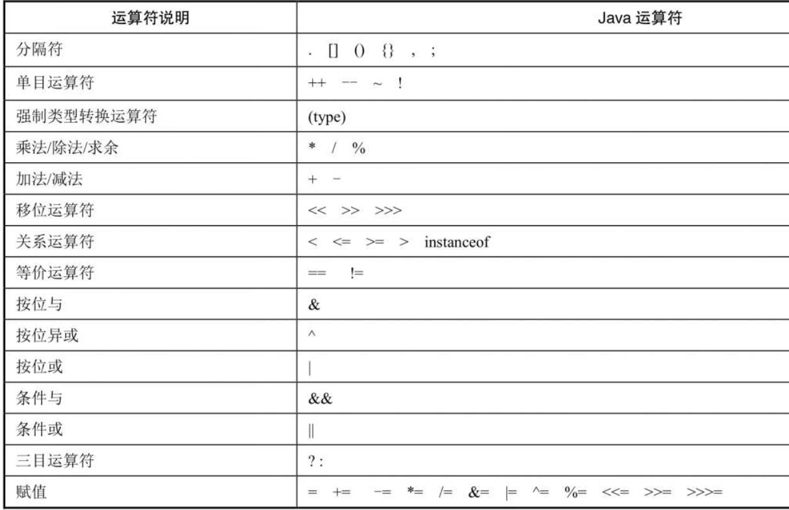
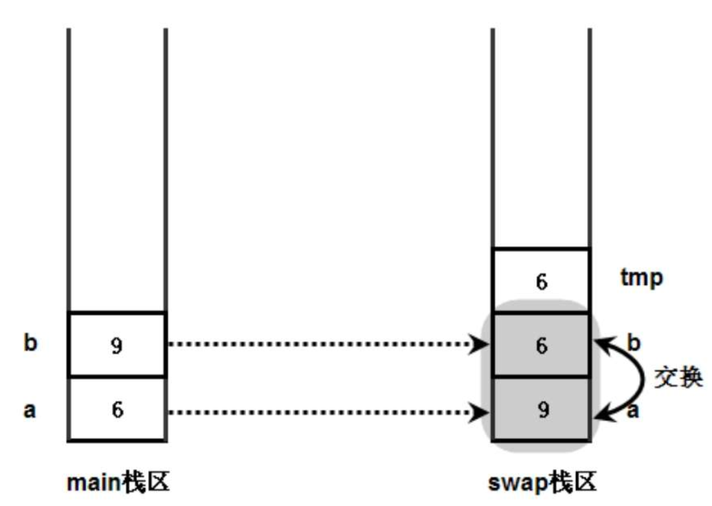
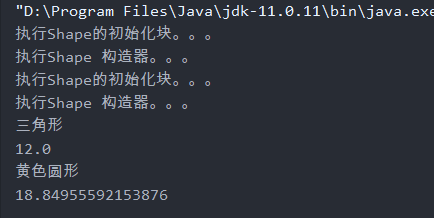
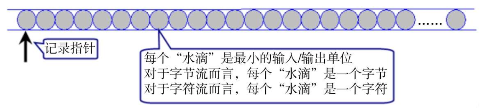
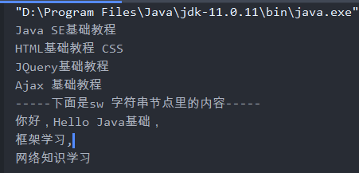
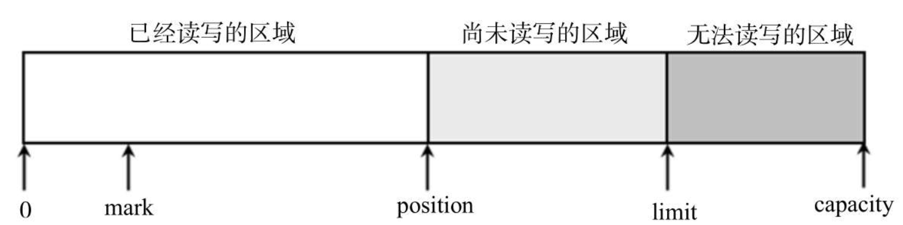
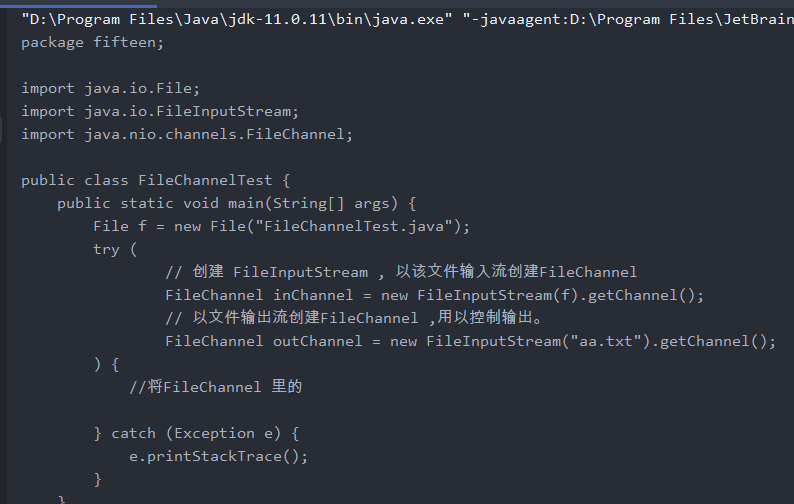
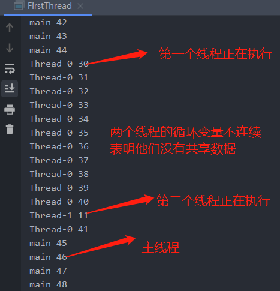

# 1 Java SE 

## 1. Java 程序概述

### 1.1 Java 关键术语

11个关键术语：

> 1. 简单性 
>
> 2. 面向对象 
>
> 3. 分布式 
>
> 4. 健壮性 
> 5. 安全性 
> 6. 体系结构中立 
> 7.  可移植性 
> 8. 解释型 
> 9. 高性能 
> 10. 多线程 
> 11. 动态性

### 1.2 Java  发展简史

>  略


## 2. Java程序设计环境

>  本章主要介绍如何安装Java  开发工具包（JDK）以及 如何编译和运行不同类型的程序。

相关术语：

 

### 2.1Java运行机制

> Java 是一种特殊的高级语言，既有解释型语言的特征，也有编译型语言的特征，Java需要先编译后解释两个步骤。

>+ 编译型语言：指使用专门的编译器，针对特定的平台（操作系统）将某种高级语言源代码一次性“翻译”成可以被该平台硬件执行的机器码（包括机器指令和操作数）。在特定的平台上独立运行。
>  + 常见的编译型语言：C、C++ 、Swift等
>+ 解释型语言：指使用专门的解释器对源程序逐行解释成特定的平台机器码并立即执行的语言。解释型语言通常不会进行整体性的编译和链接处理，可以认为：每次执行解释型语言都要进行一次编译，因此解释型语言运行效率较低。
>  + 常见的解释型语言：JavaScript、Ruby 、 Python等。
>
>

#### 2.1.1 Java运行机制与JVM

> Java 语言比较特殊，Java需要先进行编译，这步编译不会生成特定的平台机器码，而是生成与平台无关的字节码（.class文件），然后由Java解释器进行解释执行。Java程序的执行过程必须先编译，后解释两个步骤。


> JVM (Java Virtual Machine ) : Java 虚拟机 负责解释执行字节码文件，相当于一个转换器，将字节码文件转换成不同平台的机器码，是运行Java程序的核心虚拟机。


#### 2.1.2 安装JDK 

> JDK : （Java SE Development Kit） 即Java标准开发包。
>
>  包括 ：Java编译器 、 Java运行时环境（JRE）、Java 常用类库。
>
> JRE ：（Java Runtime Environment ）  Java 运行时环境，JRE 包含JVM 。

设置环境变量

​		 在java 中需要设置三个环境变量（==1.5之后不用再设置classpath了==，但个人强烈建议继续设置以保证向下兼用问题）JDK安装完成之后我们来设置环境变量：右击“我的电脑”，选择“属性”，选择“高级”标签，进入环境变量设置，分别设置如下三个环境变量：

==（1）配置path变量：==

​		为什么要配置path变量？因为[电脑系统]将根据该变量的值找到java编程中需要的一些程序，比如javac.exe、java.exe、javah.exe等等,其中javac.exe程序是用于编译java源代码，java.exe程序是用于执行后缀为class的代码。

如何配置path变量？

path变量一般[电脑系统]都已经创建好了，所以不用新建该变量，只需在系统变量里选中到path变量，点击“选择” ->“编辑"，需要注意的是，不要随便删除方框里原有的其他path值，而是先在那一大串值之后，添加一个分号，再把C:\Program Files\Java\jdk1.5.0_17\bin填上去。下面列出其键值对：

变量名: PATH(不区分大小写但建议使用大写)

变量值: C:\Program Files\Java\jdk1.5.0_17\bin

==（2）配置classpath变量：==

​		为什么要配置classpath变量？配置classpath变量，才能使得java解释器知道到哪里去找标准类库，这些标准类库是别人已经写好了的，我们只管使用。比如我们常用到[java.lang](https://www.baidu.com/s?wd=java.lang&tn=44039180_cpr&fenlei=mv6quAkxTZn0IZRqIHckPjm4nH00T1YvujPBn1NWPjR4mWn4P16Y0ZwV5Hcvrjm3rH6sPfKWUMw85HfYnjn4nH6sgvPsT6KdThsqpZwYTjCEQLGCpyw9Uz4Bmy-bIi4WUvYETgN-TLwGUv3EnHmsPHb1njnvPH64n1TzPH6zPs)包中的类，在配置classpath变量后被设为默认导入，所以在写程序时就不用import这个包了。那么这些标准类库在哪呢？在以JDK的lib目录下以jar为后缀的文件中：一个是dt.jar，一个是tools.jar，这两个jar包都位于C:/jdk1.6.0/lib目录下，所以通常我们都会把这两个jar包加到我们的classpath环境变量的值为：.; C:\Program Files\Java\jdk1.5.0_17\\lib\tools.jar; C:\Program Files\Java\jdk1.5.0_17\\lib\dt.jar;

如何配置classpath变量？

在系统环境变量那一栏中点击新建classpath ，具体过程省略，下面只列出其键值对：

变量名: CLASSPATH

变量值: .;%JAVA_HOME%\lib\tools.jar;%JAVA_HOME%\lib\dt.jar;

（注意，CLASSPATH最前面是有个 “.”的，表示[当前目录](https://www.baidu.com/s?wd=当前目录&tn=44039180_cpr&fenlei=mv6quAkxTZn0IZRqIHckPjm4nH00T1YvujPBn1NWPjR4mWn4P16Y0ZwV5Hcvrjm3rH6sPfKWUMw85HfYnjn4nH6sgvPsT6KdThsqpZwYTjCEQLGCpyw9Uz4Bmy-bIi4WUvYETgN-TLwGUv3EnHmsPHb1njnvPH64n1TzPH6zPs)。用两个%包围JAVA_HOME这个变量的意思是[引用变量](https://www.baidu.com/s?wd=引用变量&tn=44039180_cpr&fenlei=mv6quAkxTZn0IZRqIHckPjm4nH00T1YvujPBn1NWPjR4mWn4P16Y0ZwV5Hcvrjm3rH6sPfKWUMw85HfYnjn4nH6sgvPsT6KdThsqpZwYTjCEQLGCpyw9Uz4Bmy-bIi4WUvYETgN-TLwGUv3EnHmsPHb1njnvPH64n1TzPH6zPs)的值，当然如果你不想这样做，也可以这样配置classpath的值为：.;%JAVA_HOME%\lib\tools.jar;%JAVA_HOME%\lib\dt.jar; 也就是用JAVA_HOME变量的值替换%JAVA_HOME%）;

==（3）配置JAVA_HOME变量：==

​			为什么要配置classpath环境变量？一是为了方便引用，比如，JDK安装在C:\Program Files\Java\jdk1.5.0_17目录里，则设置JAVA_HOME为该目录路径, 那么以后要使用这个路径的时候, 只需输入%JAVA_HOME%即可, 避免每次引用都输入很长的路径串; 二则是归一原则, 当JDK路径改变的时候, 仅需更改JAVA_HOME的变量值即可, 否则,就要更改任何用[绝对路径](https://www.baidu.com/s?wd=绝对路径&tn=44039180_cpr&fenlei=mv6quAkxTZn0IZRqIHckPjm4nH00T1YvujPBn1NWPjR4mWn4P16Y0ZwV5Hcvrjm3rH6sPfKWUMw85HfYnjn4nH6sgvPsT6KdThsqpZwYTjCEQLGCpyw9Uz4Bmy-bIi4WUvYETgN-TLwGUv3EnHmsPHb1njnvPH64n1TzPH6zPs)引用JDK目录的文档, 要是万一没有改全, 某个程序找不到JDK, 后果是可想而知的----系统崩溃! 三则是第三方软件会引用约定好的JAVA_HOME变量, 不然, 你不能正常使用该软件。

如何配置JAVA_HOME变量？

在系统环境变量那一栏中点击新建JAVA_HOME （JAVA_HOME指向的是JDK的安装路径），变量的值实际上是JDK安装路径的根目录。具体过程省略，下面只列出其键值对：

变量名： JAVA_HOME 

变量值：C:\Program Files\Java\jdk1.5.0_17

测试JDK是否安装成功

在运行中输入cmd

然后输入java –version

看看是否能显示出您所配置的java版本

> **原理解释**
>
> 1. 系统变量→新建：JAVA_HOME 变量值：C:\Program Files\Java\jdk1.8.0_121
> 2. 系统变量→Path→编辑：在变量值最后输入 ：%JAVA_HOME%\bin;%JAVA_HOME%\jre\bin;
> 3. 系统变量→新建：CLASSPATH 变量值：.;%JAVA_HOME%\lib;%JAVA_HOME%\lib\tools.jar
>
> 1. Path：当用javac、java等命令编译、运行Java程序时，操作系统需要查找javac.exe、java.exe这些可执行文件的位置，然后调用这些可执行程序对Java程序进行对应的操作。我们开发程序代码之后，通常在代码文件夹所处的路径编译代码文件，操作系统会在用户所在当前路径和系统环境变量这两个地方查找对应的Java可执行文件，但是编译、运行Java代码的可执行文件所在的路径（即我们安装JDK的bin所在的路径）通常跟我们编写的代码是不再同一个文件夹目录下的，所以只能将其添加到系统的环境变量中，才能够找到对应的可执行文件，从而顺利编译、运行我们的代码。
> 2. JAVA_HOME：直接在Path中编辑JDK安装的绝对路径，对大多数Java应用程序以及我们自己编写的Java代码都是可以正常编译、运行的，但是如果我们对本机安装的JDK进行版本修改或者升级，甚至对其安装路径进行改动，我们就需要更改Path中相应的内容。如果不小心误删了其它部分，很有可能导致我们的操作系统无法正常运行甚至崩溃，因此将bin之前的路径另外赋值给JAVA_HOME是很有必要的。
> 3. CLASSPATH：指定程序中使用的.class文件的位置，我们在编写程序代码时经常会引用JDK封装好的类，这些类文件都在上文提到的两个文件夹下面。如果程序中调用我们前面自己编写的Java类，就需要我们在当前所在目录文件夹下面寻找，此时需要我们加上一个 . 来指定同时可以在当前目录下查找.class文件。

### 2.2 理解面向对象

> 目前软件开发领域有两种主流开发方法：
>
> + 结构化开发方法 ： 如 C、Basic、Pascal.
> + 面向对象开发方法
>   + 面向对象可以提供更好的 可重用性、可扩展性、可维护性。
>   + C++ 、Java 、 C# 、 Ruby 

#### 2.2.1 结构化程序设计

> 结构化程序设计方法： 主张按照功能来分析系统需求，主要原则可概括为自顶向下、逐步求精、模块化。
> 结构化程序设计主要有一下方法：
>
> + 结构化分析（Structured Analysis ，SA）方法：对系统进行需求分析。
> + 结构化设计（Structured Design ，SD）方法：对系统进行概要设计、详细设计
> + 结构化编程（Structured Program SP） 方法： 实现系统 
>
> 结构化程序设计方法主张按功能把软件系统逐步细分，因此这种方法也称为面向功能的程序设计方法。
>
> 结构化程序设计最小程序单元是函数，整个软件由一个个函数组成。作为程序入口的函数称为主函数，主函数依次调用其他函数。
>
> 

> 结构化程序设计方式：局限性
>
> + 设计不够直观
> + 适应性差，可扩展性不强。

#### 2.2.2 程序三种基本结构

> 任何简单或复杂的算法都可以由 ==顺序结构== 、==选择结构==、==循环结构==组合而成。
>
> + 顺序结构：程序中的操作，按照他们在源码中的顺序依次执行。
>   
> + 选择结构：处理需要根据某个特定条件选择其中一个分支执行。
>   + 单选、多选、双选
>
> 
>
> 
>
> + 循环结构
>   + 当型结构：先判断条件，当条件为真时执行循环体。
>   + 直到型循环： 从入口处直接执行循环体，循环体结束时判断条件。如果条件为真，则返回入口处执行循环体，直到条件为假时退出循环体。
>
> 


#### 2.2.3面向对象程序设计

> ​		面向对象是一种更优秀的设计方法，它的基本思想是使用类、对象、继承、封装、消息等基本概念进行程序设计。它从现实世界中客观存在的事物（即对象） 出发来构造软件系统，并在系统构造中尽可能运用人类的自然思维方式，强调直接以显示世界中的事物（即对象） 为中心来思考，认识问题，根据这些事物的本质特点，把他们抽象的表示为系统中的类，作为系统的基本构成单元。
>
> ​		采用面向对象方式开发的软件系统，最小程序单元是类，这些类可以生成系统中的多个对象，而这些对象则直接映像成客观世界的各种事物。
>
> 
>
> ​		从上图可以看出，面向对象软件系统由多个类组成，类代表了客观世界中具有某种特征的一类事物，这类事物往往有一些内部的状态数据，比如人有身高、体重、年龄、爱好等。
>
> + 成员变量（状态数据） +  方法（行为） =  类定义
>
>   面向对象比面向过程的编程粒度更大，面向对象程序单位是类，面向过程的程序单位是函数，因此面向对象比面向过程更简单、易用。

> 比如要完成“ 猪八戒吃西瓜” 这样一件事情。
>
> + 面向过程的程序，一切以函数为中心，函数最大。因此这件事的语句会如下表达：
>   + 吃（猪八戒，西瓜）；
> + 面向对象的程序，一切以对象为中心，对象最大。因此这件事语句会如下表达：
>   + 猪八戒.吃（西瓜）;

#### 2.2.4面向对象基本特征

> 面向对象有三个基本特征：封装（Encapsulation） 、 继承（Inheritance） 、多态（Polymorphism) 
>
> + 封装：将对象的实现细节隐藏起来，然后通过一些公用方法来暴露该对象功能
> + 继承：是面向对象实现软件复用的重要手段，当子类继承父类后，子类作为特殊的父类，将直接获得父类的属性和方法
> + 多态：是指子类对象可以直接赋给父类变量，但运行时依然表现处子类的行为特征，意味同一个类型的对象再执行同一个方法时，可能表现出多种行为特征。

### 2.3 UML(统一建模语言)语言

> 面向对象软件开发步骤：
>
> + 面向对象分析(OOA)
> + 面向对象设计(OOD)
> + 面向对象编程(OOP)

## 3. Java 基本程序设计结构

> 本章主要内容：
>
> + 注释
> + 数据类型
> + 变量
> + 运算符
> + 字符串
> + 输入 输出
> + 控制流
> + 大数值
> + 数组

### 3.1 一个简单的Java 应用程序

```java
public class FirstSimple {
    public static void main(String [] args){
        System.out.println("We will not Use 'heloo , world !'");
    }
}
```

> 代码分析：
>
> 1. Java 区分大小写
> 2. 关键字public 是访问修饰符，用于控制程序的其他部分对这段代码的访问级别。
> 3. 关键字class 表明Java 程序中的全部内容都包含在类中。
> 4. 关键字class 后紧跟类名。名字必须以字母开头、一般首字母大写、可以字母数字组合、不能是关键字。
> 5. 源代码的文件必须与公共类的名字相同、并用.java 作为扩展名。因此存储这段源码的文件名必须是FirstSimple.java 

编译程序：


生成 .class 文件


执行文件 java  ClassName  没有后缀。


### 3.2 注释

> Java  注释分为三种：
>
> + 单行注释 // 
> + 多行注释 /*  ...  */
> + 文档注释  ：可以用来自动生成文档。 /** ......  * / 


### 3.3 数据类型

> Java 是强类型语言，必须先声明后使用。Java 语言支持数据类型有两种
>
> + 基本数据类型
>   + 8种基本类型
> + 引用数据类型
>   + 类 、接口、数组、null类型


#### 3.3.1 整型

> 整型用于表示没有小数部分的数值，它允许负数。
> 通常情况下，int 类型最常用。
> Java 中，所有的数值类型所占据的字节数量与平台无关。

| 类型  | 存储需求 | 大小    | 取值范围                                                |
| ----- | -------- | ------- | ------------------------------------------------------- |
| byte  | 1 字节   | 8 bits  | - 128 - 127                                             |
| short | 2 字节   | 16 bits | - 32768 ~ 32767                                         |
| int   | 4 字节   | 32 bits | -2 147 483 648 ~ 1147 483 647(超过20亿)                 |
| long  | 8 字节   | 64 bits | - 9 223 372 036 854 775 808 ~ 9 223 372 036 854 775 807 |

> + 长整型数值有一个后缀 L 或 1 ( 如 4000000000 L ) 。
>
> Java 中整数值有4种表示方式：十进制、十六进制、八进制、二进制
>
> + 0x 或0X 表示十六进制 (0xCAFE) 、八进制前缀 0 （如010 对应8）、
>   二进制 前缀 0b或 0B 。
>
> 所有的数字在计算机底层都是以二进制形式存在的，原码是直接将一个数值换算成二进制数，但计算机以补码的形式保存所有的整数。补码的计算规则：正数的补码和原码完全相同，负数的补码是其反码加1；反码是对原码按位取反，只是最高位（符号位）保持不变

```java
 	    // 以0开头的整数值是八进制数
        int otcalValue = 013;// 对应 11
        // 以0x或 0X开头的整数值是十六进制整数。
        int hexValue1 = 0x13;// 对应 19
        int hexValue2 = 0Xaf;//对应 175
        // 定义两个八位二进制
        int binVal1 = 0b11010100; // 输出 212
        int binVal2 = 0B01101001; // 输出 105
		int binVal3 = 0B100000000000000000000011; // 这是补码
        System.out.println(otcalValue + "--"+hexValue1+"--"+hexValue2 );
```


> + 如果系统直接将一个较小的整数值（在byte 或 short 类型的表示数范围内） 赋给一个byte 或者short变量，系统会自动把这个整数值当成byte 或short 类型处理
> + 如果使用一个巨大的整数（超出int类型的表数范围） 时，Java 不会自动把这个整数值当成long类型处理。

```java
 		// 下面代码是正确的，系统会自动把56 当成byte 处理
        byte a = 56;
        /*
        下面代码是错误的，系统不会把99999999999999 当成long 类型处理
        所以超出int的表数范围，从而引起错误
         */
        // long bigValue = 99999999999999;
        // 下面代码正确，在巨大的整数值后加上L或l ,强制使用long类型
        long bigValue2 = 99999999999999L;
```

#### 3.3.2 浮点类型

> 用于有小数部分的数值。

| 类型   | 存储需求 | 大小    | 取值范围                                                     |
| ------ | -------- | ------- | ------------------------------------------------------------ |
| float  | 4 字节   | 32 bits | 大约 ± 3.402 823 47 E + 38 F ( 有效位数为 6 ~ 7 位 ）        |
| double | 8 字节   | 64 bits | 大约 ± 1.797 693 134 862 315 70 E + 308 ( 有效位数为 15 位 ) |

> ​		double 表示这种类型的数值精度是 float 类型的两倍 （ 有人称之为双精度数值 ) 。 绝大部分应用程序都采用 double 类型。 在很多情况下 ， float 类型的精度很难满足需求 。 实际上 ， 只有很少的情况适合使用 float 类型 ， 例如
> 需要单精度数据的库 , 或者需要存储大量数据 。float 类型的数值有一个 **后缀 F 或 f** ( 例如， 3.14 F ) 。 没有后缀 F的浮点数值 （ 如 3.14 ) 默认double 类型。 当然 ， 也可以在浮点数值后面添加 **后缀D 或 d** ( 例如， 3.14 D ) 。

> 三个特殊浮点数值,用于表示溢出和出错
>
> + 正无穷大  如： 1.0/0 ： 正浮点数除以0,或者正整数除以0.0。POSITIVE_INFINITY
> + 负无穷大  如 ：-2.0/0    负浮点数除以0，或者负整数除以0.0。  NEGATIVE_INFINITY
> + NaN（不是一个数字） 如： 0/0 或负数的平方根。
>
> 如果一个整数除以0 则会抛出异常 ： java.lang.ArithmeticException: / by zero

> 如果要精确的计算小数位，使用BigDecimal类。

```java
 public static void fdouble(){
        // 浮点数默认为double 型，想要赋值给float型，必须加后缀f.
        float af = 5.2345556f;
        //float ff = 2.3;//会报错，不兼容类型
        System.out.println(af); // 5.2345557
        double a = 0.0;
        double c = Double.NEGATIVE_INFINITY;
        float  d = Float.NEGATIVE_INFINITY;
        // float 和 double 的负无穷大相等。
        System.out.println(c == d); // true
        double x = 1/0.0;
        System.out.println(1.0/0); // Infinity
     	System.out.println(8/0.0); // Infinity

        // 0.0 除以 0.0 将出现非数
        System.out.println(a / a); // NaN
        // 两个非数之间不相等
        System.out.println( a/a == Float.NaN); // false
    }
```


#### 3.3.3 char 类型

| 类型 | 存储需求 | 大小    | 取值范围 |
| ---- | -------- | ------- | -------- |
| char | 2 字节   | 16 bits | 0~65536  |

> 字符型值有如下三种表示方式：
>
> + 直接通过单个字符来只是字符型值，例如 'A' 、'9'、'0'
> + 通过转义字符表示特殊字符型值，例如 '\n' '\t'
> + 直接使用Unicode 值来表示字符型值，格式是'\uXXXX'，其中XXXX代表一个十六进制的整数。

> Unicode 和 char 类型

```java
  //直接指定单个字符值
        char aChar = 'a';
        // 使用转义字符来作为字符值
        char enterChar = '\r';
        //使用Unicode 编码值来指定字符值
        System.out.println("-a==-"+a + "-enterChar=-"+ enterChar);
        char ch = '\u9999';
        // 定义一个 ‘狂’ 字符值
        char ku = '狂';
        // 直接将一个char 变量当成int类型变量使用
        int  kuValue = ku;
        System.out.println("-ch==-"+ch+"-ku=-"+ku+"-kuvalue-"+kuValue);
        // 直接把一个0~65535 范围内的int 整数赋给一个char变量。
        char c = 97;
        System.out.println("c=="+c);
```

 

> 计算机底层保持字符时，实际保存该字符对应的编号，因此char型也可以直接作为整型值来使用，相当于一个16位无符号整数。如果把0~65535 范围内的一个int 整数赋给char类型变量，系统会自动把int 整数当成char类型来处理。

#### 3.3.4 boolean 类型

> boolean(布尔) 类型有两个值，false 和 true .用来判定逻辑条件。
>
> + Boolean 和整型不能相互转换
> + 占用一个字节（8位）


---

---

### 3.4 变量

> + 每个变量都有一个类型。声明变量时，类型位于变量名之前。
>   double  salary ;
>   int     vacationDays;
>   boolean  done;
> + 变量名必须以字母开头，字母和 数字 ’_' 和 ‘$' 组合，不能有空格。
> + 每个变量声明都以分号（; ）结束。
> + 不能使用关键字、保留字作为变量名

+ <u>尽管 $ 是一个合法的 Java 字符 ， 但不要在你自己的代码中使用这个字符 。 它只用在 Java 编译器或其他工具生成的名字中。</u>

> 变量声明：<u>Java 中变量声明可以放在任何地方</u>
>
> ​	double  salary ;
>
> ​	long earthPopulation;

| 访问控制             | private  | protected  | public   |              |            |           |        |
| -------------------- | -------- | ---------- | -------- | ------------ | ---------- | --------- | ------ |
| 类，方法和变量修饰符 | abstract | class      | extends  | final        | implements | interface | native |
|                      | new      | static     | strictfp | synchronized | transient  | volatile  |        |
| 程序控制             | break    | continue   | return   | do           | while      | if        | else   |
|                      | for      | instanceof | switch   | case         | default    |           |        |
| 错误处理             | try      | catch      | throw    | throws       | finally    |           |        |
| 包相关               | import   | package    |          |              |            |           |        |
| 基本类型             | boolean  | byte       | char     | double       | float      | int       | long   |
|                      | short    | null       | true     | false        |            |           |        |
| 变量引用             | super    | this       | void     |              |            |           |        |
| 保留字               | goto     | const      |          |              |            |           |        |

#### 3.4.1.变量初始化

> + 声明变量后，必须用赋值语句对变量进行显式初始化。
>
> + 不可以使用未初始化的变量。

如下代码：Java编译器会认为下面代码是错误的

```java
int vacationDays;
System.out.println(vacationDays);
```

> 变量初始化方法
>
> + 先声明后初始化
>   int vacationDays ;
>   vacationDays = 12;
> + 声明和初始化在同一行
>   int vacationDays = 12；

#### 3.4.2 常量

> + Java中 使用final 指示常量。
> + 关键字final 表示这个变量 只能被赋值一次，赋值后，不能更改。
> + 习惯常量名大写。

```java
public class FirstSimple {
    public static void main(String [] args){
        final double CM_PER_INCH = 2.54;
        double paperWidth = 8.5 ;
        double paperHeight = 11;
        System.out.println("paper size  centimeters : " + paperWidth*CM_PER_INCH +
                " by " + paperHeight * CM_PER_INCH);
    }
}
```

#### 3.4.3 使用var定义变量

> 为了简化变量的声明，从 Java 10 开始 支持使用var 定义局部变量 ： var 相当于一个动态类型，使用var定义的局部变量的类型由编译器自动推断 定义变量时分配了什么类型的初始值，那该变量就是什么类型。
>
> 使用var 定义局部变量时，必须在定义局部变量的同事指定初始值，否则编译器无法对端该变量类型。

```java
public static void main(String[] args) {
        var a = 20;// 被赋值为20 ，因此a为int类型
        var b = 3.4;
        //var  还可以用于定义引用类型
        var str = "hello";
    }
```

#### 3.4.4 直接量

> 直接量（literal value ，也称为字面值） 是指在程序中通过源代码直接给出值，例如 在 int a = 5; 这行代码中，为变量a 所分配的初始值5 就是一个直接量。
>
> + 直接量类型：并不是所有数据类型都可以指定直接量，能指定直接量的通常只有三种类型：基本类型、字符串类型和null类型。
>   + int 类型直接量：直接给出整数。
>   + long 类型直接量：在整数类型后添加L或l.
>   + float 类型：在浮点数后添加 F或f.
>   + double 类型：直接给出一个浮点数
>   + boolean 类型 ： 这个类型直接量 true 和false.
>   + char 类型： 直接量有三种形式：分别 是单引号括起来的字符、转义字符、Unicode值。
>   + String类型： 直接量双引号括起来的字符序列。
>   + null类型：直接量null


### 3.5 基本类型的类型转换

> 在Java程序中，不同的基本类型的值经常需要转换。Java语言提供了7中数值类型直接的相互转换（boolean类型不能转换），有两种转换方式：
>
> + 自动类型转换
> + 强制类型转换

#### 1.自动类型转换

> Java 所有数值变量可以相互转换
>
> + 如果系统支持把某种类型的值直接赋值给另一种基本类型的变量，则这种方式被称为自动类型转换。
> + 当把一个表数小的数值或变量直接赋给另外一个表数范围大的变量时，系统可以进行自动类型转换。否则就需要强制类型转换。

自动类型转换流程图：


```java
 public static void main(String[] args) {
        int a = 6;
        // int 类型可以自动转换为float 类型
        float f = a;
        System.out.println(f); // 输出 6.0
        byte b = 9;
        // 下面代码出错，byte 类型不能自动转换为char类型。
//         char c = b;
        double d =b ; // byte 类型可以自动转换为double 类型。
        System.out.println(d);// out : 9.0
    }
```

> 当把任何基本类型的值和字符串相连接运算时，基本类型的值将自动转换为字符串类型。

```java
    public static void main(String[] args) {
        // 下面这段代码错误，因为5是整数，不能直接赋值给一个字符串
        // String  s = 5;
        //一个基本类型的值和字符串进行连接运算时，基本类型的值自动转换为字符串。
        String str1 = 3.5f + "";
        System.out.println(str1);// out ： 3.5
        System.out.println(3 + 8 + "Hello");// 输出 11Hello

        System.out.println("Hello" + 3 + 0);//输出 Hello30
    }
```

#### 2.强制类型转换

> 如果希望把上图中箭头右边的类型转换为左边的类型，则必须进行强制类型转换。
>
> 语法格式：（targetType)value; 
>
> + 进行强制类型转换时，有可能造成数据溢出，引起数据丢失。
> + 强制类型转换，会截断数据

```java
public static void main(String[] args) {
         var iValue = 233;
         // 强制把 一个 int 类型的值转换为byte 类型的值。
        byte bValue = (byte)iValue;
        System.out.println(bValue); // out: -23 数据溢出
        var dValue = 3.98;
        // 强制把一个double类型的值转换为int 类型的值。
        int tol = (int)dValue;
        System.out.println(tol);// out: 3 Java直接截断浮点数小数部分。
    }
```

**随机字符串产生方法：**

> 实现步骤：
>
> + 先随机生成一个指定范围内的int 数字（如果希望小写字母， 就在97~122之间）
> + 然后将int 数字 转换为 char 类型。
> + 将多次生成的字符连接起来即可。

下面程序产生6位随机字符串

```	java
public static void main(String[] args) {
        String  result = "";
        // 进行六次循环
        for (int i = 0 ;i < 6 ; i++){
            // 生成一个 97 ~ 122直接的数字
            var intValue = (int)(Math.random()*26 + 97);
            // 将 intValue 强制转换为char类型后连接到result。
            result = result + (char)intValue;
        }
        System.out.println(result);
    }
```

#### 3.表达式类型的自动提升

> 当一个算术表达式中包含多个基本类型的值时，整个算术表达式的数据类型将发生自动提升。
>
> + 所有byte 类型，short 类型和char类型将被提升到 int类型。
> + 整个算术表达式的数据类型自动提升到与表达式最高等级操作数同样类型。

```java
public static void main(String[] args) {
        short sValue = 2;
        //下面表达式中 sValue 将自动提升到 int 类型，则右边表达式为int类型。
//        sValue = sValue + 1;// 表达式报错，不兼容类型
        byte b = 40;
        var c = 'a';
        var i = 23;
        var d = .34;
        double result = b + c + i +d;
        System.out.println(result);// out : 160.34
    }
```


### 3.6 运算符

> 运算符是一种特殊的符号， 用以表示数据的运算、赋值和比较等。
>
> + 算术运算符
>   + 当参与 /  运算的两个操作数都是整数时，表示整数除法。否则表示浮点数除法。
> + 赋值运算符
> + 比较运算符
> + 逻辑运算符
> + 位运算符
> + 类型相关运算符

#### 1.算术运算符

> 1. 算术运算符：加 + 、减 —、乘 *、除 / 、求余 % 等。
>
> + 加 + 还可以作为连接运算符
> + 除 / ：除法运算符有些特殊，
>   + 如果两个操作数都是整数类型，则计算结果也是整数，就是将自然数除法的结果截断取整，如 19/4 结果为4 ,而不是5.如果两个操作数都是整数，则除数不可以是 0 ，否则将会引发异常。
>   + 如果两个操作数有一个是浮点数，则计算结果也是浮点数，这个结果就是自然除法的结果。而且此时允许除数是0 或者 0.0 ，得到结果是正或负无穷大。

```java
public static void main(String[] args) {
        var a = 2.5 ;
        var b = 5.4 ;
        var c = a + b;
        System.out.println(c);// 7.9

        var d = b - a ;
        System.out.println(d);//2.9000000000000004

        var e = a * b;
        System.out.println(e); //13.5

        var div = b / a;
        System.out.println(div); // 2.16
        System.out.println("5除以0.0 的结果 ：" + 5 / 0.0); // 5除以0.0 的结果 ：Infinity
        System.out.println("-5 除以 0.0 结果：" + -5 / 0.0);//-5 除以 0.0 结果：-Infinity
        System.out.println(" 5 除以 0 结果 ：" + 5 / 0 );// 异常 java.lang.ArithmeticException: / by zero
    }
```

> + % 求余运算符 ： 求余结果不一定总是整数，它的计算结果是使用第一个操作数除以第二个操作数，得到一个整除的结果后剩下的值就是余数。
>   + 如果求余的两个数都是整数，则第二个操作数不能是 0 ，否则报异常。
>   + 如果两个操作数有一个或两个是浮点数，则第二个操作数可以是 0 或0.0 ，求余结果为非数：NaN。
>   + 0或0.0 对其他非零数求余 结果 0或 0.0 。

```java
   		var f = 5.2 ;
        var g = 3.1 ;
        var mod = f % g;
        System.out.println(mod);// 2.1
        System.out.println(5 % 0.0); // NaN
        System.out.println(-5 % 0.0);//NaN
        System.out.println(0 % 5.0);//0.0
        System.out.println(0 % 0.0);//NaN
        System.out.println( - 5 % 0);// java.lang.ArithmeticException: / by zero
```

> ++ : 自加，--自减
>
> + 自加是单目运算符，只能操作数
> + 只能操作单个数值（整型、浮点型）的变量，不能操作常量或表达式。
> + 运算符可以在操作数的左边，也可以在操作数的右边。如果++在左边，则先把操作数加1 ，然后才把操作数放入表达式中运算。如果把++在右边，则先把操作数放入表达式中运算，然后才把操作数加1。
>
> 自加和自减只能操作变量，不能操作数值直接量、常量或表达式。

```java
public static void main(String[] args) {
        var a = 1;
        var b = ++ a;
        // var b1 = ++ 1;// 这样会报错，不能操作直接量
        System.out.println(" a = " + a + " b= "+ b);//a = 2 b= 2

        var c = 2;
        var e = c ++;
        System.out.println("c = "+ c + " e = " + e);//c = 3 e = 2
    }
```

> 如果需要复杂的算术运算，可以使用Java.lang.Math类的工具方法完成复杂的数学运算

```java
public static void main(String[] args) { 
        var a = 3.2;
        //求a 的5次方。
        double b =Math.pow(a,5);// 335.5443200000001
        System.out.println(b);
        //求 a 的平方根
        double c = Math.sqrt(a);
        System.out.println(c);// 1.7888543819998317
        // 计算随机数，返回 0~1之间的伪随机数。
        double d = Math.random();
        System.out.println(d);
    }
```

#### 2.赋值运算符

> 赋值运算符为变量指定变量值。
>
> + = 作为赋值运算符


#### 3.位运算符

> Java 支持的位运算符 有如下7个。
>
> + & ：按位与。当两位同时为1时才返回1.
> + | ： 按位或。只要有一位为1 即可返回1.
> + ~ ： 按位非。 单目运算符，将操作数的每个位（包括符号位）全部取反。
> + ^ ：按位异或。 当两位相同时返回 0 ， 不同时返回 1.
> + << : 左移运算符。
> + .>> ：右移运算符。
> + .>>> : 无符号右移运算符。

#### 4.扩展后的赋值运算符

> 赋值运算符可与算符运算符、位运算符结合。扩展后的赋值运算符如下：
>
> + += ：x+=y ，对应 x = x + y.
> + -= :   x-=y ,对应 x = x - y .
> + *= :  x *=y,对应 x = x * y.
> + /= : x /= y ,对应 x = x / y.
> + %=：对于x%=y，即对应于x=x%y。
> +  &=：对于x&=y，即对应于x=x&y。
> +  |=：对于x|=y，即对应于x=x|y。
> +  ^=：对于x^=y，即对应于x=x^y。
> +  <<=：对于x<<=y，即对应于x=x<<y。
> + .>=：对于x>>=y，即对应于x=x>>y。
> + ➢ >>>=：对于x>>>=y，即对应于x=x>>>y。

#### 5.比较运算符

> 比较运算符判断两个变量或常量的大小，比较结果是一个布尔值（true 或 false）Java支持的比较运算符如下：
>
> + .>   ： 大于
> + .>= ： 大于等于
> +  <  ：小于
> + <= : 小于等于
> + == ：等于
>   + 如果比较的两个操作数都是数值类型，即使他们的数据类型不同，只要他们的值相等，也都将返回true。例如：97 == ’a' 返回 true。5.0 == 5 也是返回 true。
>   + 如果两个操作数都是引用类型，那么只要当两个引用类型变量的类型具有父子关系时，才可以比较，而且这两个引用必须指向同一个对象才会返回true。
>   + 基本类型值、变量不能和引用类型变量、值使用 == 比较。如果两个引用类型直接没有父子继承
> + != : 不等于


#### 6.逻辑运算符

> 逻辑运算符用于操作两个布尔型的变量或常量。逻辑运算符 有六个。
>
> + && ： 与， 前后两个操作数必须都是true 才返回 true ， 否则返回false。
> + & ： 不短路与，作用于 &&  相同，单不会短路。
> + || ： 或 ， 只要两个操作数中有一个是true ，就可以返回true，否则返回false。
> + | ： 不短路或， 作用与 || 相同，但不会短路。
> + ！： 非，只需要一个操作数，如果操作数是true 则返回false。
> + ^ : 异或 , 当两个操作数不同才返回true。

```java
public static void main(String[] args) {
        // 直接对false 求非运算，将返回true。
        System.out.println(!false);
       var a = 5;
       var b = 10 ;
       // 不短路或
       if (a > 4 | b++ > 10){
           // 不短路或 两边都会判断，所以b 的值为11 。
           System.out.println("a = " + a + " b = "+ b); //OUT : a = 5 b = 11
       }

       var c = 5;
       var d = 10 ;
       if (c > 4 || d++ > 10){
           //短路或  左边如果是true 则右边不判断。所以d 的值 10.
           System.out.println("c = "+ c + " d = "+d);// out :c = 5 d = 10
       }
    }
```

#### 7.三目运算符

> 三目运算符只有一个 ？ ： 语法格式如下
>
> + （expression）？if-true-statement : if-false-statement
> + 运算符规则： 先对对expression 表达式求值，如果逻辑表达式返回true，则返回第二个操作数，为false ，返回第三个操作数。

```java
		String str = 5>3 ? "5大于3":"5不大于3";
        System.out.println(str);// out :5大于3
```

#### 8.运算符的结合性和优先级


运算符优先级如下：




### 3.7流程控制

> 流程控制分为两种：
>
> + 分支结构
>
>   + if分支结构
>   + switch 分支结构
>
> + 循环结构
>
>   + while 循环结构
>
>   + do while 循环结构
>
>   + for 循环结构
>
>   + foreach 循环结构 （ jdk 5 以上版本）
>
>     

#### 1.顺序结构

> 在任何编程语言中最常见的程序结构就是顺序结构。顺序结构就是程序从上到下逐行执行，中间没有任何判断和跳转。

#### 2.分支结构

> Java 提供了两种常见的分支控制结构：IF 语句 和 switch 语句。其中if 语句使用 布尔表达式或布尔值作为分支条件来进行分支控制；而switch 语句则用于多个整型值进行匹配，从而实现分支控制。

##### 2.1 if条件语句有三种形式：

```java
// 第一种形式
if(logic expression ){
	statement...
}
//第二中形式
if( logic expression){
	statement...
}else{
    statement...
}
// 第三中形式
if( logic expression ){
    statement...
}else if ( logic expression ){
	statement...
}
...// 可以有零个或多个 else if 语句
   else {
       statement...
   }

```

```java
  public static void main(String[] args) {
        var age = 30;
        if (age > 60){
            System.out.println("老年人");
        }else if (age > 40){
            System.out.println("中年人");
        }else if (age > 20){
            System.out.println("青年人");
        }
    }
```

##### 2.2 switch 分支语句：

> switch 语句后的控制表达式的数据类型只能是 byte ,short ,int ,char 四种整数类型，枚举类型和java.lang.String 类型（Java 7才允许），不能是boolean 类型。

语法格式如下：

```java
switch(expression){
    case condition1:
    {
    	statement(s)
        break;
	}
    case condition2:
        {
            statement(s)
                break;
        }
	...
     default:
        {
    statement(s)        
        }

}
```

```java
 public static void main(String[] args) {
        var score = 'C';
        switch (score){
            case 'A':
            {
                System.out.println("优秀");
                break;
            }
            case 'B':
            {
                System.out.println("良好");
                break;
            }
            case 'C':
            {
                System.out.println("中");
                break;
            }
            case 'D':
            {
                System.out.println("及格");
                break;
            }
            case 'E':
            {
                System.out.println("不及格");
                break;
            }
            default:
                System.out.println("成绩输入错误");
        }
    }
```

> 运行结果：
>
> 中

如果没有break从语句则代码运行结果：

```tex
中
及格
不及格
成绩输入错误
```

> case 标签后每个代码块后都要有一个break；语句，如果没有break;语句则程序执行流程是这样的：switch语句会先求出expression表达式的值，然后拿这个表达式和case标签后的值进行比较，一旦遇到相等的值，程序就开始执行这个case标签后的代码，不再判断与后面case、default 标签条件是否匹配，除非遇到break； 才会结束。

#### 3循环结构

> 循环语句可以在满足循环条件的情况下，反复执行某一行代码，这段被反复执行的代码被称为循环体。循环语句可能包含如下4个部分：
>
> + 初始化语句（init_statement) : 一条或多条语句，这些语句用于完成一些初始化工作，在循环开始之前执行。
> + 循环条件（test_expression) : 这是一个Boolean 表达式，这个表达式能决定是否执行循环体。
> + 循环体（body_statement) : 这个部分是循环的主体。
> + 迭代语句（iteration_statement):这个部分在一次循环体执行结束后，对循环条件求值之前执行，通常用于控制循环条件中的变量。

##### 3.1while循环

语法格式：

```java
(init_statement)
while ( test_expression){
    statement;
    [iteration_statement]
}
```

```java
 public static void main(String[] args) {
        // 循环初始化条件
        var cont = 0;
        // 当count 小于 10 时，执行循环体
        while (cont < 10 ){
            System.out.println(cont);
            cont ++ ;
        }
    }
```

##### 3.2 do while 循环

> do while 循环与while循环区别在于： while 循环先判断循环条件，如果条件为真则执行循环体；而 do while 先执行循环体，然后才判断循环条件。

```java
[init_statement]
do{
    statement;
    [iteration_statement]
}while(test_expression);
```

```java
public static void main(String[] args) {
        var count = 1;
        // 执行do while 循环
        do {
            System.out.println(count);
            //循环迭代语句
            count ++ ;
        }while (count < 10);
        System.out.println("循环结束");
    }
```

##### 3.3for循环

> 大部分情况下，for循环可以替代 while  、do  while 循环。

语法格式：

```java
for（[init_statement];[test_expression];[iteration_statement]{
    statement
}
```

> 程序执行for 循环时，先执行循环的初始化语句 init_statement ,初始化语句只执行一次。
> 每次执行循环体之前，先计算test_expression 循环条件的值，如果是 true 才执行循环体。

```java
public static void main(String[] args) {
        for (var count = 0;count < 10;count++){
            System.out.println(count);
        }
        System.out.println("循环结束");
    }
```

> 初始化语句允许同时指定多个，循环条件也可以是包含逻辑运算的表达式。

```java
public static void main(String[] args) {
        for (int b = 0, s = 0 , p = 0;b < 10 && s < 4 && p < 10 ; p++){
            System.out.println("b= " + b++);
            System.out.println(++s + p);
        }
    }
```

#### 4控制循环结构

> Java中控制循环结构的语句 有： continue 、break 、return。

##### 1.break 结束循环

> break 用于完全结束一个循环，跳出循环体。

```java
  public static void main(String[] args) {
        for (var count = 0;count < 10;count++){
            System.out.println(count);
            if (count == 3){
                break;
            }
            System.out.println("count = " + count);
        }
        System.out.println("循环结束");
    }
```

> 运行结果：
>
> 0
> count = 0
> 1
> count = 1
> 2
> count = 2
> 3
> 循环结束

```java
public class BreakTest {
    public static void main(String[] args) {
        for (int i = 0 ;i < 3 ; i++){
            System.out.println("i= " + i);
            for (int j = 0; j < 5 ; j++ ){
                System.out.println( " j = " +j);
                if (j == 2){
                    break;
                }
            }

        }
        System.out.println(" 循环结束");
    }
}
```

> 输出结果：
>
> i= 0
>  j = 0
>  j = 1
>  j = 2
> i= 1
>  j = 0
>  j = 1
>  j = 2
> i= 2
>  j = 0
>  j = 1
>  j = 2
>  循环结束

> break 语句不仅可以结束其所在的循环，还可以直接结束其外层循环。此时需要在break后紧跟一个标签，这个标签标识在外层循环。

```java
public class BreakTest {
    public static void main(String[] args) {
        // 标签
        outer:
        // 外层循环
        for (int i = 0 ;i < 3 ; i++){
            System.out.println("i= " + i);
            // 内层循环
            for (int j = 0; j < 5 ; j++ ){
                System.out.println( " j = " +j);
                if (j == 2){
                    // 跳出outer标签所标识的循环
                    break outer;
                }
            }

        }
        System.out.println(" 循环结束");
    }
}
```

> 输出结果：
>
> i= 0
>  j = 0
>  j = 1
>  j = 2
>  循环结束

##### 2.continue

> countinue 忽略本次循环剩下的语句，接着开始下一次循环。

```java
public class ContinueTest {
    public static void main(String[] args) {

        for (int i = 0; i<3 ; i++){
            System.out.println("i = " +i);
            if (i == 1){
                continue;
            }
            System.out.println(" continue 后的语句 ");
        }
    }
}
```

> 输出结果：
>
> i = 0
>  continue 后的语句 
> i = 1
> i = 2
>  continue 后的语句

> continue 后也可以紧跟一个标签.

```java
public class ContinueTest2 {
    public static void main(String[] args) {

        outer:
        for (var i = 0 ; i < 5 ; i++){
            // 内循环
            for (int j = 0; j < 3 ; j++){
                System.out.println("i = "+ i +","+" j = " + j);
                if (j == 1){
                    // 忽略 outer 标签所指定的循环中本次循环剩下的语句
                    continue outer;
                }
            }
        }

    }
}
```

> 输出结果：
>
> i = 0, j = 0
> i = 0, j = 1
> i = 1, j = 0
> i = 1, j = 1
> i = 2, j = 0
> i = 2, j = 1
> i = 3, j = 0
> i = 3, j = 1
> i = 4, j = 0
> i = 4, j = 1

##### 3.return语句

> return 关键字并不是专门用于结束循环的，return 的功能是结束一个方法。当一个方法执行到return语句时（return 关键字后还可以跟变量 、 常量、表达式），这个方法将被结束。

```java
public class ReturnTest {
    public static void main(String[] args) {
        for (int i = 0 ; i < 5 ; i ++){
            System.out.println("i = " +i);
            if (i == 1){
                return;
            }
            System.out.println("return 后输出的语句");
        }
    }
}
```

> 输出结果：
>
> i = 0
> return 后输出的语句
> i = 1

### 4.数组

> 数组是编程语言中常见的一种数据结构，可用于存储多个数据，每个数组元素存放一个数据，通常可通过数组元素的索引来访问数组元素，包括数组元素赋值和取出元素值。

> 在一个数组中， 数组元素的类型唯一，即一个数组里只能存储一种数据类型的数据，而不能存储多种类型的数据。Java 既可以存储基础类型数据，也可以存储引用类型数据。

> 数组也是一种数据类型，本身是一种引用类型。例如： int 是一个基本类型， int[] 是一种引用类型。

##### 1.定义数组

> Java 有两种语法定义数组：
>
> + type []  arrayName;
>
> + type arrayName [] ;
>
> 推荐使用 第一种语法格式，因为具有更好的语意，可读性更好。对于 type [] arrayName ； 方式很容易理解这是定义一个变量，其中变量名为 arrayName, 而变量类型 为 type[] 。

> 数组是一种引用类型的变量，因此使用它定义一个变量时，仅仅表示定义了一个引用变量（也就是定义了一个指针），这个引用变量还未指向任何有效的内存，因此定义数组时不能指定数组的长度。而且由于定义数组只是定义了一个引用变量，并未指向任何有效的内存空间，所以还没有内存空间来存储数组元素，因此这个数组也不能使用，只有对数组进行初始化后才可以使用。

> Java 语言中数组必须先初始化，然后才可以使用。所谓初始化，就是为数组的数组元素分配内存空间，并为每个数组元素赋初始值。
>
> 数组初始化方式有两种：
>
> + 静态初始化：初始化时由程序员显式指定每个数组元素的初始值，由系统决定数组长度。语法格式如下：
>   + arrayName = new type[] {element1 , element2 , element3 ...}
>   + 静态初始化简化语法：type [] arrayName = { element1, element2 , element3 ...}

```java
public class ArrayTest {
    public static void main(String[] args) {
        int [] intArr;
        // 使用静态初始化，初始化数组时只指定数组元素的初始值，不指定数组长度
        intArr = new int[]{5,6,7,8,20};

        // 定义 Object 数组类型变量，变量名为objArr
        Object[] objArr;
        //使用静态初始化，初始化数组时数组元素的类型是定义数组时所指定的数组元素类型的子类
        objArr = new String[] {"java" , "hello"};
        // 数组定义初始化同时完成，使用简化的静态初始化写法
        int[] a = {1,2,3};
    }
}
```

> + 动态初始化： 只指定数组的长度，由系统为每个数组元素指定初始值。动态初始化语法格式：
>   + arrayName = new type[length]; 

```java
		// 数组动态初始化
        int [] price   = new int [5];
        Object[] books = new String[3];
```

> 执行动态初始化时，程序员只需指定数组的长度，即为每个数组元素指定所需的内存空间，系统将负责为这些数组元素分配初始值。
>
> + 数组元素的类型是 整数类型（byte、short、int、long） ，则数组元素的初始值 为 0 
> + 数组元素的类型是 浮点型 （float、double） 数组元素初始值 0.0
> + 数组元素的类型是字符类型（char) ， 数组元素的值 是‘\u0000'.
> + 数组元素的类型是布尔类型（boolean) , 则数组元素的初始值 是 false.
> + 数组元素的类型是引用类型（类 、 接口、数组） ，则数组元素的初始值 是 null

##### 2.使用数组

> 访问数组元素，包括对数组元素进行赋值和取出数组元素的值。Java 语言的数组索引是从0开始的。

```java
		objArr = new String[] {"java" , "hello"};
        // 输出objArr 数组的第二个元素，将输出字符串 hello
        System.out.println(objArr[1]);
        // 为 objArr 的第二个数组重新赋值
        objArr[1] = "world" ;
```

> 遍历数组中的元素

```java
public class ArrayTest2 {
    public static void main(String[] args) {
        String[] str = new String[5];
        // 遍历 str
        for (int i = 0; i < str.length ;i++){
            System.out.println(str[i]);
            // 对数组赋值
            str[i] = i + "s";
            // 取出数组元素中的值
            System.out.println(str[i]);
        }
    }
}
```

> 输出结果：
>
> null
> 0s
> null
> 1s
> null
> 2s
> null
> 3s
> null
> 4s

##### 3.foreach 循环

> Java 5 之后，Java 提供了一种更简单的循环：foreach 循环，可以遍历数组和集合。
>
> 语法格式如下：
>
> for( type variableName : array|collection ){
>
> // variableName 
>
> }

```java
public class ForEachTest {
    public static void main(String[] args) {
        String[] books = {"hello","world","Java"};
        //使用foreach 循环遍历数组
        for (String book : books ) {
            System.out.println(book);
        }
    }
}
```

> ​		foreach循环遍历数组元素时无须获得数组长度，也无须根据索引来访问数组元素。foreach循环和普通循环不同的是，它无须循环条件，无须循环迭代语句，这些部分都由系统来完成，foreach循环自动迭代数组的每个元素，当每个元素都被迭代一次后，foreach循环自动结束。
>
> ​		对于foreach循环而言，循环变量的类型可由编译器自动推断出来，而且使用var定义也不会降低程序的可读性，因此建议使用var来声明循环变量的类型。

```java
public static void main(String[] args) {
        String[] books = {"hello","world","Java"};
        //使用foreach 循环遍历数组
        for (var book : books ) {
            System.out.println(book);
        }
    }
```

##### 4.内存中的数组

> ​		数组引用变量只是一个引用，这个引用变量可以指向任何有效的内存，只有当该引用指向有效内存后，才可通过该数组变量来访问数组元素。
>
> ​		实际的数组对象被存储在堆（heap）内存中; 如果引用该数组对象的数组引用变量是一个局部变量，那么它被存储在栈（stack）内存中。

数组在内存中存储示意图：

> 如果要访问下图中堆内存中的数组元素，则程序中只能通过p[index] 的形式实现。


> 为什么会有栈内存、堆内存之分？
>
> ​		当一个方法执行时，每个方法都会建立自己的内存栈，在这个方法内定义的变量将会逐个放入这块栈内存里，随着方法的执行结束，这个方法的内存栈也将自然销毁。因此，所有在方法中定义的局部变量都是放在栈内存中的；在程序中创建一个对象时，这个对象将被保存到运行时数据区中，以便反复利用（因为对象的创建成本通常较大），这个运行时数据区就是堆内存。堆内存中的对象不会随方法的结束而销毁，即使方法结束后，这个对象还可能被另一个引用变量所引用（在方法的参数传递时很常见），则这个对象依然不会被销毁。只有当一个对象没有任何引用变量引用它时，系统的垃圾回收器才会在合适的时候回收它。
>
> 如果堆内存中数组不再有任何引用变量指向自己，则这个数组将成为垃圾，该数组所占的内存将会被系统的垃圾回收器回收。因此，为了让垃圾回收器回收一个数组所占的内存空间，可以将该数组变量赋为null，也就切断了数组引用变量和实际数组之间的引用关系，实际的数组也就成了垃圾。

> 只要类型相互兼容，就可以让一个数组变量指向另一个实际的数组，这种操作会让人产生数组的长度可变的错觉。如下代码所示。

```java
public class ArrayInRam {
    public static void main(String[] args) {
        // 定义并初始化数组，静态初始化
        int [] a = {1,3,4};
        // 定义数组并初始化，动态初始化
        int [] b = new int[4];
        // 输出b数组长度
        System.out.println("b.length = " + b.length);
        // 输出a数组元素
        for (int i = 0 ; i < a.length ; i++){
            System.out.println(a[i]);
        }
        //输出b数组元素
        for (int i =0 ; i< b.length;i++){
            System.out.println(b[i]);
        }
        // 因为a 是 int [] 类型，b 也是 int [] 类型，所以可以将a的值赋给b
        //b 的引用指向 a 引用指向的数组
       b = a;
        System.out.println("b.length = " +b.length);
        int [] c = new int[5];
        a = c ;
        System.out.println("a.length = "+a.length);
    }
}

```

> 输出结果：
>
> b.length = 4
> 1
> 3
> 4
> 0
> 0
> 0
> 0
> b.length = 3
> a.length = 5

##### 5.操作数组工具类：Arrays

> Arrays 类里包含的一些static修饰的方法可以直接操作数组，这个Arrays 类包含了如下几个static 修改的方法（static 修饰的方法可以直接通过类名调用）
>
> + int binarySearch(type[] a, type key)：使用二分法查询key元素值在a数组中出现的索引；如果a数组不包含key元素值，则返回负数。调用该方法时要求数组中元素已经按升序排列，这样才能得到正确结果。
> + int binarySearch(type[] a, int fromIndex, int toIndex, type key)：这个方法与前一个方法类似，但它只搜索a数组中fromIndex到toIndex索引的元素。调用该方法时要求数组中元素已经按升序排列，这样才能得到正确结果。
> + type[] copyOf(type[] original, int length)：这个方法将会把original数组复制成一个新数组，其中length是新数组的长度。如果length小于original数组的长度，则新数组就是原数组的前面length个元素；如果length大于original数组的长度，则新数组的前面元素就是原数组的所有元素，后面补充0（数值类型）、false（布尔类型）或者null（引用类型）。
> + type[] copyOfRange(type[] original, int from, int to)：这个方法与前面方法相似，但这个方法只复制original数组的from索引到to索引的元素。
> + boolean equals(type[] a, type[] a2)：如果a数组和a2数组的长度相等，而且a数组和a2数组的数组元素也一一相同，该方法将返回true。
> + void fill(type[] a, type val)：该方法将会把a数组的所有元素都赋值为val。
> + void fill(type[] a, int fromIndex, int toIndex, type val)：该方法与前一个方法的作用相同，区别只是该方法仅仅将a数组的fromIndex到toIndex索引的数组元素赋值为val。
> + void sort(type[] a)：该方法对a数组的数组元素进行排序。
> + void sort(type[] a, int fromIndex, int toIndex)：该方法与前一个方法相似，区别是该方法仅仅对fromIndex到toIndex索引的元素进行排序。

```java
public class ArraysTest {
    public static void main(String[] args) {
        var a  = new int[] {3,4,5,6};
        var a2 = new int[] {3,4,5,6};
        //数组元素 与 长度都相等 ， 结果true
        System.out.println("a数组与 a2 数组是否相等 " + Arrays.equals(a,a2));
        // 通过复制a数组，生成一个b数组，数组长度 6.
        var b = Arrays.copyOf(a,6);
        System.out.println(Arrays.equals(a,b));// out : false
        //输出b 数组
        System.out.println(Arrays.toString(b));// out : [3, 4, 5, 6, 0, 0]
        // 将b数组的第三个元素（包括）到 第5个元素 （不包括） 赋值为1
        Arrays.fill(b,2,4,1);
        System.out.println(Arrays.toString(b));//out : [3, 4, 1, 1, 0, 0]
        // 对数组排序
        Arrays.sort(b);
        System.out.println(Arrays.toString(b));// out:[0, 0, 1, 1, 3, 4]
        var flag = Arrays.binarySearch(b , 1);
        System.out.println(flag);// out : 2
        var flag1 = Arrays.binarySearch(b , 3);
        System.out.println(flag1);// out : 4
   }
}
```


##### 6.数组应用举例

1. 把四位字符串转换成中文读法

```java
public class Num2Rmb {
    private String[] hanArr = {"零", "壹", "贰", "叁", "肆", "伍", "陆", "柒", "捌", "玖"};
    private String[] unitArr = {"十","百","千"};

    /**
     * 把浮点数分解为整数部分 小数部分字符串
     *
     * @param num
     * @return
     */
    private String[] divide(double num) {
        // 将浮点数强制类型转换为long 型，得到整数部分
        var zheng = (long) num;
        // 两位小数
        var xiao = Math.round((num - zheng) * 100);
        return new String[]{zheng + "", String.valueOf(xiao)};
    }

    private String toHanStr(String numStr) {
        var result = "";
        int numLen = numStr.length();
        // 遍历数字字符串的每一位数字
        for (int i = 0; i < numLen; i++) {
            // 把 char型数字转换成 int 型数字，因为 他们 ASCII 码值恰好相差48
            // 因此 把 char型数字减去48 得到 int 型 数字，例如 '4'被转换成4
            var num = numStr.charAt(i) - 48;
            // 如果不是最后一位数字，而且数字不是零，则需要添加单位（十 百 千 ）
            if (i != numLen - 1 && num != 0){
                result += hanArr[num] + unitArr[numLen - 2 -i ];
            }
            else // 否则不需要加单位
            {
                result += hanArr[num];
            }
        }

        return result;
    }

    public static void main(String[] args) {
        /*char c = '4';
        int i = c;
        int s = i - 48;
        System.out.println(s);*/
        var nr  = new Num2Rmb();
        System.out.println(Arrays.toString(nr.divide(23567891056.234)));
        System.out.println(nr.toHanStr("9015"));
    }
}
```

> 结果：
>
> [23567891056, 23]
> 玖千零壹十伍

2. 五子棋

```java
public class Gobang {
    // 定义数组大小
    private static int BOARD_SIZE = 15;
    // 定义一个二维数组充当棋盘
    private String [] [] board;
    public void initBoard(){
        // 初始化棋盘数组
        board = new String[BOARD_SIZE][BOARD_SIZE];
        // 把每个元素赋值为"+" ，用于控制台画出棋盘
        for (int i = 0; i< BOARD_SIZE ; i++){
            for (int j = 0 ; j< BOARD_SIZE; j++){
                board[i][j] = "+";
            }
        }
    }

    // 在控制台 输出棋盘的方法
    public void printBoard(){
        // 打印每个数组元素
        for (var i= 0; i <BOARD_SIZE; i++){
            for (int j = 0 ; j < BOARD_SIZE ; j++){
                // 打印数组元素后不换行
                System.out.print(board[i][j]);
            }
            // 输出换行符
            System.out.print("\n");
        }
    }

    public static void main(String[] args) throws Exception{
        var gb = new Gobang();
        gb.initBoard();
        gb.printBoard();
        // 这是用于获取键盘输入的方法
        var br = new BufferedReader(new InputStreamReader(System.in));
        String inputStr = null;
        // br.readLine(); 每当在键盘上输入一行内容后按回车，输入的内容被br读取到。
        while ((inputStr = br.readLine()) !=null){
            // 将用户输入的字符串以逗号（",") 分割
            String[] posStrArr = inputStr.split(",");
            // 将2个字符串转换成用户下棋的坐标
            var xPos = Integer.parseInt(posStrArr[0]);
            var yPos = Integer.parseInt(posStrArr[1]);
            // 把对应的数组元素赋值为 ●
            gb.board[yPos -1][xPos -1] = "●";
            gb.printBoard();
            System.out.println("请输入您要下棋的坐标，以 x,y 格式：");
        }

    }
    
}
```

### 5.字符串

> ​		 从概念上讲， Java 字符串就是 Unicode 字符序列。 例如， 串“ Java\u2122” 由 5 个Unicode 字符 J、a、v、a 和™。Java 没有内置的字符串类型， 而是在标准 Java 类库中提供了一个预定义类， 很自然地叫做 String。每个用双引号括起来的字符串都是 String类的一个实例。

```java
public class StringTest {
    String str;

    public static void main(String[] args) {
        String s = "hello";
        StringTest st = new StringTest();
        // substring  方法,从零开始，不包括第二个参数值。
        System.out.println(s.substring(1, 3));// out : el
        System.out.println(s == "hello"); // true
        System.out.println(s.equals("hello")); // true
        System.out.println(st.str); // null

        int cpCount = s.codePointCount(0, s.length());
        System.out.println("cpCount " + cpCount); // 5
        // 代码单元
        char first = s.charAt(0);
        char last = s.charAt(4);
        System.out.println("first = " + first + " last = " + last); // first = h last = o
        // 码点
        int index = s.offsetByCodePoints(0, 1);
        int cp = s.codePointAt(index);
        System.out.println("index = " + index + " cp " + cp); // index = 1 cp 101
        System.out.println(s.codePoints());// java.util.stream.IntPipeline$Head@180bc464
        int[] codePoint = s.codePoints().toArray();
        for (int i : codePoint
        ) {
            System.out.println("i==" + i);
            /*
            i==104
            i==101
            i==108
            i==108
            i==111
             */
        }
        String str = "hello";
        String str1 = new String("hello");
        System.out.println(str.hashCode() + "--" + s.hashCode() + "--" + str1.hashCode());// 99162322--99162322--99162322
        StringBuilder builder = new StringBuilder("hello");
        System.out.println(" builder== " + builder + "--" + builder.hashCode());// out : builder== hello--356473385

        builder.append("world");
        System.out.println(builder + "---" + builder.hashCode()); // out: helloworld---356473385
    }
}
```


### 6.输入输出

#### 1.输入

> ​       打印输出到“ 标准输出流”（即控制台窗口）是一件非常容易的事情， 只要调用 System.out.println 即可。然而，读取“ 标准输人流” System.in 就没有那么简单了。要想通过控制台进行输人，首先需要构造一个 Scanner 对象，并与“ 标准输人流” System.in 关联。  

```java
 public static void main(String[] args) {

        while(true){
            Scanner scanner = new Scanner(System.in);
            System.out.println("输入一行数据回车键结束：");
            // nextLine()方法输入一行数据
            System.out.println(scanner.nextLine());
            // next（）方法以空格结束输入
            System.out.println("输入一个单词，以空格结束：");
            System.out.println(scanner.next());
            //nextInt（） 方法，读取一个整数
            System.out.println("输入一个整数：");
            System.out.println(scanner.nextInt());
            // nextDouble()  读取一个浮点数
            System.out.println("输入一个浮点数：");
            System.out.println(scanner.nextDouble());

        }
    }
```

> Java.io.Console 只能用在标准输入、输出流未被重定向的原始控制台中使用，在 Eclipse 或者其他 IDE 的控制台是用不了的。

```java
import java.io.Console;
public class TestConsole {
    public static void main(String[] args) {
        Console cons = System.console();
        String username = cons.readLine("User name: ");
        char[] passwd = cons.readPassword("PassWord: ");
        System.out.println("User name: " + username);
        System.out.println("PassWord: " + String.valueOf(passwd));
    }
}
```

#### 2.格式化输出

> printf() 方法格式化输出。

```java
public class PrintfTest {
    public static void main(String[] args) {
        double x = 10000/3.0;
        System.out.println("x==" + x); // x==3333.3333333333335
        System.out.printf("%8.2f",x);//  3333.33
        System.out.println();
        String name = "TT";
        int age = 29;
        System.out.printf("Hello ,%s Next year,you will be %d",name,age);// Hello ,TT Next year,you will be 29
    }
}
```


## 4.面向对象

> 本章要点：
>
> + 定义类、成员变量、方法
> + 创建并使用对象
> + 对象和引用
> + 方法必须属于类或对象
> + Java方法的参数传递机制
> + 递归方法
> + 方法的重载
> + 实现良好的封装
> + 使用package 和import 
> + 构造器的作用和构造器重载
> + 继承的特点和用法
> + 重写父类方法
> + super关键字的用法
> + 继承和多态
> + 向上转型和强制类型转换
> + 继承和组合的关系
> + 使用组合来实现复用
> + 构造器和初始化块的作用及区别
> + 静态初始化块
>
> 

### 1.类和对象

> ​		类是面向对象的重要内容，可以把类当成一种自定义类型，可以使用类来定义变量，这种变量成为引用变量。类为引用类型。
>
> ​		类用于描述客观世界里某一类对象的共同特征，对象则是类的具体存在，Java使用类的构造器来创建该类的对象。

#### 1.1定义类

> 面向对象的程序设计过程有两个重要概念： 类（class） 和 对象（object，也被称为实例，instance）

定义类 语法：

> [修饰符] class 类名
>
> {
>
> ​		零到多个构造器定义...
> ​		零到多个成员变量...
> ​		零到多个方法...
>
> }
>
> + 修饰符 可以是 public、final、abstract 、或者省略
> + 类包含最常见的三种成员：构造器、成员变量、方法
>   + 构造器 ： 用于构造该类的实例，通过new 关键字调用构造器，返回实例。
>   + 成员变量：定义该类或该类实例所包含的状态数据
>   + 方法：定义该类或实例的行为特征或功能。
> + static 修饰的成员不能访问没有static 修饰的成员

> 定义成员变量：
>
> ​	[修饰符] 类型  成员变量名 [= 默认值]；
>
> + 修饰符：可以省略，也可以是public、protected、private 、static、final。

> 定义方法；
>
> [修饰符] 方法返回值类型  方法名(形参)
>
> {
>
>  。。。
>
> }
>
> + 修饰符：修饰符可以省略，也可以是public、protected、private、static、final、abstract，其中public、protected、private三个最多只能出现其中之一；abstract和final最多只能出现其中之一，它们可以与static组合起来修饰方法。
> + 方法返回值类型：返回值类型可以是Java语言允许的任何数据类型，包括基本类型和引用类型；如果声明了方法返回值类型，则方法体内必须有一个有效的return语句，该语句返回一个变量或一个表达式，这个变量或者表达式的类型必须与此处声明的类型匹配。除此之外，如果一个方法没有返回值，则必须使用void来声明没有返回值。


> static是一个特殊的关键字，它可用于修饰方法、成员变量等成员。static修饰的成员表明它属于这个类本身，而不属于该类的单个实例，因为通常把static修饰的成员变量和方法也称为类变量、类方法。不使用static修饰的普通方法、成员变量则属于该类的单个实例，而不属于该类。因为通常把不使用static修饰的成员变量和方法也称为实例变量、实例方法。
>
> static的真正作用就是用于区分成员变量、方法、内部类、初始化块（本书后面会介绍后两种成员）这四种成员到底属于类本身还是属于实例。在类中定义的成员，static相当于一个标志，有static修饰的成员属于类本身，没有static修饰的成员属于该类的实例。

```java
public class TestDemo {
    private int i;
    private double d;
    String s;
    static  int stc;

    public static void main(String[] args) {
        TestDemo testDemo = new TestDemo();
        testDemo.i = 1;
        testDemo.test();
    }
    public  void test(){
        i = 2;
        System.out.println(stc);
        System.out.println(i);
        test1();
    }
    public void  test1(){
        System.out.println(d);
    }
}
```

运行结果:

> 0
> 2
> 0.0

构造器是一个特殊的方法，定义构造器的语法格式与定义方法的语法格式很像，定义构造器的语法格式如下：

> [修饰符] 构造器名 （形参列表）
>
> {
>
> // 可执行语句
>
> }
>
> + 修饰符：修饰符可以省略，也可以是public、protected、private其中之一。
> + 构造器名：构造器名必须和类名相同。
>
> 构造器既不能定义返回值类型，也不能使用void声明构造器没有返回值。如果为构造器定义了返回值类型，或使用void声明构造器没有返回值，编译时不会出错，但Java会把这个所谓的构造器当成方法来处理——它就不再是构造器。


#### 2.对象产生和使用

> 创建对象的根本途径是构造器，通过new关键字来调用某个类的构造器即可创建这个类的实例。
>
> 创建对象之后，接下来即可使用该对象了，Java的对象大致有如下作用。
>
> +  访问对象的实例变量。
> +  调用对象的方法。
>
> 类或实例访问方法或成员变量的语法是：类.类变量|方法，或者实例.实例变量|方法
>
> static修饰的方法和成员变量，既可通过类来调用，也可通过实例来调用；没有使用static修饰的普通方法和成员变量，只可通过实例来调用

```java
public class TestDemo {
    private int i;
    private double d;
    String s;
    static  int stc;

    public static void main(String[] args) {
        // 创建实例
        TestDemo testDemo = new TestDemo();
        // 实例调用成员变量、方法
        testDemo.i = 1;
        testDemo.test();
        TestDemo.test2();// 类名调用静态方法
    }
    public  void test(){
        i = 2;
        // 成员方法可以直接引用静态变量、成员变量
        System.out.println(stc);
        System.out.println(i);
        test1();
    }
    public void  test1(){
        System.out.println(d);
    }
    static void test2(){
        // 类名调用静态变量
        System.out.println("静态方法"+TestDemo.stc);
        System.out.println(stc);
        // 静态方法不可以调用非静态变量，只可以引用成员变量
        //System.out.println(i);
    }
}
```

结果：

> 0
> 2
> 0.0
> 静态方法0
> 0

```java
public class Person {
    // 定义两个变量
    public  String name;
    public  int age;
    // 定义一个方法
    public void say(String content){
        System.out.println(content);
    }

    public static void main(String[] args) {
        // 创建对象
        Person p = new Person();
        p.name = "Tian";
        p.say("Hello");
    }
}
```


#### 3.对象、引用和指针

> 在前面PersonTest.java代码中，有这样一行代码：Person p=new Person();，这行代码创建了一个Person实例，也被称为Person对象，这个Person对象被赋给p变量。
>
> 在这行代码中实际产生了两个东西：一个是p变量，一个是Person对象。
>
> 从Person类定义来看，Person对象应包含两个实例变量，而变量是需要内存来存储的。因此，当创建Person对象时，必然需要有对应的内存来存储Person对象的实例变量。

Person对象内存示意图


> Person对象由多块内存组成，不同内存块分别存储了Person对象的不同成员变量。当把这个Person对象赋值给一个引用变量时，系统如何处理呢？难道系统会把这个Person对象在内存里重新复制一份吗？显然不会，Java没有这么笨，Java让引用变量指向这个对象即可。也就是说，引用变量里存放的仅仅是一个引用，它指向实际的对象。

> 与前面介绍的数组类型类似，类也是一种引用数据类型，因此程序中定义的Person类型的变量实际上是一个引用，它被存放在栈内存里，指向实际的Person对象；而真正的Person对象则存放在堆（heap）内存中。下图显示了将Person 对象赋给一个引用变量。
>
> 
>
> 引用变量指向实际对象。
>
> 栈内存里的引用变量并未真正存储对象的成员变量，对象的成员变量数据实际存放在堆内存里；而引用变量只是指向该堆内存里的对象。从这个角度来看，引用变量与C语言里的指针很像，它们都是存储一个地址值，通过这个地址来引用到实际对象。实际上，Java里的引用就是C里的指针，只是Java语言把这个指针封装起来，避免开发者进行烦琐的指针操作。
>
> 当一个对象被创建成功以后，这个对象将保存在堆内存中，Java程序不允许直接访问堆内存中的对象，只能通过该对象的引用操作该对象。也就是说，不管是数组还是对象，都只能通过引用来访问它们。
>
> 如果堆内存里的对象没有任何变量指向该对象，那么程序将无法再访问该对象，这个对象也就变成了垃圾，Java的垃圾回收器将回收该对象，释放该对象所占的内存区。因此，如果希望通知垃圾回收器回收某个对象，只需切断该对象的所有引用变量和它之间的关系即可，也就是把这些引用变量赋值为null。

#### 4.对象的this 引用

> Java 提供了一个this 关键字，this关键字总是指向调用该方法的对象。根据this出现位置的不同，this作为对象的默认引用有两种情形。
>
> +  在方法中引用调用该方法的对象。
> + 构造器中引用该构造器正在初始化的对象。

1.this 在方法中的作用

> this可以代表任何对象，当this出现在某个方法体中时，它所代表的对象是不确定的，但它的类型是确定的：它所代表的只能是当前类的实例；只有当这个方法被调用时，它所代表的对象才被确定下来：谁在调用这个方法，this就代表谁。
>
> > + Java允许对象的一个成员直接调用另一个成员，可以省略this前缀。大部分时候，普通方法访问其他方法、成员变量时无须使用this前缀，但如果方法里有个局部变量和成员变量同名，但程序又需要在该方法里访问这个被覆盖的成员变量，则必须使用this前缀。
> > + 对于static修饰的方法而言，则可以使用类来直接调用该方法，如果在static修饰的方法中使用this关键字，则这个关键字就无法指向合适的对象。所以，static修饰的方法中不能使用this引用。由于static修饰的方法不能使用this引用，所以static修饰的方法不能访问不使用static修饰的普通成员，因此Java语法规定：静态成员不能直接访问非静态成员。

2.this 在构造器中作用

> 构造器中引用该构造器正在初始化的对象。
>
> > this引用也可以用于构造器中作为默认引用，由于构造器是直接使用new关键字来调用，而不是使用对象来调用的，所以this在构造器中代表该构造器正在初始化的对象。
> >
> > 在ThisInConstructor构造器中使用this引用时，this总是引用该构造器正在初始化的对象。程序中粗体字代码将正在执行初始化的ThisInConstructor对象的foo成员变量设为6，这意味着该构造器返回的所有对象的foo成员变量都等于6。
>
> 与普通方法类似的是，大部分时候，在构造器中访问其他成员变量和方法时都可以省略this前缀，但如果构造器中有一个与成员变量同名的局部变量，又必须在构造器中访问这个被覆盖的成员变量，则必须使用this前缀。

> 当this作为对象的默认引用使用时，程序可以像访问普通引用变量一样来访问这个this引用，甚至可以把this当成普通方法的返回值。

```java
public class ReturnThis {
    public  int age;
    public ReturnThis grow(){
        age ++ ;
        // return this 返回调用该方法的对象。
        return  this;
    }

    public static void main(String[] args) {
        var rt = new ReturnThis();
        System.out.println(rt.grow());
        System.out.println(rt.grow());
        System.out.println(rt.hashCode());
        System.out.println("rt的age成员变量： " + rt.age);
    }
}
```

输出:

> com.JavaSE.FourChapter.ReturnThis@7c30a502
> com.JavaSE.FourChapter.ReturnThis@7c30a502
> 2083562754
> rt的age成员变量： 2


### 2.方法详解

> 方法是类或对象的行为特征的抽象，方法是类或对象最重要的组成部分。但从功能上来看，方法完全类似于传统结构化程序设计里的函数。值得指出的是，Java里的方法不能独立存在，所有的方法都必须定义在类里。方法在逻辑上要么属于类，要么属于对象。

#### 1.方法属性

> 如果需要定义方法，则只能在类体内定义，不能独立定义一个方法。一旦将一个方法定义在某个类的类体内，如果这个方法使用了static修饰，则这个方法属于这个类，否则这个方法属于这个类的实例。
>
> Java语言里方法的所属性主要体现在如下几个方面。
>
> + 方法不能独立定义，方法只能在类体里定义。
> + 从逻辑意义上来看，方法要么属于该类本身，要么属于该类的一个对象。
> +  永远不能独立执行方法，执行方法必须使用类或对象作为调用者

#### 2.方法参数传递机制

> 声明方法时包含了形参声明，则调用方法时必须给这些形参指定参数值，调用方法时实际传给形参的参数值也被称为实参。
>
> Java的实参值是如何传入方法的呢？这是由Java方法的参数传递机制来控制的，Java里方法的参数传递方式只有一种：值传递。所谓值传递，就是将实际参数值的副本（复制品）传入方法内，而参数本身不会受到任何影响。

```java
public class PrimitiveTest {
    public static void swap(int a , int b ){
        var tmp = a;
        // 把b的值赋给a
        a = b;
        // 把临时变量tmp 的值赋给a
        b = tmp;
        System.out.println("swap方法 ，a =  "+a+" b= "+b);
    }

    public static void main(String[] args) {
        var a = 6 ;
        var b = 8;
        swap(a ,b);
        System.out.println("a = " + a +  " b = " +b );
    }
}
```

结果：

> swap方法 ，a =  8 b= 6
> a = 6 b = 8

> 当系统开始执行方法时，系统为形参执行初始化，就是把实参变量的值赋给方法的形参变量，方法里操作的并不是实际的实参变量。




> Java对于引用类型的参数传递，一样采用的是值传递方式。但许多初学者可能对引用类型的参数传递会产生一些误会。下面程序示范了引用类型的参数传递的效果。

```java
class DataWrap{
    int a ;
    int b ;
}

public class Test01 {
    public static void swap(DataWrap dw){
        var tmp = dw.a;
        dw.a = dw.b;
        dw.b = tmp;

        System.out.println("swap 方法中的 a = " + dw.a + " b = "+ dw.b);
    }
    public static void main(String [] args){
        var dw = new DataWrap();
        dw.a = 6;
        dw.b = 9;
        swap(dw);
        System.out.println("交换结束后， a = " +  dw.a + " b = "+ dw.b);
    }

}
```

结果：

> swap 方法中的 a = 9 b = 6
> 交换结束后， a = 9 b = 6

> 程序从main()方法开始执行，main()方法开始创建了一个DataWrap对象，并定义了一个dw引用变量来指向DataWrap对象，这是一个与基本类型不同的地方。创建一个对象时，系统内存中有两个东西：堆内存中保存了对象本身，栈内存中保存了引用该对象的引用变量。接着程序通过引用来操作DataWrap对象，把该对象的a、b两个成员变量分别赋值为6、9。此时系统内存中的存储示意图如图
>
> 

> 接下来，main()方法中开始调用swap()方法，main()方法并未结束，系统会分别为main()和swap()开辟出两个栈区，用于存放main()和swap()方法的局部变量。调用swap()方法时，dw变量作为实参传入swap()方法，同样采用值传递方式：把main()方法里dw变量的值赋给swap()方法里的dw形参，从而完成swap()方法的dw形参的初始化。值得指出的是，main()方法中的dw是一个引用（也就是一个指针），它保存了DataWrap对象的地址值，当把dw的值赋给swap()方法的dw形参后，即让swap()方法的dw形参也保存这个地址值，即也会引用到堆内存中的DataWrap对象。下图显示了dw传入swap()方法后的存储示意图。
>
> 
>
> 这种参数传递方式是不折不扣的值传递方式，系统一样复制了dw的副本传入swap()方法，但关键在于dw只是一个引用变量，所以系统复制了dw变量，但并未复制DataWrap对象。

#### 3.性参数可变的方法

> 从JDK 1.5之后，Java允许定义形参个数可变的参数，从而允许为方法指定数量不确定的形参。如果在定义方法时，在最后一个形参的类型后增加三点（...），则表明该形参可以接受多个参数值，多个参数值被当成数组传入。下面程序定义了一个形参个数可变的方法。

```java
public class Varargs {
    //定义一个形参个数可变的方法
    public static void test(int a , String...books){
        for (var temp : books ) {
            System.out.println(temp);
        }
        System.out.println("a = " + a );
    }

    public static void main(String [] args){
        test(4,"hello","world","!");
    }

}
```

结果：

> hello
> world
> !
> a = 4

> 个数可变的形参只能处于形参列表的最后。一个方法中最多只能包含一个个数可变的形参。个数可变的形参本质就是一个数组类型的形参，因此调用包含个数可变形参的方法时，该个数可变的形参既可以传入多个参数，也可以传入一个数组。

#### 4.递归方法

> 一个方法体内调用它自身，被称为方法递归。方法递归包含了一种隐式的循环，它会重复执行某段代码，但这种重复执行无须循环控制。
>
> 例如有如下数学题。已知有一个数列：f(0)=1，f(1)=4，f(n+2)=2*f(n+1)+f(n)，其中n是大于0的整数，求f(10)的值。这个题可以使用递归来求得。

```java
public class Recursive {

    public static int fn(int n){
        if (n == 0){
            return 1;
        }
        else if (n == 1){
            return 4;
        }
        else
        {
            return 2*fn(n-1) + fn(n-2);
        }
    }

    public static void main(String[] args) {
        System.out.println(fn(10));
    }
}
```

结果：

> 10497

> 递归是非常有用的。例如希望遍历某个路径下的所有文件，但这个路径下文件夹的深度是未知的，那么就可以使用递归来实现这个需求。系统可定义一个方法，该方法接受一个文件路径作为参数，该方法可遍历当前路径下的所有文件和文件路径——该方法中再次调用该方法本身来处理该路径下的所有文件路径。总之，只要一个方法的方法体实现中再次调用了方法本身，就是递归方法。
>
> 递归一定要向已知方向递归。

#### 5.方法重载

> Java允许同一个类里定义多个同名方法，只要形参列表不同就行。如果同一个类中包含了两个或两个以上方法的方法名相同，但形参列表不同，则被称为方法重载。
>
> 方法重载的要求就是两同一不同：同一个类中方法名相同，参数列表不同。至于方法的其他部分，如方法返回值类型、修饰符等，与方法重载没有任何关系。

```java
public class Overload {

    //下面定义了两个test()方法，单方法的形参列表不同
    // 系统可以区分这两个方法，这被称为方法的重载
    public void test(){
        System.out.println("无参数");
    }

    public void test(String msg){
        System.out.println("msg = " + msg);
    }

    public static void main(String[] args) {
        var ol = new Overload();
        ol.test();
        ol.test("hello");
    }
}
```

结果：

> 无参数
> msg = hello

### 3.成员变量局部变量

> 在Java语言中，根据定义变量位置的不同，可以将变量分成两大类：成员变量和局部变量。成员变量和局部变量的运行机制存在较大差异.
>
> + 成员变量指的是在类里定义的变量，也就是前面所介绍的field；
> + 局部变量指的是在方法里定义的变量。


> 成员变量被分为类变量和实例变量两种，定义成员变量时没有static修饰的就是实例变量，有static修饰的就是类变量。其中类变量从该类的准备阶段起开始存在，直到系统完全销毁这个类，类变量的作用域与这个类的生存范围相同；而实例变量则从该类的实例被创建起开始存在，直到系统完全销毁这个实例，实例变量的作用域与对应实例的生存范围相同。


> 从上面程序来看，成员变量无须显式初始化，只要为一个类定义了类变量或实例变量，系统就会在这个类的准备阶段或创建该类的实例时进行默认初始化，成员变量默认初始化时的赋值规则与数组动态初始化时数组元素的赋值规则完全相同。

> 局部变量根据定义形式的不同，又可以被分为如下三种。
>
> + 形参：在定义方法签名时定义的变量，形参的作用域在整个方法内有效。
>
> +  方法局部变量：在方法体内定义的局部变量，它的作用域是从定义该变量的地方生效，到该方法结束时失效。
>
> +  代码块局部变量：在代码块中定义的局部变量，这个局部变量的作用域从定义该变量的地方生效，到该代码块结束时失效。
>
>   与成员变量不同的是，局部变量除形参之外，都必须显式初始化。也就是说，必须先给方法局部变量和代码块局部变量指定初始值，否则不可以访问它们。

```java
public class MethodLocalTest{
    public static void main(String[] args) {
        // 定义一个局部变量
        int a ;
        //下面代码将出现错误，因为a变量未初始化
        // System.out.printlin("方法局部变量 a 的值：" + a);
        // 为a变量赋初始值，也就是进行初始化
        a = 5;
        System.out.println("a = " + a);
    }
}
```

> 在同一个类里，成员变量的作用范围是整个类内有效，一个类里不能定义两个同名的**成员变量**，即使一个是类变量，一个是实例变量也不行；一个方法里不能定义两个同名的方法局部变量，方法局部变量与形参也不能同名；同一个方法中不同代码块内的代码块局部变量可以同名；如果先定义代码块局部变量，后定义方法局部变量，前面定义的代码块局部变量与后面定义的方法局部变量也可以同名。


> 从上面代码可以清楚地看出局部变量覆盖成员变量时，不过依然可以在方法中显式指定类名和this作为调用者来访问被覆盖的成员变量，这使得编程更加自由。不过大部分时候还是应该尽量避免这种局部变量和成员变量同名的情形。

> 当系统加载类或创建该类的实例时，系统自动为成员变量分配内存空间，并在分配内存空间后，自动为成员变量指定初始值。

> 对Java初学者而言，何时应该使用类变量？何时应该使用实例变量？何时应该使用方法局部变量？何时应该使用代码块局部变量？这种选择比较困难，如果仅就程序的运行结果来看，大部分时候都可以直接使用类变量或者实例变量来解决问题，无须使用局部变量。但实际上这种做法相当错误，因为定义一个成员变量时，成员变量将被放置到堆内存中，成员变量的作用域将扩大到类存在范围或者对象存在范围，这种范围的扩大有两个害处。
>
> + 增大了变量的生存时间，这将导致更大的内存开销。
> +  扩大了变量的作用域，这不利于提高程序的内聚性。

### 4.隐藏和封装

> 在前面程序中经常出现通过某个对象的直接访问其成员变量的情形，这可能引起一些潜在的问题，比如将某个Person的age成员变量直接设为1000，这在语法上没有任何问题，但显然违背了现实。因此，Java程序推荐将类和对象的成员变量进行封装。

#### 1.封装

> 封装（Encapsulation) 是面向对象的三大特征（封装、继承、多态）之一，它指的是将对象的状态信息隐藏在对象内部，不允许外部程序直接访问对象内部信息，而是通过该类所提供的方法来实现对内部信息的操作和访问。
>
> 封装是面向对象编程语言对客观世界的模拟，在客观世界里，对象的状态信息都被隐藏在对象内部，外界无法直接操作和修改。就如刚刚说的Person对象的age变量，只能随着岁月的流逝，age才会增加，通常不能随意修改Person对象的age。对一个类或对象实现良好的封装，可以实现以下目的。
>
> + 隐藏类的实现细节
> + 让使用者只能通过事先预定的方法来访问数据，从而可以在该方法里加入控制逻辑，限制对成员变量的不合理访问。
> + 进行数据检查，从而有利于保证对象信息的完整性。
> + 便于修改，提高代码的可维护性。
>
> 为了实现良好的封装，需要从两个方面考虑。
>
> + 将对象的成员变量和实现细节隐藏起来，不允许外部直接访问。
> +  把方法暴露出来，让方法来控制对这些成员变量进行安全的访问和操作。

> 封装实际上有两个方面的含义：把该隐藏的隐藏起来，把该暴露的暴露出来。这两个方面都需要通过使用Java提供的访问控制符来实现。

#### 2.访问控制符

> Java提供了3个访问控制符：private、protected和public，分别代表了3个访问控制级别，另外还有一个不加任何访问控制符的访问控制级别，提供了4个访问控制级别。Java的访问控制级别由小到大如下图所示。


> 4个访问控制级别中的default并没有对应的访问控制符，当不使用任何访问控制符来修饰类或类成员时，系统默认使用该访问控制级别。这4个访问控制级别的详细介绍如下。
>
> + private（当前类访问权限）：如果类里的一个成员（包括成员变量、方法和构造器等）使用private访问控制符来修饰，则这个成员只能在当前类的内部被访问。很显然，这个访问控制符用于修饰成员变量最合适，使用它来修饰成员变量就可以把成员变量隐藏在该类的内部。
> + default（包访问权限）：如果类里的一个成员（包括成员变量、方法和构造器等）或者一个外部类不使用任何访问控制符修饰，就称它是包访问权限的，default访问控制的成员或外部类可以被相同包下的其他类访问。
> + protected（子类访问权限）：如果一个成员（包括成员变量、方法和构造器等）使用protected访问控制符修饰，那么这个成员既可以被同一个包中的其他类访问，也可以被不同包中的子类访问。在通常情况下，如果使用protected来修饰一个方法，通常是希望其子类来重写这个方法。
> + public（公共访问权限）：这是一个最宽松的访问控制级别，如果一个成员（包括成员变量、方法和构造器等）或者一个外部类使用public访问控制符修饰，那么这个成员或外部类就可以被所有类访问，不管访问类和被访问类是否处于同一个包中，是否具有父子继承关系。


> 对于外部类而言，它也可以使用访问控制符修饰，但外部类只能有两种访问控制级别：public和默认，外部类不能使用private和protected修饰，因为外部类没有处于任何类的内部，也就没有其所在类的内部、所在类的子类两个范围，因此private和protected访问控制符对外部类没有意义。
>
> 外部类可以使用public和包访问控制权限，使用public修饰的外部类可以被所有类使用，如声明变量、创建实例；不使用任何访问控制符修饰的外部类只能被同一个包中的其他类使用。

> 关于访问控制修饰符的使用，


> 如果一个Java源文件里定义的所有类都没有使用public修饰，则这个Java源文件的文件名可以是一切合法的文件名；但如果一个Java源文件里定义了一个public修饰的类，则这个源文件的文件名必须与public修饰的类的类名相同。

```java
public class Person1 {
    // 使用private 修饰成员变量，将成员变量隐藏起来
    private String name ;
    private int age;
    // 提供方法操作成员变量
    public void setName(String name){
        //执行合理性校验，用户名在2~6位之间
        if (name.length() > 6 || name.length() < 2){
            System.out.println("设置的人名不符合要求");
        }else{
            this.name = name;
        }
    }
    public String getName(){
        return  this.name;
    }

    public void setAge(int age){
        if (age > 100 || age < 0){
            System.out.println("设置的年龄不合法");
        }else{
            this.age = age;
        }
    }

    public int getAge(){
       return this.age ;
    }
}
```

> 定义了上面的Person1类之后，该类的name和age两个成员变量只有在Person类内才可以操作和访问，在Person1类之外只能通过各自对应的setter和getter方法来操作和访问它们。

> Java类里实例变量的setter和getter方法有非常重要的意义。例如，某个类里包含了一个名为abc的实例变量，则其对应的setter和getter方法名应为setAbc()和getAbc()（即将原实例变量名的首字母大写，并在前面分别增加set和get动词，就变成setter和getter方法名）。如果一个Java类的每个实例变量都被使用private修饰，并为每个实例变量都提供了public修饰setter和getter方法，那么这个类就是一个符合JavaBean规范的类。因此，JavaBean总是一个封装良好的类。setter和getter方法合起来变成属性，如果只有getter方法，则是只读属性。

```java
public class PersonTest1 {
    public static void main(String[] args) {
        var p = new Person1();
        // 因为成员变量别隐藏，所以下面语句将出现编译错误。
       /* p.age = 1000;
        p.name = "TG";*/
       // 下面这句话，不会出现编译错误，单运行时会提示 “ 设置的年龄不合法”
        // 程序不会修改age的值。
        p.setAge(1000);
       // 访问p的age 成员变量也必须通过其对应的getter方法
        System.out.println("age = " + p.getAge()); //

        p.setAge(20);
        System.out.println("age = " + p.getAge());
    }
}
```

输出结果：

> 设置的年龄不合法
> age = 0
> age = 20

> 正如上面程序中注释的，PersonTest1类的main()方法不可再直接修改Person对象的name和age两个实例变量，只能通过各自对应的setter方法来操作这两个实例变量的值。因为使用setter方法来操作name和age两个实例变量，就允许程序员在setter方法中增加自己的控制逻辑，从而保证Person对象的name和age两个实例变量不会出现与实际不符的情形。

> 一个类常常就是一个小的模块，应该只让这个模块公开必须让外界知道的内容，而隐藏其他一切内容。进行程序设计时，应尽量避免一个模块直接操作和访问另一个模块的数据，模块设计追求高内聚（尽可能把模块的内部数据、功能实现细节隐藏在模块内部独立完成，不允许外部直接干预）、低耦合（仅暴露少量的方法给外部使用）。正如日常常见的内存条，内存条里的数据及其实现细节被完全隐藏在内存条里面，外部设备（如主机板）只能通过内存条的金手指（提供一些方法供外部调用）来和内存条进行交互。

> 关于访问控制符的使用，存在如下几条基本原则。
>
> +  类里的绝大部分成员变量都应该使用private修饰，只有一些static修饰的、类似全局变量的成员变量，才可能考虑使用public修饰。除此之外，有些方法只用于辅助实现该类的其他方法，这些方法被称为工具方法，工具方法也应该使用private修饰。
> +  如果某个类主要用做其他类的父类，该类里包含的大部分方法可能仅希望被其子类重写，而不想被外界直接调用，则应该使用protected修饰这些方法。
> + 希望暴露出来给其他类自由调用的方法应该使用public修饰。因此，类的构造器通过使用public修饰，从而允许在其他地方创建该类的实例。因为外部类通常都希望被其他类自由使用，所以大部分外部类都使用public修饰。

#### 3.package 、import 和 import static 

> 前面提到的范围这个概念，我们需要理解什么是包？
>
> Oracle公司的JDK、各种系统软件厂商、众多的软件开发商，他们会提供成千上万、具有各种用途的类，不同软件公司在开发过程中也要提供大量的类，这些类会不会发生同名的情形呢？答案是肯定的。那么如何处理这种重名问题呢？Oracle也允许在类名前增加一个前缀来限定这个类。Java引入了包（package）机制，提供了类的多层命名空间，用于解决类的命名冲突、类文件管理等问题。

> Java允许将一组功能相关的类放在同一个package下，从而组成逻辑上的类库单元。如果希望把一个类放在指定的包结构下，应该在Java源程序的第一个非注释行放置如下格式的代码：
>
> pakage名一般小写

```java
package packageName;
```


> Java的包机制需要两个方面保证：
> ① 源文件里使用package语句指定包名；
> ② class文件必须放在对应的路径下。

2.import

> 如果创建处于其他包下类的实例，则在调用构造器时也需要使用包前缀。例如在lee.HelloTest类中创建lee.sub.Apple类的对象，则需要采用如下代码：


> 正如上面看到的，如果需要使用不同包中的其他类时，总是需要使用该类的全名，这是一件很烦琐的事情。为了简化编程，Java引入了import关键字，import可以向某个Java文件中导入指定包层次下某个类或全部类，import语句应该出现在package语句（如果有的话）之后、类定义之前。一个Java源文件只能包含一个package语句，但可以包含多个import语句，多个import语句用于导入多个包层次下的类。
>
> 使用import语句导入单个类的用法如下：

```java
import package.subpackage...ClassName;
```

> Java默认为所有源文件导入java.lang包下的所有类，因此前面在Java程序中使用String、System类时都无须使用import语句来导入这些类。但对于前面介绍数组时提到的Arrays类，其位于java.util包下，则必须使用import语句来导入该类。

> 使用import语句导入指定包下全部类的用法如下：

```java
import package.subpackage...*;
```

> Java默认为所有源文件导入java.lang包下的所有类，因此前面在Java程序中使用String、System类时都无须使用import语句来导入这些类。但对于前面介绍数组时提到的Arrays类，其位于java.util包下，则必须使用import语句来导入该类。

> 在一些极端的情况下，import语句也帮不了我们，此时只能在源文件中使用类全名。例如，需要在程序中使用java.sql包下的类，也需要使用java.util包下的类，则可以使用如下两行import语句：

```java
import java.util.*;
import java.sql.*;
```

如果接下来在程序中需要使用Date类，则会引起如下编译错误：


这种情况下，如果需要指定包下的Date类，则只能使用该类的全名。

```java
java.sql.Date d = new java.sql.Date();
```


#### 4.Java常用包

> Java的核心类都放在java包以及其子包下，Java扩展的许多类都放在javax包以及其子包下。这些实用类也就是前面所说的API（应用程序接口），Oracle按这些类的功能分别放在不同的包下。下面几个包是Java语言中的常用包。
>
> + java.lang：这个包下包含了Java语言的核心类，如String、Math、System和Thread类等，使用这个包下的类无须使用import语句导入，系统会自动导入这个包下的所有类。
> +  java.util：这个包下包含了Java的大量工具类/接口和集合框架类/接口，例如Arrays和List、Set等。
> + java.net：这个包下包含了一些Java网络编程相关的类/接口。
> +  java.io：这个包下包含了一些Java输入/输出编程相关的类/接口。
> +  java.text：这个包下包含了一些Java格式化相关的类.
> + java.sql：这个包下包含了Java进行JDBC数据库编程的相关类/接口。
> + java.awt：这个包下包含了抽象窗口工具集（Abstract WindowToolkits）的相关类/接口，这些类主要用于构建图形用户界面（GUI）程序。
> + java.swing：这个包下包含了Swing图形用户界面编程的相关类/接口，这些类可用于构建平台无关的GUI程序。

### 5.深入构造器

> 构造器是一个特殊的方法，这个特殊方法用于创建实例时执行初始化。构造器是创建对象的重要途径（即使使用工厂模式、反射等方式创建对象，其实质依然是依赖于构造器），因此，Java类必须包含一个或一个以上的构造器。

#### 1.使用构造器执行初始化

> 构造器最大的用处就是在创建对象时执行初始化。当创建一个对象时，系统为这个对象的实例变量进行默认初始化，这种默认的初始化把所有基本类型的实例变量设为0（对数值型实例变量）或false（对布尔型实例变量），把所有引用类型的实例变量设为null。
>
> 如果想改变这种默认的初始化，想让系统创建对象时就为该对象的实例变量显式指定初始值，就可以通过构造器来实现。

> + 如果程序员没有为Java类提供任何构造器，则系统会为这个类提供一个无参数的构造器，这个构造器的执行体为空，不做任何事情。无论如何，Java类至少包含一个构造器。
> + 构造器可以使用任何访问控制修饰符

```java
package com.JavaSE.five;

import java.util.concurrent.CountDownLatch;

public class ConstructorTest {
    public String name;
    public int count;
    // 提供自定义的构造器，该构造器包含两个参数
    public ConstructorTest(String name ,int count){
        // 构造器里的this 代表它进行初始化的对象。
        // 下面两行代码将传入的2个参数赋给this代表对象的name和count 实例变量
        this.name  = name ;
        this.count = count;
    }
    public static  void main(String [] arg ){
        // 使用自定义构造器创建对象
        // 系统将会对该对象执行自定义的初始化
        var tc = new ConstructorTest("TG",100);
        System.out.println(tc.name);
        System.out.println(tc.count);
    }
}
```

结果：

> TG
> 100
>
> 运行上面程序，将看到输出ConstructorTest对象时，它的name实例变量不再是null，而且count实例变量也不再是0，这就是提供自定义构造器的作用。

> 如果用户希望该类保留无参数的构造器，或者希望有多个初始化过程，则可以为该类提供多个构造器。如果一个类里提供了多个构造器，就形成了构造器的重载。
>
> 因为构造器主要用于被其他方法调用，用以返回该类的实例，因而通常把构造器设置成public访问权限，从而允许系统中任何位置的类来创建该类的对象。除非在一些极端的情况下，业务需要限制创建该类的对象，可以把构造器设置成其他访问权限，例如设置为protected，主要用于被其子类调用；把其设置为private，阻止其他类创建该类的实例。

#### 2.构造器重载

> 同一个类里具有多个构造器，多个构造器的形参列表不同，即被称为构造器重载。构造器重载允许Java类里包含多个初始化逻辑，从而允许使用不同的构造器来初始化Java对象。
>
> 构造器重载和方法重载基本相似：要求构造器的名字相同，这一点无须特别要求，因为构造器必须与类名相同，所以同一个类的所有构造器名肯定相同。为了让系统能区分不同的构造器，多个构造器的参数列表必须不同。

```java
package com.JavaSE.five;

import java.util.concurrent.CountDownLatch;

public class ConstructorTest {
    public String name;
    public int count;
    // 提供自定义的构造器，该构造器包含两个参数
    public ConstructorTest(String name ,int count){
        // 构造器里的this 代表它进行初始化的对象。
        // 下面两行代码将传入的2个参数赋给this代表对象的name和count 实例变量
        this.name  = name ;
        this.count = count;
    }
    // 提供无参构造器
    public ConstructorTest(){
        System.out.println("无参构造器");
    }
    public static  void main(String [] arg ){
        // 使用自定义构造器创建对象
        // 系统将会对该对象执行自定义的初始化
        var tc = new ConstructorTest("TG",100);
        System.out.println(tc.name);
        System.out.println(tc.count);
        var tc1 = new ConstructorTest();
    }
}
```

> 如果系统中包含了多个构造器，其中一个构造器的执行体里完全包含另一个构造器的执行体，如图
>
> 从图中可以看出，构造器B完全包含了构造器A。对于这种完全包含的情况，如果是两个方法之间存在这种关系，则可在方法B中调用方法A。但构造器不能直接被调用，构造器必须使用new关键字来调用。但一旦使用new关键字来调用构造器，将会导致系统重新创建一个对象。为了在构造器B中调用构造器A中的初始化代码，又不会重新创建一个Java对象，可以使用this关键字来调用相应的构造器。

```java
package com.JavaSE.five;

public class Person {
    public String name;
    public int age;
    public double d;

    public Person(){
        System.out.println("无参构造器");
    }
    public Person(String name,int age){
        this.name = name;
        this.age = age;
        System.out.println("2个参数构造器");
    }
    public Person(String name,int age , double d){
        this(name,age);
        this.d = d;
        System.out.println("3个参数构造器");
    }

    public static void main(String[] args) {
        var person = new Person("tg",30,2);
        System.out.println(person.name);
        System.out.println(person.age);
    }
}
```

### 6.类的继承

> 继承是面向对象的三大特征之一，也是实现软件复用的重要手段。Java的继承具有单继承的特点，每个子类只有一个直接父类。

#### 1.继承的特点

> Java 的继承通过 extends 关键字实现，实现继承的类被称为子类，被继承的类称为父类，有的也称其为基类、超类。父类和子类的关系，是一种一般和特殊的关系。例如水果和苹果的关系，苹果继承了水果，苹果是水果的子类，则苹果是一种特殊的水果。
>
> 因为子类是一种特殊的父类，因此父类包含的范围总比子类包含的范围要大，所以可以认为父类是大类，而子类是小类。

语法格式：

```java
修饰符 class SubClass extends SuperClass
{
    // 类定义部分
}
```

> 子类是一种特殊的父类。extends 是扩展含义，子类相当于扩展了父类。

> 子类只能从被扩展的父类获得成员变量、方法和内部类（包括内部接口、枚举），不能获得构造器和初始化块。

定义一个Fruit类

```java
public class Fruit {
    public double weight;
    public void info(){
        System.out.println("我是一个水果 重量为："+ weight + "g");
    }

}
```

定义一个子类Apple.

```java
public class Apple extends Fruit {
    public static void main(String[] args) {
        // 创建对象
        var a = new Apple();
        // apple 对象本身没有weight 成员变量
        // 因为Apple 的父类有weight 成员变量，也可以访问Apple对象的weight成员变量
        a.weight = 56 ;
        // 调用Apple 对象的info方法
        a.info();
    }
}
```

> 上面的Apple类基本只是一个空类，它只包含了一个main()方法，但程序中创建了Apple对象之后，可以访问该Apple对象的weight实例变量和info()方法，这表明Apple对象也具有了weight实例变量和info()方法，这就是继承的作用。

> Java类只能有一个直接父类，单继承模式。

#### 2.重写父类的方法

> 子类扩展了父类，子类是一个特殊的父类。大部分时候，子类总是以父类为基础，额外增加新的成员变量和方法。但有一种情况例外：子类需要重写父类的方法。例如鸟类都包含了飞翔方法，其中鸵鸟是一种特殊的鸟类，因此鸵鸟应该是鸟的子类，因此它也将从鸟类获得飞翔方法，但这个飞翔方法明显不适合鸵鸟，为此，鸵鸟需要重写鸟类的方法。

定义一个Bird类

```java
public class Bird {
    //Bird 类的fly()方法
    public void fly(){
        System.out.println("我在天空自由飞翔。。。");
    }
}
```

定义一个Ostrich类

```java
public class Ostrich extends Bird {
    public void fly(){
        System.out.println("我只能奔跑。。。");
    }

    public static void main(String[] args) {
        // 创建Ostrich 对象
        var os = new Ostrich();
        // 执行 Ostrich对象的fly()方法，输出：我只能奔跑。。。
        os.fly();
    }
}
```

> 执行上面程序，将看到执行os.fly()时执行的不再是Bird类的fly()方法，而是执行Ostrich类的fly()方法。
>
> 这种子类包含与父类同名方法的现象被称为方法重写（Override），也被称为方法覆盖。可以说子类重写了父类的方法，也可以说子类覆盖了父类的方法。

> 方法重写规则：“两同两小一大”
>
> + 两同：方法名相同、形参列表相同。
>
> + 两小：指子类方法返回值类型比父类方法返回值类型更小或相等。子类方法声明抛出的异常类应比父类方法声明抛出的异常类更小或相等；
> + 一大：指的是子类方法的访问权限应比父类方法的访问权限更大或相等。尤其需要指出的是，覆盖方法和被覆盖方法要么都是类方法，要么都是实例方法，不能一个是类方法，一个是实例方法。

下面代码将会引发编译错误：


> 当子类覆盖了父类方法后，子类的对象将无法访问父类中被覆盖的方法，但可以在子类方法中调用父类中被覆盖的方法。如果需要在子类方法中调用父类中被覆盖的方法，则可以使用super（被覆盖的是实例方法）或者父类类名（被覆盖的是类方法）作为调用者来调用父类中被覆盖的方法。

#### 3.super限定

> 如果需要在子类方法中调用父类被覆盖的实例方法，则可使用super限定来调用父类被覆盖的实例方法。为上面的Ostrich类添加一个方法，在这个方法中调用Bird类中被覆盖的fly方法。

```java
 public void callOverrideMethod(){
        // 在子类中通过super 显式调用父类被覆盖的实例方法
        super.fly();
    }
```

> super是Java提供的一个关键字，super用于限定该对象调用它从父类继承得到的实例变量或方法。正如this不能出现在static修饰的方法中一样，super也不能出现在static修饰的方法中。static修饰的方法是属于类的，该方法的调用者可能是一个类，而不是对象，因而super限定也就失去了意义。

> 如果在构造器中使用super，则super用于限定该构造器初始化的是该对象从父类继承得到的实例变量，而不是该类自己定义的实例变量。

> 如果子类定义了和父类同名的实例变量，则会发生子类实例变量隐藏父类实例变量的情形。在正常情况下，子类里定义的方法直接访问该实例变量默认会访问到子类中定义的实例变量，无法访问到父类中被隐藏的实例变量。在子类定义的实例方法中可以通过super来访问父类中被隐藏的实例变量.

```java
public class BaseClass {
    public int a = 5;
}
```

子类：

```java
public class SubClass extends BaseClass {
    public int a = 7;
    public void accessOwner(){
        System.out.println(a);
    }

    public void accessBase(){
        // 通过super来限定访问从父类继承得到的a实例变量
        System.out.println(super.a);
    }

    public static void main(String[] args) {
        var sc = new  SubClass();
        sc.accessOwner();// out: 7
        sc.accessBase();// out: 5
    }
}
```

> 上面程序的BaseClass和SubClass中都定义了名为a的实例变量，则SubClass的a实例变量将会隐藏BaseClass的a实例变量。当系统创建了SubClass对象时，实际上会为SubClass对象分配两块内存，一块用于存储在SubClass类中定义的a实例变量，一块用于存储从BaseClass类继承得到的a实例变量。
>
> 代码访问super.a时，此时使用super限定访问该实例从父类继承得到的a实例变量，而不是在当前类中定义的a实例变量。

> 如果子类里没有包含和父类同名的成员变量，那么在子类实例方法中访问该成员变量时，则无须显式使用super或父类名作为调用者。如果在某个方法中访问名为a的成员变量，但没有显式指定调用者，则系统查找a的顺序为：
>
> ①查找该方法中是否有名为a的局部变量。
>
> ②查找当前类中是否包含名为a的成员变量。
>
> ③查找a的直接父类中是否包含名为a的成员变量，依次上溯a的所有父类，直到java.lang.Object类，如果最终不能找到名为a的成员变量，则系统出现编译错误。
>
> 如果被覆盖的是类变量，在子类的方法中则可以通过父类名作为调用者来访问被覆盖的类变量。

> 当程序创建一个子类对象时，系统不仅会为该类中定义的实例变量分配内存，也会为它从父类继承得到的所有实例变量分配内存，即使子类定义了与父类中同名的实例变量。也就是说，当系统创建一个Java对象时，如果该Java类有两个父类（一个直接父类A，一个间接父类B），假设A类中定义了2个实例变量，B类中定义了3个实例变量，当前类中定义了2个实例变量，那么这个Java对象将会保存2+3+2个实例变量。
>
> 如果在子类里定义了与父类中已有变量同名的变量，那么子类中定义的变量会隐藏父类中定义的变量。注意不是完全覆盖，因此系统在创建子类对象时，依然会为父类中定义的、被隐藏的变量分配内存空间。

#### 4.调用父类构造器

> 子类不会获得父类的构造器，但子类构造器里可以调用父类构造器的初始化代码，类似于前面所介绍的一个构造器调用另一个重载的构造器。
>
> 在一个构造器中调用另一个重载的构造器使用this调用来完成，在子类构造器中调用父类构造器使用super调用来完成。

代码示例：

```java
class Base{
    public double size;
    public String name;
    public Base(double size,String name){
        this.size = size;
        this.name = name;
    }
}
public class Sub extends Base{
    public String color;
    public Sub(double size,String name,String color){
        // 通过super调用父类狗在其的初始化过程
        super(size,name);
        this.color = color;
    }
    public static void main(String[] args) {
        var s = new Sub(6.5,"TG","red");
        System.out.println(s.size+"--"+s.name+"--"+s.color);
    }
}
```

> 从上面程序中不难看出，使用super调用和使用this调用也很像，区别在于super调用的是其父类的构造器，而this调用的是同一个类中重载的构造器。因此，使用super调用父类构造器也必须出现在子类构造器执行体的第一行，所以this调用和super调用不会同时出现。

```java
class Base{
    public double size;
    public String name;
    public Base(double size,String name){
        this.size = size;
        this.name = name;
        System.out.println("base==");
    }
    public Base(){
        System.out.println("base无参构造器");
    }
}
public class Sub extends Base{
    public String color;
    public Sub(double size,String name,String color){
        // 通过super调用父类狗在其的初始化过程
        super(size,name);
        this.color = color;
    }
    public Sub(){
        System.out.println("无参构造器");
    }

    public static void main(String[] args) {
        var s = new Sub(6.5,"TG","red");
        System.out.println(s.size+"--"+s.name+"--"+s.color);
        var ss = new Sub();
    }
}
```

> 当调用子类构造器来初始化子类对象时，父类构造器总会在子类构造器之前执行；不仅如此，执行父类构造器时，系统会再次上溯执行其父类构造器……依此类推，创建任何Java对象，最先执行的总是java.lang.Object类的构造器。

```java

class Base{
    public double size;
    public String name;
    public Base(double size,String name){
        this.size = size;
        this.name = name;
        System.out.println("base有参构造器");
    }
    public Base(){
        System.out.println("base无参构造器");
    }
}
public class Sub extends Base{
    public String color;
    public Sub(double size,String name,String color){
        // 通过super调用父类狗在其的初始化过程
        super(size,name);
        this.color = color;
    }
    public Sub(){
        System.out.println("sub无参构造器");
    }

    public static void main(String[] args) {
        var s = new Sub(6.5,"TG","red");
        System.out.println(s.size+"--"+s.name+"--"+s.color);
        var ss = new Sub();
    }
}
```

运行结果：

```java
base有参构造器
6.5--TG--red
base无参构造器
sub无参构造器
```

### 7.多态

> Java引用变量有两个类型：一个是编译时类型，一个是运行时类型。编译时类型由声明该变量时使用的类型决定，运行时类型由实际赋给该变量的对象决定。如果编译时类型和运行时类型不一致，就可能出现所谓的多态（Polymorphism）。

```java
 package com.JavaSE.five;

class BaseClass1{
    public int book = 6;
    public void base(){
        System.out.println("父类普通方法");
    }
    public void test(){
        System.out.println("父类的被继承方法");
    }
}

public class SubClass1 extends BaseClass1{
    // 重新定义一个book 变量，隐藏父类的book实例变量
    public String book = "Java编程思想";
    public void test(){
        System.out.println("子类重写父类方法");
    }
    public void sub(){
        System.out.println("子类普通方法");
    }

    public static void main(String[] args) {
        //下面编译时类型与运行时类型完全一致，因此不存在多态
        BaseClass1 bc = new BaseClass1();
        System.out.println(bc.book);// out: 6
        // 下面都是执行当前类的方法
        bc.base();// out: 父类普通方法
        bc.test();// out: 父类的被继承方法
        //下面编译时类型与运行时类型完全一致，因此不存在多态
        SubClass1 sc = new SubClass1();
        System.out.println(sc.book);// out :Java编程思想
        // 下面都是执行当前类的方法
        sc.sub(); // 子类普通方法
        sc.test();// 子类重写父类方法

        BaseClass1 ploymophicBc = new SubClass1();
        System.out.println(ploymophicBc.book);// out:6
        // 下面将执行父类方法
        ploymophicBc.base(); // out：父类普通方法
        //下面调用执行子类的test()方法
        ploymophicBc.test();//out:子类重写父类方法
        //因为ploymophicBc的编译时类型是BaseClass1,BaseClass1没有sub()方法，所以下面代码会编译时报错
        //ploymophicBc.sub();
    }
}

```

> 上面程序的main()方法中显式创建了三个引用变量，对于前两个引用变量bc和sc，它们编译时类型和运行时类型完全相同，因此调用它们的成员变量和方法非常正常，完全没有任何问题。但第三个引用变量ploymophicBc则比较特殊，它的编译时类型是BaseClass，而运行时类型是SubClass，当调用该引用变量的test()方法（BaseClass类中定义了该方法，子类SubClass覆盖了父类的该方法）时，实际执行的是SubClass类中覆盖后的test()方法，这就可能出现多态了。

> 因为子类其实是一种特殊的父类，因此Java允许把一个子类对象直接赋给一个父类引用变量，无须任何类型转换，或者被称为向上转型（upcasting），向上转型由系统自动完成。
>
> 当把一个子类对象直接赋给父类引用变量时，例如上面的BaseClass  ploymophicBc=new SubClass();，这个ploymophicBc引用变量的编译时类型是BaseClass，而运行时类型是SubClass，当运行时调用该引用变量的方法时，其方法行为总是表现出子类方法的行为特征，而不是父类方法的行为特征，这就可能出现：相同类型的变量、调用同一个方法时呈现出多种不同的行为特征，这就是多态。

> 与方法不同的是，对象的实例变量则不具备多态性。比如上面的ploymophicBc引用变量，程序中输出它的book实例变量时，并不是输出SubClass类里定义的实例变量，而是输出BaseClass类的实例变量。

> + 引用变量在编译阶段只能调用其编译时类型所具有的方法，但运行时则执行它运行时类型所具有的方法。因此，编写Java代码时，引用变量只能调用声明该变量时所用类里包含的方法。例如，通过Object p=new Person()代码定义一个变量p，则这个p只能调用Object类的方法，而不能调用Person类里定义的方法。

> + 通过引用变量来访问其包含的实例变量时，系统总是试图访问它编译时类型所定义的成员变量，而不是它运行时类型所定义的成员变量。


#### 1.引用变量的强制类型转换

> 编写Java程序时，引用变量只能调用它编译时类型的方法，而不能调用它运行时类型的方法，即使它实际所引用的对象确实包含该方法。如果需要让这个引用变量调用它运行时类型的方法，则必须把它强制类型转换成运行时类型，强制类型转换需要借助于类型转换运算符。

> 当进行强制类型转换时需要注意：
>
> + 基本类型之间的转换只能在数值类型之间进行，这里所说的数值类型包括整数型、字符型和浮点型。但数值类型和布尔类型之间不能进行类型转换。
> + 引用类型之间的转换只能在具有继承关系的两个类型之间进行，如果是两个没有任何继承关系的类型，则无法进行类型转换，否则编译时就会出现错误。如果试图把一个父类实例转换成子类类型，则这个对象必须实际上是子类实例才行（即编译时类型为父类类型，而运行时类型是子类类型），否则将在运行时引发ClassCastException异常。

```java
package com.JavaSE.five;

public class ConversionTest {

    public static void main(String[] args) {
        var d = 13.4 ;
        var l = (long) d ;
        System.out.println("l == " + l);
        var in = 5;
        //把数值类型的变量转换为boolean类型，下面代码编译出错
        // var b = (boolean) in;

        Object obj = "hello";
        // obj 变量的编译时类型为 object ,Object 与 String存在继承关系，可以强制类型转换。
        // 而且obj 变量的实际类型是String ，所以下面可以通过
        String objStr = (String)obj;
        System.out.println(objStr);
        //objPri 编译时类型是Object 运行时类型是 Integer
        Object objPri = Integer.valueOf(5);
        // Object 与 Integer 时继承关系，可以强制类型转换
        // objPri 变量实际类型是 Integer 所以下面代码 运行时 会报错ClassCastException:
        //var str = (String) objPri;
        
    }
}

```


> 当把子类对象赋给父类引用变量时，被称为向上转型（upcasting），这种转型总是可以成功的，这也从另一个侧面证实了子类是一种特殊的父类。这种转型只是表明这个引用变量的编译时类型是父类，但实际执行它的方法时，依然表现出子类对象的行为方式。但把一个父类对象赋给子类引用变量时，就需要进行强制类型转换，而且还可能在运行时产生ClassCastException异常，使用instanceof运算符可以让强制类型转换更安全。
>
> instanceof和类型转换运算符一样，都是Java提供的运算符

#### 2.Instanceof 运算符

> ​		instanceof运算符的前一个操作数通常是一个引用类型变量，后一个操作数通常是一个类（也可以是接口，可以把接口理解成一种特殊的类），它用于判断前面的对象是否是后面的类，或者其子类、实现类的实例。如果是，则返回true，否则返回false。

> ​		在使用instanceof运算符时需要注意：instanceof运算符前面操作数的编译时类型要么与后面的类相同，要么与后面的类具有父子继承关系，否则会引起编译错误。

```java
package com.JavaSE.five;

public class InstanceofTest {

    public static void main(String[] args) {
        // hello 编译时类型是Object 运行时类型 String。
        // hello 变量实际类型是 String, Object是所有类的父类，String 与 Object 存在继承关系
        Object hello = "Hello";
        System.out.println("字符串 是否是Object 类的实例" + (hello instanceof Object)); // true
        System.out.println("字符串 是否是String 类的实例" + (hello instanceof String)); // true
        // Math 与Object 类存在继承关系，可以进行instanceof运输 ，返回 false.
        System.out.println(hello instanceof  Math);
        //String 实现了Comparable 接口，所以返回 true
        System.out.println(hello instanceof Comparable);

        var a = "Hello";
        // String类 与 Math 类没有继承关系，所以下面代码无法通过编译
//        System.out.println(a instanceof Math);

    }
}

```

> 上面程序通过Object hello="Hello";代码定义了一个hello变量，这个变量的编译时类型是Object类，但实际类型是String。因为Object类是所有类、接口的父类，因此可以执行hello instanceof String和hello instanceof Math等。
>
> 但如果使用var a="Hello";代码定义的变量a，就不能执行a instanceof Math，因为编译器会推断出a的编译类型是String，String类型既不是Math类型，也不是Math类型的父类，所以这行代码编译就会出错。
>
> instanceof运算符的作用是：在进行强制类型转换之前，首先判断前一个对象是否是后一个类的实例，是否可以成功转换，从而保证代码更加健壮。

程序运行结果：

### 8.继承与组合

> 继承是实现类复用的重要手段，但继承带来了一个最大的坏处：破坏封装。相比之下，组合也是实现类复用的重要方式，而采用组合方式来实现类复用则能提供更好的封装性。

#### 1.使用继承的注意点

> 子类扩展父类时，子类可以从父类继承得到成员变量和方法，如果访问权限允许，子类可以直接访问父类的成员变量和方法，相当于子类可以直接复用父类的成员变量和方法.

> 继承带来了高度复用的同时，也带来了一个严重的问题：继承严重地破坏了父类的封装性。前面介绍封装时提到：每个类都应该封装它内部信息和实现细节，而只暴露必要的方法给其他类使用。但在继承关系中，子类可以直接访问父类的成员变量（内部信息）和方法，从而造成子类和父类的严重耦合。

为了保证父类有良好的封装性，不会被子类随意改变，设计父类通常应该遵循如下规则。

> + 尽量隐藏父类的内部数据。尽量把父类的所有成员变量都设置成private访问类型，不要让子类直接访问父类的成员变量。
> + 不要让子类可以随意访问、修改父类的方法。父类中那些仅为辅助其他的工具方法，应该使用private访问控制符修饰，让子类无法访问该方法；如果父类中的方法需要被外部类调用，则必须以public修饰，但又不希望子类重写该方法，可以使用final修饰符（该修饰符后面会有更详细的介绍）来修饰该方法；如果希望父类的某个方法被子类重写，但不希望被其他类自由访问，则可以使用protected来修饰该方法。
> + 尽量不要在父类构造器中调用将要被子类重写的方法。

```java
package com.JavaSE.five;

class  Base1{
    public Base1(){
        test();
    }
    public  void test(){ // ①号test方法
        System.out.println("将被子类重写的父类方法");
    }
}

public class Sub1 extends Base1 {

    private String name;
    // ② 号test方法
    public void test(){
        System.out.println("子类重写父类方法"+ "name 字符串" + name.length());
    }

    public static void main(String[] args) {
        // 下面将出现空指针异常 Exception in thread "main" java.lang.NullPointerException
        var s = new Sub1();
    }
}

```

> 当创建Sub对象时，会先执行Base类中的Base构造器，而Base构造器中调用了test()方法——并不是调用①号test()方法，而是调用②号test()方法，此时Sub对象的name实例变量是null，因此将引发空指针异常。

> 如果想把某些类设置成最终类，即不能被当成父类，则可以使用final修饰这个类，例如JDK提供的java.lang.String类和java.lang.System类。除此之外，使用private修饰这个类的所有构造器，从而保证子类无法调用该类的构造器，也就无法继承该类。对于把所有的构造器都使用private修饰的父类而言，可另外提供一个静态方法，用于创建该类的实例。

> ​		到底何时需要从父类派生新的子类呢？不仅需要保证子类是一种特殊的父类，而且需要具备以下两个条件之一。
>
> + 子类需要额外增加成员变量，而不仅仅是变量值的改变。例如从Person类派生出Student子类，Person类里没有提供grade（年级）成员变量，而Student类需要grade成员变量来保存Student对象就读的年级，这种父类到子类的派生，就符合Java继承的前提。
> + 子类需要增加自己独有的行为方式（包括增加新的方法或重写父类的方法）。例如从Person类派生出Teacher类，其中Teacher类需要增加一个teaching()方法，该方法用于描述Teacher对象独有的行为方式：教学。


#### 2.利用组合实现复用

> 如果需要复用一个类，除把这个类当成基类来继承之外，还可以把该类当成另一个类的组合成分，从而允许新类直接复用该类的public方法。不管是继承还是组合，都允许在新类（对于继承就是子类）中直接复用旧类的方法。

> 对于继承而言，子类可以直接获得父类的public方法，程序使用子类时，将可以直接访问该子类从父类那里继承到的方法；而组合则是把旧类对象作为新类的成员变量组合进来，用以实现新类的功能，用户看到的是新类的方法，而不能看到被组合对象的方法。因此，通常需要在新类里使用private修饰被组合的旧类对象。

有如下三个类：


```java
package com.JavaSE.five;

class Animal{
    private void beat(){
        System.out.println(" 心脏跳动。。。");
    }
    public void breathe(){
        beat();
        System.out.println("呼吸中。。。");
    }

}
// 继承Animal ，直接复用父类的breathe()方法
class Bird1 extends Animal{
    public void fly(){
        System.out.println("飞翔。。。");
    }
}
// 继承Animal ，直接复用父类的breathe()方法
class Wolf extends Animal{
    public void run(){
        System.out.println("奔跑。。。");
    }
}
public class InheritTest {

    public static void main(String[] args) {
        var b = new Bird1();
        b.breathe();
        b.fly();
        System.out.println("-------------------");
        var w = new Wolf();
        w.breathe();
        w.run();
    }
}

```

运行结果：

> 上面代码所示，通过让Bird和Wolf继承Animal，从而允许Wolf和Bird获得Animal的方法，从而复用了Animal提供的breathe()方法。通过这种方式，相当于让Wolf类和Bird类同时拥有其父类Animal的breathe()方法，从而让Wolf对象和Bird对象都可直接复用Animal里定义的breathe()方法。

第二种 方式：

```java
package com.JavaSE.five;

class Animals{
    private  void  beat(){
        System.out.println("心脏跳动。。。");
    }
    public void breathe(){
        beat();
        System.out.println("呼吸中。。。");
    }
}

class Birds{
    // 将原来的父类组合到原来的子类，作为子类的一个组合部分
    private Animals  animals;
    public Birds(Animals a ){
        this.animals = a;
    }
    // 重新定义一个自己的breathe（）方法
    public void breathe(){
        // 直接复用Animals 提供的breathe()方法来实现 Brids的breathe()方法。
        animals.breathe();
    }
    public void fly(){
        System.out.println("鸟飞翔。。。");
    }
}

class Wolfs{

    private Animals animals ;
    public Wolfs(Animals a ){
        this.animals = a;
    }
    // 重新定义一个自己的breathe（）方法
    public void breathe(){
        // 直接复用Animals 提供的breathe()方法来实现 Brids的breathe()方法。
        animals.breathe();
    }
    public void run(){
        System.out.println("狼奔跑。。。");
    }
}

public class CompositeTest {
    public static void main(String[] args) {
        // 此时需要显式的创建呗组合的对象
        var a1 = new Animals();
        var b = new Birds(a1);
        b.breathe();
        b.fly();
        //
        System.out.println("----------------");
        var w = new Wolfs(a1);
        w.breathe();
        w.run();
    }
}

```


###  9.初始化块

> ​		Java使用构造器来对单个对象进行初始化操作，使用构造器先完成整个Java对象的状态初始化，然后将Java对象返回给程序，从而让该Java对象的信息更加完整。与构造器作用非常类似的是初始化块，它也可以对Java对象进行初始化操作。

#### 1.使用初始化块

> 初始化块是Java类里可出现的第4种成员（前面依次有成员变量、方法和构造器），一个类里可以有多个初始化块，相同类型的初始化块之间有顺序：前面定义的初始化块先执行，后面定义的初始化块后执行。初始化块的语法格式如下：

```java
[修饰符]{
    // 初始化块的可执行代码
    ...
}
```

> 初始化块的修饰符只能是static，使用static修饰的初始化块被称为类初始化块（静态初始化块），没有static修饰的初始化块被称为实例初始化块（非静态初始化块）。初始化块里的代码可以包含任何可执行性语句，包括定义局部变量、调用其他对象的方法，以及使用分支、循环语句等。

```java
package com.JavaSE.five;
 
public class Person1 {
    // 定义一个实例初始化块
    {
        var a = 6;
        if (a > 4){
            System.out.println("Person1 实例初始化块；局部变量a大于4");
        }
        System.out.println("Person1 实例初始化块");
    }

    {
        System.out.println("第二个实例初始化块");
    }
    public Person1(){
        System.out.println("无参构造器");
    }

    public static void main(String[] args) {
        new Person1();
    }
}

```


> 从运行结果可以看出，当创建Java对象时，系统总是先调用该类里定义的实例初始化块，如果一个类里定义了2个实例初始化块，则前面定义的实例初始化块先执行，后面定义的实例初始化块后执行。


```java
public class InstanceInitTest {

    {
        a = 6;
    }
    int a = 9;
    public static void main(String[] args) {
        System.out.println(new InstanceInitTest().a); // out:9
    }
}
```

> 上面程序中定义了两次对a实例变量赋值，执行结果是a实例变量的值为9，这表明int a=9这行代码比实例初始化块后执行。但如果将粗体字实例初始化块与int a=9;的顺序调换一下，将可以看到程序输出InstanceInitTest的实例变量a的值为6，这是由于实例初始化块中代码再次将a实例变量的值设为6。

> 当Java创建一个对象时，系统先为该对象的所有实例变量分配内存（前提是该类已经被加载过了），接着程序开始对这些实例变量执行初始化，其初始化顺序是：先执行实例初始化块或声明实例变量时指定的初始值（这两个地方指定初始值的执行顺序与它们在源代码中的排列顺序相同），再执行构造器里指定的初始值。

#### 2.实例初始化块和构造器

> 从某种程度上来看，实例初始化块是构造器的补充，实例初始化块总是在构造器执行之前执行。系统同样可使用实例初始化块来进行对象的初始化操作。

> 与构造器不同的是，实例初始化块是一段固定执行的代码，它不能接收任何参数。因此实例初始化块对同一个类的所有对象所进行的初始化处理完全相同。

> 实际上实例初始化块是一个假象，使用javac命令编译Java类后，该Java类中的实例初始化块会消失—实例初始化块中代码会被“还原”到每个构造器中，且位于构造器所有代码的前面。
>
> 与构造器类似，创建一个Java对象时，不仅会执行该类的实例初始化块和构造器，而且系统会一直上溯到java.lang.Object类，先执行java.lang.Object类的实例初始化块，开始执行java.lang.Object的构造器，依次向下执行其父类的实例初始化块，开始执行其父类的构造器……最后才执行该类的实例初始化块和构造器，返回该类的对象。


#### 3.类初始化块（static)

> 如果定义初始化块时使用了static修饰符，则这个初始化块就变成了类初始化块，也被称为静态初始化块（实例初始化块负责对对象执行初始化，类初始化块则负责对类进行初始化）。类初始化块是类相关的，系统将在类初始化阶段执行类初始化块，而不是在创建对象时才执行。因此类初始化块总是比实例初始化块先执行。

> 静态初始化块也被称为类初始化块，也属于类的静态成员，同样需要遵循静态成员不能访问非静态成员的规则，因此类初始化块不能访问非静态成员，包括不能访问实例变量和实例方法。

```java
package com.JavaSE.five;

class Root{
    static {
        System.out.println("Root 类初始化块");
    }
    {
        System.out.println("Root 实例初始化块");
    }

    public Root(){
        System.out.println("Root 无参构造器");
    }
}

class Mid extends Root{
    static {
        System.out.println("Mid 类初始化块");
    }
    {
        System.out.println("Mid 实例初始化块");
    }
    public Mid(){
        System.out.println("Mid 无参构造器");
    }
    public Mid (String msg){
        // 通过 this调用同一类中重载的构造器
        this();
        System.out.println("Mid 有参构造器");
    }
}

class Leaf extends  Mid{
    static {
        System.out.println("Leaf 类初始化块");
    }
    {
        System.out.println("Leaf 实例初始化块");
    }
    public Leaf(){
     // 通过super 调用父类中有参构造器
     super("Java");
        System.out.println("执行Leaf 无参构造器");
    }
}


public class Test01 {

    public static void main(String[] args) {
        new Leaf ();
        System.out.println("------------------");
        new Leaf();
    }
}
```

运行结果:

> ​		从图中可知：第一次创建一个Leaf对象时，因为系统中还不存在Leaf类，因此需要先加载并初始化Leaf类，初始化Leaf类时会先执行其顶层父类的类初始化块，再执行其直接父类的类初始化块，最后才执行Leaf本身的类初始化块。
>
> ​		一旦Leaf类初始化成功后，Leaf类在该虚拟机里将一直存在，因此当第二次创建Leaf实例时无须再次对Leaf类进行初始化。

> Java系统加载并初始化某个类时，总是保证该类的所有父类（包括直接父类和间接父类）全部加载并初始化。


### 10.包装类

> ​		Java是面向对象的编程语言，但它也包含了8种基本数据类型，这8种基本数据类型不支持面向对象的编程机制，基本数据类型的数据也不具备“对象”的特性：没有成员变量、方法可以被调用。Java之所以提供这8种基本数据类型，主要是为了照顾程序员的传统习惯。
>
> ​		为了解决8种基本数据类型的变量不能当成Object类型变量使用的问题，Java提供了包装类（Wrapper Class）的概念，为8种基本数据类型分别定义了相应的引用类型，并称之为基本数据类型的包装类。


> 除int和char有点例外之外，其他的基本数据类型对应的包装类都是将其首字母大写即可。

> JDK 1.5提供了自动装箱（Autoboxing）和自动拆箱（AutoUnboxing）功能。所谓自动装箱，就是可以把一个基本类型变量直接赋给对应的包装类变量，或者赋给Object变量（Object是所有类的父类，子类对象可以直接赋给父类变量）；自动拆箱则与之相反，允许直接把包装类对象直接赋给一个对应的基本类型变量。

```java
public class AutoBoxingUnboxing {
    public static void main(String[] args) {
        // 直接把基本类型变量赋值给Integer对象。
        Integer inObj = 5;
        // 直接把boolean 类型变量赋给一个Object类型变量
        Object boolObj = true;
        // 直接把一个 Integer 对象赋给int类型
        int it = inObj;
        if(boolObj instanceof  Boolean){
            // 先把Object 对象强制类型转换为boolean 类型，再赋给boolean 变量
            boolean b = (Boolean)boolObj;
            System.out.println(b); // out : true
        }
    }
}
```

> 包装类还可实现基本类型变量和字符串之间的转换。把字符串类型的值转换为基本类型的值有两种方式。
>
> + 利用包装类提供的parseXxx(String s)静态方法（除Character之外的所有包装类都提供了该方法。
> +  利用包装类提供的valueOf(String s)静态方法。

```java
package com.JavaSE.six;

import java.nio.channels.FileLock;

public class Primitive2String {
    public static void main(String[] args) {
        var inStr = "123";
        // 把一个特定的字符串转换成int变量。
        var it1 = Integer.parseInt(inStr);
        var it2 = Integer.valueOf(inStr);
        System.out.println(it2);
        // 把特定字符转换成float 对象。
        var floatStr = "4.56";
        var ft1 = Float.parseFloat(floatStr);
        var ft2 = Float.valueOf(floatStr);
        System.out.println(ft2);
        // 把一个float 类型转换成String变量。
        var ftStr = String.valueOf(3.14f);
        System.out.println(ftStr);
        // 把一个double 类型转换成String变量。
        var dbStr = String.valueOf(3.14);
        System.out.println(dbStr);
    }
}

```


### 11.处理对象

> Java对象都是Object类的实例，都可直接调用该类中定义的方法，这些方法提供了处理Java对象的通用方法。

#### 1.打印对象和toString方法

```java
class Person{
    private String name;
    public Person(String name){
        this.name = name;
    }
}

public class PrintObject {
    public static void main(String[] args) {
        // 创建一个person 对象
        var p = new Person("TT");
        // 打印p所引用的Person对象
        System.out.println(p);
        System.out.println(p.toString());

    }
}
```

运行结果：


> toString()方法是Object类里的一个实例方法，所有的Java类都是Object类的子类，因此所有的Java对象都具有toString()方法。
>
> toString()方法是一个非常特殊的方法，它是一个“自我描述”方法，该方法通常用于实现这样一个功能：当程序员直接打印该对象时，系统将会输出该对象的“自我描述”信息，用以告诉外界该对象具有的状态信息。

> Object类提供的toString()方法总是返回该对象实现类的“类名+@+hashCode”值，这个返回值并不能真正实现“自我描述”的功能，因此如果用户需要自定义类能实现“自我描述”的功能，就必须重写Object类的toString()方法。

下面代码重写toString方法

```java
class Apple{
    private  String color;
    private  double weight;
    public Apple(){}
    public Apple(String color,double weight){
        this.color = color;
        this.weight = weight;
    }
    // 重写toString 方法，用于实现Apple对象的自我描述
    public String toString(){
        return "一个苹果，颜色是"+ color +",重量是"+ weight;
    }
}

public class ToStringTest {
    public static void main(String[] args) {
        var a = new Apple("红色",6.3);
        System.out.println(a);
    }
}
```

结果：


> 大部分时候，重写toString()方法总是返回该对象的所有令人感兴趣的信息所组成的字符串。通常可返回如下格式的字符串：


> 因此，可以将上面Apple类的toString()方法改为如下：

```java
 public String toString(){
        return "Apple[color = " + color + ", weight = " + weight + " ] ";
    }
```

#### 2. ==和equals方法

> ​		Java程序中测试两个变量是否相等有两种方式：一种是利用 == 运算符，另一种是利用equals()方法。当使用 == 来判断两个变量是否相等时，如果两个变量是基本类型变量，且都是数值类型（不一定要求数据类型严格相同），则只要两个变量的值相等，就将返回true。

> Object默认提供的equals()只是比较对象的地址，即Object类的equals()方法比较的结果与==运算符比较的结果完全相同。因此，在实际应用中常常需要重写equals()方法，重写equals方法时，相等条件是由业务要求决定的，因此equals()方法的实现也是由业务要求决定的。

> 但对于两个引用类型变量，只有它们指向同一个对象时，== 判断才会返回true。== 不可用于比较类型上没有父子关系的两个对象。下面程序示范了使用 == 来判断两种类型变量是否相等的结果。

```java
public class EqualsTest {
    public static void main(String[] args) {
        var it = 65;
        var fl = 65.0f;
        // 将输出true
        System.out.println(" 65 和 65.0f 是否相等？ " +(it == fl));// true
        char ch = 'A';
        System.out.println(it == ch);// true
        var str1 = new String("hello");
        var str2 = new String("hello");
        System.out.println(str1 == str2); // false
        System.out.println(str1.equals(str2)); // true  String 类型重写了equals 方法
        
    }
}
```

> 运行上面程序，可以看到65、65.0f和'A'相等。但对于str1和str2，因为它们都是引用类型变量，它们分别指向两个通过new关键字创建的String对象，因此str1和str2两个变量不相等。

> String还有一个非常容易迷惑的地方："hello"直接量和new String("hello")有什么区别呢？当Java程序直接使用形如"hello"的字符串直接量（包括可以在编译时就计算出来的字符串值）时，JVM将会使用常量池来管理这些字符串；当使用newString("hello")时，JVM会先使用常量池来管理"hello"直接量，再调用String类的构造器来创建一个新的String对象，新创建的String对象被保存在堆内存中。换句话说，new String("hello")一共产生了两个字符串对象。
>
> > 常量池（constant pool）专门用于管理在编译时被确定并被保存在已编译的.class文件中的一些数据。它包括了关于类、方法、接口中的常量，还包括字符串常量。

下面代码示范了JVM 使用常量池管理字符串直接量的情形：

```java
public class StringCompareTest {
    public static void main(String[] args) {
        // s1 直接应用常量池中的“你好Java"
        var s1 = "你好Java";
        var s2 = "你好";
        var s3 = "Java";
        // s4 后面的字符串值可以在编译时就确定下来
        // s4 直接引用常量池中的"你好Java"
        var s4 = "你好" + "Java";
        // s5 后面的字符串值可以在编译时就确定下来
        // s5 直接引用常量池中的"你好Java"
        var s5 = "你" + "好" + "Java";
        // s6 后面的字符串不能在编译时就确定下来
        // 不能引用常量池中的字符串
        var s6 = s2 + s3;
        // 使用new 调用构造器创建一个新的String对象
        // s7 引用堆内存中新建的String对象
        var s7 = new String("你好Java");
        System.out.println(s1 == s4); // true
        System.out.println(s1 == s5 ); // true
        System.out.println(s1 == s6); // false
        System.out.println(s1 == s7); // false
    }
}
```


> JVM常量池保证相同的字符串直接量只有一个，不会产生多个副本。例子中的s1、s4、s5所引用的字符串可以在编译期就确定下来，因此它们都将引用常量池中的同一个字符串对象。
>
> 使用new String()创建的字符串对象是运行时创建出来的，它被保存在运行时内存区（即堆内存）内，不会放入常量池中。
>
> 但在很多时候，程序判断两个引用变量是否相等时，也希望有一种类似于“值相等”的判断规则，并不严格要求两个引用变量指向同一个对象。例如对于两个字符串变量，可能只是要求它们引用字符串对象里包含的字符序列相同即可认为相等。此时就可以利用String对象的equals()方法来进行判断，例如上面程序中的str1.equals（str2）将返回true。
>
> equals()方法是Object类提供的一个实例方法，因此所有引用变量都可调用该方法来判断是否与其他引用变量相等。但使用这个方法判断两个对象相等的标准与使用==运算符没有区别，同样要求两个引用变量指向同一个对象才会返回true。因此这个Object类提供的equals()方法没有太大的实际意义，如果希望采用自定义的相等标准，则可采用重写equals方法来实现。
>
> > String已经重写了Object的equals()方法，String的equals()方法判断两个字符串相等的标准是：只要两个字符串所包含的字符序列相同，通过equals()比较将返回true，否则将返回false。


> 很多书上经常说equals()方法是判断两个对象的值相等。这个说法并不准确，什么叫对象的值呢？对象的值如何相等？实际上，重写equals()方法就是提供自定义的相等标准，你认为怎样是相等，那就怎样是相等，一切都是你做主！在极端的情况下，你可以让Person对象和Dog对象相等。

```java
// 定义一个Person 类
class Person1{
        // 重写equals()方法，提供自定义相等标准
    public boolean equals(Object object){
        // 不加判断，总是返回true
        return  true;
    }
}
class Dog{}

public class OverrideEqualsError {
    public static void main(String[] args) {
        var p = new Person1();
        System.out.println(p.equals(new Dog())); // true
        System.out.println(p.equals(new String("Hello"))); // true
    }
}
```

> 大部分时候，并不希望看到Person对象和Dog对象相等的“荒唐局面”，还是希望两个类型相同的对象才可能相等，并且关键的成员变量相等才能相等。看下面重写Person类的equals()方法，更符合实际情况。

代码 示例：

```java
package com.JavaSE.six;
class Person2{
    private String name ;
    private String idStr;
    public Person2(String name,String idStr){
        this.name = name;
        this.idStr = idStr;
    }
    public String getName() {
        return name;
    }

    public void setName(String name) {
        this.name = name;
    }

    public String getIdStr() {
        return idStr;
    }

    public void setIdStr(String idStr) {
        this.idStr = idStr;
    }

    // 重写equals 方法
    public boolean equals(Object object){
        // 如果两个对象为同一个对象
        if (this == object){
            return true;
        }
        // 只有当obj 是Person 对象
        if (object != null && object.getClass() == Person2.class){
            var personObj = (Person2)object;
            System.out.println(" getclass = " + object.getClass());
            System.out.println(" .class = " + Person2.class);

            // 并且当前对象的idStr 与 obj 对象的idStr 相等时才可以判断两个对象相等
            if (this.getIdStr().equals(personObj.getIdStr())){
                return true;
            }
        }
            return false;
    }
}

public class OverrideEqualsRight {
    public static void main(String[] args) {
        var p1 = new Person2("孙悟空","1");
        var p2 = new Person2("孙行者","1");
        var p3 = new Person2("孙悟饭","2");
        System.out.println(p1.equals(p2));// true
        System.out.println(p1.equals(p3));// false

    }
}
```


> 上面程序重写Person类的equals()方法，指定了Person对象和其他对象相等的标准：另一个对象必须是Person类的实例，且两个Person对象的idStr相等，即可判断两个Person对象相等。在这种判断标准下，可认为只要两个Person对象的身份证字符串相等，即可判断相等。

> 上面程序中判断obj是否为Person类的实例时，为何不用obj instanceof Person来判断呢？
>
> + 对于instanceof运算符而言，当前面对象是后面类的实例或其子类的实例时都将返回true，所以重写equals()方法判断两个对象是否为同一个类的实例时使用instanceof是有问题的。比如有一个Teacher类型的变量t，如果判断t instanceof Person，这也将返回true。但对于重写equals()方法的要求而言，通常要求两个对象是同一个类的实例，因此使用instanceof运算符不太合适。改为使用t.getClass()==Person.class比较合适。这行代码用到了反射基础,后面会讲解。


### 12.类成员

> static关键字修饰的成员就是类成员，前面已经介绍的类成员有类变量、类方法、静态初始化块三个成分，static关键字不能修饰构造器。static修饰的类成员属于整个类，不属于单个实例。

#### 1.理解类成员

> Java类只能包含 成员变量 、 方法 、 构造器 、 初始化块 、 内部类( 包括接口、枚举) 5种成员。
>
> static 可以修饰成员变量、方法 、 初始化块  、 内部类(包含接口、枚举)。
>
> 以static 修饰的成员就是类成员。类成员属于整个类，不属于单个对象。

> 类变量属于整个类，当系统第一次准备使用该类时，系统会为该类变量分配内存空间，类变量开始生效，直到该类被卸载，该类的类变量所占有的内存才被系统的垃圾回收机制回收。类变量生存范围几乎等同于该类的生存范围。当类初始化完成后，类变量也被初始化完成。

> 类变量既可通过类来访问，也可通过类的对象来访问。但通过类的对象来访问类变量时，实际上并不是访问该对象所拥有的变量，因为当系统创建该类的对象时，系统不会再为类变量分配内存，也不会再次对类变量进行初始化，也就是说，对象根本不拥有对应类的类变量。通过对象访问类变量只是一种假象，通过对象访问的依然是该类的类变量，可以这样理解：当通过对象来访问类变量时，系统会在底层转换为通过该类来访问类变量。

当使用实例来访问类成员时，实际上依然是委托给该类来访问类成员，因此即使某个实例为null，它也可以访问它所属类的类成员。例如如下代码：

```java
public class NullAccessStatic {
    private  static void test(){
        System.out.println("static 修饰的方法");
    }

    public static void main(String[] args) {
        // 定义一个NullAccessStatic 变量，其值为null
        NullAccessStatic ns = null;
        //使用null对调用所属类的静态方法
        ns.test();
    }
}
```


> 如果一个null对象访问实例成员（包括实例变量和实例方法），将会引发NullPointerException异常，因为null表明该实例根本不存在，既然实例不存在，那么它的实例变量和实例方法自然也不存在。

> ==对static关键字而言，有一条非常重要的规则：类成员（包括成员变量、方法、初始化块、内部类和内部枚举）不能访问实例成员（包括成员变量、方法、初始化块、内部类和内部枚举）。因为类成员是属于类的，类成员的作用域比实例成员的作用域更大，完全可能出现类成员已经初始化完成，但实例成员还不曾初始化的情况，如果允许类成员访问实例成员将会引起大量错误。==
>
> ==实例成员可以访问类成员。==

```java

public class NullAccessStatic {
    private  static void test(){
        System.out.println("static 修饰的方法");
    }

    public static void main(String[] args) { 
        NullAccessStatic ns = new NullAccessStatic();  
        ns.test("h"); 
    }
    
    public void test(String s){
        test();
        System.out.println("实例方法test ");
    }
}
```

#### 2.单例（Singleton）类

> 大部分时候都把类的构造器定义成public访问权限，允许任何类自由创建该类的对象。但在某些时候，允许其他类自由==创建该类的对象==没有任何意义，还可能造成系统性能下降（因为频繁地创建对象、回收对象带来的系统开销问题）。例如，系统可能只有一个窗口管理器、一个假脱机打印设备或一个数据库引擎访问点，此时如果在系统中为这些类创建多个**对象**就没有太大的实际意义。

> ==如果一个类始终只能创建一个实例，则这个类被称为单例类。==
>
> 在一些特殊场景下，要求不允许自由创建该类的对象，而只允许为该类创建一个对象。为了避免其他类自由创建该类的实例，应该把该类的构造器使用private修饰，从而把该类的所有构造器隐藏起来。

> 根据良好封装的原则：一旦把该类的构造器隐藏起来，就需要提供一个public方法作为该类的访问点，用于创建该类的对象，且该方法必须使用static修饰（因为调用该方法之前还不存在对象，因此调用该方法的不可能是对象，只能是类）。
>
> 除此之外，该类还必须缓存已经创建的对象，否则该类无法知道是否曾经创建过对象，也就无法保证只创建一个对象。为此该类需要使用一个成员变量来保存曾经创建的对象，因为该成员变量需要被上面的静态方法访问，故该成员变量必须使用static修饰。

```java
package com.JavaSE.six;

class Singleton{
    // 使用一个类变量来缓存曾经创建的实例
    private static Singleton instance ;
    // 对构造器使用private 修饰，隐藏构造器
    private Singleton(){}
    // 提供一个静态方法，用于返回Singleton 实例
    public static Singleton getInstance(){
        // 如果 instance 为 null ，则表明还没有创建Singleton 对象。
        // 如果 instance 不为 null ,则表明已经创建了Singleton 对象,将不会重新创建新的实例
        if (instance == null ){
            // 创建一个Singleton 对象，并将其缓存起来。
            instance = new Singleton();
        }
        return instance;
    }
}
public class SingletonTest {
    public static void main(String[] args) {
        // 创建Singleton 对象不能通过构造器
        // 只能通过getInstance方法来得到实例。
        Singleton s1 = Singleton.getInstance();
        Singleton s2 = Singleton.getInstance();

        System.out.println("s1="+s1);
        System.out.println("s2="+s2);
        System.out.println(s1 == s2 );
    }
}
```

> 正是通过上面getInstance方法提供的自定义控制（这也是封装的优势：不允许自由访问类的成员变量和实现细节，而是通过方法来控制合适暴露），保证Singleton类只能产生一个实例。所以，在SingletonTest类的main()方法中，看到两次产生的Singleton对象实际上是同一个对象。

### 13.final修饰符

> final关键字可用于修饰类、变量和方法，用于表示它修饰的类、方法和变量不可改变。

> final修饰变量时，表示该变量一旦获得了**初始值就不可被改变，**final既可以修饰成员变量（包括类变量和实例变量），也可以修饰局部变量、形参。有的书上介绍说final修饰的变量不能被赋值，这种说法是错误的！严格的说法是，final修饰的变量不可被改变，一旦获得了初始值，该final变量的值就不能被重新赋值。

#### 1.final 成员变量

> 成员变量是随类初始化或对象初始化而初始化的。当类初始化时，系统会为该类的类变量分配内存，并分配默认值；当创建对象时，系统会为该对象的实例变量分配内存，并分配默认值。也就是说，当执行静态初始化块时可以对类变量赋初始值；当执行普通初始化块、构造器时可对实例变量赋初始值。因此，成员变量的初始值可以在定义该变量时指定默认值，也可以在初始化块、构造器中指定初始值。

> 对于final修饰的成员变量而言，一旦有了初始值，就不能被重新赋值，如果既没有在定义成员变量时指定初始值，也没有在初始化块、构造器中为成员变量指定初始值，那么这些成员变量的值将一直是系统默认分配的0、'\u0000'、false或null，这些成员变量也就完全失去了存在的意义。因此Java语法规定：final修饰的成员变量必须由程序员显式地指定初始值。

> final修饰的类变量、实例变量能指定初始值的地方如下。
>
> + 类变量：必须在 静态初始化块中指定初始值  或  声明该类变量时指定初始值，而且只能在两个地方的其中之一指定。
> + 实例变量：必须在非静态初始化块、声明该实例变量   或  构造器中指定初始值，而且只能在三个地方的其中之一指定。

```java
public class FinalVariableTest {
    // 定义成员变量时指定默认值，合法
    final int a = 6;
    //下面变量将在构造器或初始化块中分配初始值
    final String str;
    final int c;
    final static double d;
    //即没有指定默认值，又没有在初始化块、构造器中指定初始值
    // 下面定义的ch 实例变量是不合法的。
     // final char ch; // 不合法
     // 初始化块，可对没有指定默认值得实例变量指定初始值
     {
         // 在初始化块中 为实例变量指定初始值，合法。
         str  = "Hello";
         // 定义a 变量时已经指定默认值，不能为a重新赋值。
         // a  = 5;// 此语句非法
     }
     // 静态初始化块，可对没有指定默认值得类变量指定初始值
     static {
         //在静态初始化块中为类变量指定初始值，合法。
         d = 5.6;
     }
     // 构造器，可对既没有指定默认值，又没有在初始化块中指定初始值的实例变量指定初始值
    public FinalVariableTest(){
         c = 5 ;
    }
    public static void main(String [] args){
         var ft = new FinalVariableTest();
        System.out.println(ft.a);
        System.out.println(ft.c);
        System.out.println(ft.d);

    }
}
```


```java
public class FinalErrorTest {
    // 定义一个final修饰的实例变量
    //系统不会对final 成员变量进行默认初始化
    final int age;
    {
        // age 没有初始化，所以此处代码将引起错误
        //System.out.println(age);
        printAge();// 此处代码，合法，输出 0；
        age = 6;
        System.out.println(age);
    }

    public void printAge(){
        System.out.println(age);
    }

    public static void main(String[] args) {
        new FinalErrorTest();
    }
}
```

> final成员变量在显式初始化之前不能直接访问，但可以通过方法来访问，这基本上可断定是Java设计的一个缺陷。按照正常逻辑，final成员变量在显式初始化之前是不应该允许被访问的。因此，建议开发者尽量避免在final成员变量显式初始化之前访问它。

#### 2.final 局部变量

> 局部变量必须由程序员显式初始化。如果final修饰的局部变量在定义时没有指定默认值，则可以在后面代码中对该final变量赋初始值，但只能一次，不能重复赋值；如果final修饰的局部变量在定义时已经指定默认值，则后面代码中不能再对该变量赋值。


#### 3.final 修饰基本类型变量和引用类型变量的区别

> 当使用final修饰基本类型变量时，不能对基本类型变量重新赋值，因此基本类型变量不能被改变。但对于引用类型变量而言，它保存的仅仅是一个引用，final只保证这个引用类型变量所引用的地址不会改变，即一直引用同一个对象，但这个对象完全可以发生改变.

```java
package com.JavaSE.six;

import java.util.Arrays;

class Person3{
    private int age;
    public Person3(){}
    public Person3(int age){
        this.age = age;
    }
    // get/set 方法
    public int getAge() {
        return age;
    }

    public void setAge(int age) {
        this.age = age;
    }
}

public class FinalReference {
    public static void main(String[] args) {
        // iArr是引用变量
        final int[] iArr = {40,5,90,7};
        System.out.println(Arrays.toString(iArr));
        // 对元素进行排序，合法
        Arrays.sort(iArr);
        System.out.println(Arrays.toString(iArr));
        // 对数组元素赋值，合法
        iArr[2] = 80;
        System.out.println(Arrays.toString(iArr));
        // 下面语句对iArr 重新赋值，非法
        // iArr = null;
        // final 修饰Person 变量，p是引用变量
        final  var p = new Person3();
        // 改变Person3 对象的age实例变量，合法
        p.setAge(20);
        System.out.println(p.getAge());
        // 下面语句对p重新赋值，非法。
        // p = null;
    }
}
```

结果：

> 从上面程序中可以看出，使用final修饰的引用类型变量不能被重新赋值，但可以改变引用类型变量所引用对象的内容。

#### 4.可执行“宏替换” 的final 变量

> final修饰符的一个重要用途就是定义“宏变量”。当定义final变量时就为该变量指定了初始值，而且该初始值可以在**编译时**就确定下来，那么这个final变量本质上就是一个“宏变量”，编译器会把程序中所有用到该变量的地方直接替换成该变量的值。

```java
public class FinalReplaceTest {
    public static void main(String[] args) {
        // 下面定义了4个final"宏变量“
        final var a = 5 + 2;
        final var b = 1.2 / 3;
        final var str = "Hello" + "Java";
        final var book = "Java讲义" + 1.0;
        // 下面的book2 变量的值因为调用了方法，所以在编译时无法确定
        final var book2 = "Java讲义" + String.valueOf(1.0); // ①
        System.out.println(book == "Java讲义1.0"); // true
        System.out.println(book2 == "Java讲义1.0"); // false
    }
}
```

> 上面程序中粗体字代码定义了4个final变量，程序为这4个变量赋初始值指定的初始值要么是算术表达式，要么是字符串连接运算。即使字符串连接运算中包含隐式类型（将数值转换为字符串）转换，编译器依然可以在编译时就确定a、b、str、book这4个变量的值，因此它们都是“宏变量”。
>
> 从表面上看，①行代码定义的book2与book没有太大的区别，只是定义book2变量时显式将数值99.0转换为字符串，但由于该变量的值需要调用String类的方法，因此编译器无法在编译时确定book2的值，book2不会被当成“宏变量”处理。

> 程序最后两行代码分别判断book、book2和“Java讲义1.0”是否相等。由于book是一个“宏变量”，它将被直接替换成“Java讲义1.0”，因此book和“Java讲义1.0”相等，但book2和该字符串不相等。

> Java会使用常量池来管理曾经用过的字符串直接量，例如执行vara="java"；语句之后，常量池中就会缓存一个字符串"java"；如果程序再次执行var b="java";，系统将会让b直接指向常量池中的"java"字符串，因此a==b将会返回true。

```java
public class StringJoinTest {
    public static void main(String[] args) {
        var s1 = "HelloJava";
        // s2 变量引用的字符串可以在编译时就确定下来
        // 因此s2直接引用常量池中已有的”HelloJava" 字符串
        var s2 = "Hello" + "Java";
        System.out.println(s1 == s2 );// true
        // 定义两个字符串直接量
        var str1 = "Hello";// ①
        var str2 = "Java";// ②
        // 将str1 和 str2 进行连接运算
        var s3 = str1 + str2;
        System.out.println(s1 == s3); // false
    }
}
```

> 上面程序中两行粗体字代码分别判断s1和s2是否相等，以及s1和s3是否相等。s1是一个普通的字符串直接量“HelloJava”，s2的值是两个字符串直接量进行连接运算，由于编译器可以在编译阶段就确定s2的值为“HelloJava”，所以系统会让s2直接指向常量池中缓存的“HelloJava”字符串。因此s1==s2将输出true。

> 对于s3而言，它的值由str1和str2进行连接运算后得到。由于str1、str2只是两个普通变量，编译器不会执行“宏替换”，因此编译器无法在编译时确定s3的值，也就无法让s3指向字符串池中缓存的“HelloJava”。由此可见，s1==s3将输出false。
>
> 让s1==s3输出true也很简单，只要让编译器可以对str1、str2两个变量执行“宏替换”，这样编译器即可在编译阶段就确定s3的值，就会让s3指向字符串池中缓存的“HelloJava”。也就是说，只要将①、②两行代码所定义的str1、str2使用final修饰即可。

#### 5.final 方法

> final修饰的方法不可被重写，如果出于某些原因，不希望子类重写父类的某个方法，则可以使用final修饰该方法。


#### 6.final类

> final修饰的类不可以有子类，例如java.lang.Math类就是一个final类，它不可以有子类。
> 不能被继承。

  

#### 7.不可变类

> 不可变（immutable）类的意思是创建该类的实例后，该实例的实例变量是不可改变的。
>
> Java提供的8个包装类和java.lang.String类都是不可变类，当创建它们的实例后，其实例的实例变量不可改变。


### 14.抽象类

> 当编写一个类时，常常会为该类定义一些方法，这些方法用以描述该类的行为方式，那么这些方法都有具体的方法体。但在某些情况下，某个父类只是知道其子类应该包含怎样的方法，但无法准确地知道这些子类如何实现这些方法。

> 例如定义了一个Shape类，这个类应该提供一个计算周长的方法calPerimeter()，但不同Shape子类对周长的计算方法是不一样的，即Shape类无法准确地知道其子类计算周长的方法。可能有读者会提出，既然Shape类不知道如何实现calPerimeter()方法，那就干脆不要管它了！这不是一个好思路：假设有一个Shape引用变量，该变量实际上引用到Shape子类的实例，那么这个Shape变量就无法调用calPerimeter()方法，必须将其强制类型转换为其子类类型，才可调用calPerimeter()方法，这就降低了程序的灵活性。

> 如何既能让Shape类里包含calPerimeter()方法，又无须提供其方法实现呢？使用抽象方法即可满足该要求：抽象方法是只有方法签名，没有方法实现的方法。

#### 1.抽象方法和抽象类

> 抽象方法和抽象类必须使用abstract修饰符来定义，==有抽象方法的类只能被定义成抽象类==，==抽象类里可以没有抽象方法==。
>
> 抽象方法和抽象类的规则：
>
> + 抽象类必须使用abstract 修饰符，抽象方法也必须使用abstract修饰符来修饰，抽象方法不能有方法体。
> + 抽象类不能被实例化，无法使用new 关键字来调用抽象类的构造器创建抽象类的实例。即使抽象类里不包含抽象方法，这个抽象类也不能创建实例。
> + 抽象类可以包含成员变量、方法（普通方法和抽象方法都可以）、构造器、初始化块、内部类（接口、枚举）5种成分。抽象类的构造器不能用于创建实例，主要是用于被其子类调用。
> + 含有抽象方法的类（包括直接定义了一个抽象方法；或继承了一个抽象父类，但没有完全实现父类包含的抽象方法；或实现了一个接口，但没有完全实现接口包含的抽象方法三种情况）只能被定义成抽象类。

> 归纳起来，抽象类可用“有得有失”4个字来描述。“得”指的是抽象类多了一个能力：抽象类可以包含抽象方法；“失”指的是抽象类失去了一个能力：抽象类不能用于创建实例。

> 定义抽象类只需在普通类上增加abstract修饰符即可。甚至一个普通类（没有包含抽象方法的类）增加abstract修饰符后也将变成抽象类。

```abap
public abstract class Shape {
    {
        System.out.println("执行Shape的初始化块。。。");
    }
    private String color;
    // 定义一个计算周长的抽象方法
    public abstract double calPerimeter();
    //定义一个返回形状的抽象方法
    public abstract String getType();
    // 定义一个shape 的构造器，该构造器并不是用于创建Shape对象，
    // 而是用于被子类调用
    public Shape(){};
    public Shape(String color){
        System.out.println("执行Shape 构造器。。。");
        this.color = color;
    }

    public String getColor() {
        return color;
    }

    public void setColor(String color) {
        this.color = color;
    }
}
```

> ​		上面的Shape类里包含了两个抽象方法：calPerimeter()和getType()，所以这个Shape类只能被定义成抽象类。Shape类里既包含了初始化块，也包含了构造器，这些都不是在创建Shape对象时被调用的，而是在创建其子类的实例时被调用。 
>
> 抽象类不能用于创建实例，只能当作父类被其他子类继承。

> 下面定义一个三角形类，三角形类被定义成普通类，因此必须实现Shape类里的所有抽象方法。

```java
public class Triangle extends Shape {
    // 定义三角形的三边
    private double a;
    private double b;
    private double c;
    public Triangle(String color,double a,double b , double c){
        super(color);
        this.setSides(a,b,c);
    }
    public void setSides(double a, double b,double c){
        if (a >= b+c || b >= a+c || c >= a+b){
            System.out.println("三角形两边之和必须大于第三边");
            return;
        }
        this.a = a;
        this.b = b;
        this.c = c;
    }

    // 重写Shape 类的计算周长的抽象方法
    public double calPerimeter() {
        return a + b + c;
    }

    // 重写Shape 类的返回形状的 抽象方法
    public String getType() {
        return "三角形";
    }
}
```

> 下面再定义一个Circle普通类，Circle类也是Shape类的一个子类。

```java
package com.JavaSE.seven;

import java.util.logging.SocketHandler;

public class Circle extends Shape {

    private double radius;
    public Circle(String color,double radius){
        super(color);
        this.radius = radius;
    }
    public void setRadius(double radius){
        this.radius = radius;
    }
    public double getRadius(){
        return radius;
    }

    //重写Shape类的计算周长的抽象方法
    public double calPerimeter() {
        return 2 * Math.PI * radius;
    }

    //重写 Shape 类的返回形状的抽象方法
    public String getType() {
        return getColor()+"圆形";
    }

    public static void main(String[] args) {
        Shape s1 = new Triangle("黑色",3,4,5);
        Shape s2 = new Circle("黄色",3);
        System.out.println(s1.getType());
        System.out.println(s1.calPerimeter());
        System.out.println(s2.getType());
        System.out.println(s2.calPerimeter());
    }
}
```

结果：

> abstract关键字修饰的方法必须被其子类重写才有意义，否则这个方法将永远不会有方法体，因此abstract方法不能定义为private访问权限，即private和abstract不能同时修饰方法。
>
> 当使用static修饰一个方法时，表明这个方法属于该类本身，即通过类就可调用该方法，但如果该方法被定义成抽象方法，则将导致通过该类来调用该方法时出现错误（调用了一个没有方法体的方法肯定会引起错误）。因此static和abstract不能同时修饰某个方法，即没有所谓的类抽象方法。

#### 2.抽象类作用

> 从前面的示例程序可以看出，抽象类不能创建实例，只能当成父类来被继承。从语义的角度来看，抽象类是从多个具体类中抽象出来的父类，它具有更高层次的抽象。从多个具有相同特征的类中抽象出一个抽象类，以这个抽象类作为其子类的模板，从而避免了子类设计的随意性。
>
> 抽象类体现的就是一种模板模式的设计，抽象类作为多个子类的通用模板，子类在抽象类的基础上进行扩展、改造，但子类总体上会大致保留抽象类的行为方式。

> 模板模式在面向对象的软件中很常用，其原理简单，实现也很简单。下面是使用模板模式的一些简单规则。
>
> + 抽象父类可以只定义需要使用的某些方法，把不能实现的部分抽象成抽象方法，留给其子类去实现。
>
> + 父类中可能包含需要调用其他系列方法的方法，这些被调方法既可以由父类实现，也可以由其子类实现。父类里提供的方法只是定义了一个通用算法，其实现也许并不完全由自身实现，而必须依赖于其子类的辅助。


### 15.接口

> 抽象类是从多个类中抽象出来的模板，如果将这种抽象进行得更彻底，则可以提炼出一种更加特殊的“抽象类”—接口（interface）。
>
> Java 9对接口进行了改进，允许在接口中定义默认方法和类方法，默认方法和类方法都可以提供方法实现，Java 9为接口增加了一种私有方法，私有方法也可提供方法实现。

#### 1.接口概念

> ​		类是一种具体实现体。而接口定义了一种规范，接口定义了某一批类所需要遵守的规范，接口不关心这些类的内部状态数据，也不关心这些类里方法的实现细节，它只规定这批类里必须提供某些方法，提供这些方法的类就可满足实际需要。
>
> 接口是从多个相似类中抽象出来的规范，接口不提供任何实现。接口体现的是规范和实现分离的设计哲学。

> 让规范和实现分离正是接口的好处，让软件系统的各组件之间面向接口耦合，是一种松耦合的设计。例如主机板上提供了PCI插槽，只要一块显卡遵守PCI接口规范，就可以插入PCI插槽内，与该主机板正常通信。至于这块显卡是哪个厂家制造的，内部是如何实现的，主机板无须关心。

> 接口定义的是多个类共同的公共行为规范，这些行为是与外部交流的通道，这就意味着接口里通常是定义一组公用方法。

#### 2.Java 9中接口定义

> 和类定义不同，定义接口不再使用class关键字，而是使用interface关键字。接口定义的基本语法如下：

```java
[修饰符] interface 接口名 extends 父接口1、父接口2...
{
    	零到多个常量定义。。。
        零到多个抽象方法。。。
        零到多个内部类、接口、枚举定义。。。
        零到多个私有方法、默认方法或类方法定义。。。
        
}
```

> 对上面语法的详细说明如下:
>
> + 修饰符可以是public或者省略，如果省略了public访问控制符，则默认采用包权限访问控制符，即只有在相同包结构下才可以访问该接口。
> + 接口名应与类名采用相同的命名规则，即如果仅从语法角度来看，接口名只要是合法的标识符即可；如果要遵守Java可读性规范，则接口名应由多个有意义的单词连缀而成，每个单词首字母大写，单词与单词之间无须任何分隔符。接口名通常能够使用形容词。
> + 一个接口可以有多个直接父接口，但==接口只能继承接口，不能继承类==。

> 提示：
>
> > 在上面语法定义中，只有在Java 8以上的版本中才允许在接口中定义默认方法、类方法。关于内部类、内部接口、内部枚举的知识，将在下一节详细介绍。

> Java 9为接口增加了一种新的私有方法，其实私有方法的主要作用就是作为工具方法，为接口中的默认方法或类方法提供支持。私有方法可以拥有方法体，但私有方法不能使用default修饰。私有方法可以使用static修饰，也就是说，私有方法既可是类方法，也可是实例方法。

> 由于接口定义的是一种规范，因此接口里不能包含构造器和初始化块定义。
> 接口里可以包含成员变量（只能是静态常量）、方法（只能是抽象实例方法、类方法、默认方法或私有方法）、内部类（包括内部接口、枚举）定义。

成员变量：

> 对于接口里定义的静态常量而言，它们是接口相关的，因此系统会自动为这些成员变量增加static和final两个修饰符。在接口中定义成员变量时，不管是否使用==public static final==修饰符，接口里的成员变量总是使用这三个修饰符来修饰。
>
> 接口里定义成员变量采用如下两行代码的结果完全一样：

```java
// 系统自动为接口里定义的成员变量增加public static final 修饰符
int Max_SIZE = 50;
public static final int Max_Size = 50;
```

方法：

> 接口里定义的方法只能是抽象方法、类方法、默认方法或私有方法，因此如果不是定义默认方法、类方法或私有方法，系统将自动为普通方法增加abstract修饰符；定义接口里的普通方法时不管是否使用public abstract修饰符，接口里的普通方法总是使用==public abstract==来修饰。接口里的普通方法不能有方法实现（方法体）；但类方法、默认方法、私有方法都必须有方法实现（方法体）。

```java
package com.JavaSE.seven;

public interface Output {
    // 接口里定义的成员变量只能是常量
    int MAX_CACHE_LINE = 50 ;
    // 接口里定义的普通方法只能是public 的抽象方法
    void out();
    void getData(String msg);
    // 在接口中定义默认方法，需要使用default  修饰
    default void print(String ... msge){
        for (var msg : msge){
            System.out.println(msg);
        }
    }
    default void  test(){
        System.out.println("默认的test()方法");
    }
    // 在接口中定义类方法，需要使用static修饰
    static String staticTest(){
        return "接口里的类方法";
    }
    // 定义私有方法，java 9 新增的功能。
    private void foo(){
        System.out.println("foo 私有方法");
    }
    // 定义私有静态方法
    private static void bar(){
        System.out.println("bar 私有静态方法");
    }
}
```

> 从Java 8开始，在接口里允许定义默认方法，默认方法必须使用default修饰，该方法不能使用static修饰，无论程序是否指定，默认方法总是使用public修饰——如果开发者没有指定public，系统会自动为默认方法添加public修饰符。由于默认方法并没有static修饰，因此不能直接使用接口来调用默认方法，需要使用接口的实现类的实例来调用这些默认方法。

> 接口里的成员变量默认是使用public static final修饰的，因此即使另一个类处于不同包下，也可以通过接口来访问接口里的成员变量。
> 代码如下：

```java
package com.JavaSE.eight;

import com.JavaSE.seven.Output;

public class OutputFieldTest {
    public static void main(String [] args){
        // 访问另外一个包中的Output接口的MAX_CACHE_LINE常量
        System.out.println(Output.MAX_CACHE_LINE);//out : 50
        //下面语句将引发“为final 变量赋值" 的异常
//        Output.MAX_CACHE_LINE = 40;
        //使用接口调用类方法
        System.out.println(Output.staticTest()); // out:接口里的类方法
    }
}
```

#### 3.接口的继承

> 接口的继承和类继承不一样，接口完全支持多继承，即一个接口可以有多个直接父接口。和类继承相似，子接口扩展某个父接口，将会获得父接口里定义的所有抽象方法、常量。
>
> 一个接口继承多个父接口时，多个父接口排在extends关键字之后，多个父接口之间以英文逗号（,）隔开。

```java
package com.JavaSE.seven;

interface InterfaceA{
    int PROP_A = 5;
    void testA();
}
interface InterfaceB{
    int PROP_B = 6;
    void testB();
}
interface InterfaceC extends InterfaceA,InterfaceB{
    int PROP_C = 7;
    void testC();
}

public class InterfaceExtendsTest  {
    public static void main(String[] args) {
        System.out.println(InterfaceC.PROP_A);// out:5
        System.out.println(InterfaceC.PROP_B);//out:6
        System.out.println(InterfaceC.PROP_C);//out:7
    }
}
```

> 上面程序中的InterfaceC接口继承了InterfaceA和InterfaceB，所以InterfaceC中获得了它们的常量，因此在main()方法中看到通过InterfaceC来访问PROP_A、PROP_B和PROP_C常量。

#### 4.接口使用

> 接口不能用于创建实例，但接口可以用于声明引用类型变量。当使用接口来声明引用类型变量时，这个引用类型变量必须引用到其实现类的对象。接口的主要用途就是被实现类实现。
>
> 接口主要用途：
>
> + 定义变量，也可用于进行强制类型转换。
> + 调用接口中定义的常量。
> + 被其他类实现。

> 一个类可以实现多个接口。使用关键字implements 关键字。
>
> 语法格式如下：

```java
[修饰符] class 类名 extends 父类 implements 接口1，接口2...
{
    类体部分
}
```

> 实现接口与继承父类相似，一样可以获得所实现接口里定义的常量（成员变量）、方法（包括抽象方法和默认方法）。
>
> 让类实现接口需要类定义后增加implements部分，当需要实现多个接口时，多个接口之间以英文逗号（,）隔开。一个类可以继承一个父类，并同时实现多个接口，implements部分必须放在extends部分之后。

```java
package com.JavaSE.seven;

// 定义一个接口
interface Product{
    int getProductTime();
}
//实现Output,Product 接口
public class Printer implements Output,Product {
    private String [] printData = new String [MAX_CACHE_LINE];
    // 记录当前需要打印的作业数
    private int dataNum = 0;

    @Override
    public void out() {
        //
        while (dataNum > 0){
            System.out.println("打印机打印:" + printData[0]);
            // 把作业队列整体前移一位，并将剩下的作业数减一。
            System.arraycopy(printData,1,printData,0,--dataNum);
        }
    }

    @Override
    public void getData(String msg) {
        if (dataNum >= MAX_CACHE_LINE){
            System.out.println("输出队列已满，添加失败");
        }else{
            //打印数据添加到队列里，已保存数据的数量加1.
            printData[dataNum++] = msg;
            System.out.println(printData[dataNum-1].toString() + "--" + dataNum);
        }
    }

    @Override
    public int getProductTime() {
        return 45;
    }

    public static void main(String[] args) {
        //创建一个Printer 对象，当成Output 使用。
        Output o = new Printer();
        o.getData("Java EE 企业应用实战");
        o.getData("Java 讲义");
        System.out.println("----------------------------------------------");
        o.out();
        System.out.println("-----------------------------------------------");
        o.getData("Android 讲义");
        o.getData("Ajax 讲义");
        System.out.println("----------------------------------------------");
        o.out();
        // 调用Output 接口中定义的默认方法
        o.print("唐","宋","元","明","清");
        o.test();
        // 创建一个Printer 对象，当成Product 使用
        Product p = new Printer();
        System.out.println(p.getProductTime());
        // 所有接口类型的引用变量都可以直接赋值给Object 类型的变量
        Object obj  = p;

    }
}
```

结果：

> 实现接口方法时，必须使用public访问控制修饰符，因为接口里的方法都是public的，而子类（相当于实现类）重写父类方法时访问权限只能更大或者相等，所以实现类实现接口里的方法时只能使用public访问权限。

#### 5.接口和抽象类

> 接口和抽象类很像，它们都具有如下特征。
>
> + 接口和抽象类都不能被实例化，它们都位于继承树的顶端，用于被其他类实现和继承。
> + 接口和抽象类都可以包含抽象方法，实现接口或继承抽象类的普通子类都必须实现这些抽象方法。
>
> 
>
> 接口：接口体现的是一种规范。对于接口的实现者而言，接口规定了实现者必须向外提供哪些服务（以方法的形式来提供）；对于接口的调用者而言，接口规定了调用者可以调用哪些服务，以及如何调用这些服务（就是如何来调用方法）。当在一个程序中使用接口时，接口是多个模块间的耦合标准；当在多个应用程序之间使用接口时，接口是多个程序之间的通信标准。
>
> 抽象类：抽象类作为系统中多个子类的共同父类，它所体现的是一种模板式设计。抽象类作为多个子类的抽象父类，可以被当成系统实现过程中的中间产品，这个中间产品已经实现了系统的部分功能（那些已经提供实现的方法），但这个产品依然不能当成最终产品，必须有更进一步的完善。
>
> 接口和抽象类不同点：
>
> +  接口里只能包含抽象方法、静态方法、默认方法和私有方法，不能为普通方法提供方法实现；抽象类则完全可以包含普通方法。
> +  接口里只能定义静态常量，不能定义普通成员变量；抽象类里则既可以定义普通成员变量，也可以定义静态常量。
> + 接口里不包含构造器；抽象类里可以包含构造器，抽象类里的构造器并不是用于创建对象，而是让其子类调用这些构造器来完成属于抽象类的初始化操作。
> + 接口里不能包含初始化块；但抽象类则完全可以包含初始化块。
> + 一个类最多只能有一个直接父类，包括抽象类；但一个类可以直接实现多个接口，通过实现多个接口可以弥补Java单继承的不足。

#### 6.面向接口编程

> 接口体现的是一种规范和实现分离的设计哲学，充分利用接口可以极好地降低程序各模块之间的耦合，从而提高系统的可扩展性和可维护性。
>
> 基于这种原则，很多软件架构设计理论都倡导“面向接口”编程，而不是面向实现类编程，希望通过面向接口编程来降低程序的耦合。下面介绍两种常用场景来示范面向接口编程的优势。

##### 1.简单工厂模式

> 有一个场景：假设程序中有个Computer类需要组合一个输出设备，现在有两个选择：直接让Computer类组合一个Printer，或者让Computer类组合一个Output，那么到底采用哪种方式更好呢？
>
> 假设让Computer类组合一个Printer对象，如果有一天系统需要重构，需要使用BetterPrinter来代替Printer，这就需要打开Computer类源代码进行修改。如果系统中只有一个Computer类组合了Printer还好，但如果系统中有100个类组合了Printer，甚至1000个、10000个……将意味着需要打开100个、1000个、10000个类进行修改，这是多么大的工作量啊！
>
> 为了避免这个问题，工厂模式建议让Computer类组合一个Output类型的对象，将Computer类与Printer类完全分离。Computer对象实际组合的是Printer对象还是BetterPrinter对象，对Computer而言完全透明。当Printer对象切换到BetterPrinter对象时，系统完全不受影响。下面是这个Computer类的定义代码。

```java
package com.JavaSE.seven;

public class Computer {
    // 前面已经定义Output接口
    private Output out;

    public Computer(Output out){
        this.out = out;
    }

    //定义一个模拟获取字符串输入的方法
    public void keyIn(String msg){
        out.getData(msg);
    }
    // 定义一个模拟打印的方法
    public void print(){
        out.out();
    }
}
```

> 上面的Computer类已经完全与Printer类分离，只是与Output接口耦合。Computer不再负责创建Output对象，系统提供一个Output工厂来负责生成Output对象。这个OutputFactory工厂类代码如下。

```java
package com.JavaSE.seven;

public class OutputFactory {
    public Output getOutput(){
        return  new Printer();
    }
    public static void main(String [] args){
        var of = new OutputFactory();
        var c  = new Computer(of.getOutput());
        c.keyIn("轻量级Java EE 企业应用实战");
        c.keyIn("Java 讲义");
        c.print();
    }
}
```

结果：

> 在该OutputFactory类中包含了一个getOutput()方法，该方法返回一个Output实现类的实例，该方法负责创建Output实例，具体创建哪一个实现类的对象由该方法决定。如果系统需要将Printer改为BetterPrinter实现类，只需让BetterPrinter实现Output接口，并改变OutputFactory类中的getOutput()方法即可。

> 下面是BetterPrinter实现类的代码，BetterPrinter只是对原有的Printer进行简单修改，以模拟系统重构后的改进。

```java
package com.JavaSE.seven;

public class BetterPrinter implements Output {
    private String [] printData = new String[MAX_CACHE_LINE * 2];
    // 记录当前需要打印的作业数
    private int dataNum = 0;

    @Override
    public void out() {
        // 只要还有作业，继续打印
        while (dataNum > 0){
            System.out.println("高速打印机正在打印： " + printData[0]);
            // 把作业队列整体前移一位，并将剩下的作业数减1
            System.arraycopy(printData,1,printData,0,--dataNum);
        }
    }

    @Override
    public void getData(String msg) {
        if (dataNum >= MAX_CACHE_LINE * 2){
            System.out.println("输出队列已满，添加失败");
        }else {
            printData[dataNum++] = msg;
        }
    }
}
```

> 上面的BetterPrinter类也实现了Output接口，因此也可当成Output对象使用，于是只要把OutputFactory工厂类的getOutput()方法中部分改为如下代码：


> 再次运行前面的OutputFactory.java程序，发现系统运行时已经改为BetterPrinter对象，而不再是原来的Printer对象。
>
> 通过这种方式，即可把所有生成Output对象的逻辑集中在OutputFactory工厂类中管理，而所有需要使用Output对象的类只需与Output接口耦合，而不是与具体的实现类耦合。即使系统中有很多类使用了Printer对象，只要OutputFactory类的getOutput()方法生成的Output对象是BetterPrinter对象，则它们全部都会改为使用BetterPrinter对象，而所有程序无须修改，只需要修改OutputFactory工厂类的getOutput()方法实现即可。

> 提示：
>
> 上面介绍的就是一种被称为“简单工厂”的设计模式。所谓设计模式，就是对经常出现的软件设计问题的成熟解决方案。很多人把设计模式想象成非常高深的概念，实际上设计模式仅仅是对特定问题的一种惯性思维。

##### 2.命令模式

> 考虑这样一种场景：某个方法需要完成某一个行为，但这个行为的具体实现无法确定，必须等到执行该方法时才可以确定。具体一点：假设有个方法需要遍历某个数组的数组元素，但无法确定在遍历数组元素时如何处理这些元素，需要在调用该方法时指定具体的处理行为。


### 16.内部类

> 大部分时候，类被定义成一个独立的程序单元。在某些情况下，也会把一个类放在另一个类的内部定义，这个定义在其他类内部的类就被称为内部类（有的地方也叫嵌套类），包含内部类的类也被称为外部类（有的地方也叫宿主类）。
>
> 内部类作用：
>
> + 内部类提供了更好的封装，可以把内部类隐藏在外部类之内，不允许同一个包中的其他类访问该类。假设需要创建Cow类，Cow类需要组合一个CowLeg对象，CowLeg类只有在Cow类里才有效，离开了Cow类之后没有任何意义。在这种情况下，就可把CowLeg定义成Cow的内部类，不允许其他类访问CowLeg。
> + 内部类成员可以直接访问外部类的私有数据，因为内部类被当成其外部类成员，同一个类的成员之间可以互相访问。但外部类不能访问内部类的实现细节，例如内部类的成员变量。
> + 匿名内部类适合用于创建那些仅需要一次使用的类。
>
> 内部类与外部类区别：
>
> + 内部类比外部类可以多使用三个修饰符：private、protected、static—外部类不可以使用这三个修饰符。
> + 非静态内部类不能拥有静态成员。

#### 1.非静态内部类

> 定义语法格式：

```java
public class OuterClass{
    // 定义内部类 
}
```

> ​		成员内部类分为两种：静态内部类和非静态内部类，使用static修饰的成员内部类是静态内部类，没有使用static修饰的成员内部类是非静态内部类。

> ​		前面经常看到同一个Java源文件里定义了多个类，那种情况不是内部类，它们依然是两个互相独立的类。例如下面程序：


> 上面两个类定义虽然写在同一个源文件中，但它们互相独立，没有谁是谁的内部类这种关系。内部类一定是放在另一个类的类体部分（也就是类名后的花括号部分）定义。

```java
package com.JavaSE.seven;

import jdk.swing.interop.SwingInterOpUtils;

public class Cow {
    private double weight;
    // 外部类的两个重载的构造器
    public Cow(){}
    public Cow(double weight){
        this.weight = weight;
    }
    // 定义一个非静态内部类
    private class CowLeg{
        // 非静态内部类的两个实例变量
        private double length;
        private String color;
        // 非静态内部类的两个重载构造器
        public CowLeg(){}
        public CowLeg(double length , String color){
            this.length = length;
            this.color = color;
        }

        public double getLength() {
            return length;
        }

        public void setLength(double length) {
            this.length = length;
        }

        public String getColor() {
            return color;
        }

        public void setColor(String color) {
            this.color = color;
        }

        // 非静态内部类的实例方法
        public void info(){
            System.out.println("当前牛腿颜色："+color + ",高："+length);
            // 直接访问外部类的private 修饰的成员变量
            System.out.println("本牛腿所在奶牛重 ： "+ weight);// ①

        }
    }
    public void test(){
        var cl = new CowLeg(1.12,"黑白");
        cl.info();
    }

    public static void main(String[] args) {
        var cow = new Cow(378.9);
        cow.test();
    }
    
}
```

结果：

> 外部类Cow里包含了一个test()方法，该方法里创建了一个CowLeg对象，并调用该对象的info()方法。读者不难发现，在外部类里使用非静态内部类时，与平时使用普通类并没有太大的区别。

> 编译上面程序，看到在文件所在路径生成了两个class文件，一个是Cow.class，另一个是，前者是外部类Cow的class文件，后者是内部类CowLeg的class文件，即成员内部类（包括静态内部类、非静态内部类)的class文件总是这种形式：OuterClass$InnerClass.class。

> 在非静态内部类里可以直接访问外部类的private成员，上面程序中①号粗体代码行，就是在CowLeg类的方法内直接访问其外部类的private实例变量。这是因为在非静态内部类对象里，保存了一个它所寄生的外部类对象的引用（当调用非静态内部类的实例方法时，必须有一个非静态内部类实例，非静态内部类实例必须寄生在外部类实例里）。


> 当在非静态内部类的方法内访问某个变量时，系统优先在该方法内查找是否存在该名字的局部变量，如果存在就使用该变量；如果不存在，则到该方法所在的内部类中查找是否存在该名字的成员变量，如果存在则使用该成员变量；如果不存在，则到该内部类所在的外部类中查找是否存在该名字的成员变量，如果存在则使用该成员变量；如果依然不存在，系统将出现编译错误：提示找不到该变量。

> 因此，如果外部类成员变量、内部类成员变量与内部类里方法的局部变量同名，则可通过使用this、外部类类名.this作为限定来区分。如下程序所示。

```java
package com.JavaSE.seven;

public class DiscernVariable {
    private String prop = "外部类的实例变量";
    private class InClass{
        private String prop = "内部类实例变量";
        public void info(){
            var prop = "局部变量";
            // 通过外部类类名.this.varName  访问外部实例变量
            System.out.println("外部类实例变量："+ DiscernVariable.this.prop);
            // 通过this.varName 访问内部类的变量
            System.out.println("内部类的实例变量："+this.prop);
            // 直接访问局部变量
            System.out.println("局部变量值："+prop);
        }
    }
    public void test(){
        var in = new InClass();
        in.info();
    }

    public static void main(String[] args) {
        new DiscernVariable().test();
    }
}
```

结果：

> 外部类需要访问非静态内部类的实例成员，则必须显式创建非静态内部类对象来调用访问其实例成员。下面程序示范了这个规则。

```java
package com.JavaSE.seven;

public class Outer {
    private int outProp = 9;
    class  Inner{
        private int inProp = 5;
        public void accessOuterProp(){
            // 非静态内部类可以直接访问外部类的private实例变量
            System.out.println("外部类的outProp值：" + outProp);
        }
    }
    public void accessInerProp(){
        // 外部类不能直接访问非静态内部类的实例变量
        //下面代码出现编译错误
        // System.out.println(inPro);
        // 如果需要访问内部类的实例变量，必须显式创建内部类对象
        System.out.println("内部类的inProp : " + new Inner().inProp);
    }

    public static void main(String[] args) {
        //执行下面代码，只创建了外部类对象，还未创建内部类对象。
        var out = new Outer();// ①
        out.accessInerProp();
    }
}
```

#### 2.静态内部类

> 如果使用static来修饰一个内部类，则这个内部类就属于外部类本身，而不属于外部类的某个对象。因此使用static修饰的内部类被称为类内部类，有的地方也称为静态内部类。

> 注意：
>
> static关键字的作用是把类的成员变成类相关，而不是实例相关，即static修饰的成员属于整个类，而不属于单个对象。外部类的上一级程序单元是包，所以不可使用static修饰；而内部类的上一级程序单元是外部类，使用static修饰可以将内部类变成外部类相关，而不是外部类实例相关。因此static关键字不可修饰外部类，但可修饰内部类。

> 静态内部类可以包含静态成员，也可以包含非静态成员。根据静态成员不能访问非静态成员的规则，静态内部类不能访问外部类的实例成员，只能访问外部类的类成员。即使是静态内部类的实例方法也不能访问外部类的实例成员，只能访问外部类的静态成员。下面程序就演示了这条规则。

```java
package com.JavaSE.seven;

public class StaticInnerClass {
    private int prop1 = 5;
    private static int prop2 = 9;
    static class StaticInner{
        // 静态内部类里可以包含静态成员
        private static int age;
        public void accessOuterProp(){
            // 静态内部类，无法访问外部类实例变量
            System.out.println(prop1);// 此代码报错
            System.out.println(prop2);// 此代码正常
        }
    }
}
```


#### 3.使用内部类

> 定义类的主要作用就是定义变量、创建实例和作为父类被继承。定义内部类的主要作用也如此，但使用内部类定义变量和创建实例则与外部类存在一些小小的差异。下面分三种情况讨论内部类的用法。

##### 1.在外部类内部使用内部类

> 从前面程序中可以看出，在外部类内部使用内部类时，与平常使用普通类没有太大的区别。一样可以直接通过内部类类名来定义变量，通过new调用内部类构造器来创建实例。
>
> 唯一存在的一个区别是：不要在外部类的静态成员（包括静态方法和静态初始化块）中使用非静态内部类，因为静态成员不能访问非静态成员。

##### 2.在外部类以外使用非静态内部类

> 如果希望在外部类以外的地方访问内部类（包括静态和非静态两种），则内部类不能使用private访问控制权限，private修饰的内部类只能在外部类内部使用。对于使用其他访问控制符修饰的内部类，则能在访问控制符对应的访问权限内使用。
>
> + 省略访问控制符的内部类，只能被与外部类处于同一个包中的其他类所访问。
> + 使用protected修饰的内部类，可被与外部类处于同一个包中的其他类和外部类的子类所访问。
> + 使用public修饰的内部类，可以在任何地方被访问。

> 在外部类以外的地方定义内部类（包括静态和非静态两种）变量的语法格式如下：
>
> OuterClass.InnerClass varName
>
> 从上面语法格式可以看出，在外部类以外的地方使用内部类时，内部类完整的类名应该是OuterClass.InnerClass。如果外部类有包名，则还应该增加包名前缀。

```java
package com.JavaSE.seven;

class Out{
    // 定义一个内部类，不适用访问控制修饰符
    // 即只有同一个包中的其他类可以访问该内部类
    class In{
        public In(String msg){
            System.out.println(msg);
        }
    }
}

public class CreateInnerInstance {
    public static void main(String[] args) {
        Out.In in = new Out().new In("测试信息");
        /*
        上面代码可改为如下三行代码
        使用OuterClass.InnerClass 的形式定义内部类变量
        Out.In in;
        创建外部类实例，非静态内部类实例将寄生在该实例中
        Out out = new Out();
        in = out.new In("测试信息");
         */
    }
}
```

> 从上面代码可以看出，非静态内部类的构造器必须使用外部类对象来调用。

##### 3.在外部类以外使用静态内部类

> 因为静态内部类是外部类类相关的，因此创建静态内部类对象时无须创建外部类对象。在外部类以外的地方创建静态内部类实例的语法如下：
>
> new OuterClass.InnerConstructor();

```java
package com.JavaSE.seven;

class StaticOut{
    // 定义一个静态内部类，
    static class StaticIn{
        public StaticIn(String msg){
            System.out.println(msg);
        }
    }
}

public class CreateStaticInnerInstance {
    public static void main(String[] args) {
        StaticOut.StaticIn in = new StaticOut.StaticIn("静态内部类构造器");
        
    }
}
```

#### 4.局部内部类

> 如果把一个内部类放在方法里定义，则这个内部类就是一个局部内部类，局部内部类仅在该方法里有效。由于局部内部类不能在外部类的方法以外的地方使用，因此局部内部类也不能使用访问控制符和static修饰符修饰。

```java
package com.JavaSE.seven;

public class LocalInnerClass {
    public static void main(String[] args) {
        //定义局部内部类
        class InnerBase{
            int a;
        }
        // 定义局部内部类的子类
        class InnerSub extends InnerBase
        {
            int b;
        }

        // 创建局部内部类的对象
        var is = new InnerSub();
        is.a = 5;
        is.b = 8;
        System.out.println("a和b = "+is.a + "," + is.b);
    }
}
```

> 编译上面程序，看到生成了三个class文件： 
>
> 这表明局部内部类的class文件总是遵循如下命名格式：OuterClass$NInnerClass.class。注意到局部内部类的class文件的文件名比成员内部类的class文件的文件名多了一个数字，这是因为同一个类里不可能有两个同名的成员内部类，而同一个类里则可能有两个以上同名的局部内部类（处于不同方法中），所以Java为局部内部类的class文件名中增加了一个数字，用于区分。

> 注意：
>
> 局部内部类是一个非常“鸡肋”的语法，在实际开发中很少定义局部内部类，这是因为局部内部类的作用域太小了：只能在当前方法中使用。大部分时候，定义一个类之后，当然希望多次复用这个类，但局部内部类无法离开它所在的方法，因此在实际开发中很少使用局部内部类。

#### 5.匿名内部类

> 匿名内部类适合创建那种只需要一次使用的类，例如前面介绍命令模式时所需要的Command对象。匿名内部类的语法有点奇怪，创建匿名内部类时会立即创建一个该类的实例，这个类定义立即消失，匿名内部类不能重复使用。

定义匿名内部类格式：

```java
new 实现接口（） | 父类构造器（实参列表)
{
    // 匿名内部类的类体部分
}
```

> 从上面定义可以看出，匿名内部类必须继承一个父类，或实现一个接口，但最多只能继承一个父类，或实现一个接口。

> 匿名内部类有如下两条规则：
>
> + 匿名内部类不能是抽象类，因为系统在创建匿名内部类时，会立即创建匿名内部类的对象。因此不允许将匿名内部类定义成抽象类。
> + 匿名内部类不能定义构造器。由于匿名内部类没有类名，所以无法定义构造器，但匿名内部类可以定义初始化块，可以通过实例初始化块来完成构造器需要完成的事情。

最常用的创建匿名内部类的方式是需要创建某个接口类型的对象，如下程序所示。

```java
package com.JavaSE.seven;

interface  Proudct{
    double getPrice();
    String getName();
}
public class AnonymousTest {
    public void test(Proudct p){
        System.out.println("name = " + p.getName() + " Price = " + p.getPrice());
    }

    public static void main(String[] args) {
        var ta = new AnonymousTest();
        // 调用test()方法时，需要传入一个Proudct 参数
        // 此处传入匿名实现类的实例
        ta.test(new Proudct() {
            @Override
            public double getPrice() {
                return 58.4;
            }

            @Override
            public String getName() {
                return "AGP 显卡";
            }
        });
    }
}
```

> 上面程序中的AnonymousTest类定义了一个test()方法，该方法需要一个Product对象作为参数，但Product只是一个接口，无法直接创建对象，因此此处考虑创建一个Product接口实现类的对象传入该方法—如果这个Product接口实现类需要重复使用，则应该将该实现类定义成一个独立类；如果这个Product接口实现类只需一次使用，则可采用上面程序中的方式，定义一个匿名内部类。

> 当通过实现接口来创建匿名内部类时，匿名内部类不能显式地定义构造器，因此匿名内部类只有一个隐式的无参数构造器，故new接口名后的括号里不能传入参数值。
>
> 但如果通过继承父类来创建匿名内部类时，匿名内部类将拥有和父类相似的构造器，此处的相似指的是拥有相同的形参列表。

```java
package com.JavaSE.seven;

abstract class Device{
    private String name;
    public abstract double getPrice();
    public Device(){}
    public Device(String name){
        this.name = name;
    }
    public String getName() {
        return name;
    }

    public void setName(String name) {
        this.name = name;
    }
}

public class AnonymousInner {
    public void test(Device device){
        System.out.println("name = " + device.getName() + " price " + device.getPrice());
    }

    public static void main(String[] args) {
        var ai = new AnonymousInner();
        //调用有参数的构造器创建Device 匿名实现内部类对象
        ai.test(new Device("电子示波器") {
            @Override
            public double getPrice() {
                return 67.8;
            }
        });

        // 调用无参构造器创建Device匿名实现类的对象
        var d = new Device(){
            // 初始化块
            {
                System.out.println("匿名内部类的初始化块。。。");
            }
            // 实现抽象方法
            @Override
            public double getPrice() {
                return 46.5;
            }
            //重写父类的实例方法
            public String getName(){
                return "键盘";
            }
        };

        ai.test(d);
    }
}
```

结果：


### 17.Java 11 增强的Lambda 表达式

> Lambda表达式是Java 8的重要更新，也是一个被广大开发者期待已久的新特性。Lambda表达式支持将代码块作为方法参数，Lambda表达式允许使用更简洁的代码来创建只有一个抽象方法的接口（这种接口被称为函数式接口）的实例。
>
>  Lambda 表达式是 JDK8 的一个新特性，可以取代大部分的匿名内部类，写出更优雅的 Java 代码，尤其在集合的遍历和其他集合操作中，可以极大地优化代码结构。 
>
> Lambda 允许把函数作为一个方法的参数（函数作为参数传递进方法中）。

> 语法格式：
>
> (parameters) -> expression 
> 或
> (parameters) ->{ statements; }
>
> > 语法形式为 () -> {}，其中 () 用来描述参数列表，{} 用来描述方法体 

```java
// Lambda 表达式的简单例子
// 1. 不需要参数,返回值为 5  
() -> 5  
  
// 2. 接收一个参数(数字类型),返回其2倍的值  
x -> 2 * x  
  
// 3. 接受2个参数(数字),并返回他们的差值  
(x, y) -> x – y  
  
// 4. 接收2个int型整数,返回他们的和  
(int x, int y) -> x + y  
  
// 5. 接受一个 string 对象,并在控制台打印,不返回任何值(看起来像是返回void)  
(String s) -> System.out.print(s)
```


### 18.枚举类

> 在某些情况下，一个类的对象是有限而且固定的，比如季节类，它只有4个对象；再比如行星类，目前只有8个对象。这种实例有限而且固定的类，在Java里被称为枚举类。

#### 1.手动实现枚举类

> 在早期代码中，可能会直接使用简单的静态常量来表示枚举，例如如下代码：

```java
public static final int SEASON_SPRING = 1;
public static final int SEASON_SUMMER = 2;
public static final int SEASON_FALL  = 3;
public static final int SEASON_WINTER = 4;
```

> 这种定义方法简单明了，但存在如下几个问题:
>
> + 类型不安全：因为上面的每个季节实际上是一个int整数，因此完全可以把一个季节当成一个int整数使用，例如进行加法运算SEASON_SPRING+SEASON_SUMMER，这样的代码完全正常。
> + 没有命名空间：当需要使用季节时，必须在SPRING前使用SEASON_前缀，否则程序可能与其他类中的静态常量混淆。
> + 打印输出的意义不明确：当输出某个季节时，例如输出SEASON_SPRING，实际上输出的是1，这个1很难猜测到它代表了春天。

> 但枚举又确实有存在的意义，因此早期也可采用通过定义类的方式来实现，可以采用如下设计方式:
>
> + 通过private将构造器隐藏起来。
> + 把这个类的所有可能实例都使用public static final修饰的类变量来保存。
> + 如果有必要，可以提供一些静态方法，允许其他程序根据特定参数来获取与之匹配的实例。
> + 使用枚举类可以使程序更加健壮，避免创建对象的随意性。

#### 2.枚举类入门

> 枚举类是一种特殊的类，它一样可以有自己的成员变量、方法，可以实现一个或者多个接口，也可以定义自己的构造器。一个Java源文件中最多只能定义一个public访问权限的枚举类，且该Java源文件也必须和该枚举类的类名相同。

> 枚举类与普通类区别：
>
> + 枚举类可以实现一个或多个接口，使用enum定义的枚举类默认继承了java.lang.Enum类，而不是默认继承Object类，因此枚举类不能显式继承其他父类。其中java.lang.Enum类实现了java.lang.Serializable和java.lang.Comparable两个接口。
> + 使用enum定义、非抽象的枚举类默认会使用final修饰。
> + 枚举类的构造器只能使用private访问控制符，如果省略了构造器的访问控制符，则默认使用private修饰；如果强制指定访问控制符，则只能指定private修饰符。由于枚举类的所有构造器都是private的，而子类构造器总要调用父类构造器一次，因此枚举类不能派生子类。
> + 枚举类的所有实例必须在枚举类的第一行显式列出，否则这个枚举类永远都不能产生实例。列出这些实例时，系统会自动添加public static final修饰，无须程序员显式添加。

```java
public enum SeasonEnum{
    // 在第一行列出4个枚举实例
    SPRING,SUMMER,FALL,WINTER;
}
```

> 编译上面Java程序，将生成一个SeasonEnum.class文件，这表明枚举类是一个特殊的Java类。由此可见，enum关键字和class、interface关键字的作用大致相似。

```java
package com.JavaSE.eight;

public class EnumTest {
    public void judge(SeasonEnum s) {
        // switch 语句里的表达式 可以是枚举值
        switch (s){
            case SPRING:
                System.out.println("春天");
                break;
            case SUMMER:
                System.out.println("夏天");
                break;
            case FALL:
                System.out.println("秋天");
                break;
            case WINTER:
                System.out.println("冬天");
                break;

        }
    }

    public static void main(String[] args) {
        // 枚举类有默认的values（）方法，返回该枚举类的所有实例
        for (var s : SeasonEnum.values()){
            System.out.println(s);
        }
        System.out.println("-------------------------------------------");
        //使用枚举实例，可通过EnumClass.variable 形式来访问
        new EnumTest().judge(SeasonEnum.SPRING);

    }
}
```

结果：

#### 3.枚举类的成员变量，方法和构造器

> 枚举类也是一种类，只是它是一种比较特殊的类，因此它一样可以定义成员变量、方法和构造器。 

```java
package com.JavaSE.eight;

public enum  Gender {

    MALE,FEMALE;
    private String name;
    public void setName(String name){
        switch(this){
            case MALE:
            if (name.equals("男")) {
                this.name = name;
            }
            else {
                System.out.println("参数错误");
                return;
            }
            break;
            case FEMALE:
                if (name.equals("女")){
                    this.name = name;
                }else {
                    System.out.println("参数错误");
                    return;
                }
                break;
        }
    }
    public String getName(){
        return this.name;
    }

}
```

> 上面程序把name设置成private，从而避免其他程序直接访问该name成员变量，必须通过setName()方法来修改Gender实例的name变量，而setName()方法就可以保证不会产生混乱。

```java
package com.JavaSE.eight;

public class GenderTest {
    public static void main(String[] args) {
        Gender g = Gender.valueOf("FEMALE");
        g.setName("女");
        System.out.println(g + "代表" + g.getName());
        // 此时设置name值时，将会提示错误参数
        g.setName("男");
        System.out.println(g + "代表" + g.getName());
    }
}
```

结果：

> 上面代码中部分试图将一个FEMALE枚举值的name变量设置为"男"，系统将会提示参数错误。

#### 4.实现接口的枚举类

> 枚举类也可以实现一个或多个接口。与普通类实现一个或多个接口完全一样，枚举类实现一个或多个接口时，也需要实现该接口所包含的方法。下面程序定义了一个GenderDesc接口。


### 19.对象与垃圾回收

> Java的垃圾回收是Java语言的重要功能之一。当程序创建对象、数组等引用类型实体时，系统都会在堆内存中为之分配一块内存区，对象就保存在这块内存区中，当这块内存不再被任何引用变量引用时，这块内存就变成垃圾，等待垃圾回收机制进行回收。

> 垃圾回收机制具有如下特征：
>
> + 垃圾回收机制只负责回收堆内存中的对象，不会回收任何物理资源（例如数据库连接、网络IO等资源）。
> + 程序无法精确控制垃圾回收的运行，垃圾回收会在合适的时候进行。当对象永久性地失去引用后，系统就会在合适的时候回收它所占的内存。
> +  在垃圾回收机制回收任何对象之前，总会先调用它的finalize()方法，该方法可能使该对象重新复活（让一个引用变量重新引用该对象），从而导致垃圾回收机制取消回收。

#### 1.对象在内存中的状态

> 当一个对象在堆内存中运行时，根据它被引用变量所引用的状态，可以把它所处的状态分成如下三种。
>
> +  可达状态：当一个对象被创建后，若有一个以上的引用变量引用它，则这个对象在程序中处于可达状态，程序可通过引用变量来调用该对象的实例变量和方法。
> + 可恢复状态：如果程序中某个对象不再有任何引用变量引用它，它就进入了可恢复状态。在这种状态下，系统的垃圾回收机制准备回收该对象所占用的内存，在回收该对象之前，系统会调用所有可恢复状态对象的finalize()方法进行资源清理。如果系统在调用finalize()方法时重新让一个引用变量引用该对象，则这个对象会再次变为可达状态；否则该对象将进入不可达状态。
> + 不可达状态：当对象与所有引用变量的关联都被切断，且系统已经调用所有对象的finalize()方法后依然没有使该对象变成可达状态，那么这个对象将永久性地失去引用，最后变成不可达状态。只有当一个对象处于不可达状态时，系统才会真正回收该对象所占有的资源。

对象的三种状态转换示意图：

```java
package com.JavaSE.eight;

public class StatusTranfer {

    public static void test(){
        var a  = new String ("Java EE 实战"); // ①
        a = new String ("Java 讲义"); // ②
    }

    public static void main(String[] args) {
        test();// ③
    }
}
```

> 当程序执行test方法的①代码时，代码定义了一个a变量，并让该变量指向"Java EE 实战"字符串，该代码执行结束后，"Java EE 实战"字符串对象处于可达状态。
>
> 当程序执行了test方法的②代码后，代码再次创建了"Java讲义"字符串对象，并让a变量指向该对象。此时，" Java EE 实战"字符串对象处于可恢复状态，而"Java讲义"字符串对象处于可达状态。

#### 2.强制垃圾回收

> 当一个对象失去引用后，系统何时调用它的finalize()方法对它进行资源清理，何时它会变成不可达状态，系统何时回收它所占有的内存，对于程序完全透明。程序只能控制一个对象何时不再被任何引用变量引用，绝不能控制它何时被回收。
>
> 程序无法精确控制Java垃圾回收的时机，但依然可以强制系统进行垃圾回收—这种强制只是通知系统进行垃圾回收，但系统是否进行垃圾回收依然不确定。大部分时候，程序强制系统垃圾回收后总会有一些效果。强制系统垃圾回收有如下两种方式。
>
> + 调用System类的gc()静态方法：System.gc()。
> + 调用Runtime对象的gc()实例方法：Runtime.getRuntime().gc()。

## 5.Java 基础类库

> 本章要点：
>
> + Java 程序的参数
> + 程序运行过程中接收用户输入
> + System类相关用法
> + Runtime 、ProcessHandle 类的相关用法
> + Object 与 Objects 类
> + 使用 String、StringBuffer StringBuilder 类
> + 使用Math 类进行数学计算
> + 使用BigDecimal  保存精确浮点数
> + 使用Random 类生成各种伪随机数
> + Date、Calendar的 用法及之间的联系
> + Java 8 新增的日期、时间API 的功能和用法
> + 创建正则表达式
> + 通过Pattern 和 Matcher 使用正则表达式
> + 通过String类使用正则表达式
> + 程序国际化思路
> + 程序国际化
> + Java 9 新增的日志API
> + 使用NumberFormat 格式化数字
> + 使用DateTimeFormatter 解析日期、时间字符串
> + 使用DateTimeFormatter 格式化日期、时间
> + 使用DateFormat 、 SimpleDateFormat 格式化日期

### 1.与用户互动

#### 1.1 运行Java 程序的参数

> 回忆Java程序的入口——main()方法的方法签名：

```java
// Java 程序入口，main() 方法
public static void main(String [] args){
    ...
}
```

> 下面详解main() 方法为什么采用这个方法签名。
>
> + public 修饰符： Java 类由JVM 调用，为了让JVM 可以自由调用这个main()方法，所以使用public 修饰符把这个方法暴露出来。
> + static修饰符：JVM调用这个主方法时，不会先创建该主类的对象，然后通过对象来调用该主方法。JVM直接通过该类来调用主方法，因此使用static修饰该主方法。
> + void返回值：因为主方法被JVM调用，该方法的返回值将返回给JVM，这没有任何意义，因此main()方法没有返回值。

> 上面方法中还包括一个字符串数组形参，根据方法调用的规则：谁调用方法，谁负责为形参赋值。也就是说，main()方法由JVM调用，即args形参应该由JVM负责赋值。但JVM怎么知道如何为args数组赋值呢？先看下面程序。

```java
public class ArgsTest {
    public static void main(String[] args) {
        // 输出args数组长度
        System.out.println("args length = " + args.length);
        // 遍历args 数组的每个元素
        for (var arg : args){
            System.out.println(arg);
        }
    }
}
```

结果：

> 使用java ArgsTest命令运行上面程序，看到程序仅仅输出一个0，这表明args数组是一个长度为0的数组——这是合理的。因为计算机是没有思考能力的，它只能忠实地执行用户交给它的任务，既然程序没有给args数组设定参数值，那么JVM就不知道args数组的元素，所以JVM将args数组设置成一个长度为0的数组。
>
> 改为如下命令来运行上面程序：
>
> java ArgsTest Java Spring
>
> 

#### 1.2使用Scanner获取键盘输入

> 使用Scanner类可以很方便地获取用户的键盘输入，Scanner是一个基于正则表达式的文本扫描器，它可以从文件、输入流、字符串中解析出基本类型值和字符串值。Scanner类提供了多个构造器，不同的构造器可以接收文件、输入流、字符串作为数据源，用于从文件、输入流、字符串中解析数据。

> Scanner 主要提供了两个方法来扫描输入
>
> + hasNextXxx() : 是否还有下一个输入项，其中Xxx 可以是Int 、Long  等代表基本数据类型的字符串。如果只是判断是否包含下一个字符串，则直接使用hasNext()。
> + nextXxx() : 获取下一个输入项。Xxx的含义与前一个方法中的Xxx相同。

> 在默认情况下，Scanner使用空白（包括空格、Tab空白、回车）作为多个输入项之间的分隔符。下面程序使用Scanner来获得用户的键盘输入。

```java
public class ScannerKeyBoardTest {
    public static void main(String[] args) {
        // System.in 代表标准输入，就是键盘输入
        var sc = new Scanner(System.in);
        // 增加下面一行将只把回车作为分隔符
        // sc.useDelimiter("\n");
        // 判断是否还有下一个输入项
        while (sc.hasNext()){
            // 输出输入项
            System.out.println("键盘输入的内容是："+ sc.next());
        }
    }
}
```

结果：

> 为Scanner设置分隔符使用useDelimiter(String pattern)方法即可，该方法的参数应该是一个正则表达式，关于正则表达式的介绍请参考本章后面的内容。只要把上面程序中粗体字代码行的注释去掉，该程序就会把键盘的每行输入当成一个输入项，不会以空格、Tab空白等作为分隔符。

> Scanner提供了两个简单的方法来逐行读取。
>
> + boolean hasNextLine()：返回输入源中是否还有下一行。
> +  String nextLine()：返回输入源中下一行的字符串。

> Scanner不仅可以获取字符串输入项，也可以获取任何基本类型的输入项，如下程序所示。

```java
public class ScannerLongTest {
    public static void main(String[] args) {
        // System.in 代表标准输入，就是键盘输入
        var sc = new Scanner(System.in);
        // 判断是否还有下一个long型整数
        while (sc.hasNextLong()){
            // 输出输入项
            System.out.println("键盘输入的内容是：" + sc.nextLong());
        }
    }
}
```

### 2.系统相关

>  Java程序在不同操作系统上运行时，可能需要取得平台相关的属性，或者调用平台命令来完成特定功能。Java提供了System类和Runtime类来与程序的运行平台进行交互。

#### 1.System类

> System类代表当前Java程序的运行平台，程序不能创建System类的对象，System类提供了一些类变量和类方法，允许直接通过System类来调用这些类变量和类方法。
>
> System类提供了代表标准输入、标准输出和错误输出的类变量，并提供了一些静态方法用于访问环境变量、系统属性的方法，还提供了加载文件和动态链接库的方法。下面程序通过System类来访问操作的环境变量和系统属性。

```java
package com.JavaSE.eight;

import java.io.FileOutputStream;
import java.util.Map;
import java.util.Properties;

public class SystemTest {
    public static void main(String[] args) throws Exception {
        // 获取系统所有环境变量
        Map<String,String> env = System.getenv();
        for (var name : env.keySet() ){
            System.out.println(name + "----->" + env.get(name));
        }
        System.out.println("----------------------------------------------------");
        // 获取指定环境变量的值
        System.out.println(System.getenv("JAVA_HOME"));
        System.out.println("----------------------------------------------------");
        // 获取所有的系统属性
        Properties props = System.getProperties();
        // 将系统属性保存到props.txt文件
        props.store(new FileOutputStream("props.txt"),"System Properties");
        // 输出特定的系统属性
        System.out.println("os.name=====" + System.getProperty("os.name"));
    }
}
```

> 上面程序通过调用System类的getenv()、getProperties()、getProperty()等方法来访问程序所在平台的环境变量和系统属性，程序运行的结果会输出操作系统所有的环境变量值，并输出JAVA_HOME环境变量，以及os.name系统属性的值

输出结果：

```js
USERDOMAIN_ROAMINGPROFILE----->XNZM
CATHeightMMOfScreen----->300
PROCESSOR_LEVEL----->6
SESSIONNAME----->Console
ALLUSERSPROFILE----->C:\ProgramData
PROCESSOR_ARCHITECTURE----->AMD64
PSModulePath----->C:\Program Files\WindowsPowerShell\Modules;C:\WINDOWS\system32\WindowsPowerShell\v1.0\Modules
SystemDrive----->C:
MAVEN_HOME----->D:\maven\apache-maven-3.5.4
USERNAME----->tiangeng
USERDNSDOMAIN----->XNZM.COM
ProgramFiles(x86)----->C:\Program Files (x86)
FPS_BROWSER_USER_PROFILE_STRING----->Default
PATHEXT----->.COM;.EXE;.BAT;.CMD;.VBS;.VBE;.JS;.JSE;.WSF;.WSH;.MSC
DriverData----->C:\Windows\System32\Drivers\DriverData
VDEduStu----->C:\Program Files (x86)\Sangfor\VDEduStu
ProgramData----->C:\ProgramData
ProgramW6432----->C:\Program Files
HOMEPATH----->\Users\tiangeng
PROCESSOR_IDENTIFIER----->Intel64 Family 6 Model 15 Stepping 11, GenuineIntel
ProgramFiles----->C:\Program Files
PUBLIC----->C:\Users\Public
windir----->C:\WINDOWS
=::----->::\
LOCALAPPDATA----->C:\Users\tiangeng\AppData\Local
USERDOMAIN----->XNZM
FPS_BROWSER_APP_PROFILE_STRING----->Internet Explorer
LOGONSERVER----->\\AD
JAVA_HOME----->D:\Program Files\Java\jdk-11.0.11
OneDrive----->C:\Users\tiangeng\OneDrive
APPDATA----->C:\Users\tiangeng\AppData\Roaming
VDI----->C:\Program Files (x86)\Sangfor\SSL\VDI
NODE_PATH----->D:\Program Files\nodejs\node_modules
CommonProgramFiles----->C:\Program Files\Common Files
Path----->C:\Program Files\Common Files\Oracle\Java\javapath;C:\Program Files (x86)\Common Files\Oracle\Java\javapath;C:\WINDOWS\system32;C:\WINDOWS;C:\WINDOWS\System32\Wbem;C:\WINDOWS\System32\WindowsPowerShell\v1.0\;C:\WINDOWS\System32\OpenSSH\;D:\Program Files\TortoiseSVN\bin;C:\Program Files\Git\cmd;D:\maven\apache-maven-3.5.4\bin;D:\Program Files\nodejs\;D:\Program Files\Java\jdk-11.0.11\bin;D:\Program Files\Java\jdk-11.0.11\jre\bin;D:\mysql5.7.26\bin;D:\Python\Python38\Scripts\;D:\Python\Python38\;C:\Users\tiangeng\AppData\Local\Microsoft\WindowsApps;D:\Program Files\nodejs\node_global;;d:\Microsoft VS Code\bin
OS----->Windows_NT
COMPUTERNAME----->田庚
CATWidthMMOfScreen----->470
PROCESSOR_REVISION----->0f0b
CLASSPATH----->.;D:\Program Files\Java\jdk-11.0.11\lib;D:\Program Files\Java\jdk-11.0.11\lib\tools.jar
CommonProgramW6432----->C:\Program Files\Common Files
ComSpec----->C:\WINDOWS\system32\cmd.exe
SystemRoot----->C:\WINDOWS
TEMP----->C:\Users\tiangeng\AppData\Local\Temp
HOMEDRIVE----->C:
SNC_LIB----->D:\Program Files\SAP\SapGui\Encryption\secgss.dll
USERPROFILE----->C:\Users\tiangeng
TMP----->C:\Users\tiangeng\AppData\Local\Temp
CommonProgramFiles(x86)----->C:\Program Files (x86)\Common Files
NUMBER_OF_PROCESSORS----->4
IDEA_INITIAL_DIRECTORY----->d:\Program Files\JetBrains\IntelliJ IDEA 2019.2.3\bin
----------------------------------------------------
D:\Program Files\Java\jdk-11.0.11
----------------------------------------------------
os.name=====Windows 10

Process finished with exit code 0
```

生成相应的文件：


#### 2.Runtime类与 Java 9 的ProcessHandle

> Runtime类代表Java程序的运行时环境，每个Java程序都有一个与之对应的Runtime实例，应用程序通过该对象与其运行时环境相连。应用程序不能创建自己的Runtime实例，但可以通过getRuntime()方法获取与之关联的Runtime对象。
>
> 与System类似的是，Runtime类也提供了gc()方法和runFinalization()方法来通知系统进行垃圾回收、清理系统资源，并提供了load(String filename)和loadLibrary(String libname)方法来加载文件和动态链接库。
>
> Runtime类代表Java程序的运行时环境，可以访问JVM的相关信息，如处理器数量、内存信息等。如下程序所示。

```java
public class RuntimeTest {

    public static void main(String[] args) {
        // 获取Java 程序关联的运行时对象
        var rt = Runtime.getRuntime();
        System.out.println("处理器数量 ： " + rt.availableProcessors());
        System.out.println("空闲内存数： "+ rt.freeMemory());
        System.out.println("总内存数： " + rt.totalMemory());
        System.out.println("可用最大内存数 " + rt.maxMemory());
    }
}
```

> 上面程序中代码就是Runtime类提供的访问JVM相关信息的方法.

out:


> Runtime类还有一个功能——它可以直接单独启动一个进程来运行操作系统的命令，如下程序所示。

```java
public class ExecTest {
    public static void main(String[] args) throws Exception{
        var rt = Runtime.getRuntime();
        // 运行记事本程序
        rt.exec("notepad.exe");
    }
}
```

> 上面程序中代码将启动Windows系统里的“记事本”程序。Runtime提供了一系列exec()方法来运行操作系统命令

运行结果：


> ​		通过exec启动平台上的命令之后，它就变成了一个进程，Java使用Process来代表进程。Java 9还新增了一个ProcessHandle接口，通过该接口可获取进程的ID、父进程和后代进程；通过该接口的onExit()方法可在进程结束时完成某些行为。
> ​		ProcessHandle还提供了一个ProcessHandle.Info类，用于获取进程的命令、参数、启动时间、累计运行时间、用户等信息。下面程序示范了通过ProcessHandle获取进程的相关信息。

```java
package com.JavaSE.eight;

import java.util.concurrent.CompletableFuture;

public class ProcessHandleTest {
    public static void main(String[] args) throws Exception {
        var rt = Runtime.getRuntime();
        // 运行记事本程序
        Process p =  rt.exec("notepad.exe");
        ProcessHandle ph = p.toHandle();
        System.out.println("进程是否运行 ： " + ph.isAlive());
        System.out.println("进程 ID " + ph.pid());
        System.out.println("父进程 " + ph.parent());

        // 获取ProcessHandle.Info 信息
        ProcessHandle.Info info = ph.info();
        // 通过ProcessHandle.Info 信息获取进程相关信息
        System.out.println("进程命令 " + info.command());
        System.out.println("进程参数 " + info.arguments());
        System.out.println("进程启动时间 " + info.startInstant());
        System.out.println("进程累计运行时间 " + info.totalCpuDuration());
        // 通过CompletableFuture 在进程结束时运行某个任务
        CompletableFuture<ProcessHandle> cf = ph.onExit();
        cf.thenRunAsync(()->{
            System.out.println("程序退出");
        });
        Thread.sleep(5000);

    }
}
```

OUT:


### 3.常用类

#### 1.Object 类

> Object类是所有类、数组、枚举类的父类，也就是说，Java允许把任何类型的对象赋给Object类型的变量。当定义一个类时没有使用extends关键字为它显式指定父类，则该类默认继承Object父类。
>
> 因为所有的Java类都是Object类的子类，所以任何Java对象都可以调用Object类的方法。Object类提供了如下几个常用方法。
>
> + boolean equals(Object obj)：判断指定对象与该对象是否相等。此处相等的标准是，两个对象是同一个对象，因此该equals()方法通常没有太大的实用价值。
> + protected void finalize()：当系统中没有引用变量引用到该对象时，垃圾回收器调用此方法来清理该对象的资源。
> + Class<?> getClass()：返回该对象的运行时类，该方法在后续章节讲解。
> + int hashCode()：返回该对象的hashCode值。在默认情况下，Object类的hashCode()方法根据该对象的地址来计算（即与System.identityHashCode(Object x)方法的计算结果相同）。但很多类都重写了Object类的hashCode()方法，不再根据地址来计算其hashCode()方法值。
> + String toString()：返回该对象的字符串表示，当程序使用System.out.println()方法输出一个对象，或者把某个对象和字符串进行连接运算时，系统会自动调用该对象的toString()方法返回该对象的字符串表示。Object类的toString()方法返回“运行时类名@十六进制hashCode值”格式的字符串，但很多类都重写了Object类的toString()方法，用于返回可以表述该对象信息的字符串。
>
> 除此之外，Object类还提供了wait()、notify()、notifyAll()几个方法，通过这几个方法可以控制线程的暂停和运行。

> Java还提供了一个protected修饰的clone()方法，该方法用于帮助其他对象来实现“自我克隆”，所谓“自我克隆”就是得到一个当前对象的副本，而且二者之间完全隔离。由于Object类提供的clone()方法使用了protected修饰，因此该方法只能被子类重写或调用。

> 自定义类实现“克隆”的步骤如下。
> ①自定义类实现Cloneable接口。这是一个标记性的接口，实现该接口的对象可以实现“自我克隆”，接口里没有定义任何方法。
> ②自定义类实现自己的clone()方法。
> ③实现clone()方法时通过super.clone()；调用Object实现的clone()方法来得到该对象的副本，并返回该副本。
>
> 如下程序示范了如何实现“自我克隆”。

```java
package com.JavaSE.eight;

class Address{
    String detail;
    public Address(String detail){
        this.detail = detail;
    }
}

// 实现Cloneable 接口
class User implements  Cloneable{
    int age ;
    Address address;
    public User(int age ) {
        this.age = age;
        address = new Address("濮阳");
    }
    //  通过调用super.clone() 来实现clone () 方法。
    public User clone() throws  CloneNotSupportedException{
        return (User) super.clone();
    }
}

public class CloneTest {
    public static void main(String[] args) throws CloneNotSupportedException {
        var u1 = new User(29);
        // clone 得到ul对象副本
        var u2 = u1.clone();
        // 判断 u1,u2是否相同
        System.out.println( u1 == u2 ); // ①
        // 判断u1,u2 地址是否相同
        System.out.println( u1.address == u2.address);// ②
    }
}
```

结果：


> Object类提供的Clone机制只对对象里各实例变量进行“简单复制”，如果实例变量的类型是引用类型，Object的Clone机制也只是简单地复制这个引用变量，这样原有对象的引用类型的实例变量与克隆对象的引用类型的实例变量依然指向内存中的同一个实例，所以上面程序在②号代码处输出true。上面程序“克隆”出来的u1、u2所指向的对象在内存中的存储示意图如下图所示。


 

#### 2.操作对象的Objects 工具类

>  Java 7新增了一个Objects工具类，它提供了一些工具方法来操作对象，这些工具方法大多是“空指针”安全的。比如你不能确定一个引用变量是否为null，如果贸然地调用该变量的toString()方法，则可能引发NullPointerExcetpion异常；但如果使用Objects类提供的toString（Object o）方法，就不会引发空指针异常，当o为null时，程序将返回一个"null"字符串。

> 提示：
> Java为工具类的命名习惯是添加一个字母s，比如操作数组的工具类是Arrays，操作集合的工具类是Collections。

```java
package com.JavaSE.eight;

import java.util.Objects;

public class ObjectsTest {
    // 定义一个obj变量，默认为null
    static ObjectsTest obj;

    public static void main(String[] args) {
        // 输出一个 null 对象的hashCode 值，输出 0
        System.out.println(Objects.hash(obj));
        // 输出一个 null 对象的 toString ，输出 null 。
        System.out.println(Objects.toString(obj));
        System.out.println("----------------------");
        // 要求obj 不能 null ， 如果 obj 为 null 则引发异常。
        System.out.println(Objects.requireNonNull(obj,"obj参数不能为 null"));
    }
}
```

结果 ：


#### 3.Java 9  改进的String、StringBuffer、StringBuilder 类

> 字符串就是一连串的字符序列，Java提供了String、StringBuffer和StringBuilder三个类来封装字符串，并提供了一系列方法来操作字符串对象。
>
> + String类是不可变类，即一旦一个String对象被创建以后，包含在这个对象中的字符序列是不可改变的，直至这个对象被销毁。
> + StringBuffer对象则代表一个字符序列可变的字符串，当一个StringBuffer被创建以后，通过StringBuffer提供的append()、insert()、reverse()、setCharAt()、setLength()等方法可以改变这个字符串对象的字符序列。一旦通过StringBuffer生成了最终想要的字符串，就可以调用它的toString()方法将其转换为一个String对象。
> + StringBuilder类是JDK 1.5新增的类，它也代表可变字符串对象。实际上，StringBuilder和StringBuffer基本相似，两个类的构造器和方法也基本相同。不同的是，StringBuffer是线程安全的，而StringBuilder则没有实现线程安全功能，所以性能略高。因此在通常情况下，如果需要创建一个内容可变的字符串对象，则应该优先考虑使用StringBuilder类。

>  Java 9改进了字符串（包括String、StringBuffer、StringBuilder）的实现。在Java 9以前字符串采用char[]数组来保存字符，因此字符串的每个字符占2字节；而Java 9及更新版本的JDK的字符串采用byte[]数组再加一个encoding-flag字段来保存字符，因此字符串的每个字符只占1字节。所以Java 9及更新版本的JDK的字符串更加节省空间，但字符串的功能方法没有受到任何影响。

#### 4.Math类

> Java提供了基本的+、－、*、/、%等基本算术运算的运算符，但对于更复杂的数学运算，例如，三角函数、对数运算、指数运算等则无能为力。Java提供了Math工具类来完成这些复杂的运算，Math类是一个工具类，它的构造器被定义成private的，因此无法创建Math类的对象；Math类中的所有方法都是类方法，可以直接通过类名来调用它们。

```java
public class MathTest {
    public static void main(String[] args) {
        /*----------------------------*/
        // 将弧度转换成角度
        System.out.println("Math.toDegrees(1.57) " + Math.toDegrees(1.57));
        // 计算三角余弦
        System.out.println("Math.cos(1.57) : " + Math.cos(1.57));
    }
}
```

#### 5.ThreadLoaclRandom与Random

> Random类专门用于生成一个伪随机数，它有两个构造器：一个构造器使用默认的种子（以当前时间作为种子），另一个构造器需要程序员显式传入一个long型整数的种子。
>
> ThreadLocalRandom类是Java 7新增的一个类，它是Random的增强版。在并发访问的环境下，使用ThreadLocalRandom来代替Random可以减少多线程资源竞争，最终保证系统具有更好的线程安全性。

> ThreadLocalRandom与Random都比Math的random()方法提供了更多的方式来生成各种伪随机数，可以生成浮点类型的伪随机数，也可以生成整数类型的伪随机数，还可以指定生成随机数的范围。关于Random类的用法如下程序所示。

```java
package com.JavaSE.eight;

import java.util.Arrays;
import java.util.Random;

public class RandomTest {
    public static void main(String[] args) {
        var rand = new Random();
        System.out.println("rand.nextBoolean() " + rand.nextBoolean());
        var buffer = new byte[16];
        rand.nextBytes(buffer);
        System.out.println(Arrays.toString(buffer));
        // 生成0.0 - 1.0 之间的伪随机数double 数
        System.out.println("rand.nextDouble() " + rand.nextDouble());
        // 生成 0.0 - 1.0 之间的伪随机float 数
        System.out.println("rand.nextFloat() " + rand.nextFloat());
        // 生成一个处于 int 整数取值范围的伪随机整数
        System.out.println("rand.nextInt() " + rand.nextInt());
        // 生成0 - 26 之间的伪随机整数
        System.out.println("rand.nextInt(26) " + rand.nextInt(26));
        
    }
}
```

结果：


> ​		Random使用一个48位的种子，如果这个类的两个实例是用同一个种子创建的，对它们以同样的顺序调用方法，则它们会产生相同的数字序列。
> ​		下面就对上面的介绍做一个实验，可以看到当两个Random对象种子相同时，它们会产生相同的数字序列。值得指出的，当使用默认的种子构造Random对象时，它们属于同一个种子。

```java
package com.JavaSE.eight;

import java.util.Random;

public class SeedTest {
    public static void main(String[] args) {
        var r1 = new Random(50);
        System.out.println("第一个种子为50的Random 对象");
        System.out.println(" r1.nextBoolean() :\t" + r1.nextBoolean());
        System.out.println(" r1.nextInt() ：\t" + r1.nextInt());
        System.out.println(" r1.nextDouble()：\t " + r1.nextDouble());
        System.out.println(" r1.nextGaussian():\t " + r1.nextGaussian());
        var r2 = new Random(50);
        System.out.println("第二个种子为50的Random 对象");
        System.out.println(" r2.nextBoolean() :\t" + r2.nextBoolean());
        System.out.println(" r2.nextInt() ：\t" + r2.nextInt());
        System.out.println(" r2.nextDouble()：\t " + r2.nextDouble());
        System.out.println(" r2.nextGaussian():\t " + r2.nextGaussian());

        var r3 = new Random(100);
        System.out.println("第三个种子为100的Random 对象");
        System.out.println(" r3.nextBoolean() :\t" + r3.nextBoolean());
        System.out.println(" r3.nextInt() ：\t" + r3.nextInt());
        System.out.println(" r3.nextDouble()：\t " + r3.nextDouble());
    }
}
```

结果：

```js
第一个种子为50的Random 对象
 r1.nextBoolean() :	true
 r1.nextInt() ：	-1727040520
 r1.nextDouble()：	 0.6141579720626675
 r1.nextGaussian():	 2.377650302287946
第二个种子为50的Random 对象
 r2.nextBoolean() :	true
 r2.nextInt() ：	-1727040520
 r2.nextDouble()：	 0.6141579720626675
 r2.nextGaussian():	 2.377650302287946
第三个种子为100的Random 对象
 r3.nextBoolean() :	true
 r3.nextInt() ：	-1139614796
 r3.nextDouble()：	 0.19497605734770518
```

> 从上面运行结果来看，只要两个Random对象的种子相同，而且方法的调用顺序也相同，它们就会产生相同的数字序列。也就是说，Random产生的数字并不是真正随机的，而是一种伪随机。
>
> 为了避免两个Random对象产生相同的数字序列，通常推荐使用当前时间作为Random对象的种子，如下代码所示。

```java
Random rand = new Random(System.currentTimeMillis());
```

> 在多线程环境下使用ThreadLocalRandom的方式与使用Random基本类似，如下程序片段示范了ThreadLocalRandom的用法。

```java
ThreadLoaclRandom rand = ThreadLocalRandom.current();
// 生成一个 4—20 之间的伪随机整数
int vall = rand.nextInt(4,20);
```

#### 6.BigDecimal类

```java
public class DoubleTest {
    public static void main(String[] args) {
        System.out.println("0.05 + 0.01" + (0.05 + 0.01));
        System.out.println("1.0 - 0.42 " + (1.0 - 0.42));
        System.out.println("4.015 * 100  " + (4.015 * 100));
        System.out.println("123.3 / 100 " + (123.3 / 100));
    }
}
```

结果：


> 上面程序运行结果表明，Java的double类型会发生精度丢失，尤其在进行算术运算时更容易发生这种情况。

> 为了能精确表示、计算浮点数，Java提供了BigDecimal类，该类提供了大量的构造器用于创建BigDecimal对象，包括把所有的基本数值型变量转换成一个BigDecimal对象，也包括利用数字字符串、数字字符数组来创建BigDecimal对象。

> 查看BigDecimal类的BigDecimal(double val)构造器的详细说明时，可以看到不推荐使用该构造器的说明，主要是因为使用该构造器时有一定的不可预知性。当程序使用new BigDecimal(0.1)来创建一个BigDecimal对象时，它的值并不是0.1，它实际上等于一个近似0.1的数。这是因为0.1无法准确地表示为double浮点数，所以传入BigDecimal构造器的值不会正好等于0.1（虽然表面上等于该值）。
>
> 如果使用BigDecimal(String val)构造器的结果是可预知的——写入new BigDecimal("0.1")将创建一个BigDecimal，它正好等于预期的0.1。因此通常建议优先使用基于String的构造器。
>
> 如果必须使用double浮点数作为BigDecimal构造器的参数时，不要直接将该double浮点数作为构造器参数创建BigDecimal对象，而是应该通过BigDecimal.valueOf(double value)静态方法来创建BigDecimal对象。
>
> BigDecimal类提供了add()、subtract()、multiply()、divide()、pow()等方法对精确浮点数进行常规算术运算。下面程序示范了BigDecimal的基本运算。

```java
public class BigDecimalTest {
    public static void main(String[] args) {
        var f1 = new BigDecimal("0.05");
        var f2 = BigDecimal.valueOf(0.01);
        var f3 = new BigDecimal(0.05);
        System.out.println("使用String作为BigDecimal构造器 参数");
        System.out.println("0.05 + 0.01 = " + f1.add(f2) );
        System.out.println("0.05 - 0.01 = " + f1.subtract(f2));
        System.out.println("0.05 * 0.01 = " + f1.multiply(f2));
        System.out.println("0.05 / 0.01 = " + f1.divide(f2));

        System.out.println("使用double 作为 BigDecimal 构造器参数");
        System.out.println("0.05 + 0.01 = " + f3.add(f2) );
        System.out.println("0.05 - 0.01 = " + f3.subtract(f2));
        System.out.println("0.05 * 0.01 = " + f3.multiply(f2));
        System.out.println("0.05 / 0.01 = " + f3.divide(f2));
    }
}
```

> 使用String作为BigDecimal构造器 参数
> 0.05 + 0.01 = 0.06
> 0.05 - 0.01 = 0.04
> 0.05 * 0.01 = 0.0005
> 0.05 / 0.01 = 5
> 使用double 作为 BigDecimal 构造器参数
> 0.05 + 0.01 = 0.06000000000000000277555756156289135105907917022705078125
> 0.05 - 0.01 = 0.04000000000000000277555756156289135105907917022705078125
> 0.05 * 0.01 = 0.0005000000000000000277555756156289135105907917022705078125
> 0.05 / 0.01 = 5.000000000000000277555756156289135105907917022705078125

> 从上面运行结果可以看出BigDecimal进行算术运算的效果，而且可以看出创建BigDecimal对象时，一定要使用String对象作为构造器参数，而不是直接使用double数字。

### 4.Java8 日期、时间类

> Java 8吸取了Joda-Time库（一个被广泛使用的日期、时间库）的经验，提供了一套全新的日期时间库。

#### 1.Date 类

> Java提供了Date类来处理日期、时间（此处的Date是指java.util包下的Date类，而不是java.sql包下的Date类），Date对象既包含日期，也包含时间。Date类从JDK 1.0起就开始存在了，但正因为它历史悠久，所以它的大部分构造器、方法都已经过时，不再推荐使用了。

```java
package com.JavaSE.eight;

import java.util.Date;

public class DateTest {
    public static void main(String[] args) {
        var d1 = new Date();
        // 获取当前时间之后100ms 的是时间
        var d2 = new Date(System.currentTimeMillis() + 100);
        System.out.println(System.currentTimeMillis());

        System.out.println("d2 = " + d2);
        System.out.println(d1.compareTo(d2));
        System.out.println(d1.before(d2));
    }
}
```

结果：


> 总体来说，Date是一个设计相当糟糕的类，因此Java官方推荐尽量少用Date的构造器和方法。如果需要对日期、时间进行加减运算，或获取指定时间的年、月、日、时、分、秒信息，可使用Calendar工具类。

#### 2.Calendar类

> 因为Date类在设计上存在一些缺陷，所以Java提供了Calendar类来更好地处理日期和时间。Calendar是一个抽象类，它用于表示日历。
>
> 为了统一计时，全世界通常选择最普及、最通用的日历：Gregorian Calendar，也就是日常介绍年份时常用的“公元几几年”。
>
> Calendar类本身是一个抽象类，它是所有日历类的模板，并提供了一些所有日历通用的方法；但它本身不能直接实例化，程序只能创建Calendar子类的实例，Java本身提供了一个GregorianCalendar类，一个代表格里高利日历的子类，它代表了通常所说的公历。

> Calendar与Date都是表示日期的工具类，它们直接可以自由转换，如下代码所示。

```java
public class CalendarTest {
    public static void main(String[] args) {
        // 创建一个默认的 Calendar对象
        var calendar = Calendar.getInstance();
        // 从 Calendar 对象中取出Date 对象
        var date = calendar.getTime();
        
    }
}
```

> Calendar类提供了大量访问、修改日期时间的方法，常用方法如下。
>
> ➢ void add(int field, int amount)：根据日历的规则，为给定的日历字段添加或减去指定的时间量。
>
> ➢ int get(int field)：返回指定日历字段的值。
>
> ➢ int getActualMaximum(int field)：返回指定日历字段可能拥有的最大值。例如月，最大值为11。
>
> ➢ int getActualMinimum(int field)：返回指定日历字段可能拥有的最小值。例如月，最小值为0。
>
> ➢ void roll(int field, int amount)：与add()方法类似，区别在于加上amount后超过了该字段所能表示的最大范围时，也不会向上一个字段进位。
>
> ➢ void set(int field, int value)：将给定的日历字段设置为给定值。
>
> ➢ void set(int year, int month, int date)：设置Calendar对象的年、月、日三个字段的值。
>
> ➢ void set(int year, int month, int date, int hourOfDay, intminute, int second)：设置Calendar对象的年、月、日、时、分、秒6个字段的值。

> 上面的很多方法都需要一个int类型的field参数，field是Calendar类的类变量，如Calendar.YEAR、Calendar.MONTH等分别代表了年、月、日、小时、分钟、秒等时间字段。需要指出的是，Calendar.MONTH字段代表月份，月份的起始值不是1，而是0，所以要设置8月时，用7而不是8。如下程序示范了Calendar类的常规用法。

```java
package com.JavaSE.eight;

import java.util.Calendar;

public class CalendarTest {
    public static void main(String[] args) {
        var c = Calendar.getInstance();
        // 取出年、月 、 日
        System.out.println(c.get(Calendar.YEAR));
        System.out.println(c.get(Calendar.MONTH));// 月份从0开始
        System.out.println(c.get(Calendar.DATE));
        // 分别设置年、月、日、时、分、秒
         c.set(2022,3,24,9,37,50);
        System.out.println(c.getTime());// 2022-04-24
        // 将Calendar 的年前推1年
        c.add(Calendar.YEAR,-1);
        System.out.println(c.getTime());//2021-04-24
        // 将 月前推8个月
        c.roll(Calendar.MONTH,-8);
        System.out.println(c.getTime());//2021-08-24
    }
}
```

结果：


#### 3.新的日期、时间包

> Java 8专门新增了一个java.time包，该包下包含了如下常用的类。
>
> ➢ Clock：该类用于获取指定时区的当前日期、时间。该类可取代System类的currentTimeMillis()方法，而且提供了更多方法来获取当前日期、时间。该类提供了大量静态方法来获取Clock对象。
>
> ➢ Duration：该类代表持续时间。该类可以非常方便地获取一段时间。
>
> ➢ Instant：代表一个具体的时刻, 可以精确到纳秒。该类提供了静态的now()方法来获取当前时刻, 也提供了静态的now(Clockclock)方法来获取clock对应的时刻。除此之外，它还提供了一系列minusXxx()方法在当前时刻基础上减去一段时间，也提供了plusXxx()方法在当前时刻基础上加上一段时间。
>
> ➢ LocalDate：该类代表不带时区的日期, 例如2007-12-03。该类提供了静态的now()方法来获取当前日期, 也提供了静态的now(Clock clock)方法来获取clock对应的日期。除此之外，它还提供了minusXxx()方法在当前年份基础上减去几年、几月、几周或几日等，也提供了plusXxx()方法在当前年份基础上加上几年、几月、几周或几日等。
>
> ➢ LocalTime：该类代表不带时区的时间, 例如10：15：30。该类提供了静态的now()方法来获取当前时间, 也提供了静态的now(Clock clock)方法来获取clock对应的时间。除此之外，它还提供了minusXxx()方法在当前年份基础上减去几小时、几分、几秒等，也提供了plusXxx()方法在当前年份基础上加上几小时、几分、几秒等。
>
> ➢ LocalDateTime：该类代表不带时区的日期、时间, 例如2007-12-03T10：15：30。该类提供了静态的now()方法来获取当前日期、时间, 也提供了静态的now(Clock clock)方法来获取clock对应的日期、时间。除此之外，它还提供了minusXxx()方法在当前年份基础上减去几年、几月、几日、几小时、几分、几秒等，也提供了plusXxx()方法在当前年份基础上加上几年、几月、几日、几小时、几分、几秒等。
>
> ➢ MonthDay：该类仅代表月日, 例如--04-12。该类提供了静态的now()方法来获取当前月日, 也提供了静态的now(Clock clock)方法来获取clock对应的月日。
>
> ➢ Year：该类仅代表年, 例如2014。该类提供了静态的now()方法来获取当前年份, 也提供了静态的now(Clock clock)方法来获取clock对应的年份。除此之外，它还提供了minusYears()方法在当前年份基础上减去几年，也提供了plusYears()方法在当前年份基础上加上几年。
>
> ➢ YearMonth：该类仅代表年月, 例如2014-04。该类提供了静态的now()方法来获取当前年月, 也提供了静态的now(Clockclock)方法来获取clock对应的年月。除此之外，它还提供了minusXxx()方法在当前年月基础上减去几年、几月，也提供了plusXxx()方法在当前年月基础上加上几年、几月。
>
> ➢ ZonedDateTime：该类代表一个时区化的日期、时间。
>
> ➢ ZoneId：该类代表一个时区。
>
> ➢ DayOfWeek：这是一个枚举类，定义了周日到周六的枚举值。
>
> ➢ DayOfWeek：这是一个枚举类，定义了周日到周六的枚举值。
>
> ➢ Month：这也是一个枚举类，定义了一月到十二月的枚举值。

```java
package com.JavaSE.eight;

import java.time.*;

public class NewDatePackageTest {
    public static void main(String[] args) {
        // -- 下面是关于Clock 的用法---------
        // 获取 Clock
        var clock = Clock.systemUTC();
        // 通过clock 获取当前时刻
        System.out.println("当前时刻为：" + clock.instant());
        //clock对于的毫秒数，与System.currentTimeMillis() 输出相同
        System.out.println(clock.millis());
        System.out.println(System.currentTimeMillis());

        // 下面关于Duration 用法
        var  d = Duration.ofSeconds(6000);
        System.out.println("6000 秒 相当于 " + d.toMinutes() + "分");
        System.out.println("6000 秒 相当于 " + d.toHours() + "小时");
        System.out.println("6000 秒 相当于 " + d.toDays() + "天");
        // -------下面是关于Instant 的用法--------
        // 获取当前时间
        var instant = Instant.now();
        System.out.println(instant);
        // instant 添加6000秒 ， 返回新的Instance
        var instant2 = instant.plusSeconds(6000);
        System.out.println("instant2 = " + instant2);

        // ---LocalDate 用法----------------//
        var localDate = LocalDate.now();
        System.out.println("localDate = " + localDate);
        // 获取2015年的第150天
        localDate = LocalDate.ofYearDay(2015,150);
        System.out.println("2015的第150天 = " + localDate); // 2015-05-30
        // 设置为 2016年5月21
        localDate = LocalDate.of(2016, Month.MAY,21);
        System.out.println("localDate = " + localDate);

        // ------LocalTime 的用法---------------//
        //获取当前时间
        var localTime = LocalTime.now();
        System.out.println(" localTime = " + localTime);
        // 设置 为 22点33分
        localTime = LocalTime.of(22,33);
        System.out.println("localTime = " + localTime);

        // --------LocalDateTime用法-------------//
        // 获取当前日期、时间
        var localDateTime = LocalDateTime.now();
        System.out.println("localDateTime = " + localDateTime);
        
        
    }
}
```

结果：


### 5.正则表达式

> 正则表达式是一个强大的字符串处理工具，可以对字符串进行查找、提取、分割、替换等操作。
>
> String类里也提供了如下几个特殊的方法。
>
> ➢ boolean matches(String regex)：判断该字符串是否匹配指定的正则表达式。
>
> ➢ String replaceAll(String regex, String replacement)：将该字符串中所有匹配regex的子串替换成replacement。
>
> ➢ String replaceFirst(String regex, String replacement)：将该字符串中第一个匹配regex的子串替换成replacement。
>
> ➢ String[] split(String regex)：以regex作为分隔符，把该字符串分割成多个子串。
>
> 上面这些特殊的方法都依赖于Java提供的正则表达式支持，除此之外，Java还提供了Pattern和Matcher两个类专门用于提供正则表达式支持。

#### 1.创建正则表达式

> 正则表达式是一个用于匹配字符串的模板，可以匹配一批字符串，所以创建正则就是创建一个特殊的字符串。

正则表达式所支持的合法字符：


##### 1.特殊字符

> 正则表达式中有一些特殊字符，这些特殊字符在正则表达式中有其特殊的用途，比如前面介绍的反斜线（\）。如果需要匹配这些特殊字符，就必须首先将这些字符转义，也就是在前面添加一个反斜线（\）。正则表达式中的特殊字符如表所示：


> 将上面多个字符拼起来，就可以创建一个正则表达式。例如：

```java
"\u0041\\\\\";  // 匹配A\
"\u0061\t"  // 匹配a<制表符>
```

> 由于Java字符串中反斜杠本身需要转义，因此两个反斜杠（ \ \  ）实际上相当于一个（前一个用于转义）。

##### 2.预定义字符

> 上面的正则表达式依然只能匹配单个字符，这是因为还未在正则表达式中使用“通配符”，“通配符”是可以匹配多个字符的特殊字符。正则表达式中的“通配符”远远超出了普通通配符的功能，它被称为预定义字符，正则表达式支持如下表所示的预定义字符。


> 有了上面的预定义字符后，接下来就可以创建更强大的正则表达式了。例如：
>
> 

##### 3.方括号表达式

> 在一些特殊情况下，例如，若只想匹配a～f的字母，或者匹配除ab之外的所有小写字母，或者匹配中文字符，上面这些预定义字符就无能为力了，此时就需要使用方括号表达式，方括号表达式有如下表所示的几种形式。


> 方括号表达式比前面的预定义字符灵活多了，几乎可以匹配任何字符。例如，若需要匹配所有的中文字符，就可以利用[\\u0041-\\u0056]形式—因为所有中文字符的Unicode值是连续的，只要找出所有中文字符中最小、最大的Unicode值，就可以利用上面形式来匹配所有的中文字符。

> 正则表示还支持圆括号表达式，用于将多个表达式组成一个子表达式，圆括号中可以使用或运算符(|)。
>
> 例如，正则表达式"((public)|(protected)|(private))"用于匹配Java的三个访问控制符其中之一

##### 4.边界匹配符


#### 2.使用正则表达式

> 一旦在程序中定义了正则表达式，就可以使用Pattern和Matcher来使用正则表达式。
>
> Pattern对象是正则表达式编译后在内存中的表示形式，因此，正则表达式字符串必须先被编译为Pattern对象，然后再利用该Pattern对象创建对应的Matcher对象。执行匹配所涉及的状态保留在Matcher对象中，多个Matcher对象可共享同一个Pattern对象。

```java
import java.util.regex.Matcher;
import java.util.regex.Pattern;

public class PatternTest {
    public static void main(String[] args) {
        // 将一个字符串编译成Pattern对象
        Pattern p = Pattern.compile("a*b");
        // 使用Pattern 对象创建Matcher 对象
        Matcher m = p.matcher("aaab");
        boolean b = m.matches();
        System.out.println("b = "  + b);// true
    }
}
```

> 上面定义的Pattern对象可以多次重复使用。如果某个正则表达式仅需一次使用，则可直接使用Pattern类的静态matches()方法，此方法自动把指定字符串编译成匿名的Pattern对象，并执行匹配，如下所示。

```java
  boolean b1 = Pattern.matches("a*b" , "aaab");
```

> 上面语句等效于前面的三条语句。但采用这种语句每次都需要重新编译新的Pattern对象，不能重复利用已编译的Pattern对象，所以效率不高。

> Pattern是不可变类，可供多个并发线程安全使用。
>
> Matcher类提供了如下几个常用方法。
>
> ➢ find()：返回目标字符串中是否包含与Pattern匹配的子串。
>
> ➢ group()：返回上一次与Pattern匹配的子串。
>
> ➢ start()：返回上一次与Pattern匹配的子串在目标字符串中的开始位置。
>
> ➢ end()：返回上一次与Pattern匹配的子串在目标字符串中的结束位置加1。
>
> ➢ lookingAt()：返回目标字符串前面部分与Pattern是否匹配。
>
> ➢ matches()：返回整个目标字符串与Pattern是否匹配。
>
> ➢ reset()：将现有的Matcher对象应用于一个新的字符序列。

> 通过Matcher类的find()和group()方法可以从目标字符串中依次取出特定子串（匹配正则表达式的子串），例如互联网的网络爬虫，它们可以自动从网页中识别出所有的电话号码。下面程序示范了如何从大段的字符串中找出电话号码。

```java
import java.util.regex.Matcher;
import java.util.regex.Pattern;

public class FindGroupTest {
    public static void main(String[] args) {
        // 使用字符模拟网络上得到的网页源码
        var str = "我想买一本书《Java核心技术》 ，尽快练习我13659033802"
                + "出售二手手机 ，16277155820"
                + "二手电脑，15231244580";
        // 创建一个Pattern对象，并用它建立一个Matcher对象
        // 该正则表达式只抓取13X 和 15X 段的手机号
        // 实际要抓取那些号码，修改正则表达式即可
        Matcher m = Pattern.compile("((13)\\d|(15\\d))\\d{8}").matcher(str);
        //将所有符合正则表达式的字符串输出
        while (m.find())
        {
            System.out.println(m.group());
        }
    }
}
```

结果：

> 从上面运行结果可以看出，find()方法依次查找字符串中与Pattern匹配的子串，一旦找到对应的子串，下次调用find()方法时将接着向下查找。


### 6.Java 11 改进的国际化与格式化

> ​		国际化是指应用程序运行时，可根据客户端请求来自的国家/地区、语言的不同而显示不同的界面。例如，如果请求来自于中文操作系统的客户端，则应用程序中的各种提示信息错误和帮助等都使用中文文字；如果客户端使用英文操作系统，则应用程序能自动识别，并做出英文的响应。
>
> ​		引入国际化的目的是为了提供自适应、更友好的用户界面，并不需要改变程序的逻辑功能。国际化的英文单词是Internationalization，因为这个单词太长了，有时也简称I18N，其中I是这个单词的第一个字母，18表示中间省略的字母个数，而N代表这个单词的最后一个字母。
>
> ​		一个国际化支持很好的应用，在不同的区域使用时，会呈现出本地语言的提示。这个过程也被称为Localization，即本地化。类似于国际化可以称为I18N，本地化也可以称为L10N。

> Java 11国际化支持升级到了Unicode 10.0字符集，因此提供了对不同国家、不同语言的支持，它已经具有了国际化和本地化的特征及API，因此Java程序的国际化相对比较简单。尽管Java开发工具为国际化和本地化的工作提供了一些基本的类，但还是有一些对于Java应用程序的本地化和国际化来说较困难的工作，例如：消息获取，编码转换，显示布局和数字、日期、货币的格式等。


#### 1.Java国际化的思路

> Java程序的国际化思路是将程序中的标签、提示等信息放在资源文件中，程序需要支持哪些国家、语言环境，就对应提供相应的资源文件。资源文件是key-value对，每个资源文件中的key是不变的，但value则随不同的国家、语言而改变。下图显示了Java程序国际化的思路。


> Java程序的国际化主要通过如下三个类完成。
>
> ➢ java.util.ResourceBundle：用于加载国家、语言资源包。
>
> ➢ java.util.Locale：用于封装特定的国家/区域、语言环境。
>
> ➢ java.text.MessageFormat：用于格式化带占位符的字符串。

> 源文件的内容是很多key-value对，其中key是程序使用的部分，而value则是程序界面的显示字符串。
>
> 资源文件的命名可以有如下三种形式。
>
> ➢ baseName_language_country.properties
>
> ➢ baseName_language.properties
>
> ➢ baseName.properties


#### 2.Java 支持的国家和语言

>  Java不可能支持所有的国家和语言，如果需要获取Java所支持的国家和语言，则可调用Locale类的getAvailableLocales()方法，该方法返回一个Locale数组，该数组里包含了Java所支持的国家和语言。

```java
public class LocaleList {
    public static void main(String[] args) {
        // 返回Java 所支持的全部国家和语言数组
        Locale [] localeList = Locale.getAvailableLocales();
        for (var i = 0 ; i < localeList.length ;i++){
            System.out.println("---------------------------------");
            // 输出所支持的国家和语言
            System.out.println(localeList[i].getDisplayCountry() + "= "
            + localeList[i].getCountry() );

            System.out.println(  localeList[i].getDisplayLanguage() + " = " + localeList[i].getLanguage());
            System.out.println("-----------------------------------");
        }
    }
}
```

结果：


#### 3.完成程序国际化

```java
public class RawHello{
    public static void main(String [] args ) {
        System.out.println("Hello World");
    }
}
```

> 个程序的执行结果也很简单——肯定是打印出简单的“HelloWorld”字符串，不管在哪里执行都不会有任何改变！为了让该程序支持国际化，肯定不能让程序直接输出“Hello World”字符串，这种写法直接输出一个字符串常量，永远不会有任何改变。为了让程序可以输出不同的字符串，此处绝不可使用该字符串常量。
>
> 为了让上面输出的字符串常量可以改变，可以将需要输出的各种字符串（不同的国家/语言环境对应不同的字符串）定义在资源包中。

> 为上面程序提供如下两个文件。

第一个文件：mess_zh_CN.properties，该文件的内容为：

```js
#资源文件内容是 key-value 对
hello= 你好
```

第二个文件：mess_en_US.properties，该文件的内容为：

```js
#资源文件内容是key-value 对
hello = Welcom You !
```

> 从Java 9开始，Java支持使用UTF-8字符集来保存属性文件，这样在属性文件中就可以直接包含非西欧字符，因此属性文件也不再需要使用native2ascii工具进行处理。唯一要注意的是，属性文件必须显式保存为UTF-8字符集。


结果：


#### 4.NumberFormat 格式化数字

> MessageFormat是抽象类Format的子类，Format抽象类还有两个子类：NumberFormat和DateFormat，它们分别用以实现数值、日期的格式化。NumberFormat、DateFormat可以将数值、日期转换成字符串，也可以将字符串转换成数值、日期。图7.9显示了NumberFormat和DateFormat的主要功能。


> NumberFormat和DateFormat都包含了format()和parse()方法，其中format()用于将数值、日期格式化成字符串，parse()用于将字符串解析成数值、日期。

> NumberFormat也是一个抽象基类，所以无法通过它的构造器来创建NumberFormat对象，它提供了如下几个类方法来得到NumberFormat对象。
>
> ➢ getCurrencyInstance()：返回默认Locale的货币格式器。也可以在调用该方法时传入指定的Locale，则获取指定Locale的货币格式器。
>
> ➢ getIntegerInstance()：返回默认Locale的整数格式器。也可以在调用该方法时传入指定的Locale，则获取指定Locale的整数格式器。
>
> ➢ getNumberInstance()：返回默认Locale的通用数值格式器。也可以在调用该方法时传入指定的Locale，则获取指定Locale的通用数值格式器。
>
> ➢ getPercentInstance()：返回默认Locale的百分数格式器。也可以在调用该方法时传入指定的Locale，则获取指定Locale的百分数格式器。

> 一旦取得了NumberFormat对象后，就可以调用它的format()方法来格式化数值，包括整数和浮点数。如下例子程序示范了NumberFormat的三种数字格式化器的用法。

```java
package com.JavaSE.eight;

import java.text.NumberFormat;
import java.util.Locale;

public class NumberFormatTest {
    public static void main(String[] args) {
        // 需要被格式化的数字
        var db = 1234000.567;
        // 创建四个Locale,分别代表中国、日本、德国、美国
        Locale [] locales = {Locale.CHINA,Locale.JAPAN,Locale.GERMAN,Locale.US};
        var nf = new NumberFormat[12];
        // 为上面四个Locale 创建12个NumberFormat对象
        // 为每个Locale 分别有通用的数值格式器
        for (var i = 0 ; i <locales.length;i++){
            nf[i * 3 ] = NumberFormat.getNumberInstance(locales[i]);
            nf[i * 3 + 1 ] = NumberFormat.getPercentInstance(locales[i]);
            nf[i * 3 + 2 ] = NumberFormat.getCurrencyInstance(locales[i]);
        }
        for (var i = 0;i < locales.length;i++){
            var tip = i == 0 ? "------中国格式----------":i == 1 ? "------日本格式-------":
                      i == 2 ? "----德国格式-----"
                      : "-----美国格式------";
            System.out.println(tip);
            System.out.println("通用数值格式 = " + nf[i * 3 ].format(db));
            System.out.println("百分比数值格式：" + nf[i * 3 +1].format(db));
            System.out.println("货币数值格式 ： " + nf[i * 3 + 2].format(db));
        }
    }
}
```

结果：


#### 5.DateFormat格式化日期、时间

> 与NumberFormat相似的是，DateFormat也是一个抽象类，它也提供了如下几个类方法用于获取DateFormat对象。
>
> ➢ getDateInstance()：返回一个日期格式器，它格式化后的字符串只有日期，没有时间。该方法可以传入多个参数，用于指定日期样式和Locale等参数；如果不指定这些参数，则使用默认参数。
>
> ➢ getTimeInstance()：返回一个时间格式器，它格式化后的字符串只有时间，没有日期。该方法可以传入多个参数，用于指定时间样式和Locale等参数；如果不指定这些参数，则使用默认参数。
>
> ➢ getDateTimeInstance()：返回一个日期、时间格式器，它格式化后的字符串既有日期，也有时间。该方法可以传入多个参数，用于指定日期样式、时间样式和Locale等参数；如果不指定这些参数，则使用默认参数。

```java
package com.JavaSE.eight;

import java.text.DateFormat;
import java.text.ParseException;
import java.util.Date;
import java.util.Locale;

public class DateFormatTest {
    public static void main(String[] args) throws ParseException {
        //需要被格式化的时间
        var dt = new Date();
        // 创建两个Locale,分别代表中国、美国
        Locale[] locales = {Locale.CHINA, Locale.US};
        var df = new DateFormat[16] ;
        // 为上面两个Locale 创建16 个 DateFormat对象
        for (var i= 0; i <locales.length;i++) {
            df[i * 8]     = DateFormat.getDateInstance(DateFormat.SHORT,locales[i]);
            df[i * 8 + 1] = DateFormat.getDateInstance(DateFormat.MEDIUM,locales[i]);
            df[i * 8 + 2] = DateFormat.getDateInstance(DateFormat.LONG,locales[i]);
            df[i * 8 + 3] = DateFormat.getDateInstance(DateFormat.FULL,locales[i]);
            df[i * 8 + 4] = DateFormat.getTimeInstance(DateFormat.SHORT,locales[i]);
            df[i * 8 + 5] = DateFormat.getTimeInstance(DateFormat.MEDIUM,locales[i]);
            df[i * 8 + 6] = DateFormat.getTimeInstance(DateFormat.LONG,locales[i]);
            df[i * 8 + 7] = DateFormat.getTimeInstance(DateFormat.FULL,locales[i]);
        }
        for (var i = 0 ; i < locales.length; i ++ ){
            var tip = i==0?" ------中国格式------":"----美国格式-------";
            System.out.println(tip);
            System.out.println("SHORT 格式 的日期格式" +
                    df[i * 8].format(dt));
            System.out.println("MEDIUM 格式的日期格式  " +
                    df[i * 8 + 1 ].format(dt));
            System.out.println("LONG 格式的日期格式  " +
                    df[i * 8 +2 ].format(dt));
            System.out.println("FULL 格式的日期格式  " +
                    df[i * 8 +3 ].format(dt));
            System.out.println("SHORT 格式的时间格式  " +
                    df[i * 8 +4 ].format(dt));
            System.out.println("MEDIUM 格式的时间格式  " +
                    df[i  *8 + 5 ].format(dt));
            System.out.println("LONG 格式的 时间格式  " +
                    df[i*8 +6 ].format(dt));
            System.out.println("FULL 格式的时间格式  " +
                    df[i*8 +7 ].format(dt));
        }

    }
}
```

结果：


> DateFormat的parse()方法可以把一个字符串解析成Date对象，但它要求被解析的字符串必须符合日期字符串的要求，否则可能抛出ParseException异常。例如，如下代码片段：

```java
		var str1 = "2022/10/01";
        var str2 = "2022年10月01日";
        // 结果：Sat Oct 01 00:00:00 CST 2022
        System.out.println(DateFormat.getDateInstance().parse(str2));
        // 结果：Sat Oct 01 00:00:00 CST 2022
        System.out.println(DateFormat.getDateInstance(DateFormat.SHORT).parse(str1));
        // 抛出异常
        System.out.println(DateFormat.getDateInstance().parse(str1));
```

>  上面代码中最后一行代码解析日期字符串时引发ParseException异常，因为"2017/10/07"是一个SHORT样式的日期字符串，必须用SHORT样式的DateFormat实例解析，否则将抛出异常。

#### 6.SimpleDateFormat 格式日期

> 前面介绍的DateFormat的parse()方法可以把字符串解析成Date对象，但实际上DateFormat的parse()方法不够灵活——它要求被解析的字符串必须满足特定的格式！为了更好地格式化日期、解析日期字符串，Java提供了SimpleDateFormat类。

> SimpleDateFormat可以非常灵活地格式化Date，也可以用于解析各种格式的日期字符串。创建SimpleDateFormat对象时需要传入一个pattern字符串，这个pattern不是正则表达式，而是一个日期模板字符串。

```java
import java.text.ParseException;
import java.text.SimpleDateFormat;
import java.util.Date;

public class SimpleDateFormatTest {
    public static void main(String[] args) throws ParseException {
        var d = new Date();
        // 创建一个SimpleDateFormat 对象
        var sdf1 = new SimpleDateFormat("Gyyyy年中第D天");
        //将 d 格式化成日期，输出； 公元2022年中第91天
        var dateStr = sdf1.format(d);
        System.out.println(dateStr);
        // 一个非常特殊的日期字符串
        var str = "14###3月##21";
        var sdf2 = new SimpleDateFormat("y###MMM##d");
        // 将日期字符串解析成日期 ， 输出： Fri Mar 21 00:00:00 CST 2014
        System.out.println(sdf2.parse(str));
    }
}
```

> 从上面程序中可以看出，使用SimpleDateFormat可以将日期格式化成形如“公元2014年中第101天”这样的字符串，也可以把形如“14###三月##21”这样的字符串解析成日期，功能非常强大。SimpleDateFormat把日期格式化成怎样的字符串，以及能把怎样的字符串解析成Date，完全取决于创建该对象时指定的pattern参数，pattern是一个使用日期字段占位符的日期模板。

#### 7.Java 8新增日期、时间格式器

> ​		Java 8新增的日期、时间API里不仅包括了Instant、LocalDate、LocalDateTime、LocalTime等代表日期、时间的类，而且在java.time.format包下提供了一个DateTimeFormatter格式器类，该类相当于前面介绍的DateFormat和SimpleDateFormat的合体，功能非常强大。
>
> ​		与DateFormat、SimpleDateFormat类似，==DateTimeFormatter==不仅可以将日期、时间对象格式化成字符串，也可以将特定格式的字符串解析成日期、时间对象。


## 6.Java 集合

> 本章要点：
>
> + 集合的概念和作用
>
> + 使用Lambda表达式遍历集合
>
> + Collection集合常规用法
>
> + 使用Predicate 操作集合
>
> + 使用Iterator 和foreach 循环遍历Collection 集合
>
> + HashSet、LinkedHashSet的用法
>
> + EnumSet 用法
>
> + TreeSet 用法
>
> + ArrayList 和 Vector 
>
> + List 集合的常规用法
>
> + Queue 接口与Deque 接口
>
> + 固定长度的List 集合
>
> + ArrayDeque 的用法
>
> + PriorityQueue 的用法
>
> + Map 的概念和常规用法
>
> + LinkedList 集合的用法
>
> + TreeMap 的用法
>
> + HashMap 和 Hashtable
>
> + 几种特殊的Map 实现类
>
> + Hash算法对HashSet 、HashMap 性能的影响
>
> + Collection 工具类的用法
>
> + Java 9新增的不可变集合
>
> + Enumeration 迭代器的用法
>
> + Java的集合体系
>
>   ​		Java集合类是一种特别有用的工具类，可用于存储数量不等的对象，并可以实现常用的数据结构，如栈、队列等。除此之外，Java集合还可用于保存具有映射关系的关联数组。Java集合大致可分为Set、List、Queue和Map四种体系，其中Set代表无序、不可重复的集合；List代表有序、重复的集合；而Map则代表具有映射关系的集合，Java 5又增加了Queue体系集合，代表一种队列集合实现。
>
>   ​		Java集合就像一种容器，可以把多个对象（实际上是对象的引用，但习惯上都称对象）“丢进”该容器中。

### 1.Java 集合概述

> 在编程时，常常需要集中存放多个数据，可以使用数组来保存多个对象，但数组长度不可变化，一旦在初始化数组时指定了数组长度，这个数组长度就是不可变的，如果需要保存数量变化的数据，数组就有点无能为力了；而且数组无法保存具有映射关系的数据，如成绩表：语文—79，数学—80，这种数据看上去像两个数组，但这两个数组的元素之间有一定的关联关系。
>
> 为了保存数量不确定的数据，以及保存具有映射关系的数据（也被称为关联数组），Java提供了集合类。集合类主要负责保存、盛装其他数据，因此集合类也被称为容器类。所有的集合类都位于java.util包下，后来为了处理多线程环境下的并发安全问题，Java 5还在java.util.concurrent包下提供了一些多线程支持的集合类。
>
> 集合类和数组不一样，数组元素既可以是基本类型的值，也可以是对象（实际上保存的是对象的引用变量）；而集合里只能保存对象（实际上只是保存对象的引用变量，但通常习惯上认为集合里保存的是对象）。

> Java的集合类主要由两个接口派生而出：Collection和Map，Collection和Map是Java集合框架的根接口，这两个接口又包含了一些子接口或实现类。如下图所示是Collection 接口 、子接口及其实现类的继承树。
>
> 

> Collection体系里的集合，其中粗线圈出的Set和List接口是Collection接口派生的两个子接口，它们分别代表了无序集合和有序集合；Queue是Java提供的队列实现，有点类似于List.

> 下图所示Map体系的继承树，所有的Map实现类用于保存具有映射关系的数据（也就是前面介绍的关联数组）。
>
> 

> 上图显示了Map接口的众多实现类，这些实现类在功能、用法上存在一定的差异，但它们都有一个功能特征：Map保存的每项数据都是key-value对，也就是由key和value两个值组成。

> ​		可以把Java所有集合分成三大类，其中Set集合类似于一个罐子，把一个对象添加到Set集合时，Set集合无法记住添加这个元素的顺序，所以Set里的元素不能重复（否则系统无法准确识别这个元素）；List集合非常像一个数组，它可以记住每次添加元素的顺序、且List的长度可变。Map集合也像一个罐子，只是它里面的每项数据都由两个值组成。下图显示了这三种集合示意图：
>
> 

> 从上图中可以看出，如果访问List集合中的元素，可以直接根据元素的索引来访问；如果访问Map集合中的元素，可以根据每项元素的key来访问其value；如果访问Set集合中的元素，则只能根据元素本身来访问（这也是Set集合里元素不允许重复的原因）。

> 对于Set、List、Queue和Map四种集合，最常用的==实现类==在图中以灰色背景色覆盖，分别是HashSet、TreeSet、ArrayList、ArrayDeque、LinkedList和HashMap、TreeMap等实现类。


### 2.Java 11 增强的Collection 和 Iterator接口

> Collection接口是List、Set和Queue接口的父接口，该接口里定义的方法既可用于操作Set集合，也可用于操作List和Queue集合。Collection接口里定义了如下操作集合元素的方法。
>
> + boolean add(Object o)：该方法用于向集合里添加一个元素。如果集合对象被添加操作改变了，则返回true。
> + boolean addAll(Collection c)：该方法把集合c里的所有元素添加到指定集合里。如果集合对象被添加操作改变了，则返回true。
> + void clear()：清除集合里的所有元素，将集合长度变为0。
> + boolean contains(Object o)：返回集合里是否包含指定元素。
> + boolean containsAll(Collection c)：返回集合里是否包含集合c里的所有元素。
> + boolean isEmpty()：返回集合是否为空。当集合长度为0时返回true，否则返回false。
> + Iterator iterator()：返回一个Iterator对象，用于遍历集合里的元素。
> +  boolean remove(Object o)：删除集合中的指定元素o，当集合中包含了一个或多个元素o时，该方法只删除第一个符合条件的元素，该方法将返回true。
> + boolean removeAll(Collection c)：从集合中删除集合c里包含的所有元素（相当于用调用该方法的集合减集合c），如果删除了一个或一个以上的元素，则该方法返回true。
> + boolean retainAll(Collection c)：从集合中删除集合c里不包含的元素（相当于把调用该方法的集合变成该集合和集合c的交集），如果该操作改变了调用该方法的集合，则该方法返回true。
> + int size()：该方法返回集合里元素的个数。
> + Object[] toArray()：该方法把集合转换成一个数组，所有的集合元素变成对应的数组元素。

```java
package com.JavaSE.nine;

import java.util.ArrayList;
import java.util.HashSet;

public class CollectionTest {
    public static void main(String[] args) {
        var c = new ArrayList();
        // 添加元素
        c.add("孙悟空");
        //虽然集合里不能放基本类型的值，但Java 支持自动装箱
        c.add(6);
        System.out.println("c 集合的元素个数 ： " + c.size());
        // 删除指定元素
        c.remove(Integer.valueOf(6));
        System.out.println("c 集合的元素个数： " + c.size());
        // 判断是否包含指定字符串
        System.out.println("c 集合是否包含 孙悟空 字符串 ：" + c.contains("孙悟空"));
        c.add("轻量级Java EE企业应用实战");
        System.out.println("c 集合的元素："+c);
        var books = new HashSet();
        books.add("轻量级Java EE企业应用实战");
        books.add("疯狂Java");
        System.out.println("c 集合是否完全包含books 集合？ " + c.containsAll(books));// false
        System.out.println("books 集合元素：" + books);
        // 用c集合减去books 集合里的元素
        c.removeAll(books);
        System.out.println("c 集合的元素：" + c);
        //删除 c 集合里的所有元素
        c.clear();
        // 控制books 集合里只剩下 c 集合里也包含的元素
        books.retainAll(c);
        System.out.println(" books 集合 的元素： " + books);
    }
}
```

结果：


> 上面程序中创建了两个Collection对象，一个是c集合，一个是books集合，其中c集合是ArrayList，而books集合是HashSet。虽然它们使用的实现类不同，但当把它们当成Collection来使用时，使用add、remove、clear等方法来操作集合元素时没有任何区别。

> ​		Java 11为Collection新增了一个toArray(IntFunction)方法，使用该方法的主要目的就是利用泛型。对于传统的toArray()方法而言，不管Collection本身是否使用泛型，toArray()的返回值总是Object[]；但新增的toArray(IntFunction)方法不同，当Collection使用泛型时，toArray(IntFunction)可以返回特定类型的数组。


#### 2.1 使用Lambda表达式遍历集合

> Java 8为Iterable接口新增了一个forEach(Consumer action)默认方法，该方法所需参数的类型是一个函数式接口，而Iterable接口是Collection接口的父接口，因此Collection集合也可直接调用该方法。

> 当程序调用Iterable的forEach(Consumer action)遍历集合元素时，程序会依次将集合元素传给Consumer的accept(T t)方法（该接口中唯一的抽象方法）。正因为Consumer是函数式接口，因此可以使用Lambda表达式来遍历集合元素。

 ```java
package com.JavaSE.nine;

import java.util.HashSet;

public class CollectionEach {
    public static void main(String[] args) {
        // 创建一个集合
        var books = new HashSet();
        books.add("轻量级Java EE企业应用实战");
        books.add("Java 讲义");
        books.add("Android 讲义");
        // 调用forEach() 方法遍历集合
        books.forEach(obj -> System.out.println("迭代集合元素 ： " + obj));

    }
}
 ```

结果：


> 上面程序中粗体字代码调用了Iterable的forEach()默认方法来遍历集合元素，传给该方法的参数是一个Lambda表达式，该Lambda表达式的目标类型是Consumer。forEach()方法会自动将集合元素逐个地传给Lambda表达式的形参，这样Lambda表达式的代码体即可遍历到集合元素了。


#### 2.2使用Iterator 遍历集合元素

> Iterator接口也是Java集合框架的成员，但它与Collection系列、Map系列的集合不一样：Collection系列集合、Map系列集合主要用于盛装其他对象，而Iterator则主要用于遍历（即迭代访问）Collection集合中的元素，Iterator对象也被称为迭代器。

>  Iterator接口隐藏了各种Collection实现类的底层细节，向应用程序提供了遍历Collection集合元素的统一编程接口。Iterator接口里定义了如下4个方法。
>
> + boolean hasNext()：如果被迭代的集合元素还没有被遍历完，则返回true。
> + Object next()：返回集合里的下一个元素。
> + void remove()：删除集合里上一次next方法返回的元素。
> + void forEachRemaining(Consumer action)，这是Java 8为Iterator新增的默认方法，该方法可使用Lambda表达式来遍历集合元素。

```java
package com.JavaSE.nine;

import java.util.HashSet;

public class IteratorTest {
    public static void main(String[] args) {
        // 创建一个集合
        var books = new HashSet();
        books.add("轻量级Java EE企业应用实战");
        books.add("Java 讲义");
        books.add("Android 讲义");
        // 获取books对应的迭代器
        var it = books.iterator();
        while (it.hasNext()){
            // it.next() 方法返回的数据类型是Object 类型，因此需要强制类型转换
            var book = (String)it.next();
            System.out.println("book = " + book);
            if (book.equals("Java 讲义")){
                // 从集合中删除上一次next() 方法返回的元素
                it.remove();
            }
            // 对book 变量赋值，不会改变集合元素本身
            book = "测试字符";// ①
        }
        System.out.println("books = " + books);
    }
}
```

结果：


> 从上面代码中可以看出，Iterator仅用于遍历集合，Iterator本身并不提供盛装对象的能力。如果需要创建Iterator对象，则必须有一个被迭代的集合。

> Iterator必须依附于Collection对象，若有一个Iterator对象，则必然有一个与之关联的Collection对象。Iterator提供了两个方法来迭代访问Collection集合里的元素，并可通过remove()方法来删除集合中上一次next()方法返回的集合元素。

> 上面程序中①号粗体字代码对迭代变量book进行赋值，但当再次输出books集合时，会看到集合里的元素没有任何改变。这就可以得到一个结论：当使用Iterator对集合元素进行迭代时，Iterator并不是把集合元素本身传给了迭代变量，而是把集合元素的值传给了迭代变量，所以修改迭代变量的值对集合元素本身没有任何影响。


> 当使用Iterator迭代访问Collection集合元素时，Collection集合里的元素不能被改变，只有通过Iterator的remove()方法删除上一次next()方法返回的集合元素才可以；否则将会引发java.util.ConcurrentModificationException异常。下面程序示范了这一点。

```java
public class IteratorErrorTest {
    public static void main(String[] args) {
        // 创建 集合，添加元素
        var books = new ArrayList();
        books.add("Java EE 轻量级");
        books.add("Java 讲义");
        books.add("Android 讲义");
        // 获取books 集合对应的迭代器
        var it = books.iterator();
        while (it.hasNext()){
            var book = (String)it.next();
            System.out.println("book = " +book);
            if (book.equals("Android 讲义")){
                // 使用Iterator 迭代过程中，不可修改集合元素，下面代码引发异常
                books.remove(book);
            }
        }
    }
}
```

结果：


> 上面程序中 books.remove(book) 代码位于Iterator迭代块内，也就是在Iterator迭代Collection集合过程中修改了Collection集合，所以程序将在运行时引发异常。
>
> Iterator迭代器采用的是快速失败（fail-fast）机制，一旦在迭代过程中检测到该集合已经被修改（通常是程序中的其他线程修改），程序立即引发ConcurrentModificationException异常，而不是显示修改后的结果，这样可以避免共享资源而引发的潜在问题。


#### 2.3 使用Lambda 表达式遍历Iterator

> Java 8为Iterator新增了一个forEachRemaining(Consumer action)方法，该方法所需的Consumer参数同样也是函数式接口。当程序调用Iterator的forEachRemaining(Consumer action)遍历集合元素时，程序会依次将集合元素传给Consumer的accept(T t)方法（该接口中唯一的抽象方法）。

```java
public class IteratorEach {
    public static void main(String[] args) {
        // 创建集合、添加元素
        var books = new HashSet();
        books.add("轻量级Java EE企业应用实战");
        books.add("Java 讲义");
        books.add("Android 讲义");
        // 获取books对应的迭代器
        var it = books.iterator();
        // 使用Lambda表达式（目标类型是Comsumer ) 遍历集合元素
        it.forEachRemaining(obj -> System.out.println("book = " + obj));
    }
}
```

> 上面程序中代码调用了Iterator的forEachRemaining()方法来遍历集合元素，传给该方法的参数是一个Lambda表达式，该Lambda表达式的目标类型是Comsumer，因此上面代码也可用于遍历集合元素。

#### 2.4 使用foreach 循环遍历集合元素

> 除可使用Iterator接口迭代访问Collection集合里的元素之外，使用Java 5提供的foreach循环迭代访问集合元素更加便捷。如下程序示范了使用foreach循环来迭代访问集合元素。

```java
public class ForeachTest {
    public static void main(String[] args) {
        // 创建集合、添加元素
        var books = new HashSet();
        books.add("轻量级Java EE企业应用实战");
        books.add("Java 讲义");
        books.add("Android 讲义");

        for (var obj : books){
            // 此处的book 变量也不是集合元素本身
            var book = (String)obj;
            System.out.println("book = " + book);
            if (book.equals("Android 讲义")){
                // 下面代码会引发异常
                books.remove(book);//①
            }
        }
        System.out.println("books = " + books);
    }
}
```

结果：


> 上面代码使用foreach循环来迭代访问Collection集合里的元素更加简洁，这正是JDK 1.5的foreach循环带来的优势。与使用Iterator接口迭代访问集合元素类似的是，foreach循环中的迭代变量也不是集合元素本身，系统只是依次把集合元素的值赋给迭代变量，因此在foreach循环中修改迭代变量的值也没有任何实际意义。

#### 2.5 使用Predicate 操作集合

> Java 8为Collection集合新增了一个removeIf(Predicate filter)方法，该方法将会批量删除符合filter条件的所有元素。该方法需要一个Predicate（谓词）对象作为参数，Predicate也是函数式接口，因此可使用Lambda表达式作为参数。

> 如下程序示范了使用Predicate来过滤集合。

```java
public class PredicateTest {
    public static void main(String[] args) {
        // 创建一个集合
        var books = new HashSet();
        books.add("轻量级 Java EE 企业级应用实战");
        books.add("Java 讲义");
        books.add("IOS 讲义");
        books.add("Ajax 讲义");
        books.add("Android 讲义");
        // 使用Lambda表达式（目标类型是Predicate）过滤集合
        books.removeIf(ele ->((String) ele).length() < 10);
        System.out.println("books = " + books);
    }
}
```

结果：


> 上面程序中粗体字代码调用了Collection集合的removeIf()方法批量删除集合中符合条件的元素，程序传入一个Lambda表达式作为过滤条件：所有长度小于10的字符串元素都会被删除.

> 使用Predicate可以充分简化集合的运算，假设依然有上面程序所示的books集合，如果程序有如下三个统计需求：
>
> + 统计书名中出现“讲义”字符串的图书数量。
> + 统计书名长度大于10的图书数量。
>
> 此处只是一个假设，实际上还可能有更多的统计需求。如果采用传统的编程方式来完成这些需求，则需要执行三次循环，但采用Predicate只需要一个方法即可。如下程示范了这种用法。

```java
public class PredicateTest2 {
    public static void main(String[] args) {
        // 创建一个集合
        var books = new HashSet();
        books.add("轻量级 Java EE 企业级应用实战");
        books.add("Java 讲义");
        books.add("IOS 讲义");
        books.add("Ajax 讲义");
        books.add("Android 讲义");
        // 统计书名包含”讲义“的图书数量
        System.out.println(calAll(books,ele -> ((String) ele ).contains("讲义")));
        // 统计书名包含”Java“ 的图书数量
        System.out.println(calAll(books,ele -> ((String) ele).contains("Java")));
        // 统计书名字符串长度大于10 的图书数量
        System.out.println(calAll(books,ele -> ((String) ele).length()>10));
    }
    public static int calAll(Collection books, Predicate p){
        int total = 0;
        for (var obj : books){
            // 使用Predicate 的test 方法判断对象是否满足Predicate 指定的条件
            if (p.test(obj)){
                total++;
            }
        }
        return total;
    }
}
```

结果：


> 上面程序先定义了一个calAll()方法，该方法将会使用Predicate判断每个集合元素是否符合特定条件——该条件将通过Predicate参数动态传入。从上面程序中三行粗体字代码可以看到，程序传入了三个Lambda表达式（其目标类型都是Predicate），这样calAll()方法就只会统计满足Predicate条件的图书。


#### 2.6 使用Stream操作集合

> Java 8还新增了Stream、IntStream、LongStream、DoubleStream等流式API，这些API代表多个支持串行和并行聚集操作的元素。上面4个接口中，Stream是一个通用的流接口，而IntStream、LongStream、DoubleStream则代表元素类型为int、long、double的流。


### 3. Set集合

> 前面已经介绍过Set集合，它类似于一个罐子，程序可以依次把多个对象“丢进”Set集合，而Set集合通常不能记住元素的添加顺序。Set集合与Collection基本相同，没有提供任何额外的方法。实际上Set就是Collection，只是行为略有不同（Set不允许包含重复元素）。
>
> ==Set集合不允许包含相同的元素，如果试图把两个相同的元素加入同一个Set集合中，则添加操作失败，add()方法返回false，且新元素不会被加入。==

#### 1.HashSet类

> HashSet是Set接口的典型实现，大多数时候使用Set集合时就是使用这个实现类。HashSet按Hash算法来存储集合中的元素，因此具有很好的存取和查找性能。
>
> HashSet 具有以下特点：
>
> + 不能保证元素的排列顺序，顺序可能与添加顺序不同，顺序也有可能发生变化。
> + HashSet不是同步的，如果多个线程同时访问一个HashSet，假设有两个或者两个以上线程同时修改了HashSet集合时，则必须通过代码来保证其同步。
> + 集合元素值可以是null。
>
> 当向HashSet集合中存入一个元素时，HashSet会调用该对象的hashCode()方法来得到该对象的hashCode值，然后根据该hashCode值决定该对象在HashSet中的存储位置。如果有两个元素通过equals()方法比较返回true，但它们的hashCode()方法返回值不相等，HashSet将会把它们存储在不同的位置，依然可以添加成功。
>
> 也就是说，HashSet集合判断两个元素相等的标准是两个对象通过equals()方法比较相等，并且两个对象的hashCode()方法返回值也相等。

> 下面程序分别提供了三个类A、B和C，它们分别重写了equals()、hashCode()两个方法的一个或全部，通过此程序可以让读者看到HashSet判断集合元素相同的标准。

```java
package com.JavaSE.nine;


import java.util.HashSet;

// 类 A 的equals() 方法总是返回true,但没有重写其hashCode() 方法
class A {
    public boolean equals(Object obj){
        return true;
    }
}
// 类 B 的hashCode（） 方法总是返回 1 ,但是没重写equals 方法
class B{
    public int hashCode(){
        return 1;
    }
}
// 类 C 的hashCode（）方法总是返回2，且重写equals（）方法总是返回true
class C {
    public int hashCode(){
        return 2;
    }
    public boolean equals(Object obj){
        return true;
    }
}

public class HashSetTest {
    public static void main(String[] args) {
        var books = new HashSet();
        // 分别向books集合中添加两个A对象，两个B对象，两个C对象。
        books.add(new A());
        books.add(new A());
        books.add(new B());
        books.add(new B());
        books.add(new C());
        books.add(new C());
        System.out.println("books = " + books);

    }
}
```

> 上面程序中向books集合中分别添加了两个A对象、两个B对象和两个C对象，其中C类重写了equals()方法总是返回true，hashCode()方法总是返回2，这将导致HashSet把两个C对象当成同一个对象。运行上面程序，看到如下运行结果：

```js
books = [com.JavaSE.nine.A@49e4cb85, com.JavaSE.nine.B@1, com.JavaSE.nine.B@1, com.JavaSE.nine.C@2, com.JavaSE.nine.A@2133c8f8]
```

> 从上面程序可以看出，即使两个A对象通过equals()方法比较返回true，但HashSet依然把它们当成两个对象；即使两个B对象的hashCode()返回相同值（都是1），但HashSet依然把它们当成两个对象。

> 当把一个对象放入HashSet中时，如果需要重写该对象对应类的equals()方法，则也应该重写其hashCode()方法。规则是：==如果两个对象通过equals()方法比较返回true，这两个对象的hashCode值也应该相同.==
>
> 如果两个对象通过equals()方法比较返回true，但这两个对象的hashCode()方法返回不同的hashCode值时，这将导致HashSet会把这两个对象保存在Hash表的不同位置，从而使两个对象都可以添加成功，这就与Set集合的规则冲突了。
>
> 如果两个对象的hashCode()方法返回的hashCode值相同，但它们通过equals()方法比较返回false时将更麻烦：因为两个对象的hashCode值相同，HashSet将试图把它们保存在同一个位置，但又不行（否则将只剩下一个对象），所以实际上会在这个位置用链式结构来保存多个对象；而HashSet访问集合元素时也是根据元素的hashCode值来快速定位的，如果HashSet中两个以上的元素具有相同的hashCode值，将会导致性能下降。
>
> HashSet中每个能存储元素的“槽位”（slot）通常称为“桶”（bucket），如果有多个元素的hashCode值相同，但它们通过equals()方法比较返回false，就需要在一个“桶”里放多个元素，这样会导致性能下降。

> 前面介绍了hashCode()方法对于HashSet的重要性（实际上，对象的hashCode值对于后面的HashMap同样重要），下面给出重写hashCode()方法的基本规则。
>
> + 在程序运行过程中，同一个对象多次调用hashCode()方法应该返回相同的值。
> + 当两个对象通过equals()方法比较返回true时，这两个对象的hashCode()方法应返回相等的值。
> + 对象中用作equals()方法比较标准的实例变量，都应该用于计算hashCode值。
>
> 重写hashCode()方法的一般步骤:
>
> + 把对象内每个有意义的实例变量（即每个参与equals()方法比较标准的实例变量）计算出一个int类型的hashCode值。计算方式如下表所示：
>   
> + 用第1步计算出来的多个hashCode值组合计算出一个hashCode值返回。例如如下代码：
>   return  f1.hashCode()  + (int)f2; 
>   为了避免直接相加产生偶然相等（两个对象的f1、f2实例变量并不相等，但它们的hashCode的和恰好相等），可以通过为各实例变量的hashCode值乘以任意一个质数后再相加。例如如下代码：
>   return f1.hashCode() *19 + (int)f2 * 31;

> 如果向HashSet中添加一个可变对象后，后面程序修改了该可变对象的实例变量，则可能导致它与集合中的其他元素相同（即两个对象通过equals()方法比较返回true，两个对象的hashCode值也相等），这就有可能导致HashSet中包含两个相同的对象。下面程序演示了这种情况。

#### 2.LinkedHashSet类

> ​		HashSet还有一个子类LinkedHashSet，LinkedHashSet集合也是根据元素的hashCode值来决定元素的存储位置，但它同时使用链表维护元素的次序，这样使得元素看起来是以插入的顺序保存的。也就是说，当遍历LinkedHashSet集合里的元素时，LinkedHashSet将会按元素的添加顺序来访问集合里的元素。
>
> ​		LinkedHashSet需要维护元素的插入顺序，因此性能略低于HashSet的性能，但在迭代访问Set里的全部元素时将有很好的性能，因为它以链表来维护内部顺序。

```java
import java.util.LinkedHashSet;

public class LinkedHashSetTest {
    public static void main(String[] args) {
        var books = new LinkedHashSet();
        books.add("Java 讲义");
        books.add("轻量级Java EE 企业应用实战");
        books.add("Android 讲义");
        System.out.println("books = " + books);
        // 删除 Java 讲义
        books.remove("Java 讲义");
        books.add("Java 讲义");
        System.out.println("books = " + books);
    }
}
```

结果：


> 输出LinkedHashSet集合的元素时，元素的顺序总是与添加顺序一致。
>
> 虽然LinkedHashSet使用了链表记录集合元素的添加顺序，但LinkedHashSet依然是HashSet，因此它依然不允许集合元素重复。

#### 3.TreeSet 类

> TreeSet是SortedSet接口的实现类，正如SortedSet名字所暗示的，TreeSet可以确保集合元素处于排序状态。与HashSet集合相比，TreeSet还提供了如下几个额外的方法。
>
> + Comparator comparator()：如果TreeSet采用了定制排序，则该方法返回定制排序所使用的Comparator；如果TreeSet采用了自然排序，则返回null。
> + Object first()：返回集合中的第一个元素。
> + Object last()：返回集合中的最后一个元素。
> + Object lower(Object e)：返回集合中位于指定元素之前的元素（即小于指定元素的最大元素，参考元素不需要是TreeSet集合里的元素）。
> +  Object higher(Object e)：返回集合中位于指定元素之后的元素（即大于指定元素的最小元素，参考元素不需要是TreeSet集合里的元素）。
> + SortedSet subSet(Object fromElement, ObjecttoElement)：返回此Set的子集合，范围从fromElement（包含）到toElement（不包含）。
> + SortedSet headSet(Object toElement)：返回此Set的子集，由小于toElement的元素组成。
> + SortedSet tailSet(Object fromElement)：返回此Set的子集，由大于或等于fromElement的元素组成。


```java
public class TreeSetTest {
    public static void main(String[] args) {
        var nums = new TreeSet();
        // 向TreeSet 中添加四个Integer 对象
        nums.add(5);
        nums.add(2);
        nums.add(10);
        nums.add(-9);
        // 输出集合元素,看到集合元素已经处于排序状态
        System.out.println("nums = " + nums);
        // 输出集合里的第一个元素
        System.out.println("first = " + nums.first());
        // 输出集合里的最后一个元素
        System.out.println("last = " + nums.last());
        //返回小于4的子集，不包含4
        System.out.println("<4 :" + nums.headSet(4));// [-9, 2]
        // 返回大于5的子集，如果Set 中包含5，子集中包含5
        System.out.println(" >= 5 :" + nums.tailSet(5));// [5, 10]
        //返回大于等于 -3 ，小于4的子集。
        System.out.println(" -3 =< <4 :" + nums.subSet(-3,4)); // [2]
    }
}
```

结果：


> 根据上面程序的运行结果即可看出，TreeSet并不是根据元素的插入顺序进行排序的，而是根据元素实际值的大小来进行排序的。
>
> 与HashSet集合采用hash算法来决定元素的存储位置不同，TreeSet采用红黑树的数据结构来存储集合元素。那么TreeSet进行排序的规则是怎样的呢？TreeSet支持两种排序方法：自然排序和定制排序。在默认情况下，TreeSet采用自然排序。

##### 1.自然排序

> TreeSet会调用集合元素的compareTo(Object obj)方法来比较元素之间的大小关系，然后将集合元素按升序排列，这种方式就是自然排序。
>
> Java提供了一个Comparable接口，该接口里定义了一个compareTo(Object obj)方法，该方法返回一个整数值，实现该接口的类必须实现该方法，实现了该接口的类的对象就可以比较大小。当一个对象调用该方法与另一个对象进行比较时，
>
> 例如obj1.compareTo(obj2)，如果该方法返回0，则表明这两个对象相等；如果该方法返回一个正整数，则表明obj1大于obj2；如果该方法返回一个负整数，则表明obj1小于obj2。
>
> Java的一些常用类已经实现了Comparable接口，并提供了比较大小的标准。下面是实现了Comparable接口的常用类。
>
> + BigDecimal、BigInteger以及所有的数值型对应的包装类：按它们对应的数值大小进行比较。
> + Boolean：true对应的包装类实例大于false对应的包装类实例。
> +  String：依次比较字符串中每个字符的Unicode值。
> + Date、Time：后面的时间、日期比前面的时间、日期大。

> 如果试图把一个对象添加到TreeSet时，则该对象的类必须实现Comparable接口，否则程序将会抛出异常。如下程序示范了这个错误。

```java
class Err{ }
public class TreeSetErrorTest {
    public static void main(String[] args) {
        var ts = new TreeSet();
        // 向TreeSet 集合中添加两个Err对象
        ts.add(new Err());
    }
}
```

结果：

```js
Exception in thread "main" java.lang.ClassCastException: class com.JavaSE.nine.Err cannot be cast to class java.lang.Comparable (com.JavaSE.nine.Err is in unnamed module of loader 'app'; java.lang.Comparable is in module java.base of loader 'bootstrap')
	at java.base/java.util.TreeMap.compare(TreeMap.java:1291)
	at java.base/java.util.TreeMap.put(TreeMap.java:536)
	at java.base/java.util.TreeSet.add(TreeSet.java:255)
	at com.JavaSE.nine.TreeSetErrorTest.main(TreeSetErrorTest.java:10)
```

> 上面程序试图向TreeSet集合中添加Err对象，在自然排序时，集合元素必须实现Comparable接口，否则将会引发运行时异常：ClassCastException——因此，TreeSet要求自然排序的集合元素必须都实现该接口。

> 还有一点必须指出：大部分类在实现compareTo(Object obj)方法时，都需要将被比较对象obj强制类型转换成相同类型，因为只有相同类的两个实例才会比较大小。当试图把一个对象添加到TreeSet集合时，TreeSet会调用该对象的compareTo(Object obj)方法与集合中的其他元素进行比较——这就要求集合中的其他元素与该元素是同一个类的实例。也就是说，向TreeSet中添加的应该是同一个类的对象，否则也会引发ClassCastException异常。如下程序示范了这个错误。

```java
import java.util.Date;
import java.util.HashSet;
import java.util.TreeSet;

public class TreeSetErrorTest2 {
    public static void main(String[] args) {

        var hs = new HashSet();
        hs.add("hello");
        hs.add(new Date());
        System.out.println("hs = " + hs);

        var ts = new TreeSet();
        // 向TreeSet集合中添加两个对象
        ts.add("Java 讲义");
        ts.add(new Date());// ①
    }
}
```

结果：


> 上面程序先向TreeSet集合中添加了一个字符串对象，这个操作完全正常。当添加第二个Date对象时，TreeSet就会调用该对象的compareTo(Object obj)方法与集合中的其他元素进行比较——Date对象的compareTo(Object obj)方法无法与字符串对象比较大小，所以上面程序将在①号代码处引发异常。

> 如果向TreeSet中添加的对象是程序员自定义类的对象，则可以向TreeSet中添加多种类型的对象，前提是用户自定义类实现了Comparable接口，且实现compareTo(Object obj)方法没有进行强制类型转换。但当试图取出TreeSet里的集合元素时，不同类型的元素依然可能发生ClassCastException异常。
>
> 注意：
> 	总结起来一句话：如果希望TreeSet能正常运作，TreeSet只能添加同一种类型的对象。

> 当把一个对象加入TreeSet集合中时，TreeSet调用该对象的compareTo(Object obj)方法与容器中的其他对象比较大小，然后根据红黑树结构找到它的存储位置。如果两个对象通过compareTo(Object obj)方法比较相等，新对象将无法添加到TreeSet集合中。
>
> 对于TreeSet集合而言，它判断两个对象是否相等的唯一标准是：两个对象通过compareTo(Object obj)方法比较是否返回0——如果通过compareTo(Object obj)方法比较返回0，TreeSet则会认为它们相等；否则就认为它们不相等。

```java
package com.JavaSE.nine;

import java.util.TreeSet;

class Z implements Comparable{
    int age;
    public Z (int age){
        this.age = age;
    }
    // 重写equals方法，总是返回true
    public boolean equals(Object obj){
        return  true;
    }
    // 重写 compareTo(Object o)方法，总是返回1
    @Override
    public int compareTo(Object o) {
        return 1;
    }
}

public class TreeSetTest3 {
    public static void main(String[] args) {
        var set = new TreeSet();
        var z1 = new Z(6);
        set.add(z1);
        // 第二次添加同一个对象，输出true,表明添加成功
        System.out.println(set.add(z1)); // ①
        // 下面输出set 集合
        System.out.println("set = " + set);
        // 修改set 集合的第一个元素的 age 变量
        ((Z)(set.first())).age = 9;
        // 输出set集合的最后一个元素的age 变量，将看到也变成了9
        System.out.println(((Z)(set.last())).age);
    }
}
```

结果：


> 程序中①号代码把同一个对象再次添加到TreeSet集合中，因为z1对象的compareTo(Object obj)方法总是返回1，虽然它的equals()方法总是返回true，但TreeSet会认为z1对象和它自己也不相等，因此TreeSet可以添加两个z1对象。下图显示了TreeSet及Z对象在内存中的存储示意图。
>
> 
>
> TreeSet及Z对象在内存中的存储示意图

> 从图可以看到TreeSet对象保存的两个元素（集合里的元素总是引用，但习惯上把被引用的对象称为集合元素），实际上它们引用的是同一个对象。所以当修改TreeSet集合里第一个元素的age变量后，该TreeSet集合里最后一个元素的age变量也随之改变了。
>
> 由此应该注意一个问题：当需要把一个对象放入TreeSet中，重写该对象对应类的equals()方法时，应保证该方法与compareTo(Objectobj)方法有一致的结果，其规则是：如果两个对象通过equals()方法比较返回true时，这两个对象通过compareTo(Object obj)方法比较应返回0。
>
> 如果两个对象通过compareTo(Object obj)方法比较返回0时，但它们通过equals()方法比较返回false将很麻烦，因为两个对象通过compareTo(Object obj)方法比较相等，TreeSet不会让第二个元素添加进去，这就会与Set集合的规则产生冲突。
>
> 如果向TreeSet中添加一个可变对象后，并且后面程序修改了该可变对象的实例变量，这将导致它与其他对象的大小顺序发生了改变，但TreeSet不会再次调整它们的顺序，甚至可能导致TreeSet中保存的这两个对象通过compareTo(Object obj)方法比较返回0。下面程序演示了这种情况。

```java
package com.JavaSE.nine;

import java.util.TreeSet;

class R implements Comparable{
    int count;
    public R(int count){
        this.count = count;
    }
    public String toString(){
        return "R[count : " + count + "]";
    }
    // 重写equals 方法，根据count来判断是否相等
    public boolean equals(Object obj){
        if (this == obj){
            return  true;
        }
        if (obj != null && obj.getClass() == R.class){
            var r = (R)obj;
            return r.count == this.count;
        }
        return false;
    }
    // 重写compareTo() 方法，根据count 来比较大小
    @Override
    public int compareTo(Object obj) {
        var r = (R)obj;
        return count > r.count ? 1 : count < r.count ? -1 : 0;

    }
}
public class TreeSetTest4 {
    public static void main(String[] args) {
        var ts = new TreeSet();
        ts.add(new R(5));
        ts.add(new R(-3));
        ts.add(new R(9));
        ts.add(new R(-2));
        // 打印TreeSet 集合，集合元素是有序排列的
        System.out.println("ts = " + ts); // ①
        //取出第一个元素
        var first = (R)ts.first();
        // 对第一个元素的count 赋值
        first.count = 20;
        // 取出最后一个元素
        var last = (R)ts.last();
        // 对最后一个元素count 赋值,与第二个元素的count 相同
        last.count = -2;
        //再次输出将看到TreeSet里的元素处于无序状态，且有重复数据
        System.out.println("ts = "+ ts); // ②
        // 删除实例变量被改变的元素，删除失败
        System.out.println(ts.remove(new R(-2)));// ③
        System.out.println("ts = " +ts);
        // 删除实例变量没有被改变的元素，删除成功
        System.out.println(ts.remove(new  R(5)));//④
        System.out.println("ts = " + ts);


    }
}
```

结果：


> 一旦改变了TreeSet集合里可变元素的实例变量，当再试图删除该对象时，TreeSet也会删除失败（甚至集合中原有的、实例变量没被修改但与修改后元素相等的元素也无法删除），所以在上面程序的③号代码处，删除count为-2的R对象时，没有任何元素被删除；程序执行④号代码时，可以看到删除了count为5的R对象，这表明TreeSet可以删除没有被修改实例变量、且不与其他被修改实例变量的对象重复的对象。


#### 4.EnumSet 类

> EnumSet是一个专为枚举类设计的集合类，EnumSet中的所有元素都必须是指定枚举类型的枚举值，该枚举类型在创建EnumSet时显式或隐式地指定。EnumSet的集合元素也是有序的，EnumSet以枚举值在Enum类内的定义顺序来决定集合元素的顺序。

> EnumSet在内部以位向量的形式存储，这种存储形式非常紧凑、高效，因此EnumSet对象占用内存很小，而且运行效率很好。尤其是进行批量操作（如调用containsAll() 和retainAll()方法）时，如果其参数也是EnumSet集合，则该批量操作的执行速度也非常快。

> EnumSet集合不允许加入null元素，如果试图插入null元素，EnumSet将抛出NullPointerException异常。如果只是想判断EnumSet是否包含null元素或试图删除null元素都不会抛出异常，只是删除操作将返回false，因为没有任何null元素被删除。

> EnumSet类没有暴露任何构造器来创建该类的实例，程序应该通过它提供的类方法来创建EnumSet对象。EnumSet类它提供了如下常用的类方法来创建EnumSet对象。
>
> ➢ EnumSet allOf(Class elementType)：创建一个包含指定枚举类里所有枚举值的EnumSet集合。
>
> ➢ EnumSet complementOf(EnumSet s)：创建一个其元素类型与指定EnumSet里元素类型相同的EnumSet集合，新EnumSet集合包含原EnumSet集合所不包含的、此枚举类剩下的枚举值（即新EnumSet集合和原EnumSet集合的集合元素加起来就是该枚举类的所有枚举值）。➢ EnumSet copyOf(Collection c)：使用一个普通集合来创建EnumSet集合。
>
> ➢ EnumSet copyOf(EnumSet s)：创建一个与指定EnumSet具有相同元素类型、相同集合元素的EnumSet集合。➢ EnumSet noneOf(Class elementType)：创建一个元素类型为指定枚举类型的空EnumSet。
>
> ➢ EnumSet of(E first, E...rest)：创建一个包含一个或多个枚举值的EnumSet集合，传入的多个枚举值必须属于同一个枚举类。
>
> ➢ EnumSet range(E from, E to)：创建一个包含从from枚举值到to枚举值范围内所有枚举值的EnumSet集合。
>
> 下面程序示范了如何使用EnumSet来保存枚举类的多个枚举值。

```java
package com.JavaSE.nine;

import java.util.EnumSet;

enum Season{
    SPRING,SUMMER,FALL,WINTER;
}
public class EnumTest {
    public static void main(String[] args) {
        // 创建一个EnumSet 集合，集合元素是Season枚举类的全部值
        var es1 = EnumSet.allOf(Season.class);
        System.out.println("es1 = " + es1); // [SPRING, SUMMER, FALL, WINTER]
        // 创建一个EnumSet 空集合，指定集合元素是Season 类的枚举值
        var es2 = EnumSet.noneOf(Season.class);
        System.out.println("es2 = " +es2);// []
        // 手动添加两个元素
        es2.add(Season.WINTER);
        es2.add(Season.SPRING);
        System.out.println("es2 = " + es2);//   [SPRING, WINTER]
        // 以指定枚举值创建 EnumSet 集合
        var es3 = EnumSet.of(Season.SUMMER,Season.WINTER);
        System.out.println("es3 = " + es3); // [SUMMER, WINTER]
        var es4 = EnumSet.range(Season.SUMMER,Season.WINTER);
        System.out.println("es4 = " + es4); // [SUMMER, FALL, WINTER]
        // 新建的EnumSet 集合元素 和 es4 集合元素有相同的类型
        // es5 集合元素 + es4 集合元素 = Season 枚举类的全部枚举值
        var es5  = EnumSet.complementOf(es4);
        System.out.println("es5 = " + es5); //  [SPRING]
    }
}
```

结果：


#### 5.各Set实现类的性能分析

> HashSet和TreeSet是Set的两个典型实现，到底如何选择HashSet和TreeSet呢？HashSet的性能总是比TreeSet好（特别是最常用的添加、查询元素等操作），因为TreeSet需要额外的红黑树算法来维护集合元素的次序。只有当需要一个保持排序的Set时，才应该使用TreeSet，否则都应该使用HashSet。
>
> HashSet还有一个子类：LinkedHashSet，对于普通的插入、删除操作，LinkedHashSet比HashSet要略微慢一点，这是由维护链表所带来的额外开销造成的，但由于有了链表，遍历LinkedHashSet会更快。
>
> EnumSet是所有Set实现类中性能最好的，但它只能保存同一个枚举类的枚举值作为集合元素。

> 必须指出的是，Set的三个实现类HashSet、TreeSet和EnumSet都是线程不安全的。如果有多个线程同时访问一个Set集合，并且有超过一个线程修改了该Set集合，则必须手动保证该Set集合的同步性。通常可以通过Collections工具类的synchronizedSortedSet方法来“包装”该Set集合。此操作最好在创建时进行，以防止对Set集合的意外非同步访问。例如：

```java
SortedSet  s = Collections.synchronizedSortedSet(new TreeSet(...));
```

### 4.List集合

> List集合代表一个元素有序、可重复的集合，集合中每个元素都有其对应的顺序索引。List集合允许使用重复元素，可以通过索引来访问指定位置的集合元素。List集合默认按元素的添加顺序设置元素的索引，例如第一次添加的元素索引为0，第二次添加的元素索引为1……

#### 1.改进的List 接口 和 ListIterator 接口

> List作为Collection接口的子接口，当然可以使用Collection接口里的全部方法。而且由于List是有序集合，因此List集合里增加了一些根据索引来操作集合元素的方法。
>
> + void add(int index, Object element)：将元素element插入到List集合的index处。
> + boolean addAll(int index, Collection c)：将集合c所包含的所有元素都插入到List集合的index处。
> + Object get(int index)：返回集合index索引处的元素。
> +  int indexOf(Object o)：返回对象o在List集合中第一次出现的位置索引。
> +  int lastIndexOf(Object o)：返回对象o在List集合中最后一次出现的位置索引。
> + Object remove(int index)：删除并返回index索引处的元素。
> + Object set(int index, Object element)：将index索引处的元素替换成element对象，返回被替换的旧元素。
> + List subList(int fromIndex, int toIndex)：返回从索引fromIndex（包含）到索引toIndex（不包含）处所有集合元素组成的子集合。
>
> 所有的List实现类都可以调用这些方法来操作集合元素。与Set集合相比，List增加了根据索引来插入、替换和删除集合元素的方法。除此之外，Java 8还为List接口添加了如下两个默认方法。
>
> + void replaceAll(UnaryOperator operator)：根据operator指定的计算规则重新设置List集合的所有元素。
> + void sort(Comparator c)：根据Comparator参数对List集合的元素排序。

```java
package com.JavaSE.nine;

import java.util.ArrayList;

public class ListTest {
    public static void main(String[] args) {
        var books = new ArrayList();
        // 向books 集合中添加三个元素
        books.add("轻量级Java EE 企业应用实战");
        books.add("Java 讲义");
        books.add("Android 讲义");
        System.out.println("books = " + books);
        // 将新字符串对象插入在第二个位置
        books.add(1,new String("Ajax讲义"));
        for (var i = 0 ; i < books.size();i++){
            System.out.println("i = " + i + " book = "+ books.get(i));
        }
        // 删除第三个元素
        books.remove(2);
        System.out.println("books = " + books);
        // 判断指定元素在List集合中的位置：输出1 ，表明位于第二位
        System.out.println(books.indexOf(new String("Ajax讲义")));// ①
        // 将第二个元素替换成新的字符串对象
        books.set(1,"Java 讲义");
        System.out.println("books = " + books);
        // 将books 集合的第二个元素（包括）
        // 到第三个元素（不包括)截取成子集合
        System.out.println(books.subList(1,2));
    }
}
```

结果：


> 从上面运行结果清楚地看出List集合的用法。注意①号粗体字代码处，程序试图返回新字符串对象在List集合中的位置，实际上List集合中并未包含该字符串对象。因为List集合添加字符串对象时，添加的是通过new关键字创建的新字符串对象，①号粗体字代码处也是通过new关键字创建的新字符串对象，两个字符串显然不是同一个对象，但List的indexOf方法依然可以返回1。List判断两个对象相等的标准是什么呢？List判断两个对象相等只要通过equals()方法比较返回true即可。看下面程序。

```java
package com.JavaSE.nine;

import java.util.ArrayList;

class AA {
    public boolean equals(Object obj){
        return true;
    }
}

public class ListTest2 {
    public static void main(String[] args) {
        var books = new ArrayList();
        books.add("轻量级 Java EE");
        books.add("Java 讲义");
        books.add("Android 讲义");
        System.out.println("books = " + books);
        // 删除 集合中的 A 对象，将导致第一个元素被删除
        books.remove(new AA()); // ①
        System.out.println("books = " + books);
        // 删除集合中 A 对象，再次删除集合中的第一个元素
        books.remove(new AA());
        System.out.println("books = " + books);
    }
}
```

结果：


> 从上面运行结果可以看出，执行①号粗体字代码时，程序试图删除一个A对象，List将会调用该A对象的equals()方法依次与集合元素进行比较，如果该equals()方法以某个集合元素作为参数时返回true，List将会删除该元素——A类重写了equals()方法，该方法总是返回true。所以每次从List集合中删除A对象时，总是删除List集合中的第一个元素。
>
> 注意：当调用List的set（int index，Object element）方法来改变List集合指定索引处的元素时，指定的索引必须是List集合的有效索引。例如集合长度是4，就不能指定替换索引为4处的元素—也就是说，set（int index，Object element）方法不会改变List集合的长度。

> Java 8为List集合增加了sort()和replaceAll()两个常用的默认方法，其中sort()方法需要一个Comparator对象来控制元素排序，程序可使用Lambda表达式来作为参数；而replaceAll()方法则需要一个UnaryOperator来替换所有集合元素，UnaryOperator也是一个函数式接口，因此程序也可使用Lambda表达式作为参数。如下程序示范了List集合的两个默认方法的功能。

```java
package com.JavaSE.nine;

import java.util.ArrayList;

public class ListTest3 {
    public static void main(String[] args) {
        var books = new ArrayList();
        // 向books 集合中添加4个元素
        books.add("轻量级 Java EE 企业应用");
        books.add("Java 讲义");
        books.add("Android 讲义");
        books.add("Ios 讲义");
        System.out.println("books = " + books);
        // 使用目标类型为Comparator 的Lambda 表达式 对 List 集合排序
        books.sort((o1, o2) -> ((String) o1).length() - ((String) o2).length());
        System.out.println("books = " + books);
        // 使用目标类型为UnaryOperator 的表达式来替换集合中的所有元素
        // 该Lambda 表达式控制使用每个字符串的长度为新的集合元素
        books.replaceAll(ele -> ((String) ele).length());
        System.out.println("books = " +books); //  [6, 7, 10, 16]
    }
}
```

结果：


> 上面程序中第一行粗体字代码控制对List集合进行排序，传给sort()方法的Lambda表达式指定的排序规则是：字符串长度越长，字符串越大，因此执行完第一行粗体字代码之后，List集合中的字符串会按由短到长的顺序排列。
>
> 程序中第二行粗体字代码传给replaceAll()方法的Lambda表达式指定了替换集合元素的规则：直接用集合元素（字符串）的长度作为新的集合元素。执行该方法后，集合元素被替换为[7，8，11，16]。

> 与Set只提供了一个iterator()方法不同，List还额外提供了一个listIterator()方法，该方法返回一个ListIterator对象，ListIterator接口继承了Iterator接口，提供了专门操作List的方法。ListIterator接口在Iterator接口基础上增加了如下方法。
>
> + boolean hasPrevious()：返回该迭代器关联的集合是否还有上一个元素。
> + Object previous()：返回该迭代器的上一个元素。
> + void add(Object o)：在指定位置插入一个元素。
>
> ​    拿ListIterator与普通的Iterator进行对比，不难发现ListIterator增加了向前迭代的功能（Iterator只能向后迭代），而且ListIterator还可通过add()方法向List集合中添加元素（Iterator只能删除元素）。下面程序示范了ListIterator的用法。

```java
package com.JavaSE.nine;

import java.util.ArrayList;

public class ListIteratorTest {
    public static void main(String[] args) {
        String [] books = { "Java 讲义" ,"IOS 讲义","轻量级 Java EE"};
        var bookList = new ArrayList();
        for (var i = 0;i<books.length;i++){
            bookList.add(books[i]);
        }
        var lit = bookList.listIterator();
        // 从前向后遍历
        while (lit.hasNext()){
            System.out.println(lit.next());
            lit.add("------------分隔符-----------------");
        }
        System.out.println("======下面开始反向迭代=======");
        // 从后向前遍历
        while (lit.hasPrevious()){
            System.out.println(lit.previous());
        }
    }
}
```

结果：


> 从上面程序中可以看出，使用ListIterator迭代List集合时，开始也需要采用正向迭代，即先使用next()方法进行迭代，在迭代过程中可以使用add()方法向上一次迭代元素的后面添加一个新元素。


#### 2.ArrayList和Vector 实现类

> ArrayList和Vector作为List类的两个典型实现，完全支持前面介绍的List接口的全部功能。
>
> ​        ArrayList和Vector类都是基于数组实现的List类，所以ArrayList和Vector类封装了一个动态的、允许再分配的Object[]数组。ArrayList或Vector对象使用initialCapacity参数来设置该数组的长度，当向ArrayList或Vector中添加元素超出了该数组的长度时，它们的initialCapacity会自动增加。
>
> ​     对于通常的编程场景，程序员无须关心ArrayList或Vector的initialCapacity。但如果向ArrayList或Vector集合中添加大量元素时，可使用ensureCapacity（int minCapacity）方法一次性地增加initialCapacity。这可以减少重分配的次数，从而提高性能。
>
> 如果开始就知道ArrayList或Vector集合需要保存多少个元素，则可以在创建它们时就指定initialCapacity大小。如果创建空的ArrayList或Vector集合时不指定initialCapacity参数，则Object[]数组的长度默认为10。
>
> 除此之外，ArrayList和Vector还提供了如下两个方法来重新分配Object[]数组。
>
> +  void ensureCapacity(int minCapacity)：将ArrayList或Vector集合的Object[]数组长度增加大于或等于minCapacity值。
> +  void trimToSize()：调整ArrayList或Vector集合的Object[]数组长度为当前元素的个数。调用该方法可减少ArrayList或Vector集合对象占用的存储空间。
>
> ArrayList和Vector在用法上几乎完全相同，但由于Vector是一个古老的集合（从JDK 1.0就有了），那时候Java还没有提供系统的集合框架，所以Vector里提供了一些方法名很长的方法，例如addElement(Object obj)，实际上这个方法与add(Object obj)没有任何区别。从JDK 1.2以后，Java提供了系统的集合框架，就将Vector改为实现List接口，作为List的实现之一，从而导致Vector里有一些功能重复的方法。
>
> Vector的系列方法中方法名更短的方法属于后来新增的方法，方法名更长的方法则是Vector原有的方法。Java改写了Vector原有的方法，将其方法名缩短是为了简化编程。而ArrayList开始就作为List的主要实现类，因此没有那些方法名很长的方法。实际上，Vector具有很多缺点，通常尽量少用Vector实现类。
>
> 除此之外，ArrayList和Vector的显著区别是：
>
> + ArrayList是线程不安全的，当多个线程访问同一个ArrayList集合时，如果有超过一个线程修改了ArrayList集合，则程序必须手动保证该集合的同步性；
> + Vector集合则是线程安全的，无须程序保证该集合的同步性。因为Vector是线程安全的，所以Vector的性能比ArrayList的性能要低。实际上，即使需要保证List集合线程安全，也同样不推荐使用Vector实现类。后面会介绍一个Collections工具类，它可以将一个ArrayList变成线程安全的。

#### 3.固定长度的List

> 前面讲数组时介绍了一个操作数组的工具类：Arrays，该工具类里提供了asList（Object...a）方法，该方法可以把一个数组或指定个数的对象转换成一个List集合，这个List集合既不是ArrayList实现类的实例，也不是Vector实现类的实例，而是Arrays的内部类ArrayList的实例。
>
> Arrays.ArrayList是一个固定长度的List集合，程序只能遍历访问该集合里的元素，不可增加、删除该集合里的元素。如下程序所示。

 ```java
package com.JavaSE.nine;

import java.util.Arrays;

public class FixedSizeList {
    public static void main(String[] args) {
        var fixedList = Arrays.asList("Java 讲义","轻量级 Java EE 企业应用");
        System.out.println(fixedList.getClass());
        // 使用覅昂发遍历集合元素
        fixedList.forEach(System.out::println);
        // 试图增加、删除元素 都会引发 UnsupportedOperationException 异常
        fixedList.add("Android 讲义");
        fixedList.remove("Java 讲义");
    }
}
 ```

结果：


### 5.Queue集合

> Queue用于模拟队列这种数据结构，队列通常是指“先进先出”（FIFO）的容器。队列的头部保存在队列中存放时间最长的元素，队列的尾部保存在队列中存放时间最短的元素。新元素插入（offer）到队列的尾部，访问元素（poll）操作会返回队列头部的元素。通常，队列不允许随机访问队列中的元素。
>
> Queue 接口中定义了如下几个方法：
>
> + void add(Object e)：将指定元素加入此队列的尾部。
> + Object element()：获取队列头部的元素，但是不删除该元素。
> +  boolean offer(Object e)：将指定元素加入此队列的尾部。当使用有容量限制的队列时，此方法通常比add（Object e）方法更好。
> +  Object peek()：获取队列头部的元素，但是不删除该元素。如果此队列为空，则返回null。
> + Object poll()：获取队列头部的元素，并删除该元素。如果此队列为空，则返回null。
> +  Object remove()：获取队列头部的元素，并删除该元素。

> Queue接口有一个PriorityQueue实现类。除此之外，Queue还有一个Deque接口，Deque代表一个“双端队列”，双端队列可以同时从两端来添加、删除元素，因此Deque的实现类既可当成队列使用，也可当成栈使用。Java为Deque提供了ArrayDeque和LinkedList两个实现类。

#### 1.ProrityQueue实现类

> PriorityQueue是一个比较标准的队列实现类。之所以说它是比较标准的队列实现，而不是绝对标准的队列实现，是因为PriorityQueue保存队列元素的顺序并不是按加入队列的顺序，而是按队列元素的大小进行重新排序。因此当调用peek()方法或者poll()方法取出队列中的元素时，并不是取出最先进入队列的元素，而是取出队列中最小的元素。从这个意义上来看，PriorityQueue已经违反了队列的最基本规则：先进先出（FIFO）。下面程序示范了PriorityQueue队列的用法。

```java
public class PriorityQueueTest {
    public static void main(String[] args) {
        var pq = new PriorityQueue();
        // 下面代码依次向pq 中加入四个元素
        pq.offer(6);
        pq.offer(-3);
        pq.offer(20);
        pq.offer(18);
        // 输出pq队列，并不是按元素的加入顺序排序
        System.out.println(pq);// 输出：[-3, 6, 20, 18]
        // 访问队列的第一个元素，其实就是队列中最小的元素
        System.out.println(pq.poll());
    }
}
```

结果：


> 运行上面程序直接输出PriorityQueue集合时，可能看到该队列里的元素并没有很好地按大小进行排序，但这只是受到PriorityQueue的toString()方法的返回值的影响。实际上，程序多次调用PriorityQueue集合对象的poll()方法，即可看到元素按从小到大的顺序“移出队列”。
>
> PriorityQueue不允许插入null元素，它还需要对队列元素进行排序，PriorityQueue的元素有两种排序方式。
>
> + 自然排序：采用自然顺序的PriorityQueue集合中的元素必须实现了Comparable接口，而且应该是同一个类的多个实例，否则可能导致ClassCastException异常。
> + 定制排序：创建PriorityQueue队列时，传入一个Comparator对象，该对象负责对队列中的所有元素进行排序。采用定制排序时不要求队列元素实现Comparable接口。
>
> PriorityQueue队列对元素的要求与TreeSet对元素的要求基本一致.

#### 2.Deque接口与ArrayDeque 实现类

> Deque接口是Queue接口的子接口，它代表一个双端队列，Deque接口里定义了一些双端队列的方法，这些方法允许从两端来操作队列的元素。
>
> + void addFirst(Object e)：将指定元素插入该双端队列的开头。
> + void addLast(Object e)：将指定元素插入该双端队列的末尾。
> + Iterator descendingIterator()：返回该双端队列对应的迭代器，该迭代器将以逆向顺序来迭代队列中的元素。
> +  Object getFirst()：获取但不删除双端队列的第一个元素。
> +  Object getLast()：获取但不删除双端队列的最后一个元素。
> + boolean offerFirst(Object e)：将指定元素插入该双端队列的开头。
> + boolean offerLast(Object e)：将指定元素插入该双端队列的末尾。
> + Object peekFirst()：获取但不删除该双端队列的第一个元素；如果此双端队列为空，则返回null。
> +  Object pollFirst()：获取并删除该双端队列的第一个元素；如果此双端队列为空，则返回null。
> +  Object pollLast()：获取并删除该双端队列的最后一个元素；如果此双端队列为空，则返回null。
> +  Object pop()（栈方法）：pop出该双端队列所表示的栈的栈顶元素。相当于removeFirst()。
> + void push(Object e)（栈方法）：将一个元素push进该双端队列所表示的栈的栈顶。相当于addFirst（e）。
> + Object removeFirst()：获取并删除该双端队列的第一个元素。
> +  Object removeFirstOccurrence(Object o)：删除该双端队列的第一次出现的元素o。
> + Object removeLast()：获取并删除该双端队列的最后一个元素。
> +  boolean removeLastOccurrence(Object o)：删除该双端队列的最后一次出现的元素o。

> 从上面方法中可以看出，Deque不仅可以当成双端队列使用，而且可以被当成栈来使用，因为该类里还包含了pop（出栈）、push（入栈）两个方法。

> 下面程序示范了把ArrayDeque当成“栈”来使用。

```java
package com.JavaSE.nine;

import java.util.ArrayDeque;

public class ArrayDequeStack {
    public static void main(String[] args) {
        var stack = new ArrayDeque();
        // 依次将三个元素push入“栈"
        stack.push("Java 讲义");
        stack.push("轻量级Java EE 应用");
        stack.push("Android 讲义");
        //输出：[Android 讲义, 轻量级Java EE 应用, Java 讲义]
        System.out.println("stack = " + stack);
        // 访问第一个元素，但并不将其pop出“栈" ,输出:Android 讲义
        System.out.println(stack.peek());
        // 输出：[Android 讲义, 轻量级Java EE 应用, Java 讲义]
        System.out.println("stack = " + stack);
        // pop出第一个元素，输出： Android 讲义
        System.out.println(stack.pop());
        //输出：[轻量级Java EE 应用, Java 讲义]
        System.out.println("stack = " + stack);
    }
}
```

结果：


> 上面程序的运行结果显示了ArrayDeque作为栈的行为，因此当程序中需要使用“栈”这种数据结构时，推荐使用ArrayDeque，尽量避免使用Stack——因为Stack是古老的集合，性能较差。

> 当然ArrayDeque也可以当成队列使用，此处ArrayDeque将按“先进先出”的方式操作集合元素。例如如下程序。

```java
package com.JavaSE.nine;

import java.util.ArrayDeque;

public class ArrayDequeQueue {
    public static void main(String[] args) {
        ArrayDeque queue = new ArrayDeque();
        // 依次将三个元素加入队列
        queue.offer("Java 讲义");
        queue.offer("轻量级 Java EE 企业应用");
        queue.offer("Android 讲义");
        // 输出：[Java 讲义, 轻量级 Java EE 企业应用, Android 讲义]
        System.out.println("queue = " + queue);
        // 访问队列头部元素，但不将其poll 出队列“栈”，输出： Java 讲义
        System.out.println(queue.peek());
        // 输出：[Java 讲义, 轻量级 Java EE 企业应用, Android 讲义]
        System.out.println("queue = " + queue);
        // poll 出第一个元素
        System.out.println(queue.poll());
        // 输出：[轻量级 Java EE 企业应用, Android 讲义]
        System.out.println("queue = " + queue);
    }
}
```

结果：


> 上面程序的运行结果显示了ArrayDeque作为队列的行为。
>
> 通过上面两个程序可以看出，ArrayDeque不仅可以作为栈使用，也可以作为队列使用。


### 6.增强的Map 集合

> ​		Map用于保存具有映射关系的数据，因此Map集合里保存着两组值，一组值用于保存Map里的key，另外一组值用于保存Map里的value，key和value都可以是任何引用类型的数据。Map的key不允许重复，即同一个Map对象的任何两个key通过equals方法比较总是返回false。
>
> ​		key和value之间存在单向一对一关系，即通过指定的key，总能找到唯一的、确定的value。从Map中取出数据时，只要给出指定的key，就可以取出对应的value。如果把Map的两组值拆开来看，Map里的数据有如下图所示的结构。
> 
>
> > ​		从上图中可以看出，如果把Map里的所有key放在一起来看，它们就组成了一个Set集合（所有的key没有顺序，key与key之间不能重复），实际上Map确实包含了一个keySet()方法，用于返回Map里所有key组成的Set集合。
> > ​		不仅如此，Map里key集和Set集合里元素的存储形式也很像，Map子类和Set子类在名字上也惊人地相似，比如Set接口下有HashSet、LinkedHashSet、SortedSet（接口）、TreeSet、EnumSet等子接口和实现类，而Map接口下则有HashMap、LinkedHashMap、SortedMap（接口）、TreeMap、EnumMap等子接口和实现类。正如它们的名字所暗示的，Map的这些实现类和子接口中key集的存储形式和对应Set集合中元素的存储形式完全相同。
>
> > 提示：
> > 		Set与Map之间的关系非常密切。虽然Map中放的元素是key-value对，Set集合中放的元素是单个对象，但如果把key-value对中的value当成key的附庸：key在哪里，value就跟在哪里。这样就可以像对待Set一样来对待Map了。事实上，Map提供了一个Entry内部类来封装key-value对，而计算Entry存储时则只考虑Entry封装的key。从Java源码来看，Java是先实现了Map，然后通过包装一个所有value都为空对象的Map就实现了Set集合。
>
> Map接口中定义了如下常用的方法:
>
> + void clear()：删除该Map对象中的所有key-value对。
> + boolean containsKey(Object key)：查询Map中是否包含指定的key，如果包含则返回true。
> + boolean containsValue(Object value)：查询Map中是否包含一个或多个value，如果包含则返回true。
> + Set entrySet()：返回Map中包含的key-value对所组成的Set集合，每个集合元素都是Map.Entry（Entry是Map的内部类）对象。
> +  Object get(Object key)：返回指定key所对应的value；如果此Map中不包含该key，则返回null。
> + boolean isEmpty()：查询该Map是否为空（即不包含任何key-value对），如果为空则返回true。
> +  Set keySet()：返回该Map中所有key组成的Set集合。
> +  Object put(Object key, Object value)：添加一个key-value对，如果当前Map中已有一个与该key相等的key-value对，则新的key-value对会覆盖原来的key-value对。
> + void putAll(Map m)：将指定Map中的key-value对复制到本Map中。
> +  Object remove(Object key)：删除指定key所对应的key-value对，返回被删除key所关联的value，如果该key不存在，则返回null。
> +  boolean remove(Object key, Object value)：这是Java 8新增的方法，删除指定key、value所对应的key-value对。如果从该Map中成功地删除该key-value对，该方法返回true，否则返回false。
> + int size()：返回该Map里的key-value对的个数。
> + Collection values()：返回该Map里所有value组成的Collection。

```java
public class MapTest {
    public static void main(String[] args) {
        var map = new HashMap();
        // 成对放入多个key-value对
        map.put("Java 讲义",109);
        map.put("Ios讲义",10);
        map.put("Ajax讲义",79);
        //多次放入的key-value 对中的value 可以重复
        map.put("轻量级 Java EE 企业应用",99);
        // 放入重复的key 时，新value 会覆盖原有的value
        // 如果新的value 覆盖了原有的value，该方法返回被覆盖的value
        System.out.println(map.put("Ios讲义",99));// out : 10
        System.out.println(map);
        // 判断是否包含指定key
        System.out.println("是否包含值为：Ios讲义 的key: " + map.containsKey("Ios讲义"));// out :true
        // 判断是否包含指定的value
        System.out.println("是否包含值为：99 的value: " + map.containsValue(99));// out : true
        // 获取 Map 集合的所有key组成的集合，通过key来实现遍历所有的key-value 对
        for (var key: map.keySet()){
            // map.get(key) 方法获取key对应的value
            System.out.println(key + "-->" + map.get(key));
        }
        //根据key 删除key-value 对
        System.out.println("删除key-value : " + map.remove("Ajax讲义"));
        System.out.println(map);
    }
}
```

结果：


> HashMap重写了toString()方法，实际上所有的Map实现类都重写了toString()方法，调用Map对象的toString()方法总是返回如下格式的字符串：{key1=value1，key2=value2...}。

#### 1.Java 8 为Map 新增的方法

> Java 8除为Map增加了remove（Object key，Object value）默认方法之外，还增加了如下方法:
>
> + Object compute(Object key, BiFunctionremappingFunction)：该方法使用remappingFunction根据原key-value对计算一个新value。只要新value不为null，就使用新value覆盖原value；如果原value不为null，但新value为null，则删除原key-value对；如果原value、新value同时为null，那么该方法不改变任何key-value对，直接返回null。
> + Object computeIfAbsent(Object key, FunctionmappingFunction)：如果传给该方法的key参数在Map中对应的value为null，则使用mappingFunction根据key计算一个新的结果，如果计算结果不为null，则用计算结果覆盖原有的value。如果原Map原来不包括该key，那么该方法可能会添加一组key-value对。
> + Object computeIfPresent(Object key, BiFunctionremappingFunction)：如果传给该方法的key参数在Map中对应的value不为null，该方法将使用remappingFunction根据原key、value计算一个新的结果，如果计算结果不为null，则使用该结果覆盖原来的value；如果计算结果为null，则删除原key-value对。
> +  void forEach(BiConsumer action)：该方法是Java 8为Map新增的一个遍历key-value对的方法，通过该方法可以更简洁地遍历Map的key-value对。
> + Object getOrDefault(Object key, V defaultValue)：获取指定key对应的value。如果该key不存在，则返回defaultValue。
> + Object merge(Object key, Object value, BiFunctionremappingFunction)：该方法会先根据key参数获取该Map中对应的value。如果获取的value为null，则直接用传入的value覆盖原有的value（在这种情况下，可能要添加一组key-value对）；如果获取的value不为null，则使用remappingFunction函数根据原value、新value计算一个新的结果，并用得到的结果去覆盖原有的value。
> + Object putIfAbsent(Object key, Object value)：该方法会自动检测指定key对应的value是否为null，如果该key对应的value为null，该方法将会用新value代替原来的null值。
> + Object replace(Object key, Object value)：将Map中指定key对应的value替换成新value。与传统put()方法不同的是，该方法不可能添加新的key-value对。如果尝试替换的key在原Map中不存在，该方法不会添加key-value对，而是返回null。
> +  boolean replace(K key, V oldValue, V newValue)：将Map中指定key-value对的原value替换成新value。如果在Map中找到指定的key-value对，则执行替换并返回true，否则返回false。
> + replaceAll(BiFunction function)：该方法使用BiFunction对原key-value对执行计算，并将计算结果作为该key-value对的value值。

```java
public class MapTest2 {
    public static void main(String[] args) {
        var map = new HashMap();
        // 成对放入多个key-value 对
        map.put("Java 讲义",109);
        map.put("IOS 讲义",99);
        map.put("Ajax 讲义",79);
        // 尝试替换key 为“XML 讲义” 的value，由于map中没有对应的key
        // 因此Map 没有改变，不会添加新的key-value 对。
        map.replace("XML 讲义",66);
        System.out.println("map = " + map);
        // 使用原value 与传入参数计算出来的结果覆盖原有的value
        map.merge("IOS 讲义",10,(oldVal,param) -> (Integer)oldVal + (Integer)param);
        System.out.println("map = " + map);//IOS 讲义 value 增加10
        //当key 为“Java" 对应的value 为null （或不存在）时，使用计算的结果作为新value
        map.computeIfAbsent("Java",key ->((String)key).length());
        System.out.println("map = " + map);//添加了 新的key-value 对 ，“Java” 4
        // 当key 为“Java” 对应的value 存在时，使用计算的结果作为新value
        map.computeIfPresent("Java",(key,value)->(Integer)value * (Integer)value);
        System.out.println("map = " + map);// map 中Java=4 变成Java = 16

    }
}
```

结果：


#### 2.改进的HashMap 和 Hashtable 实现类

> HashMap和Hashtable都是Map接口的典型实现类，它们之间的关系完全类似于ArrayList和Vector的关系：Hashtable是一个古老的Map实现类，它从JDK 1.0起就已经出现了，当它出现时，Java还没有提供Map接口，所以它包含了两个烦琐的方法，即elements()（类似于Map接口定义的values()方法）和keys()（类似于Map接口定义的keySet()方法），现在很少使用这两个方法。
>
> Hashtable和HashMap存在两点典型区别:
>
> +  Hashtable是一个线程安全的Map实现，但HashMap是线程不安全的实现，所以HashMap比Hashtable的性能高一点；但如果有多个线程访问同一个Map对象时，使用Hashtable实现类会更好。
> + Hashtable不允许使用null作为key和value，如果试图把null值放进Hashtable中，将会引发NullPointerException异常；但HashMap可以使用null作为key或value。

> 下面程序示范了用null值作为HashMap的key和value的情形:


## 7.泛型


## 8.异常

> 常见异常继承关系：


try ... catch...finally..

throws  

throw


## 9.GUI编程

> AWT的全称是抽象窗口工具集（Abstract Window Toolkit），它是Sun最早提供的GUI库，这个GUI库提供了一些基本功能，但这个GUI库的功能比较有限，所以后来又提供了Swing库。

### 9.1AWT

#### 1.改进的GUI 和AWT 

> 所有和AWT编程相关的类都放在java.awt包以及它的子包中，AWT编程中有两个基类：Component和MenuComponent。


#### 2.AWT容器

> AWT主要提供了如下两种主要的容器类型。
>
> + Window：可独立存在的顶级窗口。
> + Panel：可作为容器容纳其他组件，但不能独立存在，必须被添加到其他容器中（如Window、Panel或者Applet等）。


>  AWT容器继承关系：


##### 1.Frame

> 图中显示了AWT容器之间的继承层次，其中以粗黑线圈出的容器是AWT编程中常用的组件。Frame代表常见的窗口，它是Window类的子类，具有如下几个特点:
>
> + Frame对象有标题，允许通过拖拉来改变窗口的位置、大小。
> + 初始化时为不可见，可用setVisible(true)使其显示出来。
> + 默认使用BorderLayout作为其布局管理器。

```java
import java.awt.*;

public class FrameTest {
    public static void main(String[] args) {
        var f = new Frame("测试窗口");
        //设置窗口位置,大小
        f.setBounds(30,30,250,200);
        f.setVisible(true);
        System.out.println("---");
    }
}
```


##### 2.Panel 

> Panel是AWT中另一个典型的容器，它代表不能独立存在、必须放在其他容器中的容器。Panel外在表现为一个矩形区域，该区域内可盛装其他组件。Panel容器存在的意义在于为其他组件提供空间，Panel容器具有如下几个特点。
>
> + 可作为容器来盛装其他组件，为放置组件提供空间。
> + 不能单独存在，必须放置到其他容器中。
> + 默认使用FlowLayout作为其布局管理器。

```java
package com.JavaSE.elevent;

import java.awt.*;

public class FrameTest2 {
    public static void main(String[] args) {
        var f = new Frame("测试窗口");
        // 创建一个Panel 容器
        var p = new Panel();
        // 向panel容器中添加两个组件
        p.add(new TextField((20)));
        p.add(new Button("click me"));
        // 将 panel容器 添加到 Frame 窗口中
        f.add(p);
        f.setBounds(30,30,250,200);
        f.setVisible(true);
    }
}
```


##### 3.ScrollPane

> ScrollPane是一个带滚动条的容器，它也不能独立存在，必须被添加到其他容器中。ScrollPane容器具有如下几个特点。
>
> + 可作为容器来盛装其他组件，当组件占用空间过大时，ScrollPane自动产生滚动条。当然也可以通过指定特定的构造器参数来指定默认具有滚动条。
> + 不能单独存在，必须放置到其他容器中。
> + 默认使用BorderLayout作为其布局管理器。ScrollPane通常用于盛装其他容器，所以通常不允许改变ScrollPane的布局管理器。

下面的例子程序使用ScrollPane容器来代替Panel容器。

```java
package com.JavaSE.elevent;

import java.awt.*;

public class FrameTest2 {
    public static void main(String[] args) {
        var f = new Frame("测试窗口");
      /*  // 创建一个Panel 容器
        var p = new Panel();*/
      // 指定一个ScrollPane  容器，指定总是具有滚动条
      var p = new ScrollPane(ScrollPane.SCROLLBARS_ALWAYS);
        // 向panel容器中添加两个组件
        p.add(new TextField((20)));
        p.add(new Button("click me"));
        // 将 panel容器 添加到 Frame 窗口中
        f.add(p);
        f.setBounds(30,30,250,200);
        f.setVisible(true);
    }
}
```


> 图所示的窗口中具有水平、垂直滚动条，这符合使用ScrollPane后的效果。程序明明向ScrollPane容器中添加了一个文本框和一个按钮，但只能看到一个按钮，却看不到文本框，这是为什么呢？这是因为ScrollPane使用BorderLayout布局管理器的缘故，而BorderLayout导致了该容器中只有一个组件被显示出来。


#### 3.布局管理器

> 为了使生成的图形用户界面具有良好的平台无关性，Java语言提供了布局管理器这个工具来管理组件在容器中的布局，而不使用直接设置组件位置和大小的方式。
>
> 如果让程序员手动控制每个组件的大小、位置，这将给编程带来巨大的困难，为了解决这个问题，Java提供了LayoutManager，LayoutManager可以根据运行平台来调整组件的大小，程序员要做的，只是为容器选择合适的布局管理器。
>
> 所有的AWT容器都有默认的布局管理器，如果没有为容器指定布局管理器，则该容器使用默认的布局管理器。为容器指定布局管理器通过调用容器对象的setLayout（LayoutManager lm）方法来完成。
>
> AWT提供了FlowLayout、BorderLayout、GridLayout、GridBagLayout、CardLayout 5个常用的布局管理器，Swing还提供了一个BoxLayout布局管理器。

##### 1.FlowLayout布局管理器

> 在FlowLayout布局管理器中，组件像水流一样向某方向流动（排列），遇到障碍（边界）就折回，重头开始排列。在默认情况下，FlowLayout布局管理器从左向右排列所有组件，遇到边界就会折回下一行重新开始。
>
> Panel 默认使用FlowLayout。
>
> FlowLayout有如下三个构造器。
>
> + FlowLayout()：使用默认的对齐方式及默认的垂直间距、水平间距创建FlowLayout布局管理器。
> + FlowLayout(int align)：使用指定的对齐方式及默认的垂直间距、水平间距创建FlowLayout布局管理器。
> + FlowLayout(int align, int hgap, int vgap)：使用指定的对齐方式及指定的垂直间距、水平间距创建FlowLayout布局管理器。


##### 2.BorderLayout布局管理器

> BorderLayout 将容器分为EAST、SOUTH、WEST、NORTH、CENTER五个区域，普通组件可以被放置在这5个区域的任意一个中。BorderLayout 布局管理器布局如下图：
>
> 
>
> Frame、Dialog、ScrollPane默认使用BorderLayout布局管理器，BorderLayout有如下两个构造器。
>
> +  BorderLayout()：使用默认的水平间距、垂直间距创建BorderLayout布局管理器。
> +  BorderLayout(int hgap,int vgap)：使用指定的水平间距、垂直间距创建BorderLayout布局管理器。


### 9.2 Swing编程


## 10.MySQL 数据库与JDBC编程

> 本章要点：
>
> + 关系型数据库和SQL 语句
> + DML 语句的语法
> + DDL 语句的语法
> + 简单查询语句的语法
> + 多表连接查询
> + 子查询
> + JDBC 数据库编程步骤
> + 执行SQL语句的三种方法
> + 使用PreparedStatement 执行SQL语句
> + 使用CallbleStatement 调用存储过程
> + 使用ResultSetMetaData分析结果集元素数据
> + 理解并掌握RowSet、RowSetFactory
> + 离线RowSet
> + 使用RowSet 控制分页
> + 使用DatabaseMetaData 分析数据库元数据
> + 事务基础知识
> + SQL语句中的事务控制
> + JDBC编程中的事务控制

### 1.JDBC 基础

> JDBC  全称是Java Database Connectivity ,即Java 数据库连接，它是一种可以执行SQL 语句的Java API。
>
> 如果使用JDBC开发一个数据库应用，则该应用既可以在Windows平台上运行，也可以在UNIX等其他平台上运行；既可以使用MySQL数据库，也可以使用Oracle等数据库，而程序无须进行任何修改。

#### 1.1 JDBC 简介

> 通过使用JDBC，就可以使用同一种API访问不同的数据库系统。换言之，有了JDBC API，就不必为访问Oracle数据库学习一组API，为访问DB2数据库又学习一组API……开发人员面向JDBC API编写应用程序，然后根据不同的数据库，使用不同的数据库驱动程序即可。

> 为了使JDBC程序可以跨平台，则需要不同的数据库厂商提供相应的驱动程序.
>
> JDBC驱动示意图:
>
> 

> Sun提供的JDBC可以完成以下三个基本工作。
>
> + 建立与数据库的连接。
> +  执行SQL语句。
> +  获得SQL语句的执行结果。
>
> 通过JDBC的这三个功能，应用程序即可访问、操作数据库系统。

#### 1.2JDBC 驱动程序

> 数据库驱动程序是JDBC程序和数据库之间的转换层，数据库驱动程序负责将JDBC调用映射成特定的数据库调用。JDBC 访问示意图如下：
>
> 
>
> 大部分数据库系统，例如Oracle和Sybase等，都有相应的JDBC驱动程序，当需要连接某个特定的数据库时，必须有相应的数据库驱动程序。

> 还有一种名为ODBC的技术，其全称是Open DatabaseConnectivity，即开放数据库连接。ODBC和JDBC很像，严格来说，应该是JDBC模仿了ODBC的设计。ODBC也允许应用程序通过一组通用的API访问不同的数据库管理系统，从而使得基于ODBC的应用程序可以在不同的数据库之间切换。同样，ODBC也需要各数据库厂商提供相应的驱动程序，而ODBC则负责管理这些驱动程序。

> JDBC驱动通常有如下4种类型。
>
> + 第1种JDBC驱动：称为JDBC-ODBC桥，这种驱动是最早实现的JDBC驱动程序，主要目的是为了快速推广JDBC。这种驱动将JDBC API映射到ODBC API。这种方式在Java 8中已经被删除了。
> + 第2种JDBC驱动：直接将JDBC API映射成数据库特定的客户端API。这种驱动包含特定数据库的本地代码，用于访问特定数据库的客户端。
> + 第3种JDBC驱动：支持三层结构的JDBC访问方式，主要用于Applet阶段，通过Applet访问数据库。
> + 第4种JDBC驱动：是纯Java的，直接与数据库实例交互。这种驱动是智能的，它知道数据库使用的底层协议。这种驱动是目前最流行的JDBC驱动。

### 2.SQL 语法

#### 2.1 安装数据库

#### 2.2 关系数据库基本概念和MySQL 

> 严格来说，数据库（Database）仅仅是存放用户数据的地方。当用户访问、操作数据库中的数据时，就需要数据库管理系统的帮助。数据库管理系统的全称是DatabaseManagement System，简称DBMS。习惯上常常把数据库和数据库管理系统笼统地称为数据库，通常所说的数据库既包括存储用户数据的部分，也包括管理数据库的管理系统。
>
> DBMS是所有数据的知识库，它负责管理数据的存储、安全、一致性、并发、恢复和访问等操作。DBMS有一个数据字典（有时也被称为系统表），用于存储它拥有的每个事务的相关信息，例如名字、结构、位置和类型，这种关于数据的数据也被称为元数据（metadata）。
>
> 在数据库发展历史中，按时间顺序主要出现了如下几种类型的数据库系统。
>
> +  网状型数据库
> + 层次型数据库
> + 关系数据库
> + 面向对象数据库


#### 2.3 SQL语句基础

> SQL的全称是Structured Query Language，也就是结构化查询语言。SQL是操作和检索关系数据库的标准语言，标准的SQL语句可用于操作任何关系数据库。
>
> 标准的SQL语句通常可分为如下几种类型:
>
> +  查询语句：主要由select关键字完成，查询语句是SQL语句中最复杂、功能最丰富的语句。
> + DML（Data Manipulation Language，数据操作语言）语句：主要由insert、update和delete三个关键字完成。
> + DDL（Data Definition Language，数据定义语言）语句：主要由create、alter、drop和truncate四个关键字完成。
> + DCL（Data Control Language，数据控制语言）语句：主要由grant和revoke两个关键字完成。
> + 事务控制语句：主要由commit、rollback和savepoint三个关键字完成。

#### 2.4DDL 语句

> DDL语句是操作数据库对象的语句，包括创建（create）、删除（drop）和修改（alter）数据库对象。
>
> 最基本的数据库对象是数据表，数据表是存储数据的逻辑单元。但数据库里绝不仅包括数据表，数据库里可包含如表所示的几种常见的数据库对象。
>
> 
>
> 因为存在上面几种数据库对象，所以在create后可以紧跟不同的关键字。例如，建表应使用create table，建索引应使用create index，建视图应使用create view……在drop和alter后也需要添加类似的关键字来表示删除、修改哪种数据库对象。


> MySQL支持的列类型:
>
> 

##### 1.create

```sql
CREATE TABLE test01 (
	t_id int ,
	t_name VARCHAR(200) not null DEFAULT 'XXX',
	t_price DECIMAL,
	t_desc text,
	t_img BLOB,
	t_date datetime
 )
```

> 子查询建表语句:

```sql
create table test02 
as select * from test01
```

##### 2.alter

> 增加一列

```sql
alter table test02 add t_sex VARCHAR(20)
```

> 增加多列

```sql
alter table test02 add
(  t_aa VARCHAR(20),
	t_bb VARCHAR(30)
)
```

> 修改列类型

```sql
alter table test02 MODIFY t_aa INT;
```

> 删除列

```sql
alter table test02 DROP t_aa
```

> 重命名数据库表

```sql
alter table test02 RENAME to tt02
```

> 修改列名,也会修改相应类型。  

```sql
alter table tt02 CHANGE t_bb t_aa int
```

##### 3.drop

```sql
DROP table tt02
```


##### 4.truncate

> truncate被称为“截断”某个表—它的作用是删除该表里的全部数据，但保留表结构。相对于DML里的delete命令而言，truncate的速度要快得多，而且truncate不像delete可以删除指定的记录，truncate只能一次性删除整个表的全部记录。truncate命令的语法如下：
>
> > truncate 表名

#### 2.5数据库约束

> 大部分数据库支持下面5种完整性约束:
>
> + NOT NULL：非空约束，指定某列不能为空。
> + UNIQUE: 唯一约束，指定某列或者几列组合不能重复。
> + PRIMARY KEY：主键，指定该列的值可以唯一地标识该条记录。
> +  FOREIGN KEY：外键，指定该行记录从属于主表中的一条记录，主要用于保证参照完整性。
> +  CHECK：检查，指定一个布尔表达式，用于指定对应列的值必须满足该表达式。
>
> 虽然大部分数据库都支持上面5种约束，但MySQL不支持CHECK约束，虽然MySQL的SQL语句也可以使用CHECK约束，但这个CHECK约束不会有任何作用。

##### 1.NOT NULL 

> 非空约束用于确保指定列不允许为空，非空约束是比较特殊的约束，它只能作为列级约束使用，只能使用列级约束语法定义。这里要介绍一下SQL中的null值，SQL中的null不区分大小写。SQL中的null具有如下特征:
>
> + 所有数据类型的值都可以是null，包括int、float、boolean等数据类型。
> + 与Java类似的是，空字符串不等于null，0也不等于null。

```sql
 create table test01(
     # 非空约束
     t_id int not null,
     t_name varchar(200) default 'xxx' not null,
     # 默认可以为空
     t_gender varchar(2) null
 );
```

> 也可以在使用alter table修改表时增加或者删除非空约束，SQL命令如下：

```sql
 alter table test01 modify t_gender varchar(2) not null;
 
```

##### 2.UNIQUE 约束

> 唯一约束用于保证指定列或指定列组合不允许出现重复值。虽然唯一约束的列不可以出现重复值，但可以出现多个null值（因为在数据库中null不等于null）。
>
> 同一个表内可建多个唯一约束，唯一约束也可由多列组合而成。当为某列创建唯一约束时，MySQL会为该列相应地创建唯一索引。如果不给唯一约束起名，该唯一约束默认与列名相同。

> 列级约束语法：

```sql
# 建表时创建唯一约束，使用列级约束语法建立约束
create table unique_test(
     t_id int not null,
     t_name varchar(255) unique
);
```

> 表级约束语法：
>
> [constraint 约束名] 约束定义；

```sql
# 建表时创建唯一约束，使用表级约束语法建立约束
create table unique_test2(
     t_id int not null,
     t_name varchar(255),
     t_pass varchar(255),
    #使用表级约束语法建立唯一约束
     unique(t_name),
    # 使用表级语法创建约束，并指定约束名。
     constraint test2_uk unique(t_pass)
     );
```


> 还可以为这两列组合建立唯一约束，SQL语句如下： 

```sql
create table unique_test3 (
t_id int not null,
t_name VARCHAR(255),
t_pass VARCHAR(255),
# 使用表级约束语法建立唯一约束，指定两列组合不允许重复
CONSTRAINT test3_uk UNIQUE(t_name,t_pass)
);
```


> 修改表结构时，使用add 关键字增加唯一约束：

```sql
 ALTER table unique_test3 ADD UNIQUE(t_name,t_pass)
```

> 还可以在修改表时使用modify关键字，为单列采用列级约束语法来增加唯一约束，代码如下：

```sql
 ALTER table unique_test3 MODIFY t_name VARCHAR(200) UNIQUE
```

> 对于大部分数据库而言，删除约束都是在alter table语句后使用“drop constraint约束名”语法来完成的，但MySQL并不使用这种方式，而是使用“drop index约束名”的方式来删除约束。例如如下SQL语句：

```sql
ALTER table unique_test3 drop index test3_uk
```

##### 3.PRIMARY KEY 约束

> + 主键约束相当于非空约束和唯一约束，即主键约束的列既不允许出现重复值，也不允许出现null值；如果对多列组合建立主键约束，则多列里包含的每一列都不能为空，但只要求这些列组合不能重复。主键列的值可用于唯一地标识表中的一条记录。
>
> + 每一个表中最多允许有一个主键，但这个主键约束可由多个数据列组合而成，主键是表中能唯一确定一行记录的字段或字段组合。
> + 可以使用列级约束和表级约束

> 列级约束：

```sql
create table primary_test(
    -> t_id int primary key ,
    -> t_name varchar(255)
    -> );
```

> 使用表级约束：

```sql
 create table primary_test2(
     t_id int not null,
     t_name varchar(255),
     t_pass varchar(255),
     # 指定主键约束名为 test2_pk ，对大部分数据库有效，但对MySQL 无效
     # MySQL 数据库中该主键约束依然是PRIMARY
     constraint test2_pk primary key(t_id)
     );
```

> 建表时创建主键约束，以多列建立组合主键，只能使用表级约束语法：

```sql
 create table primary_test3(
     t_id int not null,
     t_name varchar(255),
     t_pass varchar(255),
     # 建立多列组合的主键约束
     primary key(t_id,t_name)
     );
```

> 删除主键约束：

```sql
ALTER table primary_test3 drop primary key;
```

> 为指定表增加主键约束，既可通过modify修改列定义来增加主键约束

```sql
alter table primary_test3 add primary key(t_id,t_name);
```

> 只是为单独的数据列增加主键约束，则可使用modify修改列定义来实现。SQL语句如下：

```sql
alter table primary_test3 modify t_id varchar(255) primary key  
```

> 注意：
>
> 不要连续执行上面两条SQL语句，因为上面两条SQL语句都是为primary_test3增加主键约束，而同一个表里最多只能有一个主键约束，所以连续执行上面两条SQL语句肯定出现错误。为了避免这个问题，可以在成功执行了第一条增加主键约束的SQL语句之后，先将primary_test3里的主键约束删除后再执行第二条增加主键约束的SQL语句。

> 很多数据库对主键列都支持一种自增长的特性—如果某个数据列的类型是整型，而且该列作为主键列，则可指定该列具有自增长功能。指定自增长功能通常用于设置逻辑主键列—该列的值没有任何物理意义，仅仅用于标识每行记录。MySQL使用auto_increment来设置自增长，SQL语句如下：

```sql
CREATE TABLE primary_test4 (
	t_id INT auto_increment PRIMARY KEY,
	t_name VARCHAR (255),
	t_pass VARCHAR (255)
);
```

> 一旦指定了某列具有自增长特性，则向该表插入记录时可不为该列指定值，该列的值由数据库系统自动生成。

##### 4.FOREIGN KEY 约束

> 外键约束主要用于保证一个或两个数据表之间的参照完整性，外键是构建于一个表的两个字段或者两个表的两个字段之间的参照关系。
>
> 当主表的记录被从表记录参照时，主表记录不允许被删除，必须先把从表里参照该记录的所有记录全部删除后，才可以删除主表的该记录。还有一种方式，删除主表记录时级联删除从表中所有参照该记录的从表记录。
>
> 如果创建外键约束时没有指定约束名，则MySQL会为该外键约束命名为table_name_ibfk_n，其中table_name是从表的表名，而n是从1开始的整数。

> 如果仅对单独的数据列建立外键约束，则使用列级约束语法即可；如果需要对多列组合创建外键约束，或者需要为外键约束指定名字，则必须使用表级约束语法。

> 采用列级约束语法建立外键约束直接使用references关键字，references指定该列参照哪个主表，以及参照主表的哪一列。

```sql
# 为了保证从表参照的主表存在，通常应该先建立主表
CREATE TABLE teacher_table (
	t_id INT auto_increment,
	t_name VARCHAR (255),
	PRIMARY KEY (t_id)
)

CREATE TABLE student_table (
	s_id INT auto_increment PRIMARY KEY,
	s_name VARCHAR (255),
	# 指定java_teacher 参照到teacher_table 的 t_id
	java_teacher INT REFERENCES teacher_table (t_id)
)
```

> 值得指出的是，虽然MySQL支持使用列级约束语法来建立外键约束，但这种列级约束语法建立的外键约束不会生效，MySQL提供这种列级约束语法仅仅是为了和标准SQL保持良好的兼容性。因此，如果要使MySQL中的外键约束生效，则应使用表级约束语法。

```sql
# 为了保证从表参照的主表存在，通常应该先建立主表
CREATE TABLE teacher_table1 (
	t_id INT auto_increment,
	t_name VARCHAR (255),
	PRIMARY KEY (t_id)
);
CREATE TABLE student_table1 (
	# 为本表建立主键约束
	s_id INT auto_increment PRIMARY KEY,
	s_name VARCHAR (255),
	# 指定java_teacher 参照到teacher_table1 的 t_id列
	java_teacher INT,
	FOREIGN KEY (java_teacher) REFERENCES teacher_table1 (t_id)
)
```

> 如果需要显式指定外键约束的名字，则可使用constraint来指定名字。SQL语句如下：

```sql
# 为了保证从表参照的主表存在，通常应该先建立主表
CREATE TABLE teacher_table2 (
	t_id INT auto_increment,
	t_name VARCHAR (255),
	PRIMARY KEY (t_id)
);
CREATE TABLE student_table2 (
	# 为本表建立主键约束
	s_id INT auto_increment PRIMARY KEY,
	s_name VARCHAR (255),
	# 使用表级约束语法建立外键，，指定外键约束的约束名，为：student_teacher_fk
	java_teacher INT,
	CONSTRAINT student_teacher_fk FOREIGN KEY (java_teacher) REFERENCES 
    teacher_table1 (t_id)
)
```

> 如果需要建立多列组合的外键约束，则必须使用表级约束语法，SQL语句如下：

```sql
# 为了保证从表参照的主表存在，通常应该先建立主表
CREATE TABLE teacher_table3 (
	t_name VARCHAR (255),
	t_pass VARCHAR (255),
	# 以两列建立组合主键
	PRIMARY KEY (t_name, t_pass)
)

CREATE TABLE student_table3 (
	s_id INT auto_increment PRIMARY KEY,
	s_name VARCHAR (255),
	java_teacher_name VARCHAR (255),
	java_teacher_pass VARCHAR (255),
	# 使用表级约束建立外键约束，指定两列的联合外键
	FOREIGN KEY (
		java_teacher_name,
		java_teacher_pass
	) REFERENCES teacher_table3 (t_name, t_pass)
)

```

>  删除外键约束

```sql
ALTER TABLE student_table3 DROP FOREIGN KEY student_table3_ibfk_1;
```

> 添加外键约束：

```sql
ALTER TABLE student_table3 ADD FOREIGN KEY (
	java_teacher_name,
	java_teacher_pass
) REFERENCES teacher_table3 (t_name, t_pass);
```


##### 5.CHECK 约束

> 当前版本的MySQL支持建表时指定CHECK约束，但这个CHECK约束不会有任何作用。建立CHECK约束的语法很简单，只要在建表的列定义后增加check（逻辑表达式）即可。SQL语句如下：

```sql
CREATE TABLE check_table (
	emp_id INT auto_increment,
	emp_name VARCHAR (255),
	emp_salary dcimal,
	PRIMARY KEY (emp_id),
	#建立 CHECK 约束
	CHECK (emp_salary>0)
);
```


#### 2.6索引

> 索引是存放在模式（schema）中的一个数据库对象，虽然索引总是从属于数据表，但它也和数据表一样属于数据库对象。创建索引的唯一作用就是加速对表的查询，索引通过使用快速路径访问方法来快速定位数据，从而减少了磁盘的I/O。
>
> 索引作为数据库对象，在数据字典中独立存放，但不能独立存在，必须属于某个表。

> 创建索引有两种方式。
>
> + 自动：当在表上定义主键约束、唯一约束和外键约束时，系统会为该数据列自动创建对应的索引。
> +  手动：用户可以通过create index...语句来创建索引。

> 删除索引也有两种方式。
>
> + 自动：数据表被删除时，该表上的索引自动被删除。
> +  手动：用户可以通过drop index...语句来删除指定数据表上的指定索引。

> 索引的作用类似于书的目录，几乎没有一本书没有目录，因此几乎没有一个表没有索引。一个表中可以有多个索引列，每个索引都可用于加速该列的查询速度。
>
> 正如书的目录总是根据书的知识点来建立一样—因为读者经常要根据知识点来查阅一本书。类似的，通常为经常需要查询的数据列建立索引，可以在一列或者多列上创建索引。创建索引的语法格式如下：

```sql
create index index_name
on table_name(column...);
```

> 删除索引

```sql
drop index 索引名 on 表名
```

> 索引的好处是可以加速查询。但索引也有如下两个坏处。
>
> + 与书的目录类似，当数据表中的记录被添加、删除、修改时，数据库系统需要维护索引，因此有一定的系统开销。
> +  存储索引信息需要一定的磁盘空间。

#### 2.7 视图

> 视图看上去非常像一个数据表，但它不是数据表，因为它并不能存储数据。视图只是一个或多个数据表中数据的逻辑显示。
>
> 使用视图有如下几个好处:
>
> + 可以限制对数据的访问。
> + 可以使复杂的查询变得简单。
> + 提供了数据的独立性。
> + 提供了对相同数据的不同显示。

> 创建视图的语法如下：

```sql
create or replace view 视图名
as 
subquery 
```

> 上面语法的含义是，如果该视图不存在，则创建视图；如果指定视图名的视图已经存在，则使用新视图替换原有视图。后面的subquery就是一个查询语句，这个查询可以非常复杂。

> 通过建立视图的语法规则不难看出，所谓视图的本质，其实就是一条被命名的SQL查询语句。
>
> 一旦建立了视图以后，使用该视图与使用数据表就没有什么区别了，但通常只是查询视图数据，不会修改视图里的数据，因为视图本身没有存储数据。


#### 2.8 DML 语法

> 与DDL操作数据库对象不同，DML主要操作数据表里的数据，使用DML可以完成如下三个任务:
>
> + 插入新数据
> + 修改已有数据
> + 删除不需要的数据
>
> DML语句由insert into、update和delete from三个命令组成。

##### 1.insert into 

> insert into用于向指定数据表中插入记录。对于标准的SQL语句而言，每次只能插入一条记录。insert into语句的语法格式如下：

```sql
insert into table_name [(column...)]
values (value...)
```

```sql
INSERT INTO teacher_table2 (t_name)
VALUES	('tt');
```

> 如果不想在表后用括号列出所有列，则需要为所有列指定值；如果某列的值不能确定，则为该列分配一个null值。

```sql
INSERT INTO teacher_table2
VALUES	(NULL, 'abc');
```

> 数据导入显示结果：
>
> 从图中看到abc记录的主键列的值是2，而不是SQL语句插入的null，因为该主键列是自增长的，系统会自动为该列分配值。


>  根据前面介绍的外键约束规则：外键列里的值必须是被参照列里已有的值，所以向从表中插入记录之前，通常应该先向主表中插入记录，否则从表记录的外键列只能为null。现在主表teacher_table2中已有了2条记录，现在可以向从表student_table2中插入记录了，SQL语句如下：

```sql
INSERT INTO student_table2
VALUES	(NULL, '张三', 2)
```

> 使用带子查询的插入语句，带子查询的插入语句可以一次插入多条记录，SQL语句如下： 

```sql
INSERT INTO student_table2 (s_name) 
#使用子查询
SELECT
	t_name
FROM
	teacher_table2;
```

> MySQL甚至提供了一种扩展的语法，通过这种扩展的语法也可以一次插入多条记录。MySQL允许在values后使用多个括号包含多条记录，表示多条记录的多个括号之间以英文逗号（,）隔开。SQL语句如下：

```sql
INSERT INTO teacher_table2
VALUES
	(NULL, 'san'),
	(NULL, 'kk')
```

##### 2.update 语句

> update语句用于修改数据表的记录，每次可以修改多条记录，通过使用where子句限定修改哪些记录。where子句是一个条件表达式，该条件表达式类似于Java语言的if，只有符合该条件的记录才会被修改。没有where子句则意味着where表达式的值总是true，即该表的所有记录都会被修改。update语句的语法格式如下：

```sql
update table_name
set column1 = value[column1 = value1 ]...
[where condition ]
```

> 使用update语句不仅可以一次修改多条记录，也可以一次修改多列。修改多列都是通过在set关键字后使用column1=value1，column2=value2…来实现的，修改多列的值之间以英文逗号（,）隔开。

```sql
UPDATE teacher_table2
SET t_name = '孙悟空';
```

> 也可以通过添加where条件来指定只修改特定记录，SQL语句如下：

```sql
UPDATE teacher_table2
SET t_name = '猪八戒'
WHERE
	t_id > 1;
```

##### 3.delete from 语句

> delete from语句用于删除指定数据表的记录。使用deletefrom语句删除时不需要指定列名，因为总是整行地删除。使用delete from语句可以一次删除多行，删除哪些行采用where子句限定，只删除满足where条件的记录。没有where子句限定将会把表里的全部记录删除。

```sql
# 语法格式：
delete from table_name
[where condition];
```

> 如下SQL语句将会把student_table2表中的记录全部删除：

```sql
DELETE FROM	student_table2;
```

> 也可以使用where条件来限定只删除指定记录，SQL语句如下：

```sql
DELETE FROM
	teacher_table2
WHERE
	t_id > 2
```

> 当主表记录被从表记录参照时，主表记录不能被删除，只有先将从表中参照主表记录的所有记录全部删除后，才可删除主表记录。还有一种情况，定义外键约束时定义了主表记录和从表记录之间的级联删除on delete cascade，或者使用on delete set null用于指定当主表记录被删除时，从表中参照该记录的从表记录把外键列的值设为null。


#### 2.9 单表查询


#### 2.10 数据库函数


### 3.JDBC的典型用法

#### 1.JDBC 4.2 常用接口和类简介

> Java支持JDBC 4.2标准，JDBC 4.2在原有JDBC标准上增加了一些新特性。下面介绍这些JDBC API时会提到Java 8新增的功能。

###### 1.1DriverManager

> DriverManager : 用于管理JDBC驱动的服务类。程序中使用该类的主要功能是获取Connection 对象，该类包含如下方法：
>
> + public static synchronized Connection getConnection(String url,String user , String pass) throws SQLException: 该方法获得URL 对应的数据库的连接。
>

###### 1.2Connection

> Connection : 代表数据库连接对象，每个Connection 代表一个物理连接会话。想要访问数据库，必须先获得数据库连接，接口的常用方法如下：
>
> + Statement  createStatement() throws SQLException : 该方法返回一个Statement 对象。
> + PreparedStatement prepareStatement(Stringsql) throws SQLExcetpion：该方法返回预编译的Statement对象，即将SQL语句提交到数据库进行预编译。
> + CallableStatement prepareCall(String sql)throws SQLExcetpion：该方法返回CallableStatement对象，该对象用于调用存储过程。
>
> 上面三个方法都返回用于执行SQL语句的Statement对象，PreparedStatement、CallableStatement是Statement的子类，只有获得了Statement之后才可执行SQL语句。

> Connection还有如下几个用于控制事务的方法。:
>
> + Savepoint setSavepoint() ： 创建一个保存点。
> + Savepoint setSavepoint( String name ): 指定名字创建一个保存点。
> + void setTransactionlsolation(int level): 设置事务的隔离级别。
> + void rollback() ： 回滚事务
> + void rollback(Savepoint savepoint)：将事务回滚到指定的保存点。
> +  void setAutoCommit(boolean autoCommit)：关闭自动提交，打开事务。
> + void commit()：提交事务。
>
> > Java 7为Connection新增了setSchema(String schema)、getSchema()两个方法，这两个方法用于控制该Connection访问的数据库Schema。Java 7还为Connection新增了setNetworkTimeout(Executor executor, intmilliseconds)、getNetworkTimeout()两个方法来控制数据库连接的超时行为。

###### 1.3Statement

> Statement : 用于执行SQL 语句的工具接口。该对象可以用于执行DDL，DCL 、DML语句，还可以用于执行SQL 查询。当执行SQL 查询时，返回查询到的结果集。
>
> + ResultSet executeQuery(String sql ) throws SQLException: 该方法用于执行查询语句，并返回查询结果对应的ResultSet 对象，该方法只能执行查询语句。
> + int  executeUpdate(String sql ) throws SQLException : 该方法用于执行DML语句，并返回受影响的行数；该方法也可用于执行DDL语句，执行DDL语句将返回0。
> + boolean  execute(String sql ) throws SQLException : 该方法可执行任何SQL 语句。如果执行后第一个结果为ResultSet对象，则返回true；如果执行后第一个结果为受影响的行数或没有任何结果，则返回false。
>
> > Java 7为Statement新增了closeOnCompletion()方法，如果Statement执行了该方法，则当所有依赖于该Statement的ResultSet关闭时，该Statement会自动关闭。Java 7还为Statement提供了一个isCloseOnCompletion()方法，该方法用于判断该Statement是否打开了“closeOnCompletion”。
> >
> > Java 8为Statement新增了多个重载的executeLargeUpdate()方法，这些方法相当于增强版的executeUpdate()方法，返回值类型为long—也就是说，当DML语句影响的记录条数超过Integer.MAX_VALUE时，就应该使用executeLargeUpdate()方法。

> PreparedStatement: 预编译的Statement对象。PreparedStatement是Statement的子接口，它允许数据库预编译SQL语句（这些SQL语句通常带有参数），以后每次只改变SQL命令的参数，避免数据库每次都需要编译SQL语句，因此性能更好。相对于Statement而言，使用PreparedStatement执行SQL语句时，无须再传入SQL语句，只要为预编译的SQL语句传入参数值即可。所以它比Statement多了如下方法。
>
> + void setXxx（int parameterIndex，Xxxvalue）：该方法根据传入参数值的类型不同，需要使用不同的方法。传入的值根据索引传给SQL语句中指定位置的参数。
>
> PreparedStatement同样有executeUpdate()、executeQuery()和execute()三个方法，只是这三个方法无须接收SQL字符串，因为PreparedStatement对象已经预编译了SQL命令，只要为这些命令传入参数即可。Java8还为PreparedStatement增加了不带参数的executeLargeUpdate()方法—执行DML语句影响的记录条数可能超过Integer.MAX_VALUE时，就应该使用executeLargeUpdate()方法。

###### 1.4ResultSet

> ResultSet : 结果集对象。该对象包含访问查询结果的方法，ResultSet可以通过列索引或列名获得列数据。它包含了如下常用方法来移动记录指针。
>
> + void close()：释放ResultSet对象。
> +  boolean absolute（int row）：将结果集的记录指针移动到第row行，如果row是负数，则移动到倒数第row行。如果移动后的记录指针指向一条有效记录，则该方法返回true。
> + void beforeFirst()：将ResultSet的记录指针定位到首行之前，这是ResultSet结果集记录指针的初始状态—记录指针的起始位置位于第一行之前。
> +  boolean first()：将ResultSet的记录指针定位到首行。如果移动后的记录指针指向一条有效记录，则该方法返回true。
> + boolean previous()：将ResultSet的记录指针定位到上一行。如果移动后的记录指针指向一条有效记录，则该方法返回true。
> + boolean next()：将ResultSet的记录指针定位到下一行，如果移动后的记录指针指向一条有效记录，则该方法返回true。
> + boolean last()：将ResultSet的记录指针定位到最后一行，如果移动后的记录指针指向一条有效记录，则该方法返回true。
> + void afterLast()：将ResultSet的记录指针定位到最后一行之后。


#### 2.JDBC 编程步骤

###### ① 加载数据库驱动。通常使用Class 类的 forName() 静态方法来加载驱动。

```java
// 加载驱动
Class.forName(driverClass)
```

> 上面代码中的driverClass就是数据库驱动类所对应的字符串。例如，加载MySQL的驱动采用如下代码：

```java
// 加载MySQL驱动
Class.forName("com.mysql.cj.jdbc.Driver");
// 加载Oracle 的驱动
Class.forName("oracle.jdbc.driver.OracleDriver")
```

> 从上面代码中可以看出，加载驱动时并不是真正使用数据库的驱动类，只是使用数据库驱动类名的字符串而已。

###### ② 通过DriverManager 获取数据库连接Connection。

```java
//获取数据库连接
DriverManager.getConnection(String url,String user , String pass)
```

> 当使用DriverManager获取数据库连接时，通常需要传入三个参数：数据库URL、登录数据库的用户名和密码。这三个参数中用户名和密码通常由DBA（数据库管理员）分配，而且该用户还应该具有相应的权限，才可以执行相应的SQL语句。

> 数据库URL通常遵循如下写法：

```java
jdbc:subprotocol:other stuff
```

> 上面URL写法中的jdbc是固定的，而subprotocol指定连接到特定数据库的驱动，而后面的other stuff也是不固定的—也没有较强的规律，不同数据库的URL写法可能存在较大差异。例如，MySQL数据库的URL写法如下：

```java
jdbc:mysql://hostname:port/databasename
```

> Oracle 数据库URL 写法：

```java
jdbc:oracle:thin:@hostname:port:databasename
```

###### ③通过Connection 对象创建Statement对象。

> Connection 创建 Statement 的方法 ：
>
> + createStatement() : 创建基本的Statement对象。
> + prepareStatement(String sql): 根据传入的sql 语句创建预编译的Statement对象。
> + preparCall(String sql): 根据传入的Sql 语句创建CallableStatement 对象。

###### ④使用Statement执行SQL 语句。

> 所有的Statement 都有如下三个方法执行SQL：
>
> + execute() ： 可以执行任何SQL语句，但比较麻烦。
> + executeUpdate():主要执行DML 、DDL 语句。执行DML语句返回受SQL语句影响的行数，执行DDL语句返回0.
> + executeQuery() : 只能执行查询语句，执行后返回查询结果的ResultSet对象。

###### ⑤操作结果ResultSet

> 如果执行的SQL语句是查询语句，则执行结果将返回一个ResultSet对象，该对象里保存了SQL语句查询的结果。程序可以通过操作该ResultSet对象来取出查询结果。ResultSet对象主要提供了如下两类方法。
>
> + next()、previous()、first()、last()、beforeFirst()、afterLast()、absolute()等移动记录指针的方法。
> + getXxx()方法获取记录指针指向行、特定列的值。该方法既可使用列索引作为参数，也可使用列名作为参数。使用列索引作为参数性能更好，使用列名作为参数可读性更好。

###### ⑥回收数据库资源

> 关闭ResultSet、Statement、Connection 等资源。

```java
package jdbc;

import java.sql.*;

public class ConnMysql {
    public static void main(String[] args) throws Exception {
        // 1.加载驱动，使用反射知识，。
        Class.forName("com.mysql.cj.jdbc.Driver");

        // 2.使用DriverManager 获取数据库连接
//            其中返回的Connection 代表了Java程序和数据连接
//            不同的数据库的RUL写法需要查询驱动文档。
        String url = "jdbc:mysql://localhost:3306/test?useUnicode=true&characterEncoding=utf8&zeroDateTimeBehavior=convertToNull&useSSL=true&serverTimezone=GMT%2B8";
        Connection conn = DriverManager.getConnection(url, "root", "root");
//        3. 使用Connection 创建Statement 对象
        Statement stmt = conn.createStatement();
        // 4.执行SQL
        String sql = "select * from  student_table ";
        ResultSet rs = stmt.executeQuery(sql);
        while (rs.next()){
            System.out.println(rs.getInt(1));
            System.out.println(rs.getString(2));
            System.out.println(rs.getString(3));
//            System.out.println(rs.getString(4));
        }
        // 完成后关闭
        rs.close();
        stmt.close();
        conn.close();

    }
}
```


### 4.执行SQL语句

#### 4.1使用executeLargeUpdate 方法执行DDL和DML语句

> Statement提供了三个方法来执行SQL语句，前面已经介绍了使用executeQuery()来执行查询语句，下面将介绍使用executeLargeUpdate()（或executeUpdate()）来执行DDL和DML语句。使用Statement执行DDL和DML语句的步骤与执行普通查询语句的步骤基本相似，区别在于执行了DDL语句后返回值为0，执行了DML语句后返回值为受影响的记录条数。
>
> 下面程序示范了使用executeUpdate()方法（此处暂未使用executeLargeUpdate()方法是因为MySQL驱动暂不支持）创建数据表。该示例并没有直接把数据库连接信息写在程序里，而是使用一个mysql.ini文件（就是一个properties文件）来保存数据库连接信息，这是比较成熟的做法—当需要把应用程序从开发环境移植到生产环境时，无须修改源代码，只需要修改mysql.ini配置文件即可。

```java
package jdbc;

import java.io.FileInputStream;
import java.sql.Connection;
import java.sql.DriverManager;
import java.sql.Statement;
import java.util.Properties;

public class ExecuteDDL {
    private String driver;
    private String url;
    private String user;
    private String pass;

    public void initParam(String paramFile)
            throws Exception{
        //使用properties类来加载属性文件
        Properties props = new Properties();
        props.load(new FileInputStream(paramFile));
        driver = props.getProperty("driver");
        url    = props.getProperty("url");
        user   = props.getProperty("user");
        pass   = props.getProperty("pass");
    }
    public void createTable(String sql) throws Exception{
        // 加载驱动
        Class.forName(driver);
        try(
                //获取数据库连接
                Connection conn = DriverManager.getConnection(url,user,pass);
                // 使用Connection 创建一个Statement
                Statement stmt = conn.createStatement()
             ){
            //执行DDL 语句
            stmt.executeUpdate(sql);
        }
    }
    public static void main(String[] args)throws Exception{
         ExecuteDDL ed = new ExecuteDDL();
         ed.initParam("src/mysql.ini");
         ed.createTable("create table jdbc_test ( "+
                 "jdbc_id int auto_increment primary key ," +
                 " jdbc_name varchar(255) , " +
                 " jdbc_desc text);");
        System.out.println("---建表成功------");
    }
}

```

#### 4.2 使用execute方法执行SQL语句

> Statement的execute()方法几乎可以执行任何SQL语句，但它执行SQL语句时比较麻烦，通常没有必要使用execute()方法来执行SQL语句，使用executeQuery()或executeUpdate()方法更简单。但如果不清楚SQL语句的类型，则只能使用execute()方法来执行该SQL语句了。
>
> 使用execute()方法执行SQL语句的返回值只是boolean值，它表明执行该SQL语句是否返回了ResultSet对象。那么如何来获取执行SQL语句后得到的ResultSet对象呢？Statement提供了如下两个方法来获取执行结果。
>
> +  getResultSet()：获取该Statement执行查询语句所返回的ResultSet对象。
> +  getUpdateCount()：获取该Statement()执行DML语句所影响的记录行数。

```java
package jdbc;

import java.io.FileInputStream;
import java.sql.*;
import java.util.Properties;

public class ExecuteSQL {
    private String driver;
    private String url;
    private String user;
    private String pass;

    public void initParam(String paramFile) throws Exception {
        // 使用Properties类加载属性文件
        Properties props = new Properties();
        props.load(new FileInputStream(paramFile));
        driver = props.getProperty("driver");
        url = props.getProperty("url");
        user = props.getProperty("user");
        pass = props.getProperty("pass");
    }

    public void executeSql(String sql) throws Exception {
        // 加载驱动
        Class.forName(driver);
        try (
                // 获取连接
                Connection conn = DriverManager.getConnection(url, user, pass);
                //使用Connection 来创建Statement 对象
                Statement stmt = conn.createStatement();
        ) {
            // 执行SQL，返回boolean 值表示是否包含ResultSet
            boolean hasResultSet = stmt.execute(sql);
            if (hasResultSet) {
                try (
                        //获取结果集
                        ResultSet rs = stmt.getResultSet();
                ) {
                    //ResultSetMetaData 是用于分析结果集的元数据接口
                    ResultSetMetaData rsmd = rs.getMetaData();
                    int columnCount = rsmd.getColumnCount();
                    // 迭代输出Result 结果
                    while(rs.next()){
                        // 依次输出每列的值
                        for (int i = 0; i < columnCount ; i++){
                            System.out.println(rs.getString(i + 1)+ "\t");
                        }
                        System.out.println("\n");
                    }
                }
            }
            else {
                System.out.println("该SQL语句影响的记录有 ： " + stmt.getUpdateCount()+"条");
            }

        }
    }

    public static void main(String[] args) throws Exception {
        ExecuteSQL es = new ExecuteSQL();
        es.initParam("src/mysql.ini");
        System.out.println("----执行删除表的SQL语句-------");
        es.executeSql("drop table if exists my_test");
        System.out.println("-----执行建表的DDL 语句-------");
        es.executeSql("create table my_test ( "+
                " t_id int auto_increment primary key ," +
                "t_name varchar(255))");
        System.out.println("----执行插入数据的DML ------");
        es.executeSql("insert into my_test values(null,'tian')");
        System.out.println("---执行查询语句-----");
        es.executeSql("select *  from my_test");
    }

}

```

结果：


#### 4.3使用PreparedStatement 执行SQL 语句

>  如果经常需要反复执行一条结构相似的SQL语句，例如如下两条SQL语句：

```sql
insert into student_table values(null,'张三',11);
insert into student_table values(null,'李四',12);
```

> 对于这两条SQL语句而言，它们的结构基本相似，只是执行插入时插入的值不同而已。对于这种情况，可以使用带占位符（?）参数的SQL语句来代替它：

```sql
insert into student_table values(null,?,?)
```

> Statement执行SQL语句时不允许使用问号占位符参数，而且这个问号占位符参数必须获得值后才可以执行。为了满足这种功能，JDBC提供了PreparedStatement接口，它是Statement接口的子接口，它可以预编译SQL语句，预编译后的SQL语句被存储在PreparedStatement对象中，然后可以使用该对象多次高效地执行该语句。简而言之，使用PreparedStatement比使用Statement的效率要高。

```java
package jdbc;

import java.io.FileInputStream;
import java.sql.Connection;
import java.sql.DriverManager;
import java.sql.PreparedStatement;
import java.sql.Statement;
import java.util.Properties;

public class PreparedStatementTest {
    private String driver;
    private String url;
    private String name;
    private String pass;
    public void initParam(String paramFile) throws Exception{
        // 使用Properties 类加载属性文件
        Properties props = new Properties();
        props.load(new FileInputStream(paramFile));
        driver = props.getProperty("driver");
        url    = props.getProperty("url");
        name   = props.getProperty("user");
        pass   = props.getProperty("pass");
        // 加载驱动
        Class.forName(driver);
    }
    public void insetUseStatement() throws Exception{
        long start = System.currentTimeMillis();
        try(
                // 获取数据库连接
                Connection conn = DriverManager.getConnection(url,name,pass);
                // 使用Connection 创建Statement
                Statement stmt = conn.createStatement();
                ){
            // 需要使用100 条SQL 语句来插入100条记录
            for (int i = 0;i<100 ; i++ ){
                stmt.executeUpdate("insert into student_table values ( " + "null , '姓名" + i +"',1 ) ");
            }
            System.out.println("使用Statement 费时： " + (System.currentTimeMillis()-start));
        }
    }

    public void insertUsePrepare() throws Exception{
        long start = System.currentTimeMillis();
        try(
                // 获取数据库连接
                Connection conn = DriverManager.getConnection(url,name,pass);
                // 使用Connection 创建PreparedStatement
                PreparedStatement pstmt = conn.prepareStatement("insert into student_table values(null ,?,1)");
                ){
            for (int i = 0; i<100;i++){
                pstmt.setString(1,"姓名"+i);
                pstmt.executeUpdate();
            }
            System.out.println("使用PreparedStatement 费时： "+(System.currentTimeMillis() - start));

        }
    }

    public static void main(String[] args) throws Exception{
        PreparedStatementTest pt = new PreparedStatementTest();
        pt.initParam("src/mysql.ini");
        pt.insetUseStatement();
        pt.insertUsePrepare();
    }   
}
```

运行结果：


> 总体来看，使用PreparedStatement比使用Statement多了如下三个好处。
>
> + PreparedStatement预编译SQL语句，性能更好。
> +  PreparedStatement无须“拼接”SQL语句，编程更简单。
> +  PreparedStatement可以防止SQL注入，安全性更好。

> 使用PreparedStatement执行带占位符参数的SQL语句时，SQL语句中的占位符参数只能代替普通值，不要使用占位符参数代替表名、列名等数据库对象，更不要用占位符参数来代替SQL语句中的insert、select等关键字。

#### 4.4 使用CallableStatement 调用存储过程


### 5.管理结果集

> JDBC使用ResultSet来封装执行查询得到的查询结果，然后通过移动ResultSet的记录指针来取出结果集的内容。除此之外，JDBC还允许通过ResultSet来更新记录，并提供了ResultSetMetaData来获得ResultSet对象的相关信息。

#### 5.1可滚动、可更新的结果集

> ResultSet定位记录指针的方法有absolute()、previous()等方法，但前面程序自始至终都只用了next()方法来移动记录指针，实际上也可以使用absolute()、previous()、last()等方法来移动记录指针。可以使用absolute()、previous()、afterLast()等方法自由移动记录指针的ResultSet被称为可滚动的结果集。

> 以默认方式打开的ResultSet是不可更新的，如果希望创建可更新的ResultSet，则必须在创建Statement或PreparedStatement时传入额外的参数。Connection在创建Statement或PreparedStatement时还可额外传入如下两个参数
>
> +  resultSetType：控制ResultSet的类型，该参数可以取如下三个值。
>   + ResultSet.TYPE_FORWARD_ONLY：该常量控制记录指针只能向前移动。这是JDK 1.4以前的默认值。
>   + ResultSet.TYPE_SCROLL_INSENSITIVE：该常量控制记录指针可以自由移动（可滚动结果集），但底层数据的改变不会影响ResultSet的内容。
>   +  ResultSet.TYPE_SCROLL_SENSITIVE：该常量控制记录指针可以自由移动（可滚动结果集），而且底层数据的改变会影响ResultSet的内容。
> + resultSetConcurrency：控制ResultSet的并发类型，该参数可以接收如下两个值。
>   +  ResultSet.CONCUR_READ_ONLY：该常量指示ResultSet是只读的并发模式（默认）。
>   + ResultSet.CONCUR_UPDATABLE：该常量指示ResultSet是可更新的并发模式。
>
> > 需要指出的是，可更新的结果集还需要满足如下两个条件。
> >
> > + 所有数据都应该来自一个表。
> > +  选出的数据集必须包含主键列。
> >
> > 通过该PreparedStatement创建的ResultSet就是可滚动、可更新的，程序可调用ResultSet的updateXxx（intcolumnIndex，Xxx value）方法来修改记录指针所指记录、特定列的值，最后调用ResultSet的updateRow()方法来提交修改。

```java
package jdbc;

import java.io.FileInputStream;
import java.sql.Connection;
import java.sql.DriverManager;
import java.sql.PreparedStatement;
import java.sql.ResultSet;
import java.util.Properties;

public class ResultSetTest {
    private String driver;
    private String url;
    private String user;
    private String pass;

    public void initParam(String paramFile) throws Exception{
        // 使用Properties 类来加载属性文件
        Properties prop = new Properties();
        prop.load(new FileInputStream(paramFile));
        driver = prop.getProperty("driver");
        url    = prop.getProperty("url");
        user   = prop.getProperty("user");
        pass   = prop.getProperty("pass");

    }

    public void query(String sql) throws Exception {
        // 加载驱动
        Class.forName(driver);
        try(
                // 获取数据库连接
                Connection conn = DriverManager.getConnection(url,user,pass);
                // 获取Statement对象，传入可控制结果集滚动、可更新的参数
                PreparedStatement pstmt = conn.prepareStatement(sql, ResultSet.TYPE_SCROLL_INSENSITIVE,ResultSet.CONCUR_UPDATABLE);
                ResultSet rs = pstmt.executeQuery();
                ){
            rs.last();
            int rowCount = rs.getRow();
            for (int i = rowCount ; i>0 ; i--){
                rs.absolute(i);
                System.out.println(rs.getString(1) + "\t" + rs.getString(2) +
                        "\t" + rs.getString(3));
                //修改记录指针所指记录，第二列值
                rs.updateString(2,"学生名"+i);
                // 提交修改
                rs.updateRow();
            }

        }
    }

    public static void main(String[] args) throws Exception {
        ResultSetTest rst = new ResultSetTest();
        rst.initParam("src/mysql.ini");
        rst.query("select * from student_table");
    }
}
```

> 上面程序中的粗体字代码示范了如何自由移动记录指针并更新记录指针所指的记录。运行上面程序，将会看到student_table表中的记录被倒过来输出了，因为是从最大记录行开始输出的。而且当程序运行结束后，student_table表中所有记录的student_name列的值都被修改了。

#### 5.2处理Blob 类型数据

> Blob（Binary Long Object）是二进制长对象的意思，Blob列通常用于存储大文件，典型的Blob内容是一张图片或一个声音文件，由于它们的特殊性，必须使用特殊的方式来存储。使用Blob列可以把图片、声音等文件的二进制数据保存在数据库里，并可以从数据库里恢复指定文件。

> 如果需要将图片插入数据库，显然不能直接通过普通的SQL语句来完成，因为有一个关键的问题—Blob常量无法表示。所以将Blob数据插入数据库需要使用PreparedStatement，该对象有一个方法：setBinaryStream（intparameterIndex，InputStream x），该方法可以为指定参数传入二进制输入流，从而可以实现将Blob数据保存到数据库的功能。
>
> 当需要从ResultSet里取出Blob数据时，可以调用ResultSet的getBlob（int columnIndex）方法，该方法将返回一个Blob对象，Blob对象提供了getBinaryStream()方法来获取该Blob数据的输入流，也可以使用Blob对象提供的getBytes()方法直接取出该Blob对象封装的二进制数据。

```sql
#创建一个表存储图片
create table img_table(
     img_id int auto_increment primary key,
     img_name varchar(255),
     img_data mediumblob);
```

> 上面SQL语句中的img_data列使用mediumblob类型，而不是blob类型。因为MySQL数据库里的blob类型最多只能存储64KB内容，这可能不够满足实际用途。所以使用mediumblob类型，该类型的数据列可以存储16MB内容。

```java
package jdbc;

import javax.swing.*;
import javax.swing.filechooser.FileFilter;
import java.awt.*;
import java.awt.event.MouseAdapter;
import java.awt.event.MouseEvent;
import java.io.File;
import java.io.FileInputStream;
import java.sql.*;
import java.util.ArrayList;
import java.util.Properties;

public class BlobTest {
    JFrame jf = new JFrame("图片管理程序");
    private static Connection conn ;
    private static PreparedStatement insert;
    private static PreparedStatement query;
    private static PreparedStatement qureyAll;
    // 定义一个DefaultListModel 对象
    private DefaultListModel<ImageHolder> imageModel = new DefaultListModel<>();
    private JList<ImageHolder> imageList = new JList<>();
    private JTextField filePath = new JTextField(26);
    private JButton    browseBn = new JButton("...");
    private JButton    uploadBn = new JButton("upload");
    private JLabel   imageLabel = new JLabel();
    // 以当前路径创建文件选择器
    JFileChooser chooser = new JFileChooser();
    // 创建文件过滤器
    ExtensionFileFilter filter = new ExtensionFileFilter();
    static {
        try{
            Properties props = new Properties();
            props.load(new FileInputStream("src/mysql.ini"));
            String driver = props.getProperty("driver");
            String url    = props.getProperty("url");
            String user   = props.getProperty("user");
            String pass   = props.getProperty("pass");
            Class.forName(driver);
            // 获取连接
            conn = DriverManager.getConnection(url,user,pass);
            //创建 执行插入的PreparedStatement对象
            // 该对象执行插入后返回自动生成的主键
            insert = conn.prepareStatement("insert into img_table values "+
                    " (null,?,?)", Statement.RETURN_GENERATED_KEYS);
            query = conn.prepareStatement("select  img_data from img_table"
            + " where img_id = ? ");
            qureyAll =conn.prepareStatement("select img_id ,img_name from img_table ");

        }catch (Exception e){
            e.printStackTrace();
        }
    }
    public void init()throws SQLException{
        //--------初始化文件选择器-------------
        filter.addExtension("jpg");
        filter.addExtension("jpeg");
        filter.addExtension("gif");
        filter.addExtension("png");
        filter.setDescription("图片文件（*.jpg,*.jpeg,*.gif,*.png)");
        chooser.addChoosableFileFilter(filter);
        // 禁止“文件类型”下拉列表中显示“所有文件”选项
        chooser.setAcceptAllFileFilterUsed(false);
        // -------初始化程序界面-------------
        fillListModel();
        filePath.setEditable(false);
        // 只能单选
        imageList.setSelectionMode(ListSelectionModel.SINGLE_INTERVAL_SELECTION);
        JPanel jp = new JPanel();
        jp.add(filePath);
        jp.add(browseBn);
        browseBn.addActionListener(event -> {
            // 显示文件对话框
            int result = chooser.showDialog(jf,"浏览图片上传");
            if (result == JFileChooser.APPROVE_OPTION){
                filePath.setText(chooser.getSelectedFile().getPath());
            }
        });
        jp.add(uploadBn);
        uploadBn.addActionListener(avt ->{
            // 如果上传文件的文本框有内容
            if (filePath.getText().trim().length() > 0){
                //将指定文件保存到数据库
                upload(filePath.getText());
                //清空文本框内容
                filePath.setText("");
            }
        });
        JPanel left = new JPanel();
        left.setLayout(new BorderLayout());
        left.add(new JScrollPane(imageLabel),BorderLayout.CENTER);
        left.add(jp,BorderLayout.SOUTH);
        jf.add(left);
        imageList.setFixedCellHeight(160);
        jf.add(new JScrollPane(imageList),BorderLayout.EAST);
        imageList.addMouseListener(new MouseAdapter() {
            @Override
            public void mouseClicked(MouseEvent e) {
                //如果鼠标双击
                if (e.getClickCount() > 2){
                    // 取出选项中的list
                    ImageHolder cur = (ImageHolder)imageList.getSelectedValue();
                    try{
                        // 显示选中项对应的image
                        showImage(cur.getId());
                    }catch (SQLException sqle){
                        sqle.printStackTrace();
                    }
                }
            }
        });
        jf.setSize(620,400);
        jf.setDefaultCloseOperation(JFrame.EXIT_ON_CLOSE);
        jf.setVisible(true);
    }
    // --------查找 img_table 填充ListModel---------
    public void fillListModel() throws SQLException{
        try(
                // 执行查询
                ResultSet rs = qureyAll.executeQuery();
                ){
            // 先清除所有元素
            imageModel.clear();
            // 把查询的全部记录添加到ListModel 中
            while (rs.next()){
                imageModel.addElement(new ImageHolder(rs.getInt(1),rs.getString(2)));
            }
        }
    }
// -------将指定图片放入数据库---------
    public void upload(String fileName){
        // 截取文件名
        String imageName = fileName.substring(fileName.lastIndexOf('\\')+1,fileName.lastIndexOf('.'));
        File f = new File(fileName);
        try(
                FileInputStream is = new FileInputStream(f);
                ){
            //设置图片名参数
            insert.setString(1,imageName);
            //设置二进制流参数
            insert.setBinaryStream(2,is,(int)f.length());
            int affect = insert.executeUpdate();
            if (affect == 1){
                // 更新listModel ,将会让Jlist 显示最新的图片列表
                fillListModel();
            }
        }catch (Exception e){
            e.printStackTrace();
        }
    }
    // ----------根据图片Id 显示图片----------
    public void showImage(int id )throws SQLException{
        //设置参数
        query.setInt(1,id);
        try(
                ResultSet rs = query.executeQuery();
                ){
            if (rs.next()){
                //取出Blob列
                Blob imgBlob = rs.getBlob(1);
                //取出blob 列里的数据
                ImageIcon icon = new ImageIcon(imgBlob.getBytes(1L,(int)imgBlob.length()));
                imageLabel.setIcon(icon);
            }
        }
    }

    public static void main(String[] args) throws  Exception{
        new BlobTest().init();
    }


}

// 创建FileFilter 的子类，用以实现文件过滤功能
class ExtensionFileFilter extends FileFilter{

    private String description = "";
    private ArrayList<String> extensions = new ArrayList<>();
    // 自定义方法 ，用于添加文件扩展名
    public void addExtension(String extension){
        if (!extension.startsWith(".")){
            extension = "." + extension;
            extensions.add(extension.toLowerCase());
        }
    }
    //用于设置该文件过滤器的描述文本
    public void setDescription(String aDescription){
        description = aDescription;
    }

    // 继承FileFilter类必须实现的抽象方法，判断该文件过滤器是否接受文件
    public boolean accept(File f) {
        //如果改文件是路径，接受文件
        if (f.isDirectory()){
            return true;
        };
        // 将文件名转换为小写
        String name = f.getName().toLowerCase();
        //遍历所有可接受的扩展名，如果扩展名相同，改文件就可接受
        for (String extension : extensions) {
            if (name.endsWith(extension)){
                return true;
            }
        }
        return false;
    }

    // 继承FileFilter 类必须实现的抽象方法
    public String getDescription() {
        return description;
    }

}


// 创建一个ImageHolder类 ，用于封装 图片名、图片ID。
class ImageHolder{
    // 封装图片ID
    private int id;
    private String name;
    public ImageHolder(){}
    public ImageHolder(int id,String name ){
        this.id   = id;
        this.name = name;
    }
    // get set 方法
    public int getId() {
        return id;
    }

    public void setId(int id) {
        this.id = id;
    }

    public String getName() {
        return name;
    }

    public void setName(String name) {
        this.name = name;
    }
    // 重写toString()方法.返回图片名
    public String toString(){
        return name;
    }
}
```


#### 5.3使用ResultSetMetaData分析结果

> 当执行SQL查询后可以通过移动记录指针来遍历ResultSet的每条记录，但程序可能不清楚该ResultSet里包含哪些数据列，以及每个数据列的数据类型，那么可以通过ResultSetMetaData来获取关于ResultSet的描述信息。

> ResultSet里包含一个getMetaData()方法，该方法返回该ResultSet对应的ResultSetMetaData对象。一旦获得了ResultSetMetaData对象，就可通过ResultSetMetaData提供的大量方法来返回ResultSet的描述信息。常用的方法有如下三个:
>
> + int getColumnCount()：返回该ResultSet的列数量。
> + String getColumnName(int column)：返回指定索引的列名。
> +  int getColumnType(int column)：返回指定索引的列类型。

```java
package jdbc;

import javax.swing.*;
import java.awt.*;
import java.awt.event.ActionEvent;
import java.awt.event.ActionListener;
import java.io.FileInputStream;
import java.sql.*;
import java.util.Properties;
import java.util.Vector;

public class QueryExecutor {
    JFrame jf = new JFrame("查询执行器");
    private JScrollPane scrollPane;
    private JButton execBn = new JButton("Select");
    // 用于输入查询语句的文本框
    private JTextField sqlField = new JTextField(45);
    private static Connection conn;
    private static Statement stmt;

    //采用静态初始化块，初始化Connection ,Statement 对象。
    static {
        try {
            Properties props = new Properties();
            props.load(new FileInputStream("src/mysql.ini"));
            String drivers = props.getProperty("driver");
            String url = props.getProperty("url");
            String user = props.getProperty("user");
            String pass = props.getProperty("pass");
            Class.forName(drivers);
            Connection conn = DriverManager.getConnection(url, user, pass);
            stmt = conn.createStatement();

        } catch (Exception e) {
            e.printStackTrace();
        }
    }

    // --------初始化界面方法----------------
    public void init() {
        JPanel top = new JPanel();
        top.add(new JLabel("输入查询语句："));
        top.add(sqlField);
        // 为执行按钮，单行文本框添加监听事件
        execBn.addActionListener(new ExcelListener());
        sqlField.addActionListener(new ExcelListener());
        jf.add(top,BorderLayout.NORTH);
        jf.setSize(680,480);
        jf.setDefaultCloseOperation(JFrame.EXIT_ON_CLOSE);
        jf.setVisible(true);
    }


    class ExcelListener implements ActionListener {
        public void actionPerformed(ActionEvent evt) {
            // 删除原来的JTable(JTable使用scrollPane 包装）
            if (scrollPane != null) {
                jf.remove(scrollPane);
            }
            try (
//                根据用户输入的SQL执行查询
                    ResultSet rs = stmt.executeQuery(sqlField.getText());

            ) {
//                取出ResultSet的MetaData
                ResultSetMetaData rsmd = rs.getMetaData();
                Vector<String> columnNames = new Vector<>();
                Vector<Vector<String>> data = new Vector<>();
                //把ResultSet所有列添加到Vector
                for (int i = 0; i < rsmd.getColumnCount(); i++) {
                    columnNames.add(rsmd.getColumnName(i + 1));
                }
                // 把ResultSet 的所有记录添加到Vector里
                while (rs.next()) {
                    Vector<String> v = new Vector<>();
                    for (int i = 0; i < rsmd.getColumnCount(); i++) {
                        v.add(rs.getString(i + 1));
                    }
                    data.add(v);
                }
                // 创建新的Jtable
                JTable table = new JTable(data, columnNames);
                scrollPane = new JScrollPane(table);
                // 添加新的table
                jf.add(scrollPane);
                // 更新窗口
                jf.validate();
            } catch (Exception e) {
                e.printStackTrace();
            }

        }

    }

    public static void main(String[] args) {
        new QueryExecutor().init();
    }
}
```

结果：


> 虽然ResultSetMetaData可以准确地分析出ResultSet里包含多少列，以及每列的列名、数据类型等，但使用ResultSetMetaData需要一定的系统开销，因此如果在编程过程中已经知道ResultSet里包含多少列，以及每列的列名、类型等信息，就没有必要使用ResultSetMetaData来分析该ResultSet对象了。

### 6.RowSet

> RowSet接口继承了ResultSet接口，RowSet接口下包含JdbcRowSet、CachedRowSet、FilteredRowSet、JoinRowSet和WebRowSet常用子接口。除JdbcRowSet需要保持与数据库的连接之外，其余4个子接口都是离线的RowSet，无须保持与数据库的连接。

> 与ResultSet相比，RowSet默认是可滚动、可更新、可序列化的结果集，而且作为JavaBean使用，因此能方便地在网络上传输，用于同步两端的数据。对于离线RowSet而言，程序在创建RowSet时已把数据从底层数据库读取到了内存，因此可以充分利用计算机的内存，从而降低数据库服务器的负载，提高程序性能。

> RowSet规范的接口类图:
> 

> 上图所示的各种接口中，CachedRowSet及其子接口都代表了离线RowSet，它们都不需要底层数据库连接。

#### 1.RowSetFactory 与 RowSet

> Java 7新增了RowSetProvider类和RowSetFactory接口，其中RowSetProvider负责创建RowSetFactory，而RowSetFactory则提供了如下方法来创建RowSet实例:
>
> + CachedRowSet createCachedRowSet():创建一个默认的CachedRowSet.
> + FilteredRowSet CreateFilterdRowSet() ： 创建一个默认的FilteredRowSet.
> +  JdbcRowSet createJdbcRowSet()：创建一个默认的JdbcRowSet。
> + JoinRowSet createJoinRowSet()：创建一个默认的JoinRowSet。
> + WebRowSet createWebRowSet()：创建一个默认的WebRowSet。

> 通过RowSetFactory的几个工厂方法不难看出，使用RowSetFactory创建的RowSet其实并没有装填数据。为了让RowSet能抓取到数据库的数据，需要为RowSet设置数据库的URL、用户名、密码等连接信息。因此，RowSet接口中定义了如下常用方法:
>
> + setUrl(String url): 设置RowSet要访问的数据库URL。
> + setUsername(String name):设置该RowSet要访问的数据库的用户名。
> + setPassword(String password):设置该RowSet要访问的数据库的密码。
> + setCommand(String sql) : 设置使用该sql语句的查询结果来装填该RowSet。
> + execute()：执行查询。

```java
package jdbc;

import javax.sql.rowset.JdbcRowSet;
import javax.sql.rowset.RowSetFactory;
import javax.sql.rowset.RowSetProvider;
import java.io.FileInputStream;
import java.util.Properties;

public class RowSetFactoryTest {
    private String driver;
    private String url;
    private String user;
    private String pass;

    public void initParam(String paramFile) throws Exception {
        // 使用Properties 类加载属性文件
        Properties props = new Properties();
        props.load(new FileInputStream(paramFile));
        driver = props.getProperty("driver");
        url = props.getProperty("url");
        user = props.getProperty("user");
        pass = props.getProperty("pass");
    }

    public void update(String sql) throws Exception {
        //加载驱动
        Class.forName(driver);
        //使用RowSetProvider 创建 RowSetFactory
        RowSetFactory factory = RowSetProvider.newFactory();
        try (
                // 使用RowSetFactory 创建默认的JdbcRowSet实例
                JdbcRowSet jdbcRowSet = factory.createJdbcRowSet();
        ) {
            // 设置必要的连接信息
            jdbcRowSet.setUrl(url);
            jdbcRowSet.setUsername(user);
            jdbcRowSet.setPassword(pass);
            //设置Sql查询
            jdbcRowSet.setCommand(sql);
            //执行sql语句
            jdbcRowSet.execute();
            jdbcRowSet.afterLast();
            //向前滚动结果集
            while(jdbcRowSet.previous()){
                System.out.println(jdbcRowSet.getString(1) + "\t" +
                        jdbcRowSet.getString(2) + "\t"+
                        jdbcRowSet.getString(3));
                if (jdbcRowSet.getInt("s_id")==3){
                    //修改指定记录行
                    jdbcRowSet.updateString("s_name","孙悟空");
                    jdbcRowSet.updateRow();
                }
            }

        }
    }

    public static void main(String[] args) throws Exception{
        RowSetFactoryTest rs = new RowSetFactoryTest();
        rs.initParam("src/mysql.ini");
        rs.update("select * from student_table");
    }
}
```

结果：


> JdbcRowSet是一个可滚动、可修改的结果集，因此底层数据表中相应的记录也被修改了。

#### 2.离线RowSet

> 在使用ResultSet的时代，程序查询得到ResultSet之后必须立即读取或处理它对应的记录，否则一旦Connection关闭，再去通过ResultSet读取记录就会引发异常。在这种模式下，JDBC编程十分痛苦—假设应用程序架构被分为两层：数据访问层和视图显示层，当应用程序在数据访问层查询得到ResultSet之后，对ResultSet的处理有如下两种常见方式:
>
> + 使用迭代访问ResultSet里的记录，并将这些记录转换成Java Bean，再将多个Java Bean封装成一个List集合，也就是完成“ResultSet→Java Bean集合”的转换。转换完成后可以关闭Connection等资源，然后将Java Bean集合传到视图显示层，视图显示层可以显示查询得到的数据。
> + 直接将ResultSet传到视图显示层—这要求当视图显示层显示数据时，底层Connection必须一直处于打开状态，否则ResultSet无法读取记录。

> 第一种方式比较安全，但编程十分烦琐；第二种方式则需要Connection一直处于打开状态，这不仅不安全，而且对程序性能也有较大的影响。
>
> 通过使用离线RowSet可以十分“优雅”地处理上面的问题，离线RowSet会直接将底层数据读入内存中，封装成RowSet对象，而RowSet对象则完全可以当成Java Bean来使用。因此不仅安全，而且编程十分简单。CachedRowSet是所有离线RowSet的父接口，因此下面以CachedRowSet为例进行介绍。看下面程序。

```java
package jdbc;

import javax.sql.rowset.CachedRowSet;
import javax.sql.rowset.RowSetFactory;
import javax.sql.rowset.RowSetProvider;
import java.io.FileInputStream;
import java.sql.Connection;
import java.sql.DriverManager;
import java.sql.ResultSet;
import java.sql.Statement;
import java.util.Properties;

public class CachedRowSetTest {
    private static String driver;
    private static String url;
    private static String user;
    private static String pass;

    public void initParam(String paramFile) throws  Exception{
        Properties props = new Properties();
        props.load(new FileInputStream(paramFile));
        driver = props.getProperty("driver");
        url    = props.getProperty("url");
        user   = props.getProperty("user");
        pass   = props.getProperty("pass");
    }
    public CachedRowSet query(String sql) throws Exception{
        //加载驱动
        Class.forName(driver);
        //获取数据连接
        Connection conn = DriverManager.getConnection(url,user,pass);
        Statement statement = conn.createStatement();
        ResultSet rs    = statement.executeQuery(sql);
        //使用RowSetProvider 创建 RowSetFactory
        RowSetFactory factory = RowSetProvider.newFactory();
        //创建默认的CachedRowSet 实例
        CachedRowSet cachedRowSet = factory.createCachedRowSet();
        //使用ResultSet装填RowSet
        cachedRowSet.populate(rs); // ①
        //关闭资源
        rs.close();
        statement.close();
        conn.close();
        return cachedRowSet;
    }

    public static void main(String[] args) throws  Exception{
        CachedRowSetTest  ct = new CachedRowSetTest();
        ct.initParam("src/mysql.ini");
        CachedRowSet rs = ct.query("select * from student_table");
        rs.afterLast();
        //向前滚动结果集。
        while (rs.previous()){
            System.out.println(rs.getString(1)+"\t"+
                    rs.getString(2)+ "\t"+
                    rs.getString(3) +"\t");
            if (rs.getInt("s_id") == 3){
                //修改指定行
                rs.updateString("s_name","张三");
                rs.updateRow();
            }
        }
        //重新获取连接
        Connection conn = DriverManager.getConnection(url,user,pass);
        conn.setAutoCommit(false);
        // 把RowSet所做的修改同步到底层数据库
        rs.acceptChanges(conn);
    }
}
```

结果：


> 上面程序中的①号粗体字代码调用了RowSet的populate（ResultSet rs）方法来包装给定的ResultSet，接下来的粗体字代码关闭了ResultSet、Statement、Connection等数据库资源。如果程序直接返回ResultSet，那么这个ResultSet无法使用—因为底层的Connection已经关闭；但程序返回的是CachedRowSet，它是一个离线RowSet，因此程序依然可以读取、修改RowSet中的记录。
>
> 为了将程序对离线RowSet所做的修改同步到底层数据库，程序在调用RowSet的acceptChanges()方法时必须传入Connection。


#### 3.离线RowSet分页查询

> 由于CachedRowSet 会将数据记录直接装载到内存中，因此如果SQL 查询返回的记录过大，CachedRowSet将会占用大量内存，在某些极端的情况下，甚至会导致内存溢出。
>
> 

```java
package jdbc;

import javax.sql.rowset.CachedRowSet;
import javax.sql.rowset.RowSetFactory;
import javax.sql.rowset.RowSetProvider;
import java.io.FileInputStream;
import java.sql.Connection;
import java.sql.DriverManager;
import java.sql.ResultSet;
import java.sql.Statement;
import java.util.Properties;

public class CachedRowSetPage {
    private String driver ;
    private String url;
    private String user;
    private String pass;
    public void initParam(String paraFile) throws Exception{
        // 使用Properties 来加载属性文件
        Properties props = new Properties();
        props.load(new FileInputStream(paraFile));
        driver = props.getProperty("driver");
        url   = props.getProperty("url");
        user  = props.getProperty("user");
        pass  = props.getProperty("pass");

    }
    public CachedRowSet query(String sql,int pageSize,int page) throws Exception{
        //加载驱动
        Class.forName(driver);
        try(
                Connection conn = DriverManager.getConnection(url,user,pass);
                Statement stmt = conn.createStatement(ResultSet.TYPE_SCROLL_SENSITIVE,ResultSet.CONCUR_READ_ONLY);
                ResultSet rs  = stmt.executeQuery(sql);
                ){
            //使用RowSetProvider 创建RowSetFactory
            RowSetFactory factory = RowSetProvider.newFactory();
            // 创建默认的CachedRowSet实例
            CachedRowSet rowSet = factory.createCachedRowSet();
            //设置每页显示pagesize条记录
            rowSet.setPageSize(pageSize);
            //使用ResultSet装填RowSet ,设置从第几条记录开始
            rowSet.populate(rs,(page -1) * pageSize - 1);
            return rowSet;
        }
    }

    public static void main(String[] args) throws  Exception{
        CachedRowSetPage cp = new CachedRowSetPage();
        cp.initParam("src/mysql.ini");
        CachedRowSet rs = cp.query("select * from student_table",3,2);
        //向后滚动结果集
        while (rs.next()){
            System.out.println(rs.getString(1)+"\t" +
                    rs.getString(2)+"\t" +
                    rs.getString(3));
        }
    }
}
```

### 7.事务处理

> 对应任何数据库应用而言，事务都是非常重要的，事务是保证底层数据完整的重要手段，没有事务支持的数据库应用，将是非常脆弱的。

#### 1.事务概念和MySQL事务支持

> 事务是：由一步或几步数据库操作序列组成的逻辑执行单元，这系列操作要么全部执行，要么全部放弃。程序和事务是两个不同的概念。程序可能包含多个事务。
>
> 事务具备4个特性：原子性(Automicity)、一致性(Consistency)、隔离性(Isolation)、持续性(Durability)。这4个特性也简称ACID性。
>
> + 原子性：事务是应用中最小的执行单位，具有不可再分的特征，事务是应用中不可再分的最小逻辑执行体。
> + 一致性：事务执行的结果，必须使数据库从一个一致性状态，变到另一个一致性状态。当数据库只包含事务成功提交的结果时，数据库处于一致性状态。如果系统运行发生中断，某个事务尚未完成而被迫中断，而该未完成的事务对数据库所做的修改已被写入数据库，此时，数据库就处于一种不正确的状态。比如银行在两个账户之间转账：从A账户向B账户转入1000元，系统先减少A账户的1000元，然后再为B账户增加1000元。如果全部执行成功，数据库处于一致性状态；如果仅执行完A账户金额的修改，而没有增加B账户的金额，则数据库就处于不一致性状态；因此，一致性是通过原子性来保证的。
> +  隔离性（Isolation）：各个事务的执行互不干扰，任意一个事务的内部操作对其他并发的事务都是隔离的。也就是说，并发执行的事务之间不能看到对方的中间状态，并发执行的事务之间不能互相影响。
> + 持续性（Durability）：持续性也称为持久性（Persistence），指事务一旦提交，对数据所做的任何改变都要记录到永久存储器中，通常就是保存进物理数据库。

> 数据库的事务由下列语句组成。
>
> + 一组DML 语句，经过这组DML 语句修改后的数据将保持较好的一致性。
> + 一条DDL语句。
> + 一条DCL语句。
>
> DDL和DCL语句最多只能有一条，因为DDL和DCL语句都会导致事务立即提交。

> 当事务所包含的全部数据库操作都成功执行后，应该提交（commit）事务，使这些修改永久生效。事务提交有两种方式：显式提交和自动提交。
>
> + 显示提交：使用commit 。
> + 自动提交：执行DDL 或 DCL 语句，或者程序正常退出。
>
> 当事务所包含的任意一个数据库操作执行失败后，应该回滚（rollback）事务，使该事务中所做的修改全部失效。事务回滚有两种方式：显式回滚和自动回滚。
>
> + 显式回滚：使用rollback.
> + 自动回滚：系统错误或强行退出。

> MySQL默认关闭事务（即打开自动提交），在默认情况下，用户在MySQL控制台输入一条DML语句，这条DML语句将会立即保存到数据库里。为了开启MySQL的事务支持，可以显式调用如下命令：
>
> SET AUTOCOMMIT = {0 | 1}  " 0 为关闭自动提交，即开启事务。
>
> 一旦在MySQL的命令行窗口中输入set autocommit=0开启了事务，该命令行窗口里的所有DML语句都不会立即生效，上一个事务结束后第一条DML语句将开始一个新的事务，而后续执行的所有SQL语句都处于该事务中，除非显式使用commit来提交事务，或者正常退出，或者运行DDL、DCL语句导致事务隐式提交。当然，也可以使用rollback回滚来结束事务，使用rollback结束事务将导致本次事务中DML语句所做的修改全部失效。

> 提示：
>
> 一个MySQL命令行窗口代表一次连接Session，在该窗口里设置set autocommit=0，相当于关闭了该连接Session的自动提交，对其他连接不会有任何影响，也就是对其他MySQL命令行窗口不会有任何影响。
>
> 如果不想关闭整个命令行窗口的自动提交，而只是想临时性地开始事务，则可以使用MySQL提供的start transaction或begin两个命令，它们都表示临时性地开始一次事务，处于start transaction或begin后的DML语句不会立即生效，除非使用commit显式提交事务，或者执行DDL、DCL语者来隐式提交事务。

> 提交，不管是显式提交还是隐式提交，都会结束当前事务；
> 回滚，不管是显式回滚还是隐式回滚，都会结束当前事务。

> MySQL还提供了savepoint来设置事务的中间点，通过使用savepoint设置事务的中间点可以让事务回滚到指定中间点，而不是回滚全部事务。如下SQL语句设置了一个中间点：需要开启事务。
>
> > savepoint a;
>
> 一旦设置了中间点后，就可以使用rollback回滚到指定中间点，回滚到指定中间点的代码如下：
>
> > rollback to a;
>
> 普通的提交、回滚都会结束当前事务，但回滚到指定中间点因为依然处于事务之中，所以不会结束当前事务。

#### 2.JDBC的事务支持

> JDBC连接也提供了事务支持，JDBC连接的事务支持由Connection提供，Connection默认打开自动提交，即关闭事务，在这种情况下，每条SQL语句一旦执行，便会立即提交到数据库，永久生效，无法对其进行回滚操作。

> 可以调用Connection的setAutoCommit()方法来关闭自动提交，开启事务，代码如下：
>
> // 关闭自动提交，开启事务。
>
> > conn.setAutoCommit(false);
>
> 程序中还可调用Connection提供的getAutoCommit()方法来返回该连接的自动提交模式。

```java
package jdbc;

import javax.swing.plaf.nimbus.State;
import java.io.FileInputStream;
import java.sql.Connection;
import java.sql.DriverManager;
import java.sql.Statement;
import java.util.Properties;

public class TransactionTest {
    private String driver;
    private String url;
    private String user;
    private String pass;

    public void initParam(String paramFile) throws Exception {
        //使用properties 加载文件
        Properties props = new Properties();
        props.load(new FileInputStream(paramFile));
        driver = props.getProperty("driver");
        url = props.getProperty("url");
        user = props.getProperty("user");
        pass = props.getProperty("pass");
    }

    public void insertInTransaction(String[] sqls) throws Exception {
        // 加载驱动
        Class.forName(driver);
        try (
                Connection conn = DriverManager.getConnection(url, user, pass);
        ) {
            // 关闭自动提交，开启事务
            conn.setAutoCommit(false);
            try (
                    //使用 Connection 创建Statement 对象
                    Statement stmt = conn.createStatement();
            ) {
                //循环执行SQL
                for (String sql : sqls) {
                    stmt.executeUpdate(sql);
                }
            }
            // 提交事务
            conn.commit();
        }
    }

    public static void main(String[] args) throws Exception {
        TransactionTest tt = new TransactionTest();
        tt.initParam("src/mysql.ini");
        String [] sqls = new String[]{
                "insert into student_table3(s_id,s_name) values(null,'aaa')",
                "insert into student_table3(s_id,s_name) values(null,'bbb')",
                "insert into student_table3(s_id,s_name) values(null,'ccc')",
                // 下面这条语句将会违反外键约束
//                因为teacher_student3中没有id为5的记录。
                "insert into student_table3(s_id,s_name,java_teacher_name) values(null,'ddd',5)"
        };
        tt.insertInTransaction(sqls);
    }
}
```


#### 3.使用批量更新

>  JDBC还提供了一个批量更新的功能，使用批量更新时，多条SQL语句将被作为一批操作被同时收集，并同时提交。
>
> > 批量更新必须得到底层数据库的支持，可以通过调用DatabaseMetaData的supportsBatchUpdates()方法来查看底层数据库是否支持批量更新。

> 使用批量更新也需要先创建一个Statement对象，然后利用该对象的addBatch()方法将多条SQL语句同时收集起来，最后调用Java 8为Statement对象新增的executeLargeBatch()（或原有的executeBatch()）方法同时执行这些SQL语句。只要批量操作中任何一条SQL语句影响的记录条数可能超过Integer.MAX_VALUE，就应该使用executeLargeBatch()方法，而不是executeBatch()方法。

```java
Statement stmt = conn.createStatement();
//使用Statement同时收集多条SQL 语句
stmt.addBatch(sql1);
stmt.addBatch(sql2);
stmt.addBatch(sql3);
....
// 同时指向所有SQL语句
stmt.executeLargeBatch();
```

```java
package jdbc;

import java.io.FileInputStream;
import java.sql.Connection;
import java.sql.DriverManager;
import java.sql.Statement;
import java.util.Properties;

public class BatchTest {
    private String driver;
    private String url;
    private String user;
    private String pass;

    public void initParam(String paramFile) throws Exception {
        Properties prop = new Properties();
        prop.load(new FileInputStream(paramFile));
        driver = prop.getProperty("driver");
        url = prop.getProperty("url");
        user = prop.getProperty("user");
        pass = prop.getProperty("pass");
    }
    public void insertBatch(String[] sqls) throws Exception{
        // 加载驱动
        Class.forName(driver);
        try(
                Connection conn = DriverManager.getConnection(url,user,pass);
                ){
            //关闭自动提交
            conn.setAutoCommit(false);
            // 保存当前自动提交模式
            boolean autoCommit = conn.getAutoCommit();
            //关闭自动提交
            conn.setAutoCommit(false);
            try(
                    Statement stmt = conn.createStatement();
                    ){
                // 循环 多次执行SQL
                for (String sql : sqls){
                    stmt.addBatch(sql);
                }
                // 同时提交所有的SQL语句
                stmt.executeLargeBatch();
                // 提交修改
                conn.commit();
                // 恢复原有的提交模式
                conn.setAutoCommit(autoCommit);
            }
        }
    }

    public static void main(String[] args) throws  Exception {
        BatchTest bt = new BatchTest();
        bt.initParam("src/mysql.ini");
        String [] sqls = new String[]{
                "insert into student_table values(null,'abc',1)",
                "insert into student_table values(null,'bbbc',1)",
                "insert into student_table values(null,'ccccd',1)"
        };
        bt.insertBatch(sqls);
    }

}
```

### 8.分析数据库信息

> 大部分时候，只需要对指定数据表进行插入（C）、查询（R）、修改（U）、删除（D）等CRUD操作；但在某些时候，程序需要动态地获取数据库的相关信息，例如数据库里的数据表信息、列信息。除此之外，如果希望在程序中动态地利用底层数据库所提供的特殊功能，则都需要动态分析数据库相关信息。

#### 8.1使用DatabaseMetaData 分析数据库信息

> JDBC提供了DatabaseMetaData来封装数据库连接对应数据库的信息，通过Connection提供的getMetaData()方法就可以获取数据库对应的DatabaseMetaData对象。

> DatabaseMetaData接口通常由驱动程序供应商提供实现，其目的是让用户了解底层数据库的相关信息。使用该接口的目的是发现如何处理底层数据库，尤其是对于试图与多个数据库一起使用的应用程序—因为应用程序需要在多个数据库之间切换，所以必须利用该接口来找出底层数据库的功能，例如，调用supportsCorrelatedSubqueries()方法查看是否可以使用关联子查询，或者调用supportsBatchUpdates()方法查看是否可以使用批量更新。

> 下面程序通过DatabaseMetaData分析了当前Connection连接对应数据库的一些基本信息，包括当前数据库包含多少数据表，存储过程，student_table表的数据列、主键、外键等信息。

```java
package jdbc;

import java.io.FileInputStream;
import java.sql.*;
import java.util.Properties;

public class DatabaseMetaDataTest {
    private String driver;
    private String url;
    private String user;
    private String pass;
    public void initParam(String paramFile) throws Exception{
        // 使用Properties 加载属性文件
        Properties prop = new Properties();
        prop.load(new FileInputStream(paramFile));
        driver = prop.getProperty("driver");
        url    = prop.getProperty("url");
        user   = prop.getProperty("user");
        pass   = prop.getProperty("pass");
    }
    public void info() throws Exception{
        // 加载驱动
        Class.forName(driver);
        try(
                // 获取连接
                Connection conn = DriverManager.getConnection(url,user,pass);
                ){
            // 获取 DatabaseMetaData对象
            DatabaseMetaData dbmd = conn.getMetaData();
            // 获取MySQL 支持的所有表类型
            ResultSet rs = dbmd.getTableTypes();
            System.out.println("-----Mysql 支持的表类型 ---- ");
            printResultSet(rs);
            // 获取当前数据库全部数据表
            rs = dbmd.getTables("test","null","%",new String[]{"TABLE"});
            System.out.println("----所有表数据-----");
            printResultSet(rs);
            // 获取student_table 表的主键
            rs = dbmd.getPrimaryKeys("test",null,"student_table");
            System.out.println("----student 主键信息----");
            printResultSet(rs);
            // 获取全部存储过程信息
            rs  = dbmd.getProcedures("test",null,"%");
            System.out.println("-----存储过程信息--------");
            printResultSet(rs);

            // 获取 student_table 表全部列数据
            rs = dbmd.getColumns("test",null,"student_table","%");
            System.out.println("-----student_table表的全部列 -------");
            printResultSet(rs);

        }
    }

    public void printResultSet(ResultSet rs) throws SQLException{
        ResultSetMetaData rsmd = rs.getMetaData();
        // 打印 ResultSet 所有列标题
        for (int i = 0 ;i < rsmd.getColumnCount() ; i ++ ){
            System.out.print(rsmd.getColumnName(i + 1) + "\t");
        }
        System.out.print("\n");
        // 打印ResultSet 的全部数据
        while (rs.next()){
            for (int i = 0; i<rsmd.getColumnCount() ; i ++ ){
                System.out.print(rs.getString(i + 1) + "\t");
            }
            System.out.print("\n");
        }
        rs.close();
    }

    public static void main(String[] args) throws Exception {
        DatabaseMetaDataTest dt = new DatabaseMetaDataTest();
        dt.initParam("src/mysql.ini");
        dt.info();
    }
}
```

结果：


#### 8.2 使用系统表分析数据库信息

> 除可以使用DatabaseMetaData来分析底层数据库信息之外，如果已经确定应用程序所使用的数据库系统，则可以通过数据库的系统表来分析数据库信息。前面已经提到，系统表又称为数据字典，数据字典的数据通常由数据库系统负责维护，用户通常只能查询数据字典，而不能修改数据字典的内容。
>
> > 几乎所有的数据库都会提供系统表供用户查询，用户可以通过查询系统表来获得数据库的相关信息。对于像MySQL和SQL Server这样的数据库，它们还提供一个系统数据库来存储这些系统表。系统表相当于视图，用户只能查看系统表的数据，不能直接修改系统表中的数据。

> MySQL数据库使用information_schema数据库来保存系统表，在该数据库里包含了大量系统表，常用系统表的简单介绍如下。
>
> + tables : 存放数据库里所有数据表的信息。
> + schemata: 存放数据库里所有数据库的信息。
> + views :存放数据库里所有视图的信息。
> + columns: 存放数据库里所有列的信息。
> + trigger ：存放数据库里所有触发器的信息。
> + routines : 存放数据库里所有存储过程和函数的信息。
> + key_column_usage：存放数据库里所有具有约束的键信息。
> + table_constraints：存放数据库里全部约束的表信息。
> + statistics：存放数据库里全部索引的信息。

> 从这些系统表中取得的数据库信息会更加准确，例如，若要查询当前MySQL数据库中包含多少数据库及其详细信息，则可以查询schemata系统表；如果需要查询指定数据库中的全部数据表，则可以查询tables系统表；如果需要查询指定数据表的全部数据列，就可以查询columns系统表。


> 必须选择系统数据库才可以查询这些信息


#### 8.3 选择合适的分析方式

> 如果使用DatabaseMetaData来分析数据库信息，则具有更好的跨数据库特性，应用程序可以做到数据库无关；但可能无法准确获得数据库的更多细节。
>
> 使用数据库系统表来分析数据库系统信息会更加准确，但使用系统表也有坏处—这种方式与底层数据库耦合严重，采用这种方式将会导致程序只能运行于特定的数据库之上。

> 通常来说，如果需要获得数据库信息，包括该数据库驱动提供了哪些功能，则应该利用Database MetaData来了解该数据库支持哪些功能。完全可能出现这样一种情况：对于底层数据库支持的功能，但数据库驱动没有提供该功能，程序还是不能使用该功能。使用DatabaseMetaData则不会出现这种问题。如果需要纯粹地分析数据库的静态对象，例如分析数据库系统里包含多少数据库、数据表、视图、索引等信息，则利用系统表会更加合适。

### 9.使用连接池管理连接

> 数据库连接的建立及关闭是极耗费系统资源的操作，在多层结构的应用环境中，这种资源的耗费对系统性能影响尤为明显。通过前面介绍的方式（通过DriverManager获取连接）获得的数据库连接，一个数据库连接对象均对应一个物理数据库连接，每次操作都打开一个物理连接，使用完后立即关闭连接。频繁地打开、关闭连接将造成系统性能低下。

> 数据库连接池的解决方案是：当应用程序启动时，系统主动建立足够的数据库连接，并将这些连接组成一个连接池。每次应用程序请求数据库连接时，无须重新打开连接，而是从连接池中取出已有的连接使用，使用完后不再关闭数据库连接，而是直接将连接归还给连接池。通过使用连接池，将大大提高程序的运行效率。

> 对于共享资源的情况，有一个通用的设计模式：资源池（Resource Pool），用于解决资源的频繁请求﹑释放所造成的性能下降。为了解决数据库连接的频繁请求、释放，JDBC 2.0规范引入了数据库连接池技术。数据库连接池是Connection对象的工厂。数据库连接池的常用参数如下。
>
> + 数据库的初始连接数。
> + 连接池的最大连接数
> + 连接池的最小连接数。
> + 连接池每次增加的容量。
>
> JDBC的数据库连接池使用javax.sql.DataSource来表示，DataSource只是一个接口，该接口通常由商用服务器（如WebLogic、WebSphere）等提供实现，也有一些开源组织提供实现（如DBCP和C3P0等）。

> 提示：
>
> ​		DataSource通常被称为数据源，它包含连接池和连接池管理两个部分，但习惯上也经常把DataSource称为连接池。

#### 1.DBCP数据源

> BDCP是 Apache 软件基金组织下的开源连接池实现，该连接池依赖该组织下的另一个开源系统：common-pool。如果需要使用该连接池实现，则应在系统中增加如下两个jar文件。
>
> + commons-dbcp.jar : 连接池的实现。
> + Commons-pool.jar : 连接池实现的依赖库。

> Tomcat的连接池正是采用该连接池实现的。数据库连接池既可以与应用服务器整合使用，也可以由应用程序独立使用。下面的代码片段示范了使用DBCP来获得数据库连接的方式。

```java
// 创建数据源对象
var ds = new BasicDataSource();
// 设置连接池所需的驱动
ds.setDriverClassName("com.mysql.cj.jdbc.Driver");
//设置连接数据库的URL
ds.setUrl("jdbc:mysql://localhost:3306/test?useSSL=false&serverTimezone=UTC");
// 设置数据库用户名
ds.setUsername("root");
//设置数据库密码
ds.setPassword("pass");
// 设置连接池的初始连接数
ds.setInitialSize(5);
// 设置连接池最多可以有多少个活动连接数
ds.setMaxActive(20);
//设置连接池中最少有两个空闲连接
ds.setMinIdle(2);
```

> 数据源和数据库连接不同，数据源无须创建多个，它是产生数据库连接的工厂，因此整个应用只需要一个数据源即可。也就是说，对于一个应用，上面代码只要执行一次即可。建议把上面程序中的ds设置成static成员变量，并且在应用开始时立即初始化数据源对象，程序中所有需要获取数据库连接的地方直接访问该ds对象，并获取数据库连接即可。

> 通过DataSource获取数据库连接的代码示例如下：

```java
// 通过数据源获取数据库连接
Connection conn = ds.getConnection();
```

> 当数据库访问结束后，程序还是像以前一样关闭数据库连接，如下代码所示：

```java
conn.close();
```

> 但上面代码并没有关闭数据库的物理连接，它仅仅把数据库连接释放，归还给连接池，让其他客户端可以使用该连接。


#### 2.C3P0 数据源

> 相比之下，C3P0数据源性能更胜一筹，Hibernate就推荐使用该连接池。C3P0连接池不仅可以自动清理不再使用的Connection，还可以自动清理Statement和ResultSet。C3P0连接池需要版本为1.3以上的JRE，推荐使用1.4以上的JRE。如果需要使用C3P0连接池，则应在系统中增加如下JAR文件。
>
> + c3p0-0.9.1.2.jar : C3P0 连接池的实现。

> 下面代码通过C3P0连接池获得数据库连接。

```java
// 创建连接池实例
var ds = new ComboPooledDataSource();
// 设置连接池连接数据库所需的驱动
ds.setDriverClass("com.mysql.cj.jdbc.Driver");
//设置连接数据库的URL
ds.setJdbcUrl("jdbc:mysql://localhost:3306/test?useSSL=false&serverTimezone=UTC");
// 设置数据库用户名
ds.setUser("root");
//设置数据库密码
ds.setPassword("123");
//设置连接池最大连接数
ds.setMaxPollSize(40);
//设置连接池最小连接数
ds.setMinPoolSize(2);
// 设置连接池的初始连接数
ds.setInitialPoolSize(10);
//设置连接池缓存Statement 的最大数。
ds.setMaxSatatments(180);
```

> 获取数据库连接

```java
Connection conn = ds.getConnection();
```

## 11.注解

> 本章要点：
>
> + 注解的概念和作用
> + @Override 注解的功能和用法
> + @Deprecated 注解的功能和用法
> + @SuppressWarnings 注解的功能和用法
> + @Retention 注解的功能和用法
> + @Target 
> + @Document 
> + Inherited 
> + 自定义注解
> + 提取注解信息
> + 重复注解
> + 类型注解
> + 使用APT工具
>
> 从JDK 5 开始，Java 增加了对 元数据（MetaData） 的支持，也就是 Annotation （即注解）。本章所介绍的注解，其实是代码里的特殊标记，这些标记可以在编译、类加载、运行时被读取，并执行相应的处理。通过使用注解，程序开发人员可以在不改变原有逻辑的情况下，在源文件中嵌入一些补充的信息。代码分析工具、开发工具和部署工具可以通过这些补充信息进行验证或者进行部署。
>
> 注解提供了一种为程序元素设置元数据的方法，从某些方面来看，注解就像修饰符一样，可用于修饰包、类、构造器、方法、成员变量、参数、局部变量的声明，这些信息被存储在注解的“name=value”对中。

> 提示：
>
> 注解是一个接口，程序可以通过反射来获取指定程序元素的java.lang.annotation.Annotation对象，然后通过java.lang.annotation.Annotation对象来取得注解里的元数据。
>
> 访问和处理注解的工具统称APT（Annotation Processing Tool）。

#### 1.基本注解

> 注解必须使用工具来处理，工具负责提取注解里包含的元数据，工具还会根据这些元数据增加额外的功能。在系统学习新的注解语法之前，先看一下Java提供的5个基本注解的用法——使用注解时要在其前面增加@符号，并把该注解当成一个修饰符使用，用于修饰它支持的程序元素。
>
> 5个基本注解如下：
>
> + @Override
> + @Deprecated
> + @SuppressWarnings
> + @SafeVarags
> + @FunctionalInterface
>
> > 上面5个基本注解中的@SafeVarargs是Java 7新增的、@FunctionalInterface是Java 8新增的。这5个基本的注解都定义在java.lang包下

#####  1.1 限定重写父类方法 @Override

> @Override就是用来指定方法覆载的，它可以强制一个子类必须覆盖父类的方法。如下程序中使用@Override指定子类Apple的info()方法必须重写父类方法。

```java
package fourteen;

 class Fruit {
    public void info(){
        System.out.println("水果 的 info  方法。。。");
    }
}

public class Apple extends Fruit{
     // 使用 @Override 指定下面方法必须重写父类方法
    @Override
    public void info(){
        System.out.println("苹果方法。。");
    }

    public static void main(String[] args) {
        Fruit f = new Apple();
        f.info();
    }
}
```

> 编译上面程序，可能丝毫看不出程序中的@Override有何作用，因为@Override的作用是告诉编译器检查这个方法，保证父类要包含一个被该方法重写的方法，否则就会编译出错。@Override主要是帮助程序员避免一些低级错误，例如把上面Apple类中的info方法不小心写成了inf0，这样的“低级错误”可能会成为后期排错时的巨大障碍。

> @Override只能修饰方法，不能修饰其他程序元素。

##### 2.Java9 增强的@Deprecated

> @Deprecated 用于表示某个程序元素(类、方法等) 已过时，当其他程序使用已过时的类、方法时，编译器将会给出警告。如下程序指定Apple类中的info()方法已过时，其他程序中使用Apple类的info()方法时编译器将会给出警告。

> Java 9为@Deprecated注解增加了如下两个属性。
>
> + forRemoval：该boolean类型的属性指定该API在将来是否会被删除。
> + since：该String类型的属性指定该API从哪个版本被标记为过时。

```java
package fourteen;

class Apple1{
    // 定义 info方法已过时
    // since 属性指定从哪个版本开始，forRemoval 指定API 将来会被删除
    @Deprecated(since = "9" ,forRemoval = true)
    public void info(){
        System.out.println("apple 的 info 方法");
    }
}

public class DeprecatedTest {
    public static void main(String[] args) {
        // 下面使用info()方法 将会被编译警告
        new Apple1().info();
    }
}
```

> 上面程序中的粗体字代码使用了Apple的info()方法，而Apple类中定义info()方法时使用了@Deprecated修饰，表明该方法已过时，所以将会引起编译器警告。

##### 3.抑制编译警告：@SuppressWarnings

> @SuppressWarnings指示被该注解修饰的程序元素（以及该程序元素中的所有子元素）取消显示指定的编译器警告。@SuppressWarnings会一直作用于该程序元素的所有子元素，例如，使用@SuppressWarnings修饰某个类取消显示某个编译器警告，同时又修饰该类里的某个方法取消显示另一个编译器警告，那么该方法将会同时取消显示这两个编译器警告。
>
> 在通常情况下，如果程序中使用没有泛型限制的集合将会引起编译器警告，为了避免这种编译器警告，可以使用@SuppressWarnings修饰。下面程序取消了没有使用泛型的编译器警告。

```java
package fourteen;

import java.util.ArrayList;
import java.util.List;

// 关闭整个类的编译器警告
@SuppressWarnings(value = "unchecked")
public class SuppressWarningsTest {
    public static void main(String[] args){
        List<String> mylist = new ArrayList(); // ①
    }
}
```

> 程序中的粗体字代码使用@SuppressWarnings来关闭SuppressWarningsTest类里的所有编译器警告，编译上面程序时将不会看到任何编译器警告。如果删除程序中的粗体字代码，将会在程序的①处看到编译器警告。


### 2.元注解

> 元注解的作用就是负责注解其他注解。有4个标准的 meta-annotation 类型。

> 元注解：
>
> + @Target : 用于描述注解的使用范围（即注解可以用在什么地方）。
> + @Retention : 表示需要什么级别保存该注释信息，用于描述注解生命周期（RUNTIME> CLASS > SOURCE）
> + @Document ： 说明该注解将被包含在javadoc中。
> + @Inherited:说明子类可以继承父类中的该注解。

```java
package fourteen;

import java.lang.annotation.*;

public class MetaAnnotationTest {
    @MyAnnotation
    public void test(){

    }
}
// 定义注解
@Target(value = {ElementType.TYPE,ElementType.METHOD})
//Retention 表示我们的注解在什么地方有效
@Retention(value = RetentionPolicy.RUNTIME)
@Documented
@Inherited
@interface MyAnnotation{

}
```


#### 1.使用@Target 

> @Target也只能修饰注解定义，它用于指定被修饰的注解能用于修饰哪些程序单元。@Target元注解也包含一个名为value的成员变量，该成员变量的值只能是如下几个。
>
> +  ElementType.ANNOTATION_TYPE：指定该策略的注解只能修饰注解。
> + ElementType.CONSTRUCTOR：指定该策略的注解只能修饰构造器。
> + ElementType.FIELD：指定该策略的注解只能修饰成员变量。
> + ElementType.LOCAL_VARIABLE：指定该策略的注解只能修饰局部变量。
> +  ElementType.METHOD：指定该策略的注解只能修饰方法定义。
> + ElementType.PACKAGE：指定该策略的注解只能修饰包定义。
> +  ElementType.TYPE：指定该策略的注解可以修饰类、接口（包括注解类型）或枚举定义。

```java
public class MetaAnnotationTest {
    @MyAnnotation
    public void test(){

    }
}
// 定义注解
@Target(value = {ElementType.TYPE,ElementType.METHOD})
@interface MyAnnotation{

}
```

### 3.自定义注解

> 使用@interface 自定义注解时，自动继承了java.lang.annotation.Annotation 接口

```java
package fourteen;

import java.lang.annotation.ElementType;
import java.lang.annotation.Retention;
import java.lang.annotation.RetentionPolicy;
import java.lang.annotation.Target;

public class MyAnnotation1 {
    @MyAnnotation2(name = "Tian")
    public void test01(){
    }
    // 如果值是value 则可以省略名称
    @MyAnnotation3("ti")
    public void test3(){

    }
}

@Target({ElementType.TYPE,ElementType.METHOD})
@Retention(RetentionPolicy.RUNTIME)
@interface MyAnnotation2{
    // 注解的参数： 参数类型 + 参数名（）
    String name() default "";
    int age() default 0;
    int id() default -1;// 如果默认值为 -1，代表不存在

    String [] schools()  default{"hello","world"};
}

@Target({ElementType.TYPE,ElementType.METHOD})
@Retention(RetentionPolicy.RUNTIME)
@interface MyAnnotation3{
    String value();
}
```

## 12.反射

> + 反射机制概述
> + 理解Class类并获取Class 实例
> + 类加载与ClassLoader 
> + 创建运行时类的对象
> + 获取运行时类的完整结构
> + 调用运行时类的指定结构

> + 动态语言
>   + 是一类在运行时可以改变其结构的语言：例如新的函数、对象、甚至代码可以被引进，已有的函数可以被删除或是其他结构上的编号。
>   + 主要动态语言：c# 、JavaScript、PHP、Python。
> + 静态语言
>   + 与动态语言相对，运行时结构不可变。如：Java 、C、C++
>   + Java 不是动态语言，但Java 可以称为“准动态语言” 。即Java 有一定的动态性，我们可以利用反射机制获得类似的动态性语言的特性。

> + Reflection(反射) 是Java 被视为动态语言的关键，反射机制允许程序在执行期借助于Reflection API 取得任何类的内部信息，并直接操作任意对象的内部属性及方法。
>   Class c = Class.forName("java.lang.String");
> + 加载完类之后，在堆内存的方法区中就产生了一个Class类型的对象（一个类只有一个Class对象），这个对象就包含了完整的类的结构信息。我们可以通过这个对象看到类的结构，


```java
package fourteen;

public class ReflectionTest {
    public static void main(String[] args) throws ClassNotFoundException {
        // 通过反射获取类的Class对象
        Class cl = Class.forName("fourteen.ReflectionTest");
        System.out.println(cl); // out :class fourteen.ReflectionTest

        Class cl1 = Class.forName("fourteen.ReflectionTest");
        Class cl2 = Class.forName("fourteen.ReflectionTest");
        Class cl3 = Class.forName("fourteen.ReflectionTest");

        // 一个类在内存中只有一个Class对象
        // 一个类被加载后，类的整个内部结构都会被封装在Class对象中。
        System.out.println(cl1.hashCode());//968514068
        System.out.println(cl2.hashCode());//968514068
        System.out.println(cl3.hashCode());//968514068
    }
}

// 实体类:pojo,entity
class user{
    private String name ;
    private int id ;
    private int age ;

    public user(){}
    public user(String name ,int id, int age ){
        this.name = name ;
        this.id   = id;
        this.age  = age;
    }

    public String getName() {
        return name;
    }

    public void setName(String name) {
        this.name = name;
    }

    public int getId() {
        return id;
    }

    public void setId(int id) {
        this.id = id;
    }

    public int getAge() {
        return age;
    }

    public void setAge(int age) {
        this.age = age;
    }
}
```

### 1.Class 类

>  Class类是一个特殊类，它用于表示 JVM 运行时类或接口的信息。 
>
> 在Object 类中定义了以下方法，此方法被所有子类继承

```java
public final Class getClass();
```

> 以上方法返回值得类型是一个Class 类，此类是Java 反射的源头，实际上所谓的反射从程序运行结果来看即：可以通过对象反射求出类的名称。


> Class类 常用方法


> 获取已知具体的类，通过类的class 属性获取，该方法最为安全可靠，程序性能最高

```java
Class cl = Person.class;
```

> 已知某个类的实例，调用该实例的getClass() 方法获取Class对象

```java
Class cl = person.getClass();
```

> 已知一个类的全类名，可以通过Class类的静态方法forName() 获取，可能抛出ClassNotFoundException 异常。

```java
Class cl = Class.forName("com.test.Student");
```

```java
package fourteen;

// 测试Class 类的创建方式有哪些？
public class ReflectionTest02 {
    public static void main(String[] args)throws ClassNotFoundException {
        Person person = new Student();
        System.out.println("这个人是 " + person.name);
        // 方式1.通过对象获取
        Class cl1 = person.getClass();
        System.out.println("cl1 = " + cl1.hashCode());
        // 方式 2：forName() 获得
        Class cl2 = Class.forName("fourteen.Student");
        System.out.println("cl2 = " +cl2.hashCode());
        // 方式3： 通过类名.class获得
        Class cl3 = Student.class;
        System.out.println("cl3 = " + cl3.hashCode());

        // 方式4 ： 基本内置类型的包装类都有一个Type 属性
        Class cl4 = Integer.TYPE;
        System.out.println(cl4);

        // 获得父类类型
        Class c5  = cl1.getSuperclass();
        System.out.println("c5 = " +c5);

    }
}
class Person{
    public String name;
    public Person(){}
    public Person(String name){
        this.name = name;
    }
    @Override
    public String toString() {
        return "Person{" +
                "name='" + name + '\'' +
                '}';
    }
}

class Student extends Person{
    public Student(){
        this.name = "学生";
    }
}

class Teacher extends Person{
    public Teacher(){
        this.name = "教师";
    }
}
```

结果：


> 哪些类型有Class 对象？
>
> + class  : 外部类，成员( 成员内部类，静态内部类)，局部内部类，匿名内部类。
> + interface ： 接口
> + [] :数组
> + enum : 枚举
> + anotation : 注解 @interface 
> + void
> + 基本数据类型

```java
package fourteen;

import java.lang.annotation.ElementType;

public class ReflectionTest03 {
    public static void main(String[] args) {
        // 所以类型的 Class
        Class cl1 = Object.class; // 类
        Class cl2 = Comparable.class;// 接口
        Class cl3 = String[].class;// 数组
        Class cl4 = int[][].class;
        Class cl5 = Override.class;// 注解
        Class cl6 = ElementType.class;//枚举类型
        Class cl7 = Integer.class;// 基本数据类型
        Class cl8 = void.class;
        Class cl9 = Class.class;

        System.out.println(cl1);
        System.out.println(cl2);
        System.out.println(cl3);
        System.out.println(cl4);
        System.out.println(cl5);
        System.out.println(cl6);
        System.out.println(cl7);
        System.out.println(cl8);
        System.out.println(cl9);

        //只要元素类型与维度一样，就是同一个Class
        int [] a = new int[10];
        int [] b = new int[100];
        System.out.println(a.getClass().hashCode());
        System.out.println(b.getClass().hashCode());

    }
}
```

结果：


### 2.Java 内存分析

> 类的加载过程


> 类的加载与ClassLoader 的理解
>
> + 加载 ： 将class 文件 字节码内容加载到内存中，并将这些静态数据转换成方法区的运行时数据结构，然后生成一个代表这个类的java.lang.Class对象。
> + 链接：将Java 类的二进制代码合并到JVM的运行状态中的过程
>   + 验证：确保加载的类信息符合JVM规范，没有安全方面的问题。
>   + 准备：正式为类变量（static）分配内存并设置类变量默认初始值的阶段，这些内存都将在方法区中进行分配。
>   + 解析：虚拟机常量池的符号引用（常量名）替换为直接引用（地址）的过程。
> + 初始化：
>   + 执行类构造器<clinit>() 方法。

```java
package fourteen;

public class Test01 {
    public static void main(String[] args) {
        A a = new A();
        System.out.println(A.m);
        /*
        1.加载到内存，会产生一个类对应的Class 对象
        2.链接，链接结束后 m = 0;
        3. 初始化，
              <clinit>{
                       System.out.println("A类静态代码块初始化");
                        m = 200;
                         m = 100;
                      }
         */
    }
}

class A{
    static{
        System.out.println("A类静态代码块初始化");
        m = 200;
    }
    static int m = 100;

    public A(){
        System.out.println("A类的无参构造器初始化");
    }
}
```


## 13.输入/输出

> 本章要点：
>
> + 使用File类访问本地文件系统。
> + 使用文件过滤器。
> + 理解 IO 流的模型和处理方式。
> + 使用 IO 流执行输入、输出操作。
> + 使用转换流将字节流转换为字符流。
> + 推回流的功能和用法。
> + 重定向标准输入，输出。
> + 访问其他进程的输入、输出
> + RandomAccessFile 的功能和方法
> + 对象序列化机制和作用
> + 通过实现Serializable 接口实现序列化。
> + Java新IO的概念和作用。
> + 使用Buffer 和 Channel  完成输入和输出。
> + Charset 的功能和用法。
> + FileLock 的功能和用法。
> + NIO.2的文件IO 和 文件系统。
> + 通过NIO.2监控文件变化。
> + 通过NIO.2访问、修改文件属性。


### 1.File类

> FIle 类 是 java.io 包下代表与平台无关的文件和目录，也就是说，如果希望在程序中操作==文件和目录==，都可以通过File类来完成。值得指出的是，不管是文件还是目录都是使用File来操作的，File能==新建、删除、重命名文件和目录==，File不能访问文件内容本身。如果需要访问文件内容本身，则需要使用输入/输出流。

#### 1.1访问文件和目录

> File类可以使用文件路径字符串来创建File实例，该文件路径字符串既可以是绝对路径，也可以是相对路径。在默认情况下，系统总是依据用户的工作路径来解释相对路径，这个路径由系统属性“user.dir”指定，通常也就是运行Java虚拟机时所在的路径。

> File类提供了很多方法来操作文件和目录，下面列出一些比较常用的方法：
>
> + 1.访问文件名相关的方法
>   + String getName() : 返回此File对象所表示的文件名或路径名（如果是路径，则返回最后一级子路径名）。
>   + String getPath() : 返回此File对象所对应的路径名。
>   + File getAbsoluteFile() :返回此File对象的绝对路径。
>   + String getAbsolutePath() : 返回此File对象所对应的绝对路径名。
>   + String getParent()：返回此File对象所对应目录（最后一级子目录）的父目录名。
>   + boolean renameTo(File newName)：重命名此File对象所对应的文件或目录，如果重命名成功，则返回true；否则返回false。
> + 2.文件检测相关方法：
>   + boolean exists()：判断File对象所对应的文件或目录是否存在。
>   +  boolean canWrite()：判断File对象所对应的文件和目录是否可写。
>   +  boolean canRead()：判断File对象所对应的文件和目录是否可读。
>   + boolean isFile()：判断File对象所对应的是否是文件，而不是目录。
>   + boolean isDirectory()：判断File对象所对应的是否是目录，而不是文件。
>   + boolean isAbsolute()：判断File对象所对应的文件或目录是否是绝对路径。该方法消除了不同平台的差异，可以直接判断File对象是否为绝对路径。在UNIX/Linux/BSD等系统上，如果路径名开头是一条斜线（/），则表明该File对象对应一个绝对路径；在Windows等系统上，如果路径开头是盘符，则说明它是一个绝对路径。
> + 3.获取常规文件信息
>   + long lastModified() : 返回文件的最后修改时间。
>   + long  length() : 返回文件内容的长度。
> + 4.文件操作相关方法
>   + boolean createNewFile()：当此File对象所对应的文件不存在时，该方法将新建一个该File对象所指定的新文件，如果创建成功则返回true；否则返回false。
>   + boolean delete()：删除File对象所对应的文件或路径。
>   + static File createTempFile(String prefix, String suffix)：在默认的临时文件目录中创建一个临时的空文件，使用给定前缀、系统生成的随机数和给定后缀作为文件名。这是一个静态方法，可以直接通过File类来调用。prefix参数必须至少是3字节长。建议前缀使用一个短的、有意义的字符串，比如 "hjb" 或 "mail"。suffix参数可以为null，在这种情况下，将使用默认的后缀“.tmp”。
>   + static File createTempFile(String prefix, String suffix, File directory)：在directory所指定的目录中创建一个临时的空文件，使用给定前缀、系统生成的随机数和给定后缀作为文件名。这是一个静态方法，可以直接通过File类来调用。
>   + void deleteOnExit()：注册一个删除钩子，指定当Java虚拟机退出时，删除File对象所对应的文件和目录。
> + 5.目录操作相关方法
>   + boolean mkdir()：试图创建一个File对象所对应的目录，如果创建成功，则返回true；否则返回false。调用该方法时File对象必须对应一个路径，而不是一个文件。
>   +  String[] list()：列出File对象的所有子文件名和路径名，返回String数组。
>   + File[] listFiles()：列出File对象的所有子文件和路径，返回File数组。
>   + static File[] listRoots()：列出系统所有的根路径。这是一个静态方法，可以直接通过File类来调用。

```java
package fifteen;

import java.io.File;
import java.io.IOException;

public class FileTest {
    public static void main(String[] args) throws IOException {
        // 以当前路径来创建一个File 对象。
        File file = new File(".");
        // 直接获取文件名，输出一点
        System.out.println(file.getName());
        // 获取相对路径的父路径可能出错，下面代码输出null
        System.out.println(file.getParent());
        // 获取绝对路径
        System.out.println(file.getAbsoluteFile());// out:D:\ruoyiVue\JavaWebProject\.
        // 获取上一级路径
        System.out.println(file.getAbsoluteFile().getParent());//out:D:\ruoyiVue\JavaWebProject
        // 当前路径下创建一个临时文件
        File tmpFile = File.createTempFile("aaa",".txt",file);
        //指定JVM 退出时删除改文件
        tmpFile.deleteOnExit();
        // 以系统当前时间作为新文件名来创建新文件
        File newFile = new File(System.currentTimeMillis()+"");
        System.out.println("newFile 对象是否存在" + newFile.exists());
        // 以指定newFile对象来创建一个文件
        System.out.println("是否创建成功 " + newFile.createNewFile() );
        // 以newFile 对象来创建一个目录，因为newFile 已经存在
        // 所以下面方法返回false ,即无法创建该目录
        System.out.println("是否创建成功： " + newFile.mkdir());
        // 使用list() 方法列出当前路径下的所有文件和路径。
        String[] fileList = file.list();
        System.out.println("====当前路径下所有文件和路径如下======");
        for (String fileName : fileList){
            System.out.println(fileName);
        }
        // listRoots() 静态方法列出所有的磁盘根路径
        File[] roots = File.listRoots();
        System.out.println("====系统所有的根路径如下：=====");
        for (File root : roots){
            System.out.println(root);
        }

    }
}
```

结果：


> 运行上面程序，可以看到程序列出当前路径的所有文件和路径时，列出了程序创建的临时文件，但程序运行结束后，aaa.txt临时文件并不存在，因为程序指定虚拟机退出时自动删除该文件。

> Windows的路径分隔符使用反斜线（\），而Java程序中的反斜线表示转义字符，所以如果需要在Windows的路径下包括反斜线，则应该使用两条反斜线，如F：\\abc\\test.txt，或者直接使用斜线（/）也可以，Java程序支持将斜线当成平台无关的路径分隔符。

#### 1.2文件过滤器

> 在File类的list()方法中可以接收一个FilenameFilter参数，通过该参数可以只列出符合条件的文件。这里的FilenameFilter接口和javax.swing.filechooser包下的FileFilter抽象类的功能非常相似，可以把FileFilter当成FilenameFilter的实现类，但可能Sun在设计它们时产生了一些小小遗漏，所以没有让FileFilter实现FilenameFilter接口。

> FilenameFilter接口里包含了一个accept(File dir, String name)方法，该方法将依次对指定File的所有子目录或者文件进行迭代，如果该方法返回true，则list()方法会列出该子目录或者文件。

```java
package fifteen;

import java.io.File;

public class FilenameFilterTest {
    public static void main(String[] args) {
        File file = new File(".");
        // 使用Lambda 表达式（目标类型为 FilenameFilter ）实现文件过滤器
        // 如果文件名以.java 结尾，或者文件对应一个路径，则返回true；
        String[] nameList = file.list(((dir, name) -> name.endsWith(".java")|| new File(name).isDirectory()));
        for (String name : nameList){
            System.out.println(name);
        }
    }
}
```

> 上面程序中的粗体字代码部分实现了accept()方法，实现accept()方法就是指定自己的规则，指定哪些文件应该由list()方法列出。
>
> 运行上面程序，将看到当前路径下所有的*.java文件以及文件夹被列出。

### 2.理解Java 的IO流

> Java的IO流是实现输入/输出的基础，它可以方便地实现数据的输入/输出操作，在Java中把不同的输入/输出源（键盘、文件、网络连接等）抽象表述为“流”（stream），通过流的方式允许Java程序使用相同的方式来访问不同的输入/输出源。stream是从起源（source）到接收（sink）的有序数据。
>
> Java把所有传统的流类型（类或抽象类）都放在java.io包中，用以实现输入/输出功能。
>
> 因为Java提供了这种IO流的抽象，所以开发者可以使用一致的IO代码去读写不同的IO流节点。

#### 2.1流的分类

> 按照不同的分类方式，可以将流分为不同的类型，下面从不同的角度来对流进行分类，它们在概念上可能存在重叠的地方。
>
> + 1.输入流和输出流
>
>   + 输入流：只能从中读取数据，不能向其写入数据。
>   + 输出流：只能向其 写入数据，而不能从中读取数据。
>
>   > Java的输入流主要由InputStream和Reader作为基类，而输出流则主要由OutputStream和Writer作为基类。它们都是一些抽象基类，无法直接创建实例。
>
> + 2.字节流和字符流
>
>   > 字节流和字符流用法几乎一样，区别在于字节流和字符流操作的数据单元不同--字节流操作的数据单元是8位字节，字符流操作的数据单元是16位的字符。
>   >
>   > 字节流是由InputStrean 和 OutputStream 作为基类。
>   >
>   > 字符流是由Reader 和 Writer 作为基类。
>
> + 3.节点流和处理流
>
>   > 按照流的角色来分，可以分为节点流和处理流。
>   >
>   > 可以从/向一个特定的IO设备（如磁盘、网络）读/写数据的流，称为节点流，节点流也被称为低级流（Low Level Stream）。下图显示了节点流示意图。
>   > 
>   >
>   > 

#### 2.2流的概念模型

>  Java把所有设备里的有序数据抽象成流模型，简化了输入/输出处理，理解了流的概念模型也就了解了Java IO。
>
> Java的IO流共涉及40多个类，这些类看上去芜杂而凌乱，但实际上非常规则，而且彼此之间存在非常紧密的联系。Java的IO流的40多个类都是从如下4个抽象基类派生的。
>
> + InputStream/Reader : 所有的输入流的基类，前者是字节输入流，后者是字符输入流。
> + OutputStream/Writer : 所有输出流的基类，前者是字节输出流，后者是字符输出流。

> 对于InputStream和Reader而言，它们把输入设备抽象成一个“水管”，这个水管里的每个“水滴”依次排列，如图所示：
> 
>
> 字节流和字符流的处理方式其实非常相似，只是它们处理的输入/输出单位不同而已。
>
> 输入流使用隐式的记录指针来表示当前正准备从哪个“水滴”开始读取，每当程序从InputStream或Reader里取出一个或多个“水滴”后，记录指针自动向后移动；除此之外，InputStream和Reader里都提供一些方法来控制记录指针的移动。
>
> 输出时，程序相当于依次把“水滴”放入到输出流的水管中，输出流同样采用隐式的记录指针来标识当前水滴即将放入的位置，每当程序向OutputStream或Writer里输出一个或多个水滴后，记录指针自动向后移动。
>
> 

> Java的处理流模型则体现了Java输入/输出流设计的灵活性。处理流的功能主要体现在以下两个方面。
>
> + 性能提高：主要以增加缓冲的方式来提高输入/输出的效率。
> + 操作的便捷：处理流可能提供了一系列便捷的方法来一次输入/输出大批量的内容，而不是输入/输出一个或多个“水滴”。
>
> 处理流可以“嫁接”在任何已存在的流的基础之上，这就允许Java应用程序采用相同的代码、透明的方式来访问不同的输入/输出设备的数据流。
>
> 


### 3.字节流和字符流

#### 3.1InputStream和Reader

> InputStream和Reader是所有输入流的抽象基类，本身并不能创建实例来执行输入，但它们将成为所有输入流的模板，所以它们的方法是所有输入流都可使用的方法。
>
> InputStream方法：
>
> + int read() : 从输入流中读取单个字节，返回所读取的字节数据(字节数据可直接转换为int类型)
> + int read(byte[] b)：从输入流中最多读取b.length个字节的数据，并将其存储在字节数组b中，返回实际读取的字节数。
> + int read(byte[] b, int off, int len)：从输入流中最多读取len个字节的数据，并将其存储在数组b中，放入数组b中时，并不是从数组起点开始，而是从off位置开始，返回实际读取的字节数。
>
> Reader 包含的方法：
>
> + int read():从输入流中读取单个字符（相当于从图15.5所示的水管中取出一滴水），返回所读取的字符数据（字符数据可直接转换为int类型）。
> + int read(char[] cbuf)：从输入流中最多读取cbuf.length个字符的数据，并将其存储在字符数组cbuf中，返回实际读取的字符数。
> + int read(char[] cbuf, int off, int len)：从输入流中最多读取len个字符的数据，并将其存储在字符数组cbuf中，放入数组cbuf中时，并不是从数组起点开始，而是从off位置开始，返回实际读取的字符数。

> InputStream和Reader都是抽象类，本身不能创建实例，但它们分别有一个用于读取文件的输入流：FileInputStream和FileReader，它们都是节点流——会直接和指定文件关联。下面程序示范了使用FileInputStream来读取自身的效果。

```java
package fifteen;

import java.io.FileInputStream;
import java.io.IOException;

public class FileInputStreamTest {
    public static void main(String[] args) throws IOException {
        // 创建字节输入流
        FileInputStream fis = new FileInputStream("FileInputStream.java");
        //创建长度为1024 的“竹筒”。
        byte[] bbuf = new byte[1024];
        // 用于保存实际读取的字节数
        int hasRead = 0;
        // 使用循环重复“取水” 过程
        while ((hasRead = fis.read(bbuf)) > 0){
            // 取出“竹筒中的水滴（字节）,将字节数组转换成字符串输入
            System.out.println(new String(bbuf,0,hasRead));
        }
        // 关闭文件输入流，
        fis.close();
    }
}
```

FileInputStream.java 存放文件位置：


> 上面程序创建了一个长度为1024的字节数组来读取该文件，实际上该Java源文件的长度还不到1024字节，也就是说，程序只需要执行一次read()方法即可读取全部内容。但如果创建较小长度的字节数组，程序运行时在输出中文注释时就可能出现乱码—这是因为本文件保存时采用的是GBK编码方式，在这种方式下，每个中文字符占2字节，如果read()方法读取时只读到了半个中文字符，这将导致乱码。

> 下面程序使用FileReader来读取文件本身。

```java
package fifteen;

import java.io.FileReader;
import java.io.IOException;

public class FileReaderTest {
    public static void main(String[] args) {
        try(
                // 创建字符输入流
                FileReader fr = new FileReader("FileReaderTest.java");
                ){
            // 创建一个长度为32的“竹筒”
            char [] chuf = new char[32];
            // 用于保存实际读取的字符数
            int hasRead = 0;
            // 使用循环来重复“取水”过程
            while ((hasRead = fr.read(chuf))>0){
                // 取出“竹筒”中的水滴（字符），将字符数组转换成字符串输入。
                System.out.println(new String(chuf,0,hasRead));
            }
        }catch (IOException e){
            e.printStackTrace();
        }
    }
}
```

> 上面的FileReaderTest.java程序与前面的FileInputStreamTest.java并没有太大的不同，程序只是将字符数组的长度改为32，这意味着程序需要多次调用read()方法才可以完全读取输入流的全部数据。程序最后使用了自动关闭资源的try语句来关闭文件输入流，这样可以保证输入流一定会被关闭。


#### 3.2 OutputStream和 Writer 

> OutputStream和Writer也非常相似，它们采用如图所示的模型来执行输出，两个流都提供了如下三个方法。
> 
>
> + void write(int c) 将指定的字节/字符输出到输出流中，其中c既可以代表字节，也可以代表字符。
> + void write(byte[]/char[] buf) :将字节数组/字符数组中的数据输出到指定输出流中。
> + void write(byte[]/char[]buf, int off , int len ):将字节数组/字符数组中从off位置开始，长度为len的字节/字符输出到输出流中。
>
> 因为字符流直接以字符作为操作单位，所以Writer可以用字符串来代替字符数组，即以String对象作为参数。Writer里还包含如下两个方法。
>
> + void write(String str)：将str字符串里包含的字符输出到指定输出流中。
> + void write(String str, int off, int len)：将str字符串里从off位置开始，长度为len的字符输出到指定输出流中。

```java
public class FileOutputStreamTest {
    public static void main(String[] args) {
        try(
                // 创建字节输入流
                FileInputStream fis = new FileInputStream("FileInputStream.java");
                //创建字节输出流
                FileOutputStream fos = new FileOutputStream("newFile.txt");// 文件不存在会自动创建文件
                ){
            byte [] bbuf = new byte[32];
            int hasRed = 0;
            while ((hasRed = fis.read(bbuf))>0){
                // 每读取一次，即写入文件输出流
                fos.write(bbuf,0,hasRed);
            }
        }catch (IOException ioe){
            ioe.printStackTrace();
        }
    }
}
```

> 如果希望直接输出字符串内容，则使用Writer会有更好的效果，如下程序所示。

```java
package fifteen;

import java.io.FileWriter;
import java.io.IOException;

public class FileWriterTest {
    public static void main(String[] args) {
        try(
                FileWriter fw = new FileWriter("poem.txt");
                ){
            fw.write("锦瑟 - 李商隐 \r\n");
            fw.write("锦瑟无端五十弦，一弦一柱思华年。\r\n");
            fw.write("庄生晓梦迷蝴蝶，望帝春心托杜鹃。\r\n");
        }catch (IOException ioe){
            ioe.printStackTrace();
        }
    }
}
```


> 上面程序在输出字符串内容时，字符串内容的最后是\r\n，这是Windows平台的换行符，通过这种方式就可以让输出内容换行；如果是UNIX/Linux/BSD等平台，则使用\n就作为换行符。

### 4.输入\输出流体系

> 上一节介绍了输入/输出流的4个抽象基类，并介绍了4个访问文件的节点流的用法。通过上面示例程序不难发现，4个基类使用起来有些烦琐。如果希望简化编程，这就需要借助于处理流了。

#### 4.1处理流

> ​		下图显示了处理流的功能，它可以隐藏底层设备上节点流的差异，并对外提供更加方便的输入/输出方法，让程序员只需关心高级流的操作。
> ​		使用处理流时的典型思路是，使用处理流来包装节点流，程序通过处理流来执行输入/输出功能，让节点流与底层的I/O设备、文件交互。
>
> 

> 关于使用处理流的优势，归纳起来就是两点：
>
> ①对开发人员来说，使用处理流进行输入/输出操作更简单；
>
> ②使用处理流的执行效率更高。

> 下面程序使用PrintStream处理流来包装OutputStream，使用处理流后的输出流在输出时将更加方便。

```java
package fifteen;

import java.io.FileOutputStream;
import java.io.IOException;
import java.io.PrintStream;

public class PrintStreamTest {
    public static void main(String[] args) {
        try(
                FileOutputStream fos = new FileOutputStream("test.txt");
                PrintStream  ps = new PrintStream(fos);
                ){
            // 使用PrintStream 执行输出
            ps.println("普通字符串");
            // 直接使用PrintStream 输出对象
            ps.println(new PrintStreamTest());
        }catch (IOException ioe){
            ioe.printStackTrace();
        }
    }
}
```

结果：


> 上面程序中的代码先定义了一个节点输出流FileOutputStream，然后程序使用Print Stream包装了该节点输出流，最后使用PrintStream输出字符串、输出对象……PrintStream的输出功能非常强大，前面程序中一直使用的标准输出System.out的类型就是PrintStream。

> 在使用处理流包装了底层节点流之后，关闭输入/输出流资源时，只要关闭最上层的处理流即可。关闭最上层的处理流时，系统会自动关闭被该处理流包装的节点流。

#### 4.2输入输出流体系

> Java的输入/输出流体系提供了近40个类，这些类看上去杂乱而没有规律，但如果将其按功能进行分类，则不难发现其是非常规律的。下表显示了Java输入/输出流体系中常用的流分类。


> 表中的粗体字标出的类代表节点流，必须直接与指定的物理节点关联；斜体字标出的类代表抽象基类，无法直接创建实例。

> Java的输入/输出流体系之所以如此复杂，主要是因为Java为了实现更好的设计，它把IO流按功能分成了许多类，而每类中又分别提供了字节流和字符流（当然有些流无法提供字节流，有些流无法提供字符流），字节流和字符流里又分别提供了输入流和输出流两大类，所以导致整个输入/输出流体系格外复杂。

> 通常来说，字节流的功能比字符流的功能强大，因为计算机里所有的数据都是二进制的，而字节流可以处理所有的二进制文件——但问题是，如果使用字节流来处理文本文件，则需要使用合适的方式把这些字节转换成字符，这就增加了编程的复杂度。所以通常有一个规则：如果进行输入/输出的内容是文本内容，则应该考虑使用字符流；如果进行输入/输出的内容是二进制内容，则应该考虑使用字节流。

> 提示：
>
> 计算机的文件常被分为文本文件和二进制文件两大类—所有能用记事本打开并看到其中字符内容的文件称为文本文件，反之则称为二进制文件。但实质是，计算机里的所有文件都是二进制文件，文本文件只是二进制文件的一种特例，当二进制文件里的内容恰好能被正常解析成字符时，则该二进制文件就变成了文本文件。

```java
package fifteen;


import java.io.IOException;
import java.io.StringReader;
import java.io.StringWriter;

public class StringNodeTest {
    public static void main(String[] args) {
        String src = "Java SE基础教程\n"+"HTML基础教程 CSS  \n"+ "JQuery基础教程\n"+
                "Ajax 基础教程\n";
        char  [] buff = new char[32];
        int hasRead = 0;
        try(
                StringReader sr = new StringReader(src);
                ){
            // 采用循环的方式读取字符串
            while ((hasRead = sr.read(buff))>0){
                System.out.print(new String(buff,0,hasRead));
            }
        }catch (IOException ioe){
            ioe.printStackTrace();
        }

        try(
                // 创建StringWriter时，实际上以一个StringBuffer 作为输出节点
                // 下面指定的20就是StringBuffer 的初始长度。
                StringWriter sw = new StringWriter(20);
                ){
            // 调用StringWriter 方法执行输出
            sw.write("你好，Hello Java基础，\n");
            sw.write("框架学习,\n");
            sw.write("网络知识学习\n");
            System.out.println("-----下面是sw 字符串节点里的内容-----");
            // 使用 toString() 方法返回StringWriter 字符串节点的内容
            System.out.println(sw.toString());
        }catch (IOException ioe){
            ioe.printStackTrace();
        }
    }
}
```

结果：


 

#### 4.3转换流

> 输入/输出流体系中还提供了两个转换流，这两个转换流用于实现将字节流转换成字符流，其中InputStreamReader将字节输入流转换成字符输入流，OutputStreamWriter将字节输出流转换成字符输出流。

> 下面以获取键盘输入为例来介绍转换流的用法。Java使用System.in代表标准输入，即键盘输入，但这个标准输入流是InputStream类的实例，使用不太方便，而且键盘输入内容都是文本内容，所以可以使用InputStreamReader将其转换成字符输入流，普通的Reader读取输入内容时依然不太方便，可以将普通的Reader再次包装成BufferedReader，利用BufferedReader的readLine()方法可以一次读取一行内容。如下程序所示。

```java
package fifteen;

import java.io.BufferedReader;
import java.io.IOException;
import java.io.InputStreamReader;

public class KeyinTest {
    public static void main(String[] args) {
        try(
                // 将 System.in 对象转换成Reader 对象
                InputStreamReader reader = new InputStreamReader(System.in);
                // 将普通的Reader 包装成BufferReader
                BufferedReader br = new BufferedReader(reader);
                ){
            String line = null;
            //采用循环方式逐行读取
            while ((line = br.readLine())!= null){
                //如果读取的字符串为 “exit” ，则程序退出
                if (line.equals("exit")){
                    System.exit(1);
                }
                // 打印读取出的内容
                System.out.println("输入的内容：" + line);
            }
        }catch (IOException ioe){
            ioe.printStackTrace();
        }
    }
}
```


#### 4.4 推回输入流

> 在输入/输出流体系中，有两个特殊的流与众不同，就是PushbackInputStream和PushbackReader，它们都提供了如下三个方法。


### 5.重定向标准输入/输出

> Java的标准输入/输出分别通过System.in和System.out来代表，在默认情况下它们分别代表键盘和显示器，当程序通过System.in来获取输入时，实际上是从键盘读取输入；当程序试图通过System.out执行输出时，程序总是输出到屏幕。

> 在System类里提供了如下三个重定向标准输入/输出的方法。
>
> + static void setErr(PrintStream err)：重定向 “标准”错误输出流。
> +  static void setIn(InputStream in)：重定向“标准”输入流。
> + static void setOut(PrintStream out)：重定向 “标准”输出流。

> 下面程序通过重定向标准输出流，将System.out的输出重定向到文件输出，而不是在屏幕上输出。

```java
package fifteen;

import java.io.FileOutputStream;
import java.io.IOException;
import java.io.PrintStream;

public class RedirectOut {
    public static void main(String[] args) {
        try(
                // 一次性创建PrintStream 输出流
                PrintStream ps = new PrintStream(new FileOutputStream("out.txt"));
                ){
            // 将标准输出重定向到ps输出流
            System.setOut(ps);
            // 向标准输出 输出一个字符串
            System.out.println("普通字符串。。");
            // 向标准输出 输出一个对象
            System.out.println(new RedirectOut());
        }catch (IOException ioe){
            ioe.printStackTrace();
        }
    }
}
```

结果：


> 运行上面程序时将看不到任何输出——这意味着标准输出不再输出到屏幕，而是输出到out.txt文件，运行结束后，打开系统当前路径下的out.txt文件，即可看到文件里的内容，正好与程序中的输出一致。

> 下面程序重定向标准输入，从而可以将System.in重定向到指定文件，而不是键盘输入。

```java
package fifteen;

import java.io.FileInputStream;
import java.io.IOException;
import java.util.Scanner;

public class RedirectIn {
    public static void main(String[] args) {
        try (
                FileInputStream fs = new FileInputStream("RedirectIn.java");
        ) {
            // 将标准输入重定向到fs 输入流
            System.setIn(fs);
            // 使用System.in 创建Scanner 对象，用于获取标准输入
            Scanner sc = new Scanner(System.in);
            // 增加下面一行只把回车作为分隔符
            sc.useDelimiter("\n");
            while (sc.hasNext()){
                //输出输入项
                System.out.println("键盘输入： " +sc.next());
            }
        }catch (IOException ioe){
            ioe.printStackTrace();
        }
    }
}
```

> 运行上面程序，程序不会等待用户输入，而是直接输出了RedirectIn.java文件的内容，这表明程序不再使用键盘作为标准输入，而是使用RedirectIn.java文件作为标准输入源。

结果：


### 6.Java 虚拟机读写其他进程数据

> 使用Runtime对象的exec()方法可以运行平台上的其他程序，该方法产生一个Process对象，Process对象代表由该Java程序启动的子进程。Process类提供了如下三个方法，用于让程序和其子进程进行通信。
>
> +  InputStream getErrorStream()：获取子进程的错误流。
> +  InputStream getInputStream()：获取子进程的输入流。
> + OutputStream getOutputStream()：获取子进程的输出流。
>
> > 此处的输入流、输出流非常容易混淆，如果试图让子进程读取程序中的数据，那么应该用输入流还是输出流？不是输入流，而是输出流。要站在Java程序的角度来看问题，子进程读取Java程序的数据，就是让Java程序把数据输出到子进程中（就像把数据输出到文件中一样，只是现在由子进程节点代替了文件节点），所以应该使用输出流。

```java
package fifteen;

import java.io.BufferedReader;
import java.io.InputStreamReader;
import java.nio.charset.StandardCharsets;

public class ReadFromProcess {
    public static void main(String[] args) throws Exception {
        // 运行javac 命令，返回运行该命令的子进程
        Process p = Runtime.getRuntime().exec("javac");
        try (
                // 以p 进程的错误流程创建 BufferReader 对象
                // 这个错误流对本程序是输入流， 对p进程则是输出流
                BufferedReader bf = new BufferedReader(new InputStreamReader(p.getInputStream(),"GB2312"));
        ) {
            String buff = null;
            //采用循环方式来读取P进程的错误输出。
            while ((buff = bf.readLine()) != null){
                System.out.println(buff);
            }
        }
    }
}
```

结果：


>  以前版本的javac进程的错误输入流要通过getErrorStream()方法获取，现在改为使用getInputStream()方法获取。

> 如下图所示的数据流对p进程（javac进程）而言，它是输出流；但对本程序（ReadFromProcess）而言，它是输入流——衡量输入、输出时总是站在运行本程序所在内存的角度，所以该数据流应该是输入流。
>
> 

> 也可以通过Process的getOutputStream()方法获得向进程输入数据的流（该流对Java程序是输出流，对子进程则是输入流），如下程序实现了在Java程序中启动Java虚拟机运行另一个Java程序，并向另一个Java程序中输入数据。

```java
package fifteen;

import java.io.FileOutputStream;
import java.io.IOException;
import java.io.PrintStream;
import java.util.Scanner;

public class WriteToProcess {
    public static void main(String[] args) throws Exception {
        //运行java ReadStandard 命令，返回该命令的子进程
        Process p = Runtime.getRuntime().exec("java ReadStandard");
        try (
                // 以P进程的输出流创建PrintStream 对象
                // 这个输出流对本程序是输入流，对p进程则是输入流。
                PrintStream ps = new PrintStream(p.getOutputStream());
        ) {
            // 向ReadStandard 程序写入内容，这些内容将被ReadStandard 读取
            ps.println("普通字符串");
            ps.println(new WriteToProcess());
        }
    }
}

// 定义一个ReadStandard 类，该类可以接受标准输入
// 并将标准输入写入out.txt文件。
class ReadStandard {
    public static void main(String[] args) {
        try (
                // 使用System.in 创建Scanner 对象，用于获取标准输入
                Scanner sc = new Scanner(System.in);
                PrintStream ps = new PrintStream(new FileOutputStream("out1.txt"));
        ) {
            // 增加下面一行只把回车作为分隔符
            sc.useDelimiter("\n");
            String str = "";
            //判断是否还有下一个输入项
            while (sc.hasNext()) {
                 str = sc.next();
                //输出输入项
               /* if (str.equals("exit")){
                    System.exit(1);
                }*/
                ps.println("键盘输入：" + str);
            }
        } catch (IOException ioe) {
            ioe.printStackTrace();
        }
    }
}
```

### 7.RandomAccessFile 

> RandomAccessFile是Java输入/输出流体系中功能最丰富的文件内容访问类，它提供了众多的方法来访问文件内容，它既可以读取文件内容，也可以向文件输出数据。与普通的输入/输出流不同的是，RandomAccessFile支持“随机访问”的方式，程序可以直接跳转到文件的任意地方来读写数据。

> 与OutputStream、Writer等输出流不同的是，RandomAccessFile允许自由定位文件记录指针，RandomAccessFile可以不从开始的地方开始输出，因此RandomAccessFile可以向已存在的文件后追加内容。如果程序需要向已存在的文件后追加内容，则应该使用RandomAccessFile。

> RandomAccessFile的方法虽然多，但它有一个最大的局限，就是只能读写文件，不能读写其他IO节点。
>
> RandomAccessFile对象也包含了一个记录指针，用以标识当前读写处的位置，当程序新创建一个RandomAccessFile对象时，该对象的文件记录指针位于文件头（也就是0处），当读/写了n个字节后，文件记录指针将会向后移动n个字节。除此之外，RandomAccessFile可以自由移动该记录指针，既可以向前移动，也可以向后移动。RandomAccessFile包含了如下两个方法来操作文件记录指针。
>
> + long getFilePointer()：返回文件记录指针的当前位置。
> + void seek(long pos ): 将文件记录指针定位到pos位置。

> RandomAccessFile既可以读文件，也可以写，所以它既包含了完全类似于InputStream的三个read()方法，其用法和InputStream的三个read()方法完全一样；
>
> 也包含了完全类似于OutputStream的三个write()方法，其用法和OutputStream的三个write()方法完全一样。
>
> 除此之外，RandomAccessFile还包含了一系列的readXxx()和writeXxx()方法来完成输入、输出。

> RandomAccessFile类有两个构造器，其实这两个构造器基本相同，只是指定文件的形式不同而已—一个使用String参数来指定文件名，一个使用File参数来指定文件本身。除此之外，创建RandomAccessFile对象时还需要指定一个mode参数，该参数指定RandomAccessFile的访问模式，该参数有如下4个值。
>
> + "r":以只读方式打开指定文件。如果试图对该RandomAccessFile执行写入方法，都将抛出IOException异常。
> + "rw"：以读、写方式打开指定文件。如果该文件尚不存在，则尝试创建该文件。
> + "rws"：以读、写方式打开指定文件。相对于"rw"模式，还要求对文件的内容或元数据的每个更新都同步写入到底层存储设备。
> +  "rwd"：以读、写方式打开指定文件。相对于"rw"模式，还要求对文件内容的每个更新都同步写入到底层存储设备。

> 下面程序使用了RandomAccessFile来访问指定的中间部分数据。

```java
package fifteen;

import java.io.RandomAccessFile;

public class RandomAccessFileTest {

    public static void main(String[] args) {
        try(
                RandomAccessFile raf = new RandomAccessFile("RandomAccessFileTest.java","r");
                ){
            // 获取RandomAccessFile 对象文件指针的位置，初始位置0
            System.out.println("RandomAccessFile 的文件指针的初始位置 ： "+ raf.getFilePointer());
            // 移动raf 的文件指针位置
            raf.seek(300);
            byte[] bbuf = new byte[1024];
            // 用于保存实际读取的字节数
            int hasRead = 0;
            //使用循环来重复“取水” 过程
            while ((hasRead = raf.read(bbuf))>0){
                // 取出“竹筒”中的水滴（字节），将字节数组转换成字符串
                System.out.println(new String(bbuf,0,hasRead));
            }
        }catch (Exception e){
            e.printStackTrace();
        }
    }
}
```

结果：

> 上面程序中创建了一个RandomAccessFile对象，该对象以只读方式打开了RandomAccessFileTest.java文件，这意味着该RandomAccessFile对象只能读取文件内容，不能执行写入。程序中第二行粗体字代码将文件记录指针定位到300处，也就是说，程序将从300字节处开始读、写，程序接下来的部分与使用InputStream读取并没有太大的区别。运行上面程序，将看到程序只读取后面部分的效果。

> 下面程序示范了如何向指定文件后追加内容，为了追加内容，程序应该先将记录指针移动到文件最后，然后开始向文件中输出内容。

```java
package fifteen;

import java.io.RandomAccessFile;

public class AppendContent {
    public static void main(String[] args) {
        try (
                //以读写方式创建RandomAccessFile 对象
                RandomAccessFile raf = new RandomAccessFile("out.txt", "rw");
        ) {
            // 将指针移动到out.txt文件最后
            raf.seek(raf.length());
            raf.write("追加内容!\r\n".getBytes());
        } catch (Exception e) {
            e.printStackTrace();
        }
    }
}
```

结果：out.txt文件：


> 上面程序中的第一行粗体字代码先以读、写方式创建了一个RandomAccessFile对象，第二行粗体字代码将RandomAccessFile对象的记录指针移动到最后；接下来使用RandomAccessFile执行输出，与使用OutputStream或Writer执行输出并没有太大区别。
>
> 每运行上面程序一次，都可以看到out.txt文件中多一行“追加的内容！”字符串，程序在该字符串后使用“\r\n”是为了控制换行。

> Tips:
>
> RandomAccessFile依然不能向文件的指定位置插入内容，如果直接将文件记录指针移动到中间某位置后开始输出，则新输出的内容会覆盖文件中原有的内容。如果需要向指定位置插入内容，程序需要先把插入点后面的内容读入缓冲区，等把需要插入的数据写入文件后，再将缓冲区的内容追加到文件后面。

> 下面程序实现了向指定文件、指定位置插入内容的功能。

```java
package fifteen;

import java.io.*;

public class RandomInsertContent {
    public static void main(String[] args) throws IOException {
        insert("out.txt",45,"插入的内容! \r\n");
    }

    public static void insert(String fileName, long pos, String insertContent) throws IOException {
        File tmp = File.createTempFile("temp", null);
        tmp.deleteOnExit();
        try (
                RandomAccessFile raf = new RandomAccessFile(fileName,"rw");
                // 使用临时文件保存插入点后的数据
                FileInputStream tmpIn = new FileInputStream(tmp);
                FileOutputStream tmpOut = new FileOutputStream(tmp);
        ) {
            raf.seek(pos);
            // ---------下面代码将插入点后的内容读入到临时文件中保存----------//
            byte [] bbuf = new byte[1024];
            // 用于保存实际读取的字节数
            int hasRead = 0;
            // 使用循环的方式读取插入点后的数据
            while ((hasRead = raf.read(bbuf))>0){
                //将读取得数据写入临时文件
                tmpOut.write(bbuf,0,hasRead);
            }
            //-------------下面代码用于插入内容------------------------
            // 把文件记录指针重新定位到 pos 位置。
            raf.seek(pos);
            // 追加需要插入的内容
            raf.write(insertContent.getBytes());
            //追加临时文件中的内容
            while ((hasRead = tmpIn.read(bbuf))>0){
                raf.write(bbuf,0,hasRead);
            }
        }catch (Exception e){
            e.printStackTrace();
        }
    }
}
```

结果：


> 上面程序中使用File的createTempFile(String prefix, String suffix)方法创建了一个临时文件（该临时文件将在JVM退出时被删除），用以保存被插入文件的插入点后面的内容。程序先将文件中插入点后的内容读入临时文件中，然后重新定位到插入点，将需要插入的内容添加到文件后面，最后将临时文件的内容添加到文件后面，通过这个过程就可以向指定文件、指定位置插入内容。


### 8.Java 9 改进的对象序列化

> 对象序列化的目标是将对象保存到磁盘中，或允许在网络中直接传输对象。对象序列化机制允许把内存中的Java对象转换成平台无关的二进制流，从而允许把这种二进制流持久地保存在磁盘上，通过网络将这种二进制流传输到另一个网络节点。其他程序一旦获得了这种二进制流（无论是从磁盘中获取的，还是通过网络获取的），都可以将这种二进制流恢复成原来的Java对象。

#### 1.序列化的含义和意义

> 序列化机制允许将实现序列化的Java对象转换成字节序列，这些字节序列可以保存在磁盘上，或通过网络传输，以备以后重新恢复成原来的对象。序列化机制使得对象可以脱离程序的运行而独立存在。
>
> 对象的序列化（Serialize）指将一个Java对象写入IO流中，与此对应的是，对象的反序列化（Deserialize）则指从IO流中恢复该Java对象。

> 如果需要让某个对象支持序列化机制，则必须让它的类是可序列化的（serializable）。为了让某个类是可序列化的，该类必须实现如下两个接口之一。
>
> + Serializable 
> + Externalizable
>
> Java的很多类已经实现了Serializable，该接口是一个标记接口，实现该接口无须实现任何方法，它只是表明该类的实例是可序列化的。

> 所有可能在网络上传输的对象的类都应该是可序列化的，否则程序将会出现异常，比如RMI（Remote Method Invoke，即远程方法调用，是Java EE的基础）过程中的参数和返回值；所有需要保存到磁盘里的对象的类都必须可序列化，比如Web应用中需要保存到HttpSession或ServletContext属性的Java对象。
>
> 因为序列化是RMI过程的参数和返回值都必须实现的机制，而RMI又是Java EE技术的基础——所有的分布式应用常常需要跨平台、跨网络，所以要求所有传递的参数、返回值必须实现序列化。因此序列化机制是Java EE平台的基础。通常建议：程序创建的每个JavaBean类都实现Serializable。

#### 2.使用对象流实现序列化

> 使用Serializable来实现序列化非常简单，主要让目标类实现Serializable标记接口即可，无须实现任何方法。一旦某个类实现了Serializable接口，该类的对象就是可序列化的，程序可以通过如下两个步骤来序列化该对象。
>
> 1. 创建一个ObjectOutputStream， 这个输出流是一个处理流，所以必须建立在其他节点流的基础之上。代码如下：// 创建一个ObjectOutputStream 输出流
>    var oos = new ObjectOutputStream( new FileOutputStream("object.txt"));
> 2. 调用ObjectOutputStream对象的writeObject() 方法输出可序列化对象。代码如下：
>    oos.writeObject(per)

> 下面程序定义了一个Person类，这个Person类就是一个普通的Java类，只是实现了Serializable接口，该接口标识该类的对象是可序列化的。

```java
package fifteen;
import java.io.Serializable;
public class PersonTest implements Serializable {
    private String name;
    private int age;
    // 注意此处没有提供无参构造器
    public PersonTest(String name,int age){
            System.out.println("有参构造器");
        this.name = name;
        this.age = age;
    }
        public String getName() {
        return name;
    }
    public void setName(String name) {
        this.name = name;
    }

    public int getAge() {
        return age;
    }
    public void setAge(int age) {
        this.age = age;
    }
}
```

> 下面程序使用ObjectOutputStream将一个Person对象写入磁盘文件。

```java
package fifteen;

import java.io.FileOutputStream;
import java.io.ObjectOutputStream;

public class SerializableTest01 {
    public static void main(String[] args) {
        try (
                //创建一个ObjectOutputStream 输出流
                ObjectOutputStream oos = new ObjectOutputStream(new FileOutputStream("object.txt"));

        ) {
            PersonTest p = new PersonTest("Tian",30);
            // 将p 对象写入输出流
            oos.writeObject(p);
        } catch (Exception e) {
            e.printStackTrace();
        }
    }
}

```

> 上面程序中的代码创建了一个ObjectOutputStream输出流，这个ObjectOutputStream输出流建立在一个文件输出流的基础之上；程序第二行粗体字代码使用writeObject()方法将一个Person对象写入输出流。运行上面程序，将会看到生成了一个object.txt文件，该文件的内容就是Person对象。

> 如果希望从二进制流中恢复Java对象，则需要使用反序列化。反序列化的步骤如下。
>
> + 创建一个ObjectInputStream输入流，这个输入流是一个处理流，所以必须建立在其他节点流的基础之上。代码如下：
>   var ois = new ObjectInputstream( new FileInputStream("object.txt"));
> + 调用ObjectInputStream 对象的readObject() 方法读取流中的对象，该方法返回一个Object 类型的Java 对象，如果序列知道该Java 对象的类型，则可以将该对象强制类型转换成真实的类型。
>   var  p = (Person)ois.readObject();

> 下面程序示范了从刚刚生成的object.txt文件中读取Person对象的步骤。

```java
package fifteen;

import java.io.FileInputStream;
import java.io.ObjectInputStream;

public class SerializableTest02 {
    public static void main(String[] args) {
        try (
                // 创建一个ObjectInputStream 输入流
                ObjectInputStream ois = new ObjectInputStream(new FileInputStream("object.txt"));
        ) {
            //从输入流中读取一个Java 对象，并将其强制类型转换为Person类。
            PersonTest p = (PersonTest)ois.readObject();
            System.out.println("name = " + p.getName() + "\n age = " + p.getAge());
        } catch (Exception e) {
            e.printStackTrace();
        }
    }
}
```

结果：


> 上面程序中第一行粗体字代码将一个文件输入流包装成ObjectInputStream输入流，第二行粗体字代码使用readObject()读取了文件中的Java对象，这就完成了反序列化过程。
>
> 必须指出的是，反序列化读取的仅仅是Java对象的数据，而不是Java类，因此采用反序列化恢复Java对象时，必须提供该Java对象所属类的class文件，否则将会引发ClassNotFoundException异常。
>
> 还有一点需要指出：Person类只有一个有参数的构造 器，没有无参数的构造器，而且该构造器内有一个普通的打印语句。当反序列化读取Java对象时，并没有看到程序调用该构造器，这表明反序列化机制无须通过构造器来初始化Java对象。

> 如果使用序列化机制向文件中写入了多个Java对象，使用反序列化机制恢复对象时必须按实际写入的顺序读取。
>
> 当一个可序列化类有多个父类时（包括直接父类和间接父类），这些父类要么有无参数的构造器，要么也是可序列化的——否则反序列化时将抛出InvalidClassException异常。如果父类是不可序列化的，只是带有无参数的构造器，则该父类中定义的成员变量值不会序列化到二进制流中。

#### 3.对象引用的序列化

> 前面介绍的Person类的两个成员变量分别是String类型和int类型，如果某个类的成员变量的类型不是基本类型或String类型，而是另一个引用类型，那么这个引用类必须是可序列化的，否则拥有该类型成员变量的类也是不可序列化的。
>
> 如下Teacher类持有一个Person类的引用，只有Person类是可序列化的，Teacher类才是可序列化的。如果Person类不可序列化，则无论Teacher类是否实现Serilizable、Externalizable接口，则Teacher类都是不可序列化的。

```java
import java.io.Serializable;

public class Teacher implements Serializable {
    private String name;
    private PersonTest p;
    public Teacher(String name,PersonTest p){
        this.name = name;
        this.p = p;
    }
    public String getName() {
        return name;
    }
    public void setName(String name) {
        this.name = name;
    }
    public PersonTest getP() {
        return p;
    }
    public void setP(PersonTest p) {
        this.p = p;
    }
}
```

> 当程序序列化一个Teacher对象时，如果该Teacher对象持有一个Person对象的引用，为了在反序列化时可以正常恢复该Teacher对象，程序会顺带将该Person对象也进行序列化，所以Person类也必须是可序列化的，否则Teacher类将不可序列化。


### 9.NIO

> 前面介绍BufferedReader时提到它的一个特征——当BufferedReader读取输入流中的数据时，如果没有读到有效数据，程序将在此处阻塞该线程的执行（使用InputStream的read()方法从流中读取数据时，如果数据源中没有数据，它也会阻塞该线程），也就是前面介绍的输入流、输出流都是阻塞式的输入、输出。不仅如此，传统的输入流、输出流都是通过字节的移动来处理的（即使不直接去处理字节流，但底层的实现还是依赖于字节处理），也就是说，面向流的输入/输出系统一次只能处理一个字节，因此面向流的输入/输出系统通常效率不高。

> 从JDK 1.4开始，Java提供了一系列改进的输入/输出处理的新功能，这些功能被统称为新IO（New IO，简称NIO），新增了许多用于处理输入/输出的类，这些类都被放在java.nio包以及子包下，并且对原java.io包中的很多类都以NIO为基础进行了改写，新增了满足NIO的功能。

#### 1.Java 新 IO 概述

> 新IO和传统的IO有相同的目的，都是用于进行输入/输出，但新IO使用了不同的方式来处理输入/输出，新IO采用内存映射文件的方式来处理输入/输出，新IO将文件或文件的一段区域映射到内存中，这样就可以像访问内存一样来访问文件了（这种方式模拟了操作系统上的虚拟内存的概念），通过这种方式来进行输入/输出比传统的输入/输出要快得多。

> Java中与新IO相关的包如下。
>
> +  java.nio包：主要包含各种与Buffer相关的类。
> + java.nio.channels包：主要包含与Channel和Selector相关的类。
> + java.nio.charset包：主要包含与字符集相关的类。
> +  java.nio.channels.spi包：主要包含与Channel相关的服务提供者编程接口。
> + java.nio.charset.spi包：包含与字符集相关的服务提供者编程接口。

> Channel（通道）和Buffer（缓冲）是新IO中的两个核心对象，Channel是对传统的输入/输出系统的模拟，在新IO系统中所有的数据都需要通过通道传输；
>
> Channel与传统的InputStream、OutputStream最大的区别在于它提供了一个map()方法，通过该map()方法可以直接将“一块数据”映射到内存中。如果说传统的输入/输出系统是面向流的处理，则新IO则是面向块的处理。
>
> Buffer可以被理解成一个容器，它的本质是一个数组，发送到Channel中的所有对象都必须首先放到Buffer中，而从Channel中读取的数据也必须先放到Buffer中。此处的Buffer有点类似于前面介绍的“竹筒”，但该Buffer既可以像“竹筒”那样一次次去Channel中取水，也允许使用Channel直接将文件的某块数据映射成Buffer。

#### 2.使用Buffer

> 从内部结构上来看，Buffer就像一个数组，它可以保存多个类型相同的数据。Buffer是一个抽象类，其最常用的子类是ByteBuffer，它可以在底层字节数组上进行get/set操作。除ByteBuffer之外，对应于其他基本数据类型（boolean除外）都有相应的Buffer类：CharBuffer、ShortBuffer、IntBuffer、LongBuffer、FloatBuffer、DoubleBuffer。

> 上面这些Buffer类，除ByteBuffer之外，它们都采用相同或相似的方法来管理数据，只是各自管理的数据类型不同而已。这些Buffer类都没有提供构造器，通过使用如下方法来得到一个Buffer对象。
>
> + static XxxBuffer allocate(int capacity) : 创建一个容量为 capacity的XxxBuffer 对象。
>
> 但实际使用较多的是==ByteBuffer和CharBuffer==，其他Buffer子类则较少用到。其中ByteBuffer类还有一个子类：MappedByteBuffer，它用于表示Channel将磁盘文件的部分或全部内容映射到内存中后得到的结果，通常MappedByteBuffer对象由Channel的map()方法返回。

> 在Buffer 中有三个重要的概念 ： 容量（capacity）、界限（limit）和 位置（position）。
>
> + 容量（capacity）：缓冲区的容量（capacity）表示该Buffer的最大数据容量，即最多可以存储多少数据。缓冲区的容量不可能为负值，创建后不能改变。
> + 界限（limit）：第一个不应该被读出或者写入的缓冲区位置索引。也就是说，位于limit后的数据既不可被读，也不可被写。
> + 位置（position）：用于指明下一个可以被读出的或者写入的缓冲区位置索引（类似于IO流中的记录指针）。当使用Buffer从Channel中读取数据时，position的值恰好等于已经读到了多少数据。当刚刚新建一个Buffer对象时，其position为0；如果从Channel中读取了2个数据到该Buffer中，则position为2，指向Buffer中第3个（第1个位置的索引为0）位置。
>
> 
>
> 

> Buffer的主要作用就是装入数据，然后输出数据（其作用类似于前面介绍的取水的“竹筒”），开始时Buffer的position为0，limit为capacity，程序可通过put()方法向Buffer中放入一些数据（或者从Channel中获取一些数据），每放入一些数据，Buffer的position相应地向后移动一些位置。

> 当Buffer装入数据结束后，调用Buffer的flip()方法，该方法将limit设置为position所在位置，并将position设为0，这就使得Buffer的读写指针又移到了开始位置。也就是说，Buffer调用flip()方法之后，Buffer为输出数据做好准备；当Buffer输出数据结束后，
>
> Buffer调用clear()方法，clear()方法不是清空Buffer的数据，它仅仅将position置为0，将limit置为capacity，这样为再次向Buffer中装入数据做好准备。

> Buffer还包含如下一些常用的方法。
>
> + int capacity() : 返回Buffer 的 capacity 大小。
> + boolean  hasRemaining() : 判断 当前位置(position) 和 界限(limit) 之间 是否还有元素可供处理。
> +  int limit()：返回Buffer的界限（limit）的位置。
> + Buffer limit(int newLt)：重新设置界限（limit）的值，并返回一个具有新的limit的缓冲区对象。
> +  Buffer mark()：设置Buffer的mark位置，它只能在0和位置（position）之间做mark。
> +  int position()：返回Buffer中的position值。
> + Buffer position(int newPs)：设置Buffer的position，并返回position被修改后的Buffer对象。
> +  int remaining()：返回当前位置和界限（limit）之间的元素个数。
> + Buffer reset()：将位置（position）转到mark所在的位置。
> +  Buffer rewind()：将位置（position）设置成0，取消设置的mark。

> 除这些移动position、limit、mark的方法之外，Buffer的所有子类还提供了两个重要的方法：put()和get()方法，用于向Buffer中放入数据和从Buffer中取出数据。当使用put()和get()方法放入、取出数据时，Buffer既支持对单个数据的访问，也支持对批量数据的访问（以数组作为参数）。

> 当使用put()和get()来访问Buffer中的数据时，分为相对和绝对两种。
>
> + 相对（Relative）：从Buffer的当前position处开始读取或写入数据，然后将位置（position）的值按处理元素的个数增加。
> + 绝对（Absolute）：直接根据索引向Buffer中读取或写入数据，使用绝对方式访问Buffer里的数据时，并不会影响位置（position）的值。

> Buffer 常规操作如下：

```java
package fifteen;
import java.nio.CharBuffer;
public class BufferTest {
    public static void main(String[] args) {
        // 创建 Buffer
        CharBuffer buffer = CharBuffer.allocate(8); // ①
        System.out.println("capacity : " + buffer.capacity());
        System.out.println(" limit " + buffer.limit());
        System.out.println(" position : " + buffer.position());
        // 放入元素
        buffer.put('a');
        buffer.put('b');
        buffer.put('c'); // ②
        System.out.println("加入三个元素后：position =  " +buffer.position());
        //调用flip() 方法
        buffer.flip(); // ③
        System.out.println("执行flip() 后，limit = " + buffer.limit());
        System.out.println("position : " + buffer.position());
        // 取出第一个元素
        System.out.println("第一个元素（position = 0 ):  " + buffer.get());// ④
        System.out.println("取出第一个 元素后 ：position : " + buffer.position() );
        System.out.println("第二个元素 ： " + buffer.get());
        System.out.println(" position = " + buffer.position());
        // 调用clear() 方法
        buffer.clear(); // ⑤
        System.out.println("执行 clear（） 后，limit = " + buffer.limit());
        System.out.println("执行clear（） 后 ，position = " + buffer.position());
        System.out.println("执行clear() 后，缓冲区内容并没有被清除： 第三个元素："+ buffer.get(2)); // ⑥
        System.out.println("执行绝对读取之后，position = " + buffer.position());
    }
}
```

结果：


> 在上面程序的①号代码处，通过CharBuffer的一个静态方法allocate()创建了一个capacity为8的CharBuffer，此时该Buffer的limit和capacity为8，position为0
> 

> 接下来程序执行到②号代码处，程序向CharBuffer中放入3个数值，放入3个数值后的CharBuffer效果如图所示:
> 

> 程序执行到③号代码处，调用了Buffer的flip()方法，该方法将把limit设为position处，把position设为0.
> 
>
> 当Buffer调用了flip()方法之后，limit就移到了原来position所在位置，这样相当于把Buffer中没有数据的存储空间“封印”起来，从而避免读取Buffer数据时读到null值。

> 接下来程序在④号代码处取出一个元素，取出一个元素后position向后移动一位，也就是该Buffer的position等于1。
>
> 程序执行到⑤号代码处，Buffer调用clear()方法将position设为0，将limit设为与capacity相等。执行clear()方法后的Buffer示意图如图:
> 

> 通过allocate()方法创建的Buffer对象是普通Buffer，ByteBuffer还提供了一个allocateDirect()方法来创建直接Buffer。直接Buffer的创建成本比普通Buffer的创建成本高，但直接Buffer的读取效率更高。

#### 3.使用Channel 

> Channel类似于传统的流对象，但与传统的流对象有两个主要区别。
>
> + Channel可以直接将指定文件的部分或全部直接映射成Buffer。
> +  程序不能直接访问Channel中的数据，包括读取、写入都不行，Channel只能与Buffer进行交互。也就是说，如果要从Channel中取得数据，必须先用Buffer从Channel中取出一些数据，然后让程序从Buffer中取出这些数据；如果要将程序中的数据写入Channel，一样先让程序将数据放入Buffer中，程序再将Buffer里的数据写入Channel中。

> Java为Channel接口提供了DatagramChannel、FileChannel、Pipe.SinkChannel、Pipe.SourceChannel、SelectableChannel、ServerSocketChannel、SocketChannel等实现类，本节主要介绍FileChannel的用法。根据这些Channel的名字不难发现，新IO里的Channel是按功能来划分的，例如Pipe.SinkChannel、Pipe.SourceChannel是用于支持线程之间通信的管道Channel；ServerSocketChannel、SocketChannel是用于支持TCP网络通信的Channel；而DatagramChannel则是用于支持UDP网络通信的Channel。

> 所有的Channel都不应该通过构造器来直接创建，而是通过传统的节点InputStream、OutputStream的getChannel()方法来返回对应的Channel，不同的节点流获得的Channel不一样。例如，FileInputStream、FileOutputStream的getChannel()返回的是FileChannel，而PipedInputStream和PipedOutputStream的getChannel()返回的是Pipe.SinkChannel、Pipe.SourceChannel。

> Channel中最常用的三类方法是map()、read()和write()，其中map()方法用于将Channel对应的部分或全部数据映射成ByteBuffer；而read()或write()方法都有一系列重载形式，这些方法用于从Buffer中读取数据或向Buffer中写入数据。

> map()方法的方法签名为：MappedByteBuffer map（FileChannel.MapMode mode，long position，long size），第一个参数执行映射时的模式，分别有只读、读写等模式；而第二个、第三个参数用于控制将Channel的哪些数据映射成ByteBuffer。
>
> 下面程序示范了直接将FileChannel的全部数据映射成ByteBuffer的效果。

```java
package fifteen;

import java.io.File;
import java.io.FileInputStream;
import java.io.FileOutputStream; 
import java.nio.CharBuffer;
import java.nio.MappedByteBuffer;
import java.nio.channels.FileChannel;
import java.nio.charset.Charset;
import java.nio.charset.CharsetDecoder;

public class FileChannelTest {
    public static void main(String[] args) {
        File f = new File("FileChannelTest.java");
        try (
                // 创建 FileInputStream , 以该文件输入流创建FileChannel
                FileChannel inChannel = new FileInputStream(f).getChannel();
                // 以文件输出流创建FileChannel ,用以控制输出。
                FileChannel outChannel = new FileOutputStream("aa.txt").getChannel();
        ) {
            //将FileChannel 里的全部数据映射成 ByteBuffer
            MappedByteBuffer buffer = inChannel.map(FileChannel.MapMode.READ_ONLY,0,f.length());// ①
            // 使用GBK 的字符集创建解码器
            Charset charset = Charset.forName("utf8");
            //直接将buffer 里的数据全部输出
            outChannel.write(buffer);// ②
            //再次调用 buffer 的 clear（） 方法 ，复原limit 、position 的位置。
            buffer.flip();
            // 创建解码器对象
            CharsetDecoder decoder =charset.newDecoder();
            // 使用解码器 将 ByteBuffer 转换成 CharBuffer
            CharBuffer charBuffer = decoder.decode(buffer);
            // CharBuffer 的 toString 方法 可以获取对应的字符串
            System.out.println(charBuffer);

        } catch (Exception e) {
            e.printStackTrace();
        }
    }
}
```

结果：


> 上面程序中的两行粗体字代码分别使用FileInputStream、FileOutputStream来获取FileChannel，虽然FileChannel既可以读取也可以写入，但FileInputStream获取的FileChannel只能读，而FileOutputStream获取的FileChannel只能写。程序中①号代码处直接将指定Channel中的全部数据映射成ByteBuffer，然后程序中②号代码处直接将整个ByteBuffer的全部数据写入一个输出FileChannel中，这就完成了文件的复制。

> 程序后面部分为了能将FileChannelTest.java文件里的内容打印出来，使用了Charset类和CharsetDecoder类将ByteBuffer转换成CharBuffer。关于Charset和CharsetDecoder下一节将会有更详细的介绍。

> 不仅InputStream、OutputStream包含了getChannel()方法，在RandomAccessFile中也包含了一个getChannel()方法，RandomAccessFile返回的FileChannel()是只读的还是读写的，则取决于RandomAccessFile打开文件的模式。例如，下面程序将会对aa.txt文件的内容进行复制，追加在该文件后面。

```java
package fifteen;

import java.io.File;
import java.io.RandomAccessFile;
import java.nio.ByteBuffer; 
import java.nio.channels.FileChannel; 
public class RandomFileChannelTest {
    public static void main(String[] args) {
        File f = new File("aa.txt");
        try(
                // 创建一个 RandomAccessFile对象
                RandomAccessFile raf = new RandomAccessFile(f, "rw");
                // 获取RandomAccessFile 对应的Channel
                FileChannel channel = raf.getChannel()
        ) {
            //将Channel中的所有数据映射成ByteBuffer
            ByteBuffer buffer = channel.map(FileChannel.MapMode.READ_ONLY,0,f.length());
            //把Channel 的记录指针移动到最后
            channel.position(f.length());
            //将buffer中所有数据输出
            channel.write(buffer);
             
        } catch (Exception e) {
            e.printStackTrace();
        }
    }
}
```

> 上面程序中的channel.position(f.length()) 代码可以将Channel的记录指针移动到该Channel的最后，从而可以让程序将指定ByteBuffer的数据追加到该Channel的后面。每次运行上面程序，都会把a.txt文件的内容复制一份，并将全部内容追加到该文件的后面。

> 如果读者习惯了传统IO的“用竹筒多次重复取水”的过程，或者担心Channel对应的文件过大，使用map()方法一次将所有的文件内容映射到内存中引起性能下降，也可以使用Channel和Buffer传统的“用竹筒多次重复取水”的方式。程序如下。

```java
package fifteen;

import java.io.FileInputStream;
import java.io.IOException;
import java.nio.ByteBuffer;
import java.nio.CharBuffer;
import java.nio.channels.FileChannel;
import java.nio.charset.Charset;
import java.nio.charset.CharsetDecoder;

public class ReadFile {
    public static void main(String[] args) {
        try (
                //创建一个文件输入流
                FileInputStream fis = new FileInputStream("D:\\ruoyiVue\\JavaWebProject\\src\\main\\java\\fifteen\\FilePathTest01.java");
                //创建一个FileChannel
                FileChannel fcin = fis.getChannel();
        ) {
            //定义一个ByteBuffer 对象，用于重复取水
            ByteBuffer buffer = ByteBuffer.allocate(256);
            //将FileChannel 中的数据放入 ByteBuffer中
            while (fcin.read(buffer) != -1){
                //锁定Buffer 的空白区
                buffer.flip();
                //创建Charset对象
                Charset charset = Charset.forName("utf8");
                //解码器对象
                CharsetDecoder decoder = charset.newDecoder();
                // 将ByteBuffer 内容转码
                CharBuffer charBuffer = decoder.decode(buffer);
                System.out.println(charBuffer);
                // 将Buffer 初始化，为下一次读取数据做准备。
                buffer.clear();
            }

        } catch (IOException ie) {
            ie.printStackTrace();
        }
    }
}
```

> 上面代码虽然使用FileChannel和Buffer来读取文件，但处理方式和使用InputStream、byte[]来读取文件的方式几乎一样，都是采用“用竹筒多次重复取水”的方式。但因为Buffer提供了flip()和clear()两个方法，所以程序处理起来比较方便，每次读取数据后调用flip()方法将没有数据的区域“封印”起来，避免程序从Buffer中取出null值；数据取出后立即调用clear()方法将Buffer的position设0，为下一次读取数据做准备。

#### 4.字符集和Charset

> 前面已经提到：计算机里的文件、数据、图片文件只是一种表面现象，所有文件在底层都是二进制文件，即全部都是字节码。图片、音乐文件暂时先不说，对于文本文件而言，之所以可以看到一个个的字符，这完全是因为系统将底层的二进制序列转换成字符的缘故。在这个过程中涉及两个概念：编码（Encode）和解码（Decode），通常而言，把明文的字符序列转换成计算机理解的二进制序列（普通人看不懂）称为编码，把二进制序列转换成普通人能看懂的明文字符串称为解码，如图

> 计算机底层是没有文本文件、图片文件之分的，它只是忠实地记录每个文件的二进制序列而已。当需要保存文本文件时，程序必须先把文件中的每个字符翻译成二进制序列；当需要读取文本文件时，程序必须把二进制序列转换为一个个的字符。

> Java默认使用Unicode字符集，但很多操作系统并不使用Unicode字符集，那么当从系统中读取数据到Java程序中时，就可能出现乱码等问题。
>
> JDK 1.4提供了Charset来处理字节序列和字符序列（字符串）之间的转换关系，该类包含了用于创建解码器和编码器的方法，还提供了获取Charset所支持字符集的方法，Charset类是不可变的。

```java
package fifteen;

import java.nio.charset.Charset;
import java.util.SortedMap;

public class CharsetTest {
    public static void main(String[] args) {
        //获取Java支持的所有字符集
        SortedMap<String, Charset> map = Charset.availableCharsets();
        for (String alias : map.keySet() ) {
            // 输出字符集别名对应的Charset 对象
            System.out.println(alias + "---> " + map.get(alias));
        }
    }
}
```

结果：


> 可以使用System类的getProperties()方法来访问本地系统的文件编码格式，文件编码格式的属性名为file.encoding。

```java
System.getProperty("file.encoding")
```

> 一旦知道了字符集的别名之后，程序就可以调用Charset的forName()方法来创建对应的Charset对象，forName()方法的参数就是相应字符集的别名。例如如下代码：

```java
  Charset charset = Charset.forName("utf8");
  Charset charset1 = Charset.forName("GBK");
```

>  获得了Charset对象之后，就可以通过该对象的newDecoder()、newEncoder()这两个方法分别返回CharsetDecoder和CharsetEncoder对象，代表该Charset的解码器和编码器。

```java
    //解码器对象
   CharsetDecoder decoder = charset.newDecoder();
```

> 调用CharsetDecoder的decode()方法就可以将ByteBuffer（字节序列）转换成CharBuffer（字符序列），调用CharsetEncoder的encode()方法就可以将CharBuffer或String（字符序列）转换成ByteBuffer（字节序列）。如下程序使用了CharsetEncoder和CharsetDecoder完成了ByteBuffer和CharBuffer之间的转换。

```java
package fifteen;

import java.nio.ByteBuffer;
import java.nio.CharBuffer;
import java.nio.charset.Charset;
import java.nio.charset.CharsetDecoder;
import java.nio.charset.CharsetEncoder;

public class CharsetTransform {
    public static void main(String[] args)throws Exception {
        // 创建简体中文对应的Charset
        Charset cn = Charset.forName("GBK");
        //获取cn 对象对应的编码器和解码器
        CharsetEncoder cnEncoder = cn.newEncoder();
        CharsetDecoder cnDecoder = cn.newDecoder();
        //创建一个CharBuffer 对象
        CharBuffer cbuffer = CharBuffer.allocate(8);
        cbuffer.put('孙');
        cbuffer.put('行');
        cbuffer.put('者');
        cbuffer.flip();
        //将CharBuffer 中的字符序列转换成字节序列
        ByteBuffer bbuff = cnEncoder.encode(cbuffer);
        //循环 访问 ByteBuffer 中的每个字节
        for (int i = 0; i <bbuff.capacity() ; i ++ ) {
            System.out.print(bbuff.get(i) + " ");
        }
        // 将ByteBuffer 的数据解码成字符序列
        System.out.println("\n" + cnDecoder.decode(bbuff));
    }
}
```

结果：


#### 5.文件锁

> 文件锁在操作系统中是很平常的事情，如果多个运行的程序需要并发修改同一个文件时，程序之间需要某种机制来进行通信，使用文件锁可以有效地阻止多个进程并发修改同一个文件，所以现在的大部分操作系统都提供了文件锁的功能。
>
> 文件锁控制文件的全部或部分字节的访问，但文件锁在不同的操作系统中差别较大，所以早期的JDK版本并未提供文件锁的支持。从JDK 1.4的NIO开始，Java开始提供文件锁的支持。
>
> 在NIO中，Java提供了FileLock来支持文件锁定功能，在FileChannel中提供的lock()/tryLock()方法可以获得文件锁FileLock对象，从而锁定文件。
>
> lock()和tryLock()方法存在区别：
>
> + 当lock()试图锁定某个文件时，如果无法得到文件锁，程序将一直阻塞；
>
> + tryLock()是尝试锁定文件，它将直接返回而不是阻塞，如果获得了文件锁，该方法则返回该文件锁，否则将返回null。

> 如果FileChannel只想锁定文件的部分内容，而不是锁定全部内容，则可以使用如下的lock()或tryLock()方法。
>
> +  lock(long position, long size, boolean shared)：对文件从position开始，长度为size的内容加锁，该方法是阻塞式的。
> + tryLock(long position, long size, boolean shared)：非阻塞式的加锁方法。参数的作用与上一个方法类似。

> 当参数shared为true时，表明该锁是一个共享锁，它将允许多个进程来读取该文件，但阻止其他进程获得对该文件的排他锁。当shared为false时，表明该锁是一个排他锁，它将锁住对该文件的读写。程序可以通过调用FileLock的isShared来判断它获得的锁是否为共享锁。
>
> 处理完文件后通过FileLock的release()方法释放文件锁。下面程序示范了使用FileLock锁定文件。

```java
package fifteen;

import java.io.FileOutputStream;
import java.nio.channels.FileChannel;
import java.nio.channels.FileLock;

public class FileLockTest {
    public static void main(String[] args) {
        try (
                // 使用 FileOutputStream 获取FileChannel
                FileChannel channel = new FileOutputStream("a.txt").getChannel();
                ) {
            //使用非阻塞方式对指定文件加锁
            FileLock lock = channel.tryLock();
            System.out.println(lock);
            // 程序暂停 10s
            Thread.sleep(10);
            // 释放锁
            lock.release();
        } catch (Exception e) {
            e.printStackTrace();
        }
    }
}
```

### 10 NIO.2的功能和用法

> Java 7对原有的NIO进行了重大改进，改进主要包括如下两方面的内容。
>
> + 提供了全面的文件IO和文件系统访问支持。
> + 基于异步Channel的IO。
>
> 第一个改进表现为Java 7新增的java.nio.file包及各个子包；第二个改进表现为Java 7在java.nio.channels包下增加了多个以Asynchronous开头的Channel接口和类。Java 7把这种改进称为NIO.2。

#### 1.Path、Paths和 Files 核心API

> 早期的Java只提供了一个File类来访问文件系统，但File类的功能比较有限，它不能利用特定文件系统的特性，File所提供的方法的性能也不高。而且，其大多数方法在出错时仅返回失败，并不会提供异常信息。
>
> NIO.2为了弥补这种不足，引入了一个Path接口，Path接口代表一个平台无关的平台路径。除此之外，NIO.2还提供了Files、Paths两个工具类，其中Files包含了大量静态的工具方法来操作文件；Paths则包含了两个返回Path的静态工厂方法。

> 下面程序简单示范了Path接口的功能和用法。

```java
package fifteen;

import java.nio.file.Path;
import java.nio.file.Paths;

public class PathTest {
    public static void main(String[] args) {
        //以当前路径创建 Path对象。
        Path path = Paths.get(".");
        System.out.println("path 里包含的路径数量 ： " + path.getNameCount());
        System.out.println("path 根路径" + path.getRoot());
        // 获取path 对应的绝对路径
        Path absolutePath = path.toAbsolutePath();
        System.out.println(absolutePath);
        // 获取绝对路径的根路径
        System.out.println("absolutePath 根路径 ： " + absolutePath.getRoot());
        System.out.println("absolutePath 里包含的路径数量："+ absolutePath.getNameCount());
        System.out.println(absolutePath.getName(1));
        //以多个String 来构建Path 对象
        Path path2 = Paths.get("g:","publish","codes","files");
        System.out.println(path2);
    }
}
```

结果：


> 从上面程序可以看出，Paths提供了get(String first,String...more)方法来获取Path对象，Paths会将给定的多个字符串连缀成路径，比如Paths.get("g:", "publish","codes")就返回g:\publish\codes路径。
>
> 上面程序中的代码示范了Path接口的常用方法，读者可能对getNameCount()方法感到有点困惑，此处简要说明一下：它会返回Path路径所包含的路径名的数量，例如g：\publish\codes调用该方法就会返回3。

> Files是一个操作文件的工具类，它提供了大量便捷的工具方法，下面程序简单示范了Files类的用法。

```java
package fifteen;

import java.io.FileOutputStream;
import java.nio.charset.Charset;
import java.nio.file.FileStore;
import java.nio.file.Files; 
import java.nio.file.Paths;
import java.util.ArrayList;
import java.util.List;

public class FilesTest {
    public static void main(String[] args) throws  Exception {
        //复制文件
        Files.copy(Paths.get("FilesTest.java"),new FileOutputStream("a.txt"));
        // 判断FileTest.java 文件是否为隐藏文件
        System.out.println("FilesTest.java 是否为隐藏文件 " + Files.isHidden(Paths.get("FilesTest.java")));
        // 一次性读取FileTest.java 文件的所有行
        List<String> lines = Files.readAllLines(Paths.get("FilesTest.java"), Charset.forName("utf8"));
        System.out.println(lines);
        // 判断指定文件的大小
        System.out.println("FilesTest.java 的大小为：" + Files.size(Paths.get("FilesTest.java")));
        List<String> poem = new ArrayList<>();
        poem.add("hello world");
        poem.add("Java 核心技术");
        // 直接将多个字符串写入指定文件中
        Files.write(Paths.get("pome.txt"),poem,Charset.forName("utf8"));
        //使用 Java 8 新增的Stream API 列出当前目录下所有的文件和子目录
        Files.list(Paths.get(".")).forEach(path -> System.out.println(path));// ①
        System.out.println("读取文件中的内容：------------------------------------------");
        // 使用 java 8 新增的Stream API 读取文件内容
        Files.lines(Paths.get("FilesTest.java"),Charset.forName("utf8")).forEach(line -> System.out.println(line));// ②
        FileStore cStore = Files.getFileStore(Paths.get("C:"));
        //判断 C 盘总空间、可用空间
        System.out.println("C : 总空间 " + cStore.getTotalSpace());
        System.out.println("C: 可用空间 ： " + cStore.getUsableSpace());

    }
}

```


> 上面程序中的粗体字代码简单示范了Files工具类的用法。从上面程序不难看出，Files类是一个高度封装的工具类，它提供了大量的工具方法来完成文件复制、读取文件内容、写入文件内容等功能——这些原本需要程序员通过IO操作才能完成的功能，现在Files类只要一个工具方法即可。

> Java 8进一步增强了Files工具类的功能，允许开发者使用Stream API来操作文件目录和文件内容，上面示例程序中①号代码使用Stream API列出了指定路径下的所有文件和目录；②号代码则使用了Stream API读取文件内容。

#### 2.使用FileVistor遍历文件和目录

>  在以前的Java版本中，如果程序要遍历指定目录下的所有文件和子目录，则只能使用递归进行遍历，但这种方式不仅复杂，而且灵活性也不高。

> 有了Files工具类的帮助，现在可以用更优雅的方式来遍历文件和子目录。Files类提供了如下两个方法来遍历文件和子目录。
>
> + walkFileTree(Path start, FileVisitor<?super Path>visitor)：遍历start路径下的所有文件和子目录。
> + walkFileTree(Path start, Set<FileVisitOption>options, int maxDepth, FileVisitor<?super Path>visitor)：与上一个方法的功能类似。该方法最多遍历maxDepth深度的文件。

> 上面两个方法都需要FileVisitor参数，FileVisitor代表一个文件访问器，walkFileTree()方法会自动遍历start路径下的所有文件和子目录，遍历文件和子目录都会“触发”FileVisitor中相应的方法。FileVisitor中定义了如下4个方法。
>
> + FileVisitResult postVisitDirectory(T dir,IOException exc)：访问子目录之后触发该方法。
> +  FileVisitResult preVisitDirectory(T dir,BasicFileAttributes attrs)：访问子目录之前触发该方法。
> + FileVisitResult visitFile(T file, BasicFileAttributes attrs)：访问file文件时触发该方法。
> + FileVisitResult visitFileFailed(T file, IOException exc)：访问file文件失败时触发该方法。

> 上面4个方法都返回一个FileVisitResult对象，它是一个枚举类，代表了访问之后的后续行为。FileVisitResult定义了如下几种后续行为。
>
> + CONTINUE：代表“继续访问”的后续行为。
> + SKIP_SIBLINGS：代表“继续访问”的后续行为，但不访问该文件或目录的兄弟文件或目录。
> +  SKIP_SUBTREE：代表“继续访问”的后续行为，但不访问该文件或目录的子目录树。
> + TERMINATE：代表“中止访问”的后续行为。

> 如下程序示范了使用FileVisitor来遍历文件和子目录。

```java
package fifteen;

import java.io.IOException;
import java.nio.file.*;
import java.nio.file.attribute.BasicFileAttributes;

public class FileVisitorTest {
    public static void main(String[] args) throws  Exception {
        // 遍历 D:\ruoyiVue\JavaWebProject 目录下的所有文件和子目录
        Files.walkFileTree(Paths.get("D:","ruoyiVue","JavaWebProject"),new SimpleFileVisitor<Path>(){
           // 访问文件时触发该方法
            @Override
            public FileVisitResult visitFile(Path file, BasicFileAttributes attrs) throws IOException{
                System.out.println("正在访问： " + file + "  文件");
                // 如果找到 FilesTest.java 文件
                if (file.endsWith("FilesTest.java")){
                    System.out.println("--已经找到目标文件 ---");
                    return FileVisitResult.TERMINATE;
                }
                return FileVisitResult.CONTINUE;
            }

            // 开始访问目录时触发该方法
            @Override
            public FileVisitResult preVisitDirectory(Path dir,BasicFileAttributes atrrs ){
                System.out.println("正在访问： "+dir+"  路径");
                return FileVisitResult.CONTINUE;
            }

        });
    }
}
```

结果：


#### 3.使用WatchService 监控文件变化

> 在以前的Java版本中，如果程序需要监控文件的变化，则可以考虑启动一条后台线程，这条后台线程每隔一段时间去“遍历”一次指定目录的文件，如果发现此次遍历结果与上次遍历结果不同，则认为文件发生了变化。但这种方式不仅十分烦琐，而且性能也不好。

> NIO.2的Path类提供了如下一个方法来监听文件系统的变化。
>
> + register(WatchService watcher,WatchEvent.Kind<?>...events)：用watcher监听该path代表的目录下的文件变化。events参数指定要监听哪些类型的事件。
>
> 在这个方法中WatchService代表一个文件系统监听服务，它负责监听path代表的目录下的文件变化。一旦使用register()方法完成注册之后，接下来就可调用WatchService的如下三个方法来获取被监听目录的文件变化事件。
>
> + WatchKey poll()：获取下一个WatchKey，如果没有WatchKey发生就立即返回null。
> +  WatchKey poll(long timeout, TimeUnit unit)：尝试等待timeout时间去获取下一个WatchKey。
> +  WatchKey take()：获取下一个WatchKey，如果没有WatchKey发生就一直等待。

> 如果程序需要一直监控，则应该选择使用take()方法；如果程序只需要监控指定时间，则可考虑使用poll()方法。下面程序示范了使用WatchService来监控C:盘根路径下文件的变化。

```java
package fifteen;

import java.nio.file.*;

public class WatchServiceTest {
    public static void main(String[] args) throws Exception {
        // 获取文件系统的WatchService 对象
        WatchService watchService = FileSystems.getDefault().newWatchService();
        // 为 C: 盘根路径注册监听
        Paths.get("D:/").register(watchService, StandardWatchEventKinds.ENTRY_CREATE,
                StandardWatchEventKinds.ENTRY_MODIFY,StandardWatchEventKinds.ENTRY_DELETE);
        while (true){
            // 获取下一个文件变化事件
            WatchKey key = watchService.take();// ①
            for (WatchEvent<?> event : key.pollEvents()){
                System.out.println(event.context() + " 文件发生了 " + event.kind() + " 事件！");
            }
            // 重设WatchKey
            boolean valid = key.reset();
            // 如果重设失败，退出监听
            if (!valid){
                break;
            }
        }
    }
}
```

结果：


## 14.多线程

> 本章要点 
>
> + 线程的基础知识
> + 理解线程和进程的区别与联系
> + 三种创建线程的方式
> + 线程的run() 方法和 start（）方法的区别和联系
> + 线程的生命周期
> + 线程死亡的几种情况
> + 控制线程的常用方法
> + 线程同步的概念和必要性
> + 使用synchronized 控制线程同步
> + 使用Lock 对象控制线程同步
> + 使用Object 提供的方法实现线程通信
> + 使用条件变量实现线程通信
> + 使用阻塞队列实现线程通信
> + 线程组的功能和用法
> + 线程池的功能和用法
> + 使用ForkJoinPool 利用多 CPU
> + ThreadLocal类的功能和用法
> + 使用线程安全的集合类
> + Java 9 新增的发布 - 订阅框架

> 前面大部分程序，都只是在做单线程的编程，前面所有程序都只有一条顺序执行流——程序从main()方法开始执行，依次向下执行每行代码，如果程序执行某行代码时遇到了阻塞，则程序将会停滞在该处。如果使用IDE工具的单步调试功能，就可以非常清楚地看出这一点。
>
> 但实际的情况是，单线程的程序往往功能非常有限，例如开发一个简单的服务器程序，这个服务器程序需要向不同的客户端提供服务时，不同的客户端之间应该互不干扰，否则会让客户端感觉非常沮丧。多线程听上去是非常专业的概念，其实非常简单——单线程的程序（前面介绍的绝大部分程序）只有一个顺序执行流，多线程的程序则可以包括多个顺序执行流，多个顺序流之间互不干扰。可以这样理解：单线程的程序如同只雇佣一个服务员的餐厅，他必须做完一件事情后才可以做下一件事情；多线程的程序则如同雇佣多个服务员的餐厅，他们可以同时做多件事情。

> Java语言提供了非常优秀的多线程支持，程序可以通过非常简单的方式来启动多线程。本章将会详细介绍Java多线程编程的相关方面，包括创建、启动线程、控制线程，以及多线程的同步操作，并会介绍如何利用Java内建支持的线程池来提高多线程性能。

### 1.线程的概述

> 几乎所有的操作系统都支持同时运行多个任务，一个任务通常就是一个程序，每个运行中的程序就是一个进程。当一个程序运行时，内部可能包含了多个顺序执行流，每个顺序执行流就是一个线程。

#### 1.1线程和进程

> 几乎所有的操作系统都支持进程的概念，所有运行中的任务通常对应一个进程（Process）。当一个程序进入内存运行时，即变成一个进程。==进程是处于运行过程中的程序==，并且具有一定的独立功能，进程是系统进行资源分配和调度的一个独立单位。
>
> 一般而言，进程包含如下三个特征：
>
> +  独立性：进程是系统中独立存在的实体，它可以拥有自己独立的资源，每一个进程都拥有自己私有的地址空间。在没有经过进程本身允许的情况下，一个用户进程不可以直接访问其他进程的地址空间。
> +  动态性：进程与程序的区别在于，程序只是一个静态的指令集合，而进程是一个正在系统中活动的指令集合。在进程中加入了时间的概念。进程具有自己的生命周期和各种不同的状态，这些概念在程序中都是不具备的。
> + 并发性：多个进程可以在单个处理器上并发执行，多个进程之间不会互相影响。
>
> > 并发性（concurrency）和并行性（parallel）是两个概念:
> >
> > 并行指在同一时刻，有多条指令在多个处理器上同时执行；
> >
> > 并发指在同一时刻只能有一条指令执行，但多个进程指令被快速轮换执行，使得在宏观上具有多个进程同时执行的效果。

> 大部分操作系统都支持多进程并发运行，现代的操作系统几乎都支持同时运行多个任务。例如，程序员一边开着开发工具在写程序，一边开着参考手册备查，同时还使用电脑播放音乐……除此之外，每台电脑运行时还有大量底层的支撑性程序在运行……这些进程看上去像是在同时工作。
>
> 但事实的真相是，对于一个CPU而言，它在某个时间点只能执行一个程序，也就是说，只能运行一个进程，CPU不断地在这些进程之间轮换执行。那为什么用户感觉不到任何中断现象呢？这是因为CPU的执行速度相对人的感觉来说实在是太快了（如果启动的程序足够多，用户依然可以感觉到程序的运行速度下降），所以虽然CPU在多个进程之间轮换执行，但用户感觉到好像有多个进程在同时执行。

> 多线程则扩展了多进程的概念，使得同一个进程可以同时并发处理多个任务。线程（Thread）也被称作轻量级进程（Lightweight Process），线程是进程的执行单元。就像进程在操作系统中的地位一样，线程在程序中是独立的、并发的执行流。当进程被初始化后，主线程就被创建了。对于绝大多数的应用程序来说，通常仅要求有一个主线程，但也可以在该进程内创建多条顺序执行流，这些顺序执行流就是线程，每个线程也是互相独立的。

> 归纳起来可以这样说：操作系统可以同时执行多个任务，每个任务就是进程；进程可以同时执行多个任务，每个任务就是线程。

### 2.线程的创建和启动

> Java使用Thread类代表线程，所有的线程对象都必须是Thread类或其子类的实例。每个线程的作用是完成一定的任务，实际上就是执行一段程序流（一段顺序执行的代码）。Java使用线程执行体来代表这段程序流。

#### 2.1继承Thread类创建线程类

> 通过继承Thread类 创建并启动多线程步骤如下：
>
> 1. 定义Thread类 的子类，并重写该类的run（）方法，该run（）方法的就代表了线程需要完成的任务，因此把run（） 方法称为线程执行体。
> 2. 创建Tread子类的实例，即创建了线程对象
> 3. 调用线程对象的start（）方法来启动该线程。

> 下面程序示范了通过继承Thread类 来创建并启动多线程。

```java
package sixteen;

public class FirstThread extends Thread {
    private int i ;
    // 重写run() 方法，run（） 方法的方法体就是线程执行体
    public void run(){
        for (;i < 100; i++){
            // 当线程类继承Thread类时，直接使用this 即可获取当前线程
            // Thread 对象的getName() 返回当前线程的名字
            // 因此可以直接调用getName() 方法返回当前线程的名字
            System.out.println(getName() + " " + i);
        }
    }

    public static void main(String[] args) {
        for (int i = 0 ; i< 100 ; i ++ ){
            // 调用Thread 的currentThread（） 方法获取当前线程
            System.out.println(Thread.currentThread().getName() + " " + i);
            if (i == 20){
                // 创建并启动第一个线程
                new FirstThread().start();
                // 创建并启动第二个线程
                new FirstThread().start();
            }
        }
    }
}
```

> 上面程序中的FirstThread类继承了Thread类，并实现了run()方法，如程序中第一段粗体字代码所示，该run()方法里的代码执行流就是该线程所需要完成的任务。程序的主方法中也包含了一个循环，当循环变量i等于20时创建并启动两个新线程。运行上面程序，会看到如图

> 虽然上面程序只显式地创建并启动了2个线程，但实际上程序有3个线程，即程序显式创建的2个子线程和主线程。前面已经提到，当Java程序开始运行后，程序至少会创建一个主线程，主线程的线程执行体不是由run()方法确定的，而是由main()方法确定的—main()方法的方法体代表主线程的线程执行体。

> 除此之外，上面程序还用到了线程的如下两个方法。
>
> + Thread.currentThread()：currentThread()是Thread类的静态方法，该方法总是返回当前正在执行的线程对象。
> +  getName()：该方法是Thread类的实例方法，该方法返回调用该方法的线程名字。

> 程序可以通过setName(String name)方法为线程设置名字，也可以通过getName()方法返回指定线程的名字。在默认情况下，主线程的名字为main，用户启动的多个线程的名字依次为Thread-0、Thread-1、Thread-2、…、Thread-n等。

> 从图中的灰色覆盖区域可以看出，Thread-0和Thread-1两个线程输出的i变量不连续——注意：i变量是FirstThread的实例变量，而不是局部变量，但因为程序每次创建线程对象时都需要创建一个FirstThread对象，所以Thread-0和Thread-1不能共享该实例变量。

> 使用继承Thread类的方法来创建线程类时，多个线程之间无法共享线程类的实例变量。

#### 2.2 实现Runnable 接口创建线程类

> 实现Runnable 接口创建并启动多线程的步骤如下：
>
> 1. 定义Runnable接口实现类，并重写该接口的run（）方法，该run（）方法的方法体同样是该线程的线程执行体。
>
> 2. 创建Runnable实现类的实例，并以此实现作为Thread 的target 来创建Thread 对象，该Thread 对象才是真正的线程对象，代码如下：
>
>    > // 创建 Runnable 实现类的对象
>    > var  st  =  new  SecondThread();
>    > // 以 Runnable 实现类的对象 作为Thread 的 target 来创建Thread对象，即线程对象。
>    > new Thread(st) ; 
>    > // 创建 Thread 对象时 指定target 和新线程的名字
>    >
>    > new Thread(st, "新线程 1 ")；
>
> 3. 调用线程对象的start()方法来启动该线程。

>  提示：
> Runnable对象仅仅作为Thread对象的target，Runnable实现类里包含的run()方法仅作为线程执行体。而实际的线程对象依然是Thread实例，只是该Thread线程负责执行其target的run()方法。

> 下面程序示范了通过实现Runnable 接口来创建 并 启动多个线程。

```java
package sixteen;

public class SecondThread implements Runnable {
    private  int i ;
    // run() 方法是线程执行体
    @Override
    public void run() {
        for (;i < 100;i++){
            // 当线程类实现Runnable 接口时
            // 如果想获取当前线程，只能用 Thread.currentThread() 方法
            System.out.println( Thread.currentThread().getName() + " " + i);
        }
    }

    public static void main(String[] args) {
        for ( int i = 0 ;i < 100; i++){
            System.out.println(Thread.currentThread().getName() + " " + i);
            if (i == 20 ){
                SecondThread st = new SecondThread(); // ①
                // 通过new Thread（target ，name) 方法创建新线程
                new Thread(st,"线程 1 ").start();
                new Thread(st,"线程 2 ").start();
            }
        }
    }
}
```

> 上面程序中的粗体字代码部分实现了run()方法，也就是定义了该线程的线程执行体。对比FirstThread中的run()方法体和SecondThread中的run()方法体不难发现，通过继承Thread类来获得当前线程对象比较简单，直接使用this就可以了；但通过实现Runnable接口来获得当前线程对象，则必须使用Thread.currentThread()方法。

> 除此之外，上面程序中的粗体字代码创建了两个Thread对象，并调用start()方法来启动这两个线程。在FirstThread和SecondThread中创建线程对象的方式有所区别：前者直接创建的Thread子类即可代表线程对象；后者创建的Runnable对象只能作为线程对象的target。

结果：


> 从图中的两个灰色覆盖区域可以看出，两个子线程的i变量是连续的，也就是采用Runnable接口的方式创建的多个线程可以共享线程类的实例变量。这是因为在这种方式下，程序所创建的Runnable对象只是线程的target，而多个线程可以共享同一个target，所以多个线程可以共享同一个线程类（实际上应该是线程的target类）的实例变量。

#### 2.3 使用Callable 和 Future 创建 线程

> 前面已经指出，通过实现Runnable接口创建多线程时，Thread类的作用就是把run()方法包装成线程执行体。那么是否可以直接把任意方法都包装成线程执行体呢？Java目前不行！但Java的模仿者C#可以（C#可以把任意方法包装成线程执行体，包括有返回值的方法）。
>
> 也许受此启发，从Java 5开始，Java提供了Callable接口，该接口怎么看都像是Runnable接口的增强版，Callable接口提供了一个call()方法可以作为线程执行体，但call()方法比run()方法功能更强大。
>
> + call() 方法可以有返回值 
> + call()方法可以声明抛出异常。

> 因此完全可以提供一个Callable对象作为Thread的target，而该线程的线程执行体就是该Callable对象的call()方法。问题是：Callable接口是Java 5新增的接口，而且它不是Runnable接口的子接口，所以Callable对象不能直接作为Thread的target。而且call()方法还有一个返回值——call()方法并不是直接调用，它是作为线程执行体被调用的。那么如何获取call()方法的返回值呢？
>
> Java 5提供了Future接口来代表Callable接口里call()方法的返回值，并为Future接口提供了一个FutureTask实现类，该实现类实现了Future接口，并实现了Runnable接口——可以作为Thread类的target。

> 在Future接口里定义了如下几个公共方法来控制它关联的Callable任务。
>
> + boolean cancel(boolean mayInterruptIfRunning)：试图取消该Future里关联的Callable任务。
> + V get()：返回Callable任务里call()方法的返回值。调用该方法将导致程序阻塞，必须等到子线程结束后才会得到返回值。
> + V get(long timeout, TimeUnit unit)：返回Callable任务里call()方法的返回值。该方法让程序最多阻塞timeout和unit指定的时间，如果经过指定时间后Callable任务依然没有返回值，将会抛出TimeoutException异常。
> + boolean isCancelled()：如果在Callable任务正常完成前被取消，则返回true。
> + boolean isDone()：如果Callable任务已完成，则返回true。

> 创建并启动有返回值的线程的步骤如下。
>
> 1.  创建Callable接口的实现类，并实现call()方法，该call()方法将作为线程执行体，且该call()方法有返回值，再创建Callable实现类的实例。从Java 8开始，可以直接使用Lambda表达式创建Callable对象。
> 2. 使用FutureTask类来包装Callable对象，该FutureTask对象封装了该Callable对象的call()方法的返回值。
> 3. 使用FutureTask对象作为Thread对象的target创建并启动新线程。
> 4. 调用FutureTask对象的get()方法来获得子线程执行结束后的返回值。
>
> 下面程序通过实现Callable接口来实现线程类，并启动该线程。

```java
package sixteen;

import java.util.concurrent.Callable;
import java.util.concurrent.FutureTask;

public class ThirdThread {
    public static void main(String[] args) {
        // 创建Callable 对象
//        ThirdThread rt = new ThirdThread();
        // 先使用Lambda 表达式 创建 Callable<Integer>对象
        // 使用FutureTask 来包装Callable 对象
        FutureTask<Integer> task = new FutureTask<>((Callable<Integer>)() -> {
           int i = 0;
           for (;i < 100;i++){
               System.out.println(Thread.currentThread().getName() +" 的循环变量 i 的值 ： " + i);
           }
           // call() 方法可以有返回值
            return  i;
        });

        for ( int i = 0 ; i <100 ; i++){
            System.out.println(Thread.currentThread().getName() + " 的循环变量 i 的值 ： " + i);
            if (i == 20){
                // 本质还是 以Callable 对象来创建并启动线程的
                new Thread(task,"有返回值的线程").start();
            }
        }
        try {
            // 获取线程返回值
            System.out.println("子线程的返回值" + task.get());
        }catch (Exception e){
            e.printStackTrace();
        }
    }
}
```

结果：


### 3.线程的生命周期

> 当线程被创建并启动以后，它既不是一启动就进入了执行状态，也不是一直处于执行状态，在线程的生命周期中，它要经过新建（New）、就绪（Ready）、运行（Running）、阻塞（Blocked）和死亡（Dead）5种状态。尤其是当线程启动以后，它不可能一直“霸占”着CPU独自运行，所以CPU需要在多条线程之间切换，于是线程状态也会多次在运行、就绪之间切换。

#### 3.1 新建和就绪状态

> 当程序使用new关键字创建了一个线程之后，该线程就处于==新建状态==，此时它和其他的Java对象一样，仅仅由Java虚拟机为其分配内存，并初始化其成员变量的值。此时的线程对象没有表现出任何线程的动态特征，程序也不会执行线程的线程执行体。
>
> 当线程对象调用了start()方法之后，该线程处于==就绪状态==，Java虚拟机会为其创建方法调用栈和程序计数器，处于这个状态中的线程并没有开始运行，只是表示该线程可以运行了。至于该线程何时开始运行，取决于JVM里线程调度器的调度。

> 注意：
>
> 启动线程使用start()方法，而不是run()方法！永远不要调用线程对象的run()方法！调用start()方法来启动线程，系统会把该run()方法当成线程执行体来处理；但如果直接调用线程对象的run()方法，则run()方法立即就会被执行，而且在run()方法返回之前其他线程无法并发执行——也就是说，如果直接调用线程对象的run()方法，系统把线程对象当成一个普通对象，而run()方法也是一个普通方法，而不是线程执行体。

```java
package sixteen;

public class InvokeRun extends Thread {
    private int i ;
    // 重写run() 方法，run（）方法的方法体就是线程执行体
    public void run(){
        for (;i<100;i++){
            // 直接调用run（）方法时，Thread 的 this.getName() 返回的是该对象的名字
            // 而不是当前线程的名字
            // 使用Thread.currentThread.getName() 总是获取当前线程的名字
            System.out.println(Thread.currentThread().getName() + " - " + i);
        }
    }

    public static void main(String[] args) {
        for (int i = 0;i < 100 ;i++){
            // 调用Thread 的 currentThread（） 方法获取当前线程
            System.out.println(Thread.currentThread().getName() + " " + i );
            if (i == 20 ){
                // 直接调用线程对象的run（） 方法
                // 系统会把现在对象当成普通对象，把run() 方法当成普通方法
                // 所以下面两行代码并不会启动两个线程，而是依次执行两个run() 方法
                new InvokeRun().run();
                new InvokeRun().run();
            }
        }
    }
}
```

结果：


> 通过上面程序不难看出，启动线程的正确方法是调用Thread对象的start()方法，而不是直接调用run()方法，否则就变成单线程程序了。
>
> 需要指出的是，调用了线程的run()方法之后，该线程已经不再处于新建状态，不要再次调用线程对象的start()方法。
>
> 注意：
>
> > 只能对处于新建状态的线程调用start()方法，否则将引发IllegalThreadStateException异常。

> 调用线程对象的start()方法之后，该线程立即进入就绪状态——就绪状态相当于“等待执行”，但该线程并未真正进入运行状态。这一点可以通过再次运行FirstThread或SecondThread来证明。再次运行该程序，会看到如图所示的输出。

> 从图中可以看出，主线程在i等于20时调用了子线程的start()方法来启动当前线程，但当前线程并没有立即执行，而是等到i为22时才看到子线程开始执行（读者运行时不一定是22时切换，这种切换由底层平台控制，具有一定的随机性）。

#### 3.2 运行和阻塞状态

> 如果处于就绪状态的线程获得了CPU，开始执行run()方法的线程执行体，则该线程处于运行状态，如果计算机只有一个CPU，那么在任何时刻只有一个线程处于==运行状态==。当然，在一个多处理器的机器上，将会有多个线程并行（注意是并行：parallel）执行；当线程数大于处理器数时，依然会存在多个线程在同一个CPU上轮换的现象。
>
> 当一个线程开始运行后，它不可能一直处于运行状态（除非它的线程执行体足够短，瞬间就执行结束了），线程在运行过程中需要被中断，目的是使其他线程获得执行的机会，线程调度的细节取决于底层平台所采用的策略。对于采用抢占式策略的系统而言，系统会给每个可执行的线程一个小时间段来处理任务；当该时间段用完后，系统就会剥夺该线程所占用的资源，让其他线程获得执行的机会。在选择下一个线程时，系统会考虑线程的优先级。

> 所有现代的桌面和服务器操作系统都采用抢占式调度策略，但一些小型设备如手机则可能采用协作式调度策略，在这样的系统中，只有当一个线程调用了它的sleep()或yield()方法后才会放弃所占用的资源——也就是必须由该线程主动放弃所占用的资源。

> 当发生如下情况时，线程将会进入阻塞状态。
>
> + 线程调用sleep（） 方法主动放弃所占用的处理器资源。
> + 线程调用了一个阻塞式的IO方法，该方法返回之前，该线程被阻塞。
> + 线程试图获取一个同步监视器，但该同步监视器正在被其他线程所持有。
> + 线程在等待某个通知（notify）。
> + 程序调用了线程的suspend()方法将该线程挂起。但这个方法容易导致死锁，所以应该尽量避免使用该方法。

> 当前正在执行的线程被阻塞之后，其他线程就可以获得执行的机会。被阻塞的线程会在合适的时候重新进入就绪状态，注意是就绪状态而不是运行状态。也就是说，被阻塞线程的阻塞解除后，必须重新等待线程调度器再次调度它。
>
> 针对上面几种情况，当发生如下特定的情况时可以解除上面的阻塞，让该线程重新进入就绪状态。
>
> + 调用sleep()方法的线程经过了指定时间。
> + 线程调用的阻塞式IO方法已经返回。
> + 线程成功地获得了试图取得的同步监视器。
> + 线程正在等待某个通知时，其他线程发出了一个通知。
> + 处于挂起状态的线程被调用了resume()恢复方法。

> 线程状态转换图：
>
> 

> 线程从阻塞状态只能进入就绪状态，无法直接进入运行状态。而就绪和运行状态之间的转换通常不受程序控制，而是由系统线程调度所决定，当处于就绪状态的线程获得处理器资源时，该线程进入运行状态；当处于运行状态的线程失去处理器资源时，该线程进入就绪状态。但有一个方法例外，调用yield()方法可以让运行状态的线程转入就绪状态。

#### 3.3线程死亡

> 线程会以如下三种方式结束，结束后就处于死亡状态
>
> + run() 或 call() 方法执行完成，线程正常结束。
> + 线程抛出一个未捕获的Exception 或 Error。
> + 直接调用该线程的stop() 方法来结束该线程，该方法容易导致死锁，通常不推荐。

> >  注意：
> >
> > 当主线程结束时，其他线程不受任何影响，并不会随之结束。一旦子线程启动起来后，它就拥有和主线程相同的地位，它不会受主线程的影响。
> >
> > 不要试图对一个已经死亡的线程调用start()方法使它重新启动，死亡就是死亡，该线程将不可再次作为线程执行。
>
> 为了测试某个线程是否已经死亡，可以调用线程对象的isAlive()方法，当线程处于就绪、运行、阻塞三种状态时，该方法将返回true；当线程处于新建、死亡两种状态时，该方法将返回false。

> 下面程序尝试对处于死亡状态的线程再次调用start()方法。

```java
package sixteen;

public class StartDead extends Thread {
    private  int i;
    // 重写run() 方法，
    public void run(){
        for (;i<100;i++){
            System.out.println(getName() + " " + i);
        }
    }

    public static void main(String[] args) {
        // 创建线程对象
        StartDead sd = new StartDead();
        for (int i = 0;i<100;i++){
            System.out.println(Thread.currentThread().getName() + " " + i);

            if (i ==20 ){
                System.out.println(sd.isAlive());
                // 启动线程
                sd.start();
                // 判断启动后的线程的isAlive() 的值， 输出 true；
                System.out.println(sd.isAlive());
            }
            // 当线程处于新建，死亡两种状态时，isAlive() 方法返回false
            // 当 i>20 时，该线程肯定已经启动过了，如果sd.isAlive() 为假那就是死亡状态
            if ( i > 20 && !sd.isAlive()){
                // 视图再次启动该线程
                sd.start();
            }

        }
    }

}
```

结果：


> 上面程序中的粗体字代码试图在线程已死亡的情况下再次调用start()方法来启动该线程。运行上面程序，将引发IllegalThreadStateException异常，这表明处于死亡状态的线程无法再次运行了。

### 4.线程控制

> Java的线程支持提供了一些便捷的工具方法，通过这些便捷的工具方法可以很好地控制线程的执行。

#### 4.1 join线程

> Thread提供了让一个线程等待另一个线程完成的方法——join()方法。当在某个程序执行流中调用其他线程的join()方法时，调用线程将被阻塞，直到被join()方法加入的join线程执行完为止。
>
> join()方法通常由使用线程的程序调用，以将大问题划分成许多小问题，每个小问题分配一个线程。当所有的小问题都得到处理后，再调用主线程来进一步操作。

```java
package sixteen;
public class JoinThread extends Thread {
    // 提供一个有参数的构造器，用于设置该线程的名字
    public JoinThread(String name){
        super(name);
    }
    // 重写run（） 方法
    public void run(){
        for (int i = 0; i< 100 ; i++){
            System.out.println(getName() + " " + i);
        }
    }

    public static void main(String[] args) throws Exception {
        // 启动子线程
        new JoinThread("新线程").start();
        for (int i = 0 ;i<100 ; i++){
            if (i == 20 ){
                JoinThread jt = new JoinThread("被 Join 的线程");
                jt.start();
                // main 线程调用了jt 线程的join（） 方法，
                // main线程必须等jt执行结束才会向下执行。
                jt.join();
            }
            System.out.println(Thread.currentThread().getName() + " " + i);
        }
    }
}
```

> 上面程序中一共有3个线程，主方法开始时就启动了名为“新线程”的子线程，该子线程将会和main线程并发执行。当主线程的循环变量i等于20时，启动了名为“被Join的线程”的线程，该线程不会和main线程并发执行，main线程必须等该线程执行结束后才可以向下执行。在名为“被Join的线程”的线程执行时，实际上只有2个子线程并发执行，而主线程处于等待状态。运行上面程序，会看到如图运行效果

> 主线程执行到i==20时，程序启动并join了名为“被Join的线程”的线程，所以主线程将一直处于阻塞状态，直到名为“被Join的线程”的线程执行完成。

> join()方法有如下三种重载形式。
>
> + join()：等待被join的线程执行完成。
> +  join(long millis)：等待被join的线程的时间最长为millis毫秒。如果在millis毫秒内被join的线程还没有执行结束，则不再等待。
> +  join(long millis, int nanos)：等待被join的线程的时间最长为millis毫秒加nanos毫微秒。
>
> 提示：通常很少使用第三种形式，原因有两个：程序对时间的精度无须精确到毫微秒；计算机硬件、操作系统本身也无法精确到毫微秒。

#### 4.2 后台线程

> 有一种线程，它是在后台运行的，它的任务是为其他的线程提供服务，这种线程被称为“后台线程（Daemon Thread）”，又称为“守护线程”或“精灵线程”。JVM的垃圾回收线程就是典型的后台线程。
>
> 后台线程有个特征：如果所有的前台线程都死亡，后台线程会自动死亡。
>
> 调用Thread对象的setDaemon(true)方法可将指定线程设置成后台线程。下面程序将执行线程设置成后台线程，可以看到当所有的前台线程死亡时，后台线程随之死亡。当整个虚拟机中只剩下后台线程时，程序就没有继续运行的必要了，所以虚拟机也就退出了。

```java
package sixteen;

public class DaemonThread extends  Thread{
    // 定义后台线程的线程执行体
    public void run(){
        for (int i =0;i<1000;i++){
            System.out.println(getName() + " " + i);
        }
    }

    public static void main(String[] args) {
        DaemonThread daemonThread = new DaemonThread();
        // 将此线程设置成后台线程
        daemonThread.setDaemon(true);
        // 启动后台线程
        daemonThread.start();
        for (int i = 0; i<10;i++){
            System.out.println(Thread.currentThread().getName() + " " + i);
        }
        // ------程序执行到此处，前台线程（main）结束----后台线程也随机结束
    }
}
```

> 上面程序中的粗体字代码先将t线程设置成后台线程，然后启动该线程，本来该线程应该执行到i等于999时才会结束，但运行程序时不难发现该后台线程无法运行到999，因为当主线程也就是程序中唯一的前台线程运行结束后，JVM会主动退出，因而后台线程也就被结束了。

> Thread类还提供了一个isDaemon()方法，用于判断指定线程是否为后台线程。

#### 4.3线程睡眠

> 如果需要让当前正在执行的线程暂停一段时间，并进入阻塞状态，则可以通过调用Thread类的静态sleep()方法来实现。sleep()方法有两种重载形式。
>
> + static void sleep(long millis)：让当前正在执行的线程暂停millis毫秒，并进入阻塞状态，该方法受到系统计时器和线程调度器的精度与准确度的影响。
> + static void sleep(long millis, int nanos)：让当前正在执行的线程暂停millis毫秒加nanos毫微秒，并进入阻塞状态，该方法受到系统计时器和线程调度器的精度与准确度的影响。

> 当当前线程调用sleep()方法进入阻塞状态后，在其睡眠时间段内，该线程不会获得执行的机会，即使系统中没有其他可执行的线程，处于sleep()中的线程也不会执行，因此sleep()方法常用来暂停程序的执行。
>
> 下面程序调用sleep()方法来暂停主线程的执行，因为该程序只有一个主线程，当主线程进入睡眠后，系统没有可执行的线程，所以可以看到程序在sleep()方法处暂停。

```java
package sixteen;

import java.util.Date;

public class SleepTest {
    public static void main(String[] args) throws InterruptedException {
        for (int i = 0;i<10;i++){
            System.out.println("当前时间 " + new Date());
            // 调用sleep方法 让当前线程暂停1s
            Thread.sleep(1000);
        }
    }
}
```

结果：


> 上面程序中的粗体字代码将当前执行的线程暂停1秒，运行上面程序，看到程序依次输出10条字符串，输出2条字符串之间的时间间隔为1秒。

> 此外，Thread还提供了一个与sleep()方法有点相似的yield()静态方法，它也可以让当前正在执行的线程暂停，但它不会阻塞该线程，它只是将该线程转入就绪状态。yield()只是让当前线程暂停一下，让系统的线程调度器重新调度一次，完全可能的情况是：当某个线程调用了yield()方法暂停之后，线程调度器又将其调度出来重新执行。
>
> 实际上，当某个线程调用了yield()方法暂停之后，只有优先级与当前线程相同，或者优先级比当前线程更高的处于就绪状态的线程才会获得执行的机会。

> 关于sleep() 方法和yield() 方法的区别如下：
>
> +  sleep()方法暂停当前线程后，会给其他线程执行机会，不会理会其他线程的优先级；但yield()方法只会给优先级相同，或优先级更高的线程执行机会。
> + sleep()方法会将线程转入阻塞状态，直到经过阻塞时间才会转入就绪状态；而yield()不会将线程转入阻塞状态，它只是强制当前线程进入就绪状态。因此完全有可能某个线程被yield()方法暂停之后，立即再次获得处理器资源被执行。
> + sleep()方法声明抛出了InterruptedException异常，所以调用sleep()方法时要么捕捉该异常，要么显式声明抛出该异常；而yield()方法则没有声明抛出任何异常。
> + sleep()方法比yield()方法有更好的可移植性，通常不建议使用yield()方法来控制并发线程的执行。

#### 4.4改变线程优先级

> 每个线程执行时都具有一定的优先级，优先级高的线程获得较多的执行机会，而优先级低的线程则获得较少的执行机会。
>
> 每个线程默认的优先级都与创建它的父线程的优先级相同，在默认情况下，main线程具有普通优先级，由main线程创建的子线程也具有普通优先级。

> Thread类提供了setPriority（int newPriority）、getPriority()方法来设置和返回指定线程的优先级，其中setPriority()方法的参数可以是一个整数，范围是1～10之间，也可以使用Thread类的如下三个静态常量。
>
> + MAX_PRIORITY：其值是10。
> + MIN_PRIORITY：其值是1。
> + NORM_PRIORITY：其值是5。

> 下面程序使用了setPriority()方法来改变主线程的优先级，并使用该方法改变了两个线程的优先级，从而可以看到高优先级的线程将会获得更多的执行机会。

```java
package sixteen;

public class PriorityTest extends Thread {
    //定义有残构造器，用于创建线程时指定name
    public PriorityTest(String name){
        super(name);
    }

    public void run(){
        for (int i = 0; i<50;i++){
            System.out.println(getName() + " ,优先级 ：" +getPriority() + " i = " + i);
        }
    }

    public static void main(String[] args) {
        System.out.println("main 优先级：" + Thread.currentThread().getPriority());
        // 改变主线程的优先级
        Thread.currentThread().setPriority(6);
        for (int i = 0 ;i < 30 ; i ++){
            if (i == 10){
                PriorityTest low = new PriorityTest("低级");
                low.start();
                System.out.println("创建之初的优先级1 ： " + low.getPriority());
                // 设置线程为最低优先级
                low.setPriority(Thread.MIN_PRIORITY);
            }
            if (i == 20 ){
                PriorityTest high = new PriorityTest("高级");
                high.start();
                System.out.println("创建之初的优先级2 ： " + high.getPriority());
                // 设置该线程为最高优先级
                high.setPriority(Thread.MAX_PRIORITY);
            }
        }
    }
}
```

结果：


> 值得指出的是，虽然Java提供了10个优先级级别，但这些优先级级别需要操作系统的支持。遗憾的是，不同操作系统上的优先级并不相同，而且也不能很好地和Java的10个优先级对应，例如Windows 2000仅提供了7个优先级。因此应该尽量避免直接为线程指定优先级，而应该使用MAX_PRIORITY、MIN_PRIORITY和NORM_PRIORITY三个静态常量来设置优先级，这样才可以保证程序具有最好的可移植性。

### 5.线程同步

> 多线程编程是有趣的事情，它很容易突然出现“错误情况”，这是由系统的线程调度具有一定的随机性造成的，不过即使程序偶然出现问题，那也是由于编程不当引起的。当使用多个线程来访问同一个数据时，很容易“偶然”出现线程安全问题。

#### 5.1线程安全

> 关于线程安全问题，有一个经典的问题——银行取钱的问题。银行取钱的基本流程基本上可以分为如下几个步骤。
>
> 1. 用户输入账户、密码，系统判断用户的账户、密码是否匹配。
> 2. 用户输入取款金额。
> 3. 系统判断账户余额是否大于取款金额。
> 4. 如果余额大于取款金额，则取款成功；如果余额小于取款金额，则取款失败。

> 乍一看上去，这个流程确实就是日常生活中的取款流程，这个流程没有任何问题。但一旦将这个流程放在多线程并发的场景下，就有可能出现问题。注意此处说的是有可能，并不是说一定。也许你的程序运行了一百万次都没有出现问题，但没有出现问题并不等于没有问题！
>
> 按上面的流程去编写取款程序，并使用两个线程来模拟取钱操作，模拟两个人使用同一个账户并发取钱的问题。此处忽略检查账户和密码的操作，仅仅模拟后面三步操作。下面先定义一个账户类，该账户类封装了账户编号和余额两个实例变量。

```java
package sixteen;

public class Account {
    // 封装账户编号，账户余额两个成员变量
    private String accountNo;
    private double balance;
    public Account(){}
    // 构造器
    public Account (String accountNo , double balance){
        this.accountNo = accountNo;
        this.balance = balance;
    }
    // 下面两个方法根据accountNO 来重写hashcode() 方法，和equals方法
    public int hashCode(){
        return accountNo.hashCode();
    }

    public  boolean equals(Object obj){
        if (this == obj){
            return true;
        }
        if (obj != null && obj.getClass() == Account.class ){
            Account target = (Account)obj;
            return target.getAccountNo().equals(accountNo);
        }
        return false;
    }
    public String getAccountNo() {
        return accountNo;
    }

    public void setAccountNo(String accountNo) {
        this.accountNo = accountNo;
    }

    public double getBalance() {
        return balance;
    }

    public void setBalance(double balance) {
        this.balance = balance;
    }
}
```

> 接下来提供一个取钱的线程类，该线程类根据执行账户、取钱数量进行取钱操作，取钱的逻辑是当其余额不足时无法提取现金，当余额足够时系统吐出钞票，余额减少。

```java
package sixteen;

public class DrawThread extends Thread {
    // 模拟用户账户
    private  Account account;
    // 当前取钱线程所希望取得钱数
    private double drawAmount;
    public DrawThread(String name,Account account,double drawAmount){
        super(name);
        this.account = account;
        this.drawAmount = drawAmount;
    }
    // 当多个线程修改同一个共享数据时，将涉及数据安全问题。
    public void run(){
        // 账户余额大于取钱数目
        if (account.getBalance() >= drawAmount){
            // 吐出钞票
            System.out.println(getName() + " 取钱成功 ： 吐出钞票："+ drawAmount);
          /*  try {
                Thread.sleep(1);
            }catch (InterruptedException ex){
                ex.printStackTrace();
            }*/
          // 修改余额
            account.setBalance(account.getBalance() - drawAmount);
            System.out.println("\t 余额为： " + account.getBalance());
        }else {
            System.out.println(getName() + " 取钱失败，余额不足");
        }
    }
}
```

> 先不要管程序中那段被注释掉的粗体字代码，上面程序是一个非常简单的取钱逻辑，这个取钱逻辑与实际的取钱操作也很相似。程序的主程序非常简单，仅仅是创建一个账户，并启动两个线程从该账户中取钱。程序如下。

```java
package sixteen;

public class DrawTest {
    public static void main(String[] args) {
        //创建一个账户
        Account acct = new Account("123456",1000);
        //模拟两个线程对同一个账户取钱
        new DrawThread("甲",acct,800).start();
        new DrawThread("乙",acct,800).start();
    }
}
```

> 多次运行上面程序，很有可能都会看到如图下图所示的错误结果。

> 运行结果并不是银行所期望的结果（不过有可能看到运行正确的效果），这正是多线程编程突然出现的“偶然”错误——因为线程调度的不确定性。假设系统线程调度器在粗体字代码处暂停，让另一个线程执行——为了强制暂停，只要取消上面程序中粗体字代码的注释即可。取消注释后再次编译DrawThread.java，并再次运行DrawTest类，将总可以看到如图所示的错误结果。

#### 5.2 同步代码块

> 之所以出现如图所示的结果，是因为run()方法的方法体不具有同步安全性——程序中有两个并发线程在修改Account对象；而且系统恰好在粗体字代码处执行线程切换，切换给另一个修改Account对象的线程，所以就出现了问题。

> 为了解决这个问题，Java的多线程支持引入了同步监视器来解决这个问题，使用同步监视器的通用方法就是同步代码块。同步代码块的语法格式如下：

```java
synchroized(obj){
    ...
    // 此处的代码就是同步代码块
}
```

> 上面语法格式中synchronized后括号里的obj就是同步监视器，上面代码的含义是：线程开始执行同步代码块之前，必须先获得对同步监视器的锁定。
>
> > 注意：任何时刻只能有一个线程可以获得对同步监视器的锁定，当同步代码块执行完成后，该线程会释放对该同步监视器的锁定。

> 虽然Java程序允许使用任何对象作为同步监视器，但想一下同步监视器的目的：阻止两个线程对同一个共享资源进行并发访问，因此通常推荐使用可能被并发访问的共享资源充当同步监视器。对于上面的取钱模拟程序，应该考虑使用账户（account）作为同步监视器，把程序修改成如下形式。

```java
package sixteen;

public class DrawThread extends Thread {
    // 模拟用户账户
    private Account account;
    // 当前取钱线程所希望取得钱数
    private double drawAmount;

    public DrawThread(String name, Account account, double drawAmount) {
        super(name);
        this.account = account;
        this.drawAmount = drawAmount;
    }

    // 当多个线程修改同一个共享数据时，将涉及数据安全问题。
    public void run() {
        // 使用account 作为同步监视器，任何线程进入下面同步代码块之前
        // 必须先获得对account 账户的锁定 -- 其他线程无法获得锁，也就无法修改它。
        // 这种做法符合：“ 加锁 --> 修改 --> 释放锁 ” 的逻辑
        synchronized (account) {


            // 账户余额大于取钱数目
            if (account.getBalance() >= drawAmount) {
                // 吐出钞票
                System.out.println(getName() + " 取钱成功 ： 吐出钞票：" + drawAmount);
                // 修改余额
                account.setBalance(account.getBalance() - drawAmount);
                System.out.println("\t 余额为： " + account.getBalance());
                try {
                    Thread.sleep(1);
                } catch (InterruptedException ex) {
                    ex.printStackTrace();
                }

            } else {
                System.out.println(getName() + " 取钱失败，余额不足");
            }
        }
        // 同步代码块结束，该线程释放同步锁
    }
}
```

> 上面程序使用synchronized将run()方法里的方法体修改成同步代码块，该同步代码块的同步监视器是account对象，这样的做法符合“加锁→修改→释放锁”的逻辑，任何线程在修改指定资源之前，首先对该资源加锁，在加锁期间其他线程无法修改该资源，当该线程修改完成后，该线程释放对该资源的锁定。通过这种方式就可以保证并发线程在任一时刻只有一个线程可以进入修改共享资源的代码区（也被称为临界区），所以同一时刻最多只有一个线程处于临界区内，从而保证了线程的安全性。

> 将DrawThread修改为上面所示的情形之后，多次运行该程序，总可以看到如图所示的正确结果。
> 

#### 5.3 同步方法

> 与同步代码块对应，Java的多线程安全支持还提供了同步方法，同步方法就是使用synchronized关键字来修饰某个方法，则该方法称为同步方法。对于synchronized修饰的实例方法（非static方法）而言，无须显式指定同步监视器，同步方法的同步监视器是this，也就是调用该方法的对象。

> 通过使用同步方法可以非常方便地实现线程安全的类，线程安全的类具有如下特征。
>
> + 该类的对象可以被多个线程 安全的访问
> + 每个线程调用该对象的任意方法后 都将得到正确的结果
> + 每个线程调用该对象的任意方法之后，该对象状态依然保持合理状态

> 前面介绍了可变类和不可变类，其中不可变类总是线程安全的，因为它的对象状态不可改变；但可变对象需要额外的方法来保证其线程安全。例如上面的Account就是一个可变类，它的accountNo和balance两个成员变量都可以被改变，当两个线程同时修改Account对象的balance成员变量的值时，程序就出现了异常。下面将Account类对balance的访问设置成线程安全的，那么只要把修改balance的方法变成同步方法即可。程序如下。

```java
package sixteen;

public class Account {
    // 封装账户编号，账户余额两个成员变量
    private String accountNo;
    private double balance;
    public Account(){}
    // 构造器
    public Account (String accountNo , double balance){
        this.accountNo = accountNo;
        this.balance = balance;
    }
    // 下面两个方法根据accountNO 来重写hashcode() 方法，和equals方法
    public int hashCode(){
        return accountNo.hashCode();
    }

    public  boolean equals(Object obj){
        if (this == obj){
            return true;
        }
        if (obj != null && obj.getClass() == Account.class ){
            Account target = (Account)obj;
            return target.getAccountNo().equals(accountNo);
        }
        return false;
    }
    public String getAccountNo() {
        return accountNo;
    }

    public void setAccountNo(String accountNo) {
        this.accountNo = accountNo;
    }
    // 因为账户余额不允许随便修改，所以只为balance 提供getter方法
    public double getBalance() {
        return balance;
    }
    // 提供一个线程安全的draw() 方法来完成取钱操作
    public synchronized  void draw(double drawAmount){
        // 账户余额大于取钱数目
        if (balance >= drawAmount){
            // 吐出钞票
            System.out.println(Thread.currentThread().getName() + "取钱成功！ 吐出钞票： " + drawAmount);
            try {
                Thread.sleep(1);
            }catch (InterruptedException ex){
                ex.printStackTrace();
            }
            balance = balance - drawAmount;
            System.out.println("\t 余额 ： " + balance);
        }else {
            System.out.println(Thread.currentThread().getName() + "取钱失败，余额不足");
        }
    }
    /*public void setBalance(double balance) {
        this.balance = balance;
    }
*/
}
```

> 上面程序中增加了一个代表取钱的draw()方法，并使用了synchronized关键字修饰该方法，把该方法变成同步方法，该同步方法的同步监视器是this，因此对于同一个Account账户而言，任意时刻只能有一个线程获得对Account对象的锁定，然后进入draw ()方法执行取钱操作——这样也可以保证多个线程并发取钱的线程安全。

> 因为Account类中已经提供了draw()方法，而且取消了setBalance()方法，DrawThread线程类需要改写，该线程类的run()方法只要调用Account对象的draw()方法即可执行取钱操作。run()方法代码片段如下：

```java
   public  void run(){
        // 直接调用 account 对象的 draw（） 方法来执行取钱操作
        // 同步方法的同步监视器 是 this ,this代表调用draw() 方法的对象
        // 也就是说 ，线程进入draw（） 方法之前，必须先对 account 对象加锁。
        account.draw(drawAmount);
    }

```

> 注意：synchronized关键字可以修饰方法，可以修饰代码块，但不能修饰构造器、成员变量等。

> 上面的DrawThread类无须自己实现取钱操作，而是直接调用account的draw()方法来执行取钱操作。由于已经使用synchronized关键字修饰了draw()方法，同步方法的同步监视器是this，而this总代表调用该方法的对象——在上面示例中，调用draw()方法的对象是account，因此多个线程并发修改同一份account之前，必须先对account对象加锁。这也符合了“加锁 → 修改 → 释放锁”的逻辑。

> 提示：在Account里定义draw()方法，而不是直接在run()方法中实现取钱逻辑，这种做法更符合面向对象规则。在面向对象里有一种流行的设计方式：Domain Driven Design（领域驱动设计，DDD），这种方式认为每个类都应该是完备的领域对象，例如Account代表用户账户，应该提供用户账户的相关方法；通过draw()方法来执行取钱操作（实际上还应该提供transfer()等方法来完成转账等操作），而不是直接将setBalance()方法暴露出来任人操作，这样才可以更好地保证Account对象的完整性和一致性。

#### 5.4 释放同步监视器的锁定

> 任何线程进入同步代码块、同步方法之前，必须先获得对同步监视器的锁定，那么何时会释放对同步监视器的锁定呢？程序无法显式释放对同步监视器的锁定，线程会在如下几种情况下释放对同步监视器的锁定。
>
> + 当前线程的同步方法、同步代码块执行结束，当前线程即释放同步监视器。
> + 当前线程在同步代码块、同步方法中遇到break、return终止了该代码块、该方法的继续执行，当前线程将会释放同步监视器。
> + 当前线程在同步代码块、同步方法中出现了未处理的Error或Exception，导致了该代码块、该方法异常结束时，当前线程将会释放同步监视器。
> + 当前线程执行同步代码块或同步方法时，程序执行了同步监视器对象的wait()方法，则当前线程暂停，并释放同步监视器。

> 在如下所示的情况下，线程不会释放同步监视器。
>
> + 线程执行同步代码块或同步方法时，程序调用Thread.sleep()、Thread.yield()方法来暂停当前线程的执行，当前线程不会释放同步监视器。
> + 线程执行同步代码块时，其他线程调用了该线程的suspend()方法将该线程挂起，该线程不会释放同步监视器。当然，程序应该尽量避免使用suspend()和resume()方法来控制线程。

#### 5.5 同步锁(Lock)

> 从Java 5开始，Java提供了一种功能更强大的线程同步机制——通过显式定义同步锁对象来实现同步，在这种机制下，同步锁由Lock对象充当。
>
> Lock提供了比synchronized方法和synchronized代码块更广泛的锁定操作，Lock允许实现更灵活的结构，可以具有差别很大的属性，并且支持多个相关的Condition对象。
>
> Lock是控制多个线程对共享资源进行访问的工具。通常，锁提供了对共享资源的独占访问，每次只能有一个线程对Lock对象加锁，线程开始访问共享资源之前应先获得Lock对象。
>
> 某些锁可能允许对共享资源并发访问，如ReadWriteLock（读写锁），Lock、ReadWriteLock是Java 5提供的两个根接口，并为Lock提供了ReentrantLock（可重入锁）实现类，为ReadWriteLock提供了ReentrantReadWriteLock实现类。
>
> Java 8新增了新型的StampedLock类，在大多数场景中它可以替代传统的ReentrantReadWriteLock。ReentrantReadWriteLock为读写操作提供了三种锁模式：Writing、ReadingOptimistic、Reading。

>  在实现线程安全的控制中，比较常用的是ReentrantLock（可重入锁）。使用该Lock对象可以显式地加锁、释放锁，通常使用ReentrantLock的代码格式如下：

```java
public class LockTest {
    // 定义锁对象
    private  final ReentrantLock lock = new ReentrantLock();
    // ..
    //定义需要保证线程安全的方法
    public void m(){
        // 加锁
        lock.lock();
        try {
            //需要保证线程安全的代码
            // ...
        }catch (Exception e){
            e.printStackTrace();
        }finally {
            lock.unlock();
        }
    }
}
```

>  使用ReentrantLock对象来进行同步，加锁和释放锁出现在不同的作用范围内时，通常建议使用finally块来确保在必要时释放锁。通过使用ReentrantLock对象，可以把Account类改为如下形式，它依然是线程安全的。

```java
package sixteen;
import java.util.concurrent.locks.ReentrantLock; 

public class Account {
    // 定义锁对象
    private final ReentrantLock lock = new ReentrantLock();
    // 封装账户编号，账户余额两个成员变量
    private String accountNo;
    private double balance;
    public Account(){}
    // 构造器
    public Account (String accountNo , double balance){
        this.accountNo = accountNo;
        this.balance = balance;
    }
    // 下面两个方法根据accountNO 来重写hashcode() 方法，和equals方法
    public int hashCode(){
        return accountNo.hashCode();
    }

    public  boolean equals(Object obj){
        if (this == obj){
            return true;
        }
        if (obj != null && obj.getClass() == Account.class ){
            Account target = (Account)obj;
            return target.getAccountNo().equals(accountNo);
        }
        return false;
    }
    public String getAccountNo() {
        return accountNo;
    }

    public void setAccountNo(String accountNo) {
        this.accountNo = accountNo;
    }
    // 因为账户余额不允许随便修改，所以只为balance 提供getter方法
    public double getBalance() {
        return balance;
    }
    // 提供一个线程安全的draw() 方法来完成取钱操作
    public void draw(double drawAmount){
        // 加锁
        lock.lock();
        try {
            // 账户余额大于取钱数目
            if (balance >= drawAmount){
                //吐出钞票
                System.out.println(Thread.currentThread().getName() + "取钱成功！ 吐出钞票 ： " + drawAmount);
                try{
                    Thread.sleep(1);
                }catch (InterruptedException ex){
                    ex.printStackTrace();
                }
                // 修改余额
                balance -= drawAmount;
                System.out.println("\t 余额 ： " + balance);
            }else {
                System.out.println(Thread.currentThread().getName() + "取钱失败！余额不足 ");
            }
        }finally {
            //修改完成，释放锁
            lock.unlock();
        }
    }

  /*  public synchronized  void draw(double drawAmount){
        // 账户余额大于取钱数目
        if (balance >= drawAmount){
            // 吐出钞票
            System.out.println(Thread.currentThread().getName() + "取钱成功！ 吐出钞票： " + drawAmount);
            try {
                Thread.sleep(1);
            }catch (InterruptedException ex){
                ex.printStackTrace();
            }
            balance = balance - drawAmount;
            System.out.println("\t 余额 ： " + balance);
        }else {
            System.out.println(Thread.currentThread().getName() + "取钱失败，余额不足");
        }
    }*/

    /*public void setBalance(double balance) {
        this.balance = balance;
    }
*/
}
```

> 提示：使用Lock与使用同步方法有点相似，只是使用Lock时显式使用Lock对象作为同步锁，而使用同步方法时系统隐式使用当前对象作为同步监视器，同样都符合“加锁→修改→释放锁”的操作模式，而且使用Lock对象时每个Lock对象对应一个Account对象，一样可以保证对于同一个Account对象，同一时刻只能有一个线程能进入临界区。

#### 5.6 死锁及常用处理策略

> 当两个线程相互等待对方释放同步监视器时就会发生死锁，Java虚拟机没有监测，也没有采取措施来处理死锁情况，所以多线程编程时应该采取措施避免死锁出现。一旦出现死锁，整个程序既不会发生任何异常，也不会给出任何提示，只是所有线程处于阻塞状态，无法继续。
>
> 死锁是很容易发生的，尤其在系统中出现多个同步监视器的情况下，如下程序将会出现死锁。

```java
package sixteen;

class  A {
    public synchronized void foo(B b){
        System.out.println("当前线程名："+Thread.currentThread().getName() + " 进入了A实例 的foo 方法");//①
        try {
            Thread.sleep(200);
        }catch (InterruptedException e){
            e.printStackTrace();
        }
        System.out.println("当前线程名： " + Thread.currentThread().getName() + " 企图调用 B实例的 last 方法");//③
        b.last();
    }
    public synchronized void last(){
        System.out.println("进入了 A 类的last（）方法内部");
    }
}
class B{
    public synchronized void bar(A a ){
        System.out.println("当前线程名： " + Thread.currentThread().getName() + " 进入B实例的bar（）方法");//②
        try {
            Thread.sleep(200);
        }catch (InterruptedException e ) {
            e.printStackTrace();
        }
        System.out.println("当前线程名： " +Thread.currentThread().getName() + " 企图进入A 实例的 last() 方法");
        a.last();
    }

    public synchronized void last(){
        System.out.println("进入了B类的last（） 方法内部");
    }
}

public class DeadLock implements Runnable {
    A a = new A();
    B b = new B();
    public void init(){
        Thread.currentThread().setName("主线程");
        // 调用a 对象的foo方法
        a.foo(b);
        System.out.println("进入了主线程之后");
    }
    public void run(){
        Thread.currentThread().setName("子线程");
        // 调用b对象的bar() 方法
        b.bar(a);
        System.out.println("进入子线程之后 ");
    }

    public static void main(String[] args) {
        DeadLock d1 = new DeadLock();
        // 以d1 为target 启动线程
        new Thread(d1).start();
        //调用init()
        d1.init();
    }
}
```

结果：


> 从图中可以看出，程序既无法向下执行，也不会抛出任何异常，就一直“僵持”着。究其原因，是因为：上面程序中A对象和B对象的方法都是同步方法，也就是A对象和B对象都是同步锁。程序中两个线程执行，副线程的线程执行体是DeadLock类的run()方法，主线程的线程执行体是DeadLock的main()方法（主线程调用了init()方法）。其中run()方法中让B对象调用bar()方法，而init()方法让A对象调用foo()方法。
>
> 上图图显示init()方法先执行，调用了A对象的foo()方法，进入foo()方法之前，该线程对A对象加锁——当程序执行到①号代码时，主线程暂停200ms；CPU切换到执行另一个线程，让B对象执行bar()方法，所以看到副线程开始执行B实例的bar()方法，进入bar()方法之前，该线程对B对象加锁——当程序执行到②号代码时，副线程也暂停200ms；接下来主线程会先醒过来，继续向下执行，直到③号代码处希望调用B对象的last()方法——执行该方法之前必须先对B对象加锁，但此时副线程正保持着B对象的锁，所以主线程阻塞；接下来副线程应该也醒过来了，继续向下执行，直到④号代码处希望调用A对象的last()方法——执行该方法之前必须先对A对象加锁，但此时主线程没有释放对A对象的锁——至此，就出现了主线程保持着A对象的锁，等待对B对象加锁，而副线程保持着B对象的锁，等待对A对象加锁，两个线程互相等待对方先释放，所以就出现了死锁。

> 死锁是不应该出现在程序中的，编写程序时应该尽量避免死锁。可以通过下面几种常见方式来解决死锁问题。
>
> + 避免多次锁定：尽量避免同一个线程对多个同步监视器进行锁定。比如上面的死锁程序，主线程要对A、B两个对象（同步监视器）进行锁定，副线程也要对A、B两个对象进行锁定，这就埋下了导致死锁的隐患。
> + 具有相同的加锁顺序：如果多个线程需要对多个同步监视器进行锁定，则应该保证它们以相同的顺序请求加锁。比如上面的死锁程序，主线程先对A对象（同步监视器）加锁，再对B对象（同步监视器）加锁；而副线程则先对B对象加锁，再对A对象加锁。这种方式很容易形成嵌套锁定，进而导致死锁。如果让主线程、副线程按相同的顺序加锁，就可以避免死锁问题。
> + 使用定时锁：程序调用Lock对象的tryLock()方法加锁时可指定time和unit参数，当超过指定时间后会自动释放对Lock的锁定，这样就可以解开死锁了。
> +  死锁检测：这是一种依靠算法来实现的死锁预防机制，它主要针对那些不可能实现按序加锁，也不能使用定时锁的场景。

### 6.线程通信

> 当线程在系统内运行时，线程的调度具有一定的透明性，程序通常无法准确控制线程的轮换执行，但Java也提供了一些机制来保证线程协调运行。

#### 6.1传统的线程通信

> 假设现在系统中有两个线程，这两个线程分别代表存款者和取钱者——现在假设系统有一种特殊的要求，系统要求存款者和取钱者不断地重复存款、取钱的动作，而且要求每当存款者将钱存入指定账户后，取钱者就立即取出该笔钱。不允许存款者连续两次存钱，也不允许取钱者连续两次取钱。
>
> 为了实现这种功能，可以借助于Object类提供的wait()、notify()和notifyAll()三个方法，这三个方法并不属于Thread类，而是属于Object类。但这三个方法必须由同步监视器对象来调用，这可分成以下两种情况。

> + 对于使用synchronized修饰的同步方法，因为该类的默认实例（this）就是同步监视器，所以可以在同步方法中直接调用这三个方法。
> + 对于使用synchronized修饰的同步代码块，同步监视器是synchronized后括号里的对象，所以必须使用该对象调用这三个方法。

> 关于这三个方法的解释如下：
>
> + wait(): 导致当前线程等待，直到其他线程调用该同步监视器的notify()方法或notifyAll()方法来唤醒该线程。该wait()方法有三种形式——无时间参数的wait（一直等待，直到其他线程通知）、带毫秒参数的wait()和带毫秒、毫微秒参数的wait()（这两种方法都是等待指定时间后自动苏醒）。==调用wait()方法的当前线程会释放对该同步监视器的锁定==。
> + notify()：唤醒在此同步监视器上等待的单个线程。如果所有线程都在此同步监视器上等待，则会选择唤醒其中一个线程。选择是任意性的。只有当前线程放弃对该同步监视器的锁定后（使用wait()方法），才可以执行被唤醒的线程。
> + notifyAll()：唤醒在此同步监视器上等待的所有线程。只有当前线程放弃对该同步监视器的锁定后，才可以执行被唤醒的线程。

> 程序中可以通过一个旗标来标识账户中是否已有存款，当旗标为false时，表明账户中没有存款，存款者线程可以向下执行，当存款者把钱存入账户后，将旗标设为true，并调用notify()或notifyAll()方法来唤醒其他线程；当存款者线程进入线程体后，
>
> 如果旗标为true就调用wait()方法让该线程等待。当旗标为true时，表明账户中已经存入了存款，则取钱者线程可以向下执行，当取钱者把钱从账户中取出后，将旗标设为false，并调用notify()或notifyAll()方法来唤醒其他线程；当取钱者线程进入线程体后，如果旗标为false就调用wait()方法让该线程等待。

> 本程序为Account类提供draw()和deposit()两个方法，分别对应该账户的取钱、存款等操作，因为这两个方法可能需要并发修改Account类的balance成员变量的值，所以这两个方法都使用synchronized修饰成同步方法。除此之外，这两个方法还使用了wait()、notifyAll()来控制线程的协作。

```java
package sixteen.six;

public class Account {
    // 封装账户编号、账户余额两个变量
    private String accountNo;
    private double balance;
    // 标识账户中是否已有存款的旗标
    private boolean flag = false;
    public Account (){}
    // 构造器
    public Account(String accountNo,double balance){
        this.accountNo = accountNo;
        this.balance = balance;
    }
    // getter setter方法
    public String getAccountNo() {
        return accountNo;
    }
    public void setAccountNo(String accountNo) {
        this.accountNo = accountNo;
    }
    // 因为账户余额不能随便修改，所以只提供getter方法
    public double getBalance(){
        return this.balance;
    }
    // 取钱方法
    public synchronized void draw(double drawAmount){
        try{
            // 如果flag 为假，表明账户中还没有人存钱进去，取钱方法阻塞
            if (!flag){
                wait();
            }else {
                // 执行取钱操作
                System.out.println(Thread.currentThread().getName() + " 取钱： " + drawAmount);
                balance -= drawAmount;
                System.out.println("账户余额： " + balance);
                // 将标识账户是否已有存款标识设为false
                flag = false;
                // 唤醒其他线程
                notifyAll();
            }
        }catch (InterruptedException e ){
            e.printStackTrace();
        }
    }
  // 存钱操作
    public synchronized void deposit(double depositAmount ) {
        try{
            // 如果flag 为真，表明账户中已有人存钱进去，存钱方法阻塞
            if (flag){ // ①
                wait();
            }else {
                System.out.println(Thread.currentThread().getName() + " 存款 ： " + depositAmount);
                balance += depositAmount;
                System.out.println(" 账户余额 ： " + balance);
                // 将标识账户是否已有存款的标识设为true
                flag = true;
                // 唤醒其他线程
                notifyAll();
            }
        }catch (InterruptedException e ) {
            e.printStackTrace();
        }
    }

    // 下面两个方法根据accountNO 来重写hashcode() 方法，和equals方法
    public int hashCode(){
        return accountNo.hashCode();
    }

    public  boolean equals(Object obj){
        if (this == obj){
            return true;
        }
        if (obj != null && obj.getClass() == Account.class ){
            Account target = (Account)obj;
            return target.getAccountNo().equals(accountNo);
        }
        return false;
    }
}

```

> 上面程序中的粗体字代码使用wait()和notifyAll()进行了控制，对存款者线程而言，当程序进入deposit()方法后，如果flag为true，则表明账户中已有存款，程序调用wait()方法阻塞；否则程序向下执行存款操作，当存款操作执行完成后，系统将flag设为true，然后调用notifyAll()来唤醒其他被阻塞的线程——如果系统中有存款者线程，存款者线程也会被唤醒，但该存款者线程执行到①号代码处时再次进入阻塞状态，只有执行draw()方法的取钱者线程才可以向下执行。同理，取钱者线程的运行流程也是如此。

> 程序中的存款者线程循环100次重复存款，而取钱者线程则循环100次重复取钱，存款者线程和取钱者线程分别调用Account对象的deposit()、draw()方法来实现。

```java
package sixteen.six;

public class DrawThread extends Thread {
    // 模拟用户账户
    private Account account;
    // 当前取钱线程所希望取得钱数
    private double drawAmount;
    public DrawThread(String name ,Account account ,double drawAmount){
        super(name);
        this.account  = account;
        this.drawAmount = drawAmount;
    }
    // 重复100 次执行取钱操作
    public void run(){
        for (int i = 0 ; i< 100 ; i++ ){
            account.draw(drawAmount);
        }
    }
}
```

```java
package sixteen.six;

public class DepositThread extends Thread {
    // 模拟用户账户
    private Account account;
    private double depositAmount;
    public DepositThread(String name,Account account, double depositAmount){
        super(name);
        this.account = account;
        this.depositAmount = depositAmount;
    }
    // 重复100 次执行存款操作
    public void  run(){
        for (int i = 0;i < 100;i++){
            account.deposit(depositAmount);
        }
    }
}
```

> 主程序可以启动任意多个存款线程和取钱线程，可以看到所有的取钱线程必须等存款线程存钱后才可以向下执行，而存款线程也必须等取钱线程取钱后才可以向下执行。主程序代码如下。

```java
package sixteen.six;

public class DrawTest {
    public static void main(String[] args) {
        // 创建一个账户
        Account acct = new Account("123456",0);

        new DrawThread("取钱者 ： " , acct,800).start();
        new DepositThread("存款者甲： " ,acct , 800).start();
        new DepositThread("存款者乙： " ,acct , 800).start();
        new DepositThread("存款者丙： " ,acct , 800).start();
    }
}
```

结果：


> 3个存款者线程随机地向账户中存款，只有1个取钱者线程执行取钱操作。只有当取钱者取钱后，存款者才可以存款；同理，只有等存款者存款后，取钱者线程才可以取钱。
>
> 上图显示程序最后被阻塞无法继续向下执行，这是因为3个存款者线程共有300次尝试存款操作，但1个取钱者线程只有100次尝试取钱操作，所以程序最后被阻塞！

#### 6.2 使用Condition控制线程通信

> 如果程序不使用synchronized关键字来保证同步，而是直接使用Lock对象来保证同步，则系统中不存在隐式的同步监视器，也就不能使用wait()、notify()、notifyAll()方法进行线程通信了。
>
> 当使用Lock对象来保证同步时，Java提供了一个Condition类来保持协调，使用Condition可以让那些已经得到Lock对象却无法继续执行的线程释放Lock对象，Condition对象也可以唤醒其他处于等待的线程。
>
> Condition将同步监视器方法（wait()、notify() 和notifyAll()）分解成截然不同的对象，以便通过将这些对象与Lock对象组合使用，为每个对象提供多个等待集（wait-set）。在这种情况下，Lock替代了同步方法或同步代码块，Condition替代了同步监视器的功能。
>
> Condition实例被绑定在一个Lock对象上。要获得特定Lock实例的Condition实例，调用Lock对象的newCondition()方法即可。Condition类提供了如下三个方法。
>
> + await()：类似于隐式同步监视器上的wait()方法，导致当前线程等待，直到其他线程调用该Condition的signal()方法或signalAll()方法来唤醒该线程。该await()方法有更多变体，如long awaitNanos（long nanosTimeout）、void awaitUninterruptibly()、awaitUntil（Date deadline）等，可以完成更丰富的等待操作。
> +  signal()：唤醒在此Lock对象上等待的单个线程。如果所有线程都在该Lock对象上等待，则会选择唤醒其中一个线程。选择是任意性的。只有当前线程放弃对该Lock对象的锁定后（使用await()方法），才可以执行被唤醒的线程。
> + signalAll()：唤醒在此Lock对象上等待的所有线程。只有当前线程放弃对该Lock对象的锁定后，才可以执行被唤醒的线程。

> 下面程序中Account使用Lock对象来控制同步，并使用Condition对象来控制线程的协调运行。

```java
package sixteen.sixx;


import java.util.concurrent.locks.Condition;
import java.util.concurrent.locks.Lock;
import java.util.concurrent.locks.ReentrantLock;

public class Account {
    // 显示定义Lock对象
    private final Lock lock = new ReentrantLock();
    // 获得指定Lock 对象对应的Condition
    private final Condition cond = lock.newCondition();
    // 封账账户编号、余额两个成员变量
    private String accountNo;
    private double balance;

    // 标识账户中是否已有存款的旗标
    private boolean flag = false;
    public Account(){}
    // 构造器
    public Account(String accountNo , double balance){
        this.accountNo = accountNo;
        this.balance  = balance;
    }
    // getter setter方法
    public String getAccountNo() {
        return accountNo;
    }
    public void setAccountNo(String accountNo) {
        this.accountNo = accountNo;
    }
    // 因为账户余额不能随便修改，所以只提供getter方法
    public double getBalance(){
        return this.balance;
    }
    // 取钱操作
    public void draw(double drawAmount){
        // 加锁
        lock.lock();
        try {
            //如果flag 为假，表明账户中还没有人存钱进去，取钱方法阻塞
            if (!flag){
                cond.await();
            }else {
                //执行取钱操作
                System.out.println(Thread.currentThread().getName() +" 取钱 ： " + drawAmount);
                balance -= drawAmount;
                System.out.println("账户余额： " + balance);
                // 将标识账户是否已有存款的标识设为false
                flag = false;
                // 唤醒其他线程
                cond.signalAll();
            }
        }catch (InterruptedException e ){
            e.printStackTrace();
        }finally {
            // 使用finally 代码块释放锁
            lock.unlock();
        }
    }
    // 存钱操作
    public void deposit(double depositAmount){
        lock.lock();
        try{
            // 如果flag为真 ，表明账户中已有人存钱进去，存钱方法阻塞。
            if (flag){ // ①
                cond.await();
            }else {
                // 执行存款操作
                System.out.println(Thread.currentThread().getName() + " 存款 ：" + depositAmount);
                balance += depositAmount;
                System.out.println("账户余额： " + balance);
                //将表示账户是否已有存款标识为true
                flag = true;
                // 唤醒其他线程
                cond.signalAll();
            }
        }catch (InterruptedException e ){
            e.printStackTrace();
        }finally {
            lock.unlock();
        }
    }
 
    // 下面两个方法根据accountNO 来重写hashcode() 方法，和equals方法
    public int hashCode(){
        return accountNo.hashCode();
    }

    public  boolean equals(Object obj){
        if (this == obj){
            return true;
        }
        if (obj != null && obj.getClass() == Account.class ){
            Account target = (Account)obj;
            return target.getAccountNo().equals(accountNo);
        }
        return false;
    }
}
```

> 运行该程序的效果与前一个示例程序的运行效果完全一样，此处不再赘述。

#### 6.3使用阻塞队列(BlockingQueue)控制线程通信

> Java 5提供了一个BlockingQueue接口，虽然BlockingQueue也是Queue的子接口，但它的主要用途并不是作为容器，而是作为线程同步的工具。BlockingQueue具有一个特征：当生产者线程试图向BlockingQueue中放入元素时，如果该队列已满，则该线程被阻塞；当消费者线程试图从BlockingQueue中取出元素时，如果该队列已空，则该线程被阻塞。

> 程序的两个线程通过交替向BlockingQueue中放入元素、取出元素，即可很好地控制线程的通信。BlockingQueue提供如下两个支持阻塞的方法。
>
> +  put(E e)：尝试把E元素放入BlockingQueue中，如果该队列的元素已满，则阻塞该线程。
> + take()：尝试从BlockingQueue的头部取出元素，如果该队列的元素已空，则阻塞该线程。


## 15.网络编程

>+ 计算机网络基础
>+ IP地址和端口
>+ 使用InetAddress包装IP地址
>+ 使用URLEncode 和 URLDecoder 工具类
>+ 使用URLConnecton 访问远程资源
>+ TCP 协议基础
>+ 使用ServerSocket 和 Socket 
>+ 使用NIO实现非阻塞式网络通信
>+ 使用AIO实现异步网络通信
>+ UDP协议基础
>+ 使用 DatagramSocket 发送/ 接收数据报（DatagramPacket)
>+ 使用MulticastSocket实现多点广播
>+ 通过Proxy 使用代理服务器
>+ 通过ProxySelector 使用代理服务器
>+ Java 11 标准化的HTTP Client 

> 本章将主要介绍Java网络通信的支持，通过这些网络支持类，Java程序可以非常方便地访问互联网上的HTTP服务、FTP服务等，并可以直接取得互联网上的远程资源，还可以向远程资源发送GET、POST请求。
>
> 本章先简要介绍计算机网络的基础知识，包括IP地址和端口等概念，这些知识是网络编程的基础。本章会详细介绍InetAddress、URLDecoder、URLEncoder、URL和URLConnection等网络工具类，并会深入介绍通过URLConnection发送请求、访问远程资源等操作。
>
> 本章将重点介绍Java提供的TCP网络通信支持，包括如何利用ServerSocket建立TCP服务器，利用Socket建立TCP客户端。实际上Java的网络通信非常简单，服务器端通过ServerSocket建立监听，客户端通过Socket连接到指定服务器后，通信双方就可以通过IO流进行通信。本章将以采用逐步迭代的方式开发一个C/S结构多人网络聊天工具为例，向读者介绍基于TCP协议的网络编程。
>
> 本章还将重点介绍Java提供的UDP网络通信支持，主要介绍如何使用DatagramSocket来发送、接收数据报（DatagramPacket），并讲解如何使用MulticastSocket来实现多点广播通信。本章也将以开发局域网通信程序为例来介绍MulticastSocket和DatagramSocket的实际用法。


